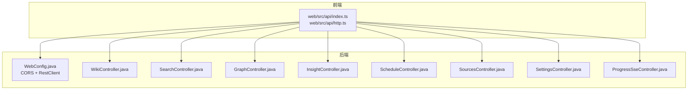
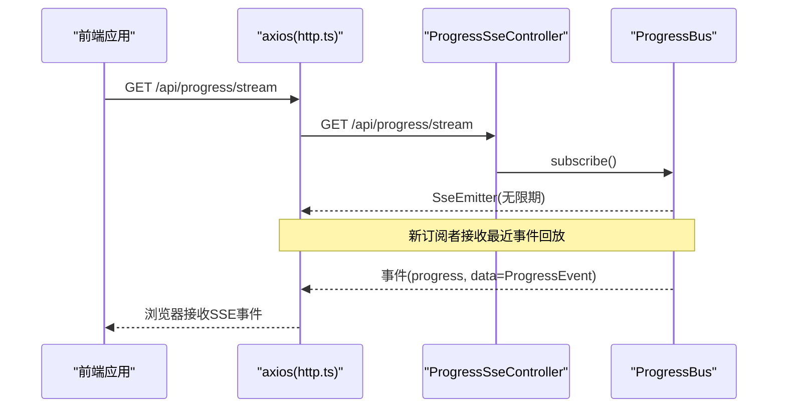
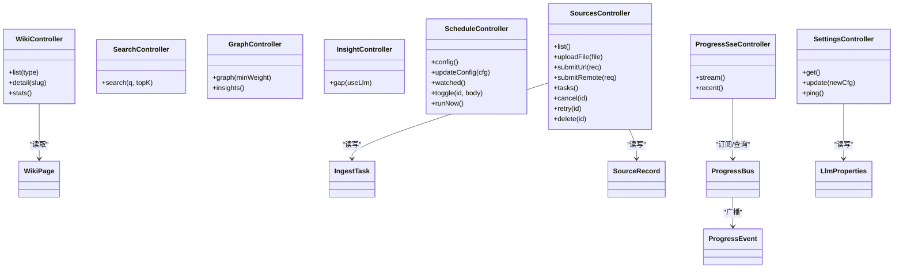

# API接口文档

<cite>
**本文引用的文件**
- [WikiController.java](file://src/main/java/com/example/llmwiki/api/WikiController.java)
- [SearchController.java](file://src/main/java/com/example/llmwiki/api/SearchController.java)
- [GraphController.java](file://src/main/java/com/example/llmwiki/api/GraphController.java)
- [InsightController.java](file://src/main/java/com/example/llmwiki/api/InsightController.java)
- [ScheduleController.java](file://src/main/java/com/example/llmwiki/api/ScheduleController.java)
- [SourcesController.java](file://src/main/java/com/example/llmwiki/api/SourcesController.java)
- [SettingsController.java](file://src/main/java/com/example/llmwiki/api/SettingsController.java)
- [ProgressSseController.java](file://src/main/java/com/example/llmwiki/api/ProgressSseController.java)
- [WebConfig.java](file://src/main/java/com/example/llmwiki/config/WebConfig.java)
- [LlmProperties.java](file://src/main/java/com/example/llmwiki/config/LlmProperties.java)
- [WikiPage.java](file://src/main/java/com/example/llmwiki/domain/WikiPage.java)
- [IngestTask.java](file://src/main/java/com/example/llmwiki/domain/IngestTask.java)
- [SourceRecord.java](file://src/main/java/com/example/llmwiki/domain/SourceRecord.java)
- [ProgressEvent.java](file://src/main/java/com/example/llmwiki/progress/ProgressEvent.java)
- [ProgressBus.java](file://src/main/java/com/example/llmwiki/progress/ProgressBus.java)
- [application.yml](file://src/main/resources/application.yml)
- [index.ts](file://web/src/api/index.ts)
- [http.ts](file://web/src/api/http.ts)
</cite>

## 目录
1. [简介](#简介)
2. [项目结构](#项目结构)
3. [核心组件](#核心组件)
4. [架构总览](#架构总览)
5. [详细组件分析](#详细组件分析)
6. [依赖关系分析](#依赖关系分析)
7. [性能考量](#性能考量)
8. [故障排查指南](#故障排查指南)
9. [结论](#结论)
10. [附录](#附录)

## 简介
本文件为 LLM Wiki 的后端 REST API 与前端集成接口的权威说明，覆盖以下接口模块：
- Wiki API（/api/wiki/*）
- 搜索 API（/api/search）
- 图谱 API（/api/graph）
- Insight 空白分析 API（/api/insights）
- 调度 API（/api/schedule）
- 数据源与任务 API（/api/sources）
- 设置 API（/api/settings）
- 进度推送 API（/api/progress）

同时涵盖：
- HTTP 方法与 URL 模式
- 请求/响应格式与参数校验
- 认证与权限控制
- SSE 实时通信机制
- 错误处理策略
- 使用示例（curl、JavaScript、Python）
- 版本管理与迁移建议

## 项目结构
后端采用 Spring Boot MVC 控制器层，按功能域划分 API 包，统一以 /api 前缀暴露 REST 接口；前端通过 axios 封装的 http.ts 发起请求，统一指向 /api。

图表来源
- [WebConfig.java:15-35](file://src/main/java/com/example/llmwiki/config/WebConfig.java#L15-L35)
- [WikiController.java:22-51](file://src/main/java/com/example/llmwiki/api/WikiController.java#L22-L51)
- [SearchController.java:18-32](file://src/main/java/com/example/llmwiki/api/SearchController.java#L18-L32)
- [GraphController.java:21-86](file://src/main/java/com/example/llmwiki/api/GraphController.java#L21-L86)
- [InsightController.java:16-31](file://src/main/java/com/example/llmwiki/api/InsightController.java#L16-L31)
- [ScheduleController.java:27-79](file://src/main/java/com/example/llmwiki/api/ScheduleController.java#L27-L79)
- [SourcesController.java:30-102](file://src/main/java/com/example/llmwiki/api/SourcesController.java#L30-L102)
- [SettingsController.java:24-71](file://src/main/java/com/example/llmwiki/api/SettingsController.java#L24-L71)
- [ProgressSseController.java:20-37](file://src/main/java/com/example/llmwiki/api/ProgressSseController.java#L20-L37)

章节来源
- [WebConfig.java:15-35](file://src/main/java/com/example/llmwiki/config/WebConfig.java#L15-L35)
- [application.yml:1-84](file://src/main/resources/application.yml#L1-L84)

## 核心组件
- 控制器层：各模块控制器负责路由与参数绑定，返回领域对象或简单 Map 结构。
- 领域模型：WikiPage、IngestTask、SourceRecord 等实体映射数据库表。
- 配置与属性：LlmProperties 提供 LLM 相关配置，application.yml 提供全局配置。
- SSE 进度总线：ProgressBus 维护订阅者列表并广播 ProgressEvent。

章节来源
- [WikiController.java:22-51](file://src/main/java/com/example/llmwiki/api/WikiController.java#L22-L51)
- [SourcesController.java:30-102](file://src/main/java/com/example/llmwiki/api/SourcesController.java#L30-L102)
- [SettingsController.java:24-71](file://src/main/java/com/example/llmwiki/api/SettingsController.java#L24-L71)
- [ProgressSseController.java:20-37](file://src/main/java/com/example/llmwiki/api/ProgressSseController.java#L20-L37)
- [ProgressBus.java:17-61](file://src/main/java/com/example/llmwiki/progress/ProgressBus.java#L17-L61)
- [LlmProperties.java:16-63](file://src/main/java/com/example/llmwiki/config/LlmProperties.java#L16-L63)
- [application.yml:31-77](file://src/main/resources/application.yml#L31-L77)

## 架构总览
后端通过 Spring MVC 暴露 REST 接口，前端通过 axios 统一发起请求。SSE 由 ProgressSseController 提供，ProgressBus 负责订阅与广播。

图表来源
- [ProgressSseController.java:27-30](file://src/main/java/com/example/llmwiki/api/ProgressSseController.java#L27-L30)
- [ProgressBus.java:26-41](file://src/main/java/com/example/llmwiki/progress/ProgressBus.java#L26-L41)
- [http.ts:1-17](file://web/src/api/http.ts#L1-L17)

## 详细组件分析

### Wiki API（/api/wiki/*）
- 列表查询
  - 方法与路径：GET /api/wiki/pages
  - 查询参数：type（可选，字符串）
  - 返回：WikiPage 列表
  - 说明：未提供 type 时返回全量，否则按类型过滤
- 详情查询
  - 方法与路径：GET /api/wiki/pages/{slug}
  - 路径参数：slug（字符串）
  - 返回：WikiPage 或 404
- 统计
  - 方法与路径：GET /api/wiki/stats
  - 返回：Map，包含 total 与按类型分组的计数

章节来源
- [WikiController.java:29-32](file://src/main/java/com/example/llmwiki/api/WikiController.java#L29-L32)
- [WikiController.java:34-39](file://src/main/java/com/example/llmwiki/api/WikiController.java#L34-L39)
- [WikiController.java:41-49](file://src/main/java/com/example/llmwiki/api/WikiController.java#L41-L49)
- [WikiPage.java:23-72](file://src/main/java/com/example/llmwiki/domain/WikiPage.java#L23-L72)

### 搜索 API（/api/search）
- 方法与路径：GET /api/search
- 查询参数：
  - q（必需，字符串，检索关键词）
  - topK（可选，默认 10，整数）
- 返回：搜索命中列表（具体结构由 HybridSearcher 决定）
- 异常：可能抛出异常，由框架转换为错误响应

章节来源
- [SearchController.java:25-30](file://src/main/java/com/example/llmwiki/api/SearchController.java#L25-L30)

### 图谱 API（/api/graph）
- 全量图
  - 方法与路径：GET /api/graph
  - 查询参数：minWeight（可选，默认 0，双精度）
  - 返回：Map，包含 nodes（AntV G6 节点数组）、edges（边数组）、communityCount
- 图洞察
  - 方法与路径：GET /api/graph/insights
  - 返回：Map，包含孤立节点、桥接节点、总节点数、总边数

章节来源
- [GraphController.java:31-74](file://src/main/java/com/example/llmwiki/api/GraphController.java#L31-L74)
- [GraphController.java:76-84](file://src/main/java/com/example/llmwiki/api/GraphController.java#L76-L84)

### Insight 空白分析 API（/api/insights）
- 空白分析
  - 方法与路径：GET /api/insights/gap
  - 查询参数：useLlm（可选，默认 true，布尔）
  - 返回：GapAnalyzer.GapReport（由分析器生成的报告对象）

章节来源
- [InsightController.java:26-29](file://src/main/java/com/example/llmwiki/api/InsightController.java#L26-L29)

### 调度 API（/api/schedule）
- 获取调度配置
  - 方法与路径：GET /api/schedule/config
  - 返回：IngestProperties.Scheduler（来自 application.yml 中 scheduler 配置）
- 更新调度配置
  - 方法与路径：POST /api/schedule/config
  - 请求体：部分字段可更新（cron、enabled）
  - 返回：Map，包含 ok 与当前调度器配置
- 列出被监控来源
  - 方法与路径：GET /api/schedule/watched
  - 返回：SourceRecord 列表（watchEnabled=true）
- 切换监控开关
  - 方法与路径：POST /api/schedule/sources/{id}/toggle
  - 请求体：{ enabled: boolean }
  - 返回：Map，包含 ok 与 watchEnabled
- 立即执行一次
  - 方法与路径：POST /api/schedule/run-now
  - 返回：Map，包含 ok

章节来源
- [ScheduleController.java:37-51](file://src/main/java/com/example/llmwiki/api/ScheduleController.java#L37-L51)
- [ScheduleController.java:53-68](file://src/main/java/com/example/llmwiki/api/ScheduleController.java#L53-L68)
- [ScheduleController.java:73-77](file://src/main/java/com/example/llmwiki/api/ScheduleController.java#L73-L77)
- [application.yml:71-73](file://src/main/resources/application.yml#L71-L73)

### 数据源与任务 API（/api/sources）
- 列表
  - 方法与路径：GET /api/sources
  - 返回：SourceRecord 列表
- 上传文件
  - 方法与路径：POST /api/sources/file
  - 表单字段：file（二进制文件）
  - 返回：IngestTask（入队结果）
- 提交 URL
  - 方法与路径：POST /api/sources/url
  - 请求体：{ url: string, watch: boolean }
  - 返回：IngestTask
- 提交远程文档（飞书/钉钉）
  - 方法与路径：POST /api/sources/remote
  - 请求体：{ kind: "FEISHU"|"DINGTALK", ref: string, displayName?: string, watch?: boolean }
  - 返回：IngestTask
- 任务列表
  - 方法与路径：GET /api/sources/tasks
  - 返回：IngestTask 列表（最多 50 条）
- 取消任务
  - 方法与路径：POST /api/sources/tasks/{id}/cancel
  - 返回：Map，包含 ok
- 重试任务
  - 方法与路径：POST /api/sources/tasks/{id}/retry
  - 返回：Map，包含 ok
- 删除来源
  - 方法与路径：DELETE /api/sources/{id}
  - 返回：Map，包含 ok

章节来源
- [SourcesController.java:40-48](file://src/main/java/com/example/llmwiki/api/SourcesController.java#L40-L48)
- [SourcesController.java:50-53](file://src/main/java/com/example/llmwiki/api/SourcesController.java#L50-L53)
- [SourcesController.java:55-61](file://src/main/java/com/example/llmwiki/api/SourcesController.java#L55-L61)
- [SourcesController.java:63-66](file://src/main/java/com/example/llmwiki/api/SourcesController.java#L63-L66)
- [SourcesController.java:68-72](file://src/main/java/com/example/llmwiki/api/SourcesController.java#L68-L72)
- [SourcesController.java:74-78](file://src/main/java/com/example/llmwiki/api/SourcesController.java#L74-L78)
- [SourcesController.java:80-84](file://src/main/java/com/example/llmwiki/api/SourcesController.java#L80-L84)

### 设置 API（/api/settings）
- 读取 LLM 配置
  - 方法与路径：GET /api/settings/llm
  - 返回：LlmProperties（当前配置）
- 更新 LLM 配置
  - 方法与路径：PUT /api/settings/llm
  - 请求体：部分字段可更新（chat、embedding、vision）
  - 返回：Map，包含 ok
- LLM 健康探测
  - 方法与路径：POST /api/settings/llm/ping
  - 返回：Map，包含 chat 与 embedding 子项，分别指示健康状态与维度信息

章节来源
- [SettingsController.java:34-51](file://src/main/java/com/example/llmwiki/api/SettingsController.java#L34-L51)
- [SettingsController.java:53-69](file://src/main/java/com/example/llmwiki/api/SettingsController.java#L53-L69)
- [LlmProperties.java:16-63](file://src/main/java/com/example/llmwiki/config/LlmProperties.java#L16-L63)

### 进度推送 API（/api/progress）
- SSE 流
  - 方法与路径：GET /api/progress/stream
  - 响应类型：text/event-stream
  - 返回：SseEmitter，事件名为 progress，数据为 ProgressEvent
- 最近事件
  - 方法与路径：GET /api/progress/recent
  - 返回：ProgressEvent 列表（最多 50 条）

章节来源
- [ProgressSseController.java:27-35](file://src/main/java/com/example/llmwiki/api/ProgressSseController.java#L27-L35)
- [ProgressBus.java:26-60](file://src/main/java/com/example/llmwiki/progress/ProgressBus.java#L26-L60)
- [ProgressEvent.java:16-43](file://src/main/java/com/example/llmwiki/progress/ProgressEvent.java#L16-L43)

## 依赖关系分析

图表来源
- [WikiController.java:22-51](file://src/main/java/com/example/llmwiki/api/WikiController.java#L22-L51)
- [SearchController.java:18-32](file://src/main/java/com/example/llmwiki/api/SearchController.java#L18-L32)
- [GraphController.java:21-86](file://src/main/java/com/example/llmwiki/api/GraphController.java#L21-L86)
- [InsightController.java:16-31](file://src/main/java/com/example/llmwiki/api/InsightController.java#L16-L31)
- [ScheduleController.java:27-79](file://src/main/java/com/example/llmwiki/api/ScheduleController.java#L27-L79)
- [SourcesController.java:30-102](file://src/main/java/com/example/llmwiki/api/SourcesController.java#L30-L102)
- [SettingsController.java:24-71](file://src/main/java/com/example/llmwiki/api/SettingsController.java#L24-L71)
- [ProgressSseController.java:20-37](file://src/main/java/com/example/llmwiki/api/ProgressSseController.java#L20-L37)
- [WikiPage.java:23-72](file://src/main/java/com/example/llmwiki/domain/WikiPage.java#L23-L72)
- [IngestTask.java:23-62](file://src/main/java/com/example/llmwiki/domain/IngestTask.java#L23-L62)
- [SourceRecord.java:23-64](file://src/main/java/com/example/llmwiki/domain/SourceRecord.java#L23-L64)
- [ProgressEvent.java:16-43](file://src/main/java/com/example/llmwiki/progress/ProgressEvent.java#L16-L43)
- [ProgressBus.java:17-61](file://src/main/java/com/example/llmwiki/progress/ProgressBus.java#L17-L61)
- [LlmProperties.java:16-63](file://src/main/java/com/example/llmwiki/config/LlmProperties.java#L16-L63)

## 性能考量
- 搜索与索引：HybridSearcher 的 topK 参数影响返回规模，建议根据业务场景调整默认值。
- SSE 广播：ProgressBus 使用并发安全容器与回放最近事件，避免新订阅者丢失上下文。
- 文件上传：Spring 配置限制了最大文件与请求大小，确保大文件上传稳定性。
- 调度与重试：application.yml 中的 scheduler.cron、ingest.max-retry 等参数影响吞吐与可靠性。

章节来源
- [application.yml:8-10](file://src/main/resources/application.yml#L8-L10)
- [ProgressBus.java:21-24](file://src/main/java/com/example/llmwiki/progress/ProgressBus.java#L21-L24)

## 故障排查指南
- CORS 问题：确认浏览器允许凭据与跨域头，参考 WebConfig 的 CORS 配置。
- SSE 连接断开：SseEmitter 在完成、超时、错误时会移除订阅者，前端需实现重连逻辑。
- LLM 健康探测失败：检查 SettingsController.ping 的异常分支，关注 chat/embedding 的错误信息。
- 任务状态异常：查看 IngestTask 的状态枚举（PENDING/RUNNING/SUCCESS/FAILED/CANCELLED/SKIPPED）与错误信息字段。

章节来源
- [WebConfig.java:18-25](file://src/main/java/com/example/llmwiki/config/WebConfig.java#L18-L25)
- [ProgressBus.java:26-41](file://src/main/java/com/example/llmwiki/progress/ProgressBus.java#L26-L41)
- [SettingsController.java:53-69](file://src/main/java/com/example/llmwiki/api/SettingsController.java#L53-L69)
- [IngestTask.java:38-40](file://src/main/java/com/example/llmwiki/domain/IngestTask.java#L38-L40)

## 结论
本 API 文档系统性梳理了 LLM Wiki 的后端接口与前端集成方式，明确了各模块职责、数据模型与实时通信机制。建议在生产环境中结合 CORS、SSE 重连与 LLM 配置热更新策略，确保稳定与可观测性。

## 附录

### HTTP 方法与 URL 模式
- GET：查询列表、详情、统计、配置、SSE 流、最近事件
- POST：提交数据源、立即执行调度、取消/重试任务
- PUT：更新设置
- DELETE：删除来源

章节来源
- [WikiController.java:29-49](file://src/main/java/com/example/llmwiki/api/WikiController.java#L29-L49)
- [SearchController.java:25-30](file://src/main/java/com/example/llmwiki/api/SearchController.java#L25-L30)
- [GraphController.java:31-84](file://src/main/java/com/example/llmwiki/api/GraphController.java#L31-L84)
- [InsightController.java:26-29](file://src/main/java/com/example/llmwiki/api/InsightController.java#L26-L29)
- [ScheduleController.java:37-77](file://src/main/java/com/example/llmwiki/api/ScheduleController.java#L37-L77)
- [SourcesController.java:40-84](file://src/main/java/com/example/llmwiki/api/SourcesController.java#L40-L84)
- [SettingsController.java:34-69](file://src/main/java/com/example/llmwiki/api/SettingsController.java#L34-L69)
- [ProgressSseController.java:27-35](file://src/main/java/com/example/llmwiki/api/ProgressSseController.java#L27-L35)

### 请求/响应格式与参数校验
- JSON 请求体：SettingsController.update、SourcesController.submitUrl、SourcesController.submitRemote、ScheduleController.updateConfig
- 表单上传：SourcesController.uploadFile（multipart/form-data）
- 查询参数：SearchController、GraphController、WikiController、InsightController、ScheduleController.toggle
- 响应：多数接口返回领域对象或 Map；SSE 返回事件流

章节来源
- [SettingsController.java:40-51](file://src/main/java/com/example/llmwiki/api/SettingsController.java#L40-L51)
- [SourcesController.java:45-53](file://src/main/java/com/example/llmwiki/api/SourcesController.java#L45-L53)
- [SourcesController.java:55-61](file://src/main/java/com/example/llmwiki/api/SourcesController.java#L55-L61)
- [ScheduleController.java:42-51](file://src/main/java/com/example/llmwiki/api/ScheduleController.java#L42-L51)
- [SearchController.java:26-30](file://src/main/java/com/example/llmwiki/api/SearchController.java#L26-L30)
- [GraphController.java:32-74](file://src/main/java/com/example/llmwiki/api/GraphController.java#L32-L74)
- [WikiController.java:30-39](file://src/main/java/com/example/llmwiki/api/WikiController.java#L30-L39)
- [InsightController.java:27-28](file://src/main/java/com/example/llmwiki/api/InsightController.java#L27-L28)

### 认证与权限控制
- 当前控制器未显式声明鉴权注解，CORS 已开启允许凭据；建议在网关或自定义拦截器中引入 API Key/会话管理与权限控制。

章节来源
- [WebConfig.java:18-25](file://src/main/java/com/example/llmwiki/config/WebConfig.java#L18-L25)

### SSE 实时通信
- 事件格式：事件名 progress，数据为 ProgressEvent 对象
- 客户端连接管理：订阅者断开自动清理；新订阅者接收最近事件回放
- 前端集成：index.ts 提供 recentProgress 调用

章节来源
- [ProgressSseController.java:27-35](file://src/main/java/com/example/llmwiki/api/ProgressSseController.java#L27-L35)
- [ProgressBus.java:26-60](file://src/main/java/com/example/llmwiki/progress/ProgressBus.java#L26-L60)
- [index.ts:68-70](file://web/src/api/index.ts#L68-L70)

### 错误处理策略
- 异常传播：SearchController.search 可能抛出异常，由框架转为错误响应
- LLM 健康探测：SettingsController.ping 捕获 LlmException 并返回错误信息
- SSE：连接异常时自动移除订阅者

章节来源
- [SearchController.java:28-30](file://src/main/java/com/example/llmwiki/api/SearchController.java#L28-L30)
- [SettingsController.java:55-69](file://src/main/java/com/example/llmwiki/api/SettingsController.java#L55-L69)
- [ProgressBus.java:31-38](file://src/main/java/com/example/llmwiki/progress/ProgressBus.java#L31-L38)

### API 使用示例

- curl 示例（替换为实际主机与端口）
  - 获取 Wiki 页面列表：curl "http://localhost:8080/api/wiki/pages?type=concept"
  - 搜索：curl "http://localhost:8080/api/search?q=LLM&topK=5"
  - 获取图谱：curl "http://localhost:8080/api/graph?minWeight=0.1"
  - 获取图洞察：curl "http://localhost:8080/api/graph/insights"
  - 获取空白分析：curl "http://localhost:8080/api/insights/gap?useLlm=false"
  - 获取调度配置：curl "http://localhost:8080/api/schedule/config"
  - 更新调度配置：curl -X POST "http://localhost:8080/api/schedule/config" -H "Content-Type: application/json" -d '{"cron":"0 0 4 * * ?","enabled":true}'
  - 切换监控：curl -X POST "http://localhost:8080/api/schedule/sources/1/toggle" -H "Content-Type: application/json" -d '{"enabled":true}'
  - 立即执行：curl -X POST "http://localhost:8080/api/schedule/run-now"
  - 列表数据源：curl "http://localhost:8080/api/sources"
  - 上传文件：curl -X POST "http://localhost:8080/api/sources/file" -F "file=@/path/to/doc.pdf"
  - 提交 URL：curl -X POST "http://localhost:8080/api/sources/url" -H "Content-Type: application/json" -d '{"url":"https://example.com","watch":true}'
  - 提交远程文档：curl -X POST "http://localhost:8080/api/sources/remote" -H "Content-Type: application/json" -d '{"kind":"FEISHU","ref":"doc_token","displayName":"文档A","watch":false}'
  - 任务列表：curl "http://localhost:8080/api/sources/tasks"
  - 取消任务：curl -X POST "http://localhost:8080/api/sources/tasks/1/cancel"
  - 重试任务：curl -X POST "http://localhost:8080/api/sources/tasks/1/retry"
  - 删除来源：curl -X DELETE "http://localhost:8080/api/sources/1"
  - 获取 LLM 配置：curl "http://localhost:8080/api/settings/llm"
  - 更新 LLM 配置：curl -X PUT "http://localhost:8080/api/settings/llm" -H "Content-Type: application/json" -d '{"chat":{"model":"gpt-4o-mini"},"embedding":{"dimensions":1536}}'
  - LLM 健康探测：curl -X POST "http://localhost:8080/api/settings/llm/ping"
  - 进度流：curl "http://localhost:8080/api/progress/stream"
  - 最近事件：curl "http://localhost:8080/api/progress/recent"

- JavaScript（前端 axios）
  - 参考 web/src/api/index.ts 中的函数封装与 http.ts 的基础配置

- Python（requests）
  - 获取 LLM 配置：requests.get("http://localhost:8080/api/settings/llm")
  - 上传文件：requests.post("http://localhost:8080/api/sources/file", files={"file": open("doc.pdf", "rb")})
  - SSE 流：requests.get("http://localhost:8080/api/progress/stream", stream=True)

章节来源
- [index.ts:1-70](file://web/src/api/index.ts#L1-L70)
- [http.ts:1-17](file://web/src/api/http.ts#L1-L17)

### 版本管理与迁移
- 版本策略：当前未发现显式的 API 版本前缀（如 /api/v1），建议后续引入 /api/v1 以保障向后兼容
- 向后兼容：新增字段建议保持可选，避免破坏既有客户端
- 迁移指南：当变更现有字段或删除接口时，提供过渡期与废弃提示，并在下一大版本中移除

[本节为通用指导，无需特定文件来源]