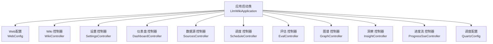
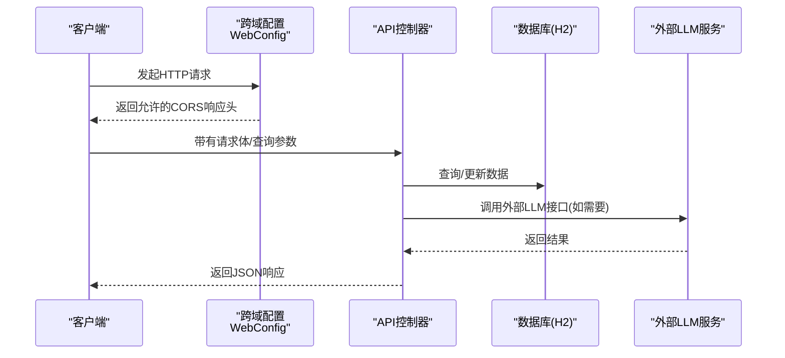
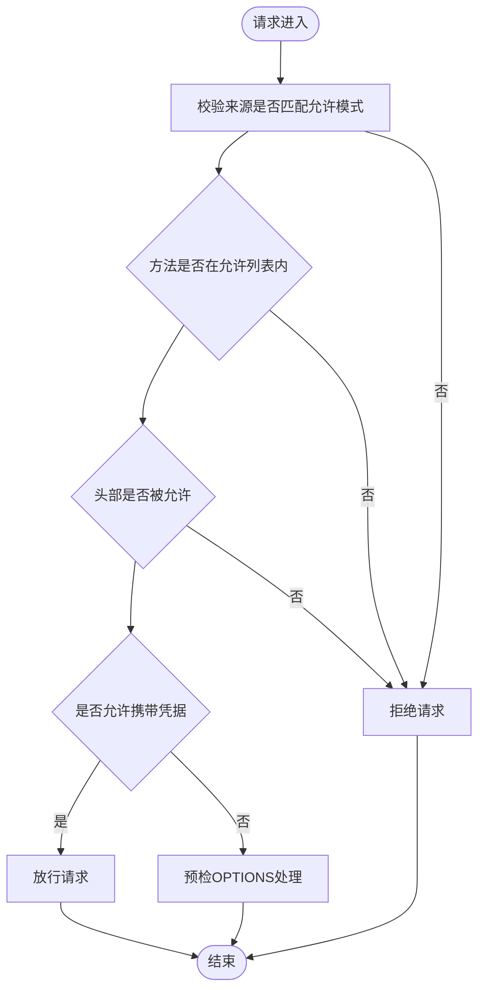
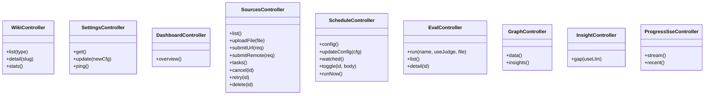
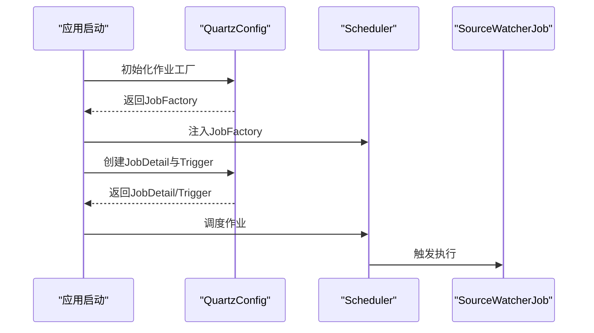
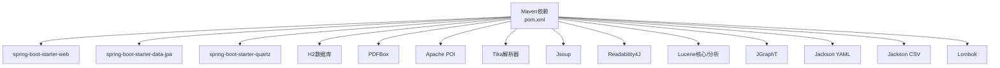

# API认证与授权

<cite>
**本文引用的文件**
- [WebConfig.java](file://src/main/java/com/example/llmwiki/config/WebConfig.java)
- [application.yml](file://src/main/resources/application.yml)
- [LlmWikiApplication.java](file://src/main/java/com/example/llmwiki/LlmWikiApplication.java)
- [WikiController.java](file://src/main/java/com/example/llmwiki/api/WikiController.java)
- [SettingsController.java](file://src/main/java/com/example/llmwiki/api/SettingsController.java)
- [DashboardController.java](file://src/main/java/com/example/llmwiki/api/DashboardController.java)
- [SourcesController.java](file://src/main/java/com/example/llmwiki/api/SourcesController.java)
- [ScheduleController.java](file://src/main/java/com/example/llmwiki/api/ScheduleController.java)
- [EvalController.java](file://src/main/java/com/example/llmwiki/api/EvalController.java)
- [GraphController.java](file://src/main/java/com/example/llmwiki/api/GraphController.java)
- [InsightController.java](file://src/main/java/com/example/llmwiki/api/InsightController.java)
- [ProgressSseController.java](file://src/main/java/com/example/llmwiki/api/ProgressSseController.java)
- [QuartzConfig.java](file://src/main/java/com/example/llmwiki/scheduler/QuartzConfig.java)
- [pom.xml](file://pom.xml)
</cite>

## 目录
1. [简介](#简介)
2. [项目结构](#项目结构)
3. [核心组件](#核心组件)
4. [架构总览](#架构总览)
5. [详细组件分析](#详细组件分析)
6. [依赖分析](#依赖分析)
7. [性能考虑](#性能考虑)
8. [故障排查指南](#故障排查指南)
9. [结论](#结论)
10. [附录](#附录)

## 简介
本文件聚焦于LLM Wiki的API认证与授权机制，结合现有代码库进行系统性梳理。当前仓库未实现显式的认证与授权逻辑（例如基于角色的访问控制RBAC、API密钥、会话或OAuth），但提供了跨域配置与基础API端点。本文在不臆测缺失功能的前提下，对现有能力进行准确说明，并给出安全边界、配置项与最佳实践建议，帮助后续扩展安全能力。

## 项目结构
- 后端采用Spring Boot，主应用入口位于应用启动类。
- Web层通过配置类启用跨域，并提供共享的RestClient Bean。
- API控制器按功能模块划分，涵盖Wiki、设置、仪表盘、数据源、调度、评估、图谱、洞察与进度流等。
- 数据持久化使用JPA/H2数据库，任务调度使用Quartz。

图表来源
- [LlmWikiApplication.java:19-26](file://src/main/java/com/example/llmwiki/LlmWikiApplication.java#L19-L26)
- [WebConfig.java:15-34](file://src/main/java/com/example/llmwiki/config/WebConfig.java#L15-L34)
- [WikiController.java:22-50](file://src/main/java/com/example/llmwiki/api/WikiController.java#L22-L50)
- [SettingsController.java:24-70](file://src/main/java/com/example/llmwiki/api/SettingsController.java#L24-L70)
- [DashboardController.java:22-47](file://src/main/java/com/example/llmwiki/api/DashboardController.java#L22-L47)
- [SourcesController.java:34-101](file://src/main/java/com/example/llmwiki/api/SourcesController.java#L34-L101)
- [ScheduleController.java:27-78](file://src/main/java/com/example/llmwiki/api/ScheduleController.java#L27-L78)
- [EvalController.java:26-53](file://src/main/java/com/example/llmwiki/api/EvalController.java#L26-L53)
- [GraphController.java:20-85](file://src/main/java/com/example/llmwiki/api/GraphController.java#L20-L85)
- [InsightController.java:16-30](file://src/main/java/com/example/llmwiki/api/InsightController.java#L16-L30)
- [ProgressSseController.java:19-36](file://src/main/java/com/example/llmwiki/api/ProgressSseController.java#L19-L36)
- [QuartzConfig.java:37-89](file://src/main/java/com/example/llmwiki/scheduler/QuartzConfig.java#L37-L89)

章节来源
- [LlmWikiApplication.java:19-26](file://src/main/java/com/example/llmwiki/LlmWikiApplication.java#L19-L26)
- [WebConfig.java:15-34](file://src/main/java/com/example/llmwiki/config/WebConfig.java#L15-L34)

## 核心组件
- Web配置：提供全局跨域规则与共享RestClient Bean。
- API控制器：暴露REST端点，覆盖内容管理、设置、评估、图谱、洞察与进度流等。
- 调度配置：通过Quartz实现作业工厂与触发器，支持依赖注入与Cron调度。
- 应用配置：通过YAML集中管理服务器端口、数据库连接、存储根目录、LLM参数、解析器与调度等。

章节来源
- [WebConfig.java:15-34](file://src/main/java/com/example/llmwiki/config/WebConfig.java#L15-L34)
- [application.yml:1-84](file://src/main/resources/application.yml#L1-L84)
- [QuartzConfig.java:37-89](file://src/main/java/com/example/llmwiki/scheduler/QuartzConfig.java#L37-L89)

## 架构总览
下图展示从客户端到后端控制器的典型请求路径，以及跨域与共享客户端的参与。

图表来源
- [WebConfig.java:18-25](file://src/main/java/com/example/llmwiki/config/WebConfig.java#L18-L25)
- [WikiController.java:29-39](file://src/main/java/com/example/llmwiki/api/WikiController.java#L29-L39)
- [SettingsController.java:34-70](file://src/main/java/com/example/llmwiki/api/SettingsController.java#L34-L70)
- [application.yml:11-25](file://src/main/resources/application.yml#L11-L25)

## 详细组件分析

### Web配置与跨域
- 跨域策略：对所有路径开放GET/POST/PUT/DELETE/OPTIONS，允许任意来源模式、任意头部，并允许携带凭据。
- 共享RestClient：提供可复用的HTTP客户端，供LLM客户端与网页解析器使用。

图表来源
- [WebConfig.java:18-25](file://src/main/java/com/example/llmwiki/config/WebConfig.java#L18-L25)

章节来源
- [WebConfig.java:15-34](file://src/main/java/com/example/llmwiki/config/WebConfig.java#L15-L34)

### API控制器概览
- Wiki控制器：提供页面列表、详情查询与类型统计。
- 设置控制器：提供LLM配置读取/更新与健康探测。
- 仪表盘控制器：聚合统计信息，便于前端首屏加载。
- 数据源控制器：文件上传、URL提交、远程来源提交、任务管理与删除。
- 调度控制器：读取/更新调度配置、切换监控开关、立即执行作业。
- 评估控制器：运行评估、列出报告、查看报告详情。
- 图谱控制器：返回图谱数据与洞察指标。
- 洞察控制器：计算知识空白报告。
- 进度流控制器：Server-Sent Events推送处理进度事件。

图表来源
- [WikiController.java:22-50](file://src/main/java/com/example/llmwiki/api/WikiController.java#L22-L50)
- [SettingsController.java:24-70](file://src/main/java/com/example/llmwiki/api/SettingsController.java#L24-L70)
- [DashboardController.java:22-47](file://src/main/java/com/example/llmwiki/api/DashboardController.java#L22-L47)
- [SourcesController.java:34-101](file://src/main/java/com/example/llmwiki/api/SourcesController.java#L34-L101)
- [ScheduleController.java:27-78](file://src/main/java/com/example/llmwiki/api/ScheduleController.java#L27-L78)
- [EvalController.java:26-53](file://src/main/java/com/example/llmwiki/api/EvalController.java#L26-L53)
- [GraphController.java:20-85](file://src/main/java/com/example/llmwiki/api/GraphController.java#L20-L85)
- [InsightController.java:16-30](file://src/main/java/com/example/llmwiki/api/InsightController.java#L16-L30)
- [ProgressSseController.java:19-36](file://src/main/java/com/example/llmwiki/api/ProgressSseController.java#L19-L36)

章节来源
- [WikiController.java:22-50](file://src/main/java/com/example/llmwiki/api/WikiController.java#L22-L50)
- [SettingsController.java:24-70](file://src/main/java/com/example/llmwiki/api/SettingsController.java#L24-L70)
- [DashboardController.java:22-47](file://src/main/java/com/example/llmwiki/api/DashboardController.java#L22-L47)
- [SourcesController.java:34-101](file://src/main/java/com/example/llmwiki/api/SourcesController.java#L34-L101)
- [ScheduleController.java:27-78](file://src/main/java/com/example/llmwiki/api/ScheduleController.java#L27-L78)
- [EvalController.java:26-53](file://src/main/java/com/example/llmwiki/api/EvalController.java#L26-L53)
- [GraphController.java:20-85](file://src/main/java/com/example/llmwiki/api/GraphController.java#L20-L85)
- [InsightController.java:16-30](file://src/main/java/com/example/llmwiki/api/InsightController.java#L16-L30)
- [ProgressSseController.java:19-36](file://src/main/java/com/example/llmwiki/api/ProgressSseController.java#L19-L36)

### 调度与作业工厂
- 通过自定义JobFactory让Quartz使用Spring容器实例化作业，支持依赖注入。
- 使用Cron表达式配置触发器，支持动态更新调度配置。

图表来源
- [QuartzConfig.java:37-89](file://src/main/java/com/example/llmwiki/scheduler/QuartzConfig.java#L37-L89)

章节来源
- [QuartzConfig.java:37-89](file://src/main/java/com/example/llmwiki/scheduler/QuartzConfig.java#L37-L89)

## 依赖分析
- Spring Boot Starter：web、data-jpa、validation、quartz。
- 数据库：H2嵌入式数据库。
- 文件解析与爬虫：PDFBox、POI、Tika、Jsoup、Readability4J。
- 全文检索：Lucene核心与分析包。
- 图算法：JGraphT。
- YAML与CSV处理：Jackson Dataformat。
- Lombok简化实体与DTO。

图表来源
- [pom.xml:36-159](file://pom.xml#L36-L159)

章节来源
- [pom.xml:36-159](file://pom.xml#L36-L159)

## 性能考虑
- 跨域允许任意来源与头部，便于开发调试，但在生产环境应收紧来源白名单以降低风险。
- 共享RestClient减少连接开销，适合高频外部调用场景。
- Quartz作业工厂确保作业可注入依赖，避免重复实例化带来的资源浪费。
- 数据库连接与DDL策略由YAML配置，注意在生产中合理设置连接池与事务隔离级别。

## 故障排查指南
- 跨域问题：确认浏览器是否收到允许的来源、方法与头部；检查是否携带凭据且已正确配置。
- CORS预检失败：确保OPTIONS方法被允许，且预检缓存时间合理。
- 外部LLM调用异常：检查设置接口中的健康探测返回，定位具体错误（如鉴权失败、网络超时）。
- 数据库连接异常：核对H2控制台路径与凭证，确认数据库文件存在且可写。
- 调度未生效：确认Quartz配置与Cron表达式，检查作业工厂是否成功注入。

章节来源
- [WebConfig.java:18-25](file://src/main/java/com/example/llmwiki/config/WebConfig.java#L18-L25)
- [SettingsController.java:53-69](file://src/main/java/com/example/llmwiki/api/SettingsController.java#L53-L69)
- [application.yml:11-25](file://src/main/resources/application.yml#L11-L25)
- [QuartzConfig.java:85-89](file://src/main/java/com/example/llmwiki/scheduler/QuartzConfig.java#L85-L89)

## 结论
当前代码库未实现显式的认证与授权机制，但具备良好的跨域与共享客户端基础设施。建议在保持现有能力的基础上，逐步引入认证（如API密钥/会话/OAuth）与授权（RBAC/资源级授权），并完善安全头、HTTPS与审计日志等配置。本文档为后续安全增强提供参考框架与最佳实践建议。

## 附录

### 安全边界与配置要点
- CORS设置：生产环境应限制来源模式与允许的方法/头部，谨慎开启凭据。
- HTTPS配置：建议在网关或反向代理层强制HTTPS，避免明文传输。
- 安全头：建议添加CSP、X-Frame-Options、X-Content-Type-Options、Referrer-Policy等。
- 审计日志：记录关键操作（设置变更、评估运行、数据源增删改）与异常事件。

章节来源
- [WebConfig.java:18-25](file://src/main/java/com/example/llmwiki/config/WebConfig.java#L18-L25)
- [application.yml:1-84](file://src/main/resources/application.yml#L1-84)

### 认证与授权机制设计建议
- 认证方式：API密钥（短期令牌）、会话管理（Cookie/HttpOnly/SameSite）、OAuth（可选）。
- 授权策略：基于角色的访问控制（RBAC），细粒度权限矩阵，资源级授权（按用户/组织隔离）。
- 安全配置：CORS白名单、HTTPS、安全头、CSRF保护（如使用同源策略或Token）、XSS防护（输入过滤/输出编码）、SQL注入防护（参数化查询/ORM）。
- 最佳实践：最小权限原则、定期轮换密钥、短生命周期令牌、多因子认证（MFA）、审计与告警。

### 认证流程示例
- 登录流程：客户端提交凭据 → 服务端校验 → 生成短期令牌（含过期时间）→ 返回令牌。
- 令牌获取：受保护端点携带令牌 → 服务端验证签名与有效期 → 放行请求。
- 权限验证：根据用户角色与资源标识检查权限 → 拒绝或放行。

### 安全测试指南
- 漏洞扫描：静态分析（依赖版本、敏感信息泄露）、动态扫描（OWASP ZAP/ Burp Suite）。
- 渗透测试：模拟常见攻击（CSRF、XSS、SQL注入、暴力破解、越权访问）。
- 安全评估：访问控制矩阵审查、日志完整性检查、备份与恢复演练。