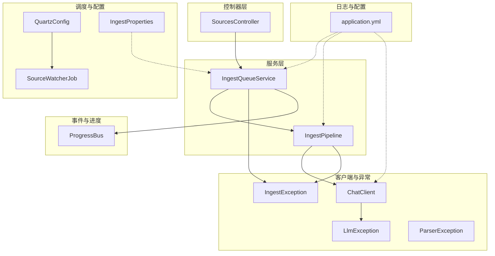
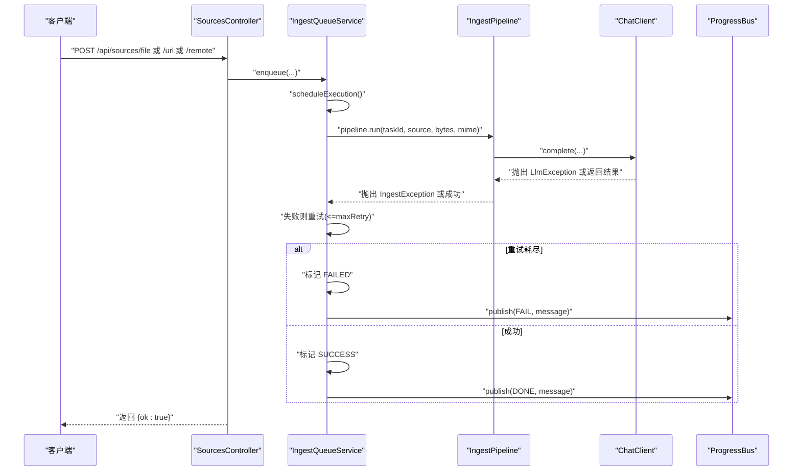
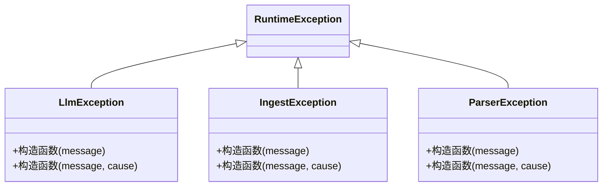
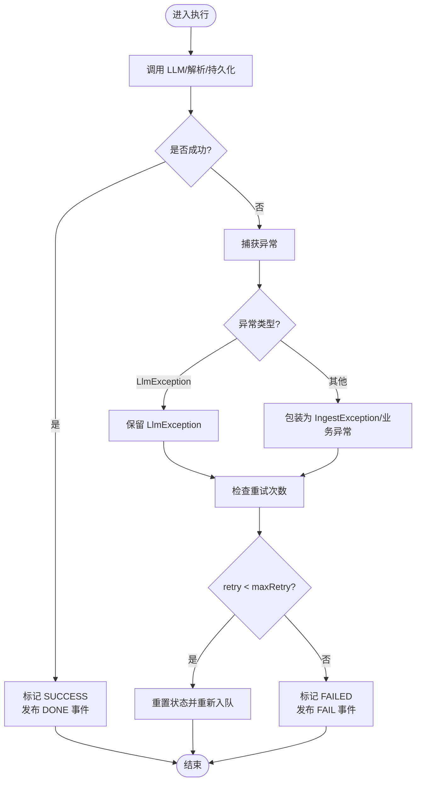
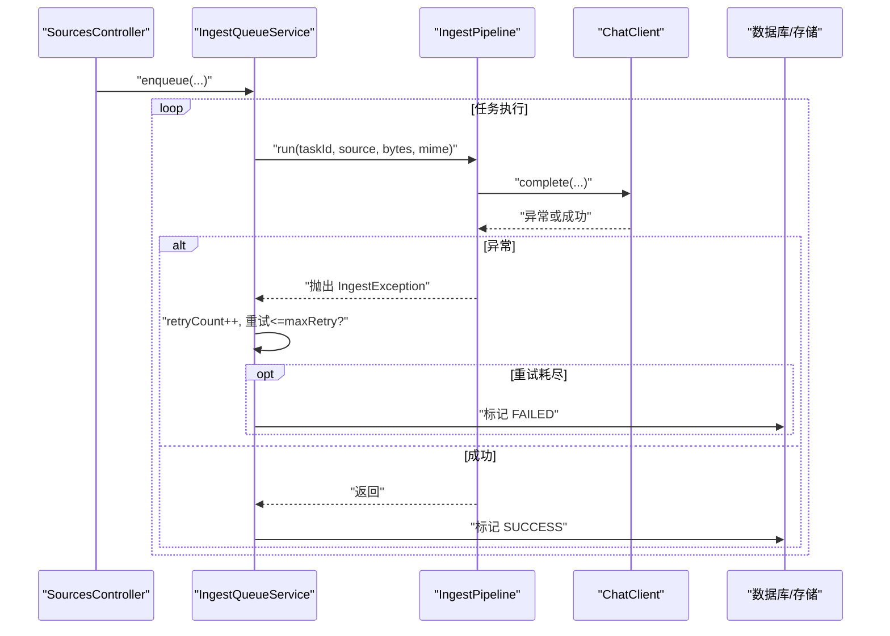
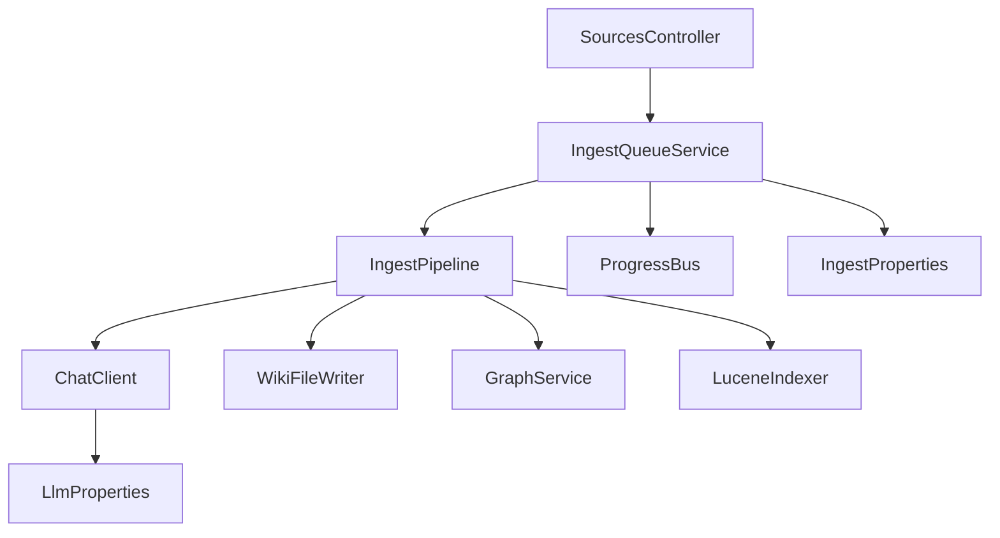

# API错误处理

<cite>
**本文引用的文件**
- [LlmException.java](file://src/main/java/com/example/llmwiki/llm/LlmException.java)
- [IngestException.java](file://src/main/java/com/example/llmwiki/ingest/IngestException.java)
- [ParserException.java](file://src/main/java/com/example/llmwiki/parser/ParserException.java)
- [IngestPipeline.java](file://src/main/java/com/example/llmwiki/ingest/IngestPipeline.java)
- [ChatClient.java](file://src/main/java/com/example/llmwiki/llm/ChatClient.java)
- [IngestQueueService.java](file://src/main/java/com/example/llmwiki/queue/IngestQueueService.java)
- [SourcesController.java](file://src/main/java/com/example/llmwiki/api/SourcesController.java)
- [application.yml](file://src/main/resources/application.yml)
- [WebConfig.java](file://src/main/java/com/example/llmwiki/config/WebConfig.java)
- [ProgressBus.java](file://src/main/java/com/example/llmwiki/progress/ProgressBus.java)
- [GapAnalyzer.java](file://src/main/java/com/example/llmwiki/insight/GapAnalyzer.java)
- [IngestProperties.java](file://src/main/java/com/example/llmwiki/config/IngestProperties.java)
- [QuartzConfig.java](file://src/main/java/com/example/llmwiki/scheduler/QuartzConfig.java)
- [SourceWatcherJob.java](file://src/main/java/com/example/llmwiki/scheduler/SourceWatcherJob.java)
- [WikiFileWriter.java](file://src/main/java/com/example/llmwiki/ingest/WikiFileWriter.java)
</cite>

## 目录
1. [简介](#简介)
2. [项目结构](#项目结构)
3. [核心组件](#核心组件)
4. [架构总览](#架构总览)
5. [详细组件分析](#详细组件分析)
6. [依赖分析](#依赖分析)
7. [性能考量](#性能考量)
8. [故障排查指南](#故障排查指南)
9. [结论](#结论)
10. [附录](#附录)

## 简介
本文件系统性梳理 LLM Wiki 的 API 错误处理机制，覆盖异常分类、错误传播路径、错误恢复策略、错误码与响应格式、日志记录与审计、以及最佳实践与调试指南。重点围绕三类领域异常：LLM 相关异常（LlmException）、摄取异常（IngestException）、解析异常（ParserException），并结合摄取流水线、队列服务、进度总线与控制器层，给出端到端的错误处理视图。

## 项目结构
从错误处理视角，系统的关键模块包括：
- 异常定义层：llm、ingest、parser 子包中的领域异常类
- 服务执行层：IngestPipeline（摄取流水线）、IngestQueueService（队列与重试）
- 通信与客户端：ChatClient（LLM 客户端）
- 控制器层：SourcesController（对外 API）
- 进度与事件：ProgressBus（SSE 进度广播）
- 调度与恢复：QuartzConfig、SourceWatcherJob、IngestProperties
- 日志与配置：application.yml（日志级别）

图表来源
- [SourcesController.java:34-101](file://src/main/java/com/example/llmwiki/api/SourcesController.java#L34-L101)
- [IngestQueueService.java:1-214](file://src/main/java/com/example/llmwiki/queue/IngestQueueService.java#L1-L214)
- [IngestPipeline.java:1-251](file://src/main/java/com/example/llmwiki/ingest/IngestPipeline.java#L1-L251)
- [ChatClient.java:1-108](file://src/main/java/com/example/llmwiki/llm/ChatClient.java#L1-L108)
- [ProgressBus.java:1-61](file://src/main/java/com/example/llmwiki/progress/ProgressBus.java#L1-L61)
- [QuartzConfig.java:1-89](file://src/main/java/com/example/llmwiki/scheduler/QuartzConfig.java#L1-L89)
- [SourceWatcherJob.java:1-67](file://src/main/java/com/example/llmwiki/scheduler/SourceWatcherJob.java#L1-L67)
- [IngestProperties.java:1-32](file://src/main/java/com/example/llmwiki/config/IngestProperties.java#L1-L32)
- [application.yml:1-84](file://src/main/resources/application.yml#L1-L84)

章节来源
- [SourcesController.java:34-101](file://src/main/java/com/example/llmwiki/api/SourcesController.java#L34-L101)
- [IngestQueueService.java:1-214](file://src/main/java/com/example/llmwiki/queue/IngestQueueService.java#L1-L214)
- [IngestPipeline.java:1-251](file://src/main/java/com/example/llmwiki/ingest/IngestPipeline.java#L1-L251)
- [ChatClient.java:1-108](file://src/main/java/com/example/llmwiki/llm/ChatClient.java#L1-L108)
- [ProgressBus.java:1-61](file://src/main/java/com/example/llmwiki/progress/ProgressBus.java#L1-L61)
- [QuartzConfig.java:1-89](file://src/main/java/com/example/llmwiki/scheduler/QuartzConfig.java#L1-L89)
- [SourceWatcherJob.java:1-67](file://src/main/java/com/example/llmwiki/scheduler/SourceWatcherJob.java#L1-L67)
- [IngestProperties.java:1-32](file://src/main/java/com/example/llmwiki/config/IngestProperties.java#L1-L32)
- [application.yml:1-84](file://src/main/resources/application.yml#L1-L84)

## 核心组件
- LlmException：LLM 调用相关异常，用于封装 LLM 客户端调用失败、鉴权缺失、返回空等场景。
- IngestException：摄取阶段解析 LLM JSON 失败或未生成页面等结构化错误。
- ParserException：解析器异常（在当前代码中定义，但未在执行路径中直接使用）。
- IngestPipeline：两阶段 CoT 摄取流水线，负责解析、分析、生成、索引与图谱更新，并在关键步骤抛出 IngestException 或捕获异常并转换为业务错误。
- IngestQueueService：单线程串行执行、取消标志、失败重试、最大重试次数由配置控制。
- ChatClient：统一的 LLM 客户端，负责校验配置、发起请求、包装 LlmException。
- ProgressBus：SSE 进度事件广播，向订阅者推送成功/失败事件。
- SourcesController：对外 API，提交任务、查询任务、取消/重试任务，返回简单 JSON 结果。
- application.yml：日志级别配置，影响错误日志可见性与敏感信息过滤倾向。
- QuartzConfig/SourceWatcherJob：定时刷新 watched 来源，异常被记录为警告，不中断调度循环。
- WikiFileWriter：写入日志文件，异常被降级为 debug 日志，不影响主流程。

章节来源
- [LlmException.java:1-19](file://src/main/java/com/example/llmwiki/llm/LlmException.java#L1-L19)
- [IngestException.java:1-18](file://src/main/java/com/example/llmwiki/ingest/IngestException.java#L1-L18)
- [ParserException.java:1-19](file://src/main/java/com/example/llmwiki/parser/ParserException.java#L1-L19)
- [IngestPipeline.java:111-177](file://src/main/java/com/example/llmwiki/ingest/IngestPipeline.java#L111-L177)
- [IngestQueueService.java:194-211](file://src/main/java/com/example/llmwiki/queue/IngestQueueService.java#L194-L211)
- [ChatClient.java:50-86](file://src/main/java/com/example/llmwiki/llm/ChatClient.java#L50-L86)
- [ProgressBus.java:43-55](file://src/main/java/com/example/llmwiki/progress/ProgressBus.java#L43-L55)
- [SourcesController.java:45-78](file://src/main/java/com/example/llmwiki/api/SourcesController.java#L45-L78)
- [application.yml:78-84](file://src/main/resources/application.yml#L78-L84)
- [QuartzConfig.java:1-89](file://src/main/java/com/example/llmwiki/scheduler/QuartzConfig.java#L1-L89)
- [SourceWatcherJob.java:47-64](file://src/main/java/com/example/llmwiki/scheduler/SourceWatcherJob.java#L47-L64)
- [WikiFileWriter.java:48-59](file://src/main/java/com/example/llmwiki/ingest/WikiFileWriter.java#L48-L59)

## 架构总览
下图展示从 API 到摄取、再到 LLM 调用与进度反馈的错误传播路径与恢复策略：

图表来源
- [SourcesController.java:45-61](file://src/main/java/com/example/llmwiki/api/SourcesController.java#L45-L61)
- [IngestQueueService.java:159-211](file://src/main/java/com/example/llmwiki/queue/IngestQueueService.java#L159-L211)
- [IngestPipeline.java:65-109](file://src/main/java/com/example/llmwiki/ingest/IngestPipeline.java#L65-L109)
- [ChatClient.java:50-86](file://src/main/java/com/example/llmwiki/llm/ChatClient.java#L50-L86)
- [ProgressBus.java:43-55](file://src/main/java/com/example/llmwiki/progress/ProgressBus.java#L43-L55)

## 详细组件分析

### 异常类型与分类
- LlmException：LLM 客户端侧异常，用于表达配置缺失、调用失败、返回为空等。
- IngestException：摄取侧异常，用于表达解析 LLM JSON 失败、未生成页面等。
- ParserException：解析器异常（定义存在，当前执行路径未直接使用）。

图表来源
- [LlmException.java:9-18](file://src/main/java/com/example/llmwiki/llm/LlmException.java#L9-L18)
- [IngestException.java:9-17](file://src/main/java/com/example/llmwiki/ingest/IngestException.java#L9-L17)
- [ParserException.java:9-18](file://src/main/java/com/example/llmwiki/parser/ParserException.java#L9-L18)

章节来源
- [LlmException.java:1-19](file://src/main/java/com/example/llmwiki/llm/LlmException.java#L1-L19)
- [IngestException.java:1-18](file://src/main/java/com/example/llmwiki/ingest/IngestException.java#L1-L18)
- [ParserException.java:1-19](file://src/main/java/com/example/llmwiki/parser/ParserException.java#L1-L19)

### 异常捕获与错误包装
- ChatClient 在调用 LLM 失败时，捕获非 LlmException 的异常并包装为 LlmException，同时记录错误日志。
- IngestPipeline 在解析 LLM JSON 失败时抛出 IngestException；在嵌入失败时记录警告并回退至 BM25 索引。
- IngestQueueService 在执行异常时记录警告，累计重试次数并与配置比较，决定是否继续重试或标记失败。

图表来源
- [ChatClient.java:80-85](file://src/main/java/com/example/llmwiki/llm/ChatClient.java#L80-L85)
- [IngestPipeline.java:136-138](file://src/main/java/com/example/llmwiki/ingest/IngestPipeline.java#L136-L138)
- [IngestQueueService.java:194-211](file://src/main/java/com/example/llmwiki/queue/IngestQueueService.java#L194-L211)

章节来源
- [ChatClient.java:50-86](file://src/main/java/com/example/llmwiki/llm/ChatClient.java#L50-L86)
- [IngestPipeline.java:111-177](file://src/main/java/com/example/llmwiki/ingest/IngestPipeline.java#L111-L177)
- [IngestQueueService.java:194-211](file://src/main/java/com/example/llmwiki/queue/IngestQueueService.java#L194-L211)

### 错误传播与恢复策略
- 传播路径：API -> 队列 -> 流水线 -> LLM 客户端；异常在各层被捕获或向上抛出。
- 恢复策略：
  - 重试：IngestQueueService 基于配置的最大重试次数进行有限重试。
  - 取消：对 PENDING 任务可取消并标记 CANCELLED。
  - 回退：嵌入失败时回退至 BM25 索引，不影响页面生成。
  - 调度恢复：应用启动时将 RUNNING 任务重置为 PENDING 并重新入队。

图表来源
- [SourcesController.java:45-61](file://src/main/java/com/example/llmwiki/api/SourcesController.java#L45-L61)
- [IngestQueueService.java:159-211](file://src/main/java/com/example/llmwiki/queue/IngestQueueService.java#L159-L211)
- [IngestPipeline.java:65-109](file://src/main/java/com/example/llmwiki/ingest/IngestPipeline.java#L65-L109)
- [ChatClient.java:50-86](file://src/main/java/com/example/llmwiki/llm/ChatClient.java#L50-L86)

章节来源
- [IngestQueueService.java:53-63](file://src/main/java/com/example/llmwiki/queue/IngestQueueService.java#L53-L63)
- [IngestQueueService.java:115-134](file://src/main/java/com/example/llmwiki/queue/IngestQueueService.java#L115-L134)
- [IngestQueueService.java:194-211](file://src/main/java/com/example/llmwiki/queue/IngestQueueService.java#L194-L211)
- [IngestProperties.java:22-25](file://src/main/java/com/example/llmwiki/config/IngestProperties.java#L22-L25)

### 错误码与响应格式
- HTTP 状态码：控制器返回简单 JSON（如 {ok:true}），未显式设置 HTTP 状态码；当资源不存在时使用 ResponseEntity 的 notFound 场景（参见其他控制器）。建议在统一异常处理层将业务异常映射为明确的 HTTP 状态码（如 400/404/429/500）。
- 业务错误码：当前未定义统一的业务错误码枚举；IngestQueueService 将异常消息写入任务的 errorMessage 字段，可用于前端展示。
- 系统错误码：未定义系统错误码；建议引入统一错误码与消息映射，便于国际化与前端一致化处理。
- 错误响应结构：建议采用统一的错误 JSON 结构，包含字段如 code、message、details、requestId、timestamp 等，便于前端与运维消费。

章节来源
- [SourcesController.java:68-78](file://src/main/java/com/example/llmwiki/api/SourcesController.java#L68-L78)
- [SourcesController.java:37-52](file://src/main/java/com/example/llmwiki/api/SourcesController.java#L37-L52)
- [IngestQueueService.java:198-209](file://src/main/java/com/example/llmwiki/queue/IngestQueueService.java#L198-L209)

### 错误日志记录与审计
- 日志级别：application.yml 中设置了根日志级别与包级别日志，便于控制错误日志可见性。
- 敏感信息过滤：当前未发现专门的敏感信息过滤逻辑；建议在日志中避免输出密钥、令牌、完整请求体等敏感数据。
- 审计追踪：IngestQueueService 记录任务状态变更与错误消息；ProgressBus 广播进度事件，可用于前端审计与用户感知。

章节来源
- [application.yml:78-84](file://src/main/resources/application.yml#L78-L84)
- [IngestQueueService.java:197-209](file://src/main/java/com/example/llmwiki/queue/IngestQueueService.java#L197-L209)
- [ProgressBus.java:43-55](file://src/main/java/com/example/llmwiki/progress/ProgressBus.java#L43-L55)

### 异常处理流程（捕获、包装、响应）
- 捕获：在 ChatClient、IngestPipeline、IngestQueueService、Quartz 作业中均有 try-catch。
- 包装：ChatClient 将底层异常包装为 LlmException；IngestPipeline 将 JSON 解析失败包装为 IngestException。
- 响应：控制器返回 {ok:true/false,error:...}；SSE 广播进度事件；未在统一层设置明确 HTTP 状态码。

章节来源
- [ChatClient.java:80-85](file://src/main/java/com/example/llmwiki/llm/ChatClient.java#L80-L85)
- [IngestPipeline.java:136-138](file://src/main/java/com/example/llmwiki/ingest/IngestPipeline.java#L136-L138)
- [IngestQueueService.java:194-211](file://src/main/java/com/example/llmwiki/queue/IngestQueueService.java#L194-L211)
- [SourcesController.java:68-78](file://src/main/java/com/example/llmwiki/api/SourcesController.java#L68-L78)

### 错误处理最佳实践
- 优雅降级：嵌入失败时回退至 BM25 索引，保证检索可用性。
- 重试机制：基于配置的最大重试次数与指数退避策略（建议）。
- 故障转移：对不同来源（URL/远程文档/文件）分别处理，失败不影响其他来源。
- 国际化：建议引入错误码与消息映射，支持多语言。
- 统一异常处理：建议在控制器层或网关层增加统一异常处理器，将异常映射为标准化 HTTP 响应与错误 JSON。

章节来源
- [IngestPipeline.java:201-204](file://src/main/java/com/example/llmwiki/ingest/IngestPipeline.java#L201-L204)
- [IngestProperties.java:22-25](file://src/main/java/com/example/llmwiki/config/IngestProperties.java#L22-L25)
- [SourcesController.java:68-78](file://src/main/java/com/example/llmwiki/api/SourcesController.java#L68-L78)

### 调试指南
- 错误诊断工具：
  - 查看任务状态与错误消息：/api/sources/tasks
  - 取消/重试任务：/api/sources/tasks/{id}/cancel、/api/sources/tasks/{id}/retry
  - SSE 进度订阅：/api/sources/progress（参考 ProgressBus 的订阅接口）
- 日志分析：关注 ChatClient、IngestPipeline、IngestQueueService 的错误日志；根据 errorMessage 字段定位问题。
- 性能监控：结合 ProgressBus 的事件流观察吞吐与延迟；对 LLM 调用超时与重试次数进行统计。

章节来源
- [SourcesController.java:63-78](file://src/main/java/com/example/llmwiki/api/SourcesController.java#L63-L78)
- [ProgressBus.java:26-41](file://src/main/java/com/example/llmwiki/progress/ProgressBus.java#L26-L41)
- [application.yml:78-84](file://src/main/resources/application.yml#L78-L84)

## 依赖分析
- 组件耦合：
  - SourcesController 依赖 IngestQueueService。
  - IngestQueueService 依赖 IngestPipeline、ProgressBus、IngestProperties、StorageProperties。
  - IngestPipeline 依赖 ChatClient、EmbeddingClient、ParserRegistry、WikiFileWriter、LuceneIndexer、GraphService。
  - ChatClient 依赖 LlmProperties、RestClient。
- 外部依赖：
  - Spring MVC（控制器）、Spring Data JPA（仓库）、Quartz（调度）、H2（内存数据库）。
- 潜在风险：
  - 单线程 worker 可能成为瓶颈；建议根据负载调整 worker 数量或引入限流。
  - LLM 调用超时与失败需进一步细化重试与熔断策略。

图表来源
- [SourcesController.java:34-101](file://src/main/java/com/example/llmwiki/api/SourcesController.java#L34-L101)
- [IngestQueueService.java:1-214](file://src/main/java/com/example/llmwiki/queue/IngestQueueService.java#L1-L214)
- [IngestPipeline.java:1-251](file://src/main/java/com/example/llmwiki/ingest/IngestPipeline.java#L1-L251)
- [ChatClient.java:1-108](file://src/main/java/com/example/llmwiki/llm/ChatClient.java#L1-L108)
- [ProgressBus.java:1-61](file://src/main/java/com/example/llmwiki/progress/ProgressBus.java#L1-L61)
- [IngestProperties.java:1-32](file://src/main/java/com/example/llmwiki/config/IngestProperties.java#L1-L32)
- [WikiFileWriter.java:1-75](file://src/main/java/com/example/llmwiki/ingest/WikiFileWriter.java#L1-L75)

章节来源
- [SourcesController.java:34-101](file://src/main/java/com/example/llmwiki/api/SourcesController.java#L34-L101)
- [IngestQueueService.java:1-214](file://src/main/java/com/example/llmwiki/queue/IngestQueueService.java#L1-L214)
- [IngestPipeline.java:1-251](file://src/main/java/com/example/llmwiki/ingest/IngestPipeline.java#L1-L251)
- [ChatClient.java:1-108](file://src/main/java/com/example/llmwiki/llm/ChatClient.java#L1-L108)
- [ProgressBus.java:1-61](file://src/main/java/com/example/llmwiki/progress/ProgressBus.java#L1-L61)
- [IngestProperties.java:1-32](file://src/main/java/com/example/llmwiki/config/IngestProperties.java#L1-L32)
- [WikiFileWriter.java:1-75](file://src/main/java/com/example/llmwiki/ingest/WikiFileWriter.java#L1-L75)

## 性能考量
- 单线程串行执行：IngestQueueService 使用单线程 worker，适合低并发场景；高并发时建议扩展线程池大小或引入队列分片。
- 重试成本：每次重试都会产生网络与计算开销，建议结合指数退避与熔断策略。
- LLM 调用超时：ChatClient 使用 RestClient 发起请求，建议在 LlmProperties 中配置合理的超时时间与重试策略。
- 索引回退：嵌入失败时回退至 BM25 索引，降低性能影响，但会牺牲语义检索质量。

章节来源
- [IngestQueueService.java:45-49](file://src/main/java/com/example/llmwiki/queue/IngestQueueService.java#L45-L49)
- [IngestProperties.java:22-25](file://src/main/java/com/example/llmwiki/config/IngestProperties.java#L22-L25)
- [ChatClient.java:50-86](file://src/main/java/com/example/llmwiki/llm/ChatClient.java#L50-L86)
- [IngestPipeline.java:201-204](file://src/main/java/com/example/llmwiki/ingest/IngestPipeline.java#L201-L204)

## 故障排查指南
- 常见问题定位：
  - LLM API Key 未配置：ChatClient 抛出 LlmException，检查配置项 llm.chat.api-key。
  - LLM 返回为空：ChatClient 抛出 LlmException，检查上游服务可用性与网络。
  - JSON 解析失败：IngestPipeline 抛出 IngestException，检查提示词模板与 LLM 输出稳定性。
  - 任务失败重试耗尽：查看任务的 errorMessage 字段，确认是否达到最大重试次数。
- 调度与定时任务：
  - Quartz 调度配置正确性：检查 cron 表达式与启用状态。
  - watched 来源刷新失败：日志中出现警告，不影响其他来源。
- 日志与审计：
  - application.yml 中的日志级别影响错误可见性。
  - ProgressBus 提供最近 50 条事件，便于新订阅者获取上下文。

章节来源
- [ChatClient.java:52-54](file://src/main/java/com/example/llmwiki/llm/ChatClient.java#L52-L54)
- [ChatClient.java:76-78](file://src/main/java/com/example/llmwiki/llm/ChatClient.java#L76-L78)
- [IngestPipeline.java:136-138](file://src/main/java/com/example/llmwiki/ingest/IngestPipeline.java#L136-L138)
- [IngestQueueService.java:197-211](file://src/main/java/com/example/llmwiki/queue/IngestQueueService.java#L197-L211)
- [QuartzConfig.java:74-80](file://src/main/java/com/example/llmwiki/scheduler/QuartzConfig.java#L74-L80)
- [SourceWatcherJob.java:47-64](file://src/main/java/com/example/llmwiki/scheduler/SourceWatcherJob.java#L47-L64)
- [application.yml:78-84](file://src/main/resources/application.yml#L78-L84)
- [ProgressBus.java:23-41](file://src/main/java/com/example/llmwiki/progress/ProgressBus.java#L23-L41)

## 结论
本项目在错误处理方面具备清晰的异常边界与传播路径：LLM 客户端负责异常包装，摄取流水线负责结构化错误抛出，队列服务负责有限重试与状态管理，控制器层提供简洁的响应。建议后续完善统一异常处理、标准化错误响应、国际化与审计能力，并针对高并发场景优化执行模型与重试策略。

## 附录
- CORS 配置：WebConfig 提供跨域与共享 RestClient Bean，确保前端跨域访问与解析器复用。
- SSE 进度：ProgressBus 支持订阅与回放，便于前端实时反馈任务状态。

章节来源
- [WebConfig.java:18-33](file://src/main/java/com/example/llmwiki/config/WebConfig.java#L18-L33)
- [ProgressBus.java:26-41](file://src/main/java/com/example/llmwiki/progress/ProgressBus.java#L26-L41)