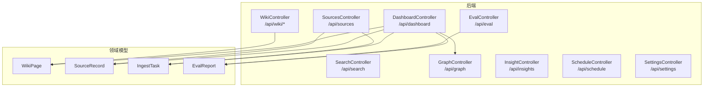
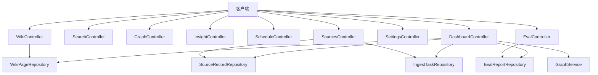
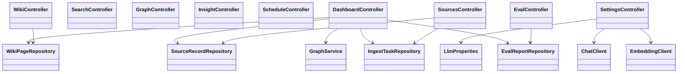

# REST API参考

<cite>
**本文引用的文件**
- [WikiController.java](file://src/main/java/com/example/llmwiki/api/WikiController.java)
- [SearchController.java](file://src/main/java/com/example/llmwiki/api/SearchController.java)
- [GraphController.java](file://src/main/java/com/example/llmwiki/api/GraphController.java)
- [InsightController.java](file://src/main/java/com/example/llmwiki/api/InsightController.java)
- [ScheduleController.java](file://src/main/java/com/example/llmwiki/api/ScheduleController.java)
- [SourcesController.java](file://src/main/java/com/example/llmwiki/api/SourcesController.java)
- [SettingsController.java](file://src/main/java/com/example/llmwiki/api/SettingsController.java)
- [EvalController.java](file://src/main/java/com/example/llmwiki/api/EvalController.java)
- [DashboardController.java](file://src/main/java/com/example/llmwiki/api/DashboardController.java)
- [WikiPage.java](file://src/main/java/com/example/llmwiki/domain/WikiPage.java)
- [SourceRecord.java](file://src/main/java/com/example/llmwiki/domain/SourceRecord.java)
- [IngestTask.java](file://src/main/java/com/example/llmwiki/domain/IngestTask.java)
- [EvalReport.java](file://src/main/java/com/example/llmwiki/domain/EvalReport.java)
- [application.yml](file://src/main/resources/application.yml)
- [LlmProperties.java](file://src/main/java/com/example/llmwiki/config/LlmProperties.java)
</cite>

## 目录
1. [简介](#简介)
2. [项目结构](#项目结构)
3. [核心组件](#核心组件)
4. [架构总览](#架构总览)
5. [详细组件分析](#详细组件分析)
6. [依赖关系分析](#依赖关系分析)
7. [性能考虑](#性能考虑)
8. [故障排查指南](#故障排查指南)
9. [结论](#结论)
10. [附录](#附录)

## 简介
本文件为 LLM Wiki 的 REST API 参考文档，覆盖以下接口模块：
- 维基 API（/api/wiki/*）：页面列表、详情、统计
- 搜索 API（/api/search）：全文检索与语义检索
- 图谱 API（/api/graph）：知识图谱节点边与洞察
- 洞察 API（/api/insights）：知识空白分析
- 定时任务 API（/api/schedule）：调度配置与触发
- 源文件 API（/api/sources）：数据源注册、任务管理
- 设置 API（/api/settings）：LLM 配置读取/更新与健康探测
- 评测 API（/api/eval）：评测报告管理
- 仪表盘 API（/api/dashboard）：系统概览统计

文档说明各端点的 HTTP 方法、URL 模式、请求参数、响应格式、状态码、参数校验与错误处理，并提供最佳实践与性能优化建议。

## 项目结构
后端采用 Spring Boot 控制器层暴露 REST 接口，领域模型位于 domain 包，配置与属性在 config 包，业务服务在对应包中（检索、图谱、洞察、评测等）。前端位于 web 子目录，通过 HTTP 调用上述接口。

图表来源
- [WikiController.java:22-50](file://src/main/java/com/example/llmwiki/api/WikiController.java#L22-L50)
- [SearchController.java:18-31](file://src/main/java/com/example/llmwiki/api/SearchController.java#L18-L31)
- [GraphController.java:21-85](file://src/main/java/com/example/llmwiki/api/GraphController.java#L21-L85)
- [InsightController.java:16-30](file://src/main/java/com/example/llmwiki/api/InsightController.java#L16-L30)
- [ScheduleController.java:27-78](file://src/main/java/com/example/llmwiki/api/ScheduleController.java#L27-L78)
- [SourcesController.java:30-101](file://src/main/java/com/example/llmwiki/api/SourcesController.java#L30-L101)
- [SettingsController.java:24-70](file://src/main/java/com/example/llmwiki/api/SettingsController.java#L24-L70)
- [EvalController.java:26-53](file://src/main/java/com/example/llmwiki/api/EvalController.java#L26-L53)
- [DashboardController.java:22-46](file://src/main/java/com/example/llmwiki/api/DashboardController.java#L22-L46)
- [WikiPage.java:23-71](file://src/main/java/com/example/llmwiki/domain/WikiPage.java#L23-L71)
- [SourceRecord.java:23-63](file://src/main/java/com/example/llmwiki/domain/SourceRecord.java#L23-L63)
- [IngestTask.java:23-61](file://src/main/java/com/example/llmwiki/domain/IngestTask.java#L23-L61)
- [EvalReport.java:23-50](file://src/main/java/com/example/llmwiki/domain/EvalReport.java#L23-L50)

章节来源
- [WikiController.java:16-50](file://src/main/java/com/example/llmwiki/api/WikiController.java#L16-L50)
- [SearchController.java:12-31](file://src/main/java/com/example/llmwiki/api/SearchController.java#L12-L31)
- [GraphController.java:15-85](file://src/main/java/com/example/llmwiki/api/GraphController.java#L15-L85)
- [InsightController.java:10-30](file://src/main/java/com/example/llmwiki/api/InsightController.java#L10-L30)
- [ScheduleController.java:21-78](file://src/main/java/com/example/llmwiki/api/ScheduleController.java#L21-L78)
- [SourcesController.java:24-101](file://src/main/java/com/example/llmwiki/api/SourcesController.java#L24-L101)
- [SettingsController.java:18-70](file://src/main/java/com/example/llmwiki/api/SettingsController.java#L18-L70)
- [EvalController.java:20-53](file://src/main/java/com/example/llmwiki/api/EvalController.java#L20-L53)
- [DashboardController.java:16-46](file://src/main/java/com/example/llmwiki/api/DashboardController.java#L16-L46)

## 核心组件
- 控制器层：每个模块一个控制器类，统一以 /api/{module} 为前缀，按功能划分子路径。
- 领域模型：WikiPage、SourceRecord、IngestTask、EvalReport 提供数据结构与持久化映射。
- 配置与属性：LlmProperties 提供 LLM 相关配置，application.yml 提供全局运行参数（数据库、Quartz、文件大小限制等）。

章节来源
- [WikiPage.java:23-71](file://src/main/java/com/example/llmwiki/domain/WikiPage.java#L23-L71)
- [SourceRecord.java:23-63](file://src/main/java/com/example/llmwiki/domain/SourceRecord.java#L23-L63)
- [IngestTask.java:23-61](file://src/main/java/com/example/llmwiki/domain/IngestTask.java#L23-L61)
- [EvalReport.java:23-50](file://src/main/java/com/example/llmwiki/domain/EvalReport.java#L23-L50)
- [LlmProperties.java:16-62](file://src/main/java/com/example/llmwiki/config/LlmProperties.java#L16-L62)
- [application.yml:1-84](file://src/main/resources/application.yml#L1-L84)

## 架构总览
下图展示 API 与领域模型之间的交互关系及关键依赖：

图表来源
- [WikiController.java:22-50](file://src/main/java/com/example/llmwiki/api/WikiController.java#L22-L50)
- [SearchController.java:18-31](file://src/main/java/com/example/llmwiki/api/SearchController.java#L18-L31)
- [GraphController.java:21-85](file://src/main/java/com/example/llmwiki/api/GraphController.java#L21-L85)
- [InsightController.java:16-30](file://src/main/java/com/example/llmwiki/api/InsightController.java#L16-L30)
- [ScheduleController.java:27-78](file://src/main/java/com/example/llmwiki/api/ScheduleController.java#L27-L78)
- [SourcesController.java:30-101](file://src/main/java/com/example/llmwiki/api/SourcesController.java#L30-L101)
- [SettingsController.java:24-70](file://src/main/java/com/example/llmwiki/api/SettingsController.java#L24-L70)
- [EvalController.java:26-53](file://src/main/java/com/example/llmwiki/api/EvalController.java#L26-L53)
- [DashboardController.java:22-46](file://src/main/java/com/example/llmwiki/api/DashboardController.java#L22-L46)

## 详细组件分析

### 维基 API（/api/wiki）
- 列表页：GET /api/wiki/pages
  - 查询参数
    - type：可选，按类型筛选
  - 响应：数组，元素为 WikiPage 对象
  - 状态码：200 成功
- 详情页：GET /api/wiki/pages/{slug}
  - 路径参数
    - slug：必填，页面唯一标识
  - 响应：WikiPage 对象或 404
  - 状态码：200 或 404
- 统计：GET /api/wiki/stats
  - 响应：对象，包含 total 和按 type 分组的计数
  - 状态码：200

章节来源
- [WikiController.java:29-49](file://src/main/java/com/example/llmwiki/api/WikiController.java#L29-L49)
- [WikiPage.java:23-71](file://src/main/java/com/example/llmwiki/domain/WikiPage.java#L23-L71)

### 搜索 API（/api/search）
- 检索：GET /api/search?q={query}&topK={k}
  - 查询参数
    - q：必填，查询词
    - topK：可选，默认 10
  - 响应：数组，元素为混合检索命中结果
  - 状态码：200 成功；异常时由服务端抛出

章节来源
- [SearchController.java:25-30](file://src/main/java/com/example/llmwiki/api/SearchController.java#L25-L30)

### 图谱 API（/api/graph）
- 全量图：GET /api/graph?minWeight={阈值}
  - 查询参数
    - minWeight：可选，默认 0
  - 响应：对象，包含 nodes（AntV G6 格式）、edges、communityCount
  - 状态码：200
- 图谱洞察：GET /api/graph/insights
  - 响应：对象，包含 isolated（孤立节点）、bridges（桥接节点）、totalNodes、totalEdges
  - 状态码：200

章节来源
- [GraphController.java:31-84](file://src/main/java/com/example/llmwiki/api/GraphController.java#L31-L84)

### 洞察 API（/api/insights）
- 知识空白分析：GET /api/insights/gap?useLlm={bool}
  - 查询参数
    - useLlm：可选，默认 true
  - 响应：GapAnalyzer.GapReport
  - 状态码：200

章节来源
- [InsightController.java:26-29](file://src/main/java/com/example/llmwiki/api/InsightController.java#L26-L29)

### 定时任务 API（/api/schedule）
- 获取配置：GET /api/schedule/config
  - 响应：IngestProperties.Scheduler
  - 状态码：200
- 更新配置：POST /api/schedule/config
  - 请求体：部分字段可更新（cron、enabled）
  - 响应：包含 ok 与当前调度器配置
  - 状态码：200
- 已关注来源：GET /api/schedule/watched
  - 响应：SourceRecord 数组
  - 状态码：200
- 切换 watch：POST /api/schedule/sources/{id}/toggle
  - 请求体：{ enabled: boolean }
  - 响应：{ ok, watchEnabled } 或 { ok: false, error: "not found" }
  - 状态码：200
- 立即执行：POST /api/schedule/run-now
  - 响应：{ ok: true }
  - 状态码：200

章节来源
- [ScheduleController.java:37-77](file://src/main/java/com/example/llmwiki/api/ScheduleController.java#L37-L77)

### 源文件 API（/api/sources）
- 列表：GET /api/sources
  - 响应：SourceRecord 数组
  - 状态码：200
- 上传文件：POST /api/sources/file
  - 表单参数
    - file：必填，multipart 文件
  - 响应：IngestTask
  - 状态码：200
- 提交 URL：POST /api/sources/url
  - 请求体：{ url, watch?: boolean }
  - 响应：IngestTask
  - 状态码：200
- 提交远程文档：POST /api/sources/remote
  - 请求体：{ kind, ref, displayName?, watch? }
  - 响应：IngestTask
  - 状态码：200
- 任务列表：GET /api/sources/tasks
  - 响应：IngestTask 数组（最近 50 条）
  - 状态码：200
- 取消任务：POST /api/sources/tasks/{id}/cancel
  - 响应：{ ok: true }
  - 状态码：200
- 重试任务：POST /api/sources/tasks/{id}/retry
  - 响应：{ ok: true }
  - 状态码：200
- 删除来源：DELETE /api/sources/{id}
  - 响应：{ ok: true }
  - 状态码：200

章节来源
- [SourcesController.java:40-84](file://src/main/java/com/example/llmwiki/api/SourcesController.java#L40-L84)
- [SourceRecord.java:23-63](file://src/main/java/com/example/llmwiki/domain/SourceRecord.java#L23-L63)
- [IngestTask.java:23-61](file://src/main/java/com/example/llmwiki/domain/IngestTask.java#L23-L61)

### 设置 API（/api/settings）
- 读取 LLM 配置：GET /api/settings/llm
  - 响应：LlmProperties
  - 状态码：200
- 更新 LLM 配置：PUT /api/settings/llm
  - 请求体：部分字段可更新（chat、embedding、vision）
  - 响应：{ ok: true }
  - 状态码：200
- 健康探测：POST /api/settings/llm/ping
  - 响应：{ chat: { ok, echo/error }, embedding: { ok, dim/error } }
  - 状态码：200

章节来源
- [SettingsController.java:34-69](file://src/main/java/com/example/llmwiki/api/SettingsController.java#L34-L69)
- [LlmProperties.java:16-62](file://src/main/java/com/example/llmwiki/config/LlmProperties.java#L16-L62)
- [application.yml:39-57](file://src/main/resources/application.yml#L39-L57)

### 评测 API（/api/eval）
- 启动评测：POST /api/eval/run
  - 表单参数
    - file：必填，CSV 文件
    - name：可选，默认 "report"
    - useJudge：可选，默认 false
  - 响应：EvalReport
  - 状态码：200
- 报告列表：GET /api/eval/reports
  - 响应：EvalReport 数组
  - 状态码：200
- 报告详情：GET /api/eval/reports/{id}
  - 响应：EvalReport 或 404
  - 状态码：200 或 404

章节来源
- [EvalController.java:35-52](file://src/main/java/com/example/llmwiki/api/EvalController.java#L35-L52)
- [EvalReport.java:23-50](file://src/main/java/com/example/llmwiki/domain/EvalReport.java#L23-L50)

### 仪表盘 API（/api/dashboard）
- 概览：GET /api/dashboard
  - 响应：包含 wikiTotal、sourceTotal、taskTotal、reportTotal、graphNodes、graphEdges、isolated、communities、recentTasks
  - 状态码：200

章节来源
- [DashboardController.java:33-46](file://src/main/java/com/example/llmwiki/api/DashboardController.java#L33-L46)

## 依赖关系分析
- 控制器依赖仓库与服务：WikiController 依赖 WikiPageRepository；SourcesController 依赖 SourceRecordRepository 与 IngestTaskRepository；EvalController 依赖 EvalReportRepository；DashboardController 聚合多个仓库与 GraphService。
- 配置依赖：SettingsController 依赖 LlmProperties 与 ChatClient/EmbeddingClient；应用配置来自 application.yml。
- 文件上传限制：multipart.max-file-size 与 max-request-size 在 application.yml 中设置。

图表来源
- [WikiController.java:22-50](file://src/main/java/com/example/llmwiki/api/WikiController.java#L22-L50)
- [SourcesController.java:30-101](file://src/main/java/com/example/llmwiki/api/SourcesController.java#L30-L101)
- [EvalController.java:26-53](file://src/main/java/com/example/llmwiki/api/EvalController.java#L26-L53)
- [DashboardController.java:22-46](file://src/main/java/com/example/llmwiki/api/DashboardController.java#L22-L46)
- [SettingsController.java:24-70](file://src/main/java/com/example/llmwiki/api/SettingsController.java#L24-L70)

章节来源
- [application.yml:8-10](file://src/main/resources/application.yml#L8-L10)

## 性能考虑
- 搜索 topK 参数：合理设置 topK，避免过大的返回规模导致前端渲染压力。
- 图谱 minWeight 过滤：通过 minWeight 过滤低权重边，减少渲染节点与边数量。
- 任务批量查询：/api/sources/tasks 返回最近 50 条，前端可分页或缓存。
- 文件上传限制：注意 application.yml 中的 multipart 限制，避免超大文件导致内存压力。
- Quartz 线程池：默认线程数较小，若定时任务负载高，可调整线程数与并发策略。
- LLM 调用：健康探测仅做轻量级校验，生产环境建议控制调用频率与超时时间。

## 故障排查指南
- 404 未找到
  - 维基详情：确认 slug 是否正确
  - 评测详情：确认报告 ID 是否存在
- 上传失败
  - 检查文件大小是否超过 multipart 限制
  - 确认表单字段名与类型
- 健康探测失败
  - 检查 LLM 配置（baseUrl、apiKey、model）与网络连通性
  - 关注 LlmException 错误信息
- 定时任务未执行
  - 检查调度器配置（enabled、cron）
  - 确认 Quartz 作业键与调度器状态

章节来源
- [SettingsController.java:53-69](file://src/main/java/com/example/llmwiki/api/SettingsController.java#L53-L69)
- [application.yml:8-10](file://src/main/resources/application.yml#L8-L10)
- [application.yml:26-29](file://src/main/resources/application.yml#L26-L29)

## 结论
本文档对 LLM Wiki 的 REST API 进行了全面梳理，明确了各模块端点、参数、响应与状态码，并结合配置与模型定义给出使用建议与排障要点。建议在生产环境中结合业务负载调整搜索与图谱参数、控制文件上传规模、优化 LLM 调用策略，并通过健康探测与日志监控保障稳定性。

## 附录

### 请求/响应示例（示意）
- 维基列表
  - GET /api/wiki/pages?type=concept
  - 响应：数组，元素为 WikiPage 字段集合
- 搜索
  - GET /api/search?q=向量&topK=5
  - 响应：数组，元素为检索命中
- 图谱
  - GET /api/graph?minWeight=0.1
  - 响应：{ nodes, edges, communityCount }
- 洞察
  - GET /api/insights/gap?useLlm=false
  - 响应：GapReport
- 定时任务
  - POST /api/schedule/config
  - 请求体：{ enabled: true, cron: "0 0 2 * * ?" }
  - 响应：{ ok: true, scheduler: {...} }
- 源文件
  - POST /api/sources/file（multipart）
  - 响应：IngestTask
- 设置
  - PUT /api/settings/llm
  - 请求体：{ chat: {...}, embedding: {...} }
  - 响应：{ ok: true }
- 评测
  - POST /api/eval/run（multipart）
  - 响应：EvalReport
- 仪表盘
  - GET /api/dashboard
  - 响应：聚合统计字段

### 参数校验与错误处理
- 必填参数缺失：由 Spring MVC 默认处理，通常返回 400
- 资源不存在：返回 404（如维基详情、评测详情）
- 业务异常：由控制器捕获并返回结构化错误（如定时任务切换返回 { ok: false, error }）
- LLM 异常：健康探测捕获 LlmException 并返回错误信息

章节来源
- [ScheduleController.java:61-68](file://src/main/java/com/example/llmwiki/api/ScheduleController.java#L61-L68)
- [SettingsController.java:53-69](file://src/main/java/com/example/llmwiki/api/SettingsController.java#L53-L69)
- [application.yml:8-10](file://src/main/resources/application.yml#L8-L10)