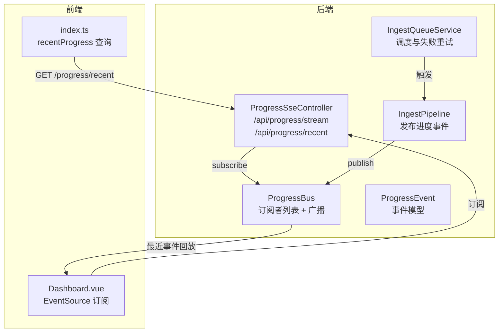
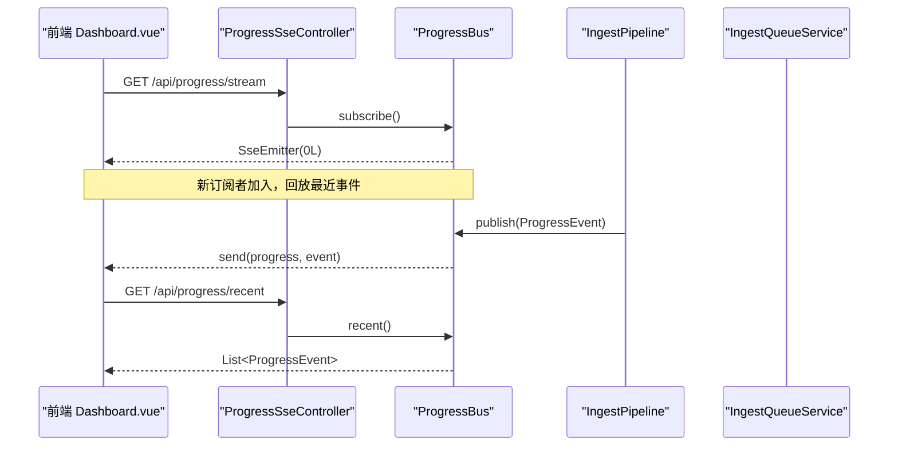
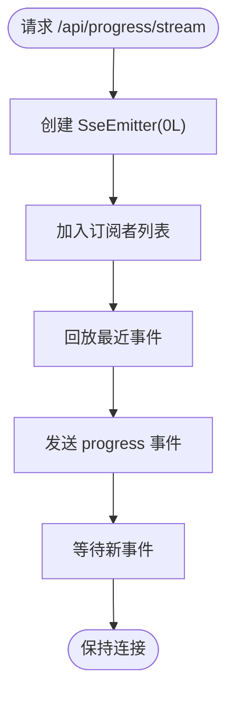
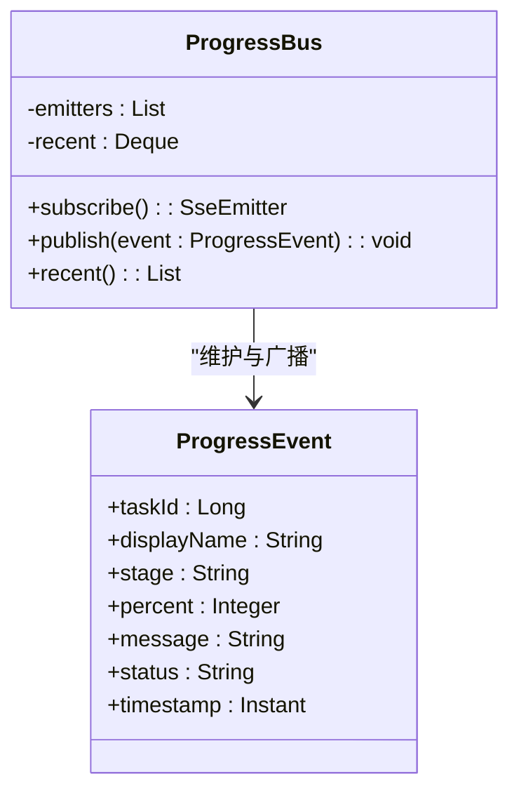
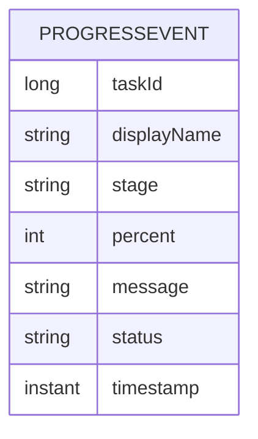
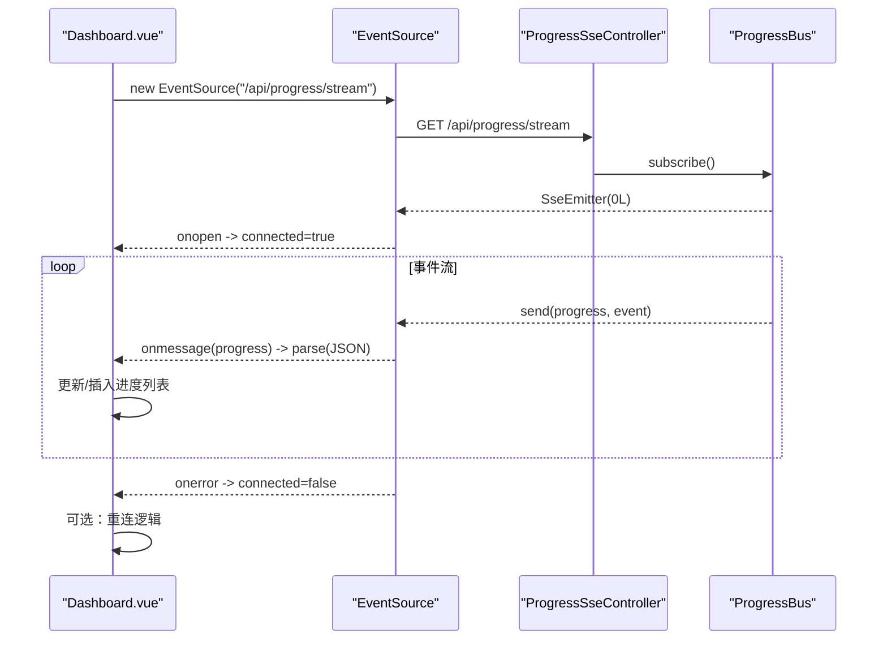
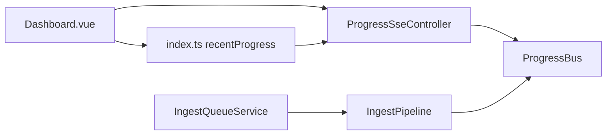

# SSE实时通信

<cite>
**本文引用的文件**
- [ProgressSseController.java](file://src/main/java/com/example/llmwiki/api/ProgressSseController.java)
- [ProgressBus.java](file://src/main/java/com/example/llmwiki/progress/ProgressBus.java)
- [ProgressEvent.java](file://src/main/java/com/example/llmwiki/progress/ProgressEvent.java)
- [IngestPipeline.java](file://src/main/java/com/example/llmwiki/ingest/IngestPipeline.java)
- [IngestQueueService.java](file://src/main/java/com/example/llmwiki/queue/IngestQueueService.java)
- [Dashboard.vue](file://web/src/views/Dashboard.vue)
- [index.ts](file://web/src/api/index.ts)
- [WebConfig.java](file://src/main/java/com/example/llmwiki/config/WebConfig.java)
- [application.yml](file://src/main/resources/application.yml)
</cite>

## 目录
1. [简介](#简介)
2. [项目结构](#项目结构)
3. [核心组件](#核心组件)
4. [架构总览](#架构总览)
5. [详细组件分析](#详细组件分析)
6. [依赖关系分析](#依赖关系分析)
7. [性能考量](#性能考量)
8. [故障排查指南](#故障排查指南)
9. [结论](#结论)
10. [附录](#附录)

## 简介
本文件围绕 LLM Wiki 的 SSE（Server-Sent Events）实时通信能力进行系统性说明，重点覆盖以下主题：
- ProgressSseController 的实现机制：服务器推送进度事件、客户端连接管理、事件格式规范
- ProgressBus 发布订阅模式：事件总线设计、消息传递机制、异步处理策略
- ProgressEvent 事件模型：事件类型定义、数据结构、生命周期管理
- 完整的客户端连接示例：JavaScript EventSource API 使用、连接建立、事件监听、断线重连
- SSE 配置选项：超时设置、缓冲策略、并发限制
- 错误处理机制：连接失败处理、异常恢复、日志记录
- 性能优化建议：事件频率控制、内存管理、网络优化

## 项目结构
SSE 功能由后端控制器、事件总线与前端视图三部分组成：
- 后端
  - 控制器：负责暴露 SSE 流与“最近事件”接口
  - 事件总线：维护订阅者列表并广播事件
  - 事件模型：定义进度事件的数据结构
  - 业务流水线：在任务执行过程中持续发布事件
- 前端
  - 视图组件：通过 EventSource 订阅流并渲染进度
  - API 封装：提供最近事件查询等辅助接口

图表来源
- [ProgressSseController.java:27-35](file://src/main/java/com/example/llmwiki/api/ProgressSseController.java#L27-L35)
- [ProgressBus.java:26-59](file://src/main/java/com/example/llmwiki/progress/ProgressBus.java#L26-L59)
- [ProgressEvent.java:20-42](file://src/main/java/com/example/llmwiki/progress/ProgressEvent.java#L20-L42)
- [IngestPipeline.java:245-249](file://src/main/java/com/example/llmwiki/ingest/IngestPipeline.java#L245-L249)
- [IngestQueueService.java:146-210](file://src/main/java/com/example/llmwiki/queue/IngestQueueService.java#L146-L210)
- [Dashboard.vue:95-108](file://web/src/views/Dashboard.vue#L95-L108)
- [index.ts:68-69](file://web/src/api/index.ts#L68-L69)

章节来源
- [ProgressSseController.java:20-36](file://src/main/java/com/example/llmwiki/api/ProgressSseController.java#L20-L36)
- [ProgressBus.java:17-60](file://src/main/java/com/example/llmwiki/progress/ProgressBus.java#L17-L60)
- [ProgressEvent.java:16-42](file://src/main/java/com/example/llmwiki/progress/ProgressEvent.java#L16-L42)
- [IngestPipeline.java:48-109](file://src/main/java/com/example/llmwiki/ingest/IngestPipeline.java#L48-L109)
- [IngestQueueService.java:136-212](file://src/main/java/com/example/llmwiki/queue/IngestQueueService.java#L136-L212)
- [Dashboard.vue:95-108](file://web/src/views/Dashboard.vue#L95-L108)
- [index.ts:68-69](file://web/src/api/index.ts#L68-L69)

## 核心组件
- ProgressSseController：提供 SSE 流与最近事件查询接口，封装对 ProgressBus 的调用
- ProgressBus：基于 SseEmitter 维护订阅者集合，支持事件回放与广播
- ProgressEvent：标准化的任务级进度事件数据模型
- IngestPipeline：在任务执行的关键阶段发布进度事件
- IngestQueueService：任务调度、失败重试与事件发布入口
- 前端 Dashboard.vue：通过 EventSource 订阅流并渲染进度

章节来源
- [ProgressSseController.java:25-35](file://src/main/java/com/example/llmwiki/api/ProgressSseController.java#L25-L35)
- [ProgressBus.java:21-59](file://src/main/java/com/example/llmwiki/progress/ProgressBus.java#L21-L59)
- [ProgressEvent.java:20-42](file://src/main/java/com/example/llmwiki/progress/ProgressEvent.java#L20-L42)
- [IngestPipeline.java:245-249](file://src/main/java/com/example/llmwiki/ingest/IngestPipeline.java#L245-L249)
- [IngestQueueService.java:146-210](file://src/main/java/com/example/llmwiki/queue/IngestQueueService.java#L146-L210)
- [Dashboard.vue:95-108](file://web/src/views/Dashboard.vue#L95-L108)

## 架构总览
SSE 实时通信采用“发布-订阅”模式：
- 业务层在关键阶段通过 ProgressBus 发布 ProgressEvent
- ProgressSseController 将订阅请求委托给 ProgressBus，并返回 SseEmitter
- ProgressBus 在新订阅者加入时进行“最近事件回放”，随后持续广播新事件
- 前端通过 EventSource 订阅 /api/progress/stream，接收名为 progress 的事件

图表来源
- [ProgressSseController.java:27-35](file://src/main/java/com/example/llmwiki/api/ProgressSseController.java#L27-L35)
- [ProgressBus.java:26-59](file://src/main/java/com/example/llmwiki/progress/ProgressBus.java#L26-L59)
- [IngestPipeline.java:245-249](file://src/main/java/com/example/llmwiki/ingest/IngestPipeline.java#L245-L249)
- [IngestQueueService.java:146-210](file://src/main/java/com/example/llmwiki/queue/IngestQueueService.java#L146-L210)

## 详细组件分析

### ProgressSseController 实现机制
- 路由与媒体类型
  - /api/progress/stream：返回 TEXT_EVENT_STREAM，用于 EventSource 订阅
  - /api/progress/recent：返回最近事件列表，便于新页面接入时快速获取上下文
- 连接管理
  - 将订阅委托给 ProgressBus.subscribe()
  - 返回的 SseEmitter 设置为无限超时（0L），避免默认超时导致连接中断
- 事件格式
  - 事件名为 progress
  - 数据为 ProgressEvent 对象（JSON 序列化）

图表来源
- [ProgressSseController.java:27-30](file://src/main/java/com/example/llmwiki/api/ProgressSseController.java#L27-L30)
- [ProgressBus.java:26-40](file://src/main/java/com/example/llmwiki/progress/ProgressBus.java#L26-L40)

章节来源
- [ProgressSseController.java:20-36](file://src/main/java/com/example/llmwiki/api/ProgressSseController.java#L20-L36)
- [ProgressBus.java:26-40](file://src/main/java/com/example/llmwiki/progress/ProgressBus.java#L26-L40)

### ProgressBus 发布订阅模式
- 设计要点
  - 订阅者集合：CopyOnWriteArrayList，保证并发读取安全
  - 最近事件缓冲：ConcurrentLinkedDeque，容量上限 50，自动淘汰最旧事件
  - 回放策略：新订阅者加入时，按顺序重放最近事件
  - 广播策略：遍历订阅者，逐个发送事件；遇到 IO 异常则移除该订阅者
- 生命周期管理
  - onCompletion/onTimeout/onError：统一从订阅者列表移除
  - publish：先入缓冲，再广播；缓冲满时淘汰最早事件
- 异步处理
  - 业务侧在单线程 worker 中执行任务，发布事件是同步调用，但广播发生在独立的 I/O 线程池中

图表来源
- [ProgressBus.java:19-59](file://src/main/java/com/example/llmwiki/progress/ProgressBus.java#L19-L59)
- [ProgressEvent.java:20-42](file://src/main/java/com/example/llmwiki/progress/ProgressEvent.java#L20-L42)

章节来源
- [ProgressBus.java:17-60](file://src/main/java/com/example/llmwiki/progress/ProgressBus.java#L17-L60)

### ProgressEvent 事件模型
- 字段说明
  - taskId：任务标识
  - displayName：来源展示名
  - stage：阶段枚举（QUEUED、PARSE、ANALYZE、GENERATE、INDEX、GRAPH、DONE、FAIL、SKIP）
  - percent：进度百分比（0-100）
  - message：描述信息
  - status：状态枚举（PENDING、RUNNING、SUCCESS、FAILED、SKIPPED）
  - timestamp：事件时间戳，默认当前时间
- 生命周期
  - 由 IngestPipeline 或 IngestQueueService 在任务生命周期各阶段发布
  - 通过 ProgressBus 缓冲与广播，最终送达前端

图表来源
- [ProgressEvent.java:20-42](file://src/main/java/com/example/llmwiki/progress/ProgressEvent.java#L20-L42)

章节来源
- [ProgressEvent.java:16-42](file://src/main/java/com/example/llmwiki/progress/ProgressEvent.java#L16-L42)
- [IngestPipeline.java:245-249](file://src/main/java/com/example/llmwiki/ingest/IngestPipeline.java#L245-L249)
- [IngestQueueService.java:146-210](file://src/main/java/com/example/llmwiki/queue/IngestQueueService.java#L146-L210)

### 客户端连接示例（JavaScript EventSource）
- 连接建立
  - 使用 EventSource 订阅 /api/progress/stream
  - onopen 设置连接状态为已连接
  - onerror 设置连接状态为未连接
- 事件监听
  - 监听事件名 progress，解析 ev.data 为 JSON
  - 根据 taskId 更新或插入进度列表，维持最多 50 条
- 断线重连
  - 前端未实现自动重连逻辑，可在 onerror 中扩展指数退避重连策略
- 最近事件
  - 首次加载时可调用 /api/progress/recent 获取近期上下文

图表来源
- [Dashboard.vue:95-108](file://web/src/views/Dashboard.vue#L95-L108)
- [ProgressSseController.java:27-30](file://src/main/java/com/example/llmwiki/api/ProgressSseController.java#L27-L30)
- [ProgressBus.java:26-40](file://src/main/java/com/example/llmwiki/progress/ProgressBus.java#L26-L40)

章节来源
- [Dashboard.vue:95-108](file://web/src/views/Dashboard.vue#L95-L108)
- [index.ts:68-69](file://web/src/api/index.ts#L68-L69)

### SSE 配置选项
- 超时设置
  - SseEmitter 超时设为 0L（无限），避免连接被默认超时中断
- 缓冲策略
  - 最近事件缓冲上限 50 条，先进先出淘汰
- 并发限制
  - 订阅者集合使用 CopyOnWriteArrayList，适合高读低写场景
  - 广播时逐个发送，遇到 IO 异常自动清理失效订阅者
- CORS 支持
  - WebConfig 提供跨域配置，允许任意来源与方法

章节来源
- [ProgressBus.java:26-59](file://src/main/java/com/example/llmwiki/progress/ProgressBus.java#L26-L59)
- [WebConfig.java:18-25](file://src/main/java/com/example/llmwiki/config/WebConfig.java#L18-L25)

### 错误处理机制
- 连接失败处理
  - 前端：EventSource.onerror 将连接状态置为未连接
  - 后端：SseEmitter.onCompletion/onTimeout/onError 自动移除订阅者
- 异常恢复
  - 业务侧在任务失败时发布 FAIL 事件，前端据此显示错误状态
  - 前端未内置自动重连，可在 onerror 中扩展重连逻辑
- 日志记录
  - ProgressBus 使用 SLF4J 记录运行日志（如需要可增加更详细的异常日志）

章节来源
- [Dashboard.vue:97-98](file://web/src/views/Dashboard.vue#L97-L98)
- [ProgressBus.java:29-31](file://src/main/java/com/example/llmwiki/progress/ProgressBus.java#L29-L31)
- [IngestQueueService.java:194-210](file://src/main/java/com/example/llmwiki/queue/IngestQueueService.java#L194-L210)

## 依赖关系分析
- 控制器依赖事件总线
- 事件总线依赖 Spring MVC 的 SseEmitter
- 业务流水线与队列服务依赖事件总线发布事件
- 前端依赖控制器提供的 SSE 流与最近事件接口

图表来源
- [ProgressSseController.java:25-35](file://src/main/java/com/example/llmwiki/api/ProgressSseController.java#L25-L35)
- [ProgressBus.java:19-59](file://src/main/java/com/example/llmwiki/progress/ProgressBus.java#L19-L59)
- [IngestPipeline.java:65-109](file://src/main/java/com/example/llmwiki/ingest/IngestPipeline.java#L65-L109)
- [IngestQueueService.java:146-210](file://src/main/java/com/example/llmwiki/queue/IngestQueueService.java#L146-L210)
- [Dashboard.vue:95-108](file://web/src/views/Dashboard.vue#L95-L108)
- [index.ts:68-69](file://web/src/api/index.ts#L68-L69)

章节来源
- [ProgressSseController.java:20-36](file://src/main/java/com/example/llmwiki/api/ProgressSseController.java#L20-L36)
- [ProgressBus.java:17-60](file://src/main/java/com/example/llmwiki/progress/ProgressBus.java#L17-L60)
- [IngestPipeline.java:48-109](file://src/main/java/com/example/llmwiki/ingest/IngestPipeline.java#L48-L109)
- [IngestQueueService.java:136-212](file://src/main/java/com/example/llmwiki/queue/IngestQueueService.java#L136-L212)
- [Dashboard.vue:95-108](file://web/src/views/Dashboard.vue#L95-L108)
- [index.ts:68-69](file://web/src/api/index.ts#L68-L69)

## 性能考量
- 事件频率控制
  - 业务侧在关键阶段发布事件，避免过于频繁的更新
  - 前端对列表长度进行上限控制（最多 50 条），减少 DOM 更新压力
- 内存管理
  - 最近事件缓冲上限 50，避免长期累积造成内存膨胀
  - 订阅者集合使用 CopyOnWriteArrayList，读多写少场景下开销较低
- 网络优化
  - SseEmitter 超时设为 0L，避免不必要的连接中断
  - 前端未实现自动重连，建议在 onerror 中添加指数退避重连策略
- 并发与吞吐
  - 广播时逐个发送，遇到 IO 异常立即清理，避免阻塞后续事件
  - 业务侧使用单线程 worker 执行任务，确保串行一致性

章节来源
- [ProgressBus.java:23-24](file://src/main/java/com/example/llmwiki/progress/ProgressBus.java#L23-L24)
- [ProgressBus.java:43-55](file://src/main/java/com/example/llmwiki/progress/ProgressBus.java#L43-L55)
- [Dashboard.vue:104-105](file://web/src/views/Dashboard.vue#L104-L105)
- [IngestQueueService.java:45-49](file://src/main/java/com/example/llmwiki/queue/IngestQueueService.java#L45-L49)

## 故障排查指南
- 前端无法收到事件
  - 检查浏览器控制台是否有 CORS 错误（确认 WebConfig 已生效）
  - 确认 EventSource 是否成功连接（onopen 是否触发）
- 事件丢失或重复
  - 检查前端是否正确解析 ev.data 为 JSON
  - 确认前端列表更新逻辑（根据 taskId 更新或插入）
- 连接频繁断开
  - 检查后端日志是否存在 IO 异常
  - 确认 SseEmitter 超时设置为 0L
- 任务失败未显示
  - 检查业务侧是否发布 FAIL 事件
  - 确认前端对 FAILED 状态的样式映射

章节来源
- [WebConfig.java:18-25](file://src/main/java/com/example/llmwiki/config/WebConfig.java#L18-L25)
- [Dashboard.vue:97-108](file://web/src/views/Dashboard.vue#L97-L108)
- [ProgressBus.java:29-31](file://src/main/java/com/example/llmwiki/progress/ProgressBus.java#L29-L31)
- [IngestQueueService.java:208-210](file://src/main/java/com/example/llmwiki/queue/IngestQueueService.java#L208-L210)

## 结论
LLM Wiki 的 SSE 实时通信以简洁高效的发布-订阅模式实现，具备以下特点：
- 后端通过 ProgressBus 统一管理订阅者与事件缓冲，前端通过 EventSource 轻松接入
- 事件格式简单明确（事件名 progress + JSON 数据），易于扩展
- 业务侧在关键阶段发布事件，前端负责渲染与交互
- 建议在前端补充自动重连与更细粒度的事件节流策略，进一步提升用户体验与系统稳定性

## 附录
- 事件字段参考
  - taskId：Long
  - displayName：String
  - stage：枚举（QUEUED、PARSE、ANALYZE、GENERATE、INDEX、GRAPH、DONE、FAIL、SKIP）
  - percent：Integer（0-100）
  - message：String
  - status：枚举（PENDING、RUNNING、SUCCESS、FAILED、SKIPPED）
  - timestamp：Instant
- 接口参考
  - GET /api/progress/stream：SSE 流
  - GET /api/progress/recent：最近事件列表

章节来源
- [ProgressEvent.java:20-42](file://src/main/java/com/example/llmwiki/progress/ProgressEvent.java#L20-L42)
- [ProgressSseController.java:27-35](file://src/main/java/com/example/llmwiki/api/ProgressSseController.java#L27-L35)