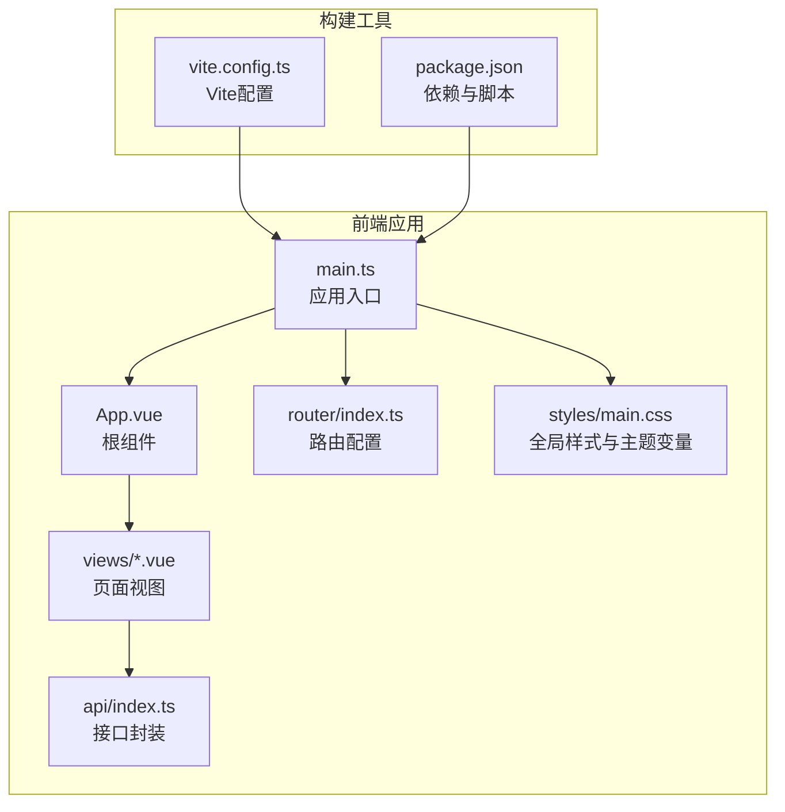
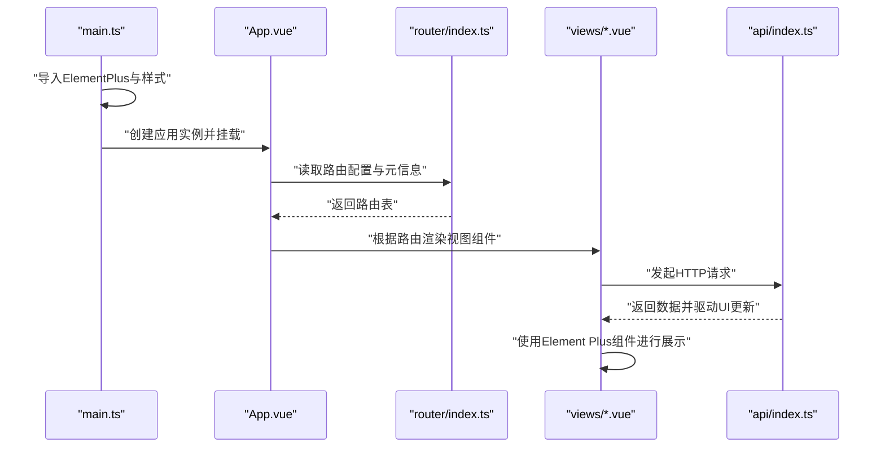
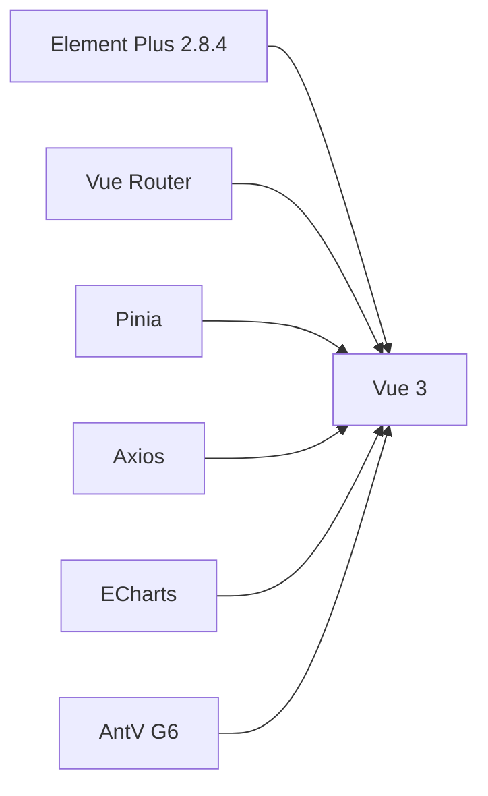

# UI集成与Element Plus

<cite>
**本文引用的文件**
- [package.json](file://web/package.json)
- [vite.config.ts](file://web/vite.config.ts)
- [main.ts](file://web/src/main.ts)
- [App.vue](file://web/src/App.vue)
- [main.css](file://web/src/styles/main.css)
- [Dashboard.vue](file://web/src/views/Dashboard.vue)
- [Search.vue](file://web/src/views/Search.vue)
- [index.ts](file://web/src/router/index.ts)
- [index.ts](file://web/src/api/index.ts)
</cite>

## 目录
1. [简介](#简介)
2. [项目结构](#项目结构)
3. [核心组件](#核心组件)
4. [架构总览](#架构总览)
5. [详细组件分析](#详细组件分析)
6. [依赖分析](#依赖分析)
7. [性能考虑](#性能考虑)
8. [故障排查指南](#故障排查指南)
9. [结论](#结论)
10. [附录](#附录)

## 简介
本文件面向LLM Wiki前端工程的UI集成与Element Plus使用，围绕以下目标展开：组件库安装与按需引入、全局配置、主题定制（CSS变量覆盖与颜色系统）、组件使用（基础、表单、数据展示）、布局系统（栅格与布局组件、响应式设计）、图标集成（图标库使用、自定义图标、图标主题）、国际化支持（多语言配置与本地化适配）、动画效果（过渡与加载动画）、移动端适配（响应式断点与触摸交互）。文档以仓库现有实现为依据，提供可操作的实践建议与可视化说明。

## 项目结构
前端采用Vue 3 + Vite + TypeScript + Pinia + Vue Router技术栈，Element Plus作为主要UI组件库。项目通过Vite进行开发与构建，路由基于Vue Router，状态管理使用Pinia，接口调用封装在统一的API模块中。

图表来源
- [main.ts:1-14](file://web/src/main.ts#L1-L14)
- [App.vue:1-38](file://web/src/App.vue#L1-L38)
- [index.ts:1-22](file://web/src/router/index.ts#L1-L22)
- [main.css:1-129](file://web/src/styles/main.css#L1-L129)
- [index.ts:1-70](file://web/src/api/index.ts#L1-L70)
- [vite.config.ts:1-23](file://web/vite.config.ts#L1-L23)
- [package.json:1-31](file://web/package.json#L1-L31)

章节来源
- [main.ts:1-14](file://web/src/main.ts#L1-L14)
- [vite.config.ts:1-23](file://web/vite.config.ts#L1-L23)
- [package.json:1-31](file://web/package.json#L1-L31)

## 核心组件
- 应用入口与Element Plus集成
  - 在应用入口完成Element Plus的全局安装与默认样式引入，确保所有页面可用。
  - 参考路径：[main.ts:1-14](file://web/src/main.ts#L1-L14)
- 全局样式与主题变量
  - 使用CSS自定义属性集中定义主色、背景、卡片、文字等变量，便于主题切换与一致性。
  - 参考路径：[main.css:1-18](file://web/src/styles/main.css#L1-L18)
- 路由与菜单
  - 路由配置包含页面标题与图标元信息，根组件根据路由动态渲染侧边栏与内容区。
  - 参考路径：[index.ts:1-22](file://web/src/router/index.ts#L1-L22)，[App.vue:29-37](file://web/src/App.vue#L29-L37)
- 视图组件示例
  - Dashboard使用栅格、表格、标签、进度条等组件；Search使用输入框、空状态、骨架屏等组件。
  - 参考路径：[Dashboard.vue:1-119](file://web/src/views/Dashboard.vue#L1-L119)，[Search.vue:1-42](file://web/src/views/Search.vue#L1-L42)

章节来源
- [main.ts:1-14](file://web/src/main.ts#L1-L14)
- [main.css:1-129](file://web/src/styles/main.css#L1-L129)
- [index.ts:1-22](file://web/src/router/index.ts#L1-L22)
- [App.vue:1-38](file://web/src/App.vue#L1-L38)
- [Dashboard.vue:1-119](file://web/src/views/Dashboard.vue#L1-L119)
- [Search.vue:1-42](file://web/src/views/Search.vue#L1-L42)

## 架构总览
下图展示了从应用入口到页面组件的数据流与组件关系，以及Element Plus在其中的作用。

图表来源
- [main.ts:1-14](file://web/src/main.ts#L1-L14)
- [App.vue:1-38](file://web/src/App.vue#L1-L38)
- [index.ts:1-22](file://web/src/router/index.ts#L1-L22)
- [index.ts:1-70](file://web/src/api/index.ts#L1-L70)

## 详细组件分析

### Element Plus 安装与按需引入
- 安装方式
  - 通过包管理器安装Element Plus并在应用入口全局注册，即可在全站范围内直接使用组件。
  - 参考路径：[package.json:12-21](file://web/package.json#L12-L21)，[main.ts:3-4](file://web/src/main.ts#L3-L4)
- 按需引入
  - 当前实现为全局引入，如需减小体积，可在构建工具中配置按需引入插件（例如unplugin-vue-components或unplugin-auto-import），仅打包使用到的组件与指令。
  - 参考路径：[package.json:25-26](file://web/package.json#L25-L26)，[vite.config.ts:1-23](file://web/vite.config.ts#L1-L23)
- 全局配置
  - 可通过Element Plus提供的全局配置项统一设置组件默认行为（如尺寸、颜色、禁用态等），但当前仓库未显式配置。
  - 参考路径：[main.ts:12](file://web/src/main.ts#L12)

章节来源
- [package.json:12-21](file://web/package.json#L12-L21)
- [package.json:25-26](file://web/package.json#L25-L26)
- [main.ts:3-4](file://web/src/main.ts#L3-L4)
- [main.ts:12](file://web/src/main.ts#L12)
- [vite.config.ts:1-23](file://web/vite.config.ts#L1-L23)

### 主题定制：CSS变量覆盖与颜色系统
- CSS变量覆盖
  - 在全局样式中定义主题变量，用于控制主色、背景、卡片、文字等，便于后续主题切换与品牌统一。
  - 参考路径：[main.css:2-9](file://web/src/styles/main.css#L2-L9)
- 主题切换
  - 可通过切换CSS变量值实现浅色/深色主题切换，结合Element Plus的暗色模式或自定义类名控制组件外观。
  - 参考路径：[main.css:11-18](file://web/src/styles/main.css#L11-L18)
- 颜色系统
  - 结合Element Plus的type属性（如success、warning、danger等）与业务语义配合使用，保持视觉一致。
  - 示例参考：[Dashboard.vue:15](file://web/src/views/Dashboard.vue#L15)，[Dashboard.vue:22](file://web/src/views/Dashboard.vue#L22)

章节来源
- [main.css:1-129](file://web/src/styles/main.css#L1-L129)
- [Dashboard.vue:15](file://web/src/views/Dashboard.vue#L15)
- [Dashboard.vue:22](file://web/src/views/Dashboard.vue#L22)

### 组件使用：基础、表单、数据展示
- 基础组件
  - 使用标签与图标组件进行状态提示与导航展示，结合CSS变量实现统一风格。
  - 参考路径：[App.vue:12](file://web/src/App.vue#L12)，[Dashboard.vue:15](file://web/src/views/Dashboard.vue#L15)
- 表单组件
  - 输入框与按钮组合实现搜索功能，支持清空与回车触发。
  - 参考路径：[Search.vue:4](file://web/src/views/Search.vue#L4)
- 数据展示组件
  - 栅格系统用于布局指标卡片与图表区域；表格用于展示进度与任务列表；标签与进度条用于状态与进度可视化。
  - 参考路径：[Dashboard.vue:4-9](file://web/src/views/Dashboard.vue#L4-L9)，[Dashboard.vue:17-35](file://web/src/views/Dashboard.vue#L17-L35)，[Dashboard.vue:38-57](file://web/src/views/Dashboard.vue#L38-L57)

章节来源
- [App.vue:12](file://web/src/App.vue#L12)
- [Search.vue:4](file://web/src/views/Search.vue#L4)
- [Dashboard.vue:4-9](file://web/src/views/Dashboard.vue#L4-L9)
- [Dashboard.vue:17-35](file://web/src/views/Dashboard.vue#L17-L35)
- [Dashboard.vue:38-57](file://web/src/views/Dashboard.vue#L38-L57)

### 布局系统：栅格、布局组件与响应式设计
- 栅格系统
  - 使用el-row与el-col进行响应式布局，通过span与gutter控制列宽与间距。
  - 参考路径：[Dashboard.vue:4](file://web/src/views/Dashboard.vue#L4)，[Dashboard.vue:38](file://web/src/views/Dashboard.vue#L38)
- 布局组件
  - 根组件采用flex布局划分侧边栏与主内容区，结合阴影与圆角提升卡片层次感。
  - 参考路径：[App.vue:20-26](file://web/src/App.vue#L20-L26)，[main.css:25-95](file://web/src/styles/main.css#L25-L95)
- 响应式设计
  - 建议结合Element Plus的栅格断点与媒体查询策略，在窄屏设备上调整列宽与间距，保证内容可读性与交互效率。

章节来源
- [Dashboard.vue:4](file://web/src/views/Dashboard.vue#L4)
- [Dashboard.vue:38](file://web/src/views/Dashboard.vue#L38)
- [App.vue:20-26](file://web/src/App.vue#L20-L26)
- [main.css:25-95](file://web/src/styles/main.css#L25-L95)

### 图标集成：图标库使用、自定义图标与图标主题
- 图标库使用
  - 通过路由元信息中的icon字段传递图标名称，并在根组件中以动态组件形式渲染，实现菜单图标的统一管理。
  - 参考路径：[index.ts:5](file://web/src/router/index.ts#L5)，[App.vue:12](file://web/src/App.vue#L12)
- 自定义图标
  - 可将SVG或第三方图标资源注册为Vue组件，再通过相同方式注入到路由meta或菜单中。
- 图标主题
  - 结合CSS变量与Element Plus的size/type属性，统一图标的视觉层级与色彩语义。

章节来源
- [index.ts:5](file://web/src/router/index.ts#L5)
- [App.vue:12](file://web/src/App.vue#L12)

### 国际化支持：多语言配置、本地化适配与文本翻译
- 多语言配置
  - Element Plus提供内置的语言包，可通过全局配置切换语言；若需要扩展业务文案，建议在API层与组件层分别维护本地化映射。
- 本地化适配
  - 文本翻译与日期格式化建议集中在API封装与工具函数中，避免分散在组件内部。
- 文本翻译
  - 对于固定文案（如菜单标题、占位符），可结合路由meta的title字段与i18n库进行统一管理。

章节来源
- [index.ts:5-13](file://web/src/router/index.ts#L5-L13)

### 动画效果：过渡动画、加载动画与交互反馈
- 过渡动画
  - 使用Vue的transition包裹router-view，实现页面切换的淡入线性过渡。
  - 参考路径：[App.vue:20](file://web/src/App.vue#L20)
- 加载动画
  - 使用骨架屏与空状态组件在数据加载与无结果场景提供良好体验。
  - 参考路径：[Search.vue:10](file://web/src/views/Search.vue#L10)，[Search.vue:9](file://web/src/views/Search.vue#L9)
- 交互反馈
  - 使用标签与进度条直观展示状态与进度，结合CSS变量统一视觉风格。

章节来源
- [App.vue:20](file://web/src/App.vue#L20)
- [Search.vue:9-10](file://web/src/views/Search.vue#L9-L10)

### 移动端适配：响应式断点、触摸交互与移动端优化
- 响应式断点
  - 建议在窄屏设备上减少列数、增大gutter、缩小字体与内边距，确保内容可读性。
- 触摸交互
  - 为按钮与菜单项提供合适的点击热区与反馈，避免过小的可点区域。
- 移动端优化
  - 结合CSS媒体查询与Element Plus的响应式能力，优先保证核心功能在移动端的可用性。

## 依赖分析
- Element Plus版本与依赖关系
  - Element Plus 2.8.4作为UI组件库，与Vue 3生态紧密集成；构建工具通过Vite与插件体系支持按需引入与自动导入。
- 关键依赖
  - Vue 3、Vue Router、Pinia、Axios、ECharts、AntV G6等共同构成前端能力矩阵。

图表来源
- [package.json:12-21](file://web/package.json#L12-L21)

章节来源
- [package.json:12-21](file://web/package.json#L12-L21)

## 性能考虑
- 按需引入与摇树优化
  - 将Element Plus改为按需引入，结合unplugin-vue-components与unplugin-auto-import，减少打包体积。
- 样式与主题
  - 合理使用CSS变量与主题切换，避免重复样式与深层选择器导致的重绘开销。
- 组件懒加载
  - 路由级组件使用动态导入，结合骨架屏与空状态，改善首屏体验。
- 图表与大数据
  - 对于ECharts等重型图表，建议在数据量较大时采用分页或采样策略，降低渲染压力。

## 故障排查指南
- 组件不生效或样式异常
  - 检查是否正确引入Element Plus样式与全局插件；确认构建工具未误删样式文件。
  - 参考路径：[main.ts:3-4](file://web/src/main.ts#L3-L4)
- 图标不显示
  - 确认路由meta中的icon名称与实际组件注册一致；检查动态组件渲染逻辑。
  - 参考路径：[index.ts:5](file://web/src/router/index.ts#L5)，[App.vue:12](file://web/src/App.vue#L12)
- 接口请求失败
  - 检查代理配置与后端服务连通性；确认API封装中的参数与超时设置合理。
  - 参考路径：[vite.config.ts:15-20](file://web/vite.config.ts#L15-L20)，[index.ts:1-70](file://web/src/api/index.ts#L1-L70)
- 页面切换闪烁
  - 确保过渡动画名称与组件匹配；避免在切换过程中频繁重排DOM。
  - 参考路径：[App.vue:20](file://web/src/App.vue#L20)

章节来源
- [main.ts:3-4](file://web/src/main.ts#L3-L4)
- [index.ts:5](file://web/src/router/index.ts#L5)
- [App.vue:12](file://web/src/App.vue#L12)
- [vite.config.ts:15-20](file://web/vite.config.ts#L15-L20)
- [index.ts:1-70](file://web/src/api/index.ts#L1-L70)
- [App.vue:20](file://web/src/App.vue#L20)

## 结论
本项目已实现Element Plus的基础集成与主题变量管理，配合Vue Router与Pinia构建了清晰的页面与状态管理结构。为进一步提升开发效率与用户体验，建议推进按需引入、国际化与主题切换、移动端响应式优化与性能治理，形成完整的前端工程化实践闭环。

## 附录
- 开发与构建命令
  - dev：启动开发服务器
  - build：生产构建
  - preview：预览构建产物
  - 参考路径：[package.json:7-11](file://web/package.json#L7-L11)
- 代理配置
  - 将/api前缀代理至后端服务，便于前后端联调。
  - 参考路径：[vite.config.ts:15-20](file://web/vite.config.ts#L15-L20)

章节来源
- [package.json:7-11](file://web/package.json#L7-L11)
- [vite.config.ts:15-20](file://web/vite.config.ts#L15-L20)