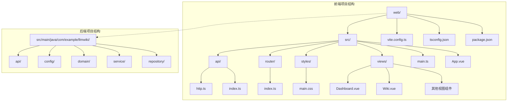
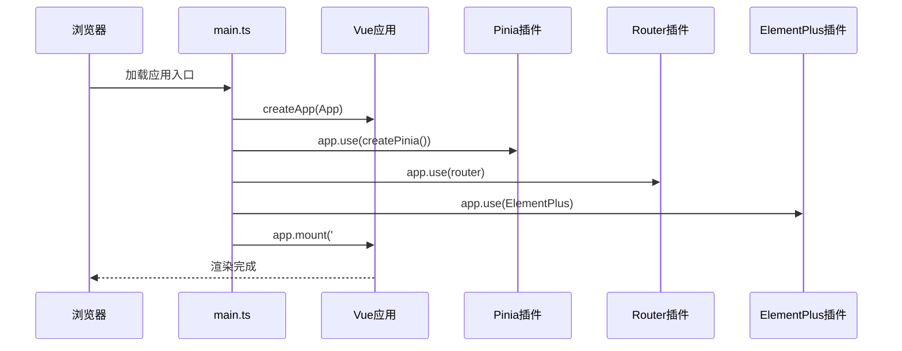
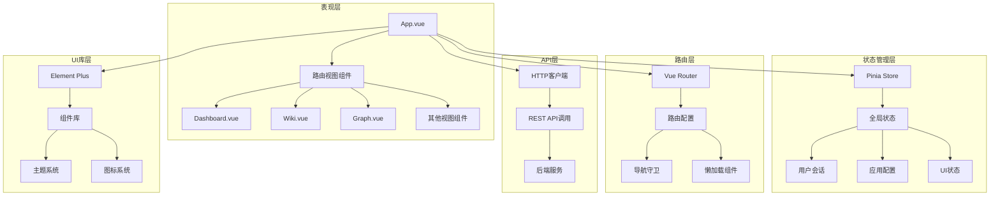
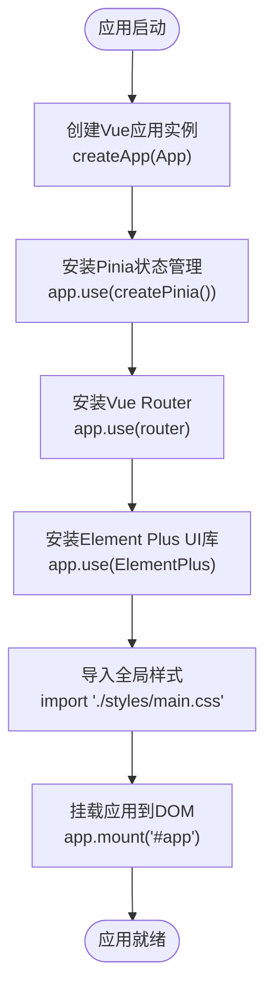
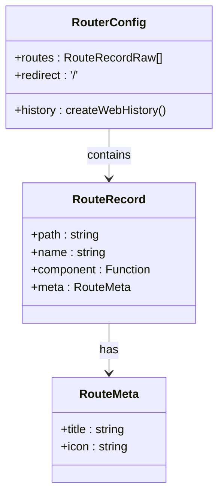
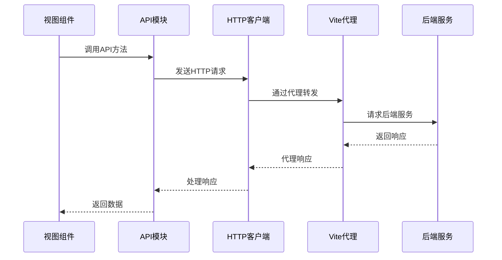
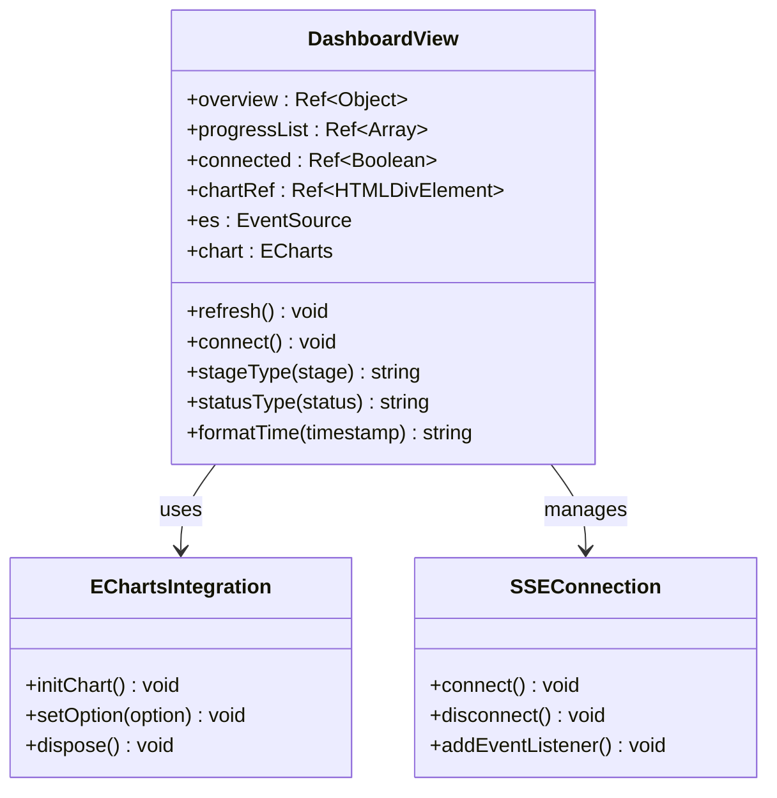
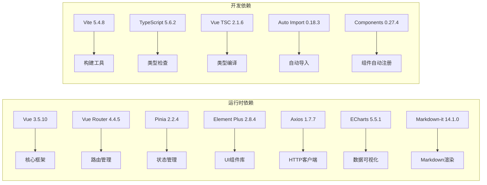

# Vue应用架构

<cite>
**本文档引用的文件**
- [main.ts](file://web/src/main.ts)
- [App.vue](file://web/src/App.vue)
- [router/index.ts](file://web/src/router/index.ts)
- [vite.config.ts](file://web/vite.config.ts)
- [tsconfig.json](file://web/tsconfig.json)
- [package.json](file://web/package.json)
- [env.d.ts](file://web/src/env.d.ts)
- [api/index.ts](file://web/src/api/index.ts)
- [api/http.ts](file://web/src/api/http.ts)
- [styles/main.css](file://web/src/styles/main.css)
- [views/Dashboard.vue](file://web/src/views/Dashboard.vue)
- [views/Wiki.vue](file://web/src/views/Wiki.vue)
- [index.html](file://web/index.html)
</cite>

## 目录
1. [引言](#引言)
2. [项目结构](#项目结构)
3. [核心组件](#核心组件)
4. [架构概览](#架构概览)
5. [详细组件分析](#详细组件分析)
6. [依赖关系分析](#依赖关系分析)
7. [性能考虑](#性能考虑)
8. [故障排除指南](#故障排除指南)
9. [结论](#结论)

## 引言

LLM Wiki是一个基于Vue 3.5.10构建的现代化前端应用，采用TypeScript进行开发，集成了Pinia状态管理、Vue Router路由系统和Element Plus UI库。该应用通过Vite作为构建工具，提供了完整的开发体验，包括热重载、代理配置和TypeScript支持。

应用的核心功能围绕智能知识库展开，包括数据源管理、Wiki页面展示、知识图谱可视化、智能检索和评测体系等模块。整个架构设计遵循现代前端开发最佳实践，确保了良好的可维护性和扩展性。

## 项目结构

LLM Wiki项目采用前后端分离的架构设计，前端代码位于`web`目录下，后端Java服务位于`src/main/java/com/example/llmwiki`目录下。前端项目结构清晰，模块化程度高，便于团队协作和功能扩展。

**图表来源**
- [main.ts:1-14](file://web/src/main.ts#L1-L14)
- [router/index.ts:1-22](file://web/src/router/index.ts#L1-L22)
- [vite.config.ts:1-23](file://web/vite.config.ts#L1-L23)

**章节来源**
- [main.ts:1-14](file://web/src/main.ts#L1-L14)
- [package.json:1-31](file://web/package.json#L1-L31)

## 核心组件

### 应用初始化配置

应用的启动过程从`main.ts`文件开始，这是一个标准的Vue 3应用初始化流程。该文件负责创建Vue应用实例、安装必要的插件，并最终挂载到DOM元素中。

应用初始化的关键步骤包括：
1. 创建Vue应用实例
2. 安装Pinia状态管理插件
3. 安装Vue Router路由插件
4. 安装Element Plus UI库
5. 导入全局样式文件
6. 挂载应用到DOM

**图表来源**
- [main.ts:9-13](file://web/src/main.ts#L9-L13)

### 依赖注入系统

应用采用了现代化的依赖注入模式，通过Vue的插件系统实现各个核心库的集成。这种设计确保了各组件之间的松耦合，提高了代码的可测试性和可维护性。

**章节来源**
- [main.ts:1-14](file://web/src/main.ts#L1-L14)

## 架构概览

LLM Wiki的整体架构采用分层设计，从前端UI层到API层形成了清晰的职责分工。应用的核心架构包括以下几个关键层次：

**图表来源**
- [App.vue:1-38](file://web/src/App.vue#L1-L38)
- [router/index.ts:1-22](file://web/src/router/index.ts#L1-L22)
- [api/index.ts:1-70](file://web/src/api/index.ts#L1-L70)

## 详细组件分析

### 应用入口点分析

#### main.ts - 应用入口文件

`main.ts`是整个应用的入口点，负责应用的初始化和配置。该文件展示了现代Vue 3应用的标准初始化模式，包含了所有必要的依赖注入和配置步骤。

应用初始化的核心流程：
1. **应用创建**：使用`createApp(App)`创建Vue应用实例
2. **插件安装**：依次安装Pinia、Vue Router和Element Plus插件
3. **样式导入**：导入全局CSS样式文件
4. **应用挂载**：将应用挂载到DOM元素上

**图表来源**
- [main.ts:9-13](file://web/src/main.ts#L9-L13)

**章节来源**
- [main.ts:1-14](file://web/src/main.ts#L1-L14)

### 路由系统分析

#### 路由配置 - router/index.ts

应用的路由系统基于Vue Router 4.4.5构建，采用了动态导入和元信息配置的方式。路由配置不仅定义了页面路径和组件映射，还包含了菜单标题、图标等UI相关信息。

路由配置的特点：
1. **动态导入**：所有视图组件都采用动态导入，实现按需加载
2. **元信息**：每个路由都包含`meta`字段，用于UI显示
3. **历史模式**：使用`createWebHistory`实现HTML5 History API
4. **重定向**：根路径自动重定向到仪表板页面

**图表来源**
- [router/index.ts:3-14](file://web/src/router/index.ts#L3-L14)

**章节来源**
- [router/index.ts:1-22](file://web/src/router/index.ts#L1-L22)

### API通信层分析

#### HTTP客户端 - api/http.ts

应用的API通信层基于Axios构建，提供了统一的HTTP客户端配置和拦截器处理机制。该配置确保了所有API请求的一致性和可靠性。

HTTP客户端的关键配置：
1. **基础URL**：设置为`/api`，通过Vite代理转发到后端服务
2. **超时设置**：默认超时时间为60秒
3. **响应拦截器**：统一处理错误响应，提供一致的错误处理机制

**图表来源**
- [api/http.ts:3-6](file://web/src/api/http.ts#L3-L6)
- [vite.config.ts:15-20](file://web/vite.config.ts#L15-L20)

**章节来源**
- [api/http.ts:1-17](file://web/src/api/http.ts#L1-L17)

### 视图组件分析

#### Dashboard视图 - views/Dashboard.vue

Dashboard组件是应用的核心仪表板，展示了系统的关键指标和实时进度信息。该组件采用了ECharts进行数据可视化，实现了复杂的交互功能。

Dashboard组件的主要功能：
1. **核心指标展示**：显示Wiki页面数量、数据源数量、图谱统计等关键指标
2. **实时进度监控**：通过Server-Sent Events实时接收处理进度
3. **数据可视化**：使用ECharts展示页面类型分布的饼图
4. **响应式布局**：采用Element UI的栅格系统实现自适应布局

**图表来源**
- [views/Dashboard.vue:61-118](file://web/src/views/Dashboard.vue#L61-L118)

**章节来源**
- [views/Dashboard.vue:1-119](file://web/src/views/Dashboard.vue#L1-L119)

#### Wiki视图 - views/Wiki.vue

Wiki视图组件提供了Wiki页面的浏览和搜索功能，采用了Markdown渲染和双向列表布局设计。

Wiki组件的核心特性：
1. **页面列表**：左侧显示所有Wiki页面的缩略信息
2. **内容渲染**：右侧使用Markdown-it渲染页面内容
3. **搜索过滤**：支持按标题和slug搜索页面
4. **类型筛选**：按页面类型进行分类筛选

**章节来源**
- [views/Wiki.vue:1-61](file://web/src/views/Wiki.vue#L1-L61)

## 依赖关系分析

### 包管理配置

应用的依赖管理基于npm包管理器，`package.json`文件定义了所有必需的依赖项和开发依赖项。项目使用了现代化的前端技术栈，确保了良好的开发体验和性能表现。

主要依赖项分类：
1. **核心框架**：Vue 3.5.10、Vue Router 4.4.5、Pinia 2.2.4
2. **UI库**：Element Plus 2.8.4、ECharts 5.5.1、AntV G6 5.0.21
3. **工具库**：Axios 1.7.7、Markdown-it 14.1.0
4. **构建工具**：Vite 5.4.8、TypeScript 5.6.2

**图表来源**
- [package.json:12-29](file://web/package.json#L12-L29)

**章节来源**
- [package.json:1-31](file://web/package.json#L1-L31)

### TypeScript配置分析

应用的TypeScript配置位于`tsconfig.json`文件中，采用了现代化的编译选项以获得最佳的开发体验。

TypeScript配置的关键特性：
1. **目标版本**：ES2022，支持最新的JavaScript特性
2. **模块系统**：ESNext配合Bundler解析器
3. **严格模式**：启用严格类型检查
4. **路径映射**：配置`@/*`别名指向`src/*`目录
5. **库支持**：包含DOM和DOM.Iterable类型定义

**章节来源**
- [tsconfig.json:1-21](file://web/tsconfig.json#L1-L21)

## 性能考虑

### 构建优化策略

应用采用了多种性能优化策略来提升用户体验：

1. **代码分割**：路由级别的动态导入实现按需加载
2. **资源压缩**：Vite构建时自动进行代码压缩和资源优化
3. **缓存策略**：浏览器缓存静态资源，减少重复加载
4. **懒加载组件**：大型UI组件在需要时才加载

### 运行时性能优化

1. **虚拟滚动**：对于大量数据的表格使用虚拟滚动技术
2. **防抖节流**：搜索和过滤操作使用防抖机制
3. **内存管理**：及时清理EventSource连接和ECharts实例
4. **组件复用**：通过props和slots实现组件复用

## 故障排除指南

### 常见问题诊断

#### 开发服务器问题

**问题**：开发服务器无法启动或端口被占用
**解决方案**：
1. 检查端口5173是否被其他进程占用
2. 确认Vite配置中的端口设置
3. 查看控制台错误信息

#### API代理问题

**问题**：前端请求无法到达后端服务
**解决方案**：
1. 检查Vite代理配置中的目标地址
2. 确认后端服务是否正常运行
3. 验证CORS跨域设置

#### 类型检查错误

**问题**：TypeScript编译报错
**解决方案**：
1. 检查`env.d.ts`中的类型声明
2. 确认`tsconfig.json`中的配置正确性
3. 验证第三方库的类型定义

**章节来源**
- [vite.config.ts:13-21](file://web/vite.config.ts#L13-L21)
- [env.d.ts:1-8](file://web/src/env.d.ts#L1-L8)

## 结论

LLM Wiki的Vue应用架构展现了现代前端开发的最佳实践。通过合理的模块化设计、清晰的依赖注入机制和完善的构建配置，该应用为后续的功能扩展奠定了坚实的基础。

应用的主要优势包括：
1. **架构清晰**：分层设计使得各模块职责明确
2. **开发友好**：现代化的工具链提供了优秀的开发体验
3. **性能优秀**：多种优化策略确保了良好的用户体验
4. **易于维护**：TypeScript和组件化设计提高了代码质量

未来可以考虑的改进方向：
1. **状态管理优化**：根据业务复杂度调整Pinia Store的组织方式
2. **性能监控**：集成性能监控工具跟踪应用表现
3. **测试覆盖**：增加单元测试和集成测试覆盖率
4. **国际化支持**：为多语言用户提供更好的体验