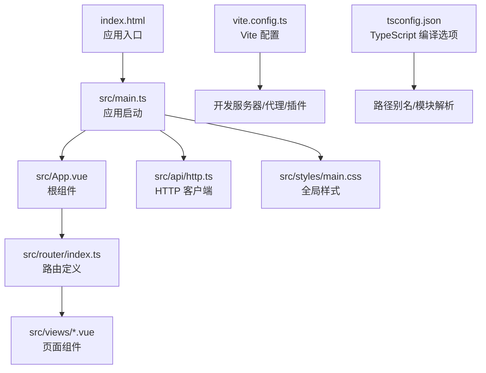
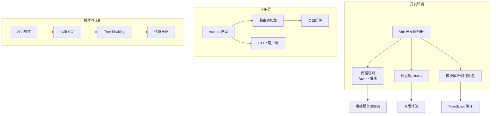
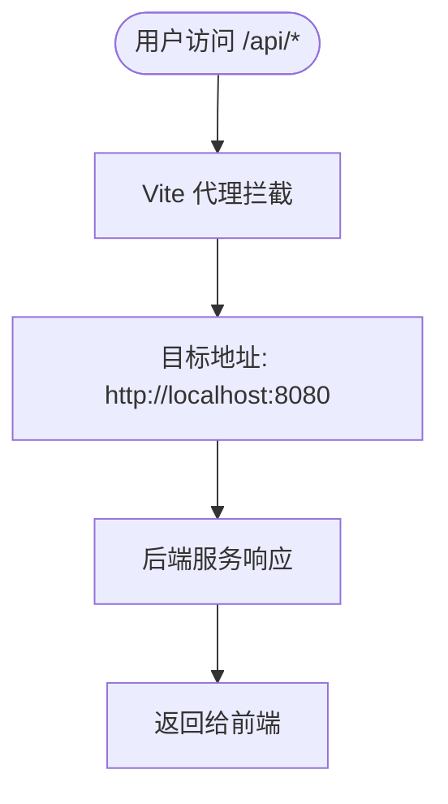
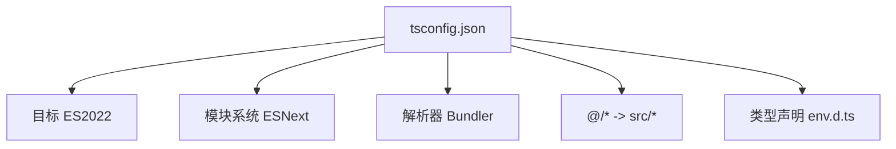
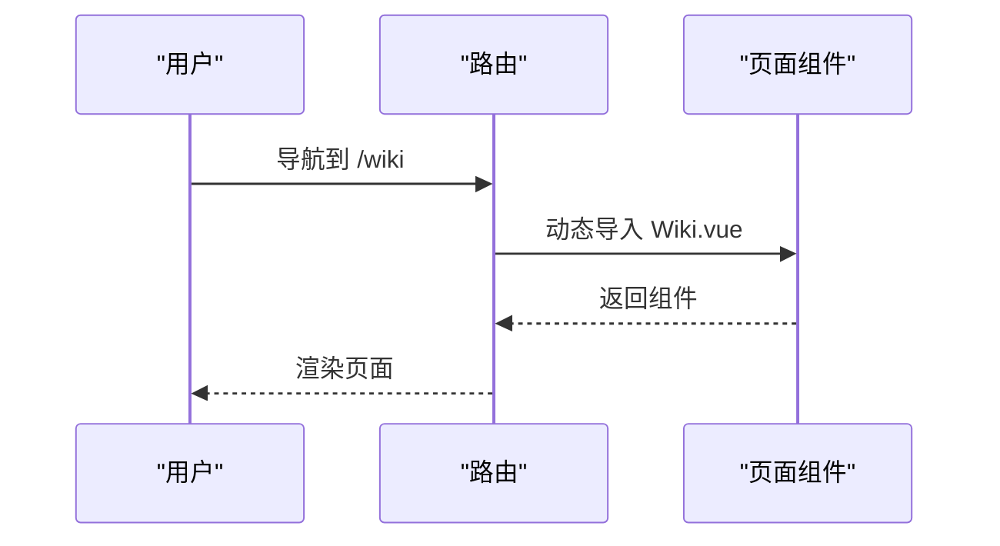
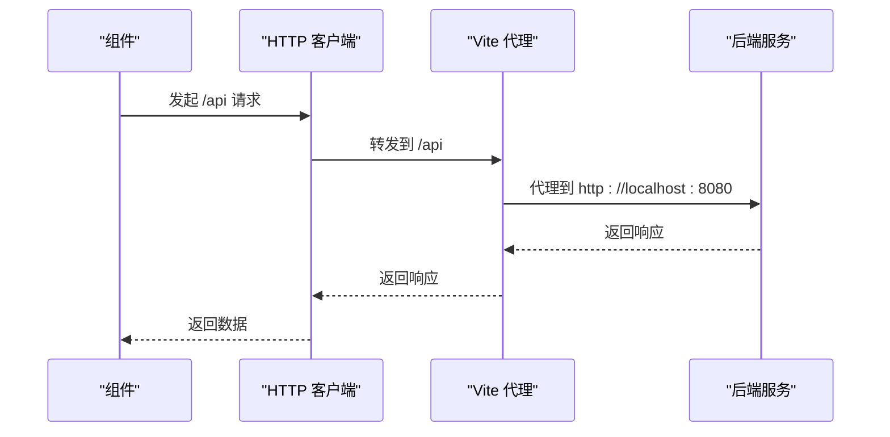
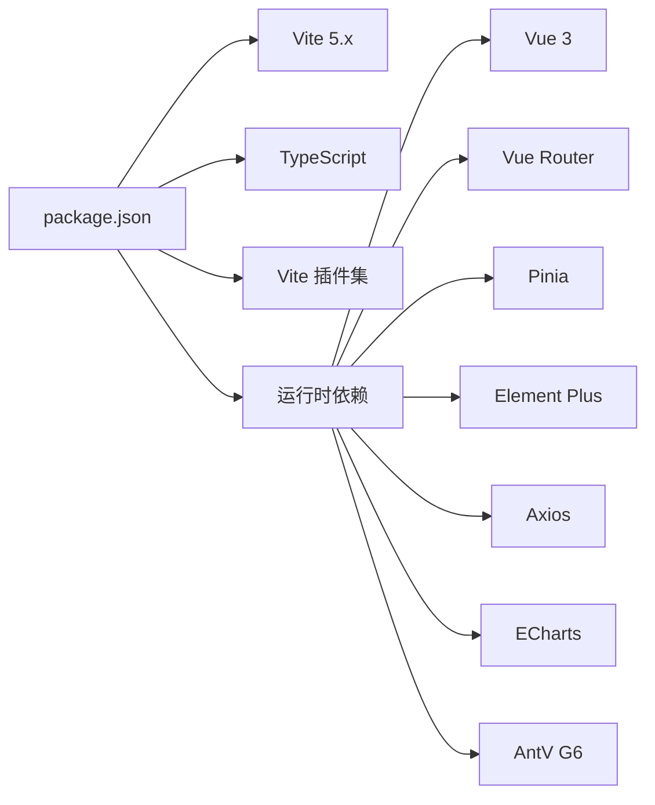

# 前端构建配置

<cite>
**本文引用的文件**
- [vite.config.ts](file://web/vite.config.ts)
- [tsconfig.json](file://web/tsconfig.json)
- [package.json](file://web/package.json)
- [main.ts](file://web/src/main.ts)
- [env.d.ts](file://web/src/env.d.ts)
- [index.html](file://web/index.html)
- [http.ts](file://web/src/api/http.ts)
- [router/index.ts](file://web/src/router/index.ts)
- [App.vue](file://web/src/App.vue)
- [Dashboard.vue](file://web/src/views/Dashboard.vue)
- [Wiki.vue](file://web/src/views/Wiki.vue)
- [main.css](file://web/src/styles/main.css)
</cite>

## 目录
1. [简介](#简介)
2. [项目结构](#项目结构)
3. [核心组件](#核心组件)
4. [架构总览](#架构总览)
5. [详细组件分析](#详细组件分析)
6. [依赖关系分析](#依赖关系分析)
7. [性能考虑](#性能考虑)
8. [故障排查指南](#故障排查指南)
9. [结论](#结论)
10. [附录](#附录)

## 简介
本文件面向 LLM Wiki 的前端工程，聚焦于 Vite 5.x 构建工具与 TypeScript 编译配置，系统阐述开发服务器与代理、热重载机制、TypeScript 路径别名与模块解析、打包优化（代码分割、Tree Shaking、压缩）、开发与生产环境配置、静态资源处理、浏览器兼容性以及构建性能优化策略。文档严格基于仓库中的实际配置文件进行分析与总结，帮助开发者快速理解并高效维护前端构建体系。

## 项目结构
前端工程位于 web 目录，采用 Vue 3 + Vite + TypeScript 技术栈，使用 Element Plus 作为 UI 组件库，并通过路由懒加载实现按需加载与代码分割。入口 HTML 文件负责挂载应用，主入口脚本完成应用初始化与插件注册。

**图表来源**
- [index.html:1-13](file://web/index.html#L1-L13)
- [main.ts:1-14](file://web/src/main.ts#L1-L14)
- [App.vue:1-38](file://web/src/App.vue#L1-L38)
- [router/index.ts:1-22](file://web/src/router/index.ts#L1-L22)
- [http.ts:1-17](file://web/src/api/http.ts#L1-L17)
- [main.css:1-129](file://web/src/styles/main.css#L1-L129)
- [vite.config.ts:1-23](file://web/vite.config.ts#L1-L23)
- [tsconfig.json:1-21](file://web/tsconfig.json#L1-L21)

**章节来源**
- [index.html:1-13](file://web/index.html#L1-L13)
- [main.ts:1-14](file://web/src/main.ts#L1-L14)
- [vite.config.ts:1-23](file://web/vite.config.ts#L1-L23)
- [tsconfig.json:1-21](file://web/tsconfig.json#L1-L21)

## 核心组件
- 开发服务器与代理
  - Vite 开发服务器默认监听端口，通过代理将 /api 前缀请求转发至后端服务地址，便于前后端联调。
- 热重载机制
  - 基于 Vite 内置的模块热替换（HMR），在修改源码后自动刷新页面或局部更新，提升开发效率。
- TypeScript 配置
  - 使用 ESNext 模块系统与 Bundler 解析器，启用严格模式相关选项，配置路径别名 @/* 指向 src/*，并声明 Vue 单文件组件类型。
- 打包与优化
  - 通过路由懒加载实现代码分割；Vite 默认开启 Tree Shaking；生产构建自动进行代码压缩与资源优化。
- 静态资源处理
  - 图片与字体等静态资源由 Vite 处理，支持按需优化与输出目录管理。
- 浏览器兼容性
  - 目标 ES2022，结合现代浏览器特性与必要的 polyfill 策略满足兼容需求。
- 性能优化
  - 利用 Vite 并行构建、依赖预构建与缓存机制，配合按需加载与压缩策略提升构建与运行性能。

**章节来源**
- [vite.config.ts:13-21](file://web/vite.config.ts#L13-L21)
- [tsconfig.json:3-17](file://web/tsconfig.json#L3-L17)
- [router/index.ts:5-13](file://web/src/router/index.ts#L5-L13)
- [http.ts:3-6](file://web/src/api/http.ts#L3-L6)

## 架构总览
下图展示了前端开发与构建的关键流程：从开发服务器启动到代理转发、从模块解析到热更新、从路由懒加载到打包优化的整体架构。

**图表来源**
- [vite.config.ts:13-21](file://web/vite.config.ts#L13-L21)
- [main.ts:1-14](file://web/src/main.ts#L1-L14)
- [router/index.ts:5-13](file://web/src/router/index.ts#L5-L13)
- [http.ts:3-6](file://web/src/api/http.ts#L3-L6)
- [tsconfig.json:3-17](file://web/tsconfig.json#L3-L17)

## 详细组件分析

### Vite 开发服务器与代理配置
- 插件与解析
  - 已启用 Vue 插件，路径别名 @ 指向 src 目录，便于统一导入。
- 开发服务器
  - 监听端口用于本地开发访问。
- 代理规则
  - 将 /api 前缀请求代理到后端服务地址，支持跨域场景下的联调。

**图表来源**
- [vite.config.ts:13-21](file://web/vite.config.ts#L13-L21)

**章节来源**
- [vite.config.ts:6-22](file://web/vite.config.ts#L6-L22)

### TypeScript 编译与路径别名
- 编译目标与模块系统
  - 目标 ES2022，模块系统为 ESNext，使用 Bundler 解析器，确保与 Vite 生态兼容。
- 关键选项
  - 启用 ES 对象互操作、跳过库检查、隔离模块、JSON 模块解析、一致大小写检查等。
- 路径别名
  - 通过 baseUrl 与 paths 配置 @/* 映射到 src/*，简化导入路径。
- 类型声明
  - 通过 env.d.ts 声明 *.vue 模块类型，保证 IDE 与编译器识别单文件组件。

**图表来源**
- [tsconfig.json:3-17](file://web/tsconfig.json#L3-L17)
- [env.d.ts:1-7](file://web/src/env.d.ts#L1-L7)

**章节来源**
- [tsconfig.json:1-21](file://web/tsconfig.json#L1-L21)
- [env.d.ts:1-7](file://web/src/env.d.ts#L1-L7)

### 路由懒加载与代码分割
- 路由定义
  - 使用动态导入实现页面级懒加载，减少首屏体积。
- 运行时行为
  - 应用启动后按需加载对应页面组件，结合过渡动画提升用户体验。

**图表来源**
- [router/index.ts:5-13](file://web/src/router/index.ts#L5-L13)
- [Wiki.vue:1-61](file://web/src/views/Wiki.vue#L1-L61)

**章节来源**
- [router/index.ts:1-22](file://web/src/router/index.ts#L1-L22)
- [Wiki.vue:1-61](file://web/src/views/Wiki.vue#L1-L61)

### HTTP 客户端与后端通信
- 基础配置
  - 通过 axios 创建实例，baseURL 设为 /api，统一前缀便于代理转发。
- 错误处理
  - 统一拦截响应错误，打印日志并向上抛出，便于上层捕获与提示。

**图表来源**
- [http.ts:3-6](file://web/src/api/http.ts#L3-L6)
- [vite.config.ts:15-20](file://web/vite.config.ts#L15-L20)

**章节来源**
- [http.ts:1-17](file://web/src/api/http.ts#L1-L17)
- [vite.config.ts:15-20](file://web/vite.config.ts#L15-L20)

### 样式与主题
- 全局样式
  - 定义主题变量、布局与通用组件样式，确保页面视觉一致性。
- 组件样式
  - 页面组件内部使用 scoped 样式，避免样式污染。

**章节来源**
- [main.css:1-129](file://web/src/styles/main.css#L1-L129)
- [Dashboard.vue:55-61](file://web/src/views/Dashboard.vue#L55-L61)
- [Wiki.vue:55-61](file://web/src/views/Wiki.vue#L55-L61)

## 依赖关系分析
- 包管理与脚本
  - 通过 package.json 定义开发与构建脚本，依赖 Vite 5.x、Vue 3、TypeScript 及相关生态插件。
- 运行时依赖
  - Vue、Vue Router、Pinia、Element Plus、Axios、ECharts、AntV G6 等。
- 开发依赖
  - Vite 插件、TypeScript 类型检查工具、自动导入与组件解析插件等。

**图表来源**
- [package.json:7-29](file://web/package.json#L7-L29)

**章节来源**
- [package.json:1-31](file://web/package.json#L1-L31)

## 性能考虑
- 代码分割与懒加载
  - 路由级懒加载有效降低首屏 JavaScript 体积，提升初始渲染速度。
- Tree Shaking
  - 在 ES 模块系统与严格模式下，未使用的导出会自动移除，减小产物体积。
- 压缩与优化
  - 生产构建默认启用代码压缩与资源优化，建议结合 CDN 与缓存策略进一步提升加载性能。
- 构建性能
  - 利用 Vite 的并行构建、依赖预构建与缓存机制，缩短开发与生产构建时间。
- 增量编译
  - 在开发模式下，仅重新编译受影响模块，提高热更新效率。

[本节为通用性能指导，不直接分析具体文件，故无“章节来源”]

## 故障排查指南
- 代理无法转发
  - 检查代理目标地址与 changeOrigin 设置是否正确，确认后端服务已启动且可访问。
- 端口冲突
  - 修改开发服务器端口或关闭占用进程，确保本地开发环境可用。
- 路由懒加载失败
  - 确认动态导入路径正确，组件文件存在且命名规范。
- TypeScript 类型报错
  - 检查 tsconfig.json 中的路径别名与模块解析配置，确保 env.d.ts 正确声明 *.vue 类型。
- 样式异常
  - 检查 scoped 样式作用范围，避免选择器优先级问题导致覆盖。

**章节来源**
- [vite.config.ts:13-21](file://web/vite.config.ts#L13-L21)
- [router/index.ts:5-13](file://web/src/router/index.ts#L5-L13)
- [tsconfig.json:16-17](file://web/tsconfig.json#L16-L17)
- [env.d.ts:1-7](file://web/src/env.d.ts#L1-L7)

## 结论
本前端工程以 Vite 5.x 为核心，结合 TypeScript 与 Vue 3，实现了高效的开发体验与良好的构建优化。通过代理、热重载、路径别名与路由懒加载等配置，既保障了开发效率，也兼顾了生产环境的性能与可维护性。建议在后续迭代中持续关注浏览器兼容性与资源优化策略，以适配更广泛的用户场景。

[本节为总结性内容，不直接分析具体文件，故无“章节来源”]

## 附录
- 开发命令
  - dev: 启动开发服务器
  - build: 生成生产构建
  - preview: 预览生产构建（指定端口）
- 入口与启动
  - index.html 挂载点与 main.ts 应用初始化流程清晰，便于扩展与维护。

**章节来源**
- [package.json:7-10](file://web/package.json#L7-L10)
- [index.html:8-10](file://web/index.html#L8-L10)
- [main.ts:1-14](file://web/src/main.ts#L1-L14)