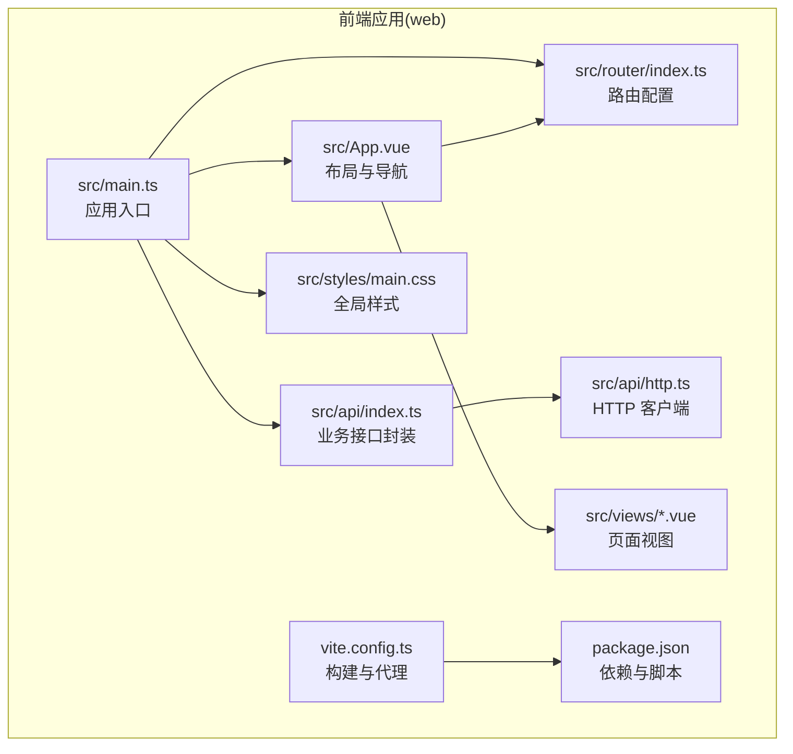
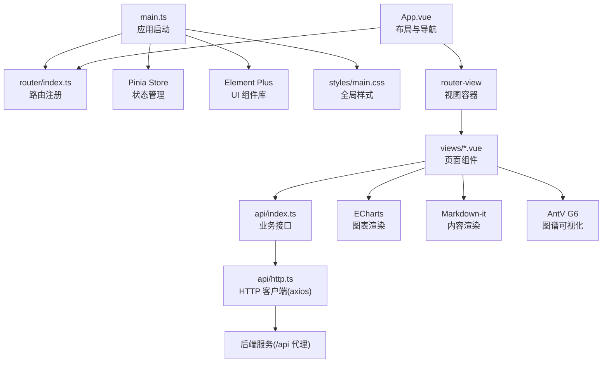
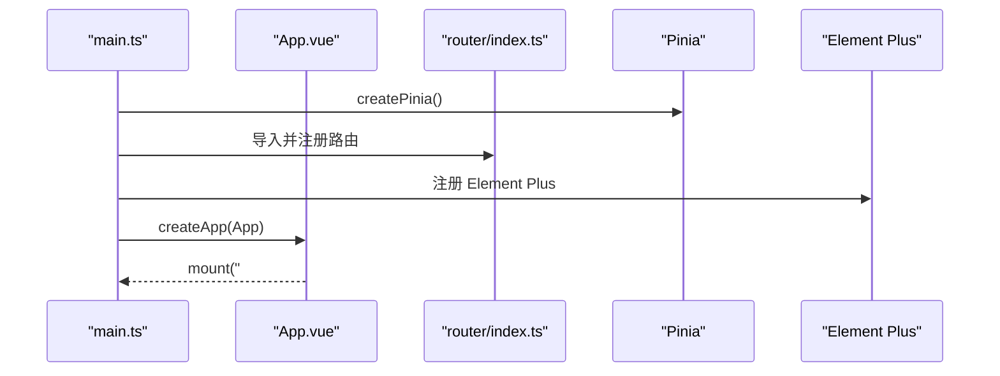
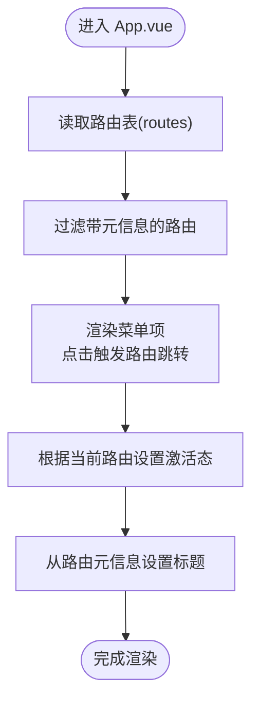
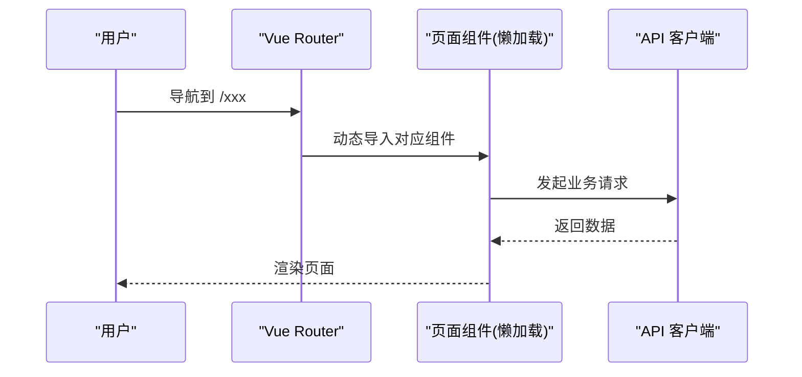
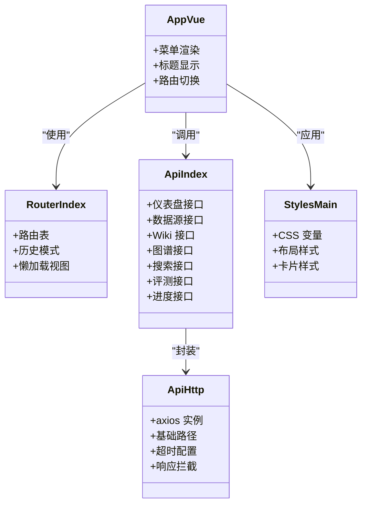
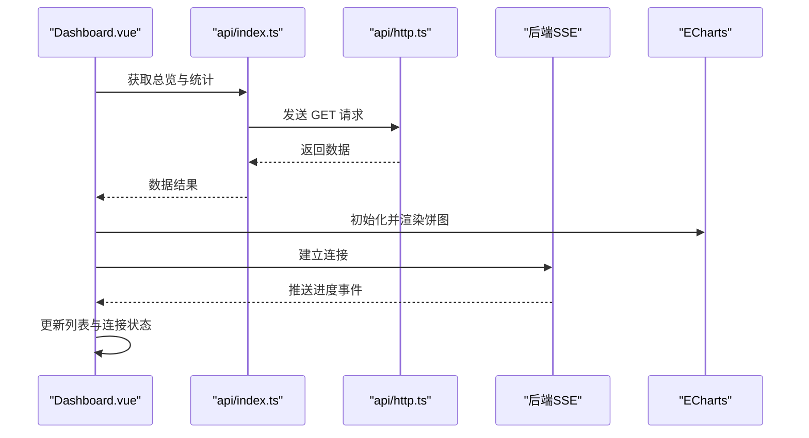
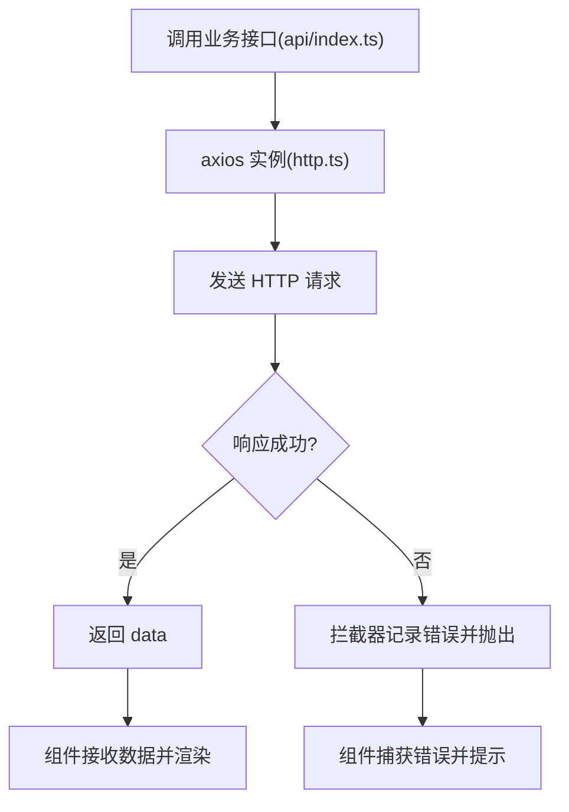
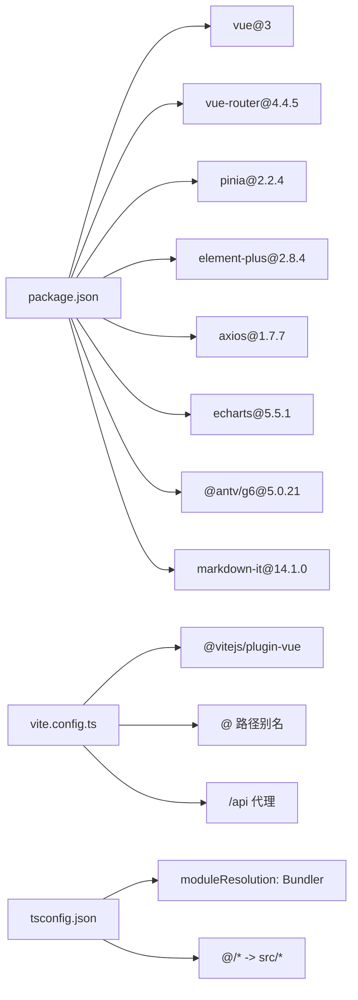

# 前端系统设计

<cite>
**本文引用的文件**
- [package.json](file://web/package.json)
- [vite.config.ts](file://web/vite.config.ts)
- [tsconfig.json](file://web/tsconfig.json)
- [main.ts](file://web/src/main.ts)
- [App.vue](file://web/src/App.vue)
- [router/index.ts](file://web/src/router/index.ts)
- [api/http.ts](file://web/src/api/http.ts)
- [api/index.ts](file://web/src/api/index.ts)
- [styles/main.css](file://web/src/styles/main.css)
- [views/Dashboard.vue](file://web/src/views/Dashboard.vue)
- [views/Sources.vue](file://web/src/views/Sources.vue)
- [views/Wiki.vue](file://web/src/views/Wiki.vue)
- [env.d.ts](file://web/src/env.d.ts)
</cite>

## 目录
1. [简介](#简介)
2. [项目结构](#项目结构)
3. [核心组件](#核心组件)
4. [架构总览](#架构总览)
5. [详细组件分析](#详细组件分析)
6. [依赖关系分析](#依赖关系分析)
7. [性能考虑](#性能考虑)
8. [故障排查指南](#故障排查指南)
9. [结论](#结论)
10. [附录](#附录)

## 简介
本设计文档面向 LLM Wiki 的前端系统，基于 Vue 3 + TypeScript，采用组合式 API（Composition API）进行组件逻辑组织，结合 Vue Router 4.4.5 实现页面导航与路由懒加载，通过 Pinia 2.2.4 进行状态管理，并以 Element Plus 2.8.4 提供 UI 组件库与主题定制。前端通过 Vite 5.0.2 构建工具完成开发与生产优化，API 层通过 axios 封装统一请求与响应处理，配合 ECharts、AntV G6、Markdown-it 等可视化与渲染能力，实现数据源管理、知识图谱、智能检索、Wiki 页面浏览等核心功能。

## 项目结构
前端工程位于 web 目录，采用按功能模块划分的目录结构：
- src/api：HTTP 客户端与业务接口封装
- src/router：路由定义与懒加载页面
- src/views：页面级视图组件
- src/styles：全局样式与主题变量
- src：入口应用与类型声明
- vite.config.ts：构建与开发服务器配置
- package.json：依赖与脚本定义

**图表来源**
- [main.ts:1-14](file://web/src/main.ts#L1-L14)
- [App.vue:1-38](file://web/src/App.vue#L1-L38)
- [router/index.ts:1-22](file://web/src/router/index.ts#L1-L22)
- [api/index.ts:1-70](file://web/src/api/index.ts#L1-L70)
- [api/http.ts:1-17](file://web/src/api/http.ts#L1-L17)
- [styles/main.css:1-129](file://web/src/styles/main.css#L1-L129)
- [vite.config.ts:1-23](file://web/vite.config.ts#L1-L23)
- [package.json:1-31](file://web/package.json#L1-L31)

**章节来源**
- [package.json:1-31](file://web/package.json#L1-L31)
- [vite.config.ts:1-23](file://web/vite.config.ts#L1-L23)
- [tsconfig.json:1-21](file://web/tsconfig.json#L1-L21)

## 核心组件
- 应用入口与插件注册：在入口中注册 Pinia、Vue Router、Element Plus，并挂载应用。
- 布局与导航：侧边栏菜单动态从路由元信息生成，顶部标题随路由变化。
- 路由系统：基于 createWebHistory 的 SPA 路由，页面组件采用动态导入实现懒加载。
- API 客户端：基于 axios 创建实例，统一设置基础路径与超时，提供响应拦截器日志输出。
- 视图组件：Dashboard、Sources、Wiki 等页面展示不同业务场景的数据与交互。

**章节来源**
- [main.ts:1-14](file://web/src/main.ts#L1-L14)
- [App.vue:1-38](file://web/src/App.vue#L1-L38)
- [router/index.ts:1-22](file://web/src/router/index.ts#L1-L22)
- [api/http.ts:1-17](file://web/src/api/http.ts#L1-L17)
- [api/index.ts:1-70](file://web/src/api/index.ts#L1-L70)

## 架构总览
前端采用“入口应用 → 路由 → 视图组件 → API 客户端”的分层架构。Element Plus 提供 UI 组件，ECharts 用于图表渲染，Markdown-it 用于内容渲染，AntV G6 用于图谱可视化（在视图中引入）。构建阶段通过 Vite 插件与别名配置提升开发体验与打包效率。

**图表来源**
- [main.ts:1-14](file://web/src/main.ts#L1-L14)
- [App.vue:1-38](file://web/src/App.vue#L1-L38)
- [router/index.ts:1-22](file://web/src/router/index.ts#L1-L22)
- [api/index.ts:1-70](file://web/src/api/index.ts#L1-L70)
- [api/http.ts:1-17](file://web/src/api/http.ts#L1-L17)
- [styles/main.css:1-129](file://web/src/styles/main.css#L1-L129)
- [vite.config.ts:1-23](file://web/vite.config.ts#L1-L23)

## 详细组件分析

### 应用入口与初始化
- 注册 Pinia、Vue Router、Element Plus。
- 引入全局样式与应用根组件。
- 使用 createApp 创建应用实例并挂载。

**图表来源**
- [main.ts:1-14](file://web/src/main.ts#L1-L14)
- [router/index.ts:1-22](file://web/src/router/index.ts#L1-L22)

**章节来源**
- [main.ts:1-14](file://web/src/main.ts#L1-L14)

### 布局与导航
- 侧边栏菜单项根据路由表过滤出带元信息的路由生成。
- 当前路由激活态高亮，顶部标题来自路由元信息。
- 使用过渡动画包裹 router-view，提升页面切换体验。

**图表来源**
- [App.vue:1-38](file://web/src/App.vue#L1-L38)
- [router/index.ts:1-22](file://web/src/router/index.ts#L1-L22)

**章节来源**
- [App.vue:1-38](file://web/src/App.vue#L1-L38)

### 路由系统设计
- 使用 createRouter + createWebHistory 实现前端路由。
- 所有页面组件通过动态导入实现懒加载，减少首屏体积。
- 路由元信息包含标题与图标，用于布局菜单与标题渲染。

**图表来源**
- [router/index.ts:1-22](file://web/src/router/index.ts#L1-L22)
- [api/index.ts:1-70](file://web/src/api/index.ts#L1-L70)

**章节来源**
- [router/index.ts:1-22](file://web/src/router/index.ts#L1-L22)

### 状态管理策略（Pinia）
- 在入口注册 Pinia，后续可在组件中通过组合式 API 使用 store。
- 全局状态设计建议：将用户会话、主题偏好、当前选中页面等状态放入 store，避免跨组件传递。
- 状态持久化：可结合浏览器存储或 Pinia 插件实现，确保刷新后状态不丢失。

**章节来源**
- [main.ts:1-14](file://web/src/main.ts#L1-L14)

### 组件架构设计
- 视图组件层次清晰：App.vue 作为根布局，router-view 容纳各页面视图。
- API 客户端封装：统一基地址与超时，集中处理响应错误，业务接口在 index.ts 中按模块导出。
- 样式系统：全局 CSS 变量定义主题色，布局采用 Flex 布局，卡片与指标卡片统一风格。

**图表来源**
- [App.vue:1-38](file://web/src/App.vue#L1-L38)
- [router/index.ts:1-22](file://web/src/router/index.ts#L1-L22)
- [api/http.ts:1-17](file://web/src/api/http.ts#L1-L17)
- [api/index.ts:1-70](file://web/src/api/index.ts#L1-L70)
- [styles/main.css:1-129](file://web/src/styles/main.css#L1-L129)

**章节来源**
- [App.vue:1-38](file://web/src/App.vue#L1-L38)
- [api/index.ts:1-70](file://web/src/api/index.ts#L1-L70)
- [styles/main.css:1-129](file://web/src/styles/main.css#L1-L129)

### 视图组件示例分析

#### 仪表盘（Dashboard）
- 展示核心指标卡片、实时进度表格与饼图统计。
- 使用 ECharts 渲染 Wiki 页面类型分布。
- 通过 EventSource 订阅后端 SSE 实时进度流。

**图表来源**
- [views/Dashboard.vue:1-119](file://web/src/views/Dashboard.vue#L1-L119)
- [api/index.ts:1-70](file://web/src/api/index.ts#L1-L70)
- [api/http.ts:1-17](file://web/src/api/http.ts#L1-L17)

**章节来源**
- [views/Dashboard.vue:1-119](file://web/src/views/Dashboard.vue#L1-L119)

#### 数据源（Sources）
- 支持文件上传、URL 提交、远程平台（飞书/钉钉）提交三种方式。
- 列表展示数据源与任务，支持删除、取消、重试等操作。
- 使用 Element Plus 表单、上传、标签等组件。

**章节来源**
- [views/Sources.vue:1-108](file://web/src/views/Sources.vue#L1-L108)
- [api/index.ts:11-26](file://web/src/api/index.ts#L11-L26)

#### Wiki 页面（Wiki）
- 左侧列表筛选与选择，右侧渲染 Markdown 内容。
- 使用 Markdown-it 渲染，支持标签与分隔线等格式。

**章节来源**
- [views/Wiki.vue:1-61](file://web/src/views/Wiki.vue#L1-L61)
- [api/index.ts:27-36](file://web/src/api/index.ts#L27-L36)

### 前端 API 设计
- 基于 axios 创建实例，设置 baseURL 为 /api，统一超时时间。
- 响应拦截器统一记录错误日志，便于调试。
- 业务接口按模块导出，如仪表盘、数据源、Wiki、图谱、搜索、评测、进度等。

**图表来源**
- [api/http.ts:1-17](file://web/src/api/http.ts#L1-L17)
- [api/index.ts:1-70](file://web/src/api/index.ts#L1-L70)

**章节来源**
- [api/http.ts:1-17](file://web/src/api/http.ts#L1-L17)
- [api/index.ts:1-70](file://web/src/api/index.ts#L1-L70)

### UI 组件库集成（Element Plus）
- 全量引入 Element Plus 样式与组件，提供丰富的表单、表格、标签、按钮等控件。
- 主题定制：通过 CSS 变量定义主色调、背景、卡片与文本颜色，保证整体视觉一致性。
- 国际化支持：可通过 Element Plus 提供的国际化能力扩展，当前项目未见相关配置。

**章节来源**
- [main.ts:1-14](file://web/src/main.ts#L1-L14)
- [styles/main.css:1-129](file://web/src/styles/main.css#L1-L129)

### 前端构建配置（Vite）
- 插件：使用 @vitejs/plugin-vue 处理 .vue 文件。
- 路径别名：@ 指向 src，简化导入路径。
- 开发服务器：本地端口 5173，配置 /api 代理到后端 8080。
- 生产构建：通过脚本执行构建与预览。

**章节来源**
- [vite.config.ts:1-23](file://web/vite.config.ts#L1-L23)
- [package.json:7-11](file://web/package.json#L7-L11)

## 依赖关系分析
- 运行时依赖：Vue 3、Vue Router 4.4.5、Pinia 2.2.4、Element Plus 2.8.4、axios、ECharts、AntV G6、markdown-it。
- 开发依赖：Vite 5、@vitejs/plugin-vue、TypeScript、unplugin-auto-import、unplugin-vue-components、vue-tsc。
- 类型声明：env.d.ts 声明 .vue 模块，确保 TS 能识别 Vue 组件。

**图表来源**
- [package.json:1-31](file://web/package.json#L1-L31)
- [vite.config.ts:1-23](file://web/vite.config.ts#L1-L23)
- [tsconfig.json:1-21](file://web/tsconfig.json#L1-L21)

**章节来源**
- [package.json:1-31](file://web/package.json#L1-L31)
- [vite.config.ts:1-23](file://web/vite.config.ts#L1-L23)
- [tsconfig.json:1-21](file://web/tsconfig.json#L1-L21)

## 性能考虑
- 代码分割与懒加载：路由页面均采用动态导入，减少首屏加载体积。
- 资源压缩与 Tree Shaking：Vite 默认启用按需导入与最小化。
- 缓存策略：可结合浏览器缓存与 HTTP 缓存头，对静态资源与接口数据进行缓存。
- 图表与图谱：ECharts 与 G6 在视图中按需初始化，卸载时释放资源，避免内存泄漏。

[本节为通用性能指导，无需列出具体文件来源]

## 故障排查指南
- 网络请求失败：检查 /api 代理是否正确指向后端，确认 axios 响应拦截器中的错误日志。
- 路由跳转无效：确认路由元信息（title、icon）是否正确配置，组件是否通过动态导入懒加载。
- 样式异常：检查 CSS 变量与 Element Plus 样式是否正确引入，组件 scoped 样式是否覆盖冲突。
- 开发服务器无法访问：确认本地端口 5173 是否被占用，代理配置是否正确。

**章节来源**
- [vite.config.ts:13-21](file://web/vite.config.ts#L13-L21)
- [api/http.ts:8-14](file://web/src/api/http.ts#L8-L14)

## 结论
该前端系统以 Vue 3 + TypeScript 为基础，结合 Vue Router 与 Pinia 实现清晰的路由与状态管理，Element Plus 提供一致的 UI 体验，Vite 构建工具保障开发与生产的高效性。通过 API 客户端封装与视图组件解耦，系统具备良好的可维护性与扩展性。后续可在状态持久化、国际化、测试策略等方面进一步完善。

## 附录
- 类型声明：env.d.ts 声明 Vue 模块，确保 TS 正确解析组件。
- 路由元信息：title 与 icon 用于布局菜单与标题渲染。
- 样式规范：CSS 变量统一主题色，布局采用 Flex，卡片与指标样式统一。

**章节来源**
- [env.d.ts:1-8](file://web/src/env.d.ts#L1-L8)
- [router/index.ts:3-14](file://web/src/router/index.ts#L3-L14)
- [styles/main.css:1-129](file://web/src/styles/main.css#L1-L129)