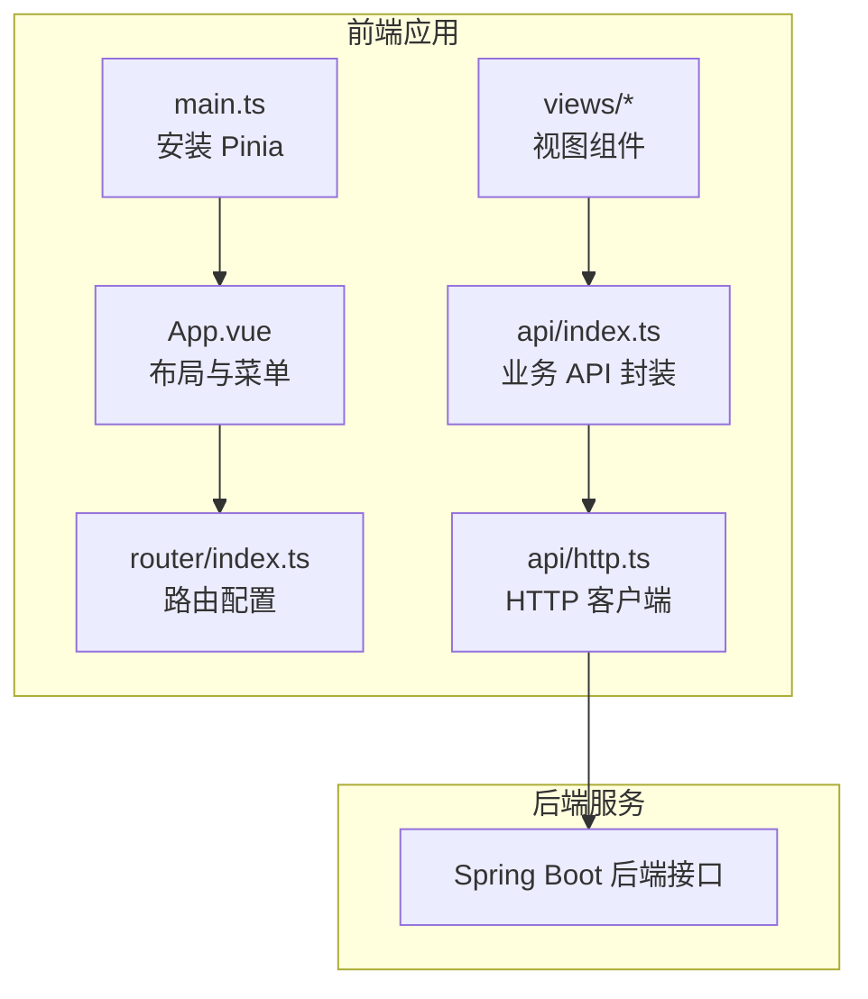
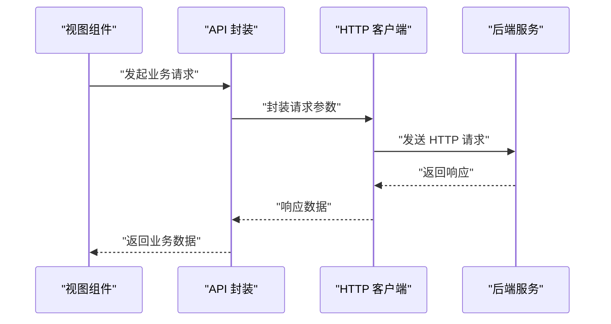
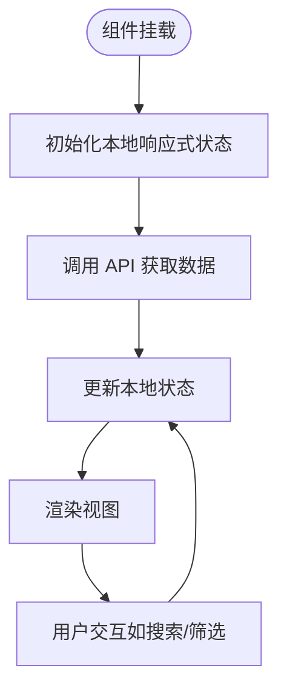
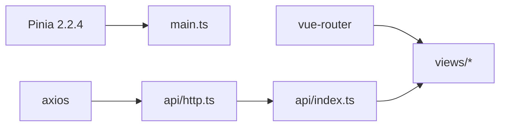

# 状态管理策略

<cite>
**本文引用的文件**
- [main.ts](file://web/src/main.ts)
- [package.json](file://web/package.json)
- [App.vue](file://web/src/App.vue)
- [router/index.ts](file://web/src/router/index.ts)
- [api/http.ts](file://web/src/api/http.ts)
- [api/index.ts](file://web/src/api/index.ts)
- [views/Dashboard.vue](file://web/src/views/Dashboard.vue)
- [views/Search.vue](file://web/src/views/Search.vue)
- [views/Wiki.vue](file://web/src/views/Wiki.vue)
</cite>

## 目录
1. [引言](#引言)
2. [项目结构](#项目结构)
3. [核心组件](#核心组件)
4. [架构概览](#架构概览)
5. [详细组件分析](#详细组件分析)
6. [依赖分析](#依赖分析)
7. [性能考虑](#性能考虑)
8. [故障排查指南](#故障排查指南)
9. [结论](#结论)
10. [附录](#附录)

## 引言
本文件面向 LLM Wiki 的前端状态管理策略，聚焦于 Pinia 2.2.4 在 Vue 3 应用中的落地实践。当前仓库中未发现显式的 store 定义文件，但通过入口初始化、路由与视图组件的交互，可以梳理出状态管理的现状与可演进方向。本文将从 store 定义与模块化、全局状态设计、状态持久化、状态更新机制、响应式数据、调试与性能优化等维度进行系统化说明，并给出基于现有代码的改进建议。

## 项目结构
前端工程位于 web 目录，采用 Vue 3 + Vite + Element Plus 技术栈，Pinia 作为状态管理库。入口文件完成 Pinia 的安装；路由负责页面导航；各视图组件通过 API 层访问后端服务；当前未发现独立的 store 文件夹或模块化 store 定义。

**图表来源**
- [main.ts:1-14](file://web/src/main.ts#L1-L14)
- [router/index.ts:1-22](file://web/src/router/index.ts#L1-L22)
- [api/index.ts:1-70](file://web/src/api/index.ts#L1-L70)
- [api/http.ts:1-17](file://web/src/api/http.ts#L1-L17)

**章节来源**
- [main.ts:1-14](file://web/src/main.ts#L1-L14)
- [router/index.ts:1-22](file://web/src/router/index.ts#L1-L22)
- [package.json:12-21](file://web/package.json#L12-L21)

## 核心组件
- 入口与状态库
  - 入口文件安装并挂载 Pinia，为后续 store 使用奠定基础。
- 路由与页面状态
  - 路由配置驱动页面切换，视图组件内部通过本地响应式数据承载页面级状态。
- API 层与数据流
  - API 封装统一请求与响应处理，拦截器集中处理错误，避免分散的错误处理逻辑。
- 视图组件与状态
  - Dashboard、Search、Wiki 等组件通过 ref/computed 管理本地状态，未见跨组件共享状态。

**章节来源**
- [main.ts:9-11](file://web/src/main.ts#L9-L11)
- [router/index.ts:3-14](file://web/src/router/index.ts#L3-L14)
- [api/http.ts:8-14](file://web/src/api/http.ts#L8-L14)
- [views/Dashboard.vue:61-119](file://web/src/views/Dashboard.vue#L61-L119)
- [views/Search.vue:26-42](file://web/src/views/Search.vue#L26-L42)
- [views/Wiki.vue:27-61](file://web/src/views/Wiki.vue#L27-L61)

## 架构概览
当前状态管理以“组件内响应式状态 + API 封装”为主，Pinia 已在入口安装，尚未启用模块化 store。下图展示从视图到 API 再到后端的调用链路。

**图表来源**
- [views/Dashboard.vue:64-93](file://web/src/views/Dashboard.vue#L64-L93)
- [views/Search.vue:34-39](file://web/src/views/Search.vue#L34-L39)
- [views/Wiki.vue:45-50](file://web/src/views/Wiki.vue#L45-L50)
- [api/index.ts:3-70](file://web/src/api/index.ts#L3-L70)
- [api/http.ts:3-6](file://web/src/api/http.ts#L3-L6)

## 详细组件分析

### 组件内状态与计算属性
- Dashboard
  - 使用本地响应式数据维护概览信息、进度列表与连接状态；通过 ECharts 渲染统计图表；通过 SSE 推送更新进度。
- Search
  - 使用本地响应式数据维护查询词、命中结果与加载状态；按键触发搜索并更新结果。
- Wiki
  - 使用本地响应式数据维护页面列表、当前选中项、过滤条件与渲染内容；通过计算属性过滤页面并渲染 Markdown。

**图表来源**
- [views/Dashboard.vue:61-119](file://web/src/views/Dashboard.vue#L61-L119)
- [views/Search.vue:26-42](file://web/src/views/Search.vue#L26-L42)
- [views/Wiki.vue:27-61](file://web/src/views/Wiki.vue#L27-L61)

**章节来源**
- [views/Dashboard.vue:61-119](file://web/src/views/Dashboard.vue#L61-L119)
- [views/Search.vue:26-42](file://web/src/views/Search.vue#L26-L42)
- [views/Wiki.vue:27-61](file://web/src/views/Wiki.vue#L27-L61)

### 状态持久化与恢复
- 当前未发现持久化实现（如本地存储、状态恢复、数据同步）。建议在 Pinia 中引入持久化插件，结合路由状态与用户偏好，实现关键状态的本地持久化与恢复。

[本节为概念性建议，不直接分析具体文件]

### 状态更新机制
- 同步更新：组件内通过响应式数据直接更新状态。
- 异步更新：通过 API 调用获取数据后更新状态；SSE 流式更新进度。
- 监听机制：当前未见显式的 watch 监听；可在 store 中引入 watch 或 watchEffect 监听状态变化并执行副作用。

**章节来源**
- [views/Dashboard.vue:95-108](file://web/src/views/Dashboard.vue#L95-L108)
- [views/Search.vue:34-39](file://web/src/views/Search.vue#L34-L39)
- [views/Wiki.vue:45-50](file://web/src/views/Wiki.vue#L45-L50)

### 状态模块化与隔离
- 当前未发现模块化 store；建议按功能域拆分 store（如用户、配置、搜索、页面），并通过 Pinia 的模块化能力实现状态隔离与复用。
- 模块间通信可通过 store 之间的相互调用或事件总线实现。

[本节为概念性建议，不直接分析具体文件]

### 响应式数据与计算属性
- 使用 ref 管理本地状态，使用 computed 进行派生数据计算（如过滤、渲染）。
- 建议在 store 中同样使用 computed 管理派生状态，减少重复计算与副作用。

**章节来源**
- [views/Dashboard.vue:39-43](file://web/src/views/Dashboard.vue#L39-L43)
- [views/Wiki.vue:39-43](file://web/src/views/Wiki.vue#L39-L43)

### 状态调试
- 可通过 Vue DevTools 集成 Pinia 调试，查看状态树、动作与时间旅行调试。
- 建议在开发环境开启严格模式与日志记录，便于定位状态变更来源。

[本节为概念性建议，不直接分析具体文件]

## 依赖分析
- Pinia 版本：2.2.4，已安装并在入口完成初始化。
- 路由与视图：通过路由驱动页面切换，视图组件内部管理状态。
- API 层：统一请求与错误处理，拦截器集中处理异常。

**图表来源**
- [package.json:18](file://web/package.json#L18)
- [main.ts:10](file://web/src/main.ts#L10)
- [router/index.ts:1-22](file://web/src/router/index.ts#L1-L22)
- [api/http.ts:1-17](file://web/src/api/http.ts#L1-L17)
- [api/index.ts:1-70](file://web/src/api/index.ts#L1-L70)

**章节来源**
- [package.json:12-21](file://web/package.json#L12-L21)
- [main.ts:9-11](file://web/src/main.ts#L9-L11)
- [api/http.ts:8-14](file://web/src/api/http.ts#L8-L14)

## 性能考虑
- 状态分片：将大对象拆分为小粒度状态，降低不必要的响应式开销。
- 计算属性缓存：优先使用 computed 缓存派生数据，避免重复计算。
- 状态压缩：对历史数据与大型集合进行分页或懒加载，减少内存占用。
- 异步更新批处理：合并多次异步更新，减少渲染次数。

[本节为通用性能指导，不直接分析具体文件]

## 故障排查指南
- 错误拦截：HTTP 客户端统一拦截错误并输出日志，便于定位问题。
- 网络异常：检查 baseURL、超时配置与后端连通性。
- 视图渲染：确认响应式数据更新路径与渲染时机，避免竞态。

**章节来源**
- [api/http.ts:8-14](file://web/src/api/http.ts#L8-L14)

## 结论
当前 LLM Wiki 前端采用组件内响应式状态与 API 封装的轻量方案，Pinia 已安装但未启用模块化 store。建议尽快引入模块化 store、持久化与调试工具，完善全局状态设计与跨组件通信，以支撑更复杂的业务场景与更好的开发体验。

## 附录
- 建议的 store 设计要点
  - 用户状态：登录态、权限、偏好设置
  - 应用配置：主题、语言、默认参数
  - 搜索状态：查询词、结果、历史、加载状态
  - 页面状态：路由参数、页面级筛选与排序
- 状态持久化策略
  - 关键状态写入本地存储，应用启动时恢复
  - 区分会话级与长期级状态，避免持久化敏感数据
- 状态调试与可观测性
  - 开启 Vue DevTools 与 Pinia 插件
  - 记录关键状态变更日志，支持时间旅行调试

[本节为概念性建议，不直接分析具体文件]