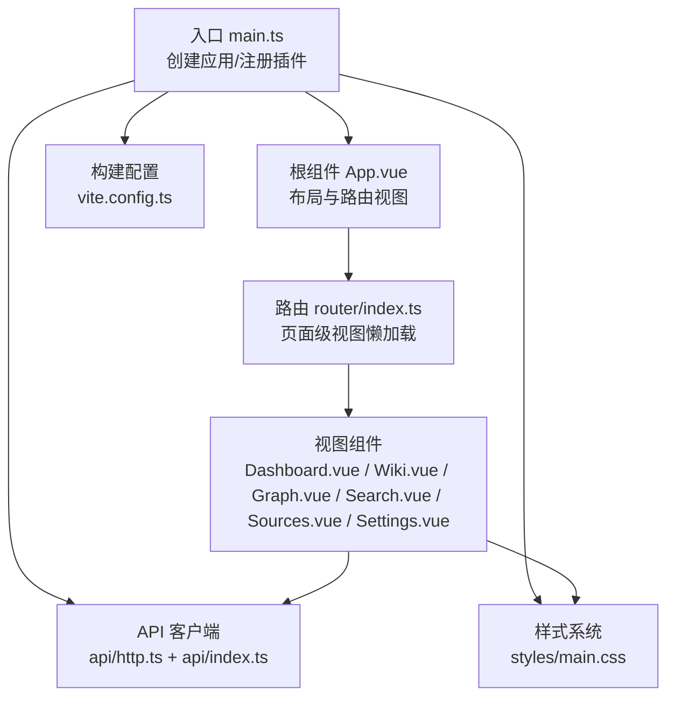
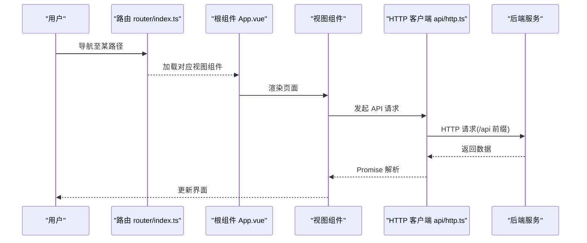
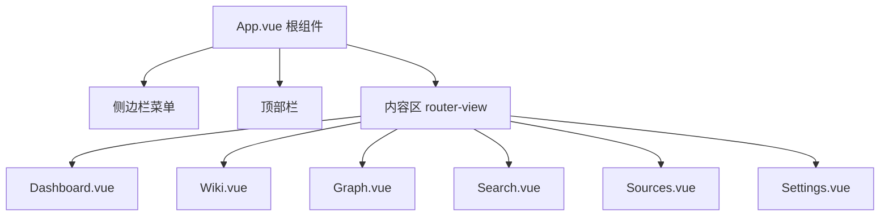
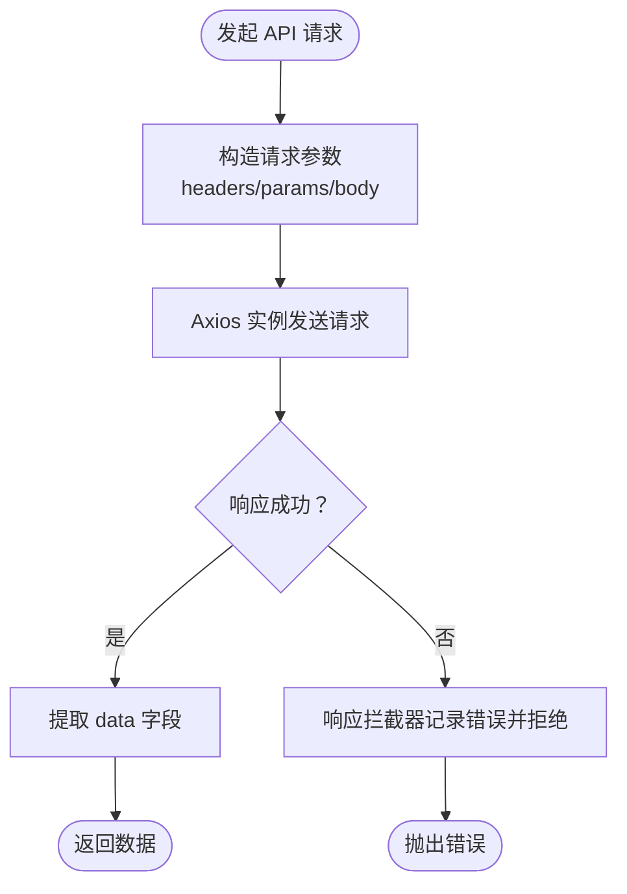
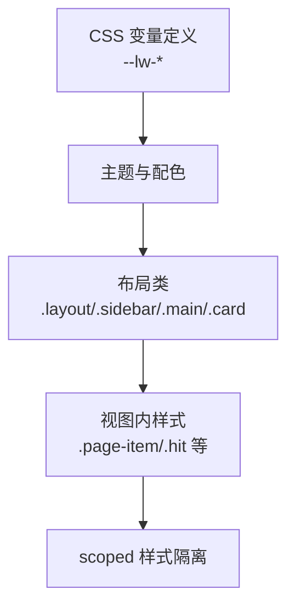
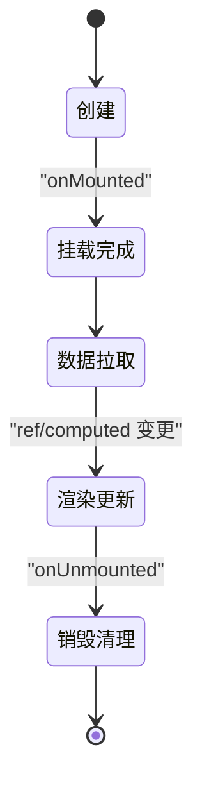
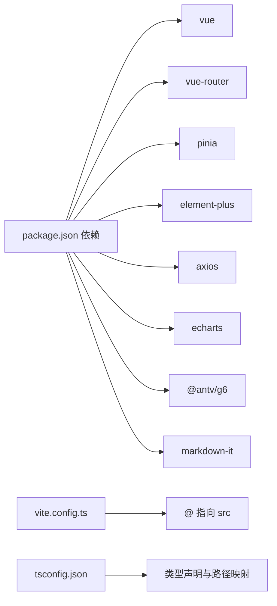

# 组件架构设计

<cite>
**本文引用的文件**
- [main.ts](file://web/src/main.ts)
- [App.vue](file://web/src/App.vue)
- [router/index.ts](file://web/src/router/index.ts)
- [api/http.ts](file://web/src/api/http.ts)
- [api/index.ts](file://web/src/api/index.ts)
- [styles/main.css](file://web/src/styles/main.css)
- [vite.config.ts](file://web/vite.config.ts)
- [Dashboard.vue](file://web/src/views/Dashboard.vue)
- [Wiki.vue](file://web/src/views/Wiki.vue)
- [Graph.vue](file://web/src/views/Graph.vue)
- [Search.vue](file://web/src/views/Search.vue)
- [Sources.vue](file://web/src/views/Sources.vue)
- [Settings.vue](file://web/src/views/Settings.vue)
- [package.json](file://web/package.json)
- [tsconfig.json](file://web/tsconfig.json)
- [env.d.ts](file://web/src/env.d.ts)
</cite>

## 目录
1. [简介](#简介)
2. [项目结构](#项目结构)
3. [核心组件](#核心组件)
4. [架构总览](#架构总览)
5. [组件详细分析](#组件详细分析)
6. [依赖关系分析](#依赖关系分析)
7. [性能考虑](#性能考虑)
8. [故障排查指南](#故障排查指南)
9. [结论](#结论)
10. [附录](#附录)

## 简介
本文件面向 LLM Wiki 的前端组件架构，围绕视图组件层次、API 客户端封装、样式系统、组件通信、生命周期、复用策略、测试与性能优化等方面进行系统化梳理。目标是帮助开发者快速理解并高效扩展该 Vue3 + Vite 工程的组件体系。

## 项目结构
前端采用单页应用（SPA）架构，基于 Vue 3 Composition API 与路由懒加载实现页面级组件拆分；通过 Element Plus 提供基础 UI 能力，AntV G6 和 ECharts 用于可视化展示；Axios 封装统一 HTTP 请求与错误处理；Vite 提供开发与构建工具链。

图表来源
- [main.ts:1-14](file://web/src/main.ts#L1-L14)
- [App.vue:1-38](file://web/src/App.vue#L1-L38)
- [router/index.ts:1-22](file://web/src/router/index.ts#L1-L22)
- [api/http.ts:1-17](file://web/src/api/http.ts#L1-L17)
- [api/index.ts:1-70](file://web/src/api/index.ts#L1-L70)
- [styles/main.css:1-129](file://web/src/styles/main.css#L1-L129)
- [vite.config.ts:1-23](file://web/vite.config.ts#L1-L23)

章节来源
- [main.ts:1-14](file://web/src/main.ts#L1-L14)
- [router/index.ts:1-22](file://web/src/router/index.ts#L1-L22)
- [vite.config.ts:1-23](file://web/vite.config.ts#L1-L23)

## 核心组件
- 应用入口与插件注册：创建 Vue 应用实例，挂载 Pinia、Vue Router、Element Plus，并挂载根组件。
- 根组件与布局：侧边栏菜单、顶部栏、内容区，配合路由视图实现页面切换与过渡动画。
- 页面级视图：按功能划分的视图组件，每个组件负责独立业务域的数据拉取、渲染与交互。
- API 客户端：统一的 Axios 实例与拦截器，以及按领域聚合的 API 方法导出。
- 样式系统：CSS 变量定义主题色与全局布局，组件内联样式与 scoped 样式结合。

章节来源
- [main.ts:1-14](file://web/src/main.ts#L1-L14)
- [App.vue:1-38](file://web/src/App.vue#L1-L38)
- [api/http.ts:1-17](file://web/src/api/http.ts#L1-L17)
- [api/index.ts:1-70](file://web/src/api/index.ts#L1-L70)
- [styles/main.css:1-129](file://web/src/styles/main.css#L1-L129)

## 架构总览
整体采用“入口 -> 根组件 -> 路由 -> 视图 -> API”的线性调用链，同时在视图内部通过 Composition API 进行状态管理与副作用控制。Element Plus 提供 UI 组件库，AntV G6 与 ECharts 作为可视化依赖注入到对应视图中。

图表来源
- [router/index.ts:1-22](file://web/src/router/index.ts#L1-L22)
- [App.vue:19-23](file://web/src/App.vue#L19-L23)
- [api/http.ts:3-6](file://web/src/api/http.ts#L3-L6)
- [api/index.ts:1-70](file://web/src/api/index.ts#L1-L70)

## 组件详细分析

### 视图组件层次与组件树设计
- 根组件 App.vue 作为布局容器，包含侧边栏菜单、顶部栏与内容区，使用路由视图承载各页面组件。
- 路由层通过动态导入实现页面级组件懒加载，减少首屏体积。
- 各页面组件职责单一：仪表盘、知识图谱、Wiki 查看、检索、数据源管理、系统设置等。

图表来源
- [App.vue:1-38](file://web/src/App.vue#L1-L38)
- [router/index.ts:3-14](file://web/src/router/index.ts#L3-L14)

章节来源
- [App.vue:1-38](file://web/src/App.vue#L1-L38)
- [router/index.ts:1-22](file://web/src/router/index.ts#L1-L22)

### 组件复用策略
- 页面级组件各自独立，通过 API 层解耦业务逻辑。
- Element Plus 组件在多个页面复用，统一风格与交互。
- 视图内部通过计算属性与方法进行状态与行为复用（如格式化、标签类型映射）。

章节来源
- [Dashboard.vue:61-119](file://web/src/views/Dashboard.vue#L61-L119)
- [Wiki.vue:27-61](file://web/src/views/Wiki.vue#L27-L61)
- [Graph.vue:16-75](file://web/src/views/Graph.vue#L16-L75)
- [Search.vue:26-42](file://web/src/views/Search.vue#L26-L42)
- [Sources.vue:72-108](file://web/src/views/Sources.vue#L72-L108)
- [Settings.vue:46-62](file://web/src/views/Settings.vue#L46-L62)

### API 客户端封装
- Axios 实例：统一 base URL 与超时配置，集中处理响应拦截器（打印错误日志并透传）。
- API 方法：按领域导出函数，统一返回 data 字段，简化调用方逻辑。
- 跨域代理：Vite 服务器代理 /api 到后端 8080 端口。

图表来源
- [api/http.ts:3-14](file://web/src/api/http.ts#L3-L14)
- [api/index.ts:1-70](file://web/src/api/index.ts#L1-L70)
- [vite.config.ts:15-20](file://web/vite.config.ts#L15-L20)

章节来源
- [api/http.ts:1-17](file://web/src/api/http.ts#L1-L17)
- [api/index.ts:1-70](file://web/src/api/index.ts#L1-L70)
- [vite.config.ts:1-23](file://web/vite.config.ts#L1-L23)

### 样式系统设计
- CSS 变量：定义主色、背景、卡片、文本等变量，便于主题定制与一致性。
- 全局布局：侧边栏、主内容区、卡片、度量指标、Markdown 渲染样式等。
- 组件内联样式：部分视图使用内联样式实现布局与交互态，配合 scoped 样式避免污染。

图表来源
- [styles/main.css:1-129](file://web/src/styles/main.css#L1-L129)

章节来源
- [styles/main.css:1-129](file://web/src/styles/main.css#L1-L129)

### 组件通信
- Props 传递：视图组件通过 props 接收外部数据（如表格列、标签类型），并在模板中绑定显示。
- 事件发射：按钮点击、滑块变更等触发异步请求或刷新逻辑。
- 插槽使用：Element Plus 提供默认插槽与具名插槽，用于扩展表单项与按钮区域。

章节来源
- [Dashboard.vue:17-34](file://web/src/views/Dashboard.vue#L17-L34)
- [Wiki.vue:3-24](file://web/src/views/Wiki.vue#L3-L24)
- [Graph.vue:3-12](file://web/src/views/Graph.vue#L3-L12)
- [Search.vue:3-23](file://web/src/views/Search.vue#L3-L23)
- [Sources.vue:4-31](file://web/src/views/Sources.vue#L4-L31)
- [Settings.vue:4-37](file://web/src/views/Settings.vue#L4-L37)

### 组件生命周期
- 创建：onMounted 中发起数据拉取与初始化（如 ECharts/G6 实例化）。
- 渲染更新：通过响应式 ref/computed 触发视图更新；列表截断与去重逻辑保证性能。
- 销毁清理：onUnmounted 中关闭 SSE、销毁可视化实例，释放资源。

图表来源
- [Dashboard.vue:61-119](file://web/src/views/Dashboard.vue#L61-L119)
- [Wiki.vue:27-61](file://web/src/views/Wiki.vue#L27-L61)
- [Graph.vue:16-75](file://web/src/views/Graph.vue#L16-L75)
- [Search.vue:26-42](file://web/src/views/Search.vue#L26-L42)
- [Sources.vue:72-108](file://web/src/views/Sources.vue#L72-L108)
- [Settings.vue:46-62](file://web/src/views/Settings.vue#L46-L62)

章节来源
- [Dashboard.vue:61-119](file://web/src/views/Dashboard.vue#L61-L119)
- [Graph.vue:16-75](file://web/src/views/Graph.vue#L16-L75)

### 组件复用与组合
- 组合式 API：在脚本设置中使用 ref、computed、onMounted/onUnmounted 等，实现状态与生命周期的组合复用。
- 混入模式：通过 API 层统一方法（如列表、分页、过滤）在多个视图中复用。
- 高阶组件：当前以函数式组件为主，可通过封装通用行为（如加载态、错误提示）形成更高阶的可复用能力。

章节来源
- [Dashboard.vue:61-119](file://web/src/views/Dashboard.vue#L61-L119)
- [Wiki.vue:27-61](file://web/src/views/Wiki.vue#L27-L61)
- [Graph.vue:16-75](file://web/src/views/Graph.vue#L16-L75)
- [Search.vue:26-42](file://web/src/views/Search.vue#L26-L42)
- [Sources.vue:72-108](file://web/src/views/Sources.vue#L72-L108)
- [Settings.vue:46-62](file://web/src/views/Settings.vue#L46-L62)

### 组件测试（建议）
- 单元测试：针对 API 方法与纯函数（格式化、类型映射）编写断言。
- 快照测试：对渲染后的 DOM 结构进行快照比对，确保 UI 稳定。
- 交互测试：使用自动化测试框架模拟用户操作（点击、输入、滚动），验证流程正确性。

（本节为通用实践建议，不直接分析具体文件）

## 依赖关系分析
- 运行时依赖：Vue3、Vue Router、Pinia、Element Plus、Axios、ECharts、@antv/g6、markdown-it。
- 开发依赖：Vite、Vue 插件、自动导入、类型检查等。
- 路径别名：@ 指向 src，提升导入可读性。
- 类型声明：Vue 模块声明，确保 TS 正常识别 .vue 文件。

图表来源
- [package.json:12-30](file://web/package.json#L12-L30)
- [vite.config.ts:8-12](file://web/vite.config.ts#L8-L12)
- [tsconfig.json:16-17](file://web/tsconfig.json#L16-L17)
- [env.d.ts:1-8](file://web/src/env.d.ts#L1-L8)

章节来源
- [package.json:1-31](file://web/package.json#L1-L31)
- [vite.config.ts:1-23](file://web/vite.config.ts#L1-L23)
- [tsconfig.json:1-21](file://web/tsconfig.json#L1-L21)
- [env.d.ts:1-8](file://web/src/env.d.ts#L1-L8)

## 性能考虑
- 虚拟滚动：对于长列表（如 Wiki 页面列表、检索结果），可引入虚拟滚动组件降低 DOM 数量。
- 组件懒加载：路由级懒加载已启用，建议进一步拆分大型视图内的子组件。
- 渲染优化：合理使用 computed 缓存、避免不必要的深层响应式对象；在可视化组件中及时销毁实例。
- 网络优化：统一超时与重试策略，对大文件上传增加进度反馈与断点续传支持。

（本节为通用指导，不直接分析具体文件）

## 故障排查指南
- 网络错误：Axios 响应拦截器会输出错误信息并拒绝 Promise，可在调用处捕获并提示用户。
- 跨域问题：确认 Vite 代理配置指向正确的后端地址与端口。
- 可视化异常：G6/ECharts 在销毁前需确保容器存在，避免重复初始化导致内存泄漏。
- 路由跳转：检查路由元信息（title/icon）是否正确，确保菜单项与页面标题一致。

章节来源
- [api/http.ts:8-14](file://web/src/api/http.ts#L8-L14)
- [vite.config.ts:13-20](file://web/vite.config.ts#L13-L20)
- [Graph.vue:39-41](file://web/src/views/Graph.vue#L39-L41)
- [router/index.ts:3-14](file://web/src/router/index.ts#L3-L14)

## 结论
该前端工程以清晰的页面级组件结构、统一的 API 客户端与样式体系为基础，结合 Element Plus、ECharts 与 G6 实现了丰富的可视化与交互体验。通过路由懒加载与组合式 API，系统具备良好的可维护性与扩展性。后续可在虚拟滚动、组件拆分与测试覆盖方面持续优化。

## 附录
- 关键实现路径参考：
  - 应用入口与插件注册：[main.ts:1-14](file://web/src/main.ts#L1-L14)
  - 根组件布局与路由视图：[App.vue:1-38](file://web/src/App.vue#L1-L38)
  - 路由定义与懒加载：[router/index.ts:1-22](file://web/src/router/index.ts#L1-L22)
  - HTTP 客户端与拦截器：[api/http.ts:1-17](file://web/src/api/http.ts#L1-L17)
  - API 方法导出：[api/index.ts:1-70](file://web/src/api/index.ts#L1-L70)
  - 样式与主题变量：[styles/main.css:1-129](file://web/src/styles/main.css#L1-L129)
  - 构建与代理配置：[vite.config.ts:1-23](file://web/vite.config.ts#L1-L23)
  - 页面示例：[Dashboard.vue:1-119](file://web/src/views/Dashboard.vue#L1-L119)、[Wiki.vue:1-61](file://web/src/views/Wiki.vue#L1-L61)、[Graph.vue:1-75](file://web/src/views/Graph.vue#L1-L75)、[Search.vue:1-42](file://web/src/views/Search.vue#L1-L42)、[Sources.vue:1-108](file://web/src/views/Sources.vue#L1-L108)、[Settings.vue:1-62](file://web/src/views/Settings.vue#L1-L62)