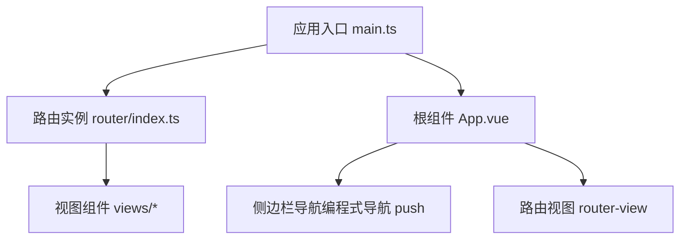
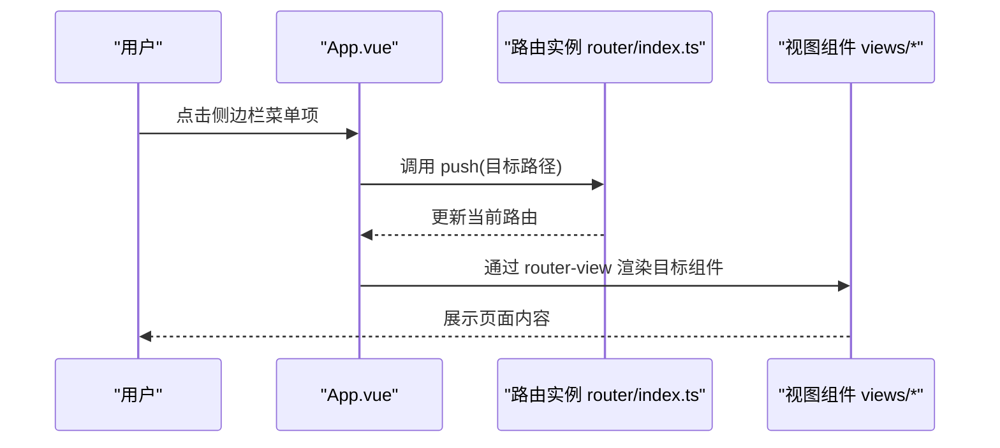
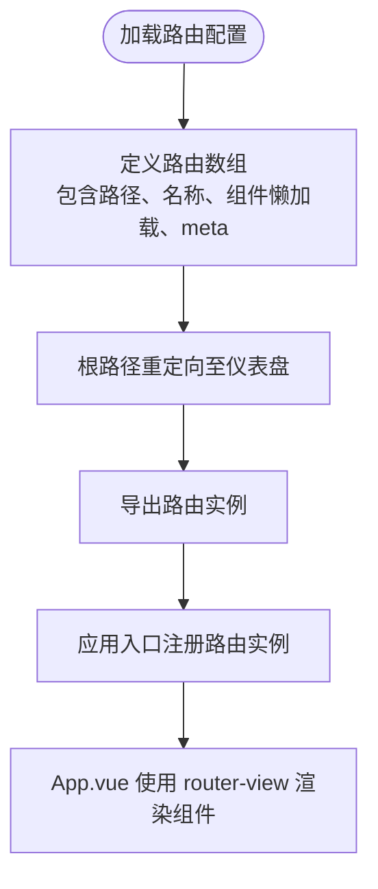
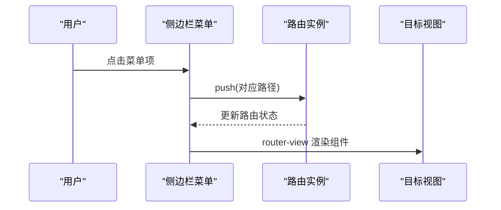
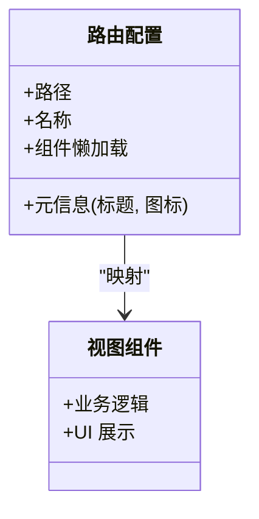
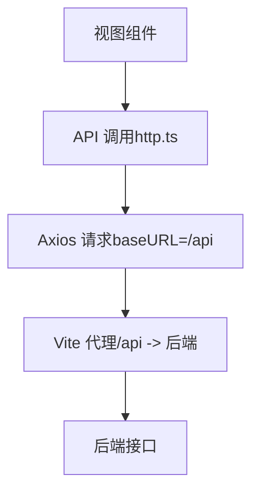
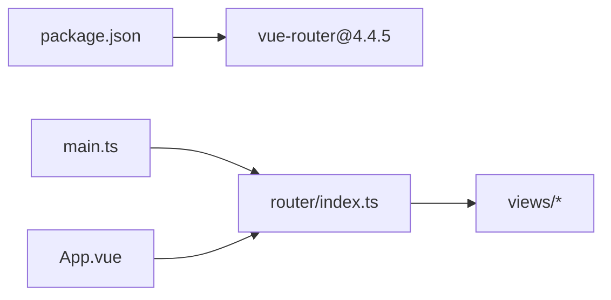

# 路由系统设计

<cite>
**本文引用的文件**
- [web/src/router/index.ts](file://web/src/router/index.ts)
- [web/src/main.ts](file://web/src/main.ts)
- [web/src/App.vue](file://web/src/App.vue)
- [web/package.json](file://web/package.json)
- [web/vite.config.ts](file://web/vite.config.ts)
- [web/src/api/index.ts](file://web/src/api/index.ts)
- [web/src/api/http.ts](file://web/src/api/http.ts)
- [web/src/views/Dashboard.vue](file://web/src/views/Dashboard.vue)
- [web/src/views/Wiki.vue](file://web/src/views/Wiki.vue)
- [web/src/views/Search.vue](file://web/src/views/Search.vue)
- [web/src/views/Settings.vue](file://web/src/views/Settings.vue)
- [web/src/views/Graph.vue](file://web/src/views/Graph.vue)
- [web/src/views/Insights.vue](file://web/src/views/Insights.vue)
- [web/src/views/Schedule.vue](file://web/src/views/Schedule.vue)
</cite>

## 目录
1. [简介](#简介)
2. [项目结构](#项目结构)
3. [核心组件](#核心组件)
4. [架构总览](#架构总览)
5. [详细组件分析](#详细组件分析)
6. [依赖分析](#依赖分析)
7. [性能考虑](#性能考虑)
8. [故障排查指南](#故障排查指南)
9. [结论](#结论)

## 简介
本文件面向 LLM Wiki 的前端路由系统，基于 Vue Router 4.4.5 进行设计与实现说明。内容涵盖路由表定义、路由层级结构、动态路由配置、页面导航方式（编程式与声明式）、路由守卫现状与扩展建议、视图组件映射与懒加载、路由参数处理、嵌套路由与重定向、导航与面包屑思路、以及性能优化策略。文档以仓库现有代码为依据，确保可追溯性与可操作性。

## 项目结构
- 路由核心位于 web/src/router/index.ts，定义了所有页面级路由与懒加载组件映射。
- 应用入口在 web/src/main.ts 中注册路由实例，并挂载根组件。
- 视图组件位于 web/src/views 下，每个路由对应一个独立组件。
- 导航栏与内容区域在 web/src/App.vue 中通过 router-view 渲染当前路由组件，并使用 Element Plus 图标与标题元信息。

图表来源
- [web/src/main.ts:1-14](file://web/src/main.ts#L1-L14)
- [web/src/router/index.ts:1-22](file://web/src/router/index.ts#L1-L22)
- [web/src/App.vue:1-38](file://web/src/App.vue#L1-L38)

章节来源
- [web/src/router/index.ts:1-22](file://web/src/router/index.ts#L1-L22)
- [web/src/main.ts:1-14](file://web/src/main.ts#L1-L14)
- [web/src/App.vue:1-38](file://web/src/App.vue#L1-L38)

## 核心组件
- 路由表定义：集中于路由配置文件，包含路径、名称、组件懒加载与元信息（标题、图标）。
- 路由实例：创建 Web History 模式的路由实例并注入应用。
- 根组件：提供侧边栏菜单、顶部标题与主内容区，使用 router-view 渲染当前路由组件。
- 视图组件：各功能页面组件，负责业务逻辑与 UI 展示。

章节来源
- [web/src/router/index.ts:1-22](file://web/src/router/index.ts#L1-L22)
- [web/src/main.ts:1-14](file://web/src/main.ts#L1-L14)
- [web/src/App.vue:1-38](file://web/src/App.vue#L1-L38)

## 架构总览
下图展示了从应用启动到页面渲染的关键交互流程，包括路由初始化、导航触发与视图渲染。

图表来源
- [web/src/App.vue:1-38](file://web/src/App.vue#L1-L38)
- [web/src/router/index.ts:1-22](file://web/src/router/index.ts#L1-L22)

## 详细组件分析

### 路由表与视图映射
- 路由表集中定义于路由模块，包含首页重定向与九个页面路由。
- 每条路由均采用函数式懒加载导入视图组件，结合 meta 字段提供标题与图标，便于在侧边栏展示。
- 路由名称用于在根组件中生成菜单项，路径用于导航跳转。

图表来源
- [web/src/router/index.ts:1-22](file://web/src/router/index.ts#L1-L22)
- [web/src/App.vue:1-38](file://web/src/App.vue#L1-L38)

章节来源
- [web/src/router/index.ts:1-22](file://web/src/router/index.ts#L1-L22)

### 页面导航方式
- 编程式导航：在根组件侧边栏点击事件中调用路由实例的 push 方法进行跳转。
- 声明式导航：当前实现以编程式为主；如需声明式，可在模板中使用 router-link 绑定 to 属性，但当前代码未使用该方式。
- 路由视图：通过 router-view 动态渲染当前匹配组件，并配合过渡动画提升切换体验。

图表来源
- [web/src/App.vue:1-38](file://web/src/App.vue#L1-L38)

章节来源
- [web/src/App.vue:1-38](file://web/src/App.vue#L1-L38)

### 路由守卫
- 全局前置守卫：当前路由配置未定义全局前置守卫。
- 路由独享守卫：当前路由配置未定义路由独享守卫。
- 组件内守卫：当前路由配置未定义组件内守卫。
- 扩展建议：若需鉴权或权限控制，可在路由配置中添加相应守卫钩子；若需在组件内拦截离开，可使用 beforeRouteLeave 钩子。

章节来源
- [web/src/router/index.ts:1-22](file://web/src/router/index.ts#L1-L22)

### 视图组件映射与懒加载
- 组件映射：每个路由名称对应一个视图组件，组件通过函数式懒加载导入，减少首屏体积。
- 懒加载策略：采用动态 import，按需加载，有利于性能优化。
- 路由元信息：meta 字段包含标题与图标，用于侧边栏显示与顶部标题展示。

图表来源
- [web/src/router/index.ts:1-22](file://web/src/router/index.ts#L1-L22)

章节来源
- [web/src/router/index.ts:1-22](file://web/src/router/index.ts#L1-L22)

### 路由参数处理
- 路径参数：当前路由未定义路径参数占位符，如需支持 slug 或 ID 参数，可在路由定义中添加动态段并在组件中通过 $route.params 获取。
- 查询参数：API 层面广泛使用查询参数（如分页、过滤、权重阈值等），可通过 http 模块统一处理。
- 路由传递数据：当前未使用路由传参；如需跨路由传递少量数据，可考虑使用 query 或通过状态管理工具。

章节来源
- [web/src/api/index.ts:1-70](file://web/src/api/index.ts#L1-L70)

### 嵌套路由与重定向
- 嵌套路由：当前路由配置为扁平结构，未见嵌套视图与子路由定义。
- 路由重定向：根路径直接重定向至仪表盘，保证首次访问的良好体验。
- 扩展建议：若未来需要多级菜单或子页面，可在父路由下新增 children 数组定义子路由与默认子路由。

章节来源
- [web/src/router/index.ts:1-22](file://web/src/router/index.ts#L1-L22)

### 导航与面包屑
- 导航：侧边栏菜单通过编程式导航实现跳转；顶部标题根据当前路由 meta.title 动态显示。
- 面包屑：当前未实现面包屑导航；可基于路由层级与 meta 信息构建面包屑组件，按需展示路径层级。

章节来源
- [web/src/App.vue:1-38](file://web/src/App.vue#L1-L38)

### API 与路由联动
- API 请求统一通过 http 模块发起，基础路径指向 /api，开发服务器通过代理转发至后端服务。
- 多数接口使用查询参数（如分页、过滤、阈值等），体现了前端与后端的参数化交互模式。

图表来源
- [web/src/api/http.ts:1-17](file://web/src/api/http.ts#L1-L17)
- [web/vite.config.ts:1-22](file://web/vite.config.ts#L1-L22)
- [web/src/api/index.ts:1-70](file://web/src/api/index.ts#L1-L70)

章节来源
- [web/src/api/http.ts:1-17](file://web/src/api/http.ts#L1-L17)
- [web/vite.config.ts:1-22](file://web/vite.config.ts#L1-L22)
- [web/src/api/index.ts:1-70](file://web/src/api/index.ts#L1-L70)

## 依赖分析
- Vue Router 版本：4.4.5，提供路由实例创建、历史模式与路由记录类型支持。
- 应用入口：在 main.ts 中注册路由实例，确保全局可用。
- 依赖关系：路由配置被应用入口引入并注入，根组件通过路由实例生成菜单与标题，视图组件按需懒加载。

图表来源
- [web/package.json:1-31](file://web/package.json#L1-L31)
- [web/src/main.ts:1-14](file://web/src/main.ts#L1-L14)
- [web/src/router/index.ts:1-22](file://web/src/router/index.ts#L1-L22)
- [web/src/App.vue:1-38](file://web/src/App.vue#L1-L38)

章节来源
- [web/package.json:1-31](file://web/package.json#L1-L31)
- [web/src/main.ts:1-14](file://web/src/main.ts#L1-L14)
- [web/src/router/index.ts:1-22](file://web/src/router/index.ts#L1-L22)
- [web/src/App.vue:1-38](file://web/src/App.vue#L1-L38)

## 性能考虑
- 路由懒加载：采用函数式懒加载导入视图组件，有效降低首屏 JavaScript 体积。
- 预加载策略：当前未实现预加载；可在路由级别或组件级别结合浏览器缓存与 keep-alive 进行优化。
- 路由缓存：当前未使用缓存；可结合 keep-alive 与路由元信息实现选择性缓存，减少重复渲染与请求。
- 过渡动画：router-view 外层包裹过渡效果，改善页面切换体验。

章节来源
- [web/src/router/index.ts:1-22](file://web/src/router/index.ts#L1-L22)
- [web/src/App.vue:1-38](file://web/src/App.vue#L1-L38)

## 故障排查指南
- 路由无法跳转：检查路由名称与路径是否正确，确认根组件菜单项绑定的路径与路由配置一致。
- 组件未渲染：确认路由懒加载函数返回的组件路径正确，且组件文件存在。
- 标题不显示：检查路由 meta.title 是否设置，以及根组件读取逻辑是否正确。
- API 请求失败：检查代理配置与后端服务状态，确认 baseURL 与接口路径一致。

章节来源
- [web/src/App.vue:1-38](file://web/src/App.vue#L1-L38)
- [web/src/api/http.ts:1-17](file://web/src/api/http.ts#L1-L17)
- [web/vite.config.ts:1-22](file://web/vite.config.ts#L1-L22)

## 结论
LLM Wiki 的路由系统以简洁清晰的扁平路由结构为基础，结合函数式懒加载与元信息，实现了良好的首屏性能与可维护性。当前导航主要采用编程式方式，配合根组件的菜单与标题展示，满足基本使用需求。后续可根据业务扩展需要，增加路由守卫、嵌套路由、面包屑导航与缓存策略，进一步提升安全性与用户体验。