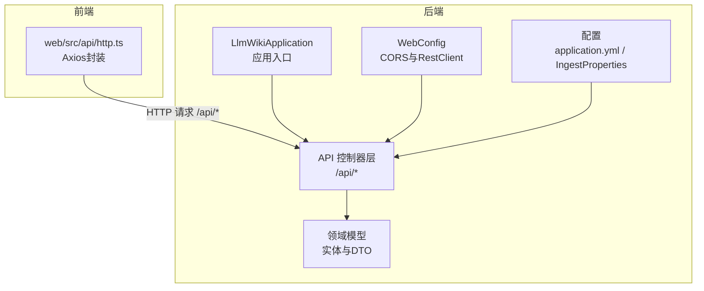
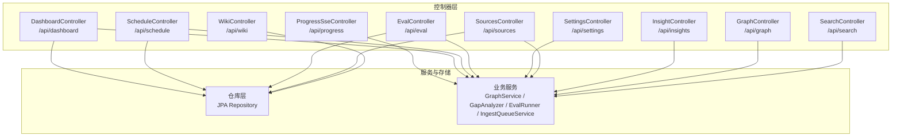
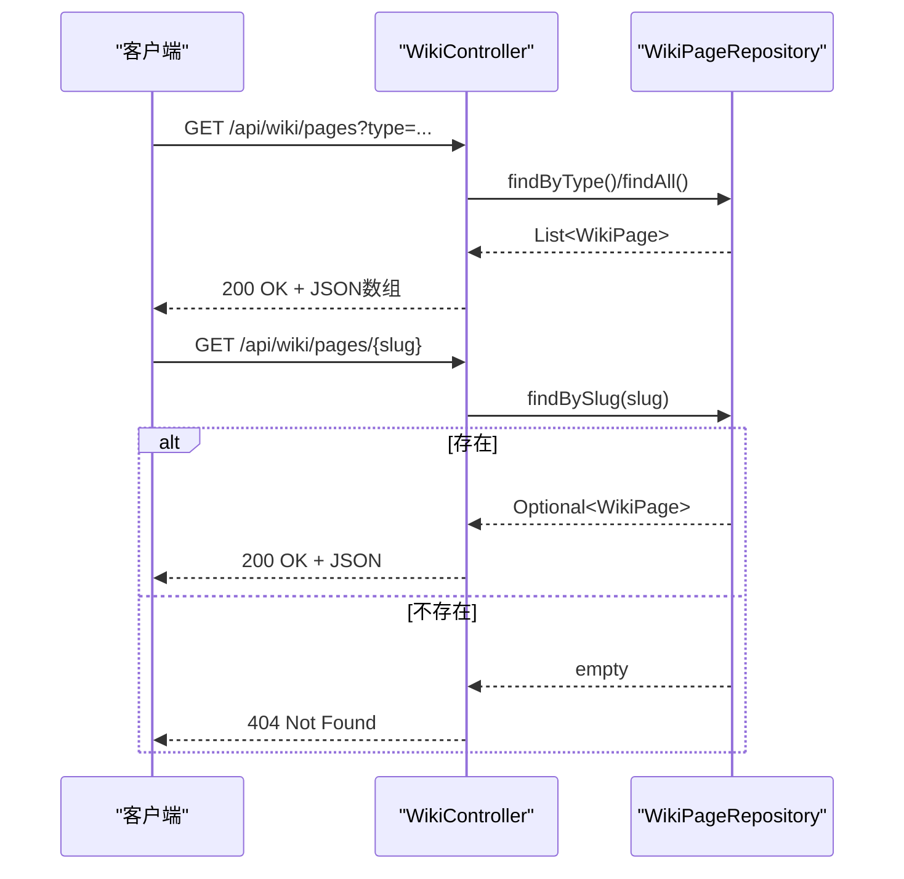
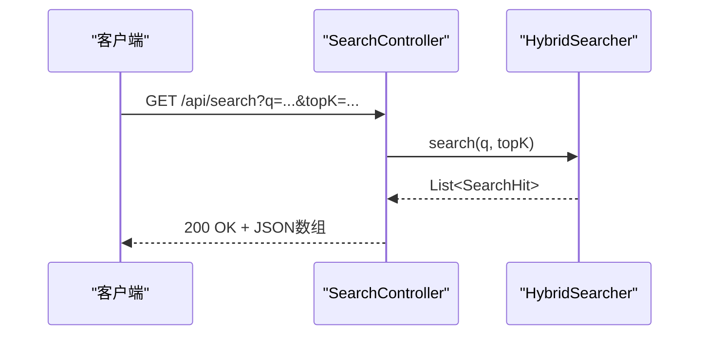
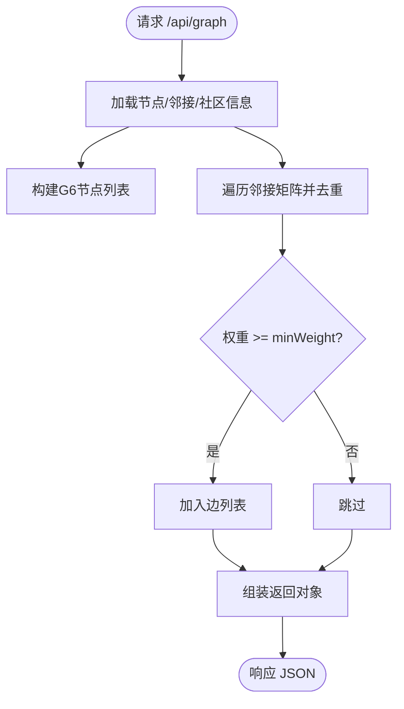
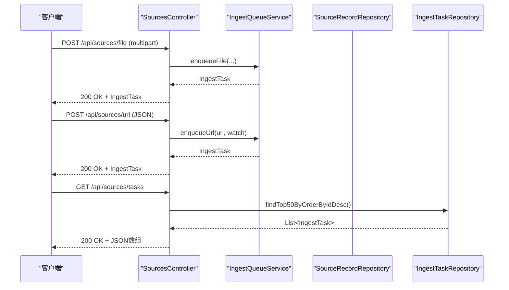
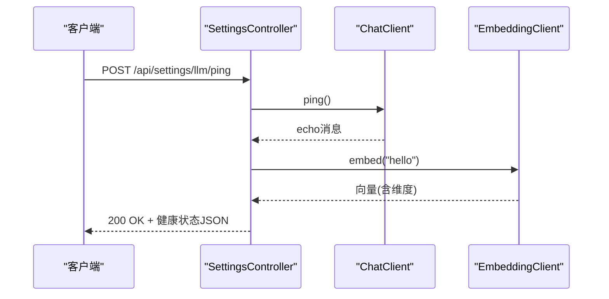
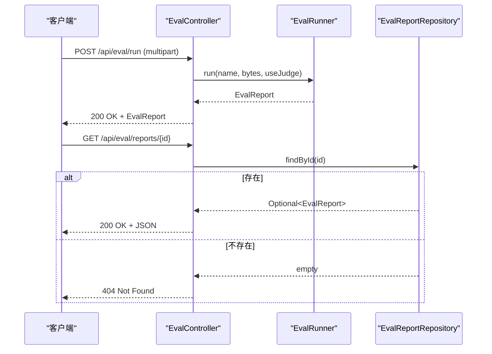
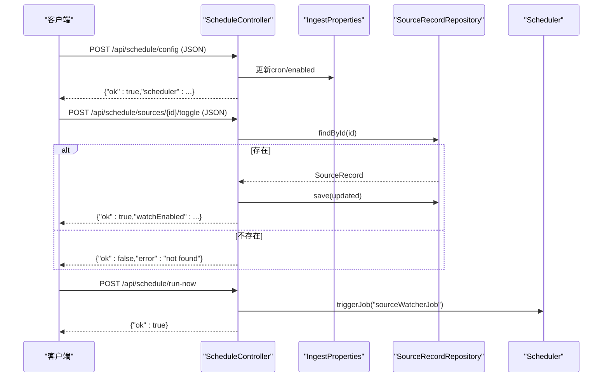
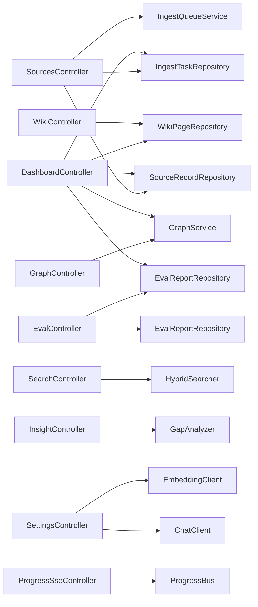

# API控制器设计

<cite>
**本文引用的文件**
- [WikiController.java](file://src/main/java/com/example/llmwiki/api/WikiController.java)
- [SearchController.java](file://src/main/java/com/example/llmwiki/api/SearchController.java)
- [GraphController.java](file://src/main/java/com/example/llmwiki/api/GraphController.java)
- [InsightController.java](file://src/main/java/com/example/llmwiki/api/InsightController.java)
- [SourcesController.java](file://src/main/java/com/example/llmwiki/api/SourcesController.java)
- [SettingsController.java](file://src/main/java/com/example/llmwiki/api/SettingsController.java)
- [EvalController.java](file://src/main/java/com/example/llmwiki/api/EvalController.java)
- [ScheduleController.java](file://src/main/java/com/example/llmwiki/api/ScheduleController.java)
- [DashboardController.java](file://src/main/java/com/example/llmwiki/api/DashboardController.java)
- [ProgressSseController.java](file://src/main/java/com/example/llmwiki/api/ProgressSseController.java)
- [WebConfig.java](file://src/main/java/com/example/llmwiki/config/WebConfig.java)
- [LlmWikiApplication.java](file://src/main/java/com/example/llmwiki/LlmWikiApplication.java)
- [application.yml](file://src/main/resources/application.yml)
- [WikiPage.java](file://src/main/java/com/example/llmwiki/domain/WikiPage.java)
- [SourceRecord.java](file://src/main/java/com/example/llmwiki/domain/SourceRecord.java)
- [IngestTask.java](file://src/main/java/com/example/llmwiki/domain/IngestTask.java)
- [EvalReport.java](file://src/main/java/com/example/llmwiki/domain/EvalReport.java)
- [IngestProperties.java](file://src/main/java/com/example/llmwiki/config/IngestProperties.java)
- [http.ts](file://web/src/api/http.ts)
</cite>

## 目录
1. [简介](#简介)
2. [项目结构](#项目结构)
3. [核心组件](#核心组件)
4. [架构总览](#架构总览)
5. [详细组件分析](#详细组件分析)
6. [依赖分析](#依赖分析)
7. [性能考虑](#性能考虑)
8. [故障排查指南](#故障排查指南)
9. [结论](#结论)
10. [附录](#附录)

## 简介
本设计文档聚焦LLM Wiki的API控制器层，基于Spring MVC实现RESTful接口，统一HTTP请求处理模式，覆盖维基、检索、图谱、洞察、源文件、系统设置、评估、调度、概览与进度推送等模块。文档阐述控制器职责、注解驱动设计、参数绑定与验证、响应格式标准化、异常处理策略、性能优化与跨域安全配置。

## 项目结构
后端采用标准Spring Boot目录结构，API控制器位于api包，按功能域划分控制器，统一以“/api/{module}”路径前缀组织。前端通过相对路径/api访问后端接口。

图表来源
- [LlmWikiApplication.java:1-29](file://src/main/java/com/example/llmwiki/LlmWikiApplication.java#L1-L29)
- [WebConfig.java:1-35](file://src/main/java/com/example/llmwiki/config/WebConfig.java#L1-L35)
- [application.yml:1-84](file://src/main/resources/application.yml#L1-L84)

章节来源
- [LlmWikiApplication.java:1-29](file://src/main/java/com/example/llmwiki/LlmWikiApplication.java#L1-L29)
- [WebConfig.java:1-35](file://src/main/java/com/example/llmwiki/config/WebConfig.java#L1-L35)
- [application.yml:1-84](file://src/main/resources/application.yml#L1-L84)

## 核心组件
- 统一注解驱动：使用@RestController与@RequestMapping定义资源路径，结合@GetMapping/@PostMapping/@PutMapping/@DeleteMapping声明HTTP方法。
- 参数绑定与验证：通过@RequestParam/@RequestBody/@PathVariable进行参数绑定；控制器内对必填参数进行显式校验，必要时在服务层或工具类补充校验。
- 响应格式标准化：除需要二进制流的场景外，统一返回JSON对象；成功状态使用键值对封装，如{"ok": true}；错误场景返回错误信息或空结果由上层框架处理。
- 异常处理：控制器层未直接定义全局异常处理器，遵循Spring Boot默认行为；业务异常通过抛出运行时异常或返回错误信息的方式处理。

章节来源
- [WikiController.java:16-50](file://src/main/java/com/example/llmwiki/api/WikiController.java#L16-L50)
- [SearchController.java:12-31](file://src/main/java/com/example/llmwiki/api/SearchController.java#L12-L31)
- [GraphController.java:15-85](file://src/main/java/com/example/llmwiki/api/GraphController.java#L15-L85)
- [InsightController.java:10-30](file://src/main/java/com/example/llmwiki/api/InsightController.java#L10-L30)
- [SourcesController.java:24-101](file://src/main/java/com/example/llmwiki/api/SourcesController.java#L24-L101)
- [SettingsController.java:18-70](file://src/main/java/com/example/llmwiki/api/SettingsController.java#L18-L70)
- [EvalController.java:20-53](file://src/main/java/com/example/llmwiki/api/EvalController.java#L20-L53)
- [ScheduleController.java:21-78](file://src/main/java/com/example/llmwiki/api/ScheduleController.java#L21-L78)
- [DashboardController.java:16-47](file://src/main/java/com/example/llmwiki/api/DashboardController.java#L16-L47)
- [ProgressSseController.java:14-36](file://src/main/java/com/example/llmwiki/api/ProgressSseController.java#L14-L36)

## 架构总览
控制器层围绕“单一职责、清晰路由、一致响应”的原则设计，统一前缀与命名规范，便于前端聚合与扩展。

图表来源
- [WikiController.java:22-50](file://src/main/java/com/example/llmwiki/api/WikiController.java#L22-L50)
- [SearchController.java:18-31](file://src/main/java/com/example/llmwiki/api/SearchController.java#L18-L31)
- [GraphController.java:21-85](file://src/main/java/com/example/llmwiki/api/GraphController.java#L21-L85)
- [InsightController.java:16-30](file://src/main/java/com/example/llmwiki/api/InsightController.java#L16-L30)
- [SourcesController.java:30-101](file://src/main/java/com/example/llmwiki/api/SourcesController.java#L30-L101)
- [SettingsController.java:24-70](file://src/main/java/com/example/llmwiki/api/SettingsController.java#L24-L70)
- [EvalController.java:26-53](file://src/main/java/com/example/llmwiki/api/EvalController.java#L26-L53)
- [ScheduleController.java:27-78](file://src/main/java/com/example/llmwiki/api/ScheduleController.java#L27-L78)
- [DashboardController.java:22-47](file://src/main/java/com/example/llmwiki/api/DashboardController.java#L22-L47)
- [ProgressSseController.java:20-36](file://src/main/java/com/example/llmwiki/api/ProgressSseController.java#L20-L36)

## 详细组件分析

### 维基控制器（WikiController）
- 职责：提供维基页面列表查询、按slug详情查询、按类型筛选、统计汇总。
- 设计要点：使用@RequestParam可选参数type实现条件查询；detail接口返回ResponseEntity以支持200/404；stats聚合总数与按类型分布。
- 参数绑定：列表支持type过滤；详情使用@PathVariable提取slug。
- 响应格式：列表返回实体集合；详情返回JSON包装；统计返回键值对。

图表来源
- [WikiController.java:29-49](file://src/main/java/com/example/llmwiki/api/WikiController.java#L29-L49)
- [WikiPage.java:23-72](file://src/main/java/com/example/llmwiki/domain/WikiPage.java#L23-L72)

章节来源
- [WikiController.java:16-50](file://src/main/java/com/example/llmwiki/api/WikiController.java#L16-L50)
- [WikiPage.java:17-72](file://src/main/java/com/example/llmwiki/domain/WikiPage.java#L17-L72)

### 搜索控制器（SearchController）
- 职责：提供混合检索能力（BM25 + 向量），支持关键词与topK参数。
- 设计要点：GET接口，参数校验在方法签名中体现；异常向上抛出交由全局异常处理。
- 响应格式：返回搜索命中结果集合。

图表来源
- [SearchController.java:25-30](file://src/main/java/com/example/llmwiki/api/SearchController.java#L25-L30)

章节来源
- [SearchController.java:12-31](file://src/main/java/com/example/llmwiki/api/SearchController.java#L12-L31)

### 图谱控制器（GraphController）
- 职责：输出适配AntV G6的nodes/edges结构，并提供图谱洞察指标。
- 设计要点：graph接口支持minWeight过滤边权重；insights提供孤立点、桥接节点、总节点/边数、社区数量等指标。
- 响应格式：返回包含nodes、edges与统计字段的JSON对象。

图表来源
- [GraphController.java:31-74](file://src/main/java/com/example/llmwiki/api/GraphController.java#L31-L74)

章节来源
- [GraphController.java:15-85](file://src/main/java/com/example/llmwiki/api/GraphController.java#L15-L85)

### 洞察控制器（InsightController）
- 职责：基于GapAnalyzer进行知识空白分析，支持是否调用LLM的开关。
- 设计要点：GET /api/insights/gap，useLlm默认true；当未配置LLM Key时建议传false。
- 响应格式：返回GapAnalyzer.GapReport结构。

章节来源
- [InsightController.java:10-30](file://src/main/java/com/example/llmwiki/api/InsightController.java#L10-L30)

### 源文件控制器（SourcesController）
- 职责：文件上传、URL提交、远程源提交、列出来源、任务列表、取消/重试任务、删除来源。
- 设计要点：multipart/form-data文件上传；JSON请求体封装URL与远程源参数；任务相关操作返回{"ok": true}。
- 响应格式：列表返回集合；单个操作返回{"ok": true}或错误信息；删除返回{"ok": true}。

图表来源
- [SourcesController.java:45-66](file://src/main/java/com/example/llmwiki/api/SourcesController.java#L45-L66)
- [SourcesController.java:86-100](file://src/main/java/com/example/llmwiki/api/SourcesController.java#L86-L100)

章节来源
- [SourcesController.java:24-101](file://src/main/java/com/example/llmwiki/api/SourcesController.java#L24-L101)
- [SourceRecord.java:17-64](file://src/main/java/com/example/llmwiki/domain/SourceRecord.java#L17-L64)
- [IngestTask.java:17-62](file://src/main/java/com/example/llmwiki/domain/IngestTask.java#L17-L62)

### 设置控制器（SettingsController）
- 职责：读取与更新LLM配置、健康探测（ping）。
- 设计要点：GET /api/settings/llm返回当前配置；PUT更新指定子配置；POST /api/settings/llm/ping调用ChatClient与EmbeddingClient进行连通性测试。
- 响应格式：配置读取返回完整配置对象；更新返回{"ok": true}；ping返回各组件健康状态与维度信息。

图表来源
- [SettingsController.java:53-69](file://src/main/java/com/example/llmwiki/api/SettingsController.java#L53-L69)

章节来源
- [SettingsController.java:18-70](file://src/main/java/com/example/llmwiki/api/SettingsController.java#L18-L70)

### 评估控制器（EvalController）
- 职责：上传CSV启动评测、列出报告、查看报告详情。
- 设计要点：POST /api/eval/run接收multipart文件；GET /api/eval/reports返回报告列表；GET /api/eval/reports/{id}返回详情并支持404。
- 响应格式：run返回EvalReport；列表返回集合；详情返回JSON或404。

图表来源
- [EvalController.java:35-52](file://src/main/java/com/example/llmwiki/api/EvalController.java#L35-L52)
- [EvalReport.java:17-51](file://src/main/java/com/example/llmwiki/domain/EvalReport.java#L17-L51)

章节来源
- [EvalController.java:20-53](file://src/main/java/com/example/llmwiki/api/EvalController.java#L20-L53)
- [EvalReport.java:17-51](file://src/main/java/com/example/llmwiki/domain/EvalReport.java#L17-L51)

### 调度控制器（ScheduleController）
- 职责：读取与更新调度配置、切换watch标志、立即执行作业。
- 设计要点：GET /api/schedule/config返回当前调度配置；POST /api/schedule/config更新cron与enabled；POST /api/schedule/sources/{id}/toggle切换watch；POST /api/schedule/run-now触发作业。
- 响应格式：配置读取返回对象；更新返回{"ok": true,"scheduler": ...}；toggle返回{"ok": true,"watchEnabled": ...}。

图表来源
- [ScheduleController.java:42-77](file://src/main/java/com/example/llmwiki/api/ScheduleController.java#L42-L77)
- [IngestProperties.java:13-33](file://src/main/java/com/example/llmwiki/config/IngestProperties.java#L13-L33)

章节来源
- [ScheduleController.java:21-78](file://src/main/java/com/example/llmwiki/api/ScheduleController.java#L21-L78)
- [IngestProperties.java:7-33](file://src/main/java/com/example/llmwiki/config/IngestProperties.java#L7-L33)

### 仪表盘控制器（DashboardController）
- 职责：聚合统计信息，包括维基、来源、任务、报告、图谱指标与最近任务。
- 设计要点：一次性查询多个仓库与服务，减少往返；返回聚合对象便于前端首屏渲染。
- 响应格式：返回包含各项统计与最近任务的JSON对象。

章节来源
- [DashboardController.java:16-47](file://src/main/java/com/example/llmwiki/api/DashboardController.java#L16-L47)

### 进度推送控制器（ProgressSseController）
- 职责：提供SSE流推送摄入进度事件与最近事件列表。
- 设计要点：GET /api/progress/stream返回SseEmitter；GET /api/progress/recent返回最近事件列表。
- 响应格式：SSE流事件；最近事件返回JSON数组。

章节来源
- [ProgressSseController.java:14-36](file://src/main/java/com/example/llmwiki/api/ProgressSseController.java#L14-L36)

## 依赖分析
- 控制器与仓库：WikiController、DashboardController、EvalController、ScheduleController直接依赖JPA仓库；SourcesController依赖SourceRecordRepository与IngestTaskRepository。
- 控制器与服务：SearchController依赖HybridSearcher；GraphController依赖GraphService；InsightController依赖GapAnalyzer；EvalController依赖EvalRunner；SourcesController依赖IngestQueueService；SettingsController依赖ChatClient与EmbeddingClient；ProgressSseController依赖ProgressBus。
- 配置与共享：WebConfig提供CORS与共享RestClient；LlmWikiApplication启用异步与调度；application.yml集中管理数据库、Quartz、LLM、解析器、调度与存储路径等配置。

图表来源
- [WikiController.java:27](file://src/main/java/com/example/llmwiki/api/WikiController.java#L27)
- [DashboardController.java:27-31](file://src/main/java/com/example/llmwiki/api/DashboardController.java#L27-L31)
- [SearchController.java:23](file://src/main/java/com/example/llmwiki/api/SearchController.java#L23)
- [GraphController.java:26](file://src/main/java/com/example/llmwiki/api/GraphController.java#L26)
- [InsightController.java:21](file://src/main/java/com/example/llmwiki/api/InsightController.java#L21)
- [EvalController.java:32-33](file://src/main/java/com/example/llmwiki/api/EvalController.java#L32-L33)
- [SourcesController.java:36-38](file://src/main/java/com/example/llmwiki/api/SourcesController.java#L36-L38)
- [SettingsController.java:30-32](file://src/main/java/com/example/llmwiki/api/SettingsController.java#L30-L32)
- [ProgressSseController.java:25](file://src/main/java/com/example/llmwiki/api/ProgressSseController.java#L25)

章节来源
- [WebConfig.java:15-34](file://src/main/java/com/example/llmwiki/config/WebConfig.java#L15-L34)
- [LlmWikiApplication.java:19-28](file://src/main/java/com/example/llmwiki/LlmWikiApplication.java#L19-L28)
- [application.yml:1-84](file://src/main/resources/application.yml#L1-L84)

## 性能考虑
- 请求限流：当前未见专用限流实现，可在WebConfig或自定义拦截器中引入限流策略（如令牌桶/滑动窗口）。
- 缓存策略：对只读查询（如维基列表、图谱统计）可引入Redis缓存；对高频统计接口（DashboardController）可设置短期缓存。
- 异步处理：LlmWikiApplication启用@EnableAsync与@EnableScheduling，可用于后台任务与定时作业；SSE推送已通过ProgressBus实现事件流。
- 数据库优化：合理使用JPA分页查询（如任务列表）、建立索引（slug、watchEnabled、createdAt等）。
- 前端请求：前端http.ts设置超时与错误拦截，避免阻塞UI线程。

章节来源
- [LlmWikiApplication.java:20-21](file://src/main/java/com/example/llmwiki/LlmWikiApplication.java#L20-L21)
- [http.ts:1-16](file://web/src/api/http.ts#L1-L16)

## 故障排查指南
- CORS问题：确认WebConfig中addCorsMappings配置允许前端域名与方法；生产环境建议限制allowedOriginPatterns。
- 文件上传限制：application.yml中spring.servlet.multipart.max-file-size与max-request-size需满足大文件需求。
- Quartz调度：检查application.yml中quartz配置与job-store-type；确保调度开关与cron表达式正确。
- LLM连通性：SettingsController的ping接口可快速验证ChatClient与EmbeddingClient；若失败检查llm配置与网络。
- 任务状态：SourcesController的任务接口返回{"ok": true}，若异常需检查IngestQueueService与数据库状态。
- SSE连接：ProgressSseController.stream返回SseEmitter，需确保ProgressBus订阅正常且事件未被阻塞。

章节来源
- [WebConfig.java:18-25](file://src/main/java/com/example/llmwiki/config/WebConfig.java#L18-L25)
- [application.yml:7-10](file://src/main/resources/application.yml#L7-L10)
- [application.yml:26-29](file://src/main/resources/application.yml#L26-L29)
- [SettingsController.java:53-69](file://src/main/java/com/example/llmwiki/api/SettingsController.java#L53-L69)
- [SourcesController.java:68-78](file://src/main/java/com/example/llmwiki/api/SourcesController.java#L68-L78)
- [ProgressSseController.java:27-30](file://src/main/java/com/example/llmwiki/api/ProgressSseController.java#L27-L30)

## 结论
本控制器层遵循Spring MVC最佳实践，以注解驱动实现RESTful接口，参数绑定与响应格式统一，职责边界清晰。通过合理的依赖注入与服务协作，实现了从数据源摄取到知识图谱与评估的全链路能力。建议后续完善全局异常处理、引入限流与缓存策略，并持续优化数据库索引与前端交互体验。

## 附录
- 路由前缀与模块对应关系
  - /api/wiki → 维基页面管理
  - /api/search → 检索接口
  - /api/graph → 知识图谱
  - /api/insights → 知识洞察
  - /api/sources → 源文件与任务
  - /api/settings → 系统配置与健康探测
  - /api/eval → 评估报告
  - /api/schedule → 调度管理
  - /api/dashboard → 系统概览
  - /api/progress → 进度推送（SSE）