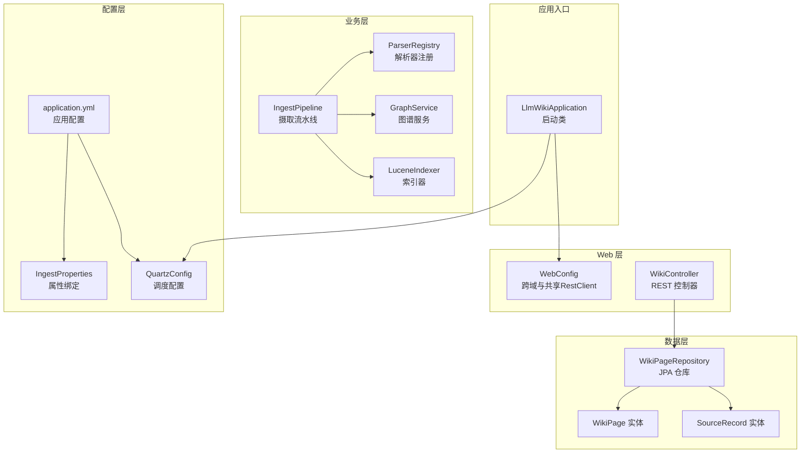
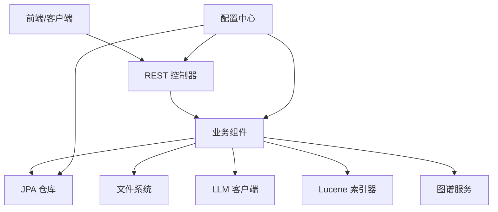
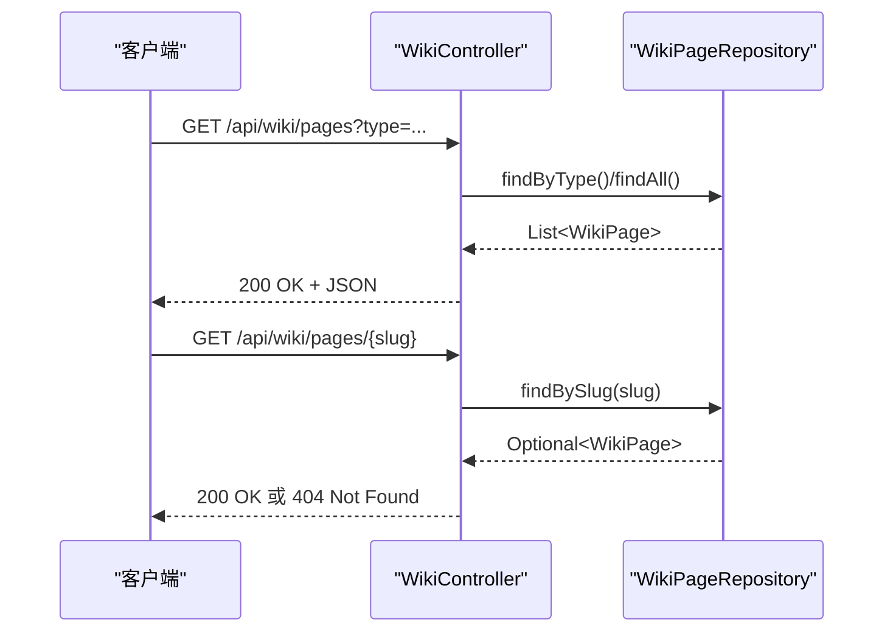
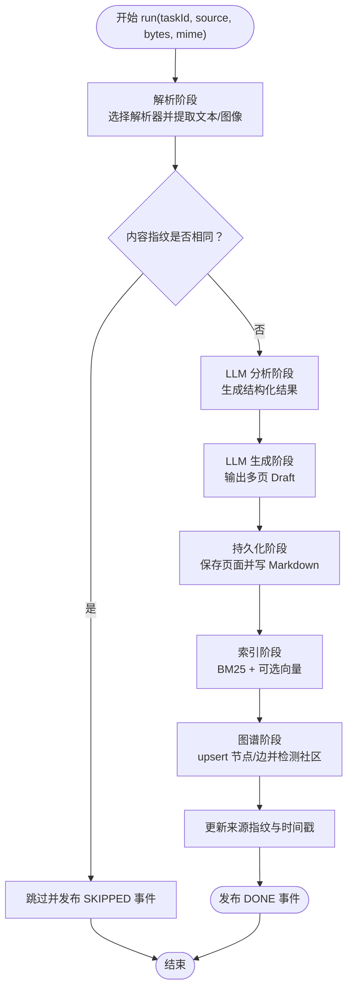
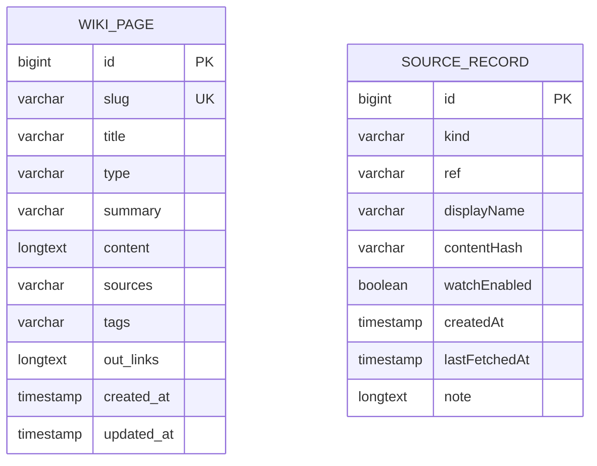
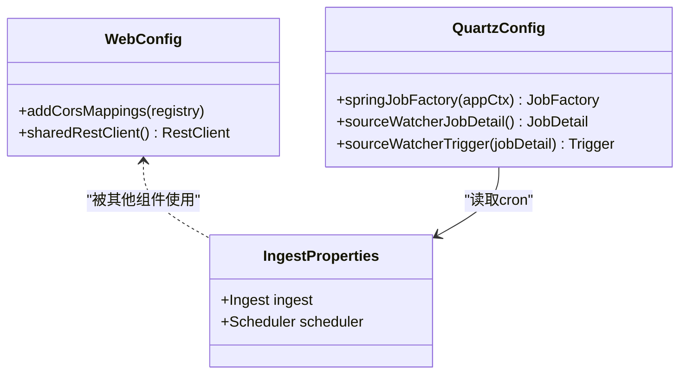
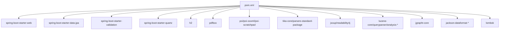

# 后端系统设计

<cite>
**本文引用的文件**
- [LlmWikiApplication.java](file://src/main/java/com/example/llmwiki/LlmWikiApplication.java)
- [application.yml](file://src/main/resources/application.yml)
- [pom.xml](file://pom.xml)
- [WebConfig.java](file://src/main/java/com/example/llmwiki/config/WebConfig.java)
- [IngestProperties.java](file://src/main/java/com/example/llmwiki/config/IngestProperties.java)
- [WikiPage.java](file://src/main/java/com/example/llmwiki/domain/WikiPage.java)
- [SourceRecord.java](file://src/main/java/com/example/llmwiki/domain/SourceRecord.java)
- [WikiPageRepository.java](file://src/main/java/com/example/llmwiki/repository/WikiPageRepository.java)
- [WikiController.java](file://src/main/java/com/example/llmwiki/api/WikiController.java)
- [IngestPipeline.java](file://src/main/java/com/example/llmwiki/ingest/IngestPipeline.java)
- [QuartzConfig.java](file://src/main/java/com/example/llmwiki/scheduler/QuartzConfig.java)
- [ParserRegistry.java](file://src/main/java/com/example/llmwiki/parser/ParserRegistry.java)
- [ChatClient.java](file://src/main/java/com/example/llmwiki/llm/ChatClient.java)
- [LuceneIndexer.java](file://src/main/java/com/example/llmwiki/retrieval/LuceneIndexer.java)
- [GraphService.java](file://src/main/java/com/example/llmwiki/graph/GraphService.java)
</cite>

## 目录
1. [简介](#简介)
2. [项目结构](#项目结构)
3. [核心组件](#核心组件)
4. [架构总览](#架构总览)
5. [详细组件分析](#详细组件分析)
6. [依赖分析](#依赖分析)
7. [性能考虑](#性能考虑)
8. [故障排查指南](#故障排查指南)
9. [结论](#结论)
10. [附录](#附录)

## 简介
本设计文档面向 LLM Wiki 后端系统，基于 Spring Boot 构建 RESTful API，采用 MVC 分层架构。系统围绕“知识摄取—结构化分析—内容生成—索引与图谱”的流水线展开，结合 JPA/H2 进行数据持久化，使用 Quartz 定时调度，集成 Lucene 实现全文与向量检索，并通过 Spring 容器管理组件生命周期与依赖注入。

## 项目结构
后端采用标准 Maven 结构，主要包组织如下：
- api：REST 控制器层，暴露 HTTP 接口
- config：配置类与属性绑定
- domain：JPA 实体与领域对象
- repository：数据访问层（JPA）
- service：业务服务（本仓库以组件形式散布在各功能包中）
- ingest：摄取流水线
- parser：多格式解析器注册与实现
- llm：大模型客户端封装
- retrieval：全文检索与向量检索
- graph：知识图谱构建与持久化
- scheduler：定时任务配置
- progress：进度事件总线
- util：工具类

图表来源
- [LlmWikiApplication.java:19-26](file://src/main/java/com/example/llmwiki/LlmWikiApplication.java#L19-L26)
- [WebConfig.java:16-33](file://src/main/java/com/example/llmwiki/config/WebConfig.java#L16-L33)
- [WikiController.java:22-49](file://src/main/java/com/example/llmwiki/api/WikiController.java#L22-L49)
- [IngestPipeline.java:45-109](file://src/main/java/com/example/llmwiki/ingest/IngestPipeline.java#L45-L109)
- [ParserRegistry.java:17-35](file://src/main/java/com/example/llmwiki/parser/ParserRegistry.java#L17-L35)
- [GraphService.java:35-118](file://src/main/java/com/example/llmwiki/graph/GraphService.java#L35-L118)
- [LuceneIndexer.java:37-117](file://src/main/java/com/example/llmwiki/retrieval/LuceneIndexer.java#L37-L117)
- [WikiPageRepository.java:13-18](file://src/main/java/com/example/llmwiki/repository/WikiPageRepository.java#L13-L18)
- [WikiPage.java:24-71](file://src/main/java/com/example/llmwiki/domain/WikiPage.java#L24-L71)
- [SourceRecord.java:24-63](file://src/main/java/com/example/llmwiki/domain/SourceRecord.java#L24-L63)
- [application.yml:1-84](file://src/main/resources/application.yml#L1-L84)
- [IngestProperties.java:14-32](file://src/main/java/com/example/llmwiki/config/IngestProperties.java#L14-L32)
- [QuartzConfig.java:29-89](file://src/main/java/com/example/llmwiki/scheduler/QuartzConfig.java#L29-L89)

章节来源
- [LlmWikiApplication.java:19-26](file://src/main/java/com/example/llmwiki/LlmWikiApplication.java#L19-L26)
- [application.yml:1-84](file://src/main/resources/application.yml#L1-L84)

## 核心组件
- 启动类与容器
  - 启用 Spring Boot 自动配置、异步与定时任务，作为应用入口。
- Web 层
  - 跨域配置与共享 RestClient Bean，便于 LLM 客户端与网络解析复用。
- 配置层
  - application.yml 提供服务器、数据库、JPA、Quartz、日志等全局配置；IngestProperties 将 llm-wiki.* 前缀的配置映射到 Java 对象。
- 数据模型层
  - WikiPage、SourceRecord 为 JPA 实体，定义表结构、字段长度与约束。
- 数据访问层
  - WikiPageRepository 继承 JpaRepository，提供按 slug 查询与类型过滤等方法。
- 业务层
  - IngestPipeline 实现“解析—分析—生成—索引/图谱”的两步式链路；ParserRegistry 负责按请求选择解析器；GraphService 维护内存图与 JSON 持久化；LuceneIndexer 支持 BM25 与 KNN 向量检索。
- 定时调度
  - QuartzConfig 将 Spring 管理的 Job 注入 Quartz，按 cron 表达式触发 SourceWatcherJob。

章节来源
- [WebConfig.java:16-33](file://src/main/java/com/example/llmwiki/config/WebConfig.java#L16-L33)
- [IngestProperties.java:14-32](file://src/main/java/com/example/llmwiki/config/IngestProperties.java#L14-L32)
- [WikiPage.java:24-71](file://src/main/java/com/example/llmwiki/domain/WikiPage.java#L24-L71)
- [SourceRecord.java:24-63](file://src/main/java/com/example/llmwiki/domain/SourceRecord.java#L24-L63)
- [WikiPageRepository.java:13-18](file://src/main/java/com/example/llmwiki/repository/WikiPageRepository.java#L13-L18)
- [IngestPipeline.java:45-109](file://src/main/java/com/example/llmwiki/ingest/IngestPipeline.java#L45-L109)
- [ParserRegistry.java:17-35](file://src/main/java/com/example/llmwiki/parser/ParserRegistry.java#L17-L35)
- [GraphService.java:35-118](file://src/main/java/com/example/llmwiki/graph/GraphService.java#L35-L118)
- [LuceneIndexer.java:37-117](file://src/main/java/com/example/llmwiki/retrieval/LuceneIndexer.java#L37-L117)
- [QuartzConfig.java:29-89](file://src/main/java/com/example/llmwiki/scheduler/QuartzConfig.java#L29-L89)

## 架构总览
系统采用分层架构与组件化设计：
- 表现层：REST 控制器接收请求，返回标准响应。
- 业务层：组件协作完成摄取、分析、生成、索引与图谱更新。
- 数据层：JPA/H2 存储结构化数据；文件系统存储原始/索引/图谱等非结构化产物。
- 配置层：集中式配置与属性绑定，支持运行时参数调整。

图表来源
- [WikiController.java:22-49](file://src/main/java/com/example/llmwiki/api/WikiController.java#L22-L49)
- [IngestPipeline.java:45-109](file://src/main/java/com/example/llmwiki/ingest/IngestPipeline.java#L45-L109)
- [LuceneIndexer.java:37-117](file://src/main/java/com/example/llmwiki/retrieval/LuceneIndexer.java#L37-L117)
- [GraphService.java:35-118](file://src/main/java/com/example/llmwiki/graph/GraphService.java#L35-L118)
- [application.yml:1-84](file://src/main/resources/application.yml#L1-L84)

## 详细组件分析

### API 控制器层：WikiController
- 职责
  - 列表查询：按类型过滤或全量返回
  - 详情查询：按 slug 返回
  - 统计查询：总数与按类型计数
- 设计要点
  - 使用 ResponseEntity 标准化响应
  - 通过仓库接口进行数据访问
  - 路径前缀统一为 /api/wiki

图表来源
- [WikiController.java:29-49](file://src/main/java/com/example/llmwiki/api/WikiController.java#L29-L49)
- [WikiPageRepository.java:15-17](file://src/main/java/com/example/llmwiki/repository/WikiPageRepository.java#L15-L17)

章节来源
- [WikiController.java:22-49](file://src/main/java/com/example/llmwiki/api/WikiController.java#L22-L49)
- [WikiPageRepository.java:13-18](file://src/main/java/com/example/llmwiki/repository/WikiPageRepository.java#L13-L18)

### 服务层：IngestPipeline（摄取流水线）
- 流水线阶段
  - PARSE：根据来源类型选择解析器，产出 RawDocument
  - ANALYZE：LLM 输出结构化分析结果（摘要、实体、概念、关系等）
  - GENERATE：LLM 输出多页 Wiki Draft
  - INDEX/GRAPH：持久化页面、写入 Markdown、更新 Lucene 索引、更新图谱并检测社区
- 关键特性
  - 内容指纹去重：若内容未变化则跳过
  - 进度事件发布：通过 ProgressBus 发布阶段状态
  - 向量化回退：Embedding 失败时仅做 BM25 索引
  - 严格 JSON 解析：兼容 LLM 输出包裹的代码块

图表来源
- [IngestPipeline.java:65-109](file://src/main/java/com/example/llmwiki/ingest/IngestPipeline.java#L65-L109)
- [IngestPipeline.java:111-177](file://src/main/java/com/example/llmwiki/ingest/IngestPipeline.java#L111-L177)
- [IngestPipeline.java:179-209](file://src/main/java/com/example/llmwiki/ingest/IngestPipeline.java#L179-L209)

章节来源
- [IngestPipeline.java:45-251](file://src/main/java/com/example/llmwiki/ingest/IngestPipeline.java#L45-L251)

### 数据访问层：WikiPageRepository 与实体映射
- 实体映射
  - WikiPage：主键自增、slug 唯一、标题/类型必填、正文为 LOB、链接与标签为长字符串、时间戳记录变更
  - SourceRecord：来源类型、引用标识、展示名、内容指纹、watch 开关、时间戳与备注
- 仓库方法
  - 按 slug 查询唯一页面
  - 按类型过滤页面列表

图表来源
- [WikiPage.java:24-71](file://src/main/java/com/example/llmwiki/domain/WikiPage.java#L24-L71)
- [SourceRecord.java:24-63](file://src/main/java/com/example/llmwiki/domain/SourceRecord.java#L24-L63)
- [WikiPageRepository.java:13-18](file://src/main/java/com/example/llmwiki/repository/WikiPageRepository.java#L13-L18)

章节来源
- [WikiPage.java:24-71](file://src/main/java/com/example/llmwiki/domain/WikiPage.java#L24-L71)
- [SourceRecord.java:24-63](file://src/main/java/com/example/llmwiki/domain/SourceRecord.java#L24-L63)
- [WikiPageRepository.java:13-18](file://src/main/java/com/example/llmwiki/repository/WikiPageRepository.java#L13-L18)

### 配置层：WebConfig、IngestProperties、application.yml、QuartzConfig
- WebConfig
  - 全局 CORS 配置
  - 共享 RestClient Bean
- IngestProperties
  - 将 llm-wiki.ingest 与 llm-wiki.scheduler 映射为 Java 对象
- application.yml
  - 服务器端口、文件上传限制、H2 数据源与 JPA 方言、Quartz 线程池大小、日志级别
  - llm-wiki.* 下的存储目录、LLM 基础地址与模型、OCR/第三方平台开关、调度 cron 与摄取并发
- QuartzConfig
  - 通过 Spring JobFactory 让 Quartz 实例化受 Spring 管理的 Job
  - 从 IngestProperties 读取 cron 表达式并注册触发器

图表来源
- [WebConfig.java:16-33](file://src/main/java/com/example/llmwiki/config/WebConfig.java#L16-L33)
- [IngestProperties.java:14-32](file://src/main/java/com/example/llmwiki/config/IngestProperties.java#L14-L32)
- [QuartzConfig.java:41-88](file://src/main/java/com/example/llmwiki/scheduler/QuartzConfig.java#L41-L88)

章节来源
- [WebConfig.java:16-33](file://src/main/java/com/example/llmwiki/config/WebConfig.java#L16-L33)
- [IngestProperties.java:14-32](file://src/main/java/com/example/llmwiki/config/IngestProperties.java#L14-L32)
- [application.yml:1-84](file://src/main/resources/application.yml#L1-L84)
- [QuartzConfig.java:29-89](file://src/main/java/com/example/llmwiki/scheduler/QuartzConfig.java#L29-L89)

### 依赖注入与 Spring 容器管理
- 组件扫描与自动装配
  - @SpringBootApplication 启动类开启组件扫描
  - @Component/@Service/@Repository 标注的类由容器管理
  - @RequiredArgsConstructor 通过构造器注入减少样板代码
- 生命周期管理
  - @PostConstruct 初始化资源（如 LuceneIndexer、GraphService）
  - @PreDestroy 清理资源
- Quartz 与 Spring 集成
  - 自定义 JobFactory 将 Quartz Job 交由 Spring 容器实例化与注入

章节来源
- [LlmWikiApplication.java:19-26](file://src/main/java/com/example/llmwiki/LlmWikiApplication.java#L19-L26)
- [LuceneIndexer.java:48-73](file://src/main/java/com/example/llmwiki/retrieval/LuceneIndexer.java#L48-L73)
- [GraphService.java:49-69](file://src/main/java/com/example/llmwiki/graph/GraphService.java#L49-L69)
- [QuartzConfig.java:41-61](file://src/main/java/com/example/llmwiki/scheduler/QuartzConfig.java#L41-L61)

### 异常处理机制
- 统一异常处理
  - LLM 客户端在鉴权缺失、调用失败、返回空等场景抛出 LlmException
  - 摄取流水线在 JSON 解析失败、未生成页面等场景抛出 IngestException
- 错误码与响应格式
  - 控制器返回 ResponseEntity，遵循 REST 规范
  - 建议在上层增加全局异常处理器（例如 @ControllerAdvice）以统一包装错误响应与状态码

章节来源
- [ChatClient.java:52-85](file://src/main/java/com/example/llmwiki/llm/ChatClient.java#L52-L85)
- [IngestPipeline.java:136-138](file://src/main/java/com/example/llmwiki/ingest/IngestPipeline.java#L136-L138)
- [IngestPipeline.java:170-175](file://src/main/java/com/example/llmwiki/ingest/IngestPipeline.java#L170-L175)

### 配置管理
- application.yml
  - server.port、multipart 限制
  - spring.datasource/jpa/quartz 配置
  - llm-wiki.* 存储路径、LLM 参数、OCR/第三方平台开关、调度开关与 cron、摄取并发
- 环境变量与动态更新
  - 建议通过环境变量覆盖敏感配置（如 API Key）
  - 对于运行期可变参数，建议使用 Spring Cloud Config 或 @RefreshScope（需引入相应依赖）

章节来源
- [application.yml:1-84](file://src/main/resources/application.yml#L1-L84)
- [IngestProperties.java:14-32](file://src/main/java/com/example/llmwiki/config/IngestProperties.java#L14-L32)

### 并发与性能
- 线程池
  - Quartz 线程池大小：org.quartz.threadPool.threadCount=2
  - 摄取工作线程：llm-wiki.ingest.worker-threads=1
- 缓存策略
  - 内容指纹去重避免重复处理
  - 内存图谱 GraphService 与 Lucene 索引器在内存中维护热点数据
- 数据库连接池
  - 默认 HikariCP（由 spring-boot-starter-data-jpa 提供），可通过 spring.datasource.* 调优
- I/O 与序列化
  - Jackson 用于 LLM JSON 解析与图谱快照序列化
  - Lucene 使用文件系统目录，注意磁盘 IO 与 commit 频率

章节来源
- [application.yml:26-29](file://src/main/resources/application.yml#L26-L29)
- [application.yml:75-76](file://src/main/resources/application.yml#L75-L76)
- [IngestPipeline.java:77-80](file://src/main/java/com/example/llmwiki/ingest/IngestPipeline.java#L77-L80)
- [GraphService.java:106-118](file://src/main/java/com/example/llmwiki/graph/GraphService.java#L106-L118)
- [LuceneIndexer.java:78-99](file://src/main/java/com/example/llmwiki/retrieval/LuceneIndexer.java#L78-L99)

## 依赖分析
- Maven 依赖
  - Spring Boot Starter Web、Data JPA、Validation、Quartz
  - H2 内嵌数据库
  - PDFBox、POI、Tika 用于文件解析
  - Jsoup、readability4j 用于网页抓取
  - Lucene 全文检索与 KNN 向量检索
  - jgrapht-core 用于图算法
  - Jackson YAML/CSV 用于元数据与评估
  - Lombok 减少样板代码

图表来源
- [pom.xml:36-158](file://pom.xml#L36-L158)

章节来源
- [pom.xml:1-171](file://pom.xml#L1-L171)

## 性能考虑
- I/O 优化
  - Lucene 索引采用同步 upsert 并 commit，适合批量写入；生产环境可考虑批量提交与合并策略
  - 图谱 JSON 快照按需持久化，避免频繁 IO
- 并发控制
  - 摄取工作线程默认为 1，避免高并发下的资源争用；可根据硬件与 LLM 限流策略调整
  - Quartz 线程池较小，适合轻量定时任务；复杂任务建议拆分或外部调度
- 缓存与去重
  - 内容指纹去重显著降低重复处理成本
  - 内存图谱与索引提升查询性能
- 数据库
  - H2 适合开发测试；生产建议迁移到 PostgreSQL/MySQL 并配置连接池参数

[本节为通用指导，不直接分析具体文件]

## 故障排查指南
- LLM 调用失败
  - 检查 API Key 是否配置；确认 base-url 与超时设置；查看 LlmException 错误信息
- JSON 解析异常
  - 检查 LLM 输出是否被代码块包裹；确认解析流程中的字段存在性
- 摄取未生成页面
  - 确认生成阶段返回的 Draft 列表非空；检查 Prompt 与模型输出稳定性
- 图谱/索引异常
  - 检查存储目录权限与磁盘空间；确认图谱快照读写成功
- 定时任务未执行
  - 检查 scheduler.enabled 与 cron 表达式；确认 Quartz JobFactory 已注入

章节来源
- [ChatClient.java:52-85](file://src/main/java/com/example/llmwiki/llm/ChatClient.java#L52-L85)
- [IngestPipeline.java:136-138](file://src/main/java/com/example/llmwiki/ingest/IngestPipeline.java#L136-L138)
- [IngestPipeline.java:170-175](file://src/main/java/com/example/llmwiki/ingest/IngestPipeline.java#L170-L175)
- [GraphService.java:106-118](file://src/main/java/com/example/llmwiki/graph/GraphService.java#L106-L118)
- [LuceneIndexer.java:62-73](file://src/main/java/com/example/llmwiki/retrieval/LuceneIndexer.java#L62-L73)
- [QuartzConfig.java:85-88](file://src/main/java/com/example/llmwiki/scheduler/QuartzConfig.java#L85-L88)

## 结论
该后端系统以 Spring Boot 为基础，采用清晰的分层与组件化设计，围绕知识摄取与检索构建了完整的闭环。通过 JPA/H2、Quartz、Lucene 与图谱技术的组合，满足个人知识库的增量构建与持续演进需求。建议在生产环境中进一步完善全局异常处理、引入外部配置中心与数据库、优化索引与并发策略，并加强监控与可观测性。

[本节为总结性内容，不直接分析具体文件]

## 附录
- 术语
  - LLM：大语言模型
  - OCR：光学字符识别
  - BM25：经典 TF-IDF 变种
  - KNN：向量相似度检索
- 参考实现位置
  - 启动类与容器：[LlmWikiApplication.java:19-26](file://src/main/java/com/example/llmwiki/LlmWikiApplication.java#L19-L26)
  - Web 配置：[WebConfig.java:16-33](file://src/main/java/com/example/llmwiki/config/WebConfig.java#L16-L33)
  - 摄取流水线：[IngestPipeline.java:45-251](file://src/main/java/com/example/llmwiki/ingest/IngestPipeline.java#L45-L251)
  - 数据模型：[WikiPage.java:24-71](file://src/main/java/com/example/llmwiki/domain/WikiPage.java#L24-L71)、[SourceRecord.java:24-63](file://src/main/java/com/example/llmwiki/domain/SourceRecord.java#L24-L63)
  - 仓库接口：[WikiPageRepository.java:13-18](file://src/main/java/com/example/llmwiki/repository/WikiPageRepository.java#L13-L18)
  - 定时调度：[QuartzConfig.java:29-89](file://src/main/java/com/example/llmwiki/scheduler/QuartzConfig.java#L29-L89)
  - 应用配置：[application.yml:1-84](file://src/main/resources/application.yml#L1-L84)

[本节为补充信息，不直接分析具体文件]