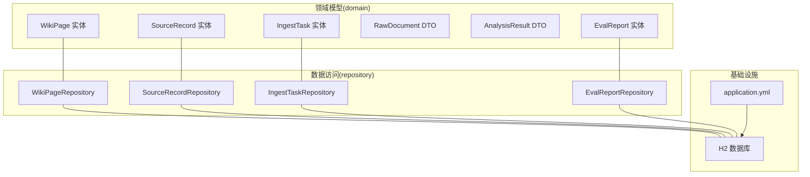
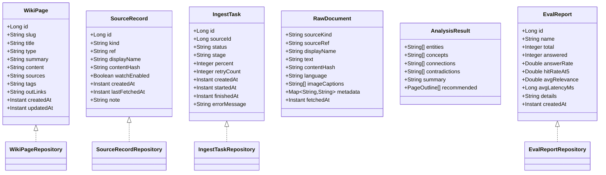
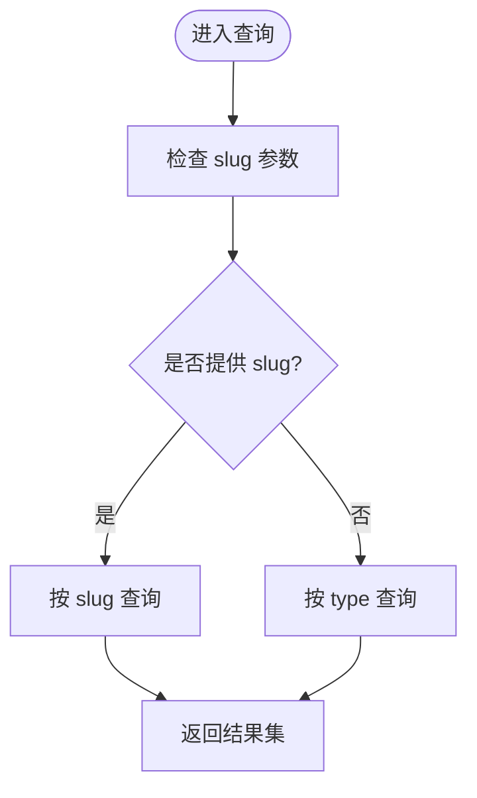
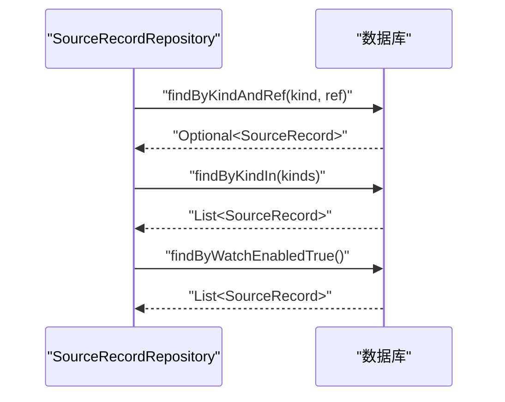
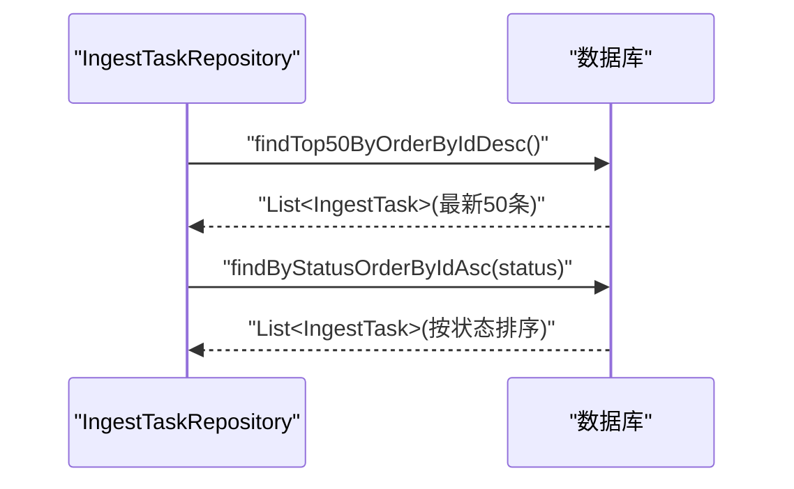
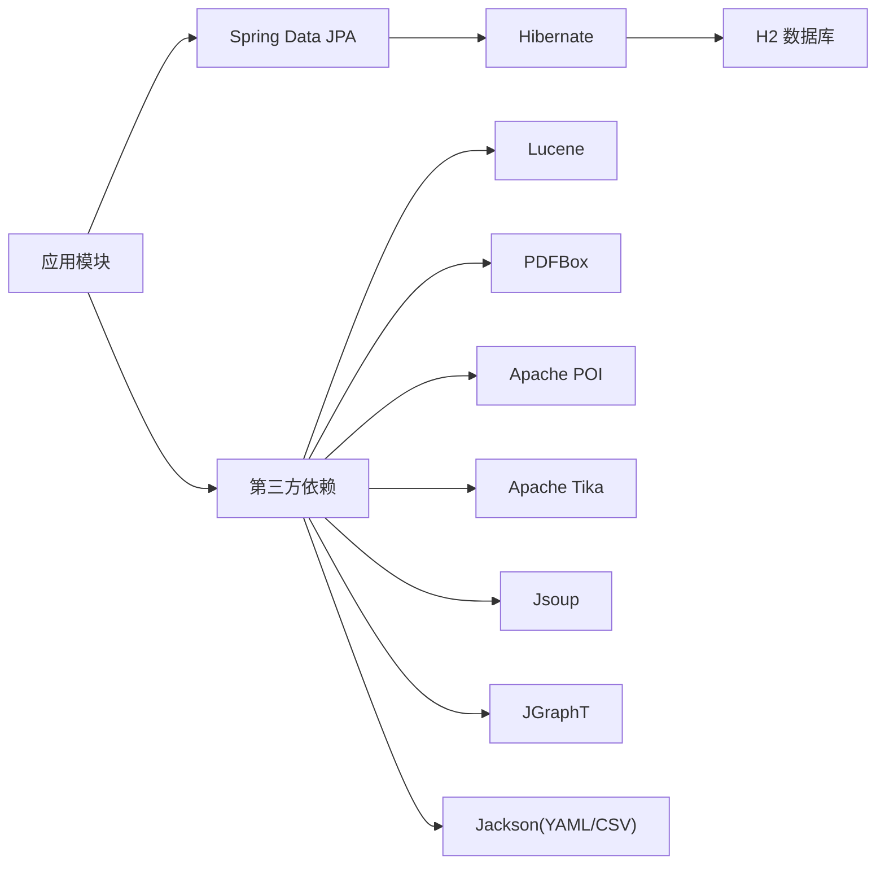

# 数据模型设计

<cite>
**本文引用的文件**
- [WikiPage.java](file://src/main/java/com/example/llmwiki/domain/WikiPage.java)
- [SourceRecord.java](file://src/main/java/com/example/llmwiki/domain/SourceRecord.java)
- [IngestTask.java](file://src/main/java/com/example/llmwiki/domain/IngestTask.java)
- [RawDocument.java](file://src/main/java/com/example/llmwiki/domain/RawDocument.java)
- [AnalysisResult.java](file://src/main/java/com/example/llmwiki/domain/AnalysisResult.java)
- [EvalReport.java](file://src/main/java/com/example/llmwiki/domain/EvalReport.java)
- [WikiPageRepository.java](file://src/main/java/com/example/llmwiki/repository/WikiPageRepository.java)
- [SourceRecordRepository.java](file://src/main/java/com/example/llmwiki/repository/SourceRecordRepository.java)
- [IngestTaskRepository.java](file://src/main/java/com/example/llmwiki/repository/IngestTaskRepository.java)
- [EvalReportRepository.java](file://src/main/java/com/example/llmwiki/repository/EvalReportRepository.java)
- [application.yml](file://src/main/resources/application.yml)
- [pom.xml](file://pom.xml)
</cite>

## 目录
1. [简介](#简介)
2. [项目结构](#项目结构)
3. [核心实体模型](#核心实体模型)
4. [架构总览](#架构总览)
5. [详细组件分析](#详细组件分析)
6. [依赖关系分析](#依赖关系分析)
7. [性能考量](#性能考量)
8. [故障排查指南](#故障排查指南)
9. [结论](#结论)
10. [附录](#附录)

## 简介
本设计文档围绕 LLM Wiki 的数据模型展开，重点基于 Spring Data JPA 的实体映射，系统性描述主键策略、外键关系、索引设计、字段约束、查询优化与数据一致性保障。核心实体包括：
- 维基页面：WikiPage
- 数据源记录：SourceRecord
- 摄取任务：IngestTask
- 原始文档（DTO）：RawDocument
- 分析结果（DTO）：AnalysisResult
- 评估报告：EvalReport

这些实体共同支撑从“原始文档摄取 → 解析 → 分析 → 生成 → 索引 → 图谱构建”的全链路。

## 项目结构
后端采用 Spring Boot + Spring Data JPA + H2 的轻量架构，实体位于 domain 包，仓库接口位于 repository 包，数据库为嵌入式 H2，默认自动建模（DDL 自动更新）。

图表来源
- [application.yml:11-25](file://src/main/resources/application.yml#L11-L25)
- [WikiPage.java:28](file://src/main/java/com/example/llmwiki/domain/WikiPage.java#L28)
- [SourceRecord.java:28](file://src/main/java/com/example/llmwiki/domain/SourceRecord.java#L28)
- [IngestTask.java:28](file://src/main/java/com/example/llmwiki/domain/IngestTask.java#L28)
- [EvalReport.java:28](file://src/main/java/com/example/llmwiki/domain/EvalReport.java#L28)
- [WikiPageRepository.java:13](file://src/main/java/com/example/llmwiki/repository/WikiPageRepository.java#L13)
- [SourceRecordRepository.java:13](file://src/main/java/com/example/llmwiki/repository/SourceRecordRepository.java#L13)
- [IngestTaskRepository.java:12](file://src/main/java/com/example/llmwiki/repository/IngestTaskRepository.java#L12)
- [EvalReportRepository.java:10](file://src/main/java/com/example/llmwiki/repository/EvalReportRepository.java#L10)

章节来源
- [application.yml:11-25](file://src/main/resources/application.yml#L11-L25)
- [pom.xml:36-59](file://pom.xml#L36-L59)

## 核心实体模型
本节逐个梳理实体的字段、约束与用途，并给出字段复杂度与查询路径建议。

- 维基页面（WikiPage）
  - 主键：Long id（自增）
  - 唯一索引：slug（唯一）
  - 字段约束：title、type、createdAt、updatedAt 非空
  - 内容字段：summary、content、sources、tags、outLinks（支持大文本）
  - 查询路径：按 slug 查询、按 type 查询
  - 生命周期：创建/更新时间由应用层维护或数据库触发器（当前未见触发器定义）

- 数据源记录（SourceRecord）
  - 主键：Long id（自增）
  - 字段约束：kind、ref 非空；watchEnabled 布尔；createdAt、lastFetchedAt 时间戳
  - 唯一组合：kind + ref（通过仓库方法体现）
  - 查询路径：按 kind+ref 查询、按 kind 列表过滤、按 watchEnabled 过滤

- 摄取任务（IngestTask）
  - 主键：Long id（自增）
  - 外键：sourceId → SourceRecord.id
  - 字段约束：status 非空；percent 0-100；retryCount 整数；时间戳 createdAt/startedAt/finishedAt
  - 查询路径：最近 N 条、按状态排序的任务列表

- 原始文档（RawDocument）
  - 非持久化 DTO，用于解析器统一输出结构，包含来源元信息、文本、语言、图像描述、元数据与抓取时间

- 分析结果（AnalysisResult）
  - 非持久化 DTO，承载实体、概念、连接、矛盾点、摘要与推荐结构（含 page 类型+标题+slug）

- 评估报告（EvalReport）
  - 主键：Long id（自增）
  - 字段：name、total、answered、answerRate、hitRateAt5、avgRelevance、avgLatencyMs、details（JSON 大字段）、createdAt

章节来源
- [WikiPage.java:31-71](file://src/main/java/com/example/llmwiki/domain/WikiPage.java#L31-L71)
- [SourceRecord.java:31-63](file://src/main/java/com/example/llmwiki/domain/SourceRecord.java#L31-L63)
- [IngestTask.java:31-61](file://src/main/java/com/example/llmwiki/domain/IngestTask.java#L31-L61)
- [RawDocument.java:20-51](file://src/main/java/com/example/llmwiki/domain/RawDocument.java#L20-L51)
- [AnalysisResult.java:21-55](file://src/main/java/com/example/llmwiki/domain/AnalysisResult.java#L21-L55)
- [EvalReport.java:31-50](file://src/main/java/com/example/llmwiki/domain/EvalReport.java#L31-L50)

## 架构总览
下图展示实体与仓库接口的映射关系，以及默认的查询方法约定。

图表来源
- [WikiPage.java:28](file://src/main/java/com/example/llmwiki/domain/WikiPage.java#L28)
- [SourceRecord.java:28](file://src/main/java/com/example/llmwiki/domain/SourceRecord.java#L28)
- [IngestTask.java:28](file://src/main/java/com/example/llmwiki/domain/IngestTask.java#L28)
- [EvalReport.java:28](file://src/main/java/com/example/llmwiki/domain/EvalReport.java#L28)
- [WikiPageRepository.java:13](file://src/main/java/com/example/llmwiki/repository/WikiPageRepository.java#L13)
- [SourceRecordRepository.java:13](file://src/main/java/com/example/llmwiki/repository/SourceRecordRepository.java#L13)
- [IngestTaskRepository.java:12](file://src/main/java/com/example/llmwiki/repository/IngestTaskRepository.java#L12)
- [EvalReportRepository.java:10](file://src/main/java/com/example/llmwiki/repository/EvalReportRepository.java#L10)

## 详细组件分析

### 维基页面实体（WikiPage）
- 主键策略：自增（IDENTITY）
- 唯一性：slug 唯一
- 非空字段：title、type、createdAt、updatedAt
- 大字段：content、outLinks 使用 LOB
- 查询方法：按 slug 查询、按 type 查询
- 复杂度：单表查询，索引建议在 slug（已唯一）、type（常用过滤）

图表来源
- [WikiPageRepository.java:15-17](file://src/main/java/com/example/llmwiki/repository/WikiPageRepository.java#L15-L17)

章节来源
- [WikiPage.java:31-71](file://src/main/java/com/example/llmwiki/domain/WikiPage.java#L31-L71)
- [WikiPageRepository.java:13-18](file://src/main/java/com/example/llmwiki/repository/WikiPageRepository.java#L13-L18)

### 数据源记录实体（SourceRecord）
- 主键策略：自增（IDENTITY）
- 非空字段：kind、ref
- 布尔字段：watchEnabled 控制定时刷新
- 查询方法：按 kind+ref 唯一定位、按 kind 列表过滤、按 watchEnabled 过滤
- 复杂度：组合查询，建议在 kind/ref 上建立复合索引以提升唯一查找效率

图表来源
- [SourceRecordRepository.java:15-19](file://src/main/java/com/example/llmwiki/repository/SourceRecordRepository.java#L15-L19)

章节来源
- [SourceRecord.java:31-63](file://src/main/java/com/example/llmwiki/domain/SourceRecord.java#L31-L63)
- [SourceRecordRepository.java:13-20](file://src/main/java/com/example/llmwiki/repository/SourceRecordRepository.java#L13-L20)

### 摄取任务实体（IngestTask）
- 主键策略：自增（IDENTITY）
- 外键：sourceId → SourceRecord.id
- 状态枚举：PENDING/ RUNNING/ SUCCESS/ FAILED/ CANCELLED/ SKIPPED
- 阶段枚举：PARSE/ANALYZE/GENERATE/INDEX/GRAPH
- 查询方法：最近 N 条、按状态升序
- 复杂度：任务队列场景，建议在 status、sourceId、createdAt 上建立索引以支持调度与统计

图表来源
- [IngestTaskRepository.java:14-16](file://src/main/java/com/example/llmwiki/repository/IngestTaskRepository.java#L14-L16)

章节来源
- [IngestTask.java:31-61](file://src/main/java/com/example/llmwiki/domain/IngestTask.java#L31-L61)
- [IngestTaskRepository.java:12-17](file://src/main/java/com/example/llmwiki/repository/IngestTaskRepository.java#L12-L17)

### 原始文档与分析结果（DTO）
- RawDocument：标准化解析产物，便于跨解析器一致性处理
- AnalysisResult：中间分析结果，承载实体、概念、连接、矛盾点与推荐结构
- 复杂度：内存对象，不涉及数据库索引

章节来源
- [RawDocument.java:20-51](file://src/main/java/com/example/llmwiki/domain/RawDocument.java#L20-L51)
- [AnalysisResult.java:21-55](file://src/main/java/com/example/llmwiki/domain/AnalysisResult.java#L21-L55)

### 评估报告实体（EvalReport）
- 主键策略：自增（IDENTITY）
- 数值指标：total、answered、answerRate、hitRateAt5、avgRelevance、avgLatencyMs
- JSON 大字段：details
- 查询方法：继承 JpaRepository 默认能力
- 复杂度：数值统计查询，建议在 createdAt 上建立索引以便按时间聚合

章节来源
- [EvalReport.java:31-50](file://src/main/java/com/example/llmwiki/domain/EvalReport.java#L31-L50)
- [EvalReportRepository.java:10](file://src/main/java/com/example/llmwiki/repository/EvalReportRepository.java#L10)

## 依赖关系分析
- 数据库：H2（嵌入式），方言为 H2Dialect，DDL 自动更新
- 依赖：Spring Data JPA、Spring Web、Quartz、H2、Lucene、PDFBox、POI、Tika、Jsoup、JGraphT、Jackson YAML/CSV、Lombok
- 事务与并发：未显式声明事务注解，建议在服务层使用 @Transactional 管理一致性

图表来源
- [application.yml:11-25](file://src/main/resources/application.yml#L11-L25)
- [pom.xml:36-158](file://pom.xml#L36-L158)

章节来源
- [application.yml:11-25](file://src/main/resources/application.yml#L11-L25)
- [pom.xml:36-158](file://pom.xml#L36-L158)

## 性能考量
- 索引策略
  - WikiPage：slug（唯一）、type（过滤）、createdAt/updatedAt（排序）
  - SourceRecord：kind+ref（唯一）、watchEnabled（过滤）
  - IngestTask：status（调度）、sourceId（关联）、createdAt（排序）
  - EvalReport：createdAt（时间序列）
- 查询方法设计
  - 使用仓库接口的派生查询（如 findBySlug、findByKindAndRef、findByStatusOrderByIdAsc）
  - 对高频分页查询建议使用 Pageable 并结合合适索引
- 分页查询实现
  - 仓库接口继承 JpaRepository，默认支持分页
  - 建议在高频查询字段上建立索引，避免排序/过滤导致全表扫描
- 缓存与大字段
  - content/outLinks/details 等大字段建议配合文件系统或对象存储，数据库仅保留指针或摘要

## 故障排查指南
- 数据库连接与模式
  - 确认 H2 数据库 URL、驱动与方言配置正确
  - DDL 自动更新可能导致模式变更，生产环境建议改为手动迁移
- 字段约束错误
  - 非空字段缺失或超长会抛出持久化异常，需在入库前进行参数校验
- 唯一性冲突
  - slug、kind+ref 冲突时需先去重或更新
- 任务状态异常
  - IngestTask 状态机需保证幂等，失败重试次数与错误消息需完善
- 评估报告解析
  - details 为 JSON 字符串，解析失败时检查格式与编码

章节来源
- [application.yml:11-25](file://src/main/resources/application.yml#L11-L25)
- [WikiPage.java:36-45](file://src/main/java/com/example/llmwiki/domain/WikiPage.java#L36-L45)
- [SourceRecord.java:36-41](file://src/main/java/com/example/llmwiki/domain/SourceRecord.java#L36-L41)
- [IngestTask.java:39-44](file://src/main/java/com/example/llmwiki/domain/IngestTask.java#L39-L44)
- [EvalReport.java:46](file://src/main/java/com/example/llmwiki/domain/EvalReport.java#L46)

## 结论
本数据模型以 Spring Data JPA 为核心，围绕维基页面、数据源、摄取任务与评估报告构建了清晰的实体边界与查询路径。通过合理的主键策略、唯一性与非空约束、以及仓库接口的派生查询，满足了摄取流水线与检索系统的数据需求。建议后续在生产环境引入显式事务管理、索引优化与数据库迁移方案，以进一步提升一致性与可维护性。

## 附录
- 字段约束汇总
  - WikiPage：slug 唯一、title/type 非空
  - SourceRecord：kind/ref 非空、watchEnabled 布尔
  - IngestTask：status 非空、percent 0-100
  - EvalReport：数值字段与 createdAt
- 查询方法速览
  - WikiPage：按 slug、按 type
  - SourceRecord：按 kind+ref、按 kind 列表、按 watchEnabled
  - IngestTask：最近 N 条、按状态排序
- 依赖清单
  - Spring Data JPA、H2、Lucene、PDFBox、POI、Tika、Jsoup、JGraphT、Jackson、Lombok