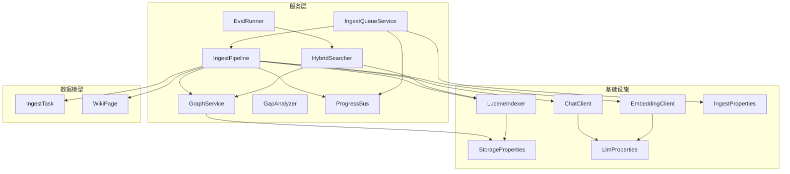
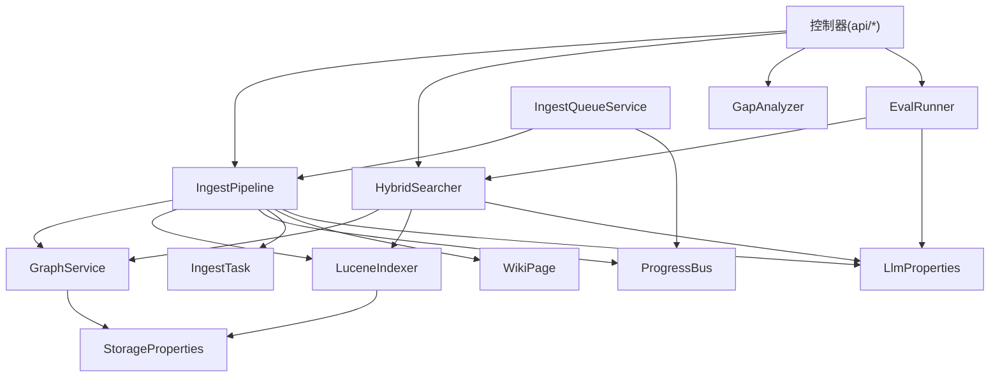
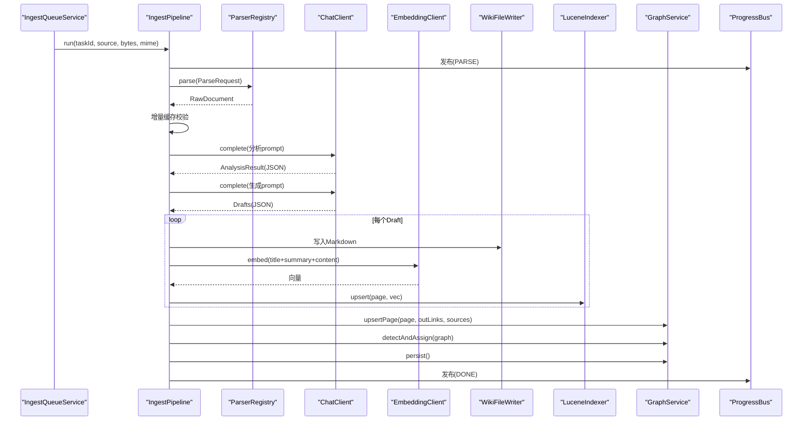
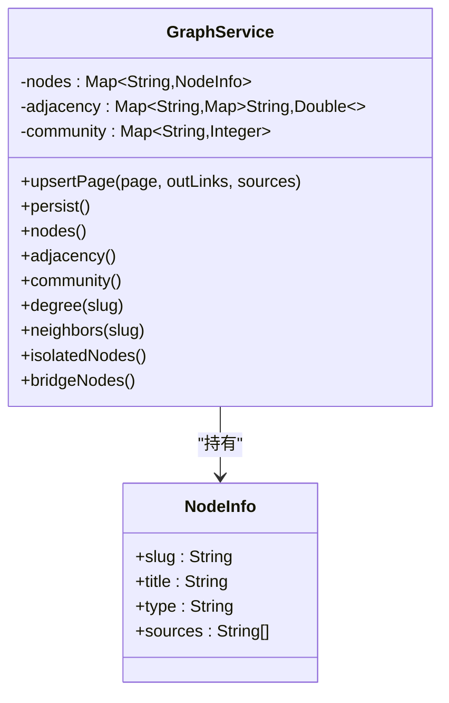
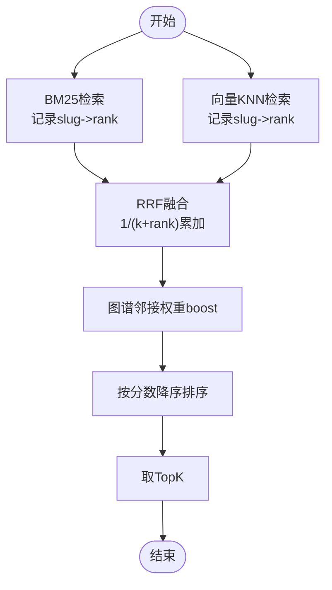
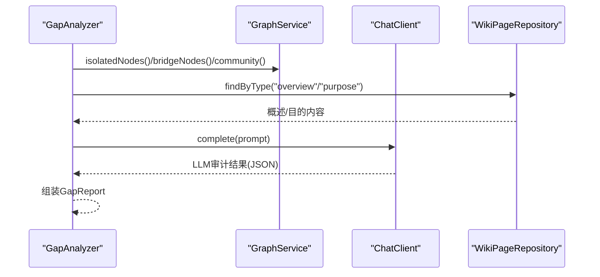
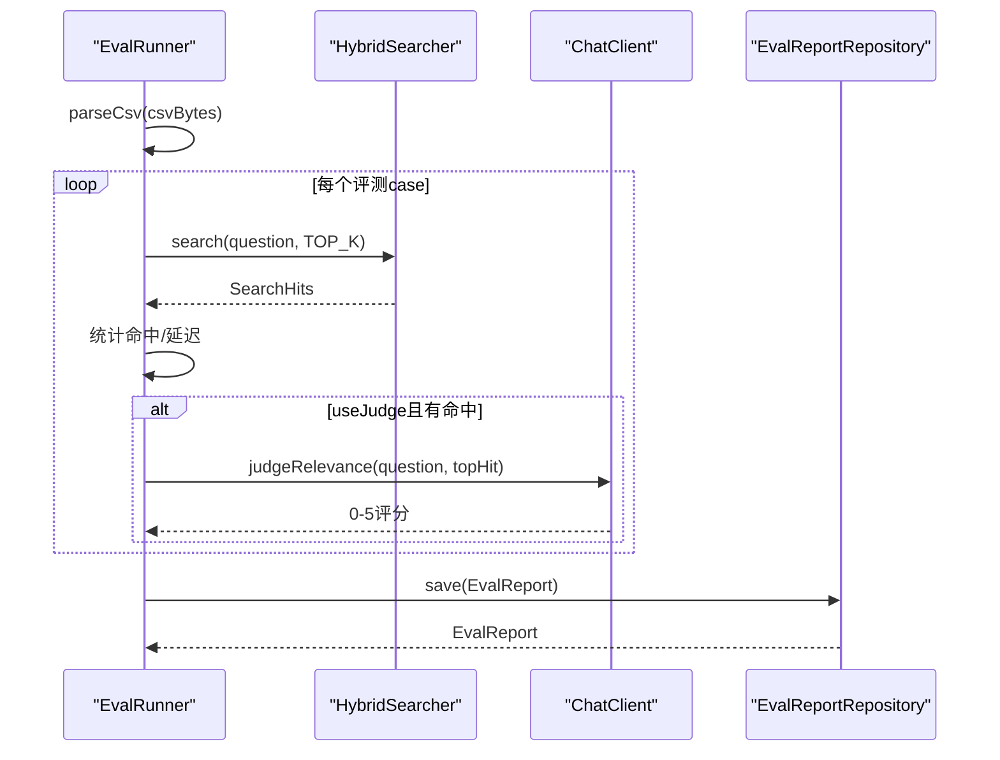
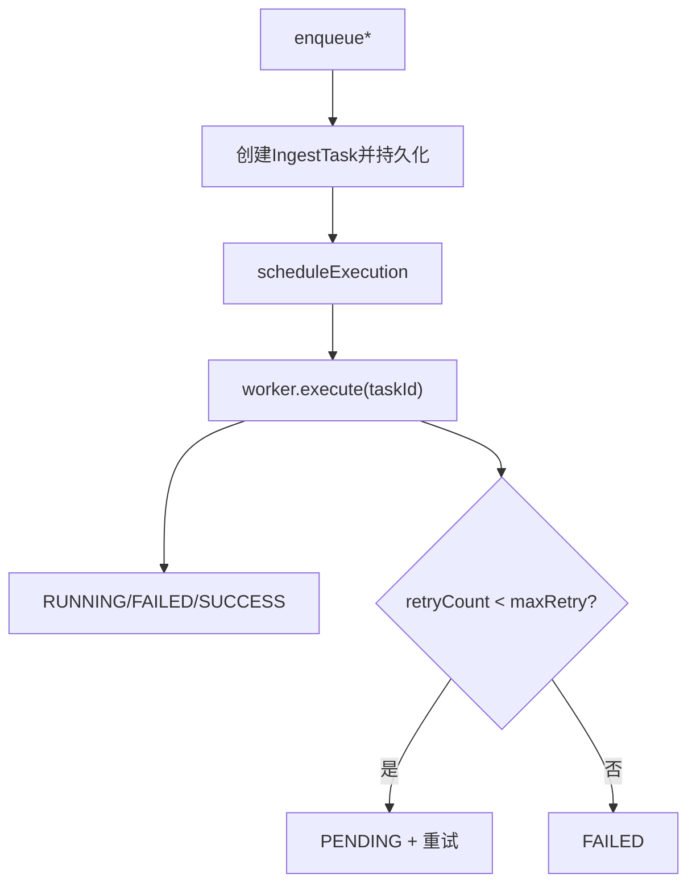
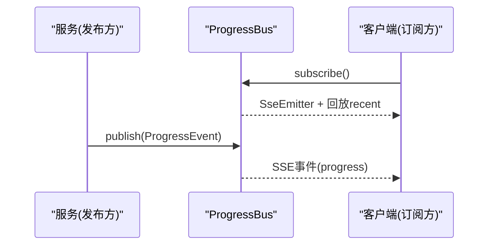
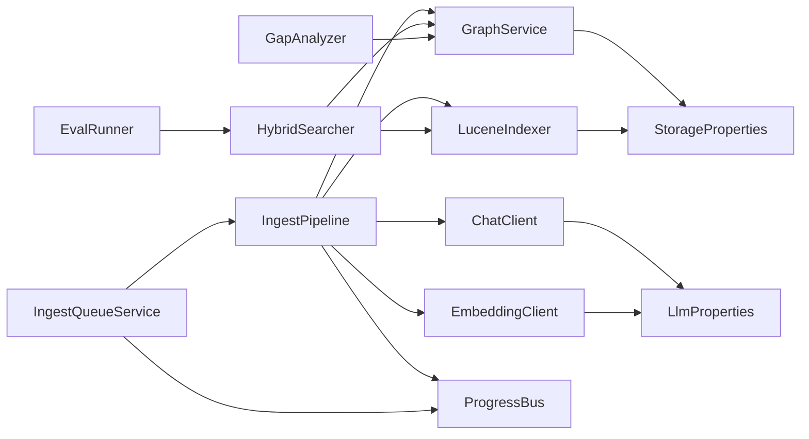

# 服务层设计

<cite>
**本文引用的文件**
- [IngestPipeline.java](file://src/main/java/com/example/llmwiki/ingest/IngestPipeline.java)
- [GraphService.java](file://src/main/java/com/example/llmwiki/graph/GraphService.java)
- [HybridSearcher.java](file://src/main/java/com/example/llmwiki/retrieval/HybridSearcher.java)
- [GapAnalyzer.java](file://src/main/java/com/example/llmwiki/insight/GapAnalyzer.java)
- [EvalRunner.java](file://src/main/java/com/example/llmwiki/eval/EvalRunner.java)
- [IngestQueueService.java](file://src/main/java/com/example/llmwiki/queue/IngestQueueService.java)
- [ProgressBus.java](file://src/main/java/com/example/llmwiki/progress/ProgressBus.java)
- [IngestProperties.java](file://src/main/java/com/example/llmwiki/config/IngestProperties.java)
- [LlmProperties.java](file://src/main/java/com/example/llmwiki/config/LlmProperties.java)
- [StorageProperties.java](file://src/main/java/com/example/llmwiki/config/StorageProperties.java)
- [IngestTask.java](file://src/main/java/com/example/llmwiki/domain/IngestTask.java)
- [WikiPage.java](file://src/main/java/com/example/llmwiki/domain/WikiPage.java)
- [IngestTaskRepository.java](file://src/main/java/com/example/llmwiki/repository/IngestTaskRepository.java)
- [ChatClient.java](file://src/main/java/com/example/llmwiki/llm/ChatClient.java)
- [EmbeddingClient.java](file://src/main/java/com/example/llmwiki/llm/EmbeddingClient.java)
- [LuceneIndexer.java](file://src/main/java/com/example/llmwiki/retrieval/LuceneIndexer.java)
- [application.yml](file://src/main/resources/application.yml)
</cite>

## 目录
1. [简介](#简介)
2. [项目结构](#项目结构)
3. [核心组件](#核心组件)
4. [架构总览](#架构总览)
5. [详细组件分析](#详细组件分析)
6. [依赖分析](#依赖分析)
7. [性能考虑](#性能考虑)
8. [故障排查指南](#故障排查指南)
9. [结论](#结论)
10. [附录](#附录)

## 简介
本设计文档聚焦于LLM Wiki服务层，系统性阐述基于Spring的@Service/@Component注解组件如何实现业务逻辑封装与事务管理，覆盖以下核心服务：
- IngestPipeline：摄取流水线核心协调器，串联解析、分析、生成、索引与图谱更新。
- GraphService：知识图谱构建与维护，提供节点、边与社区划分能力。
- HybridSearcher：混合检索（BM25 + 向量KNN + 图谱权重融合）。
- GapAnalyzer：知识空白分析，结合结构信号与语义审计。
- EvalRunner：评估流程运行器，产出量化评估报告。
- IngestQueueService：摄取任务队列，实现异步串行执行、取消与重试。
- ProgressBus：进度事件总线，支持SSE实时推送。

服务设计遵循单一职责、依赖注入、接口抽象与异常处理原则；在事务管理方面，采用声明式事务与错误回滚策略；在性能方面，提供缓存、批量处理与异步调用等优化手段；在服务间通信上，采用消息传递（SSE）、事件驱动（ProgressBus）与回调机制（队列worker）。

## 项目结构
服务层位于包结构“com.example.llmwiki”下，按功能域划分：
- ingest：摄取流水线与文件写入
- graph：知识图谱服务
- retrieval：检索与索引
- insight：洞察与空白分析
- eval：评估运行器
- queue：摄取队列
- progress：进度事件总线
- config：配置属性
- domain/repository：数据模型与仓库
- llm：LLM客户端
- api：控制器（非服务层，但调用服务）

图表来源
- [IngestPipeline.java:48-109](file://src/main/java/com/example/llmwiki/ingest/IngestPipeline.java#L48-L109)
- [GraphService.java:35-118](file://src/main/java/com/example/llmwiki/graph/GraphService.java#L35-L118)
- [HybridSearcher.java:32-111](file://src/main/java/com/example/llmwiki/retrieval/HybridSearcher.java#L32-L111)
- [GapAnalyzer.java:34-74](file://src/main/java/com/example/llmwiki/insight/GapAnalyzer.java#L34-L74)
- [EvalRunner.java:44-135](file://src/main/java/com/example/llmwiki/eval/EvalRunner.java#L44-L135)
- [IngestQueueService.java:34-212](file://src/main/java/com/example/llmwiki/queue/IngestQueueService.java#L34-L212)
- [ProgressBus.java:18-60](file://src/main/java/com/example/llmwiki/progress/ProgressBus.java#L18-L60)
- [ChatClient.java:26-86](file://src/main/java/com/example/llmwiki/llm/ChatClient.java#L26-L86)
- [EmbeddingClient.java:23-81](file://src/main/java/com/example/llmwiki/llm/EmbeddingClient.java#L23-L81)
- [LuceneIndexer.java:37-112](file://src/main/java/com/example/llmwiki/retrieval/LuceneIndexer.java#L37-L112)
- [StorageProperties.java:14-28](file://src/main/java/com/example/llmwiki/config/StorageProperties.java#L14-L28)
- [LlmProperties.java:17-62](file://src/main/java/com/example/llmwiki/config/LlmProperties.java#L17-L62)
- [IngestProperties.java:14-32](file://src/main/java/com/example/llmwiki/config/IngestProperties.java#L14-L32)
- [IngestTask.java:24-61](file://src/main/java/com/example/llmwiki/domain/IngestTask.java#L24-L61)
- [WikiPage.java:24-71](file://src/main/java/com/example/llmwiki/domain/WikiPage.java#L24-L71)

章节来源
- [application.yml:1-84](file://src/main/resources/application.yml#L1-L84)

## 核心组件
- IngestPipeline：两步CoT（解析→分析→生成→索引/图谱），发布进度事件，处理增量缓存与JSON兼容。
- GraphService：内存图+JSON快照，提供节点/邻接/社区管理与结构性洞察。
- HybridSearcher：BM25 + KNN + 图谱权重融合，RRF排序。
- GapAnalyzer：孤立节点/稀疏社区/桥节点结构信号 + LLM语义审计。
- EvalRunner：CSV评测、命中率/平均相关性/延迟统计，支持LLM评分。
- IngestQueueService：DB持久化任务队列、单线程worker串行执行、取消与重试。
- ProgressBus：SSE订阅与广播，最近事件回放。

章节来源
- [IngestPipeline.java:33-109](file://src/main/java/com/example/llmwiki/ingest/IngestPipeline.java#L33-L109)
- [GraphService.java:24-118](file://src/main/java/com/example/llmwiki/graph/GraphService.java#L24-L118)
- [HybridSearcher.java:25-111](file://src/main/java/com/example/llmwiki/retrieval/HybridSearcher.java#L25-L111)
- [GapAnalyzer.java:24-74](file://src/main/java/com/example/llmwiki/insight/GapAnalyzer.java#L24-L74)
- [EvalRunner.java:28-135](file://src/main/java/com/example/llmwiki/eval/EvalRunner.java#L28-L135)
- [IngestQueueService.java:27-212](file://src/main/java/com/example/llmwiki/queue/IngestQueueService.java#L27-L212)
- [ProgressBus.java:11-60](file://src/main/java/com/example/llmwiki/progress/ProgressBus.java#L11-L60)

## 架构总览
服务层围绕“数据模型-服务-基础设施-事件总线”的层次展开，控制器通过服务层编排业务，服务层内部通过依赖注入协作，异常统一处理，进度通过事件总线实时推送。

图表来源
- [IngestPipeline.java:48-109](file://src/main/java/com/example/llmwiki/ingest/IngestPipeline.java#L48-L109)
- [HybridSearcher.java:32-111](file://src/main/java/com/example/llmwiki/retrieval/HybridSearcher.java#L32-L111)
- [GapAnalyzer.java:34-74](file://src/main/java/com/example/llmwiki/insight/GapAnalyzer.java#L34-L74)
- [EvalRunner.java:44-135](file://src/main/java/com/example/llmwiki/eval/EvalRunner.java#L44-L135)
- [IngestQueueService.java:34-212](file://src/main/java/com/example/llmwiki/queue/IngestQueueService.java#L34-L212)
- [GraphService.java:35-118](file://src/main/java/com/example/llmwiki/graph/GraphService.java#L35-L118)
- [LuceneIndexer.java:37-112](file://src/main/java/com/example/llmwiki/retrieval/LuceneIndexer.java#L37-L112)
- [StorageProperties.java:14-28](file://src/main/java/com/example/llmwiki/config/StorageProperties.java#L14-L28)
- [LlmProperties.java:17-62](file://src/main/java/com/example/llmwiki/config/LlmProperties.java#L17-L62)
- [IngestTask.java:24-61](file://src/main/java/com/example/llmwiki/domain/IngestTask.java#L24-L61)
- [WikiPage.java:24-71](file://src/main/java/com/example/llmwiki/domain/WikiPage.java#L24-L71)

## 详细组件分析

### IngestPipeline（摄取流水线）
- 职责：两步式CoT（解析→分析→生成→索引/图谱），发布进度事件，处理增量缓存与JSON兼容。
- 关键流程：
  - 解析阶段：根据SourceRecord构造ParseRequest，交由ParserRegistry解析为RawDocument。
  - 增量缓存：若内容哈希相同则跳过。
  - 分析阶段：渲染“analyze”模板，调用ChatClient获取结构化JSON，解析为AnalysisResult。
  - 生成阶段：渲染“generate”模板，调用ChatClient生成多页WikiPageDraft。
  - 持久化：逐页保存WikiPage并写入Markdown，同步向量嵌入至Lucene。
  - 图谱更新：逐页upsert图谱节点与边，执行Louvain社区检测，持久化图谱。
  - 任务收尾：更新SourceRecord内容哈希与抓取时间，记录日志，发布完成事件。
- 异常处理：步骤解析JSON失败或未生成页面时抛出IngestException，由上游队列捕获并重试/标记失败。
- 事件总线：publish方法统一推送ProgressEvent，供ProgressBus广播。

图表来源
- [IngestPipeline.java:65-109](file://src/main/java/com/example/llmwiki/ingest/IngestPipeline.java#L65-L109)
- [ProgressBus.java:43-55](file://src/main/java/com/example/llmwiki/progress/ProgressBus.java#L43-L55)

章节来源
- [IngestPipeline.java:33-251](file://src/main/java/com/example/llmwiki/ingest/IngestPipeline.java#L33-L251)

### GraphService（知识图谱服务）
- 职责：维护内存图（节点、邻接表、社区），提供节点/边查询与结构性洞察（孤立节点、桥节点、稀疏社区）。
- 关键能力：
  - upsertPage：根据WikiPage与出链重建邻接权重，计算源重叠权重。
  - persist：将当前图快照写入JSON文件（graph.json）。
  - 查询接口：nodes/adjacency/community、degree/neighbors、isolatedNodes/bridgeNodes。
- 初始化：@PostConstruct从存储目录加载graph.json快照。

图表来源
- [GraphService.java:35-197](file://src/main/java/com/example/llmwiki/graph/GraphService.java#L35-L197)

章节来源
- [GraphService.java:24-197](file://src/main/java/com/example/llmwiki/graph/GraphService.java#L24-L197)

### HybridSearcher（混合检索）
- 职责：BM25全文检索 + 向量KNN检索，使用RRF融合，附加图谱邻接权重boost。
- 关键流程：
  - BM25：解析器构建Query，IndexSearcher检索TopN，记录slug→rank映射。
  - KNN：EmbeddingClient生成查询向量，KnnFloatVectorQuery检索TopN。
  - 图谱boost：对命中节点的邻居按邻接权重累加，提升最终分数。
  - RRF归并：1/(k+rank)求和，按分数降序取TopK。
- 降级策略：Embedding不可用时仅BM25。

图表来源
- [HybridSearcher.java:42-111](file://src/main/java/com/example/llmwiki/retrieval/HybridSearcher.java#L42-L111)

章节来源
- [HybridSearcher.java:25-137](file://src/main/java/com/example/llmwiki/retrieval/HybridSearcher.java#L25-L137)

### GapAnalyzer（知识空白分析）
- 职责：结合结构信号（孤立/稀疏/桥节点）与语义信号（LLM审计），输出综合gap报告与建议。
- 关键流程：
  - 结构信号：读取GraphService的孤立节点、桥节点、稀疏社区。
  - 语义信号：读取“overview/purpose”页面内容，渲染prompt，调用ChatClient进行审计。
  - 通用建议：根据图谱状态生成补充建议。
- 错误处理：LLM分析失败时记录错误信息，不影响结构信号。

图表来源
- [GapAnalyzer.java:51-74](file://src/main/java/com/example/llmwiki/insight/GapAnalyzer.java#L51-L74)

章节来源
- [GapAnalyzer.java:24-229](file://src/main/java/com/example/llmwiki/insight/GapAnalyzer.java#L24-L229)

### EvalRunner（评估运行器）
- 职责：读取CSV评测集，执行混合检索，计算answerRate/hitRate@5/avgRelevance/avgLatency，生成EvalReport并落库。
- 关键流程：
  - 解析CSV：按行拆分，支持分号/逗号分隔的期望slug集合。
  - 逐条评测：调用HybridSearcher.search，统计命中与相关性。
  - LLM评分：可选调用ChatClient对最高分候选进行0-5打分。
  - 指标计算：汇总answerRate/hitRate@5/avgRelevance/avgLatency。
- 异常处理：单条评测失败记录错误信息，不影响整体统计。

图表来源
- [EvalRunner.java:63-135](file://src/main/java/com/example/llmwiki/eval/EvalRunner.java#L63-L135)

章节来源
- [EvalRunner.java:28-243](file://src/main/java/com/example/llmwiki/eval/EvalRunner.java#L28-L243)

### IngestQueueService（摄取队列）
- 职责：DB持久化任务队列、单线程串行worker、任务取消与失败重试。
- 关键流程：
  - 入队：创建IngestTask，持久化原始文件（raw/），发布“已入队”事件。
  - 恢复：启动时将RUNNING任务重置为PENDING并重新入队。
  - 执行：worker线程取出任务，设置RUNNING并执行pipeline.run；失败则按最大重试次数重试或标记FAILED。
  - 取消：加入取消集合，PENDING任务直接标记CANCELLED。
- 并发：单线程executor保证串行执行，避免资源竞争。

图表来源
- [IngestQueueService.java:53-212](file://src/main/java/com/example/llmwiki/queue/IngestQueueService.java#L53-L212)
- [IngestTask.java:38-60](file://src/main/java/com/example/llmwiki/domain/IngestTask.java#L38-L60)

章节来源
- [IngestQueueService.java:27-214](file://src/main/java/com/example/llmwiki/queue/IngestQueueService.java#L27-L214)

### ProgressBus（进度事件总线）
- 职责：维护SSE订阅者列表，广播ProgressEvent，保留最近50条事件供新订阅者回放。
- 关键流程：
  - subscribe：创建SseEmitter并回放recent事件。
  - publish：入队recent并广播给所有emitters，移除断开/超时/错误的订阅者。

图表来源
- [ProgressBus.java:26-55](file://src/main/java/com/example/llmwiki/progress/ProgressBus.java#L26-L55)

章节来源
- [ProgressBus.java:11-61](file://src/main/java/com/example/llmwiki/progress/ProgressBus.java#L11-L61)

## 依赖分析
- 组件耦合：
  - IngestPipeline依赖ChatClient/EmbeddingClient/GraphService/LuceneIndexer/ProgressBus，体现高内聚低耦合。
  - HybridSearcher依赖LuceneIndexer与GraphService，形成检索-图谱协同。
  - GapAnalyzer依赖GraphService与ChatClient，结合结构与语义信号。
  - EvalRunner依赖HybridSearcher与ChatClient，形成评测闭环。
  - IngestQueueService依赖IngestPipeline与ProgressBus，负责异步编排。
- 外部依赖：
  - LLM客户端通过LlmProperties配置，支持OpenAI兼容协议。
  - 存储通过StorageProperties配置，数据落盘于本地文件系统。
  - 数据库使用JPA/H2，DDL自动更新。

图表来源
- [IngestPipeline.java:52-63](file://src/main/java/com/example/llmwiki/ingest/IngestPipeline.java#L52-L63)
- [HybridSearcher.java:38-40](file://src/main/java/com/example/llmwiki/retrieval/HybridSearcher.java#L38-L40)
- [GapAnalyzer.java:40-44](file://src/main/java/com/example/llmwiki/insight/GapAnalyzer.java#L40-L44)
- [EvalRunner.java:51-54](file://src/main/java/com/example/llmwiki/eval/EvalRunner.java#L51-L54)
- [IngestQueueService.java:38-43](file://src/main/java/com/example/llmwiki/queue/IngestQueueService.java#L38-L43)
- [ChatClient.java:30-32](file://src/main/java/com/example/llmwiki/llm/ChatClient.java#L30-L32)
- [EmbeddingClient.java:27-29](file://src/main/java/com/example/llmwiki/llm/EmbeddingClient.java#L27-L29)
- [GraphService.java:39-40](file://src/main/java/com/example/llmwiki/graph/GraphService.java#L39-L40)
- [LuceneIndexer.java:41-42](file://src/main/java/com/example/llmwiki/retrieval/LuceneIndexer.java#L41-L42)
- [LlmProperties.java:17-62](file://src/main/java/com/example/llmwiki/config/LlmProperties.java#L17-L62)
- [StorageProperties.java:14-28](file://src/main/java/com/example/llmwiki/config/StorageProperties.java#L14-L28)

章节来源
- [application.yml:31-84](file://src/main/resources/application.yml#L31-L84)

## 性能考虑
- 缓存策略
  - 增量缓存：IngestPipeline基于内容哈希跳过重复处理，减少LLM与索引开销。
  - 近期事件缓存：ProgressBus保留最近50条事件，降低新订阅者等待时间。
- 批量处理
  - EmbeddingClient支持批量嵌入，IngestPipeline在持久化阶段逐页调用，可扩展为批量接口以降低网络往返。
  - LuceneIndexer在upsert时commit，建议在批处理场景合并提交以减少磁盘IO。
- 异步调用
  - IngestQueueService使用单线程worker串行执行，避免并发写冲突；可通过配置IngestProperties调整worker线程数以提升吞吐。
  - ProgressBus使用SSE异步推送，避免阻塞主线程。
- 检索优化
  - HybridSearcher使用RRF融合，合理设置k参数平衡BM25与KNN贡献。
  - 图谱权重boost按邻接权重累加，建议对大规模图谱启用社区划分以降低计算复杂度。

[本节为通用性能指导，无需特定文件来源]

## 故障排查指南
- LLM配置错误
  - 现象：Chat/Embedding调用抛出未配置异常。
  - 排查：检查LlmProperties中的baseUrl/apiKey/model是否正确配置。
  - 参考
    - [LlmProperties.java:31-61](file://src/main/java/com/example/llmwiki/config/LlmProperties.java#L31-L61)
    - [ChatClient.java:52-54](file://src/main/java/com/example/llmwiki/llm/ChatClient.java#L52-L54)
    - [EmbeddingClient.java:44-46](file://src/main/java/com/example/llmwiki/llm/EmbeddingClient.java#L44-L46)
- 摄取任务失败
  - 现象：任务状态变为FAILED，错误信息记录在IngestTask.errorMessage。
  - 排查：查看IngestQueueService的execute分支，确认重试次数与最大重试阈值；检查源文件是否存在与可读。
  - 参考
    - [IngestQueueService.java:194-211](file://src/main/java/com/example/llmwiki/queue/IngestQueueService.java#L194-L211)
    - [IngestTask.java:58-60](file://src/main/java/com/example/llmwiki/domain/IngestTask.java#L58-L60)
- 检索异常
  - 现象：BM25/KNN检索失败或返回空。
  - 排查：确认LuceneIndexer初始化成功，向量维度与模型一致；EmbeddingClient可用时优先KNN，否则回退BM25。
  - 参考
    - [LuceneIndexer.java:78-99](file://src/main/java/com/example/llmwiki/retrieval/LuceneIndexer.java#L78-L99)
    - [HybridSearcher.java:67-86](file://src/main/java/com/example/llmwiki/retrieval/HybridSearcher.java#L67-L86)
- 图谱持久化失败
  - 现象：graph.json写入失败或加载失败。
  - 排查：检查StorageProperties.graphDir权限与磁盘空间；确认JSON序列化/反序列化格式。
  - 参考
    - [GraphService.java:106-118](file://src/main/java/com/example/llmwiki/graph/GraphService.java#L106-L118)
    - [StorageProperties.java:26-27](file://src/main/java/com/example/llmwiki/config/StorageProperties.java#L26-L27)

章节来源
- [IngestQueueService.java:194-211](file://src/main/java/com/example/llmwiki/queue/IngestQueueService.java#L194-L211)
- [IngestTask.java:58-60](file://src/main/java/com/example/llmwiki/domain/IngestTask.java#L58-L60)
- [ChatClient.java:52-54](file://src/main/java/com/example/llmwiki/llm/ChatClient.java#L52-L54)
- [EmbeddingClient.java:44-46](file://src/main/java/com/example/llmwiki/llm/EmbeddingClient.java#L44-L46)
- [LuceneIndexer.java:78-99](file://src/main/java/com/example/llmwiki/retrieval/LuceneIndexer.java#L78-L99)
- [HybridSearcher.java:67-86](file://src/main/java/com/example/llmwiki/retrieval/HybridSearcher.java#L67-L86)
- [GraphService.java:106-118](file://src/main/java/com/example/llmwiki/graph/GraphService.java#L106-L118)
- [StorageProperties.java:26-27](file://src/main/java/com/example/llmwiki/config/StorageProperties.java#L26-L27)

## 结论
本服务层通过清晰的职责划分与Spring依赖注入，实现了从摄取、检索、图谱到评估的完整业务闭环。IngestPipeline作为协调器串联各子系统，GraphService与HybridSearcher分别承担结构与语义检索能力，GapAnalyzer与EvalRunner提供洞察与质量保障。IngestQueueService与ProgressBus确保异步执行与实时反馈。整体设计具备良好的扩展性与可维护性，建议后续在批量处理、缓存与并发控制方面进一步优化。

[本节为总结性内容，无需特定文件来源]

## 附录
- 事务管理
  - 本服务层未显式使用Spring声明式事务注解（@Transactional）。实际事务边界由JPA/H2与单线程worker串行执行共同保障。若需要跨多个仓库操作的强一致性，可在关键服务方法上引入声明式事务，并定义合适的传播行为与回滚规则。
- 服务间通信
  - 事件驱动：ProgressBus通过SSE向前端推送进度事件。
  - 消息传递：IngestQueueService将任务持久化到数据库，worker从数据库拉取执行，实现任务队列的消息化。
  - 回调机制：队列worker执行完成后回调更新任务状态，支持重试与失败上报。

[本节为概念性说明，无需特定文件来源]