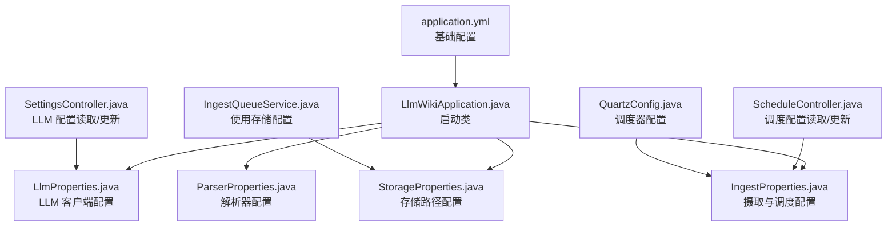
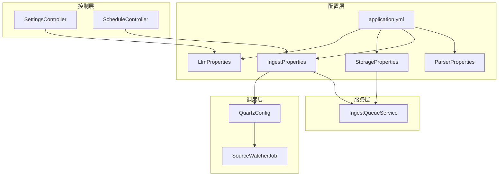
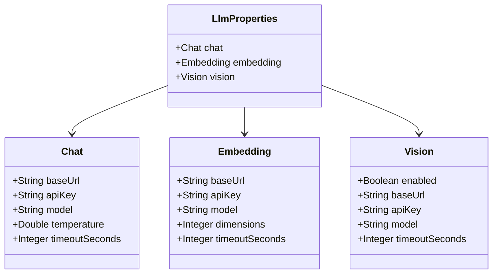
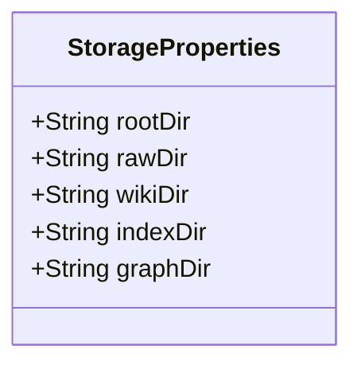
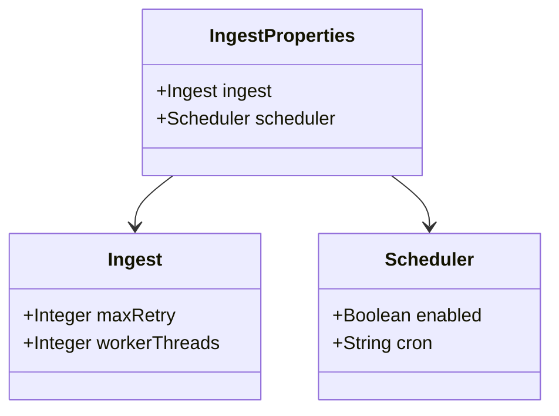
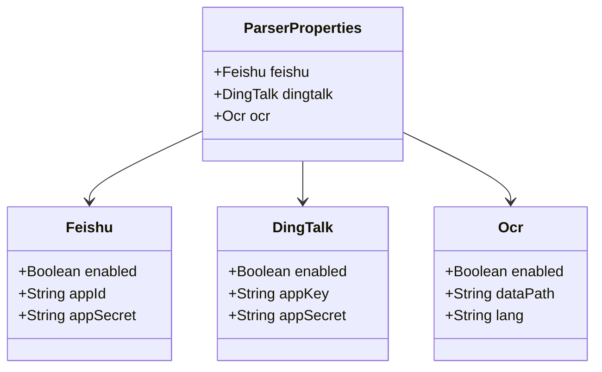
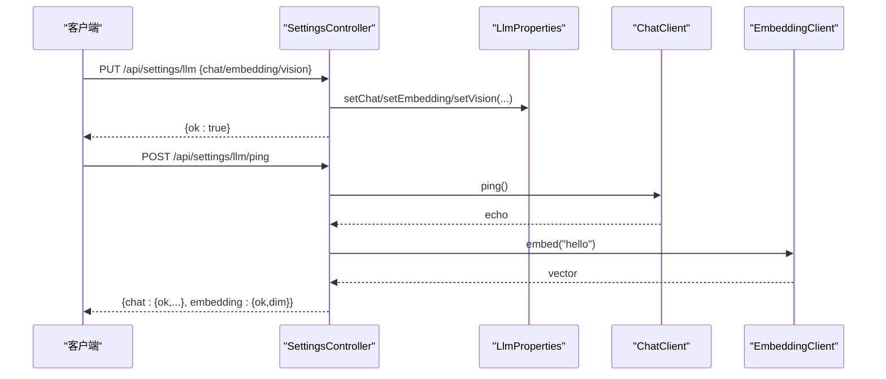
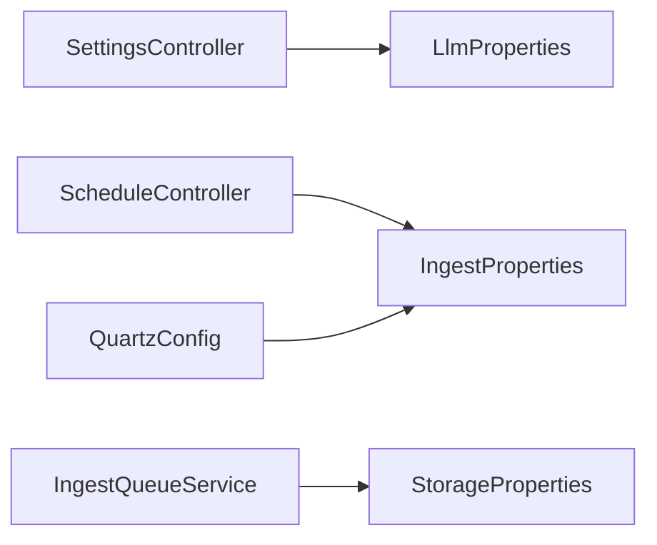

# 配置管理

<cite>
**本文引用的文件列表**
- [application.yml](file://src/main/resources/application.yml)
- [LlmProperties.java](file://src/main/java/com/example/llmwiki/config/LlmProperties.java)
- [StorageProperties.java](file://src/main/java/com/example/llmwiki/config/StorageProperties.java)
- [IngestProperties.java](file://src/main/java/com/example/llmwiki/config/IngestProperties.java)
- [ParserProperties.java](file://src/main/java/com/example/llmwiki/config/ParserProperties.java)
- [WebConfig.java](file://src/main/java/com/example/llmwiki/config/WebConfig.java)
- [LlmWikiApplication.java](file://src/main/java/com/example/llmwiki/LlmWikiApplication.java)
- [SettingsController.java](file://src/main/java/com/example/llmwiki/api/SettingsController.java)
- [ScheduleController.java](file://src/main/java/com/example/llmwiki/api/ScheduleController.java)
- [QuartzConfig.java](file://src/main/java/com/example/llmwiki/scheduler/QuartzConfig.java)
- [IngestQueueService.java](file://src/main/java/com/example/llmwiki/queue/IngestQueueService.java)
- [pom.xml](file://pom.xml)
</cite>

## 目录
1. [简介](#简介)
2. [项目结构](#项目结构)
3. [核心组件](#核心组件)
4. [架构总览](#架构总览)
5. [详细组件分析](#详细组件分析)
6. [依赖关系分析](#依赖关系分析)
7. [性能考量](#性能考量)
8. [故障排查指南](#故障排查指南)
9. [结论](#结论)
10. [附录](#附录)

## 简介
本设计文档聚焦于 LLM Wiki 的配置管理系统，系统采用 Spring Boot 的配置体系，结合 application.yml 的基础配置与多个自定义配置类，覆盖 LLM 客户端、存储路径、摄取流程、解析器等关键领域。文档将详细说明：
- 基于 application.yml 的应用配置管理（数据库、服务器端口、日志级别等）
- 自定义配置类的职责与字段含义（LlmProperties、StorageProperties、IngestProperties、ParserProperties）
- 配置加载机制（@ConfigurationProperties 注解、自动装配、默认值）
- 动态配置（运行时更新、热加载、健康探测）
- 环境配置（开发 vs 生产差异、敏感信息保护、配置加密）
- 冲突与优先级（配置前缀、合并策略、继承机制）

## 项目结构
配置相关的核心文件分布如下：
- application.yml：基础应用配置（服务器端口、数据库、JPA、Quartz、日志级别等）
- config 包：自定义配置类（LlmProperties、StorageProperties、IngestProperties、ParserProperties、WebConfig）
- api 包：对外暴露配置读取与更新接口（SettingsController、ScheduleController）
- scheduler 包：调度配置（QuartzConfig）
- queue 包：使用 StorageProperties 的服务（IngestQueueService）

图表来源
- [application.yml:1-84](file://src/main/resources/application.yml#L1-L84)
- [LlmWikiApplication.java:19-28](file://src/main/java/com/example/llmwiki/LlmWikiApplication.java#L19-L28)
- [LlmProperties.java:16-63](file://src/main/java/com/example/llmwiki/config/LlmProperties.java#L16-L63)
- [StorageProperties.java:13-29](file://src/main/java/com/example/llmwiki/config/StorageProperties.java#L13-L29)
- [IngestProperties.java:13-33](file://src/main/java/com/example/llmwiki/config/IngestProperties.java#L13-L33)
- [ParserProperties.java:13-46](file://src/main/java/com/example/llmwiki/config/ParserProperties.java#L13-L46)
- [SettingsController.java:24-70](file://src/main/java/com/example/llmwiki/api/SettingsController.java#L24-L70)
- [ScheduleController.java:38-78](file://src/main/java/com/example/llmwiki/api/ScheduleController.java#L38-L78)
- [QuartzConfig.java:28-72](file://src/main/java/com/example/llmwiki/scheduler/QuartzConfig.java#L28-L72)
- [IngestQueueService.java:34-144](file://src/main/java/com/example/llmwiki/queue/IngestQueueService.java#L34-L144)

章节来源
- [application.yml:1-84](file://src/main/resources/application.yml#L1-L84)
- [LlmWikiApplication.java:19-28](file://src/main/java/com/example/llmwiki/LlmWikiApplication.java#L19-L28)

## 核心组件
- 基础配置（application.yml）
  - 服务器端口、文件上传大小限制、数据库（H2）、JPA 方言、Quartz 线程池、日志级别
- 自定义配置类
  - LlmProperties：管理 Chat/Embedding/Vision 的基础地址、API Key、模型、温度、超时等
  - StorageProperties：管理数据根目录与各子目录（raw、wiki、index、graph）
  - IngestProperties：管理摄取重试次数、工作线程数、调度开关与 Cron
  - ParserProperties：管理飞书/钉钉/OCR 的启用状态与密钥/路径
- 控制器与调度
  - SettingsController：读取/更新 LLM 配置并进行健康探测
  - ScheduleController：读取/更新调度配置
  - QuartzConfig：将 Spring 容器注入 Quartz Job，按 Cron 触发 SourceWatcherJob

章节来源
- [application.yml:1-84](file://src/main/resources/application.yml#L1-L84)
- [LlmProperties.java:16-63](file://src/main/java/com/example/llmwiki/config/LlmProperties.java#L16-L63)
- [StorageProperties.java:13-29](file://src/main/java/com/example/llmwiki/config/StorageProperties.java#L13-L29)
- [IngestProperties.java:13-33](file://src/main/java/com/example/llmwiki/config/IngestProperties.java#L13-L33)
- [ParserProperties.java:13-46](file://src/main/java/com/example/llmwiki/config/ParserProperties.java#L13-L46)
- [SettingsController.java:24-70](file://src/main/java/com/example/llmwiki/api/SettingsController.java#L24-L70)
- [ScheduleController.java:38-78](file://src/main/java/com/example/llmwiki/api/ScheduleController.java#L38-L78)
- [QuartzConfig.java:28-72](file://src/main/java/com/example/llmwiki/scheduler/QuartzConfig.java#L28-L72)

## 架构总览
下图展示配置体系在系统中的交互关系：application.yml 提供基础配置，自定义配置类通过 @ConfigurationProperties 绑定前缀并注入到控制器与服务中，控制器提供运行时更新能力，调度器按配置执行任务。

图表来源
- [application.yml:1-84](file://src/main/resources/application.yml#L1-L84)
- [LlmProperties.java:16-63](file://src/main/java/com/example/llmwiki/config/LlmProperties.java#L16-L63)
- [StorageProperties.java:13-29](file://src/main/java/com/example/llmwiki/config/StorageProperties.java#L13-L29)
- [IngestProperties.java:13-33](file://src/main/java/com/example/llmwiki/config/IngestProperties.java#L13-L33)
- [ParserProperties.java:13-46](file://src/main/java/com/example/llmwiki/config/ParserProperties.java#L13-L46)
- [SettingsController.java:24-70](file://src/main/java/com/example/llmwiki/api/SettingsController.java#L24-L70)
- [ScheduleController.java:38-78](file://src/main/java/com/example/llmwiki/api/ScheduleController.java#L38-L78)
- [QuartzConfig.java:28-72](file://src/main/java/com/example/llmwiki/scheduler/QuartzConfig.java#L28-L72)
- [IngestQueueService.java:34-144](file://src/main/java/com/example/llmwiki/queue/IngestQueueService.java#L34-L144)

## 详细组件分析

### 基础配置（application.yml）
- 服务器与文件上传
  - server.port：HTTP 服务监听端口
  - spring.servlet.multipart：最大单文件与请求体大小
- 数据库与 JPA
  - spring.datasource：H2 文件数据库连接、用户名、密码
  - spring.jpa：DDL 自动更新、方言、Hibernate 打开/关闭视图
  - h2.console：H2 控制台启用与访问路径
- 调度与线程池
  - quartz.job-store-type：内存存储
  - quartz.properties.org.quartz.threadPool.threadCount：线程池大小
- 日志级别
  - logging.level：根日志级别与包级别（示例：DEBUG、WARN）

章节来源
- [application.yml:1-84](file://src/main/resources/application.yml#L1-L84)

### 自定义配置类

#### LlmProperties（LLM 客户端配置）
- 前缀：llm-wiki.llm
- 字段分组
  - Chat：baseUrl、apiKey、model、temperature、timeoutSeconds
  - Embedding：baseUrl、apiKey、model、dimensions、timeoutSeconds
  - Vision：enabled、baseUrl、apiKey、model、timeoutSeconds
- 默认值：各字段提供合理默认值，便于开发环境快速启动
- 运行时热更新：通过 SettingsController 的 PUT /api/settings/llm 实现

图表来源
- [LlmProperties.java:16-63](file://src/main/java/com/example/llmwiki/config/LlmProperties.java#L16-L63)

章节来源
- [LlmProperties.java:16-63](file://src/main/java/com/example/llmwiki/config/LlmProperties.java#L16-L63)
- [SettingsController.java:24-70](file://src/main/java/com/example/llmwiki/api/SettingsController.java#L24-L70)

#### StorageProperties（存储路径配置）
- 前缀：llm-wiki.storage
- 字段：rootDir、rawDir、wikiDir、indexDir、graphDir
- 用途：统一管理数据根目录与各子目录，供摄取队列与索引/图谱模块使用

图表来源
- [StorageProperties.java:13-29](file://src/main/java/com/example/llmwiki/config/StorageProperties.java#L13-L29)

章节来源
- [StorageProperties.java:13-29](file://src/main/java/com/example/llmwiki/config/StorageProperties.java#L13-L29)
- [IngestQueueService.java:34-144](file://src/main/java/com/example/llmwiki/queue/IngestQueueService.java#L34-L144)

#### IngestProperties（摄取与调度配置）
- 前缀：llm-wiki
- 字段：
  - ingest.maxRetry：最大重试次数
  - ingest.workerThreads：工作线程数
  - scheduler.enabled：调度开关
  - scheduler.cron：Cron 表达式
- 使用场景：调度器配置、队列服务并发控制

图表来源
- [IngestProperties.java:13-33](file://src/main/java/com/example/llmwiki/config/IngestProperties.java#L13-L33)

章节来源
- [IngestProperties.java:13-33](file://src/main/java/com/example/llmwiki/config/IngestProperties.java#L13-L33)
- [QuartzConfig.java:28-72](file://src/main/java/com/example/llmwiki/scheduler/QuartzConfig.java#L28-L72)
- [ScheduleController.java:38-78](file://src/main/java/com/example/llmwiki/api/ScheduleController.java#L38-L78)

#### ParserProperties（解析器配置）
- 前缀：llm-wiki.parser
- 字段：
  - Feishu：enabled、appId、appSecret
  - DingTalk：enabled、appKey、appSecret
  - Ocr：enabled、dataPath、lang
- 用途：控制第三方平台接入与 OCR 能力

图表来源
- [ParserProperties.java:13-46](file://src/main/java/com/example/llmwiki/config/ParserProperties.java#L13-L46)

章节来源
- [ParserProperties.java:13-46](file://src/main/java/com/example/llmwiki/config/ParserProperties.java#L13-L46)

### 配置加载机制
- @ConfigurationProperties 注解
  - 在各配置类上声明前缀，Spring Boot 自动将 application.yml 中对应键值绑定到字段
- 自动装配
  - LlmWikiApplication 启动类启用调度与异步，确保 Quartz 与线程池可用
  - 控制器通过构造函数注入配置类，直接读取或更新
- 默认值
  - 各配置类字段均提供默认值，降低首次部署成本

章节来源
- [LlmProperties.java:16-63](file://src/main/java/com/example/llmwiki/config/LlmProperties.java#L16-L63)
- [StorageProperties.java:13-29](file://src/main/java/com/example/llmwiki/config/StorageProperties.java#L13-L29)
- [IngestProperties.java:13-33](file://src/main/java/com/example/llmwiki/config/IngestProperties.java#L13-L33)
- [ParserProperties.java:13-46](file://src/main/java/com/example/llmwiki/config/ParserProperties.java#L13-L46)
- [LlmWikiApplication.java:19-28](file://src/main/java/com/example/llmwiki/LlmWikiApplication.java#L19-L28)

### 动态配置
- 运行时更新
  - SettingsController：GET /api/settings/llm 获取当前配置；PUT /api/settings/llm 更新 Chat/Embedding/Vision 子对象
  - ScheduleController：GET /api/schedule/config 获取调度配置；POST /api/schedule/config 更新 cron 与 enabled
- 健康探测
  - SettingsController：POST /api/settings/llm/ping 对 Chat 与 Embedding 客户端进行连通性测试
- 热加载
  - LLM 配置通过直接替换字段实现热更新；调度配置更新后由 QuartzConfig 管理的 JobFactory 重新注入

图表来源
- [SettingsController.java:24-70](file://src/main/java/com/example/llmwiki/api/SettingsController.java#L24-L70)
- [LlmProperties.java:16-63](file://src/main/java/com/example/llmwiki/config/LlmProperties.java#L16-L63)

章节来源
- [SettingsController.java:24-70](file://src/main/java/com/example/llmwiki/api/SettingsController.java#L24-L70)
- [ScheduleController.java:38-78](file://src/main/java/com/example/llmwiki/api/ScheduleController.java#L38-L78)

### 环境配置与安全
- 开发 vs 生产差异
  - 开发环境：application.yml 使用 H2 文件数据库、较低的日志级别、较小的线程池
  - 生产环境：建议替换为外部数据库（如 MySQL/PostgreSQL）、调整线程池与日志级别、启用 HTTPS 与 CORS 白名单
- 敏感信息保护
  - API Key 等敏感字段应避免硬编码在 application.yml 中，推荐使用环境变量或外部配置中心
- 配置加密
  - Spring Cloud Config 或 Vault 可用于密文存储与解密；本仓库未包含相关依赖

章节来源
- [application.yml:1-84](file://src/main/resources/application.yml#L1-L84)
- [pom.xml:36-159](file://pom.xml#L36-L159)

### 配置冲突与优先级
- 前缀与命名空间
  - 不同配置类使用不同前缀（llm-wiki.llm、llm-wiki.storage、llm-wiki、llm-wiki.parser），避免键名冲突
- 默认值与显式值
  - 字段提供默认值，显式配置会覆盖默认值
- 继承与组合
  - 配置类内部以嵌套类组织（如 LlmProperties 内含 Chat/Embedding/Vision），形成“组合优于继承”的结构

章节来源
- [LlmProperties.java:16-63](file://src/main/java/com/example/llmwiki/config/LlmProperties.java#L16-L63)
- [StorageProperties.java:13-29](file://src/main/java/com/example/llmwiki/config/StorageProperties.java#L13-L29)
- [IngestProperties.java:13-33](file://src/main/java/com/example/llmwiki/config/IngestProperties.java#L13-L33)
- [ParserProperties.java:13-46](file://src/main/java/com/example/llmwiki/config/ParserProperties.java#L13-L46)

## 依赖关系分析
- 配置类之间的耦合
  - 控制器依赖配置类（低耦合，通过构造函数注入）
  - QuartzConfig 依赖 IngestProperties（用于调度）
  - IngestQueueService 依赖 StorageProperties（用于文件路径）
- 外部依赖
  - Spring Boot Starter Web、Data JPA、Validation、Quartz
  - H2（开发数据库）、Lucene、Tika、Jsoup、JGraphT 等

图表来源
- [SettingsController.java:24-70](file://src/main/java/com/example/llmwiki/api/SettingsController.java#L24-L70)
- [ScheduleController.java:38-78](file://src/main/java/com/example/llmwiki/api/ScheduleController.java#L38-L78)
- [QuartzConfig.java:28-72](file://src/main/java/com/example/llmwiki/scheduler/QuartzConfig.java#L28-L72)
- [IngestQueueService.java:34-144](file://src/main/java/com/example/llmwiki/queue/IngestQueueService.java#L34-L144)

章节来源
- [pom.xml:36-159](file://pom.xml#L36-L159)

## 性能考量
- 线程与并发
  - Quartz 线程池大小与摄取工作线程数需根据资源与负载调优
- I/O 与存储
  - 存储路径配置影响磁盘 I/O，建议将 raw/wiki/index/graph 放置在高性能磁盘
- 超时与重试
  - LLM 超时与摄取重试次数直接影响吞吐与稳定性，需结合网络与模型服务 SLA 调整

## 故障排查指南
- 配置未生效
  - 检查前缀是否与 @ConfigurationProperties 声明一致
  - 确认字段类型与 application.yml 键值匹配
- 运行时更新无效
  - 确认控制器已正确接收并设置配置对象字段
  - 如涉及调度，确认 QuartzConfig 已重新注入 Job
- 健康探测失败
  - 检查 API Key、模型名称、超时时间与网络连通性
- 调度不触发
  - 校验 scheduler.enabled 与 cron 表达式
  - 查看 Quartz 线程池大小与日志

章节来源
- [SettingsController.java:24-70](file://src/main/java/com/example/llmwiki/api/SettingsController.java#L24-L70)
- [ScheduleController.java:38-78](file://src/main/java/com/example/llmwiki/api/ScheduleController.java#L38-L78)
- [QuartzConfig.java:28-72](file://src/main/java/com/example/llmwiki/scheduler/QuartzConfig.java#L28-L72)
- [application.yml:1-84](file://src/main/resources/application.yml#L1-L84)

## 结论
本配置管理体系以 application.yml 为基础，结合多类 @ConfigurationProperties 配置类，实现了对 LLM 客户端、存储路径、摄取流程与解析器的集中管理。通过控制器提供的运行时更新与健康探测，系统具备良好的可观测性与可运维性。建议在生产环境中进一步完善敏感信息保护与配置加密，并根据实际负载优化并发与超时参数。

## 附录
- 关键配置前缀对照
  - LLM 客户端：llm-wiki.llm
  - 存储路径：llm-wiki.storage
  - 摄取与调度：llm-wiki
  - 解析器：llm-wiki.parser
- 推荐实践
  - 将敏感配置移至环境变量或外部配置中心
  - 使用 profiles 切换开发/生产配置
  - 对关键配置增加校验与默认值，提升健壮性