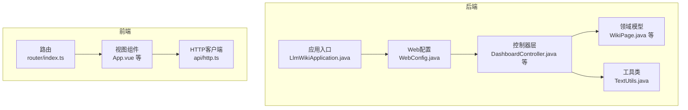
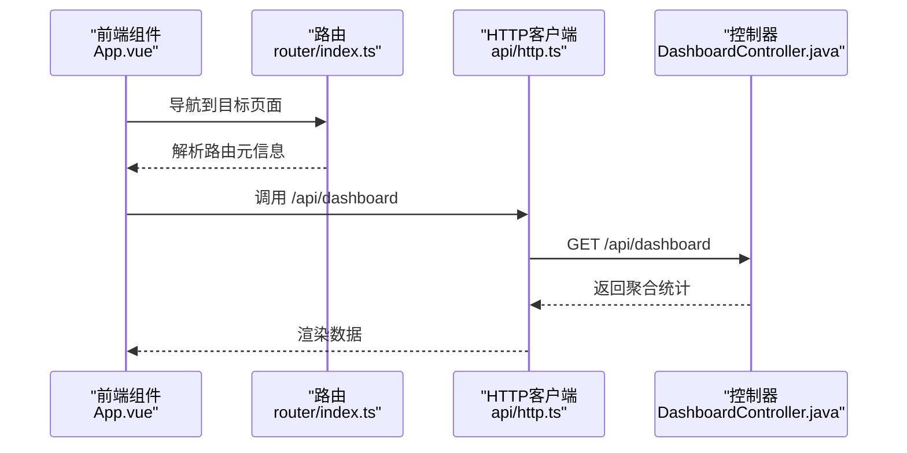
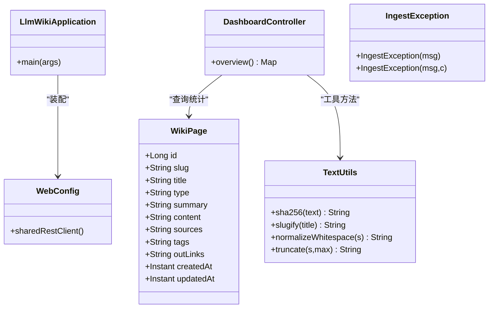
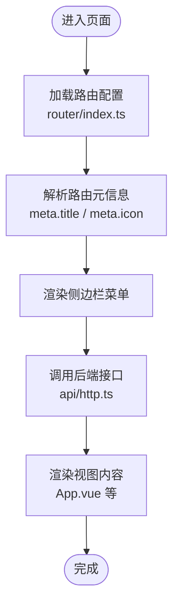
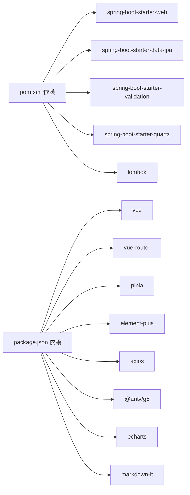

# 代码规范

<cite>
**本文引用的文件**
- [pom.xml](file://pom.xml)
- [application.yml](file://src/main/resources/application.yml)
- [package.json](file://web/package.json)
- [tsconfig.json](file://web/tsconfig.json)
- [vite.config.ts](file://web/vite.config.ts)
- [.gitignore](file://.gitignore)
- [LlmWikiApplication.java](file://src/main/java/com/example/llmwiki/LlmWikiApplication.java)
- [WebConfig.java](file://src/main/java/com/example/llmwiki/config/WebConfig.java)
- [WikiPage.java](file://src/main/java/com/example/llmwiki/domain/WikiPage.java)
- [DashboardController.java](file://src/main/java/com/example/llmwiki/api/DashboardController.java)
- [TextUtils.java](file://src/main/java/com/example/llmwiki/util/TextUtils.java)
- [IngestException.java](file://src/main/java/com/example/llmwiki/ingest/IngestException.java)
- [App.vue](file://web/src/App.vue)
- [index.ts（路由）](file://web/src/router/index.ts)
- [http.ts（API）](file://web/src/api/http.ts)
</cite>

## 目录
1. 引言
2. 项目结构
3. 核心组件
4. 架构总览
5. 详细组件分析
6. 依赖分析
7. 性能考虑
8. 故障排查指南
9. 结论
10. 附录

## 引言
本文件为 LLM Wiki 项目的代码规范文档，覆盖 Java 后端与 Vue 前端的编码规范、文件命名约定、格式化配置、注释规范以及安全编码实践。内容基于仓库现有实现进行提炼与扩展，旨在统一团队开发风格、提升可读性与可维护性。

## 项目结构
- 后端采用 Spring Boot 3.3.5（JDK 17），核心模块按功能域划分：api、config、domain、eval、graph、ingest、insight、llm、parser、progress、queue、repository、retrieval、scheduler、util 等。
- 前端采用 Vue 3 + Vite + TypeScript，使用 Element Plus、Pinia、Vue Router、Axios、ECharts、AntV G6 等生态组件。
- 配置集中在 application.yml，前端通过 vite.config.ts 进行代理与别名配置，tsconfig.json 控制编译选项。

图表来源
- [LlmWikiApplication.java:1-29](file://src/main/java/com/example/llmwiki/LlmWikiApplication.java#L1-L29)
- [WebConfig.java:1-35](file://src/main/java/com/example/llmwiki/config/WebConfig.java#L1-L35)
- [DashboardController.java:1-48](file://src/main/java/com/example/llmwiki/api/DashboardController.java#L1-L48)
- [WikiPage.java:1-72](file://src/main/java/com/example/llmwiki/domain/WikiPage.java#L1-L72)
- [TextUtils.java:1-80](file://src/main/java/com/example/llmwiki/util/TextUtils.java#L1-L80)
- [index.ts（路由）:1-22](file://web/src/router/index.ts#L1-L22)
- [http.ts（API）:1-17](file://web/src/api/http.ts#L1-L17)
- [App.vue:1-38](file://web/src/App.vue#L1-L38)

章节来源
- [pom.xml:1-171](file://pom.xml#L1-L171)
- [application.yml:1-84](file://src/main/resources/application.yml#L1-L84)
- [package.json:1-31](file://web/package.json#L1-L31)
- [tsconfig.json:1-21](file://web/tsconfig.json#L1-L21)
- [vite.config.ts:1-23](file://web/vite.config.ts#L1-L23)
- [.gitignore:1-34](file://.gitignore#L1-L34)

## 核心组件
- 应用入口与开关：启用异步与调度能力，集中管理启动流程。
- Web 配置：统一跨域策略与共享 RestClient Bean，便于外部调用复用。
- 控制器：以功能域划分，统一前缀 /api/{module}，返回聚合统计或业务结果。
- 领域模型：使用 Lombok 简化 POJO，配合 JPA 注解定义表结构与约束。
- 工具类：提供通用字符串处理、哈希计算等方法，避免重复逻辑。
- 前端路由与 API：统一前缀 /api，路由元信息承载菜单标题与图标，HTTP 客户端统一拦截错误日志。

章节来源
- [LlmWikiApplication.java:1-29](file://src/main/java/com/example/llmwiki/LlmWikiApplication.java#L1-L29)
- [WebConfig.java:1-35](file://src/main/java/com/example/llmwiki/config/WebConfig.java#L1-L35)
- [DashboardController.java:1-48](file://src/main/java/com/example/llmwiki/api/DashboardController.java#L1-L48)
- [WikiPage.java:1-72](file://src/main/java/com/example/llmwiki/domain/WikiPage.java#L1-L72)
- [TextUtils.java:1-80](file://src/main/java/com/example/llmwiki/util/TextUtils.java#L1-L80)
- [index.ts（路由）:1-22](file://web/src/router/index.ts#L1-L22)
- [http.ts（API）:1-17](file://web/src/api/http.ts#L1-L17)

## 架构总览
后端通过 Spring MVC 提供 REST 接口，前端通过 Axios 发起请求并经由 Vite 代理转发至后端。WebConfig 统一跨域，Vite 配置将 /api 前缀代理到本地后端服务。

图表来源
- [App.vue:1-38](file://web/src/App.vue#L1-L38)
- [index.ts（路由）:1-22](file://web/src/router/index.ts#L1-L22)
- [http.ts（API）:1-17](file://web/src/api/http.ts#L1-L17)
- [DashboardController.java:1-48](file://src/main/java/com/example/llmwiki/api/DashboardController.java#L1-L48)

## 详细组件分析

### Java 编码规范与最佳实践
- Spring Boot 最佳实践
  - 使用 @SpringBootApplication 启动，结合 @EnableAsync、@EnableScheduling 开启异步与定时任务。
  - 统一在 config 包下集中管理 Web 配置（如跨域、RestClient Bean）。
  - 控制器层统一前缀 /api/{module}，返回聚合数据便于前端首屏渲染。
- Lombok 使用规范
  - 在实体类上使用 @Data、@Builder、@NoArgsConstructor、@AllArgsConstructor 简化构造与访问器。
  - 避免在复杂业务类上滥用 Lombok，保持可读性与可测试性。
- 注解使用标准
  - 实体类使用 JPA 注解标注主键、列名、长度与约束；字段使用 @Lob 处理大文本。
  - 控制器使用 @RestController、@RequestMapping、@GetMapping 等。
- 异常处理规范
  - 自定义运行时异常 IngestException，封装业务异常消息与原因，便于上层捕获与统一处理。
  - 工具类 TextUtils 中对不可预期算法异常抛出 IllegalStateException，保证异常语义清晰。

图表来源
- [LlmWikiApplication.java:1-29](file://src/main/java/com/example/llmwiki/LlmWikiApplication.java#L1-L29)
- [WebConfig.java:1-35](file://src/main/java/com/example/llmwiki/config/WebConfig.java#L1-L35)
- [DashboardController.java:1-48](file://src/main/java/com/example/llmwiki/api/DashboardController.java#L1-L48)
- [WikiPage.java:1-72](file://src/main/java/com/example/llmwiki/domain/WikiPage.java#L1-L72)
- [TextUtils.java:1-80](file://src/main/java/com/example/llmwiki/util/TextUtils.java#L1-L80)
- [IngestException.java:1-18](file://src/main/java/com/example/llmwiki/ingest/IngestException.java#L1-L18)

章节来源
- [LlmWikiApplication.java:1-29](file://src/main/java/com/example/llmwiki/LlmWikiApplication.java#L1-L29)
- [WebConfig.java:1-35](file://src/main/java/com/example/llmwiki/config/WebConfig.java#L1-L35)
- [DashboardController.java:1-48](file://src/main/java/com/example/llmwiki/api/DashboardController.java#L1-L48)
- [WikiPage.java:1-72](file://src/main/java/com/example/llmwiki/domain/WikiPage.java#L1-L72)
- [TextUtils.java:1-80](file://src/main/java/com/example/llmwiki/util/TextUtils.java#L1-L80)
- [IngestException.java:1-18](file://src/main/java/com/example/llmwiki/ingest/IngestException.java#L1-L18)

### Vue 组件规范与 TypeScript + Composition API
- TypeScript + Composition API 使用指南
  - 使用 <script setup lang="ts"> 简化组件声明与导入，配合 computed、ref、watch 等组合式 API。
  - 路由使用 Vue Router，路由元信息 meta 字段承载标题与图标，便于侧边栏渲染。
- 组件命名约定
  - 视图组件采用帕斯卡命名（如 Dashboard.vue），与路由 name 对应。
  - 通用布局组件采用语义化命名（如 App.vue）。
- Props 与事件规范
  - 当前项目未见显式 Props 定义，建议在子组件中明确 props 类型与默认值，并通过 emits 明确触发事件。
- 样式组织原则
  - 全局样式位于 styles/main.css，组件内样式尽量局部化，避免全局污染。
- 文件命名约定
  - Vue 组件文件：Views/*.vue（视图）、Layout/*.vue（布局）、Components/*.vue（通用组件）。
  - 路由文件：router/index.ts，API 封装：api/http.ts、api/index.ts。
  - 资源文件：assets 下放置静态资源，views 下按功能域组织页面。

图表来源
- [index.ts（路由）:1-22](file://web/src/router/index.ts#L1-L22)
- [http.ts（API）:1-17](file://web/src/api/http.ts#L1-L17)
- [App.vue:1-38](file://web/src/App.vue#L1-L38)

章节来源
- [App.vue:1-38](file://web/src/App.vue#L1-L38)
- [index.ts（路由）:1-22](file://web/src/router/index.ts#L1-L22)
- [http.ts（API）:1-17](file://web/src/api/http.ts#L1-L17)

### 文件命名约定
- Java 类命名
  - 遵循帕斯卡命名法，如 DashboardController、WikiPage、TextUtils。
  - 包结构按功能域组织，如 api、config、domain、util。
- 包结构组织
  - 核心模块：api、config、domain、util；业务模块：ingest、parser、retrieval、graph、insight、eval、scheduler、queue、progress。
- Vue 组件文件命名
  - Views/*.vue（视图）、Layout/*.vue（布局）、Components/*.vue（通用组件）。
  - 路由文件 router/index.ts，API 封装 api/http.ts、api/index.ts。
- 资源文件分类
  - 样式：styles/main.css
  - 静态资源：assets/*
  - Prompts：prompts/*.md

章节来源
- [DashboardController.java:1-48](file://src/main/java/com/example/llmwiki/api/DashboardController.java#L1-L48)
- [WikiPage.java:1-72](file://src/main/java/com/example/llmwiki/domain/WikiPage.java#L1-L72)
- [App.vue:1-38](file://web/src/App.vue#L1-L38)
- [index.ts（路由）:1-22](file://web/src/router/index.ts#L1-L22)
- [http.ts（API）:1-17](file://web/src/api/http.ts#L1-L17)

### 代码格式化配置
- Maven 与 Spring Boot 版本
  - 使用 spring-boot-starter-parent 3.3.5，JDK 17。
- 前端构建与类型检查
  - Vite + Vue + TypeScript，使用 vue-tsc 进行类型检查。
  - tsconfig.json 设置模块解析为 Bundler，开启 skipLibCheck、isolatedModules 等。
- IDE 与 EditorConfig 建议
  - IDEA：启用 Annotation Processing，勾选 Lombok 插件；配置代码风格为 GoogleStyle 或 SunStyle（团队自选）。
  - EditorConfig：统一缩进、换行符、字符集。
- 代码检查规则
  - 后端：SonarQube/SpotBugs/Checkstyle（团队自选），建议开启空值检查、循环与分支覆盖率。
  - 前端：ESLint + Prettier，统一 import 顺序、函数声明风格、无用变量检测。

章节来源
- [pom.xml:1-171](file://pom.xml#L1-L171)
- [tsconfig.json:1-21](file://web/tsconfig.json#L1-L21)
- [vite.config.ts:1-23](file://web/vite.config.ts#L1-L23)

### 注释规范
- JavaDoc 标准
  - 类与公共方法需提供简要描述、参数说明、返回值说明与异常说明；内部类与私有方法可简化。
  - 参考现有类注释风格（如 LlmWikiApplication、WebConfig、WikiPage、TextUtils）。
- TypeScript 注释
  - 函数与接口使用 JSDoc 风格注释，明确参数类型、返回值与异常场景。
- 复杂逻辑说明
  - 对正则表达式、哈希计算、slug 生成等复杂逻辑添加行内注释与小结。
- API 文档编写
  - 控制器方法注释中明确请求路径、方法、参数与响应结构，便于 Swagger/OpenAPI 生成。

章节来源
- [LlmWikiApplication.java:1-29](file://src/main/java/com/example/llmwiki/LlmWikiApplication.java#L1-L29)
- [WebConfig.java:1-35](file://src/main/java/com/example/llmwiki/config/WebConfig.java#L1-L35)
- [WikiPage.java:1-72](file://src/main/java/com/example/llmwiki/domain/WikiPage.java#L1-L72)
- [TextUtils.java:1-80](file://src/main/java/com/example/llmwiki/util/TextUtils.java#L1-L80)

### 安全编码实践
- SQL 注入防护
  - 使用 JPA/Hibernate 查询（如 Repository 方法）而非原生 SQL；避免动态拼接 SQL。
  - 字段长度与唯一性约束（如 slug 唯一）降低异常输入风险。
- XSS 防护
  - 前端渲染时避免 innerHTML 直接注入；对用户输入进行白名单过滤或富文本编辑器限制。
  - 后端输出 JSON 时确保字符集正确，避免特殊字符逃逸。
- 输入验证
  - 使用 Spring Validation（已引入 starter-validation）在控制器层校验请求参数。
  - 对文件上传大小（multipart）进行限制（已在 application.yml 配置）。
- 敏感信息处理
  - 配置文件中避免硬编码密钥；使用环境变量或配置中心；日志中避免打印敏感字段。
  - 前端避免将令牌明文存储在本地持久化存储中；使用 HttpOnly Cookie 或短期令牌。

章节来源
- [application.yml:1-84](file://src/main/resources/application.yml#L1-L84)
- [WikiPage.java:1-72](file://src/main/java/com/example/llmwiki/domain/WikiPage.java#L1-L72)

## 依赖分析
- 后端依赖
  - Web、JPA、Validation、Quartz、H2、Lucene、Tika、Jsoup、JGraphT、Jackson YAML/CSV、Lombok。
- 前端依赖
  - Vue 3、Vue Router、Pinia、Element Plus、Axios、ECharts、AntV G6、markdown-it。

图表来源
- [pom.xml:1-171](file://pom.xml#L1-L171)
- [package.json:1-31](file://web/package.json#L1-L31)

章节来源
- [pom.xml:1-171](file://pom.xml#L1-L171)
- [package.json:1-31](file://web/package.json#L1-L31)

## 性能考虑
- 数据访问
  - 使用 Repository 进行批量查询与分页；避免 N+1 查询；必要时使用原生 SQL 或投影优化。
- 异步与定时
  - 对耗时任务使用 @Async；定时任务使用 Quartz，合理设置线程池与并发度。
- 前端性能
  - 路由懒加载；组件按需加载；图表组件延迟初始化；减少不必要的响应式依赖。
- 缓存与索引
  - 对热点数据使用缓存；全文检索使用 Lucene；图谱节点与边数量控制。

## 故障排查指南
- 启动与连接
  - 端口占用：修改 application.yml server.port 与 vite.config.ts server.port。
  - 数据库：确认 H2 控制台路径与凭据；检查 DDL 自动更新策略。
- 跨域问题
  - WebConfig 中 CORS 配置允许来源与方法，确保前端代理 /api 生效。
- 前端接口
  - 检查 vite.config.ts 代理是否指向后端地址；确认 baseURL 与超时设置。
- 日志级别
  - application.yml 中调整 com.example.llmwiki 日志级别以便定位问题。

章节来源
- [application.yml:1-84](file://src/main/resources/application.yml#L1-L84)
- [WebConfig.java:1-35](file://src/main/java/com/example/llmwiki/config/WebConfig.java#L1-L35)
- [vite.config.ts:1-23](file://web/vite.config.ts#L1-L23)

## 结论
本规范在现有代码基础上总结了 Java 与 Vue 的编码风格、命名约定、格式化与注释要求，并补充了安全实践与故障排查建议。建议团队在评审与日常开发中严格执行，持续优化以提升整体质量与协作效率。

## 附录
- 版本与工具
  - Spring Boot 3.3.5、JDK 17、Vue 3、Vite、TypeScript、Lombok。
- 开发环境
  - IDEA + Lombok 插件；EditorConfig；前端使用 Vite 代理与别名配置。