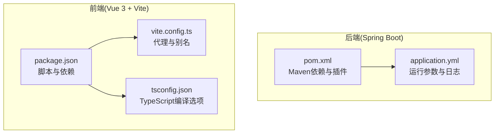
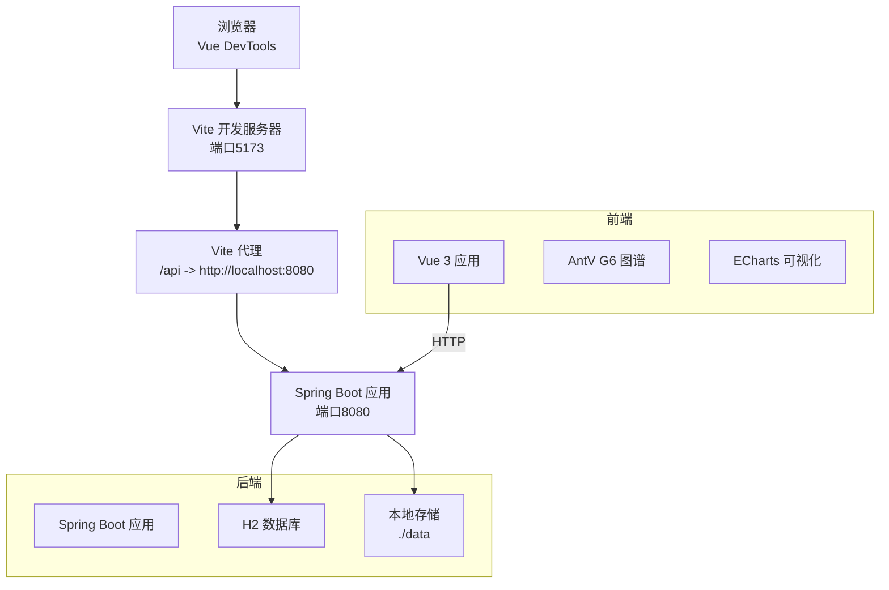
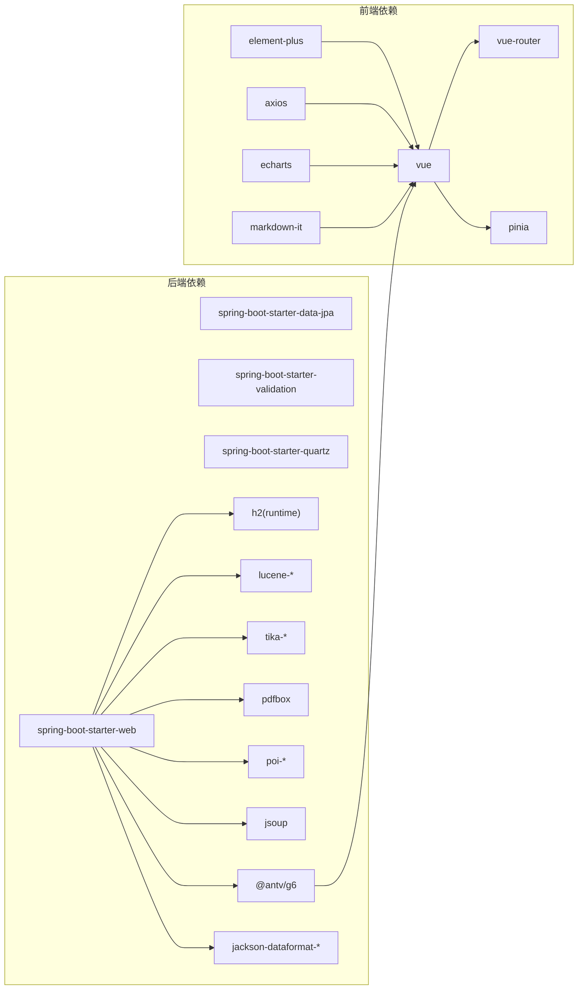

# 开发工具配置

<cite>
**本文引用的文件**
- [pom.xml](file://pom.xml)
- [.mvn/wrapper/maven-wrapper.properties](file://.mvn/wrapper/maven-wrapper.properties)
- [web/package.json](file://web/package.json)
- [web/vite.config.ts](file://web/vite.config.ts)
- [web/tsconfig.json](file://web/tsconfig.json)
- [src/main/resources/application.yml](file://src/main/resources/application.yml)
- [.gitignore](file://.gitignore)
</cite>

## 目录
1. [简介](#简介)
2. [项目结构](#项目结构)
3. [核心组件](#核心组件)
4. [架构总览](#架构总览)
5. [详细组件分析](#详细组件分析)
6. [依赖分析](#依赖分析)
7. [性能考虑](#性能考虑)
8. [故障排查指南](#故障排查指南)
9. [结论](#结论)
10. [附录](#附录)

## 简介
本文件面向LLM Wiki项目的开发团队，提供从IDE到构建、调试、版本控制与性能分析的完整工具配置指南。内容覆盖：
- IDE设置：IntelliJ IDEA配置要点、Vue项目配置、插件推荐、代码模板建议
- 构建工具：Maven插件配置、Vite构建配置、TypeScript编译选项、ESLint配置现状与建议
- 调试配置：Spring Boot调试设置、Vue DevTools使用、断点调试技巧、远程调试配置
- 版本控制：Git配置优化、GitHub Desktop设置、分支管理与冲突解决工具
- 性能分析：JVM性能分析、前端性能监控、内存泄漏检测、CPU使用率分析
- 持续集成：CI/CD流水线设置、自动化测试、代码覆盖率统计、部署自动化

## 项目结构
该项目采用前后端分离架构：
- 后端：Spring Boot Maven工程，位于仓库根目录
- 前端：Vue 3 + Vite 工程，位于 web 子目录
- 配置：后端使用application.yml；前端使用package.json、vite.config.ts、tsconfig.json

**图表来源**
- [pom.xml:1-171](file://pom.xml#L1-L171)
- [src/main/resources/application.yml:1-84](file://src/main/resources/application.yml#L1-L84)
- [web/package.json:1-31](file://web/package.json#L1-L31)
- [web/vite.config.ts:1-23](file://web/vite.config.ts#L1-L23)
- [web/tsconfig.json:1-21](file://web/tsconfig.json#L1-L21)

**章节来源**
- [pom.xml:1-171](file://pom.xml#L1-L171)
- [web/package.json:1-31](file://web/package.json#L1-L31)
- [web/vite.config.ts:1-23](file://web/vite.config.ts#L1-L23)
- [web/tsconfig.json:1-21](file://web/tsconfig.json#L1-L21)
- [src/main/resources/application.yml:1-84](file://src/main/resources/application.yml#L1-L84)

## 核心组件
- 后端运行端口与数据库：后端服务默认监听8080端口，使用H2嵌入式数据库，开启H2 Console以便本地调试。
- 文件上传限制：单文件最大100MB，请求总大小200MB，满足知识库导入场景。
- 存储路径：raw、wiki、index、graph等数据目录位于项目根目录下的data子目录。
- LLM配置：OpenAI相关基础URL、模型、温度、超时时间等参数可按需配置。
- 日志级别：根日志级别INFO，项目包com.example.llmwiki设为DEBUG，第三方库PDFBox与POI设为WARN。

**章节来源**
- [src/main/resources/application.yml:1-84](file://src/main/resources/application.yml#L1-L84)

## 架构总览
下图展示前后端交互与开发时的代理关系：

**图表来源**
- [web/vite.config.ts:13-21](file://web/vite.config.ts#L13-L21)
- [src/main/resources/application.yml:1-30](file://src/main/resources/application.yml#L1-L30)

## 详细组件分析

### IDE设置（IntelliJ IDEA）
- 项目导入
  - 使用Maven导入根目录的pom.xml，确保选择正确的JDK 17。
  - 导入web子目录为独立的JavaScript/TypeScript模块（或直接在IDE中打开整个项目）。
- 运行配置
  - 新建“Spring Boot”运行配置，主类选择LlmWikiApplication所在包。
  - VM选项建议：根据实际需要添加JVM调优参数（如堆大小、GC策略），便于性能分析。
- 代码风格与模板
  - Java：启用Lombok支持，配置getter/setter/toString等注解处理器。
  - TypeScript/Vue：启用Vue文件支持与TypeScript自动补全。
- 插件推荐
  - Lombok、MyBatis Log、Rainbow Brackets、String Manipulation、Statistic、Key Promoter X
  - Vue.js、Vetur 或 Volar（若使用Vue 3，优先Volar）
  - TypeScript Importer、Auto Import、Path Intellisense
- 代码模板
  - Java：为常用注解（如@RestController、@Service、@Repository）配置Live Template。
  - TypeScript：为常用Vue组件、路由、API封装等配置Live Template。

[本节为通用IDE配置建议，不直接分析具体文件，故无章节来源]

### Vue项目配置
- 脚本命令
  - dev：启动Vite开发服务器
  - build：打包生产资源
  - preview：预览打包结果（默认端口5174）
- 依赖与版本
  - Vue 3、Vue Router、Pinia、Element Plus、Axios、ECharts、AntV G6、markdown-it
  - 开发依赖：Vite、Vue 3插件、TypeScript、类型检查工具、自动导入与组件解析插件
- 别名与代理
  - 路径别名@指向src目录
  - 本地代理将/api前缀转发至后端8080端口，便于开发联调

**章节来源**
- [web/package.json:7-11](file://web/package.json#L7-L11)
- [web/package.json:12-29](file://web/package.json#L12-L29)
- [web/vite.config.ts:8-21](file://web/vite.config.ts#L8-L21)

### TypeScript编译选项
- 目标与模块：ES2022、ESNext、Bundler
- 严格性：关闭严格模式，保留JSX preserve
- 类型与库：启用DOM与DOM.Iterable，引入Node类型
- 路径映射：与Vite别名保持一致，@/*映射到src/*
- 其他：允许ES模块互操作、跳过库检查、隔离模块、JSON解析等

**章节来源**
- [web/tsconfig.json:2-18](file://web/tsconfig.json#L2-L18)

### ESLint配置现状与建议
- 现状
  - 当前仓库未发现ESLint配置文件（.eslintrc.*或eslint.config.*），TypeScript类型检查由vue-tsc承担。
- 建议
  - 在web目录新增ESLint配置，结合TypeScript与Vue规则集，统一代码风格。
  - 集成pre-commit钩子，保证提交前进行静态检查。

**章节来源**
- [web/package.json:22-29](file://web/package.json#L22-L29)

### 构建工具配置（Maven）
- 父POM与Spring Boot版本
  - 使用Spring Boot Starter Parent 3.3.5，确保依赖版本与构建插件一致性。
- JDK与第三方库
  - Java版本17；Lucene、PDFBox、POI、Tika、Jsoup、JGraphT、Jackson等按需启用。
- 插件
  - spring-boot-maven-plugin用于打包可执行JAR
  - Maven Wrapper版本3.3.4，分发类型仅含脚本，便于跨平台构建

**章节来源**
- [pom.xml:5-10](file://pom.xml#L5-L10)
- [pom.xml:29-35](file://pom.xml#L29-L35)
- [pom.xml:161-168](file://pom.xml#L161-L168)
- [.mvn/wrapper/maven-wrapper.properties:1-4](file://.mvn/wrapper/maven-wrapper.properties#L1-L4)

### 调试配置
- Spring Boot调试
  - 在IDE中以Debug模式启动应用，设置断点于控制器层（如DashboardController、WikiController等）。
  - 使用H2 Console路径访问数据库控制台，便于查看表结构与数据。
- Vue DevTools使用
  - 在浏览器中安装Vue DevTools，观察组件树、状态（Pinia）、路由与网络请求。
- 断点调试技巧
  - 后端：在API入口处设置断点，检查请求参数与响应结构；在业务方法（如GraphService、IngestPipeline）中设置断点验证流程。
  - 前端：在API封装（http.ts）与页面组件（如Dashboard.vue、Wiki.vue）中设置断点，观察数据流向。
- 远程调试配置
  - 在IDE的运行配置中添加远程调试参数（如JVM远程调试端口），在容器或远端服务器上以Debug模式启动应用，IDE通过Socket连接进行远程调试。

**章节来源**
- [src/main/resources/application.yml:16-29](file://src/main/resources/application.yml#L16-L29)
- [web/vite.config.ts:13-21](file://web/vite.config.ts#L13-L21)

### 版本控制工具
- Git配置优化
  - 推荐设置：忽略构建产物与IDE临时文件；使用符号链接支持长路径；启用大文件警告。
  - 仓库已包含.gitignore，涵盖Maven、IDE（IntelliJ IDEA、VS Code、NetBeans）与STS相关文件。
- GitHub Desktop设置
  - 建议启用自动清理已删除分支、合并策略（squash/merge/rebase）与提交模板。
- 分支管理工具
  - 使用Git Flow或GitHub Flow，主分支保护、PR审查与CI强制检查。
- 冲突解决工具
  - 使用内置diff工具或第三方图形化工具（如Beyond Compare、Meld）辅助解决复杂冲突。

**章节来源**
- [.gitignore:16-34](file://.gitignore#L16-L34)

### 性能分析工具
- JVM性能分析
  - 使用JProfiler、VisualVM或Java自带的JFR进行CPU与内存分析；在IDE中配置JVM参数以启用分析器。
- 前端性能监控
  - 使用Chrome DevTools Performance面板分析渲染与脚本执行；结合Vue DevTools观察组件重渲染。
- 内存泄漏检测
  - 使用Heap Snapshot对比与WeakRef辅助定位；关注事件监听器与定时器是否正确清理。
- CPU使用率分析
  - 结合系统监控工具（如Windows任务管理器、Linux top/htop）与JVM分析器，识别热点方法。

[本节为通用性能分析建议，不直接分析具体文件，故无章节来源]

### 持续集成配置
- CI/CD流水线设置
  - 建议在GitHub Actions中定义多阶段流水线：拉取代码 → 安装JDK与Node → Maven构建后端 → Vite构建前端 → 单元测试 → 打包镜像/制品。
- 自动化测试配置
  - 后端：JUnit + Spring Boot Test；前端：Vitest/Jest + Vue Test Utils。
- 代码覆盖率统计
  - 后端：JaCoCo插件；前端：Istanbul/NYC或c8；在CI中生成报告并上传至覆盖率平台。
- 部署自动化
  - 将后端可执行JAR与前端静态资源部署至容器或云平台；使用环境变量覆盖application.yml中的敏感配置。

[本节为通用CI/CD建议，不直接分析具体文件，故无章节来源]

## 依赖分析
- 后端依赖关系
  - Spring Web、Data JPA、Validation、Quartz负责Web接口、持久化、校验与调度。
  - H2运行时数据库、Lucene全文检索、JGraphT图算法、Tika/PDFBox/POI文件解析、Jsoup网页抓取。
- 前端依赖关系
  - Vue 3生态（Router、Pinia）与UI库（Element Plus）、可视化（AntV G6、ECharts）、Markdown解析（markdown-it）、HTTP客户端（Axios）。
- 构建与开发工具
  - Vite提供快速开发体验；TypeScript与vue-tsc保障类型安全；unplugin系列提升开发效率。

**图表来源**
- [pom.xml:36-159](file://pom.xml#L36-L159)
- [web/package.json:12-29](file://web/package.json#L12-L29)

**章节来源**
- [pom.xml:36-159](file://pom.xml#L36-L159)
- [web/package.json:12-29](file://web/package.json#L12-L29)

## 性能考虑
- 后端
  - Quartz线程池数量较小（2），适合开发环境；生产环境应根据任务负载调整。
  - Lucene索引与图谱计算可能占用较多内存，建议在IDE中配置JVM堆大小与GC参数。
- 前端
  - 大型图谱与可视化组件需注意渲染性能，建议分页加载与懒加载策略。
  - Axios请求与API封装应统一错误处理与超时控制，避免阻塞主线程。

**章节来源**
- [src/main/resources/application.yml:26-30](file://src/main/resources/application.yml#L26-L30)

## 故障排查指南
- 启动失败
  - 检查JDK版本与Maven Wrapper配置，确保使用JDK 17。
  - 确认端口占用：后端8080、前端5173/5174。
- 数据库问题
  - 访问H2 Console路径确认数据库连接与表结构。
- 文件解析异常
  - 检查Tika、PDFBox、POI版本与目标文件格式兼容性。
- 前端无法访问后端接口
  - 确认Vite代理配置与后端实际端口一致。

**章节来源**
- [.mvn/wrapper/maven-wrapper.properties:1-4](file://.mvn/wrapper/maven-wrapper.properties#L1-L4)
- [src/main/resources/application.yml:16-29](file://src/main/resources/application.yml#L16-L29)
- [web/vite.config.ts:13-21](file://web/vite.config.ts#L13-L21)

## 结论
本配置文档基于现有仓库配置，提供了从IDE到构建、调试、版本控制与性能分析的完整实践建议。建议团队在现有基础上补充ESLint规则、CI/CD流水线与覆盖率统计，并根据生产环境需求调整JVM与前端性能参数。

## 附录
- 快速启动步骤
  - 后端：使用Maven Wrapper执行构建与启动
  - 前端：安装依赖后启动开发服务器
- 常用端口
  - 后端：8080
  - 前端：5173（开发）、5174（预览）

[本节为通用附录信息，不直接分析具体文件，故无章节来源]