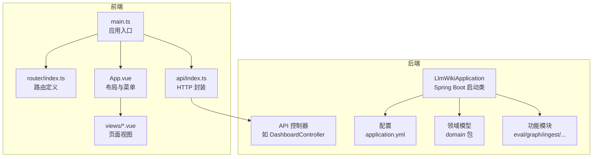
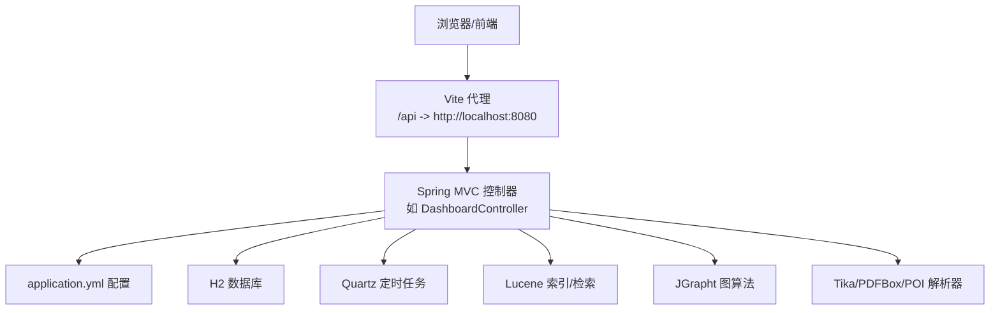
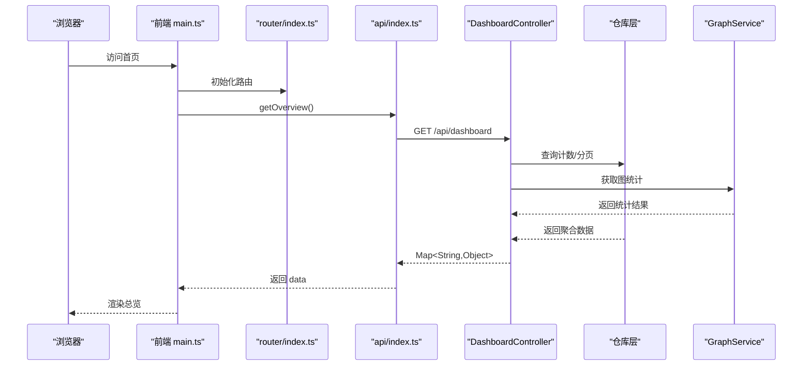
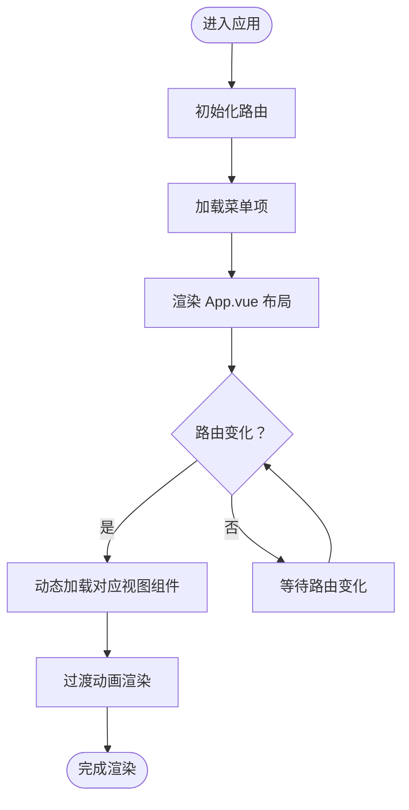
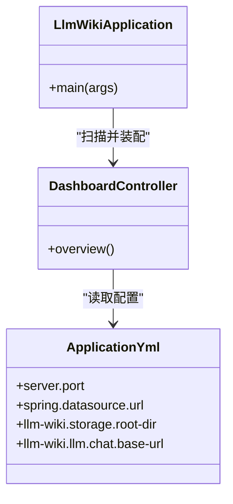
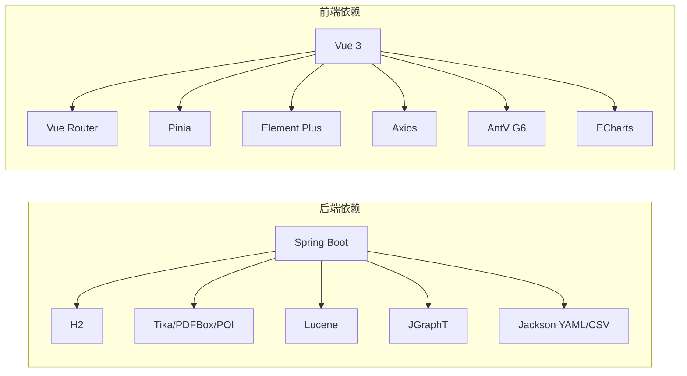

# 开发指南

<cite>
**本文引用的文件**
- [pom.xml](file://pom.xml)
- [application.yml](file://src/main/resources/application.yml)
- [LlmWikiApplication.java](file://src/main/java/com/example/llmwiki/LlmWikiApplication.java)
- [DashboardController.java](file://src/main/java/com/example/llmwiki/api/DashboardController.java)
- [package.json](file://web/package.json)
- [vite.config.ts](file://web/vite.config.ts)
- [main.ts](file://web/src/main.ts)
- [App.vue](file://web/src/App.vue)
- [router/index.ts](file://web/src/router/index.ts)
- [api/index.ts](file://web/src/api/index.ts)
- [.gitignore](file://.gitignore)
- [maven-wrapper.properties](file://.mvn/wrapper/maven-wrapper.properties)
</cite>

## 目录
1. [简介](#简介)
2. [项目结构](#项目结构)
3. [核心组件](#核心组件)
4. [架构总览](#架构总览)
5. [详细组件分析](#详细组件分析)
6. [依赖分析](#依赖分析)
7. [性能考虑](#性能考虑)
8. [故障排除指南](#故障排除指南)
9. [版本管理](#版本管理)
10. [结论](#结论)
11. [附录](#附录)

## 简介
本开发指南面向 LLM Wiki 项目的开发者与贡献者，覆盖代码规范、开发流程、扩展开发、项目结构、开发工具配置、贡献指南、最佳实践、故障排除与版本管理等内容。项目采用前后端分离架构：后端基于 Spring Boot 3（Java 17），使用 H2 内嵌数据库与 Quartz 定时任务；前端基于 Vue 3 + TypeScript + Vite，使用 Element Plus、Pinia、Vue Router、Axios 等生态。

## 项目结构
- 后端模块
  - 包名：com.example.llmwiki
  - 主启动类：LlmWikiApplication
  - 控制器层：api 包下按功能划分（Dashboard、Eval、Graph、Insight、ProgressSse、Schedule、Search、Settings、Sources、Wiki）
  - 配置：config 包（WebConfig、各类 Properties）
  - 领域模型：domain 包（AnalysisResult、EvalReport、IngestTask、RawDocument、SourceRecord、WikiPage、WikiPageDraft）
  - 功能子模块：eval、graph、ingest、insight、llm、parser、progress、queue、repository、retrieval、scheduler、util
  - 资源：application.yml（服务端口、数据库、日志、LLM/解析器/调度器/索引/存储等配置）
- 前端模块（web 目录）
  - 构建：Vite + Vue 3 + TypeScript
  - 路由：router/index.ts
  - API 封装：api/index.ts
  - 入口：main.ts（注册 Pinia、Router、Element Plus）
  - 视图：views 下各页面组件
  - 样式：styles/main.css
  - 代理：vite.config.ts（/api 代理到后端 8080）

**图表来源**
- [LlmWikiApplication.java:1-29](file://src/main/java/com/example/llmwiki/LlmWikiApplication.java#L1-L29)
- [DashboardController.java:1-48](file://src/main/java/com/example/llmwiki/api/DashboardController.java#L1-L48)
- [application.yml:1-84](file://src/main/resources/application.yml#L1-L84)
- [main.ts:1-14](file://web/src/main.ts#L1-L14)
- [router/index.ts:1-22](file://web/src/router/index.ts#L1-L22)
- [api/index.ts:1-70](file://web/src/api/index.ts#L1-L70)
- [App.vue:1-38](file://web/src/App.vue#L1-L38)

**章节来源**
- [pom.xml:1-171](file://pom.xml#L1-L171)
- [application.yml:1-84](file://src/main/resources/application.yml#L1-L84)
- [LlmWikiApplication.java:1-29](file://src/main/java/com/example/llmwiki/LlmWikiApplication.java#L1-L29)
- [DashboardController.java:1-48](file://src/main/java/com/example/llmwiki/api/DashboardController.java#L1-L48)
- [main.ts:1-14](file://web/src/main.ts#L1-L14)
- [router/index.ts:1-22](file://web/src/router/index.ts#L1-L22)
- [api/index.ts:1-70](file://web/src/api/index.ts#L1-L70)
- [App.vue:1-38](file://web/src/App.vue#L1-L38)

## 核心组件
- 后端启动与装配
  - 启动类启用异步与定时任务，负责扫描并加载各子模块与配置。
- API 控制器
  - DashboardController 提供总览聚合接口，整合 Wiki、数据源、任务、评测与图谱统计。
- 配置中心
  - application.yml 统一管理服务器端口、数据库连接、H2 控制台、JPA、Quartz、存储根路径、LLM 与解析器参数、OCR、调度器、导入器线程与重试等。
- 前端入口与路由
  - main.ts 注册 Pinia、Router、Element Plus，挂载应用。
  - router/index.ts 定义页面路由与元信息（标题、图标）。
  - api/index.ts 对后端接口进行封装，统一返回 data 字段。
  - App.vue 实现侧边栏菜单与当前标题展示。

**章节来源**
- [LlmWikiApplication.java:1-29](file://src/main/java/com/example/llmwiki/LlmWikiApplication.java#L1-L29)
- [DashboardController.java:1-48](file://src/main/java/com/example/llmwiki/api/DashboardController.java#L1-L48)
- [application.yml:1-84](file://src/main/resources/application.yml#L1-L84)
- [main.ts:1-14](file://web/src/main.ts#L1-L14)
- [router/index.ts:1-22](file://web/src/router/index.ts#L1-L22)
- [api/index.ts:1-70](file://web/src/api/index.ts#L1-L70)
- [App.vue:1-38](file://web/src/App.vue#L1-L38)

## 架构总览
后端通过 Spring MVC 暴露 REST 接口，前端通过 Axios 调用 /api 前缀接口，Vite 代理将请求转发至后端。数据持久化使用 H2 文件数据库，Quartz 用于定时任务，Lucene 用于全文检索与索引，JGrapht 用于图算法，Tika/PDFBox/POI 用于多格式文档解析。

**图表来源**
- [vite.config.ts:1-23](file://web/vite.config.ts#L1-L23)
- [DashboardController.java:1-48](file://src/main/java/com/example/llmwiki/api/DashboardController.java#L1-L48)
- [application.yml:1-84](file://src/main/resources/application.yml#L1-L84)
- [pom.xml:36-159](file://pom.xml#L36-L159)

## 详细组件分析

### 后端控制器与数据流
- DashboardController
  - 聚合统计：Wiki 页面数、数据源数、任务数、评测报告数、图节点/边/孤立点/社区数量，并返回最近任务列表片段。
  - 依赖：WikiPageRepository、SourceRecordRepository、IngestTaskRepository、EvalReportRepository、GraphService。
- API 调用序列（以“获取总览”为例）

**图表来源**
- [main.ts:1-14](file://web/src/main.ts#L1-L14)
- [router/index.ts:1-22](file://web/src/router/index.ts#L1-L22)
- [api/index.ts:1-70](file://web/src/api/index.ts#L1-L70)
- [DashboardController.java:1-48](file://src/main/java/com/example/llmwiki/api/DashboardController.java#L1-L48)

**章节来源**
- [DashboardController.java:1-48](file://src/main/java/com/example/llmwiki/api/DashboardController.java#L1-L48)
- [api/index.ts:1-70](file://web/src/api/index.ts#L1-L70)

### 前端路由与页面渲染
- 路由定义：包含仪表盘、数据源、Wiki、图谱、检索、洞察、定时、评测、设置等页面。
- 布局与菜单：App.vue 渲染侧边栏菜单，根据当前路由高亮显示。
- API 封装：api/index.ts 统一封装 GET/POST/DELETE 请求与表单上传，设置 Content-Type 与超时。

**图表来源**
- [App.vue:1-38](file://web/src/App.vue#L1-L38)
- [router/index.ts:1-22](file://web/src/router/index.ts#L1-L22)

**章节来源**
- [router/index.ts:1-22](file://web/src/router/index.ts#L1-L22)
- [App.vue:1-38](file://web/src/App.vue#L1-L38)
- [api/index.ts:1-70](file://web/src/api/index.ts#L1-L70)

### 依赖注入与模块关系
- Spring Boot 自动装配：启动类启用异步与定时任务，扫描控制器与配置。
- 控制器依赖仓库层与服务层（如 GraphService），仓库层依赖 JPA/H2。
- 前端通过 axios 与后端交互，Vite 代理简化跨域与本地联调。

**图表来源**
- [LlmWikiApplication.java:1-29](file://src/main/java/com/example/llmwiki/LlmWikiApplication.java#L1-L29)
- [DashboardController.java:1-48](file://src/main/java/com/example/llmwiki/api/DashboardController.java#L1-L48)
- [application.yml:1-84](file://src/main/resources/application.yml#L1-L84)

**章节来源**
- [LlmWikiApplication.java:1-29](file://src/main/java/com/example/llmwiki/LlmWikiApplication.java#L1-L29)
- [DashboardController.java:1-48](file://src/main/java/com/example/llmwiki/api/DashboardController.java#L1-L48)
- [application.yml:1-84](file://src/main/resources/application.yml#L1-L84)

## 依赖分析
- 后端依赖
  - Spring Boot Web、Data JPA、Validation、Quartz
  - H2（运行时）
  - PDFBox、POI、Tika（文档解析）
  - Jsoup、Readability4J（网页抓取与正文提取）
  - Lucene（全文检索与索引）
  - JGraphT（图算法）
  - Jackson YAML/CSV（配置与评测）
  - Lombok（注解简化）
- 前端依赖
  - Vue 3、Vue Router、Pinia、Element Plus、Axios、ECharts、AntV G6、markdown-it

**图表来源**
- [pom.xml:36-159](file://pom.xml#L36-L159)
- [package.json:1-31](file://web/package.json#L1-L31)

**章节来源**
- [pom.xml:1-171](file://pom.xml#L1-L171)
- [package.json:1-31](file://web/package.json#L1-L31)

## 性能考虑
- 异步与定时任务
  - 启用异步与 Quartz，避免阻塞主线程；合理配置线程池大小与任务并发度。
- 存储与索引
  - 使用 H2 文件数据库，生产环境建议迁移到外部数据库；Lucene 索引需定期优化与碎片整理。
- 文档解析
  - 大文件解析耗时较长，建议限制上传大小并在业务层做进度上报与取消机制。
- 前端渲染
  - 图谱与检索结果分页加载，避免一次性渲染大量节点；ECharts/G6 使用虚拟滚动或懒加载。
- 日志与监控
  - 调整日志级别，避免在生产开启过细日志；结合 APM 工具定位热点接口。

## 故障排除指南
- 启动失败
  - 检查 Java 版本是否为 17；确认 Maven Wrapper 可用。
- 数据库连接
  - application.yml 中 JDBC URL、驱动、用户名密码正确；H2 控制台路径为 /h2-console。
- 前后端联调
  - Vite 代理 /api 到后端 8080；若跨域异常，检查代理配置与 CORS。
- 文件上传
  - spring.servlet.multipart 的大小限制是否满足需求；前端上传时设置正确的 Content-Type。
- 定时任务
  - Quartz 线程池大小与内存匹配；确认 Cron 表达式与时区。
- 常见排查步骤
  - 查看后端日志级别；使用 H2 控制台验证表结构；前端 Network 面板确认接口状态码与响应体。

**章节来源**
- [.gitignore:1-34](file://.gitignore#L1-L34)
- [maven-wrapper.properties:1-4](file://.mvn/wrapper/maven-wrapper.properties#L1-L4)
- [application.yml:1-84](file://src/main/resources/application.yml#L1-L84)
- [vite.config.ts:1-23](file://web/vite.config.ts#L1-L23)

## 版本管理
- 版本发布流程
  - 在主干分支（如 main）上打标签；生成变更日志；发布制品。
- 变更日志维护
  - 记录新增功能、修复缺陷、破坏性变更与已知问题；遵循语义化版本。
- 向后兼容性
  - 控制器接口保持稳定；新增字段使用默认值；弃用旧接口时提供迁移指引。

## 结论
本指南提供了从项目结构、核心组件、依赖关系到开发流程、扩展开发、性能与故障排除的完整参考。建议在团队内统一代码风格与提交规范，严格执行分支与评审流程，确保系统稳定性与可演进性。

## 附录

### 代码规范与最佳实践

- Java 编码规范（Spring Boot 最佳实践）
  - 命名：包名全小写；类名使用帕斯卡命名；常量全大写；方法与变量使用驼峰。
  - 注释：公共 API 与复杂逻辑添加清晰注释；使用标准 JavaDoc。
  - 分层：控制器仅处理请求与响应；业务逻辑放入服务层；数据访问放入仓库层。
  - 异常：自定义异常类型区分业务异常与系统异常；统一异常处理器返回结构化错误。
  - 配置：将外部化配置集中于 application.yml；敏感信息使用环境变量。
  - 测试：单元测试覆盖关键业务；集成测试覆盖端到端流程。
  - 安全：输入校验与参数过滤；避免明文存储密钥；启用 HTTPS 与最小权限。
  - 性能：缓存热点数据；批量操作减少往返；避免 N+1 查询；索引与查询优化。
  - 设计模式：适配器用于解析器扩展；工厂用于客户端创建；观察者用于进度事件。

- Vue 组件规范（TypeScript + Composition API）
  - 组件：函数式组件优先；使用 <script setup>；Props 明确类型与默认值。
  - 状态：Pinia 管理全局状态；局部状态使用 ref/computed。
  - 生命周期：onMounted/onUnmounted 等钩子中执行副作用；避免在模板中直接调用副作用函数。
  - 路由：meta.title/meta.icon 用于菜单与面包屑；路由懒加载提升首屏性能。
  - API：统一在 api/index.ts 封装；错误处理与重试策略一致化。
  - 样式：按页面拆分样式；避免全局污染；主题变量集中管理。

- Git 提交规范
  - 类型：feat、fix、docs、style、refactor、perf、test、build、ci、chore、revert
  - 格式：type(scope): subject；正文说明动机与影响；footer 关联 Issue。
  - 示例：feat(parser): 支持飞书文档解析；fix(api): 修复任务取消接口空指针。

### 开发流程与协作

- 分支管理策略
  - main：稳定发布分支；hotfix：紧急修复；feature/*：功能开发；release/*：预发布。
- 代码审查流程
  - 提交 PR 前本地测试；PR 描述包含变更内容、影响范围与测试要点；至少一名审查者批准。
- 合并策略
  - Squash 合并保持提交历史整洁；Rebase 保证线性历史；冲突必须在 PR 中解决。

### 扩展开发指南

- 新功能开发流程
  - 需求评审 → 设计接口与实体 → 编写单元/集成测试 → 实现控制器与服务 → 前端对接 API → 文档与回归测试。
- 插件/适配器开发
  - 解析器：实现 SourceParser 接口；注册到 ParserRegistry；在配置中启用；编写解析器单元测试。
- 第三方集成示例
  - LLM：ChatClient/EmbeddingClient/VisionClient；在 application.yml 配置 base-url、api-key、模型与超时。
  - OCR：在配置中启用并指定数据路径与语言；解析器链路中接入 OCR 步骤。
  - 图算法：GraphService 封装 JGraphT；导出/导入图谱 JSON；前端 G6/ECharts 可视化。

### 项目结构说明

- 模块划分原则
  - 按职责拆分：api（接口）、domain（模型）、repository（数据）、service（业务）、util（工具）。
  - 功能域划分：ingest（导入）、retrieval（检索）、graph（图谱）、eval（评测）、insight（洞察）、scheduler（调度）。
- 文件命名约定
  - Java：类名使用名词短语；接口以 I 前缀或抽象类；枚举全大写；常量全大写。
  - Vue：组件文件以 PascalCase.vue；页面路由与视图一一对应。
- 目录组织规范
  - 后端：src/main/java/com/example/llmwiki/{api,config,domain,eval,graph,ingest,...}
  - 前端：web/src/{api,router,views,styles,main.ts,App.vue}

### 开发工具配置

- IDE 设置
  - IntelliJ IDEA/VS Code：启用 Lombok 插件；安装 Vue/TypeScript 插件；配置 EditorConfig 与 Save Actions。
- 插件推荐
  - Java：SpotBugs、Checkstyle、Lombok；Vue：Volar、ESLint。
- 调试配置
  - 后端：JVM 参数设置内存与 GC；断点定位控制器与服务层；使用 H2 控制台查看数据。
  - 前端：Vite DevTools；Vue DevTools；Network 面板检查代理与响应。

### 贡献指南

- Issue 提交规范
  - 标题简洁明确；描述包含环境、复现步骤、期望与实际行为；附加截图或日志。
- Pull Request 流程
  - 关联 Issue；提供测试用例；更新文档；通过 CI 与代码审查。
- 社区参与
  - 遵守行为准则；积极反馈与讨论；贡献文档与翻译。