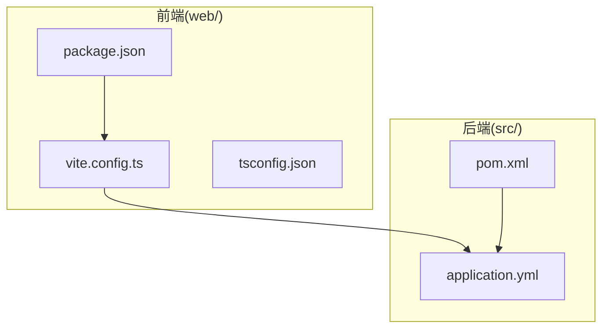
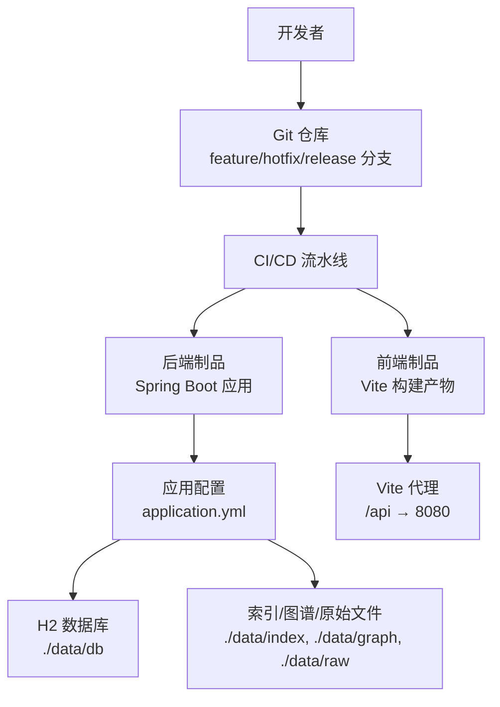
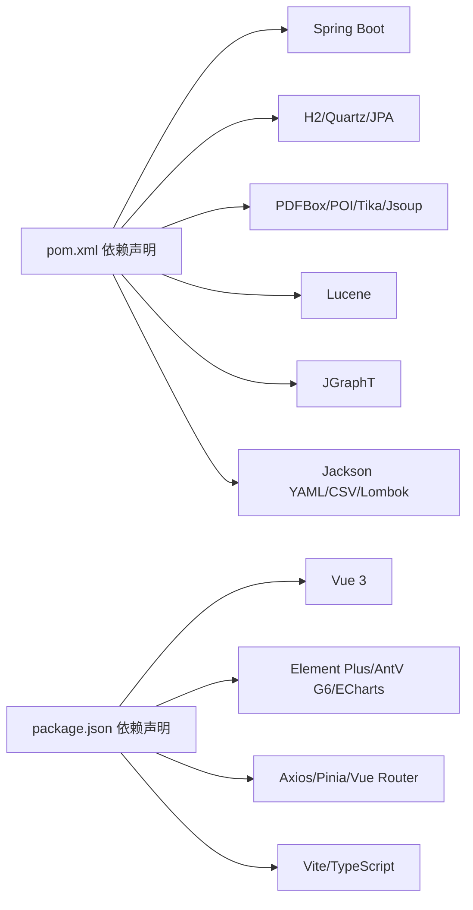

# 开发流程

<cite>
**本文引用的文件**
- [pom.xml](file://pom.xml)
- [.mvn/wrapper/maven-wrapper.properties](file://.mvn/wrapper/maven-wrapper.properties)
- [README.md](file://README.md)
- [application.yml](file://src/main/resources/application.yml)
- [.gitignore](file://.gitignore)
- [web/package.json](file://web/package.json)
- [web/vite.config.ts](file://web/vite.config.ts)
- [web/tsconfig.json](file://web/tsconfig.json)
</cite>

## 目录
1. [简介](#简介)
2. [项目结构](#项目结构)
3. [核心组件](#核心组件)
4. [架构总览](#架构总览)
5. [详细组件分析](#详细组件分析)
6. [依赖分析](#依赖分析)
7. [性能考虑](#性能考虑)
8. [故障排查指南](#故障排查指南)
9. [结论](#结论)
10. [附录](#附录)

## 简介
本文件面向 LLM Wiki 项目的开发团队，提供从分支管理、代码审查、合并策略到日常开发与发布流程的完整实践指南。该指南结合项目现有配置与目录结构，给出可落地的流程建议，帮助团队在保持高质量交付的同时提升协作效率。

## 项目结构
- 后端采用 Spring Boot 3.3.5 + Java 17，Maven 构建，使用 H2 作为嵌入式数据库，Quartz 作为调度框架。
- 前端采用 Vue 3 + Vite + TypeScript，通过代理将 /api 请求转发至后端 8080 端口。
- 配置集中在 application.yml，包含存储路径、LLM 参数、解析器开关、调度与摄取参数等。
- 版本与工具链信息在根 POM 与前端 package.json 中定义。

图表来源
- [pom.xml:1-171](file://pom.xml#L1-L171)
- [application.yml:1-84](file://src/main/resources/application.yml#L1-L84)
- [web/package.json:1-31](file://web/package.json#L1-L31)
- [web/vite.config.ts:1-23](file://web/vite.config.ts#L1-L23)
- [web/tsconfig.json:1-21](file://web/tsconfig.json#L1-L21)

章节来源
- [README.md:77-113](file://README.md#L77-L113)
- [pom.xml:1-171](file://pom.xml#L1-L171)
- [application.yml:1-84](file://src/main/resources/application.yml#L1-L84)
- [web/package.json:1-31](file://web/package.json#L1-L31)
- [web/vite.config.ts:1-23](file://web/vite.config.ts#L1-L23)
- [web/tsconfig.json:1-21](file://web/tsconfig.json#L1-L21)

## 核心组件
- 分支与版本管理
  - 使用 Git Flow 工作流：develop、release-*、hotfix-*、feature-* 分支。
  - 主分支保护：master/main 仅允许通过受控 PR 合并，强制 CI 通过与审查通过。
  - 版本号：后端在 POM 中定义，前端在 package.json 中定义；遵循语义化版本。
- 代码审查
  - PR 模板：包含需求背景、变更点、测试验证、风险评估与回滚预案。
  - 审查清单：编码规范、异常处理、日志记录、安全与性能、兼容性与回归测试。
  - 质量门禁：静态扫描、单元测试覆盖率、集成测试、端到端验证。
- 合并策略
  - 功能分支：rebase 优先，squash 合并至 develop。
  - 发布分支：rebase 至 release-*，最终合并到主分支并打标签。
  - Hotfix：从主分支切出，修复后同时合并回主分支与 develop。
- CI/CD 集成
  - 触发条件：push 到 feature/*、PR 打开/更新、release/* 或 master/main。
  - 步骤：安装 JDK/Node、依赖安装、编译打包、测试、构建镜像/制品、发布制品库或容器镜像。
- 日常开发
  - 环境：JDK 17+、Node.js 18+；后端 8080、前端 5173；H2 数据库存储于 ./data。
  - 提交规范：Conventional Commits；分支命名遵循 feature/xxx、hotfix/xxx、release/xxx。
  - 测试：单元测试 + 集成测试；前端组件与 API 联调；必要时进行端到端测试。
  - 版本标记：按语义化版本打 tag，发布前校验变更日志与兼容性。
- 问题跟踪
  - Issue 模板：缺陷、需求、技术债、运维问题四类；明确复现步骤、期望/实际结果、影响范围。
  - 标签系统：类型（缺陷/需求/技术债/运维）、优先级（P0-P2）、模块（parser/ingest/llm/graph/retrieval/scheduler/eval/progress）。
  - 里程碑：按迭代或版本规划；与 release 分支对齐。
  - Bug 修复：hotfix 分支快速修复，回归测试通过后同步合并至 develop。
- 发布流程
  - 版本号：主版本/次版本/修订版；重大变更升主版本，新增兼容功能升次版本，修复升修订版。
  - 变更日志：记录破坏性变更、新增功能、已修复问题、已知限制。
  - 发布准备：构建产物校验、配置检查、文档更新、回测清单。
  - 回滚策略：基于标签与镜像版本回退；回滚前评估影响面与数据一致性。

章节来源
- [README.md:117-156](file://README.md#L117-L156)
- [application.yml:1-84](file://src/main/resources/application.yml#L1-L84)
- [pom.xml:1-171](file://pom.xml#L1-L171)
- [web/package.json:1-31](file://web/package.json#L1-L31)

## 架构总览
以下图示展示前后端交互与关键配置的关系，便于理解开发与发布流程中的关键节点。

图表来源
- [application.yml:1-84](file://src/main/resources/application.yml#L1-L84)
- [web/vite.config.ts:13-21](file://web/vite.config.ts#L13-L21)
- [pom.xml:161-168](file://pom.xml#L161-L168)

## 详细组件分析

### 分支与版本管理
- Git Flow 工作流
  - develop：集成开发主线，接收功能分支合并。
  - feature/*：新功能开发，完成后 rebase 并 squash 合并至 develop。
  - release/*：预发布分支，进行最终测试与配置校验，合并至主分支并打标签。
  - hotfix/*：紧急修复，从主分支切出，修复后合并回主分支与 develop。
- 主分支保护规则
  - 仅允许 PR 合并；需要至少一名审查者批准。
  - CI 必须通过；代码扫描与测试覆盖率达标。
- 功能分支命名规范
  - feature/user-login、feature/parser-enhancement、feature/docs-update。
- Hotfix 分支处理
  - hotfix/security-patch、hotfix/critical-bug。
  - 修复后同步合并至 develop，确保后续 release 包含修复。

章节来源
- [README.md:117-156](file://README.md#L117-L156)
- [pom.xml:1-171](file://pom.xml#L1-L171)

### 代码审查流程
- Pull Request 模板
  - 背景与目标：简述需求背景、解决的问题、预期收益。
  - 变更范围：列出涉及的模块与文件，说明改动逻辑。
  - 测试验证：单元测试、集成测试、手动验证步骤与结果。
  - 风险评估：潜在风险、兼容性影响、性能影响。
  - 回滚预案：若上线失败如何快速回滚。
- 审查清单
  - 编码规范：命名、注释、异常处理、事务边界。
  - 安全：敏感信息处理、输入校验、权限控制。
  - 性能：复杂度、缓存、I/O、并发。
  - 兼容性：接口变更、配置项、第三方依赖版本。
  - 文档：变更日志、README 更新、API 文档。
- 代码质量标准
  - 单元测试：覆盖关键路径与边界条件。
  - 集成测试：端到端场景与关键业务流程。
  - 静态扫描：SonarLint/SonarQube 规则遵循。
- 审查反馈处理
  - 明确回复与修改计划；必要时重新触发 CI。
  - 争议问题提交技术评审会议决定。

章节来源
- [README.md:216-225](file://README.md#L216-L225)

### 合并策略与冲突解决
- 合并策略
  - feature：rebase develop，squash 合并，减少分支噪音。
  - release：rebase 最终基线，确保线性历史。
  - hotfix：直接合并主分支，随后同步合并至 develop。
- 冲突解决流程
  - rebase 时出现冲突，先在本地解决冲突并通过测试。
  - 提交冲突修复后，再次 rebase，必要时请求审查者二次审查。
- CI/CD 集成
  - PR 打开/更新触发 CI；合并前必须通过所有检查项。

章节来源
- [README.md:117-156](file://README.md#L117-L156)

### 日常开发流程
- 本地环境设置
  - 后端：JDK 17+、Maven Wrapper；启动命令参考 README。
  - 前端：Node.js 18+；安装依赖后启动 dev 服务器。
  - 配置：application.yml 中的端口、数据库、LLM 与调度参数。
- 代码提交规范
  - 使用 Conventional Commits；示例：feat(parser): 新增 PDF 解析支持。
  - 提交信息清晰描述动机与影响。
- 测试执行流程
  - 后端：mvn test；关注关键模块（ingest、parser、graph、retrieval、eval）。
  - 前端：Vitest/Jest（如引入）；组件与 API 联调。
- 版本标记策略
  - 语义化版本：主版本.次版本.修订版；重大变更升主版本。
  - 发布前打 tag，构建产物归档。

章节来源
- [README.md:117-156](file://README.md#L117-L156)
- [application.yml:1-84](file://src/main/resources/application.yml#L1-L84)
- [web/package.json:1-31](file://web/package.json#L1-L31)

### 问题跟踪与变更管理
- Issue 模板
  - 缺陷：复现步骤、期望/实际结果、日志片段、影响范围。
  - 需求：验收标准、优先级、依赖关系、设计草图。
  - 技术债：风险评估、重构方案、时间估算。
  - 运维问题：影响面、临时措施、根因分析。
- 标签系统
  - 类型：bug、enhancement、task、research、operations。
  - 优先级：P0（阻塞性）、P1（高）、P2（一般）。
  - 模块：parser、ingest、llm、graph、retrieval、scheduler、eval、progress。
- 里程碑管理
  - 按迭代或版本划分；与 release 分支对齐。
- Bug 修复流程
  - 创建 hotfix 分支，修复并通过测试。
  - 合并至主分支与 develop，关闭 Issue 并更新变更日志。

章节来源
- [README.md:117-156](file://README.md#L117-L156)

### 发布流程
- 版本号管理
  - 语义化版本；重大变更升主版本，新增兼容功能升次版本，修复升修订版。
- 变更日志维护
  - 记录破坏性变更、新增功能、已修复问题、已知限制。
- 发布准备检查
  - 构建产物校验、配置检查、文档更新、回测清单。
- 回滚策略
  - 基于标签与镜像版本回退；回滚前评估影响面与数据一致性。

章节来源
- [README.md:117-156](file://README.md#L117-L156)

## 依赖分析
- 后端依赖
  - Spring Boot、JPA/H2、Quartz、Apache PDFBox/POI/Tika、Jsoup、Lucene、JGraphT、Jackson YAML/CSV、Lombok。
- 前端依赖
  - Vue 3、Element Plus、AntV G6、ECharts、Axios、Pinia、Vue Router、Vite、TypeScript。
- 构建与工具
  - Maven Wrapper、Spring Boot Maven 插件；Vite 构建与代理。

图表来源
- [pom.xml:36-159](file://pom.xml#L36-L159)
- [web/package.json:12-29](file://web/package.json#L12-L29)

章节来源
- [pom.xml:1-171](file://pom.xml#L1-171)
- [web/package.json:1-31](file://web/package.json#L1-31)

## 性能考虑
- 摄取与索引
  - 摄取线程数与重试次数在配置中可控；根据硬件资源调整 worker-threads 与 max-retry。
  - 索引与图谱构建为 CPU 密集型操作，建议在空闲时段或专用环境执行。
- 检索性能
  - Lucene BM25 与向量混合检索需平衡召回与速度；合理设置分页与 limit。
- 前后端联调
  - Vite 代理简化跨域；生产环境建议通过网关或反向代理统一入口。
- 资源与存储
  - H2 文件数据库适合本地开发；生产建议迁移到关系型数据库。
  - 存储目录（./data）需充足磁盘空间与定期清理策略。

章节来源
- [application.yml:31-77](file://src/main/resources/application.yml#L31-L77)
- [web/vite.config.ts:13-21](file://web/vite.config.ts#L13-L21)

## 故障排查指南
- 常见问题
  - Embedding 维度不匹配：更换模型后删除索引目录并重建。
  - 飞书/钉钉链接 401：启用对应解析器并正确配置 app-id/app-secret。
  - 本地 LLM：将 base-url 指向本地服务，模型名按本地配置。
- 诊断步骤
  - 检查 application.yml 中各模块开关与参数。
  - 查看后端日志级别与 H2 控制台。
  - 前端通过 /api 代理访问后端接口，确认跨域与路由。
- 回滚与恢复
  - 基于标签回退镜像或制品；回滚后验证数据库与索引状态。

章节来源
- [README.md:228-249](file://README.md#L228-L249)
- [application.yml:1-84](file://src/main/resources/application.yml#L1-L84)

## 结论
通过实施 Git Flow、严格的代码审查与合并策略、完善的 CI/CD 集成以及标准化的发布流程，LLM Wiki 项目可在保证质量的前提下持续高效交付。建议团队在实践中不断优化流程细节，结合项目演进逐步完善自动化与监控体系。

## 附录
- 本地运行与配置
  - 后端端口 8080，H2 控制台路径在配置中定义；前端端口 5173，/api 代理至 8080。
  - Maven Wrapper 与 Node 依赖版本在 POM 与 package.json 中定义。
- 提交与分支约定
  - 使用 Conventional Commits；feature/hotfix/release 分支命名规范。

章节来源
- [README.md:117-156](file://README.md#L117-L156)
- [application.yml:1-84](file://src/main/resources/application.yml#L1-L84)
- [web/vite.config.ts:13-21](file://web/vite.config.ts#L13-L21)
- [pom.xml:1-171](file://pom.xml#L1-L171)
- [web/package.json:1-31](file://web/package.json#L1-L31)