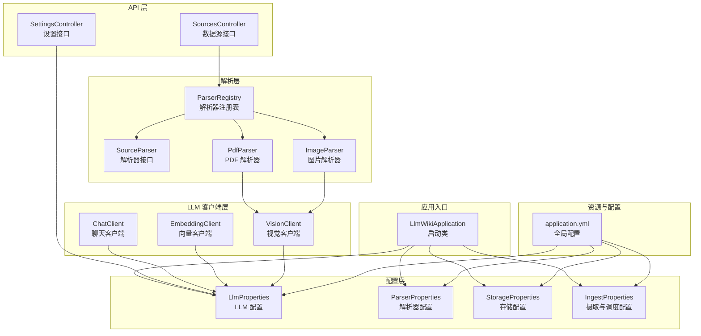
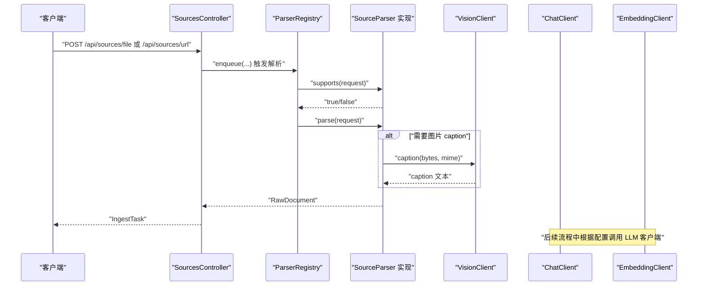
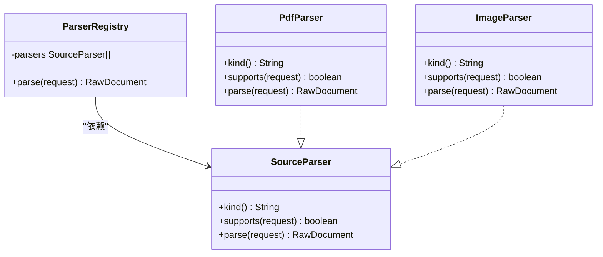
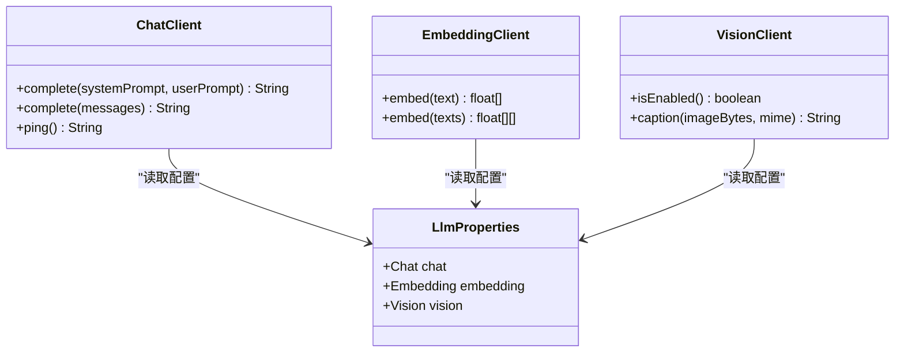
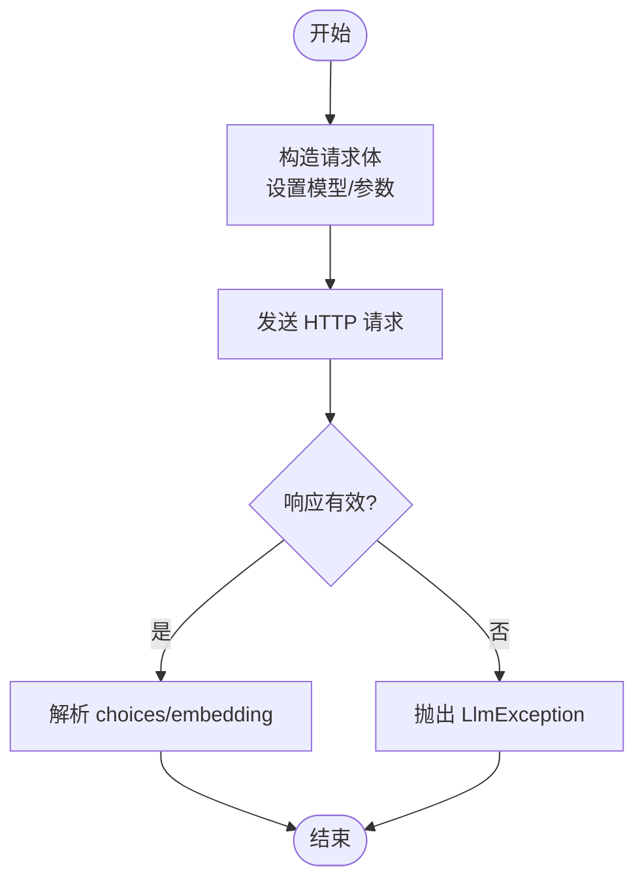
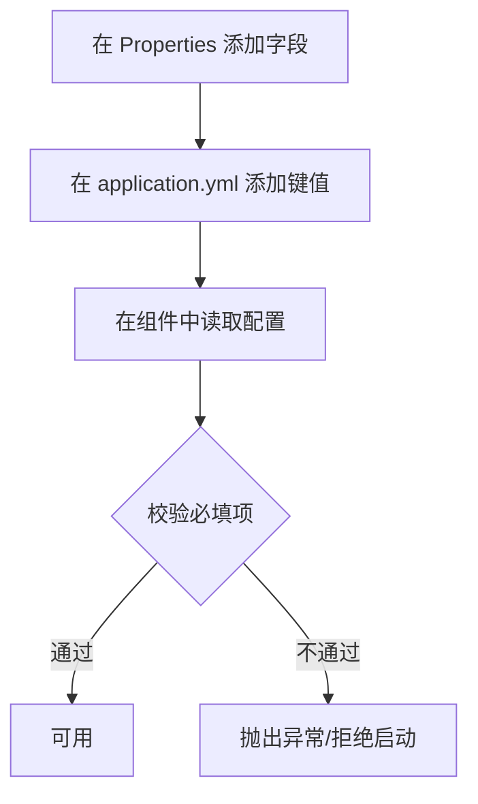
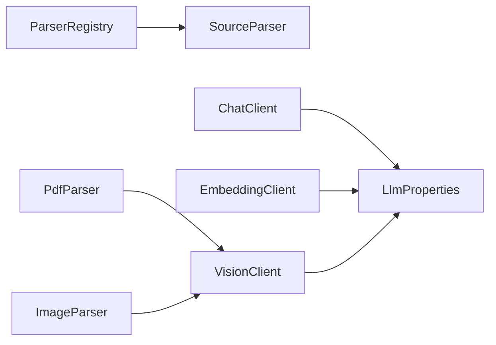

# 扩展开发

<cite>
**本文引用的文件**
- [LlmWikiApplication.java](file://src/main/java/com/example/llmwiki/LlmWikiApplication.java)
- [application.yml](file://src/main/resources/application.yml)
- [SourcesController.java](file://src/main/java/com/example/llmwiki/api/SourcesController.java)
- [SettingsController.java](file://src/main/java/com/example/llmwiki/api/SettingsController.java)
- [IngestProperties.java](file://src/main/java/com/example/llmwiki/config/IngestProperties.java)
- [LlmProperties.java](file://src/main/java/com/example/llmwiki/config/LlmProperties.java)
- [ParserProperties.java](file://src/main/java/com/example/llmwiki/config/ParserProperties.java)
- [StorageProperties.java](file://src/main/java/com/example/llmwiki/config/StorageProperties.java)
- [SourceParser.java](file://src/main/java/com/example/llmwiki/parser/SourceParser.java)
- [ParserRegistry.java](file://src/main/java/com/example/llmwiki/parser/ParserRegistry.java)
- [PdfParser.java](file://src/main/java/com/example/llmwiki/parser/impl/PdfParser.java)
- [ImageParser.java](file://src/main/java/com/example/llmwiki/parser/impl/ImageParser.java)
- [ChatClient.java](file://src/main/java/com/example/llmwiki/llm/ChatClient.java)
- [EmbeddingClient.java](file://src/main/java/com/example/llmwiki/llm/EmbeddingClient.java)
- [VisionClient.java](file://src/main/java/com/example/llmwiki/llm/VisionClient.java)
</cite>

## 目录
1. [简介](#简介)
2. [项目结构](#项目结构)
3. [核心组件](#核心组件)
4. [架构总览](#架构总览)
5. [详细组件分析](#详细组件分析)
6. [依赖分析](#依赖分析)
7. [性能考虑](#性能考虑)
8. [故障排查指南](#故障排查指南)
9. [结论](#结论)
10. [附录](#附录)

## 简介
本指南面向希望为 LLM Wiki 项目进行扩展开发的工程师，系统讲解从需求分析到实现落地的完整流程，并覆盖以下主题：
- 新功能开发流程：需求分析、架构设计、模块划分、接口设计、实现步骤
- 插件开发指南：解析器扩展（实现 SourceParser 接口）、LLM 客户端扩展（支持新供应商 API）、存储后端扩展（数据库适配器）
- 第三方集成示例：外部 API 集成模式、OCR 服务集成、搜索引擎集成、协作平台集成
- 配置扩展：新增配置项、属性绑定、默认值设置、配置验证
- 扩展点识别：SPI 机制使用、工厂模式应用、策略模式实现、观察者模式集成
- 扩展测试：单元测试编写、集成测试设计、Mock 对象使用、性能测试策略

## 项目结构
LLM Wiki 采用 Spring Boot 应用，后端以模块化方式组织，前端位于独立的 web 目录。核心模块包括：
- 配置层：集中管理各类配置（LLM、解析器、存储、摄取与调度）
- API 层：对外提供 REST 接口（数据源、设置、检索等）
- 解析层：多源解析器 SPI 机制，按优先级选择具体实现
- LLM 客户端层：统一的 Chat/Embedding/Vision 客户端，兼容 OpenAI 兼容协议
- 摄取与索引层：任务队列、索引构建、图谱与评估
- 工具与领域模型：通用工具、实体与领域对象

**图表来源**
- [LlmWikiApplication.java:1-29](file://src/main/java/com/example/llmwiki/LlmWikiApplication.java#L1-L29)
- [application.yml:1-84](file://src/main/resources/application.yml#L1-L84)
- [SourcesController.java:1-102](file://src/main/java/com/example/llmwiki/api/SourcesController.java#L1-L102)
- [SettingsController.java:1-71](file://src/main/java/com/example/llmwiki/api/SettingsController.java#L1-L71)
- [ParserRegistry.java:1-37](file://src/main/java/com/example/llmwiki/parser/ParserRegistry.java#L1-L37)
- [SourceParser.java:1-22](file://src/main/java/com/example/llmwiki/parser/SourceParser.java#L1-L22)
- [PdfParser.java:1-113](file://src/main/java/com/example/llmwiki/parser/impl/PdfParser.java#L1-L113)
- [ImageParser.java:1-71](file://src/main/java/com/example/llmwiki/parser/impl/ImageParser.java#L1-L71)
- [ChatClient.java:1-108](file://src/main/java/com/example/llmwiki/llm/ChatClient.java#L1-L108)
- [EmbeddingClient.java:1-90](file://src/main/java/com/example/llmwiki/llm/EmbeddingClient.java#L1-L90)
- [VisionClient.java:1-95](file://src/main/java/com/example/llmwiki/llm/VisionClient.java#L1-L95)

**章节来源**
- [LlmWikiApplication.java:1-29](file://src/main/java/com/example/llmwiki/LlmWikiApplication.java#L1-L29)
- [application.yml:1-84](file://src/main/resources/application.yml#L1-L84)

## 核心组件
- 启动类：负责应用装配与调度能力启用
- 配置体系：通过 @ConfigurationProperties 将 application.yml 中的 llm-wiki.* 前缀映射到强类型配置类
- API 控制器：提供数据源接入与设置热更新能力
- 解析器 SPI：统一接口 SourceParser + ParserRegistry 动态选择实现
- LLM 客户端：Chat/Embedding/Vision 三类客户端，统一走 OpenAI 兼容协议
- 存储配置：集中管理数据根目录与子目录

**章节来源**
- [LlmWikiApplication.java:19-26](file://src/main/java/com/example/llmwiki/LlmWikiApplication.java#L19-L26)
- [LlmProperties.java:16-62](file://src/main/java/com/example/llmwiki/config/LlmProperties.java#L16-L62)
- [ParserProperties.java:13-45](file://src/main/java/com/example/llmwiki/config/ParserProperties.java#L13-L45)
- [StorageProperties.java:13-28](file://src/main/java/com/example/llmwiki/config/StorageProperties.java#L13-L28)
- [SourcesController.java:30-101](file://src/main/java/com/example/llmwiki/api/SourcesController.java#L30-L101)
- [SettingsController.java:24-70](file://src/main/java/com/example/llmwiki/api/SettingsController.java#L24-L70)
- [SourceParser.java:11-21](file://src/main/java/com/example/llmwiki/parser/SourceParser.java#L11-L21)
- [ParserRegistry.java:16-36](file://src/main/java/com/example/llmwiki/parser/ParserRegistry.java#L16-L36)
- [ChatClient.java:25-107](file://src/main/java/com/example/llmwiki/llm/ChatClient.java#L25-L107)
- [EmbeddingClient.java:22-89](file://src/main/java/com/example/llmwiki/llm/EmbeddingClient.java#L22-L89)
- [VisionClient.java:22-94](file://src/main/java/com/example/llmwiki/llm/VisionClient.java#L22-L94)

## 架构总览
下图展示从 API 请求到解析与 LLM 调用的关键链路，以及配置驱动的行为。

**图表来源**
- [SourcesController.java:45-61](file://src/main/java/com/example/llmwiki/api/SourcesController.java#L45-L61)
- [ParserRegistry.java:27-35](file://src/main/java/com/example/llmwiki/parser/ParserRegistry.java#L27-L35)
- [PdfParser.java:57-76](file://src/main/java/com/example/llmwiki/parser/impl/PdfParser.java#L57-L76)
- [ImageParser.java:48-69](file://src/main/java/com/example/llmwiki/parser/impl/ImageParser.java#L48-L69)
- [VisionClient.java:47-85](file://src/main/java/com/example/llmwiki/llm/VisionClient.java#L47-L85)
- [ChatClient.java:37-86](file://src/main/java/com/example/llmwiki/llm/ChatClient.java#L37-L86)
- [EmbeddingClient.java:34-80](file://src/main/java/com/example/llmwiki/llm/EmbeddingClient.java#L34-L80)

## 详细组件分析

### 解析器扩展开发（实现 SourceParser 接口）
- 设计要点
  - 实现 SourceParser 接口，定义 kind() 与 supports()，确保与 SourceRecord.kind 或 MIME 匹配
  - 在 parse() 中产出 RawDocument，包含文本、图片 caption、内容哈希等
  - 使用 @Order 控制解析器优先级，避免覆盖默认行为
- 关键接口与注册
  - SourceParser：统一接口
  - ParserRegistry：按 supports 顺序选择首个实现
- 示例参考
  - PdfParser：PDF 文本抽取 + 可选图片 caption
  - ImageParser：图片直接 caption 或仅记录元信息

**图表来源**
- [SourceParser.java:11-21](file://src/main/java/com/example/llmwiki/parser/SourceParser.java#L11-L21)
- [ParserRegistry.java:19-36](file://src/main/java/com/example/llmwiki/parser/ParserRegistry.java#L19-L36)
- [PdfParser.java:38-76](file://src/main/java/com/example/llmwiki/parser/impl/PdfParser.java#L38-L76)
- [ImageParser.java:27-69](file://src/main/java/com/example/llmwiki/parser/impl/ImageParser.java#L27-L69)

**章节来源**
- [SourceParser.java:11-21](file://src/main/java/com/example/llmwiki/parser/SourceParser.java#L11-L21)
- [ParserRegistry.java:16-36](file://src/main/java/com/example/llmwiki/parser/ParserRegistry.java#L16-L36)
- [PdfParser.java:38-76](file://src/main/java/com/example/llmwiki/parser/impl/PdfParser.java#L38-L76)
- [ImageParser.java:27-69](file://src/main/java/com/example/llmwiki/parser/impl/ImageParser.java#L27-L69)

### LLM 客户端扩展（支持新供应商 API）
- 设计要点
  - Chat/Embedding/Vision 客户端均基于 LlmProperties 读取 baseUrl、apiKey、model、timeout 等
  - 通过统一的 OpenAI 兼容协议适配不同供应商（DeepSeek/Kimi/通义/智谱/Ollama/vLLM 等）
  - 支持 ping() 健康检查与错误包装
- 扩展建议
  - 新增供应商时，仅需在配置中切换 baseUrl/model，无需修改客户端代码
  - 如需特殊参数，可在现有字段基础上扩展或通过自定义头传参

**图表来源**
- [LlmProperties.java:19-62](file://src/main/java/com/example/llmwiki/config/LlmProperties.java#L19-L62)
- [ChatClient.java:28-107](file://src/main/java/com/example/llmwiki/llm/ChatClient.java#L28-L107)
- [EmbeddingClient.java:25-89](file://src/main/java/com/example/llmwiki/llm/EmbeddingClient.java#L25-L89)
- [VisionClient.java:25-94](file://src/main/java/com/example/llmwiki/llm/VisionClient.java#L25-L94)

**章节来源**
- [ChatClient.java:16-107](file://src/main/java/com/example/llmwiki/llm/ChatClient.java#L16-L107)
- [EmbeddingClient.java:16-89](file://src/main/java/com/example/llmwiki/llm/EmbeddingClient.java#L16-L89)
- [VisionClient.java:16-94](file://src/main/java/com/example/llmwiki/llm/VisionClient.java#L16-L94)
- [LlmProperties.java:16-62](file://src/main/java/com/example/llmwiki/config/LlmProperties.java#L16-L62)

### 存储后端扩展（数据库适配器）
- 当前使用 H2 文件数据库，可通过 application.yml 的 spring.datasource.* 进行替换
- 扩展建议
  - 保持 JPA/Hibernate 兼容接口不变，仅调整数据源与方言
  - 注意迁移脚本与连接池配置，确保事务与并发安全

**章节来源**
- [application.yml:11-25](file://src/main/resources/application.yml#L11-L25)

### 第三方集成示例

#### 外部 API 集成模式
- 通过 RestClient 发起 HTTP 请求，统一设置 Authorization 与 Content-Type
- 对响应进行校验与异常包装，便于上层捕获

**图表来源**
- [ChatClient.java:50-86](file://src/main/java/com/example/llmwiki/llm/ChatClient.java#L50-L86)
- [EmbeddingClient.java:42-80](file://src/main/java/com/example/llmwiki/llm/EmbeddingClient.java#L42-L80)

#### OCR 服务集成
- 通过 ParserProperties.others.ocr.* 开启与配置
- 可结合图片解析器，对图片进行 OCR 提取文本

**章节来源**
- [ParserProperties.java:36-44](file://src/main/java/com/example/llmwiki/config/ParserProperties.java#L36-L44)

#### 搜索引擎集成
- 通过检索模块（HybridSearcher/LuceneIndexer）对接外部搜索服务
- 可在检索阶段引入外部 API，将结果与本地索引融合

**章节来源**
- [application.yml:31-76](file://src/main/resources/application.yml#L31-L76)

#### 协作平台集成
- 通过 SourcesController 的远程数据源接口提交 FEISHU/DINGTALK 等来源
- 结合 ParserRegistry 的实现，完成文档抓取与解析

**章节来源**
- [SourcesController.java:55-61](file://src/main/java/com/example/llmwiki/api/SourcesController.java#L55-L61)

### 配置扩展
- 新增配置项
  - 在对应 Properties 类中添加字段与 setter
  - 在 application.yml 中添加同名前缀路径
- 属性绑定
  - 使用 @ConfigurationProperties(prefix = "llm-wiki.*") 自动绑定
- 默认值设置
  - 在 Properties 类中提供合理默认值
- 配置验证
  - 在客户端或服务层增加必要校验（如 API Key 非空）

**图表来源**
- [LlmProperties.java:19-62](file://src/main/java/com/example/llmwiki/config/LlmProperties.java#L19-L62)
- [ParserProperties.java:15-45](file://src/main/java/com/example/llmwiki/config/ParserProperties.java#L15-L45)
- [StorageProperties.java:15-28](file://src/main/java/com/example/llmwiki/config/StorageProperties.java#L15-L28)
- [IngestProperties.java:15-32](file://src/main/java/com/example/llmwiki/config/IngestProperties.java#L15-L32)
- [application.yml:31-76](file://src/main/resources/application.yml#L31-L76)

**章节来源**
- [LlmProperties.java:16-62](file://src/main/java/com/example/llmwiki/config/LlmProperties.java#L16-L62)
- [ParserProperties.java:13-45](file://src/main/java/com/example/llmwiki/config/ParserProperties.java#L13-L45)
- [StorageProperties.java:13-28](file://src/main/java/com/example/llmwiki/config/StorageProperties.java#L13-L28)
- [IngestProperties.java:13-32](file://src/main/java/com/example/llmwiki/config/IngestProperties.java#L13-L32)
- [application.yml:31-76](file://src/main/resources/application.yml#L31-L76)

### 扩展点识别
- SPI 机制：SourceParser + ParserRegistry
- 工厂模式：解析器实例由 Spring 容器注入，按需选择
- 策略模式：不同解析器实现策略可自由替换
- 观察者模式：进度事件通过 ProgressBus/ProgressEvent 分发

**章节来源**
- [SourceParser.java:11-21](file://src/main/java/com/example/llmwiki/parser/SourceParser.java#L11-L21)
- [ParserRegistry.java:16-36](file://src/main/java/com/example/llmwiki/parser/ParserRegistry.java#L16-L36)

### 扩展测试
- 单元测试
  - 针对解析器：构造 ParseRequest，断言 kind/supports/parse 输出
  - 针对 LLM 客户端：Mock RestClient，断言请求体与异常分支
- 集成测试
  - 调用 SettingsController.ping() 验证配置连通性
  - 通过 SourcesController 提交文件/URL，验证摄取流程
- Mock 对象使用
  - 使用 Mockito 模拟 RestClient/RestClientBuilder
- 性能测试策略
  - 批量解析 PDF/图片，统计吞吐与延迟
  - 并发调用 LLM 客户端，评估限流与超时

**章节来源**
- [SettingsController.java:53-69](file://src/main/java/com/example/llmwiki/api/SettingsController.java#L53-L69)
- [SourcesController.java:45-61](file://src/main/java/com/example/llmwiki/api/SourcesController.java#L45-L61)
- [ChatClient.java:67-86](file://src/main/java/com/example/llmwiki/llm/ChatClient.java#L67-L86)
- [EmbeddingClient.java:55-80](file://src/main/java/com/example/llmwiki/llm/EmbeddingClient.java#L55-L80)

## 依赖分析
- 组件耦合
  - 解析器依赖 VisionClient（可选），ParserRegistry 依赖所有 SourceParser 实现
  - LLM 客户端依赖 LlmProperties 与共享 RestClient
- 外部依赖
  - PDF 解析依赖 Apache PDFBox
  - REST 客户端依赖 Spring WebClient（RestClient）
  - 数据库依赖 H2/JPA/Hibernate

**图表来源**
- [ParserRegistry.java:22-35](file://src/main/java/com/example/llmwiki/parser/ParserRegistry.java#L22-L35)
- [PdfParser.java:40-40](file://src/main/java/com/example/llmwiki/parser/impl/PdfParser.java#L40-L40)
- [ImageParser.java:31-31](file://src/main/java/com/example/llmwiki/parser/impl/ImageParser.java#L31-L31)
- [ChatClient.java:30-32](file://src/main/java/com/example/llmwiki/llm/ChatClient.java#L30-L32)
- [EmbeddingClient.java:27-29](file://src/main/java/com/example/llmwiki/llm/EmbeddingClient.java#L27-L29)
- [VisionClient.java:27-29](file://src/main/java/com/example/llmwiki/llm/VisionClient.java#L27-L29)

**章节来源**
- [PdfParser.java:10-26](file://src/main/java/com/example/llmwiki/parser/impl/PdfParser.java#L10-L26)
- [ImageParser.java:10-15](file://src/main/java/com/example/llmwiki/parser/impl/ImageParser.java#L10-L15)

## 性能考虑
- 解析成本控制
  - PDF 图片 caption 限制页数（示例中最多 20 页），避免高成本计算
- LLM 调用优化
  - 合理设置超时与温度，批量嵌入减少往返
- 存储与索引
  - 使用合适的索引目录与图谱持久化目录，避免 IO 瓶颈

**章节来源**
- [PdfParser.java:84-85](file://src/main/java/com/example/llmwiki/parser/impl/PdfParser.java#L84-L85)
- [LlmProperties.java:32-41](file://src/main/java/com/example/llmwiki/config/LlmProperties.java#L32-L41)
- [LlmProperties.java:46-51](file://src/main/java/com/example/llmwiki/config/LlmProperties.java#L46-L51)

## 故障排查指南
- LLM 配置问题
  - Chat/Embedding API Key 未配置会触发异常，检查 SettingsController.update 与 LlmProperties
- 解析器未命中
  - 确认 SourceRecord.kind 与解析器 kind 匹配，或文件扩展名是否被 supports() 覆盖
- Vision 未启用
  - 检查 LlmProperties.Vision.enabled 与 apiKey，确认图片 caption 流程是否生效

**章节来源**
- [SettingsController.java:40-51](file://src/main/java/com/example/llmwiki/api/SettingsController.java#L40-L51)
- [ChatClient.java:52-54](file://src/main/java/com/example/llmwiki/llm/ChatClient.java#L52-L54)
- [ParserRegistry.java:34-35](file://src/main/java/com/example/llmwiki/parser/ParserRegistry.java#L34-L35)
- [VisionClient.java:34-38](file://src/main/java/com/example/llmwiki/llm/VisionClient.java#L34-L38)

## 结论
本指南提供了从需求到实现、从扩展点到测试的全栈式开发方法论。通过 SPI 机制与配置驱动，项目具备良好的可扩展性。建议在新增功能时遵循“配置优先、接口最小化、实现可替换”的原则，确保系统稳定演进。

## 附录
- 快速清单
  - 新增解析器：实现 SourceParser + @Order + 注册生效
  - 新增 LLM 供应商：修改 LlmProperties 配置项，无需改客户端
  - 新增配置项：Properties + application.yml + 校验
  - 编写测试：单元 + 集成 + Mock + 性能