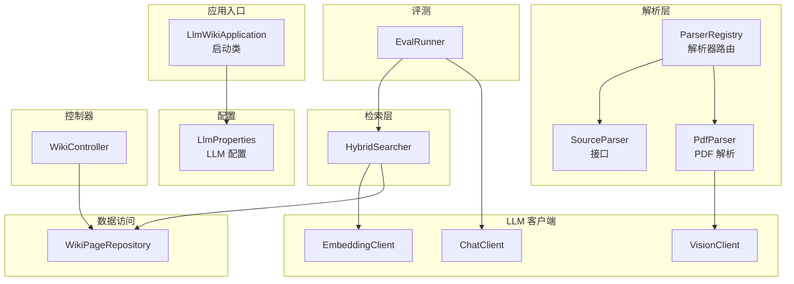
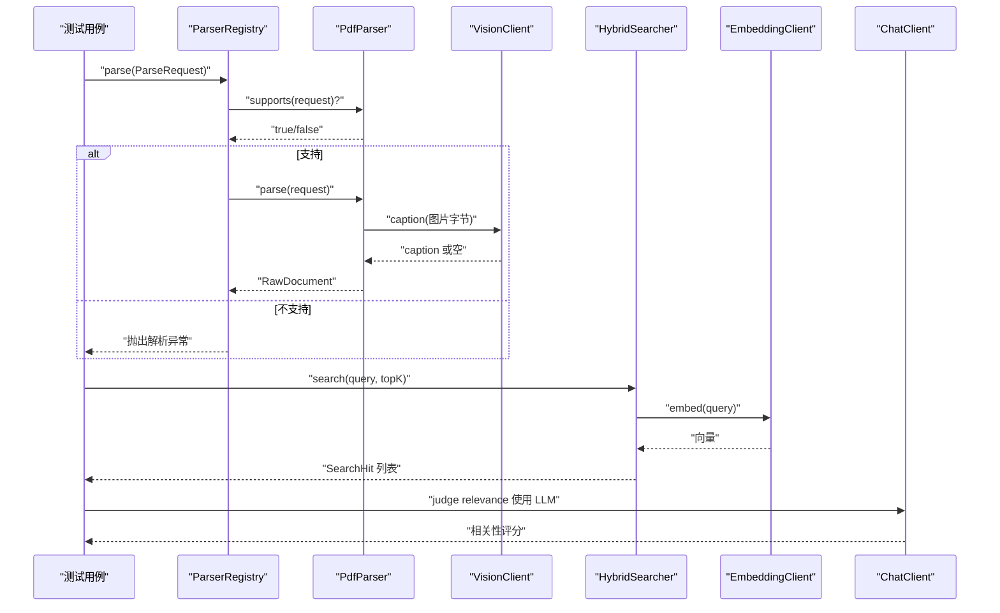
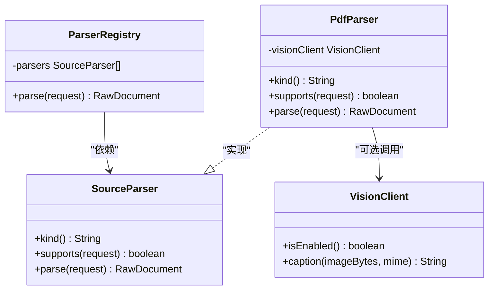
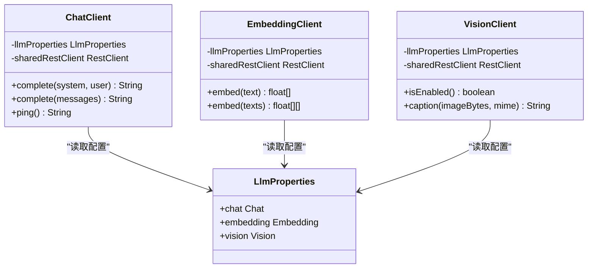
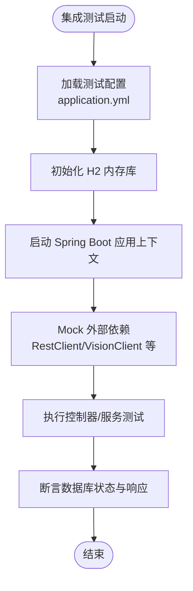
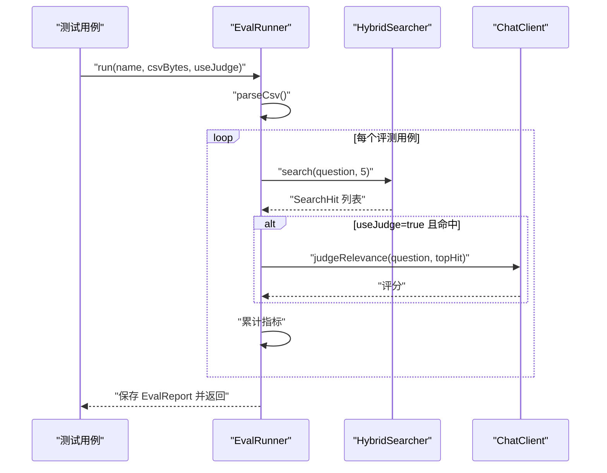
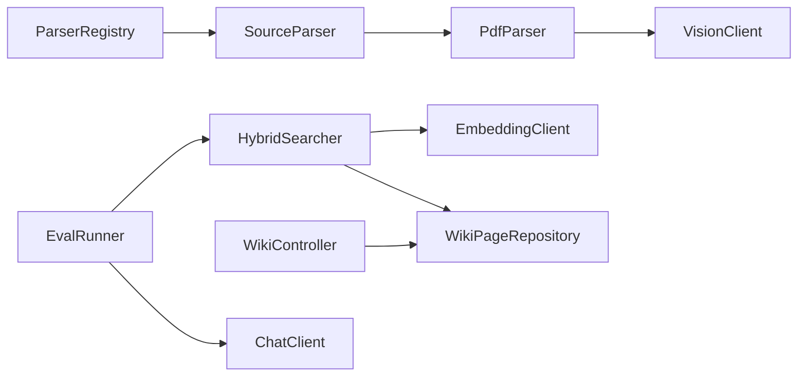

# 扩展测试

<cite>
**本文引用的文件**
- [pom.xml](file://pom.xml)
- [application.yml](file://src/main/resources/application.yml)
- [LlmWikiApplication.java](file://src/main/java/com/example/llmwiki/LlmWikiApplication.java)
- [LlmProperties.java](file://src/main/java/com/example/llmwiki/config/LlmProperties.java)
- [ParserRegistry.java](file://src/main/java/com/example/llmwiki/parser/ParserRegistry.java)
- [SourceParser.java](file://src/main/java/com/example/llmwiki/parser/SourceParser.java)
- [PdfParser.java](file://src/main/java/com/example/llmwiki/parser/impl/PdfParser.java)
- [ChatClient.java](file://src/main/java/com/example/llmwiki/llm/ChatClient.java)
- [EmbeddingClient.java](file://src/main/java/com/example/llmwiki/llm/EmbeddingClient.java)
- [VisionClient.java](file://src/main/java/com/example/llmwiki/llm/VisionClient.java)
- [HybridSearcher.java](file://src/main/java/com/example/llmwiki/retrieval/HybridSearcher.java)
- [WikiPageRepository.java](file://src/main/java/com/example/llmwiki/repository/WikiPageRepository.java)
- [WikiController.java](file://src/main/java/com/example/llmwiki/api/WikiController.java)
- [EvalRunner.java](file://src/main/java/com/example/llmwiki/eval/EvalRunner.java)
</cite>

## 目录
1. [简介](#简介)
2. [项目结构](#项目结构)
3. [核心组件](#核心组件)
4. [架构总览](#架构总览)
5. [详细组件分析](#详细组件分析)
6. [依赖分析](#依赖分析)
7. [性能考虑](#性能考虑)
8. [故障排查指南](#故障排查指南)
9. [结论](#结论)
10. [附录](#附录)

## 简介
本指南面向 LLM Wiki 项目的扩展测试开发，围绕以下目标展开：
- 单元测试：测试框架选择（JUnit 5）、Mock 对象使用（Mockito）、测试用例设计原则
- 集成测试：Spring Boot Test 配置、测试数据库设置、外部依赖 Mock
- 插件测试策略：解析器插件测试、LLM 客户端测试、配置扩展测试
- 性能测试策略：负载测试、压力测试、内存泄漏检测
- 测试数据管理：测试数据准备、数据清理、测试环境隔离
- 测试自动化：CI/CD 集成、测试报告生成、测试覆盖率统计
- 提供完整测试开发示例路径，覆盖各类扩展类型的测试实现与最佳实践

## 项目结构
LLM Wiki 采用 Spring Boot 3.3.5 + JPA + H2 的技术栈，核心模块包括：
- 配置层：LlmProperties（OpenAI 兼容 LLM 配置）
- 解析层：SourceParser 接口及多种实现（如 PdfParser），ParserRegistry 负责路由
- LLM 客户端：ChatClient、EmbeddingClient、VisionClient
- 检索层：HybridSearcher（BM25 + 向量 KNN + 图谱 Boost）
- 数据访问：JPA Repository（如 WikiPageRepository）
- 控制器：REST API（如 WikiController）
- 评测：EvalRunner（CSV 输入，混合检索评估）

**图表来源**
- [LlmWikiApplication.java:1-29](file://src/main/java/com/example/llmwiki/LlmWikiApplication.java#L1-L29)
- [LlmProperties.java:1-63](file://src/main/java/com/example/llmwiki/config/LlmProperties.java#L1-L63)
- [ParserRegistry.java:1-37](file://src/main/java/com/example/llmwiki/parser/ParserRegistry.java#L1-L37)
- [SourceParser.java:1-22](file://src/main/java/com/example/llmwiki/parser/SourceParser.java#L1-L22)
- [PdfParser.java:1-113](file://src/main/java/com/example/llmwiki/parser/impl/PdfParser.java#L1-L113)
- [ChatClient.java:1-108](file://src/main/java/com/example/llmwiki/llm/ChatClient.java#L1-L108)
- [EmbeddingClient.java:1-90](file://src/main/java/com/example/llmwiki/llm/EmbeddingClient.java#L1-L90)
- [VisionClient.java:1-95](file://src/main/java/com/example/llmwiki/llm/VisionClient.java#L1-L95)
- [HybridSearcher.java:1-137](file://src/main/java/com/example/llmwiki/retrieval/HybridSearcher.java#L1-L137)
- [WikiPageRepository.java:1-19](file://src/main/java/com/example/llmwiki/repository/WikiPageRepository.java#L1-L19)
- [WikiController.java:1-51](file://src/main/java/com/example/llmwiki/api/WikiController.java#L1-L51)
- [EvalRunner.java:1-243](file://src/main/java/com/example/llmwiki/eval/EvalRunner.java#L1-L243)

**章节来源**
- [pom.xml:1-171](file://pom.xml#L1-L171)
- [application.yml:1-84](file://src/main/resources/application.yml#L1-L84)

## 核心组件
- 配置与启动
  - LlmWikiApplication：Spring Boot 启动类，启用异步与调度
  - LlmProperties：绑定 llm-wiki.llm.* 前缀的配置，支持热更新
- 解析器体系
  - SourceParser：统一接口；ParserRegistry：按 supports 匹配首个实现
  - PdfParser：基于 PDFBox 抽取文本与图片，可选调用 VisionClient 生成 caption
- LLM 客户端
  - ChatClient：OpenAI 兼容 Chat Completions；EmbeddingClient：向量嵌入；VisionClient：多模态图片 caption
- 检索与评测
  - HybridSearcher：BM25 + 向量 KNN + 图谱邻接 Boost 融合
  - EvalRunner：CSV 评测驱动，计算命中率、平均相关性、平均延迟等指标
- 数据访问与接口
  - WikiPageRepository：JPA 存储 Wiki 页面
  - WikiController：提供页面列表、详情、统计接口

**章节来源**
- [LlmWikiApplication.java:1-29](file://src/main/java/com/example/llmwiki/LlmWikiApplication.java#L1-L29)
- [LlmProperties.java:1-63](file://src/main/java/com/example/llmwiki/config/LlmProperties.java#L1-L63)
- [ParserRegistry.java:1-37](file://src/main/java/com/example/llmwiki/parser/ParserRegistry.java#L1-L37)
- [SourceParser.java:1-22](file://src/main/java/com/example/llmwiki/parser/SourceParser.java#L1-L22)
- [PdfParser.java:1-113](file://src/main/java/com/example/llmwiki/parser/impl/PdfParser.java#L1-L113)
- [ChatClient.java:1-108](file://src/main/java/com/example/llmwiki/llm/ChatClient.java#L1-L108)
- [EmbeddingClient.java:1-90](file://src/main/java/com/example/llmwiki/llm/EmbeddingClient.java#L1-L90)
- [VisionClient.java:1-95](file://src/main/java/com/example/llmwiki/llm/VisionClient.java#L1-L95)
- [HybridSearcher.java:1-137](file://src/main/java/com/example/llmwiki/retrieval/HybridSearcher.java#L1-L137)
- [WikiPageRepository.java:1-19](file://src/main/java/com/example/llmwiki/repository/WikiPageRepository.java#L1-L19)
- [WikiController.java:1-51](file://src/main/java/com/example/llmwiki/api/WikiController.java#L1-L51)
- [EvalRunner.java:1-243](file://src/main/java/com/example/llmwiki/eval/EvalRunner.java#L1-L243)

## 架构总览
下图展示测试关注的关键交互：解析器路由、LLM 客户端调用、检索与评测流程。

**图表来源**
- [ParserRegistry.java:24-35](file://src/main/java/com/example/llmwiki/parser/ParserRegistry.java#L24-L35)
- [PdfParser.java:56-77](file://src/main/java/com/example/llmwiki/parser/impl/PdfParser.java#L56-L77)
- [VisionClient.java:47-86](file://src/main/java/com/example/llmwiki/llm/VisionClient.java#L47-L86)
- [HybridSearcher.java:42-111](file://src/main/java/com/example/llmwiki/retrieval/HybridSearcher.java#L42-L111)
- [EmbeddingClient.java:34-81](file://src/main/java/com/example/llmwiki/llm/EmbeddingClient.java#L34-L81)
- [ChatClient.java:37-86](file://src/main/java/com/example/llmwiki/llm/ChatClient.java#L37-L86)

## 详细组件分析

### 单元测试：解析器插件测试
- 目标
  - 验证 ParserRegistry 的路由逻辑（匹配首个 supports 实现）
  - 验证 PdfParser 的文本抽取、图片提取与 caption 生成
  - 验证 SourceParser 接口契约（kind/supported/parse）
- 测试要点
  - 使用 Mockito 创建 ParseRequest 与 RawDocument，模拟 supports 返回 true/false
  - Mock VisionClient 返回空串与非空 caption，验证组合输出
  - 验证异常分支：不支持的 kind、解析异常
- 最佳实践
  - 使用参数化测试覆盖不同文件后缀与显示名
  - 使用 @TestInstance(TestInstance.Lifecycle.PER_CLASS) 组织共享资源
  - 使用 @ExtendWith(MockitoExtension.class) 注入 Mock

**图表来源**
- [SourceParser.java:11-21](file://src/main/java/com/example/llmwiki/parser/SourceParser.java#L11-L21)
- [ParserRegistry.java:19-35](file://src/main/java/com/example/llmwiki/parser/ParserRegistry.java#L19-L35)
- [PdfParser.java:38-77](file://src/main/java/com/example/llmwiki/parser/impl/PdfParser.java#L38-L77)
- [VisionClient.java:34-86](file://src/main/java/com/example/llmwiki/llm/VisionClient.java#L34-L86)

**章节来源**
- [ParserRegistry.java:24-35](file://src/main/java/com/example/llmwiki/parser/ParserRegistry.java#L24-L35)
- [PdfParser.java:42-77](file://src/main/java/com/example/llmwiki/parser/impl/PdfParser.java#L42-L77)
- [SourceParser.java:11-21](file://src/main/java/com/example/llmwiki/parser/SourceParser.java#L11-L21)

### 单元测试：LLM 客户端测试
- 目标
  - ChatClient：校验请求构造、鉴权头、错误处理
  - EmbeddingClient：校验批量嵌入、向量维度一致性
  - VisionClient：校验 Data URL 构造、禁用条件、失败回退
- 测试要点
  - 使用 Mockito 的 given().willReturn(...) 模拟 RestClient 响应
  - 验证异常链：API Key 缺失、HTTP 错误、响应格式异常
  - 验证 trimSlash 边界（末尾斜杠）
- 最佳实践
  - 使用 @Nested 分层组织 Chat/Embedding/Vision 的子测试
  - 使用 @TempDir 生成临时文件，避免磁盘副作用
  - 使用 @Timeout 控制网络调用超时，确保测试稳定

**图表来源**
- [ChatClient.java:28-107](file://src/main/java/com/example/llmwiki/llm/ChatClient.java#L28-L107)
- [EmbeddingClient.java:25-89](file://src/main/java/com/example/llmwiki/llm/EmbeddingClient.java#L25-L89)
- [VisionClient.java:25-94](file://src/main/java/com/example/llmwiki/llm/VisionClient.java#L25-L94)
- [LlmProperties.java:19-62](file://src/main/java/com/example/llmwiki/config/LlmProperties.java#L19-L62)

**章节来源**
- [ChatClient.java:34-86](file://src/main/java/com/example/llmwiki/llm/ChatClient.java#L34-L86)
- [EmbeddingClient.java:34-81](file://src/main/java/com/example/llmwiki/llm/EmbeddingClient.java#L34-L81)
- [VisionClient.java:34-86](file://src/main/java/com/example/llmwiki/llm/VisionClient.java#L34-L86)
- [LlmProperties.java:19-62](file://src/main/java/com/example/llmwiki/config/LlmProperties.java#L19-L62)

### 单元测试：配置扩展测试
- 目标
  - 验证 LlmProperties 的配置绑定与默认值
  - 验证配置变更对客户端的影响（如禁用 Vision）
- 测试要点
  - 使用 @TestPropertySource 覆盖 application.yml 中 llm-wiki.llm.*
  - 断言客户端在不同配置下的行为差异
- 最佳实践
  - 使用 @DynamicPropertySource 动态注入配置键值
  - 避免硬编码密钥，使用占位符或测试专用凭据

**章节来源**
- [LlmProperties.java:16-62](file://src/main/java/com/example/llmwiki/config/LlmProperties.java#L16-L62)
- [application.yml:39-57](file://src/main/resources/application.yml#L39-L57)

### 集成测试：Spring Boot Test 与测试数据库
- 目标
  - 在测试环境中启动 Spring 上下文，验证控制器、服务与数据库交互
- 配置建议
  - 使用 @SpringBootTest + @AutoConfigureTestDatabase(replace = By.DEFAULT)
  - 使用 @AutoConfigureTestEntityManager 管理实体生命周期
  - 使用 @DirtiesContext 保证测试间隔离
- 测试数据库
  - H2 内存数据库：通过 application.yml 的 spring.datasource.url 指向内存数据库
  - 初始化脚本：使用 schema.sql / data.sql（若存在）
- 外部依赖 Mock
  - 使用 @MockBean 替换 RestClient、VisionClient、EmbeddingClient，避免真实网络调用
  - 使用 @SpyBean 对部分组件进行方法级拦截

**图表来源**
- [application.yml:11-29](file://src/main/resources/application.yml#L11-L29)
- [pom.xml:55-60](file://pom.xml#L55-L60)

**章节来源**
- [application.yml:11-29](file://src/main/resources/application.yml#L11-L29)
- [pom.xml:55-60](file://pom.xml#L55-L60)

### 集成测试：控制器与仓储
- 目标
  - 验证 WikiController 的 GET /api/wiki/pages、/pages/{slug}、/stats
  - 验证 WikiPageRepository 的查询语义
- 测试要点
  - 使用 @WebMvcTest(WikiController.class) 进行控制器切片测试
  - 使用 @TestEntityManager 插入测试数据，断言 JSON 响应字段
  - 使用 @MockBean 替换 Repository，验证参数与返回值

**章节来源**
- [WikiController.java:22-50](file://src/main/java/com/example/llmwiki/api/WikiController.java#L22-L50)
- [WikiPageRepository.java:13-18](file://src/main/java/com/example/llmwiki/repository/WikiPageRepository.java#L13-L18)

### 集成测试：评测流程
- 目标
  - 验证 EvalRunner 的 CSV 解析、检索、相关性评分与报告落库
- 测试要点
  - 准备 CSV 字节数组，Mock HybridSearcher 返回固定命中集
  - Mock ChatClient 返回固定评分，断言 EvalReport 指标
  - 验证 useJudge 开关对评分的影响

**图表来源**
- [EvalRunner.java:63-135](file://src/main/java/com/example/llmwiki/eval/EvalRunner.java#L63-L135)
- [HybridSearcher.java:42-111](file://src/main/java/com/example/llmwiki/retrieval/HybridSearcher.java#L42-L111)
- [ChatClient.java:140-163](file://src/main/java/com/example/llmwiki/llm/ChatClient.java#L140-L163)

**章节来源**
- [EvalRunner.java:63-135](file://src/main/java/com/example/llmwiki/eval/EvalRunner.java#L63-L135)

### 性能测试策略
- 负载测试
  - 使用 JMH 进行热点方法微基准（如 PdfParser.extractAndCaption、EmbeddingClient.embed）
  - 使用 Gatling 或 Locust 对 /api/wiki/stats、/api/wiki/pages 等接口进行并发压测
- 压力测试
  - 逐步增加 CSV 条目数量与图片数量，观察 EvalRunner 的吞吐与延迟变化
  - 观察检索层在高并发下的 BM25/KNN 融合性能
- 内存泄漏检测
  - 使用 JProfiler/VisualVM/Async Profiler 监控堆内存与 GC
  - 关注 PDFBox 文档对象、Jackson JsonNode、RestClient 实例的生命周期

[本节为通用指导，无需特定文件来源]

### 测试数据管理
- 测试数据准备
  - 使用 @TestEntityManager 或 @Sql 注入初始化数据
  - 使用 @ImportSql 导入 CSV/JSON fixture
- 数据清理
  - 使用 @Commit 与 @Rollback 控制事务边界
  - 使用 @DirtiesContext 或 @AfterEach 清理缓存与线程本地状态
- 测试环境隔离
  - 使用 application-test.yml 覆盖数据源与日志级别
  - 使用随机端口与临时目录（llm-wiki.storage.root-dir）

**章节来源**
- [application.yml:31-39](file://src/main/resources/application.yml#L31-L39)

### 测试自动化
- CI/CD 集成
  - Maven Surefire/Failsafe：配置测试分类与报告
  - JaCoCo 插件：生成覆盖率报告
- 测试报告生成
  - JUnit Platform 生成 XML/JUnit XML
  - Allure 或 ExtentReports：生成可分享的 HTML 报告
- 测试覆盖率统计
  - JaCoCo：报告行覆盖率与分支覆盖率
  - SonarQube：在流水线中聚合覆盖率与质量门禁

**章节来源**
- [pom.xml:161-169](file://pom.xml#L161-L169)

## 依赖分析
- 组件耦合
  - ParserRegistry 与 SourceParser：多实现路由，低耦合
  - PdfParser 与 VisionClient：可选依赖，通过 isEnabled 判定
  - HybridSearcher 依赖 EmbeddingClient 与 GraphService，检索层复杂度较高
- 外部依赖
  - H2：测试数据库
  - Spring Boot Starter Test：测试基础能力
- 循环依赖
  - 当前结构无明显循环依赖；注意在新增扩展时避免双向依赖

**图表来源**
- [ParserRegistry.java:19-35](file://src/main/java/com/example/llmwiki/parser/ParserRegistry.java#L19-L35)
- [SourceParser.java:11-21](file://src/main/java/com/example/llmwiki/parser/SourceParser.java#L11-L21)
- [PdfParser.java:38-77](file://src/main/java/com/example/llmwiki/parser/impl/PdfParser.java#L38-L77)
- [VisionClient.java:25-94](file://src/main/java/com/example/llmwiki/llm/VisionClient.java#L25-L94)
- [HybridSearcher.java:34-111](file://src/main/java/com/example/llmwiki/retrieval/HybridSearcher.java#L34-L111)
- [WikiPageRepository.java:13-18](file://src/main/java/com/example/llmwiki/repository/WikiPageRepository.java#L13-L18)
- [WikiController.java:22-50](file://src/main/java/com/example/llmwiki/api/WikiController.java#L22-L50)
- [EvalRunner.java:51-135](file://src/main/java/com/example/llmwiki/eval/EvalRunner.java#L51-L135)
- [ChatClient.java:28-107](file://src/main/java/com/example/llmwiki/llm/ChatClient.java#L28-L107)
- [EmbeddingClient.java:25-89](file://src/main/java/com/example/llmwiki/llm/EmbeddingClient.java#L25-L89)

**章节来源**
- [pom.xml:36-159](file://pom.xml#L36-L159)

## 性能考虑
- 解析器性能
  - PDFBox 文档加载与文本抽取：限制最大页数（如 PdfParser 中的 20 页上限）
  - 图片提取与 Vision 调用：按需启用，避免高频调用
- 检索性能
  - BM25 查询优化：合理设置 analyzer 与查询解析器
  - 向量检索：EmbeddingClient 批量嵌入，减少往返次数
- 评测性能
  - EvalRunner 使用 topK=5，useJudge 可开关以平衡性能与准确性

**章节来源**
- [PdfParser.java:79-111](file://src/main/java/com/example/llmwiki/parser/impl/PdfParser.java#L79-L111)
- [HybridSearcher.java:67-86](file://src/main/java/com/example/llmwiki/retrieval/HybridSearcher.java#L67-L86)
- [EvalRunner.java:48-111](file://src/main/java/com/example/llmwiki/eval/EvalRunner.java#L48-L111)

## 故障排查指南
- 常见异常与定位
  - LlmException：API Key 未配置、远程调用失败、响应格式异常
  - ParserException：找不到匹配的解析器
  - LLM 客户端错误：检查 baseUrl、apiKey、timeoutSeconds
- 日志与监控
  - application.yml 中已开启调试日志级别，便于定位问题
  - 使用 H2 Console 进行数据库状态检查（/h2-console）

**章节来源**
- [ChatClient.java:52-85](file://src/main/java/com/example/llmwiki/llm/ChatClient.java#L52-L85)
- [EmbeddingClient.java:44-80](file://src/main/java/com/example/llmwiki/llm/EmbeddingClient.java#L44-L80)
- [ParserRegistry.java:34-35](file://src/main/java/com/example/llmwiki/parser/ParserRegistry.java#L34-L35)
- [application.yml:78-84](file://src/main/resources/application.yml#L78-L84)

## 结论
本指南从测试框架、Mock 策略、集成测试、插件测试、性能测试、数据管理与自动化等方面，系统化地规划了 LLM Wiki 的扩展测试方案。通过明确的组件边界与依赖关系，结合 Spring Boot Test 与 H2 内存库，可在保证稳定性的同时高效推进功能迭代与质量保障。

## 附录
- 示例测试清单（路径指引）
  - 解析器插件测试：[ParserRegistry.java:24-35](file://src/main/java/com/example/llmwiki/parser/ParserRegistry.java#L24-L35)，[PdfParser.java:42-77](file://src/main/java/com/example/llmwiki/parser/impl/PdfParser.java#L42-L77)
  - LLM 客户端测试：[ChatClient.java:34-86](file://src/main/java/com/example/llmwiki/llm/ChatClient.java#L34-L86)，[EmbeddingClient.java:34-81](file://src/main/java/com/example/llmwiki/llm/EmbeddingClient.java#L34-L81)，[VisionClient.java:34-86](file://src/main/java/com/example/llmwiki/llm/VisionClient.java#L34-L86)
  - 配置扩展测试：[LlmProperties.java:19-62](file://src/main/java/com/example/llmwiki/config/LlmProperties.java#L19-L62)，[application.yml:39-57](file://src/main/resources/application.yml#L39-L57)
  - 集成测试（控制器/仓储）：[WikiController.java:22-50](file://src/main/java/com/example/llmwiki/api/WikiController.java#L22-L50)，[WikiPageRepository.java:13-18](file://src/main/java/com/example/llmwiki/repository/WikiPageRepository.java#L13-L18)
  - 评测流程测试：[EvalRunner.java:63-135](file://src/main/java/com/example/llmwiki/eval/EvalRunner.java#L63-L135)
  - 性能测试工具：JMH、Gatling、JProfiler/VisualVM/Async Profiler
  - 自动化配置：[pom.xml:161-169](file://pom.xml#L161-L169)