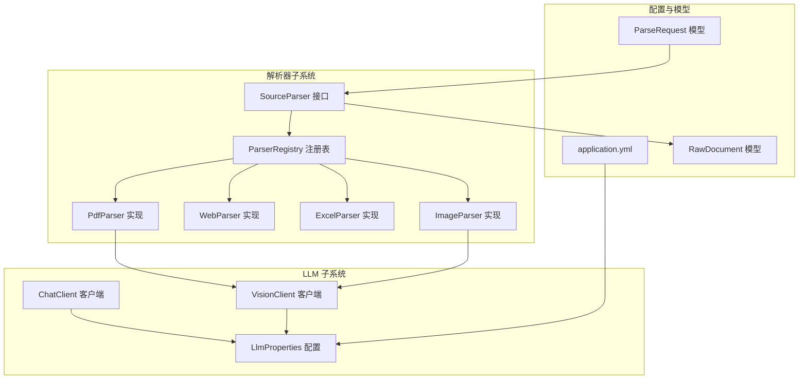
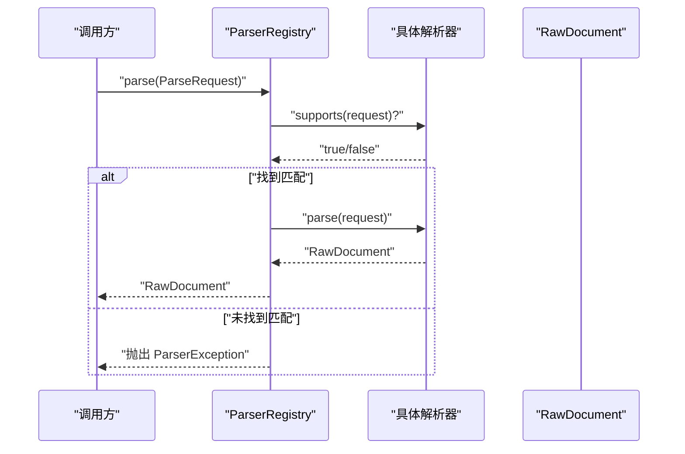
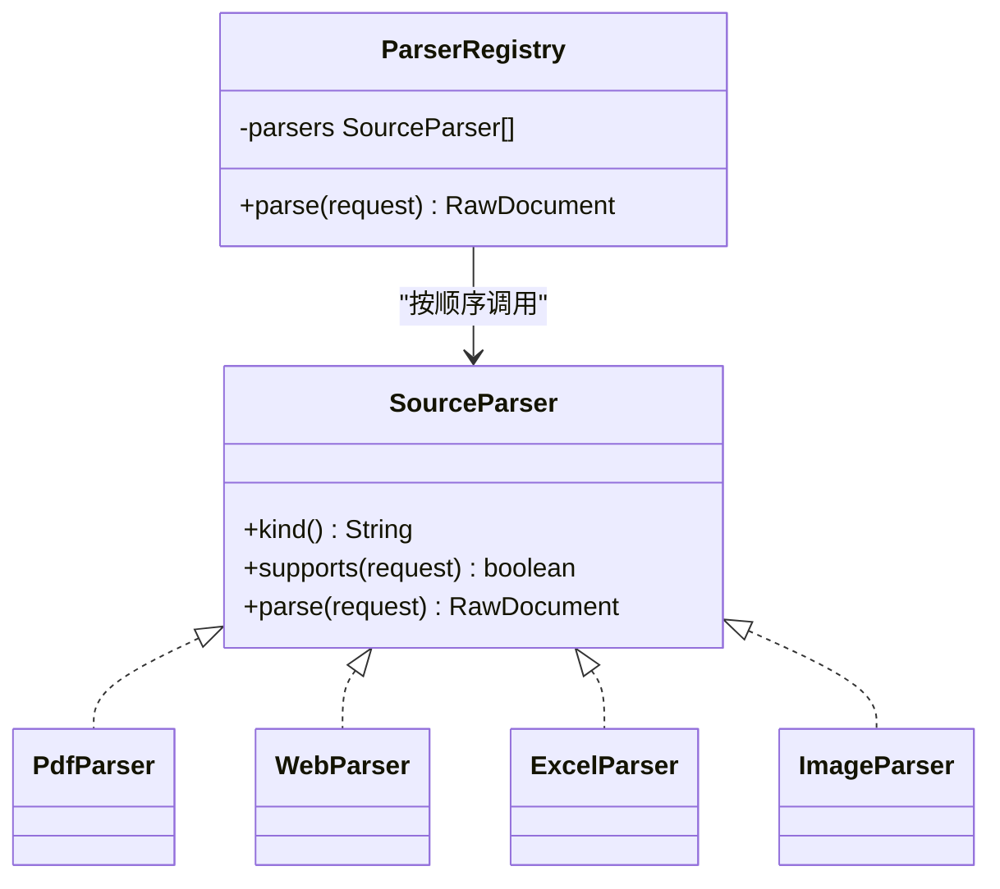
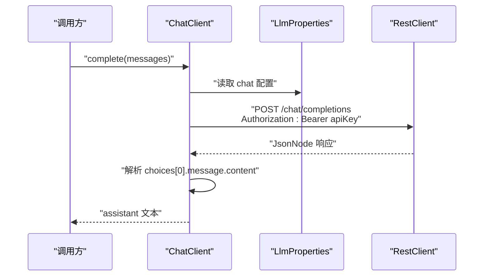
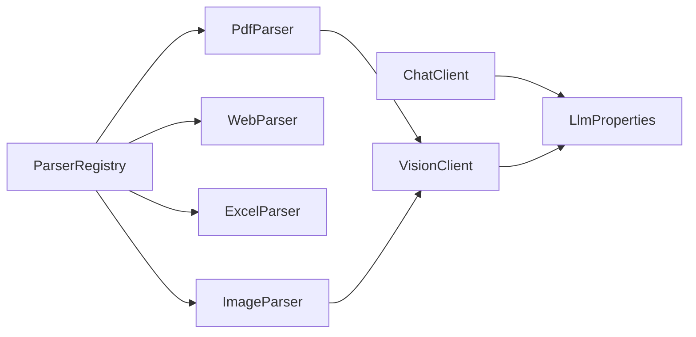

# 插件开发

<cite>
**本文引用的文件**
- [SourceParser.java](file://src/main/java/com/example/llmwiki/parser/SourceParser.java)
- [ParserRegistry.java](file://src/main/java/com/example/llmwiki/parser/ParserRegistry.java)
- [ParseRequest.java](file://src/main/java/com/example/llmwiki/parser/ParseRequest.java)
- [RawDocument.java](file://src/main/java/com/example/llmwiki/domain/RawDocument.java)
- [ParserException.java](file://src/main/java/com/example/llmwiki/parser/ParserException.java)
- [PdfParser.java](file://src/main/java/com/example/llmwiki/parser/impl/PdfParser.java)
- [WebParser.java](file://src/main/java/com/example/llmwiki/parser/impl/WebParser.java)
- [ExcelParser.java](file://src/main/java/com/example/llmwiki/parser/impl/ExcelParser.java)
- [ImageParser.java](file://src/main/java/com/example/llmwiki/parser/impl/ImageParser.java)
- [ChatClient.java](file://src/main/java/com/example/llmwiki/llm/ChatClient.java)
- [VisionClient.java](file://src/main/java/com/example/llmwiki/llm/VisionClient.java)
- [LlmProperties.java](file://src/main/java/com/example/llmwiki/config/LlmProperties.java)
- [ParserProperties.java](file://src/main/java/com/example/llmwiki/config/ParserProperties.java)
- [application.yml](file://src/main/resources/application.yml)
- [LlmException.java](file://src/main/java/com/example/llmwiki/llm/LlmException.java)
</cite>

## 目录
1. [简介](#简介)
2. [项目结构](#项目结构)
3. [核心组件](#核心组件)
4. [架构总览](#架构总览)
5. [详细组件分析](#详细组件分析)
6. [依赖分析](#依赖分析)
7. [性能考虑](#性能考虑)
8. [故障排查指南](#故障排查指南)
9. [结论](#结论)
10. [附录](#附录)

## 简介
本指南面向希望在 LLM Wiki 中扩展“解析器插件”与“LLM 客户端插件”的开发者，系统讲解以下内容：
- 解析器插件开发：实现 SourceParser 接口的完整流程，包括 kind() 标识符、supports() 判断逻辑、parse() 实现。
- LLM 客户端插件开发：如何继承现有客户端架构、新增 API 适配器、配置认证与响应处理。
- 插件注册机制：Spring 组件扫描、自动装配、优先级设置。
- 最佳实践：错误处理策略、性能优化、内存管理、并发安全。
- 完整示例：从接口实现到配置注册的全流程演示。

## 项目结构
本项目采用分层与功能域结合的组织方式：
- parser：解析器接口与实现，统一输入 ParseRequest，输出标准化 RawDocument。
- llm：LLM 客户端（Chat/Vision），封装 OpenAI 兼容协议调用。
- config：配置类（LlmProperties、ParserProperties），绑定 application.yml。
- domain：领域模型（RawDocument 等）。
- 其他模块：摄取、检索、图谱、评估等，解析器结果作为上游输入。

**图表来源**
- [SourceParser.java:11-21](file://src/main/java/com/example/llmwiki/parser/SourceParser.java#L11-L21)
- [ParserRegistry.java:16-36](file://src/main/java/com/example/llmwiki/parser/ParserRegistry.java#L16-L36)
- [PdfParser.java:34-112](file://src/main/java/com/example/llmwiki/parser/impl/PdfParser.java#L34-L112)
- [WebParser.java:24-69](file://src/main/java/com/example/llmwiki/parser/impl/WebParser.java#L24-L69)
- [ExcelParser.java:26-78](file://src/main/java/com/example/llmwiki/parser/impl/ExcelParser.java#L26-L78)
- [ImageParser.java:23-70](file://src/main/java/com/example/llmwiki/parser/impl/ImageParser.java#L23-L70)
- [ChatClient.java:25-107](file://src/main/java/com/example/llmwiki/llm/ChatClient.java#L25-L107)
- [VisionClient.java:22-94](file://src/main/java/com/example/llmwiki/llm/VisionClient.java#L22-L94)
- [LlmProperties.java:16-62](file://src/main/java/com/example/llmwiki/config/LlmProperties.java#L16-L62)
- [application.yml:31-84](file://src/main/resources/application.yml#L31-L84)
- [RawDocument.java:18-51](file://src/main/java/com/example/llmwiki/domain/RawDocument.java#L18-L51)
- [ParseRequest.java:14-34](file://src/main/java/com/example/llmwiki/parser/ParseRequest.java#L14-L34)

**章节来源**
- [application.yml:1-84](file://src/main/resources/application.yml#L1-L84)

## 核心组件
- SourceParser：解析器统一接口，定义 kind()/supports()/parse() 三要素。
- ParserRegistry：按顺序遍历已注册解析器，首个 supports(request) 为真的实现即被调用。
- ParseRequest：统一的解析请求载体（kind/ref/displayName/fileBytes/mime）。
- RawDocument：标准化输出，所有解析器统一产出，供后续摄取管线消费。
- ChatClient/VisionClient：OpenAI 兼容协议的聊天与视觉客户端，内置认证与响应解析。
- LlmProperties/ParserProperties：配置绑定，支持运行时热更新。

**章节来源**
- [SourceParser.java:11-21](file://src/main/java/com/example/llmwiki/parser/SourceParser.java#L11-L21)
- [ParserRegistry.java:16-36](file://src/main/java/com/example/llmwiki/parser/ParserRegistry.java#L16-L36)
- [ParseRequest.java:14-34](file://src/main/java/com/example/llmwiki/parser/ParseRequest.java#L14-L34)
- [RawDocument.java:18-51](file://src/main/java/com/example/llmwiki/domain/RawDocument.java#L18-L51)
- [ChatClient.java:25-107](file://src/main/java/com/example/llmwiki/llm/ChatClient.java#L25-L107)
- [VisionClient.java:22-94](file://src/main/java/com/example/llmwiki/llm/VisionClient.java#L22-L94)
- [LlmProperties.java:16-62](file://src/main/java/com/example/llmwiki/config/LlmProperties.java#L16-L62)
- [ParserProperties.java:13-45](file://src/main/java/com/example/llmwiki/config/ParserProperties.java#L13-L45)

## 架构总览
解析器插件通过 Spring 组件化注册，ParserRegistry 以“首个匹配即用”的策略选择具体实现。LLM 客户端通过共享 RestClient 与配置类进行认证与请求构建，统一响应解析与异常处理。

**图表来源**
- [ParserRegistry.java:27-35](file://src/main/java/com/example/llmwiki/parser/ParserRegistry.java#L27-L35)
- [SourceParser.java:16-21](file://src/main/java/com/example/llmwiki/parser/SourceParser.java#L16-L21)
- [RawDocument.java:18-51](file://src/main/java/com/example/llmwiki/domain/RawDocument.java#L18-L51)
- [ParserException.java:9-18](file://src/main/java/com/example/llmwiki/parser/ParserException.java#L9-L18)

## 详细组件分析

### 解析器插件开发指南
- 接口实现步骤
  - 实现 SourceParser 接口的三个方法：
    - kind()：返回解析器标识符，通常与 SourceRecord.kind 或 MIME 标签一致。
    - supports(ParseRequest)：根据请求的 kind/ref/displayName/fileBytes/mime 判断是否能处理。
    - parse(ParseRequest)：执行解析，返回标准化 RawDocument。
  - 使用 Spring 注解：
    - @Component：让 Spring 扫描并注册为 Bean。
    - @Order(n)：设置解析器优先级，数值越小优先级越高。
  - 输出标准化：使用 RawDocument.builder(...) 构建统一输出，包含 sourceKind/sourceRef/displayName/text/contentHash/imageCaptions/metadata/fetchedAt 等字段。

- 支持判断逻辑（示例参考）
  - WebParser：仅接受 kind=URL。
  - PdfParser：要求 kind=FILE，并且文件名以 .pdf 结尾。
  - ExcelParser：要求 kind=FILE，并且文件名以 .xls 或 .xlsx 结尾。
  - ImageParser：要求 kind=FILE，并且文件扩展名为常见图片格式之一。

- 解析实现要点
  - 输入校验：确保 ParseRequest 字段有效（如 fileBytes、ref、displayName）。
  - 文本清洗：使用工具类规范化空白字符，避免噪声影响嵌入与检索。
  - 成本控制：对图片/表格等资源设定上限（如 PDF 最大页数、Excel 行数），防止高开销资源拖垮系统。
  - 健壮性：捕获并记录异常，必要时降级（如 Vision 未启用时仅记录元信息）。

- 注册与优先级
  - Spring 自动发现：只要实现类标注 @Component，即可被自动装配到 ParserRegistry 的 List<SourceParser> 中。
  - 优先级控制：通过 @Order(n) 设置执行顺序，数值越小越先尝试。

- 错误处理
  - 未匹配解析器：ParserRegistry 在遍历完成后抛出 ParserException。
  - 解析器内部：建议在 parse() 中捕获非致命异常并记录日志，避免中断整个流程。

**图表来源**
- [SourceParser.java:11-21](file://src/main/java/com/example/llmwiki/parser/SourceParser.java#L11-L21)
- [ParserRegistry.java:16-36](file://src/main/java/com/example/llmwiki/parser/ParserRegistry.java#L16-L36)
- [PdfParser.java:34-112](file://src/main/java/com/example/llmwiki/parser/impl/PdfParser.java#L34-L112)
- [WebParser.java:24-69](file://src/main/java/com/example/llmwiki/parser/impl/WebParser.java#L24-L69)
- [ExcelParser.java:26-78](file://src/main/java/com/example/llmwiki/parser/impl/ExcelParser.java#L26-L78)
- [ImageParser.java:23-70](file://src/main/java/com/example/llmwiki/parser/impl/ImageParser.java#L23-L70)

**章节来源**
- [SourceParser.java:11-21](file://src/main/java/com/example/llmwiki/parser/SourceParser.java#L11-L21)
- [ParserRegistry.java:16-36](file://src/main/java/com/example/llmwiki/parser/ParserRegistry.java#L16-L36)
- [ParseRequest.java:14-34](file://src/main/java/com/example/llmwiki/parser/ParseRequest.java#L14-L34)
- [RawDocument.java:18-51](file://src/main/java/com/example/llmwiki/domain/RawDocument.java#L18-L51)
- [PdfParser.java:34-112](file://src/main/java/com/example/llmwiki/parser/impl/PdfParser.java#L34-L112)
- [WebParser.java:24-69](file://src/main/java/com/example/llmwiki/parser/impl/WebParser.java#L24-L69)
- [ExcelParser.java:26-78](file://src/main/java/com/example/llmwiki/parser/impl/ExcelParser.java#L26-L78)
- [ImageParser.java:23-70](file://src/main/java/com/example/llmwiki/parser/impl/ImageParser.java#L23-L70)
- [ParserException.java:9-18](file://src/main/java/com/example/llmwiki/parser/ParserException.java#L9-L18)

### LLM 客户端插件开发指南
- 继承现有架构
  - ChatClient：封装 OpenAI 兼容的 chat/completions 调用，支持单轮或多轮消息序列。
  - VisionClient：封装多模态图片 caption 能力，支持启用检测与失败降级。
  - 配置绑定：LlmProperties 提供 chat/embedding/vision 三类配置，支持运行时热更新。

- 新增 API 适配器
  - 参考 ChatClient/VisionClient 的模式：
    - 读取 LlmProperties 对应配置（baseUrl/apiKey/model/timeout）。
    - 构造请求体（JSON），设置 Authorization: Bearer 头。
    - 使用共享 RestClient 发起请求，解析 choices[0].message.content。
    - 统一异常包装为 LlmException 并记录日志。

- 认证与响应处理
  - 认证：从配置中读取 apiKey，拼接 Authorization 头。
  - 响应：校验返回结构，若为空或缺失字段，抛出 LlmException 或返回空值（降级场景）。
  - Ping 探测：提供轻量调用验证连通性。

- 并发与性能
  - 共享 RestClient：减少连接开销，提升吞吐。
  - 超时控制：通过配置项设置超时，避免阻塞。
  - 失败重试：可在上层业务中引入重试策略（本项目未内置重试）。

**图表来源**
- [ChatClient.java:37-86](file://src/main/java/com/example/llmwiki/llm/ChatClient.java#L37-L86)
- [LlmProperties.java:31-42](file://src/main/java/com/example/llmwiki/config/LlmProperties.java#L31-L42)

**章节来源**
- [ChatClient.java:25-107](file://src/main/java/com/example/llmwiki/llm/ChatClient.java#L25-L107)
- [VisionClient.java:22-94](file://src/main/java/com/example/llmwiki/llm/VisionClient.java#L22-L94)
- [LlmProperties.java:16-62](file://src/main/java/com/example/llmwiki/config/LlmProperties.java#L16-L62)
- [LlmException.java:9-18](file://src/main/java/com/example/llmwiki/llm/LlmException.java#L9-L18)

### 插件注册机制
- Spring 组件扫描
  - 解析器实现类只需添加 @Component，即可被自动发现并注入到 ParserRegistry 的 List<SourceParser> 中。
- 自动装配
  - ParserRegistry 通过构造函数注入 List<SourceParser>，无需手动维护列表。
- 优先级设置
  - 使用 @Order(n) 控制解析器执行顺序，数值越小优先级越高。
  - 示例：PdfParser(@Order(10))、ExcelParser(@Order(30))、ImageParser(@Order(50))、WebParser(@Order(60))。

**章节来源**
- [ParserRegistry.java:16-36](file://src/main/java/com/example/llmwiki/parser/ParserRegistry.java#L16-L36)
- [PdfParser.java:35-36](file://src/main/java/com/example/llmwiki/parser/impl/PdfParser.java#L35-L36)
- [WebParser.java:25-26](file://src/main/java/com/example/llmwiki/parser/impl/WebParser.java#L25-L26)
- [ExcelParser.java:27-28](file://src/main/java/com/example/llmwiki/parser/impl/ExcelParser.java#L27-L28)
- [ImageParser.java:24-25](file://src/main/java/com/example/llmwiki/parser/impl/ImageParser.java#L24-L25)

### 最佳实践
- 错误处理策略
  - 解析器内部：捕获并记录异常，必要时降级（如 Vision 未启用时仅记录元信息）。
  - 未匹配解析器：由 ParserRegistry 抛出 ParserException，便于上层统一处理。
  - LLM 调用：区分 LlmException 与通用异常，前者用于业务语义错误，后者用于网络/IO 等异常。
- 性能优化
  - 成本控制：限制 PDF 最大页数、Excel 最大行数，避免高开销资源。
  - 共享资源：复用 RestClient、ObjectMapper，减少对象创建。
  - 超时与重试：通过配置设置合理超时；在上层业务中按需引入重试。
- 内存管理
  - 流式处理：PDF/Excel 等使用流式读取，及时释放资源。
  - 字节数组：谨慎传递大文件字节数组，必要时改用临时文件或流式传输。
- 并发安全
  - 客户端：RestClient 默认线程安全，注意共享状态的不可变性。
  - 解析器：避免在实例中保存可变共享状态，使用局部变量与只读参数。

**章节来源**
- [PdfParser.java:79-111](file://src/main/java/com/example/llmwiki/parser/impl/PdfParser.java#L79-L111)
- [ParserException.java:9-18](file://src/main/java/com/example/llmwiki/parser/ParserException.java#L9-L18)
- [LlmException.java:9-18](file://src/main/java/com/example/llmwiki/llm/LlmException.java#L9-L18)

### 完整插件开发示例（流程演示）
以下为“从接口实现到配置注册”的全流程步骤，不直接展示代码内容，仅给出路径与要点：

- 步骤 1：实现 SourceParser 接口
  - 创建实现类并实现 kind()/supports()/parse()。
  - 参考现有实现：
    - [PdfParser.java:34-112](file://src/main/java/com/example/llmwiki/parser/impl/PdfParser.java#L34-L112)
    - [WebParser.java:24-69](file://src/main/java/com/example/llmwiki/parser/impl/WebParser.java#L24-L69)
    - [ExcelParser.java:26-78](file://src/main/java/com/example/llmwiki/parser/impl/ExcelParser.java#L26-L78)
    - [ImageParser.java:23-70](file://src/main/java/com/example/llmwiki/parser/impl/ImageParser.java#L23-L70)
- 步骤 2：添加 Spring 注解
  - 添加 @Component 与 @Order(n)，确保被扫描与正确排序。
  - 参考：
    - [PdfParser.java:35-36](file://src/main/java/com/example/llmwiki/parser/impl/PdfParser.java#L35-L36)
    - [WebParser.java:25-26](file://src/main/java/com/example/llmwiki/parser/impl/WebParser.java#L25-L26)
    - [ExcelParser.java:27-28](file://src/main/java/com/example/llmwiki/parser/impl/ExcelParser.java#L27-L28)
    - [ImageParser.java:24-25](file://src/main/java/com/example/llmwiki/parser/impl/ImageParser.java#L24-L25)
- 步骤 3：在 ParserRegistry 中生效
  - 由于使用构造函数注入 List<SourceParser>，实现类被自动纳入解析器集合。
  - 参考：
    - [ParserRegistry.java:16-36](file://src/main/java/com/example/llmwiki/parser/ParserRegistry.java#L16-L36)
- 步骤 4：配置认证与行为（如需）
  - 若涉及 LLM 调用，参考：
    - [ChatClient.java:25-107](file://src/main/java/com/example/llmwiki/llm/ChatClient.java#L25-L107)
    - [VisionClient.java:22-94](file://src/main/java/com/example/llmwiki/llm/VisionClient.java#L22-L94)
    - [LlmProperties.java:16-62](file://src/main/java/com/example/llmwiki/config/LlmProperties.java#L16-L62)
  - 若涉及解析器特定配置，参考：
    - [ParserProperties.java:13-45](file://src/main/java/com/example/llmwiki/config/ParserProperties.java#L13-L45)
    - [application.yml:31-84](file://src/main/resources/application.yml#L31-L84)

**章节来源**
- [SourceParser.java:11-21](file://src/main/java/com/example/llmwiki/parser/SourceParser.java#L11-L21)
- [ParserRegistry.java:16-36](file://src/main/java/com/example/llmwiki/parser/ParserRegistry.java#L16-L36)
- [PdfParser.java:34-112](file://src/main/java/com/example/llmwiki/parser/impl/PdfParser.java#L34-L112)
- [WebParser.java:24-69](file://src/main/java/com/example/llmwiki/parser/impl/WebParser.java#L24-L69)
- [ExcelParser.java:26-78](file://src/main/java/com/example/llmwiki/parser/impl/ExcelParser.java#L26-L78)
- [ImageParser.java:23-70](file://src/main/java/com/example/llmwiki/parser/impl/ImageParser.java#L23-L70)
- [ChatClient.java:25-107](file://src/main/java/com/example/llmwiki/llm/ChatClient.java#L25-L107)
- [VisionClient.java:22-94](file://src/main/java/com/example/llmwiki/llm/VisionClient.java#L22-L94)
- [LlmProperties.java:16-62](file://src/main/java/com/example/llmwiki/config/LlmProperties.java#L16-L62)
- [ParserProperties.java:13-45](file://src/main/java/com/example/llmwiki/config/ParserProperties.java#L13-L45)
- [application.yml:31-84](file://src/main/resources/application.yml#L31-L84)

## 依赖分析
- 组件耦合
  - ParserRegistry 与 SourceParser：一对多依赖，通过 List<SourceParser> 解耦。
  - 解析器实现与 VisionClient：部分实现（PdfParser、ImageParser）依赖 VisionClient，增强图片理解能力。
  - LLM 客户端与配置：ChatClient/VisionClient 依赖 LlmProperties 进行认证与参数配置。
- 外部依赖
  - PDF/表格解析：Apache PDFBox、Apache POI。
  - 网页解析：Jsoup、Readability4J。
  - HTTP 客户端：Spring WebClient（RestClient 封装）。

**图表来源**
- [ParserRegistry.java:16-36](file://src/main/java/com/example/llmwiki/parser/ParserRegistry.java#L16-L36)
- [PdfParser.java:34-112](file://src/main/java/com/example/llmwiki/parser/impl/PdfParser.java#L34-L112)
- [WebParser.java:24-69](file://src/main/java/com/example/llmwiki/parser/impl/WebParser.java#L24-L69)
- [ExcelParser.java:26-78](file://src/main/java/com/example/llmwiki/parser/impl/ExcelParser.java#L26-L78)
- [ImageParser.java:23-70](file://src/main/java/com/example/llmwiki/parser/impl/ImageParser.java#L23-L70)
- [ChatClient.java:25-107](file://src/main/java/com/example/llmwiki/llm/ChatClient.java#L25-L107)
- [VisionClient.java:22-94](file://src/main/java/com/example/llmwiki/llm/VisionClient.java#L22-L94)
- [LlmProperties.java:16-62](file://src/main/java/com/example/llmwiki/config/LlmProperties.java#L16-L62)

**章节来源**
- [ParserRegistry.java:16-36](file://src/main/java/com/example/llmwiki/parser/ParserRegistry.java#L16-L36)
- [PdfParser.java:34-112](file://src/main/java/com/example/llmwiki/parser/impl/PdfParser.java#L34-L112)
- [WebParser.java:24-69](file://src/main/java/com/example/llmwiki/parser/impl/WebParser.java#L24-L69)
- [ExcelParser.java:26-78](file://src/main/java/com/example/llmwiki/parser/impl/ExcelParser.java#L26-L78)
- [ImageParser.java:23-70](file://src/main/java/com/example/llmwiki/parser/impl/ImageParser.java#L23-L70)
- [ChatClient.java:25-107](file://src/main/java/com/example/llmwiki/llm/ChatClient.java#L25-L107)
- [VisionClient.java:22-94](file://src/main/java/com/example/llmwiki/llm/VisionClient.java#L22-L94)
- [LlmProperties.java:16-62](file://src/main/java/com/example/llmwiki/config/LlmProperties.java#L16-L62)

## 性能考虑
- 解析器侧
  - 限制资源规模：PDF 最大页数、Excel 最大行数，避免 OOM。
  - 流式读取：优先使用流式 API，及时关闭资源。
  - 缓存指纹：利用 contentHash 做增量缓存，减少重复处理。
- LLM 客户端侧
  - 共享 RestClient：降低连接与握手开销。
  - 超时控制：合理设置超时，避免长时间阻塞。
  - 失败降级：Vision 未启用时仅记录元信息，保证吞吐。

[本节为通用指导，无需列出章节来源]

## 故障排查指南
- 未匹配解析器
  - 现象：抛出 ParserException，提示找不到匹配的解析器。
  - 排查：确认 ParseRequest.kind/ref/displayName 是否符合某个解析器的 supports() 条件。
  - 参考：
    - [ParserRegistry.java:27-35](file://src/main/java/com/example/llmwiki/parser/ParserRegistry.java#L27-L35)
    - [ParserException.java:9-18](file://src/main/java/com/example/llmwiki/parser/ParserException.java#L9-L18)
- LLM 调用失败
  - 现象：LlmException 包装网络/协议错误。
  - 排查：检查 apiKey、baseUrl、model、timeout 配置；查看日志中的 URL 与响应。
  - 参考：
    - [ChatClient.java:52-85](file://src/main/java/com/example/llmwiki/llm/ChatClient.java#L52-L85)
    - [VisionClient.java:47-86](file://src/main/java/com/example/llmwiki/llm/VisionClient.java#L47-L86)
    - [LlmException.java:9-18](file://src/main/java/com/example/llmwiki/llm/LlmException.java#L9-L18)
- 配置问题
  - 现象：解析器或 LLM 功能未生效。
  - 排查：核对 application.yml 中对应前缀的配置项，确认 enabled、apiKey、baseUrl、model 等。
  - 参考：
    - [application.yml:31-84](file://src/main/resources/application.yml#L31-L84)
    - [LlmProperties.java:16-62](file://src/main/java/com/example/llmwiki/config/LlmProperties.java#L16-L62)
    - [ParserProperties.java:13-45](file://src/main/java/com/example/llmwiki/config/ParserProperties.java#L13-L45)

**章节来源**
- [ParserRegistry.java:27-35](file://src/main/java/com/example/llmwiki/parser/ParserRegistry.java#L27-L35)
- [ParserException.java:9-18](file://src/main/java/com/example/llmwiki/parser/ParserException.java#L9-L18)
- [ChatClient.java:52-85](file://src/main/java/com/example/llmwiki/llm/ChatClient.java#L52-L85)
- [VisionClient.java:47-86](file://src/main/java/com/example/llmwiki/llm/VisionClient.java#L47-L86)
- [LlmException.java:9-18](file://src/main/java/com/example/llmwiki/llm/LlmException.java#L9-L18)
- [application.yml:31-84](file://src/main/resources/application.yml#L31-L84)
- [LlmProperties.java:16-62](file://src/main/java/com/example/llmwiki/config/LlmProperties.java#L16-L62)
- [ParserProperties.java:13-45](file://src/main/java/com/example/llmwiki/config/ParserProperties.java#L13-L45)

## 结论
通过统一的 SourceParser 接口与 ParserRegistry 机制，LLM Wiki 实现了解析器的灵活扩展；借助 ChatClient/VisionClient 与 LlmProperties，实现了对多种 LLM 服务的兼容与统一接入。遵循本文的最佳实践与示例流程，开发者可以快速、稳定地扩展解析器与 LLM 客户端插件。

[本节为总结性内容，无需列出章节来源]

## 附录
- 关键模型与请求/响应映射
  - ParseRequest：统一输入载体（kind/ref/displayName/fileBytes/mime）。
  - RawDocument：统一输出载体（sourceKind/sourceRef/displayName/text/contentHash/language/imageCaptions/metadata/fetchedAt）。
- 配置前缀
  - llm-wiki.llm：Chat/Embedding/Vision 配置。
  - llm-wiki.parser：飞书/钉钉/OCR 配置。
- 参考实现
  - [PdfParser.java:34-112](file://src/main/java/com/example/llmwiki/parser/impl/PdfParser.java#L34-L112)
  - [WebParser.java:24-69](file://src/main/java/com/example/llmwiki/parser/impl/WebParser.java#L24-L69)
  - [ExcelParser.java:26-78](file://src/main/java/com/example/llmwiki/parser/impl/ExcelParser.java#L26-L78)
  - [ImageParser.java:23-70](file://src/main/java/com/example/llmwiki/parser/impl/ImageParser.java#L23-L70)

**章节来源**
- [ParseRequest.java:14-34](file://src/main/java/com/example/llmwiki/parser/ParseRequest.java#L14-L34)
- [RawDocument.java:18-51](file://src/main/java/com/example/llmwiki/domain/RawDocument.java#L18-L51)
- [application.yml:31-84](file://src/main/resources/application.yml#L31-L84)
- [PdfParser.java:34-112](file://src/main/java/com/example/llmwiki/parser/impl/PdfParser.java#L34-L112)
- [WebParser.java:24-69](file://src/main/java/com/example/llmwiki/parser/impl/WebParser.java#L24-L69)
- [ExcelParser.java:26-78](file://src/main/java/com/example/llmwiki/parser/impl/ExcelParser.java#L26-L78)
- [ImageParser.java:23-70](file://src/main/java/com/example/llmwiki/parser/impl/ImageParser.java#L23-L70)