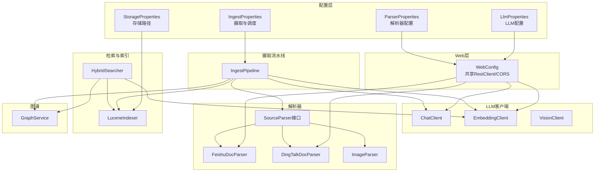
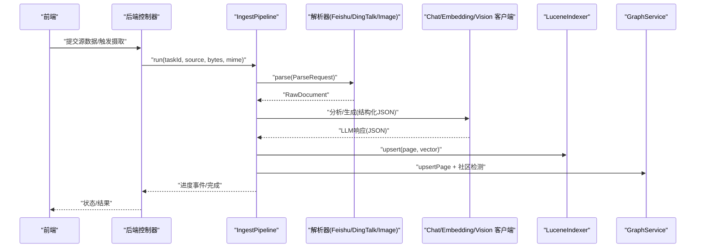
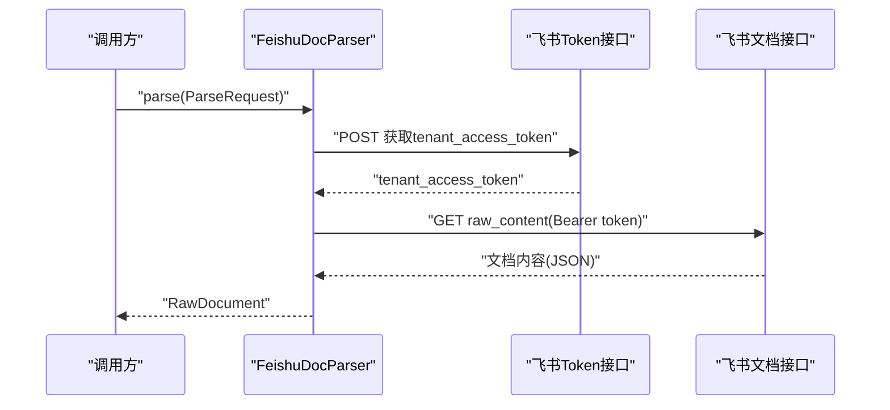
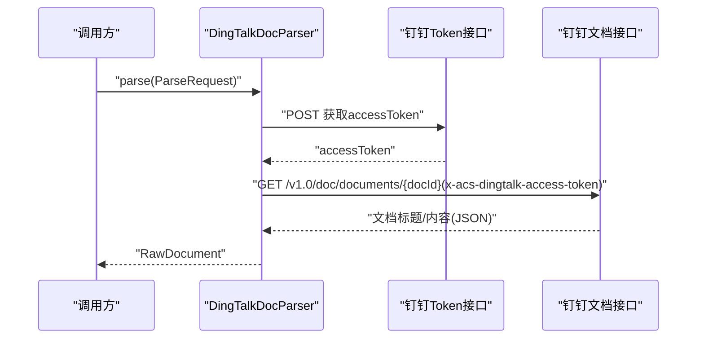
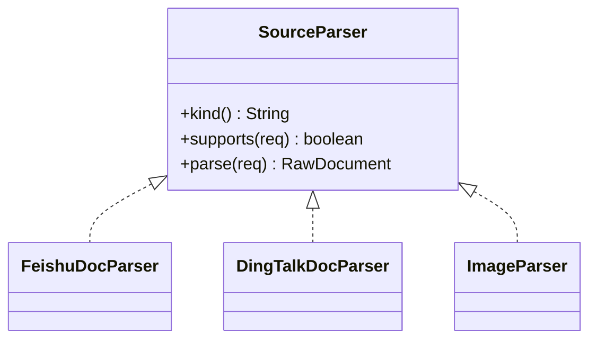

# 第三方集成

<cite>
**本文引用的文件**
- [application.yml](file://src/main/resources/application.yml)
- [WebConfig.java](file://src/main/java/com/example/llmwiki/config/WebConfig.java)
- [LlmProperties.java](file://src/main/java/com/example/llmwiki/config/LlmProperties.java)
- [StorageProperties.java](file://src/main/java/com/example/llmwiki/config/StorageProperties.java)
- [IngestProperties.java](file://src/main/java/com/example/llmwiki/config/IngestProperties.java)
- [ParserProperties.java](file://src/main/java/com/example/llmwiki/config/ParserProperties.java)
- [ChatClient.java](file://src/main/java/com/example/llmwiki/llm/ChatClient.java)
- [EmbeddingClient.java](file://src/main/java/com/example/llmwiki/llm/EmbeddingClient.java)
- [VisionClient.java](file://src/main/java/com/example/llmwiki/llm/VisionClient.java)
- [FeishuDocParser.java](file://src/main/java/com/example/llmwiki/parser/impl/FeishuDocParser.java)
- [DingTalkDocParser.java](file://src/main/java/com/example/llmwiki/parser/impl/DingTalkDocParser.java)
- [ImageParser.java](file://src/main/java/com/example/llmwiki/parser/impl/ImageParser.java)
- [SourceParser.java](file://src/main/java/com/example/llmwiki/parser/SourceParser.java)
- [IngestPipeline.java](file://src/main/java/com/example/llmwiki/ingest/IngestPipeline.java)
- [HybridSearcher.java](file://src/main/java/com/example/llmwiki/retrieval/HybridSearcher.java)
- [LuceneIndexer.java](file://src/main/java/com/example/llmwiki/retrieval/LuceneIndexer.java)
- [GraphService.java](file://src/main/java/com/example/llmwiki/graph/GraphService.java)
- [http.ts](file://web/src/api/http.ts)
</cite>

## 目录
1. [简介](#简介)
2. [项目结构](#项目结构)
3. [核心组件](#核心组件)
4. [架构总览](#架构总览)
5. [详细组件分析](#详细组件分析)
6. [依赖分析](#依赖分析)
7. [性能考虑](#性能考虑)
8. [故障排查指南](#故障排查指南)
9. [结论](#结论)
10. [附录](#附录)

## 简介
本指南面向“LLM Wiki”项目的第三方集成开发，聚焦以下主题：
- 外部API集成模式：HTTP客户端配置、认证机制、请求/响应处理、错误与重试策略
- 协作平台集成：飞书文档、钉钉文档、API权限管理、数据同步机制
- OCR服务集成：图像预处理、OCR引擎配置、文本提取优化、结果后处理
- 搜索引擎集成：Elasticsearch/Solr适配与自定义搜索引擎适配思路
- 集成测试策略：Mock服务、集成测试环境、性能基准测试
- 完整集成开发示例：配置文件、客户端实现、异常处理的参考路径

## 项目结构
后端采用Spring Boot工程，核心模块按职责分层：
- 配置层：集中管理存储、LLM、解析器、调度与摄取参数
- LLM层：封装Chat/Embedding/Vision客户端，统一OpenAI兼容协议
- 解析层：多源解析器（飞书、钉钉、图片等），统一SourceParser接口
- 摄入流水线：解析→分析→生成→索引/图谱的两步式CoT流程
- 检索层：混合检索（BM25+向量KNN）与Lucene索引
- 图谱层：内存图+JSON持久化，支持社区检测与结构性洞察

图表来源
- [WebConfig.java:15-34](file://src/main/java/com/example/llmwiki/config/WebConfig.java#L15-L34)
- [LlmProperties.java:16-62](file://src/main/java/com/example/llmwiki/config/LlmProperties.java#L16-L62)
- [ParserProperties.java:13-45](file://src/main/java/com/example/llmwiki/config/ParserProperties.java#L13-L45)
- [StorageProperties.java:13-28](file://src/main/java/com/example/llmwiki/config/StorageProperties.java#L13-L28)
- [IngestProperties.java:13-32](file://src/main/java/com/example/llmwiki/config/IngestProperties.java#L13-L32)
- [ChatClient.java:25-107](file://src/main/java/com/example/llmwiki/llm/ChatClient.java#L25-L107)
- [EmbeddingClient.java:23-89](file://src/main/java/com/example/llmwiki/llm/EmbeddingClient.java#L23-L89)
- [FeishuDocParser.java:29-100](file://src/main/java/com/example/llmwiki/parser/impl/FeishuDocParser.java#L29-L100)
- [DingTalkDocParser.java:28-100](file://src/main/java/com/example/llmwiki/parser/impl/DingTalkDocParser.java#L28-L100)
- [ImageParser.java:23-70](file://src/main/java/com/example/llmwiki/parser/impl/ImageParser.java#L23-L70)
- [SourceParser.java:11-21](file://src/main/java/com/example/llmwiki/parser/SourceParser.java#L11-L21)
- [IngestPipeline.java:45-250](file://src/main/java/com/example/llmwiki/ingest/IngestPipeline.java#L45-L250)
- [HybridSearcher.java:31-136](file://src/main/java/com/example/llmwiki/retrieval/HybridSearcher.java#L31-L136)
- [LuceneIndexer.java:36-117](file://src/main/java/com/example/llmwiki/retrieval/LuceneIndexer.java#L36-L117)
- [GraphService.java:34-196](file://src/main/java/com/example/llmwiki/graph/GraphService.java#L34-L196)

章节来源
- [application.yml:1-84](file://src/main/resources/application.yml#L1-L84)
- [WebConfig.java:15-34](file://src/main/java/com/example/llmwiki/config/WebConfig.java#L15-L34)

## 核心组件
- HTTP客户端与CORS：通过共享RestClient与CORS配置，统一外部API访问与跨域策略
- LLM客户端：Chat/Embedding/Vision三类客户端，均基于OpenAI兼容协议，支持鉴权头与超时控制
- 解析器：飞书/钉钉文档解析器负责凭据换取与内容拉取；图片解析器支持Vision能力或回退元信息
- 摄入流水线：两步式CoT（分析→生成），结合增量校验、进度事件与异常处理
- 检索与索引：混合检索（BM25+KNN）与Lucene索引，支持向量维度对齐与持久化
- 图谱服务：内存图+JSON快照，支持社区检测与结构性洞察

章节来源
- [WebConfig.java:15-34](file://src/main/java/com/example/llmwiki/config/WebConfig.java#L15-L34)
- [ChatClient.java:25-107](file://src/main/java/com/example/llmwiki/llm/ChatClient.java#L25-L107)
- [EmbeddingClient.java:23-89](file://src/main/java/com/example/llmwiki/llm/EmbeddingClient.java#L23-L89)
- [FeishuDocParser.java:29-100](file://src/main/java/com/example/llmwiki/parser/impl/FeishuDocParser.java#L29-L100)
- [DingTalkDocParser.java:28-100](file://src/main/java/com/example/llmwiki/parser/impl/DingTalkDocParser.java#L28-L100)
- [ImageParser.java:23-70](file://src/main/java/com/example/llmwiki/parser/impl/ImageParser.java#L23-L70)
- [IngestPipeline.java:45-250](file://src/main/java/com/example/llmwiki/ingest/IngestPipeline.java#L45-L250)
- [HybridSearcher.java:31-136](file://src/main/java/com/example/llmwiki/retrieval/HybridSearcher.java#L31-L136)
- [LuceneIndexer.java:36-117](file://src/main/java/com/example/llmwiki/retrieval/LuceneIndexer.java#L36-L117)
- [GraphService.java:34-196](file://src/main/java/com/example/llmwiki/graph/GraphService.java#L34-L196)

## 架构总览
下图展示从前端到后端、再到外部API与搜索引擎的整体调用链路。

图表来源
- [IngestPipeline.java:65-109](file://src/main/java/com/example/llmwiki/ingest/IngestPipeline.java#L65-L109)
- [FeishuDocParser.java:52-83](file://src/main/java/com/example/llmwiki/parser/impl/FeishuDocParser.java#L52-L83)
- [DingTalkDocParser.java:51-83](file://src/main/java/com/example/llmwiki/parser/impl/DingTalkDocParser.java#L51-L83)
- [ImageParser.java:47-69](file://src/main/java/com/example/llmwiki/parser/impl/ImageParser.java#L47-L69)
- [ChatClient.java:50-86](file://src/main/java/com/example/llmwiki/llm/ChatClient.java#L50-L86)
- [EmbeddingClient.java:42-81](file://src/main/java/com/example/llmwiki/llm/EmbeddingClient.java#L42-L81)
- [LuceneIndexer.java:77-99](file://src/main/java/com/example/llmwiki/retrieval/LuceneIndexer.java#L77-L99)
- [GraphService.java:71-104](file://src/main/java/com/example/llmwiki/graph/GraphService.java#L71-L104)

## 详细组件分析

### HTTP客户端配置与CORS
- 共享RestClient：在WebConfig中定义，供所有HTTP调用复用，减少连接开销
- CORS策略：允许任意来源、方法与头部，并允许携带凭证
- 前端HTTP客户端：基础URL指向后端“/api”，统一拦截器处理错误

章节来源
- [WebConfig.java:15-34](file://src/main/java/com/example/llmwiki/config/WebConfig.java#L15-L34)
- [http.ts:1-16](file://web/src/api/http.ts#L1-L16)

### 认证机制实现
- LLM客户端统一通过Authorization头传递API Key
- 飞书/钉钉解析器分别调用各自token接口，成功后以Bearer Token访问文档内容
- 配置项集中于application.yml与对应Properties类，支持热更新

章节来源
- [ChatClient.java:66-74](file://src/main/java/com/example/llmwiki/llm/ChatClient.java#L66-L74)
- [EmbeddingClient.java:54-61](file://src/main/java/com/example/llmwiki/llm/EmbeddingClient.java#L54-L61)
- [FeishuDocParser.java:85-99](file://src/main/java/com/example/llmwiki/parser/impl/FeishuDocParser.java#L85-L99)
- [DingTalkDocParser.java:85-99](file://src/main/java/com/example/llmwiki/parser/impl/DingTalkDocParser.java#L85-L99)
- [application.yml:31-77](file://src/main/resources/application.yml#L31-L77)

### 请求/响应处理与错误处理
- 统一响应体解析：Jackson将响应映射为JsonNode，判空与字段存在性校验
- 异常包装：业务异常统一抛出ParserException/IngestException/LlmException
- 前端错误拦截：axios拦截器统一记录错误并拒绝Promise

章节来源
- [FeishuDocParser.java:63-82](file://src/main/java/com/example/llmwiki/parser/impl/FeishuDocParser.java#L63-L82)
- [DingTalkDocParser.java:62-82](file://src/main/java/com/example/llmwiki/parser/impl/DingTalkDocParser.java#L62-L82)
- [ChatClient.java:76-85](file://src/main/java/com/example/llmwiki/llm/ChatClient.java#L76-L85)
- [EmbeddingClient.java:63-80](file://src/main/java/com/example/llmwiki/llm/EmbeddingClient.java#L63-L80)
- [http.ts:8-14](file://web/src/api/http.ts#L8-L14)

### 错误重试策略
- 当前实现未内置自动重试逻辑；建议在共享RestClient上增加重试配置或在调用侧包装重试
- 可参考摄取配置中的maxRetry参数作为扩展点，结合幂等设计实现重试

章节来源
- [IngestProperties.java:22-25](file://src/main/java/com/example/llmwiki/config/IngestProperties.java#L22-L25)

### 协作平台集成：飞书文档
- 凭据：app_id + app_secret
- 步骤：获取tenant_access_token → 调用文档raw_content接口 → 提取content并归一化
- 异常：未启用/未配置、token获取失败、返回异常均抛出ParserException

图表来源
- [FeishuDocParser.java:52-83](file://src/main/java/com/example/llmwiki/parser/impl/FeishuDocParser.java#L52-L83)
- [FeishuDocParser.java:85-99](file://src/main/java/com/example/llmwiki/parser/impl/FeishuDocParser.java#L85-L99)

章节来源
- [FeishuDocParser.java:29-100](file://src/main/java/com/example/llmwiki/parser/impl/FeishuDocParser.java#L29-L100)
- [ParserProperties.java:22-27](file://src/main/java/com/example/llmwiki/config/ParserProperties.java#L22-L27)
- [application.yml:58-66](file://src/main/resources/application.yml#L58-L66)

### 协作平台集成：钉钉文档
- 凭据：app_key + app_secret
- 步骤：获取accessToken → 调用/v1.0/doc/documents/{docId} → 组装Markdown标题与内容
- 异常：未启用/未配置、token获取失败、返回为空均抛出ParserException

图表来源
- [DingTalkDocParser.java:51-83](file://src/main/java/com/example/llmwiki/parser/impl/DingTalkDocParser.java#L51-L83)
- [DingTalkDocParser.java:85-99](file://src/main/java/com/example/llmwiki/parser/impl/DingTalkDocParser.java#L85-L99)

章节来源
- [DingTalkDocParser.java:28-100](file://src/main/java/com/example/llmwiki/parser/impl/DingTalkDocParser.java#L28-L100)
- [ParserProperties.java:30-34](file://src/main/java/com/example/llmwiki/config/ParserProperties.java#L30-L34)
- [application.yml:63-66](file://src/main/resources/application.yml#L63-L66)

### API权限管理与数据同步
- 权限管理：各平台均通过独立配置开关与凭据字段控制启用状态
- 数据同步：IngestPipeline执行增量校验（contentHash），避免重复处理；完成后更新SourceRecord的lastFetchedAt与contentHash

章节来源
- [IngestPipeline.java:76-104](file://src/main/java/com/example/llmwiki/ingest/IngestPipeline.java#L76-L104)
- [application.yml:58-77](file://src/main/resources/application.yml#L58-L77)

### OCR服务集成方案
- 配置：ParserProperties中提供ocr.enabled、data-path、lang
- 实现思路：图片解析器优先调用VisionClient生成caption；若未启用，则仅记录元信息
- 优化建议：图像预处理（缩放、去噪）、OCR引擎参数（语言、页数）、结果后处理（去噪、段落合并）

章节来源
- [ParserProperties.java:36-44](file://src/main/java/com/example/llmwiki/config/ParserProperties.java#L36-L44)
- [ImageParser.java:47-69](file://src/main/java/com/example/llmwiki/parser/impl/ImageParser.java#L47-L69)
- [VisionClient.java](file://src/main/java/com/example/llmwiki/llm/VisionClient.java)

### 搜索引擎集成：Elasticsearch/Solr与自定义适配
- 现状：项目使用Lucene进行全文与向量检索，未直接集成Elasticsearch/Solr
- 适配思路：
  - 将Elasticsearch/Solr查询DSL映射为统一检索接口
  - 保持与HybridSearcher/SearchHit一致的数据结构
  - 在索引阶段将向量写入Elasticsearch/Solr的向量字段

章节来源
- [HybridSearcher.java:31-136](file://src/main/java/com/example/llmwiki/retrieval/HybridSearcher.java#L31-L136)
- [LuceneIndexer.java:36-117](file://src/main/java/com/example/llmwiki/retrieval/LuceneIndexer.java#L36-L117)

### 集成测试策略
- Mock服务：使用RestClient配合Mock服务器模拟外部API行为
- 集成测试环境：通过application.yml切换不同环境配置（如base-url、超时）
- 性能基准测试：对LLM调用、OCR处理、索引写入进行压测，关注吞吐与延迟

章节来源
- [application.yml:31-77](file://src/main/resources/application.yml#L31-L77)
- [WebConfig.java:30-33](file://src/main/java/com/example/llmwiki/config/WebConfig.java#L30-L33)

## 依赖分析
- 组件耦合：解析器通过SourceParser接口解耦；LLM客户端与HTTP客户端解耦；索引与检索通过LuceneIndexer抽象
- 外部依赖：RestClient、Jackson、Apache Lucene、Spring Web MVC
- 配置依赖：application.yml与各Properties类绑定，支持运行时热更新

图表来源
- [SourceParser.java:11-21](file://src/main/java/com/example/llmwiki/parser/SourceParser.java#L11-L21)
- [FeishuDocParser.java:33](file://src/main/java/com/example/llmwiki/parser/impl/FeishuDocParser.java#L33)
- [DingTalkDocParser.java:32](file://src/main/java/com/example/llmwiki/parser/impl/DingTalkDocParser.java#L32)
- [ImageParser.java:27](file://src/main/java/com/example/llmwiki/parser/impl/ImageParser.java#L27)

章节来源
- [SourceParser.java:11-21](file://src/main/java/com/example/llmwiki/parser/SourceParser.java#L11-L21)
- [FeishuDocParser.java:33-100](file://src/main/java/com/example/llmwiki/parser/impl/FeishuDocParser.java#L33-L100)
- [DingTalkDocParser.java:32-100](file://src/main/java/com/example/llmwiki/parser/impl/DingTalkDocParser.java#L32-L100)
- [ImageParser.java:27-70](file://src/main/java/com/example/llmwiki/parser/impl/ImageParser.java#L27-L70)

## 性能考虑
- HTTP复用：通过共享RestClient降低连接建立成本
- 超时控制：LLM配置提供timeoutSeconds，避免阻塞
- 索引优化：批量写入、向量维度对齐、中文分词器
- 摄取并发：workerThreads与maxRetry可调，结合幂等设计提升稳定性

章节来源
- [WebConfig.java:30-33](file://src/main/java/com/example/llmwiki/config/WebConfig.java#L30-L33)
- [LlmProperties.java:31-42](file://src/main/java/com/example/llmwiki/config/LlmProperties.java#L31-L42)
- [IngestProperties.java:22-25](file://src/main/java/com/example/llmwiki/config/IngestProperties.java#L22-L25)
- [LuceneIndexer.java:77-99](file://src/main/java/com/example/llmwiki/retrieval/LuceneIndexer.java#L77-L99)

## 故障排查指南
- 飞书/钉钉解析失败：检查enabled与凭据是否正确；确认token接口与文档接口可达；查看ParserException错误信息
- LLM调用失败：检查API Key、base-url、超时设置；查看LlmException错误栈
- OCR未生效：确认ParserProperties中ocr.enabled与data-path/lang配置
- 检索异常：确认Embedding可用性；回退至BM25模式；检查向量维度一致性

章节来源
- [FeishuDocParser.java:55-58](file://src/main/java/com/example/llmwiki/parser/impl/FeishuDocParser.java#L55-L58)
- [DingTalkDocParser.java:53-57](file://src/main/java/com/example/llmwiki/parser/impl/DingTalkDocParser.java#L53-L57)
- [ChatClient.java:52-54](file://src/main/java/com/example/llmwiki/llm/ChatClient.java#L52-L54)
- [EmbeddingClient.java:44-46](file://src/main/java/com/example/llmwiki/llm/EmbeddingClient.java#L44-L46)
- [ParserProperties.java:36-44](file://src/main/java/com/example/llmwiki/config/ParserProperties.java#L36-L44)
- [HybridSearcher.java:82-86](file://src/main/java/com/example/llmwiki/retrieval/HybridSearcher.java#L82-L86)

## 结论
本项目提供了完善的第三方集成基础：统一的HTTP客户端、OpenAI兼容的LLM客户端、多源解析器与可扩展的摄取流水线。建议在此基础上补充：
- 明确的重试与熔断策略
- OCR与Vision的参数化配置
- 搜索引擎适配的抽象层
- 更丰富的集成测试与性能监控

## 附录
- 配置文件参考路径
  - [application.yml](file://src/main/resources/application.yml)
  - [LlmProperties.java](file://src/main/java/com/example/llmwiki/config/LlmProperties.java)
  - [ParserProperties.java](file://src/main/java/com/example/llmwiki/config/ParserProperties.java)
  - [StorageProperties.java](file://src/main/java/com/example/llmwiki/config/StorageProperties.java)
  - [IngestProperties.java](file://src/main/java/com/example/llmwiki/config/IngestProperties.java)
- 客户端实现参考路径
  - [WebConfig.java](file://src/main/java/com/example/llmwiki/config/WebConfig.java)
  - [ChatClient.java](file://src/main/java/com/example/llmwiki/llm/ChatClient.java)
  - [EmbeddingClient.java](file://src/main/java/com/example/llmwiki/llm/EmbeddingClient.java)
  - [VisionClient.java](file://src/main/java/com/example/llmwiki/llm/VisionClient.java)
- 解析器实现参考路径
  - [FeishuDocParser.java](file://src/main/java/com/example/llmwiki/parser/impl/FeishuDocParser.java)
  - [DingTalkDocParser.java](file://src/main/java/com/example/llmwiki/parser/impl/DingTalkDocParser.java)
  - [ImageParser.java](file://src/main/java/com/example/llmwiki/parser/impl/ImageParser.java)
  - [SourceParser.java](file://src/main/java/com/example/llmwiki/parser/SourceParser.java)
- 摄入与检索参考路径
  - [IngestPipeline.java](file://src/main/java/com/example/llmwiki/ingest/IngestPipeline.java)
  - [HybridSearcher.java](file://src/main/java/com/example/llmwiki/retrieval/HybridSearcher.java)
  - [LuceneIndexer.java](file://src/main/java/com/example/llmwiki/retrieval/LuceneIndexer.java)
  - [GraphService.java](file://src/main/java/com/example/llmwiki/graph/GraphService.java)
- 前端HTTP客户端参考路径
  - [http.ts](file://web/src/api/http.ts)