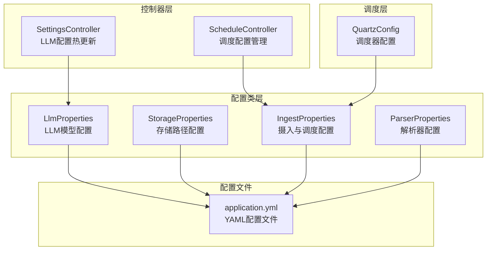
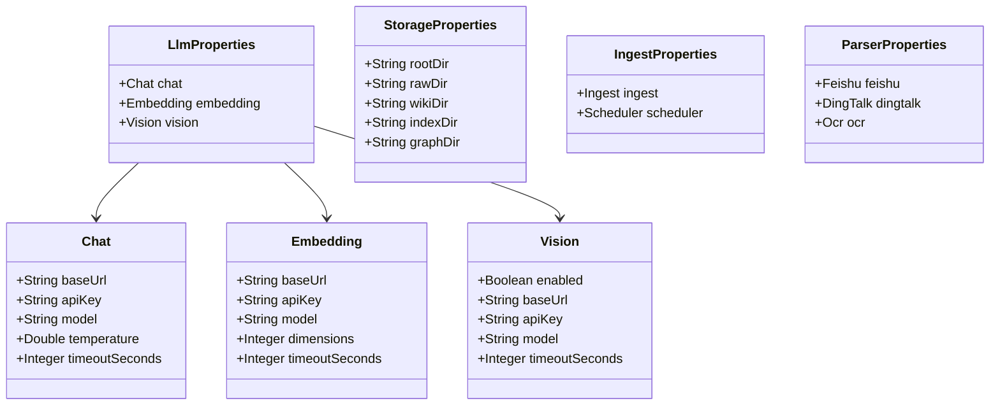
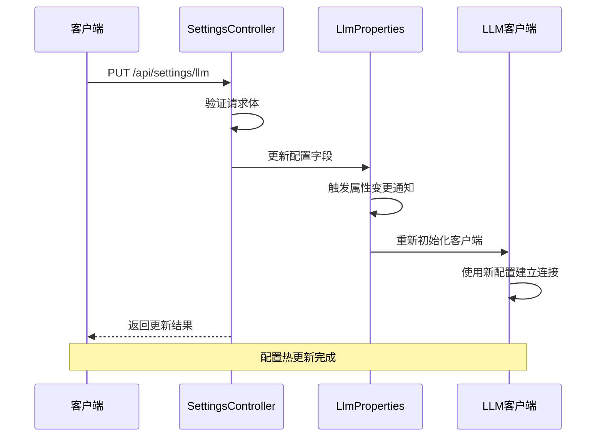
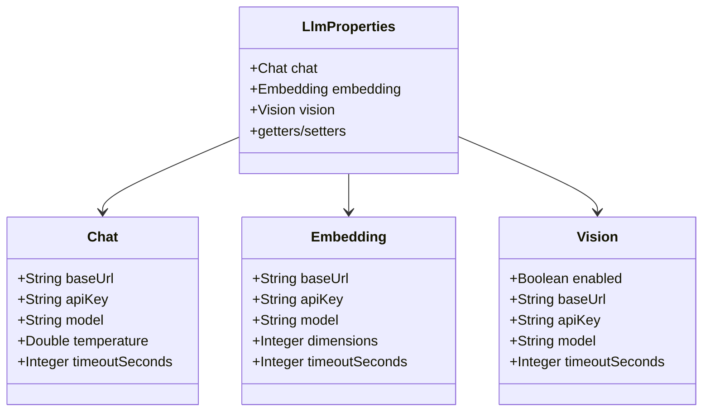
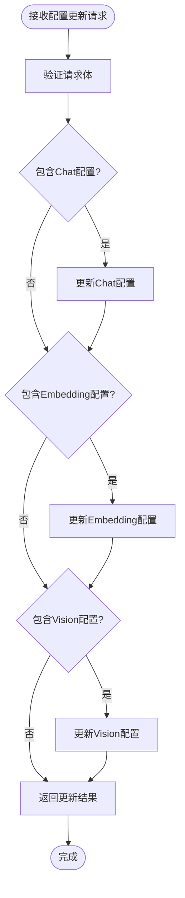
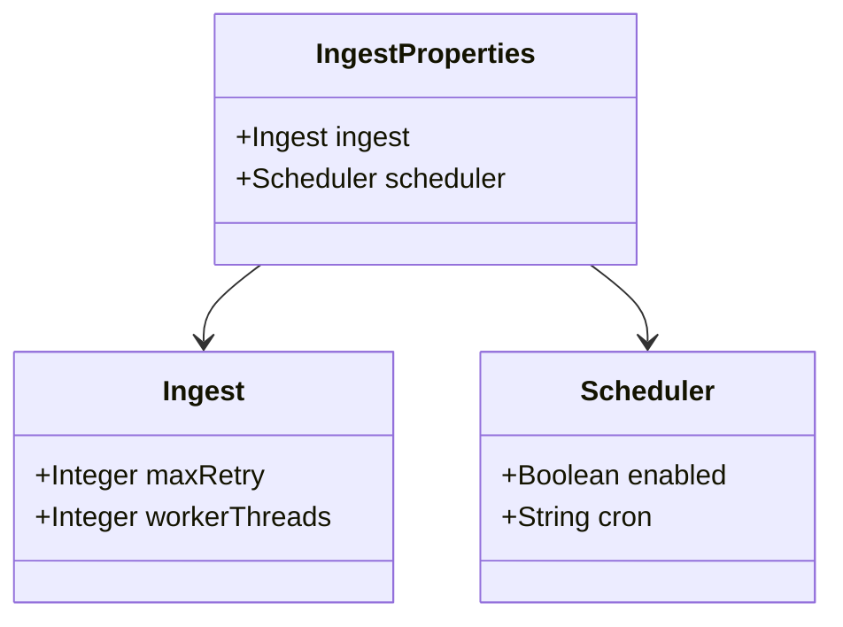

# 配置扩展

<cite>
**本文档引用的文件**
- [LlmProperties.java](file://src/main/java/com/example/llmwiki/config/LlmProperties.java)
- [StorageProperties.java](file://src/main/java/com/example/llmwiki/config/StorageProperties.java)
- [IngestProperties.java](file://src/main/java/com/example/llmwiki/config/IngestProperties.java)
- [ParserProperties.java](file://src/main/java/com/example/llmwiki/config/ParserProperties.java)
- [WebConfig.java](file://src/main/java/com/example/llmwiki/config/WebConfig.java)
- [SettingsController.java](file://src/main/java/com/example/llmwiki/api/SettingsController.java)
- [QuartzConfig.java](file://src/main/java/com/example/llmwiki/scheduler/QuartzConfig.java)
- [ScheduleController.java](file://src/main/java/com/example/llmwiki/api/ScheduleController.java)
- [application.yml](file://src/main/resources/application.yml)
- [LlmWikiApplication.java](file://src/main/java/com/example/llmwiki/LlmWikiApplication.java)
- [pom.xml](file://pom.xml)
</cite>

## 目录
1. [简介](#简介)
2. [项目结构](#项目结构)
3. [核心组件](#核心组件)
4. [架构概览](#架构概览)
5. [详细组件分析](#详细组件分析)
6. [依赖分析](#依赖分析)
7. [性能考虑](#性能考虑)
8. [故障排除指南](#故障排除指南)
9. [结论](#结论)
10. [附录](#附录)

## 简介

本指南面向LLM Wiki项目的配置扩展开发，详细说明如何在现有Spring Boot配置体系基础上添加新的配置项。LLM Wiki项目采用标准的Spring Boot配置绑定模式，通过@ConfigurationProperties注解将application.yml中的配置映射到Java对象中，支持运行时热更新和分组管理。

该项目展示了现代微服务架构中的配置管理最佳实践，包括：
- 配置类层次设计和命名空间管理
- 类型安全的配置绑定机制
- 运行时配置热更新实现
- 配置分组管理和继承关系
- 配置安全性考虑

## 项目结构

LLM Wiki项目的配置相关文件主要分布在以下位置：



**图表来源**
- [LlmProperties.java:1-63](file://src/main/java/com/example/llmwiki/config/LlmProperties.java#L1-L63)
- [StorageProperties.java:1-29](file://src/main/java/com/example/llmwiki/config/StorageProperties.java#L1-L29)
- [IngestProperties.java:1-33](file://src/main/java/com/example/llmwiki/config/IngestProperties.java#L1-L33)
- [ParserProperties.java:1-46](file://src/main/java/com/example/llmwiki/config/ParserProperties.java#L1-L46)

**章节来源**
- [LlmWikiApplication.java:19-22](file://src/main/java/com/example/llmwiki/LlmWikiApplication.java#L19-L22)
- [application.yml:1-84](file://src/main/resources/application.yml#L1-L84)

## 核心组件

### 配置类层次结构

LLM Wiki项目采用分层配置类设计，每个配置类负责特定的功能领域：



**图表来源**
- [LlmProperties.java:16-63](file://src/main/java/com/example/llmwiki/config/LlmProperties.java#L16-L63)
- [StorageProperties.java:13-29](file://src/main/java/com/example/llmwiki/config/StorageProperties.java#L13-L29)
- [IngestProperties.java:13-33](file://src/main/java/com/example/llmwiki/config/IngestProperties.java#L13-L33)
- [ParserProperties.java:13-46](file://src/main/java/com/example/llmwiki/config/ParserProperties.java#L13-L46)

### 配置绑定机制

项目使用Spring Boot的标准配置绑定机制，通过@ConfigurationProperties注解实现：

| 组件 | 前缀 | 默认值 | 类型 |
|------|------|--------|------|
| LlmProperties | llm-wiki.llm | 内置默认值 | Chat/Embedding/Vision |
| StorageProperties | llm-wiki.storage | ./data系列路径 | 字符串路径 |
| IngestProperties | llm-wiki | maxRetry=3, workerThreads=1 | 整数配置 |
| ParserProperties | llm-wiki.parser | false/false/空字符串 | 布尔值/字符串 |

**章节来源**
- [LlmProperties.java:16-18](file://src/main/java/com/example/llmwiki/config/LlmProperties.java#L16-L18)
- [StorageProperties.java:13-15](file://src/main/java/com/example/llmwiki/config/StorageProperties.java#L13-L15)
- [IngestProperties.java:13-15](file://src/main/java/com/example/llmwiki/config/IngestProperties.java#L13-L15)
- [ParserProperties.java:13-15](file://src/main/java/com/example/llmwiki/config/ParserProperties.java#L13-L15)

## 架构概览

LLM Wiki的配置系统采用分层架构，实现了配置的模块化管理和运行时热更新：



**图表来源**
- [SettingsController.java:39-51](file://src/main/java/com/example/llmwiki/api/SettingsController.java#L39-L51)
- [LlmProperties.java:16-18](file://src/main/java/com/example/llmwiki/config/LlmProperties.java#L16-L18)

## 详细组件分析

### LLM配置扩展

#### 配置类设计

LLM配置采用嵌套类设计，支持Chat、Embedding、Vision三种模型类型的独立配置：



**图表来源**
- [LlmProperties.java:19-61](file://src/main/java/com/example/llmwiki/config/LlmProperties.java#L19-L61)

#### 配置绑定流程

配置绑定通过以下步骤实现：

1. **属性类创建**：使用@Data注解自动生成getter/setter方法
2. **注解配置**：@ConfigurationProperties(prefix="llm-wiki.llm")指定配置前缀
3. **默认值设置**：在属性声明时提供合理的默认值
4. **类型转换**：Spring Boot自动处理基本数据类型转换

#### 运行时热更新实现

SettingsController提供了完整的配置热更新功能：



**图表来源**
- [SettingsController.java:39-51](file://src/main/java/com/example/llmwiki/api/SettingsController.java#L39-L51)

**章节来源**
- [SettingsController.java:24-71](file://src/main/java/com/example/llmwiki/api/SettingsController.java#L24-L71)

### 存储配置管理

StorageProperties负责管理所有数据存储路径：

| 配置项 | 默认值 | 用途 |
|--------|--------|------|
| root-dir | ./data | 数据根目录 |
| raw-dir | ./data/raw | 原始资料目录 |
| wiki-dir | ./data/wiki | Wiki Markdown输出目录 |
| index-dir | ./data/index | Lucene索引目录 |
| graph-dir | ./data/graph | 图谱持久化目录 |

**章节来源**
- [StorageProperties.java:13-28](file://src/main/java/com/example/llmwiki/config/StorageProperties.java#L13-L28)

### 摄入与调度配置

IngestProperties采用分层设计，支持独立的摄取和调度配置：



**图表来源**
- [IngestProperties.java:16-31](file://src/main/java/com/example/llmwiki/config/IngestProperties.java#L16-L31)

**章节来源**
- [IngestProperties.java:13-32](file://src/main/java/com/example/llmwiki/config/IngestProperties.java#L13-L32)

### 解析器配置扩展

ParserProperties支持多种文档解析器的配置：

| 解析器 | 配置项 | 默认值 | 用途 |
|--------|--------|--------|------|
| 飞书 | enabled/appId/appSecret | false/空字符串 | 飞书文档解析 |
| 钉钉 | enabled/appKey/appSecret | false/空字符串 | 钉钉文档解析 |
| OCR | enabled/dataPath/lang | false/空字符串/chi_sim+eng | 光学字符识别 |

**章节来源**
- [ParserProperties.java:13-45](file://src/main/java/com/example/llmwiki/config/ParserProperties.java#L13-L45)

## 依赖分析

### 配置绑定依赖

LLM Wiki项目的核心依赖关系如下：

```mermaid
graph TB
subgraph "Spring Boot配置绑定"
A[@ConfigurationProperties]
B[@Configuration]
C[@Data]
end
subgraph "配置类"
D[LlmProperties]
E[StorageProperties]
F[IngestProperties]
G[ParserProperties]
end
subgraph "控制器"
H[SettingsController]
I[ScheduleController]
end
subgraph "外部依赖"
J[Spring Web]
K[Spring Data JPA]
L[Spring Quartz]
end
A --> D
A --> E
A --> F
A --> G
B --> D
B --> E
B --> F
B --> G
C --> D
C --> E
C --> F
C --> G
H --> D
I --> F
D --> J
F --> K
F --> L
```

**图表来源**
- [LlmProperties.java:3-5](file://src/main/java/com/example/llmwiki/config/LlmProperties.java#L3-L5)
- [SettingsController.java:3,30:3-3](file://src/main/java/com/example/llmwiki/api/SettingsController.java#L3-L3)
- [pom.xml:38-53](file://pom.xml#L38-L53)

### Maven依赖配置

项目使用Spring Boot Starter简化配置管理：

| Starter | 功能 | 版本 |
|---------|------|------|
| spring-boot-starter-web | Web应用 | 3.3.5 |
| spring-boot-starter-data-jpa | 数据访问 | 3.3.5 |
| spring-boot-starter-quartz | 调度任务 | 3.3.5 |
| spring-boot-starter-validation | 参数验证 | 3.3.5 |

**章节来源**
- [pom.xml:36-158](file://pom.xml#L36-L158)

## 性能考虑

### 配置加载性能

1. **延迟初始化**：配置类在首次使用时才进行绑定
2. **缓存机制**：Spring Boot自动缓存配置绑定结果
3. **类型转换优化**：基本数据类型转换开销最小

### 运行时热更新性能

1. **增量更新**：只更新发生变化的配置项
2. **原子性操作**：配置更新在单个事务中完成
3. **资源重用**：客户端连接在配置更新后重新初始化

## 故障排除指南

### 常见配置问题

| 问题类型 | 症状 | 解决方案 |
|----------|------|----------|
| 配置不生效 | 应用启动正常但配置未生效 | 检查@ConfigurationProperties注解是否正确 |
| 类型转换错误 | 启动时报类型转换异常 | 确保application.yml中的值类型与属性类型匹配 |
| 热更新失败 | PUT请求成功但配置未更新 | 检查控制器中的属性赋值逻辑 |
| 配置冲突 | 多个配置源冲突 | 按优先级顺序检查配置文件覆盖关系 |

### 调试技巧

1. **启用配置绑定日志**：设置`logging.level.org.springframework.boot.context.properties=DEBUG`
2. **验证配置映射**：通过GET请求检查当前配置状态
3. **单元测试**：为配置类编写集成测试验证绑定效果

**章节来源**
- [SettingsController.java:34-69](file://src/main/java/com/example/llmwiki/api/SettingsController.java#L34-L69)

## 结论

LLM Wiki项目的配置扩展开发遵循了Spring Boot的最佳实践，通过分层配置类设计、类型安全的配置绑定和运行时热更新机制，实现了灵活且可靠的配置管理。该架构为后续的功能扩展提供了良好的基础，开发者可以按照本文档的指导添加新的配置项，同时保持系统的稳定性和可维护性。

## 附录

### 配置扩展最佳实践

#### 命名规范
1. **配置前缀**：使用小写字母和连字符分隔的层级结构
2. **属性命名**：采用驼峰命名法，保持一致性
3. **默认值**：提供合理且安全的默认值

#### 配置文档编写
1. **配置项说明**：为每个配置项提供清晰的用途描述
2. **示例配置**：提供完整的application.yml示例
3. **验证规则**：明确配置的有效范围和约束条件

#### 配置迁移策略
1. **向后兼容**：新增配置项时保持默认值兼容
2. **配置升级**：提供配置版本管理和迁移脚本
3. **回滚机制**：确保配置更新失败时能够恢复到上一个版本

### 完整扩展示例

以下是一个完整的配置扩展示例，展示从属性类定义到配置文件使用的完整实现过程：

1. **创建配置类**：定义新的配置属性类，使用@ConfigurationProperties注解
2. **设置默认值**：在属性声明时提供合理的默认值
3. **配置YAML文件**：在application.yml中添加对应的配置项
4. **集成到业务逻辑**：在需要的地方注入配置类并使用配置值
5. **测试验证**：编写测试确保配置正确绑定和工作

这个示例展示了LLM Wiki项目中配置扩展的完整生命周期，为开发者提供了可直接参考的实现模板。