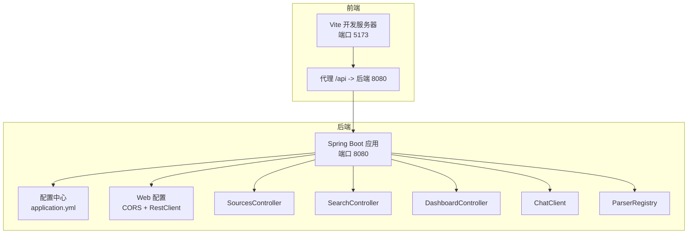
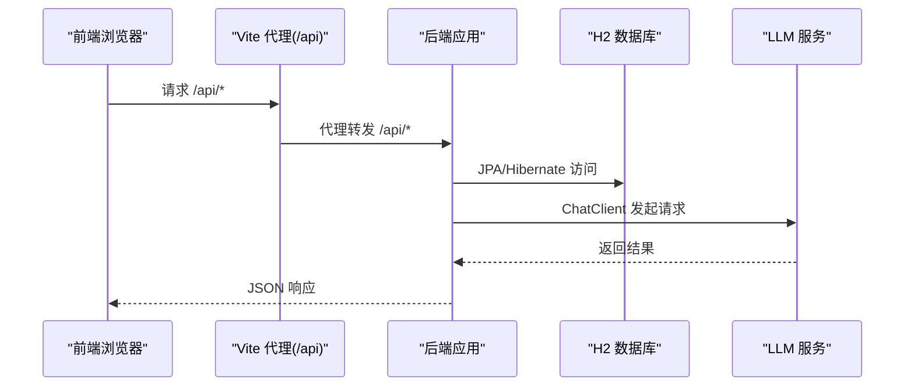
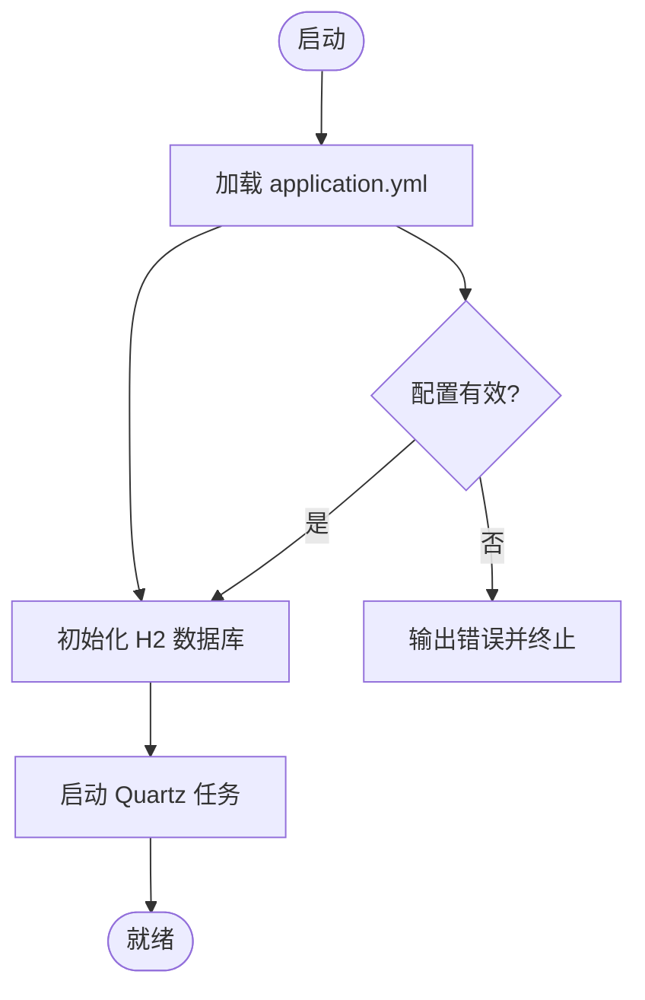
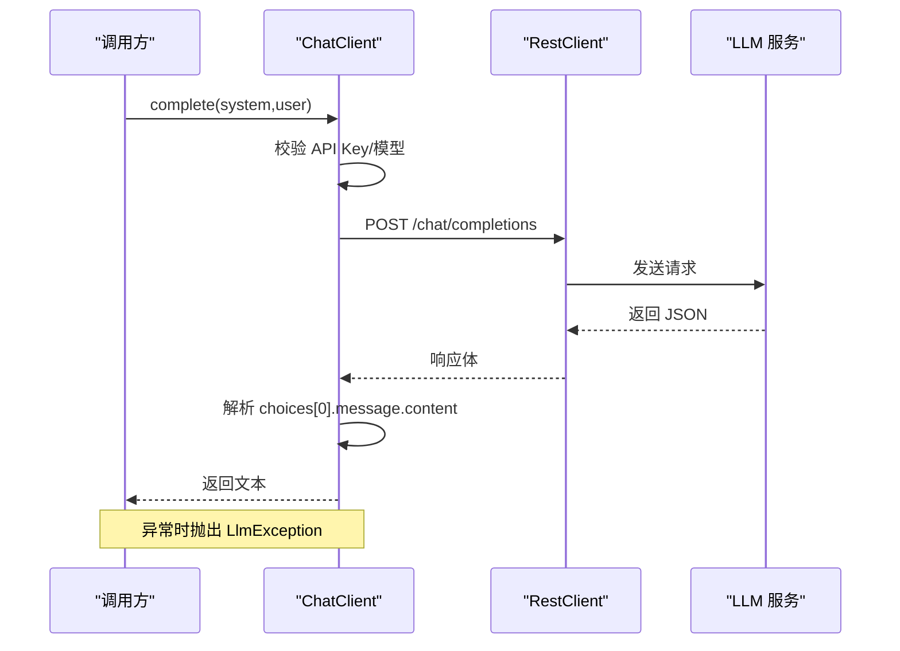
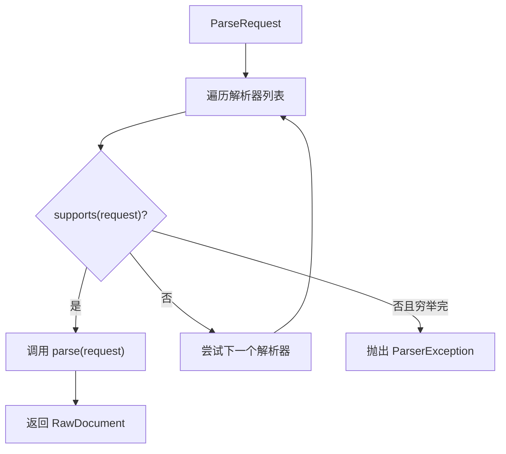
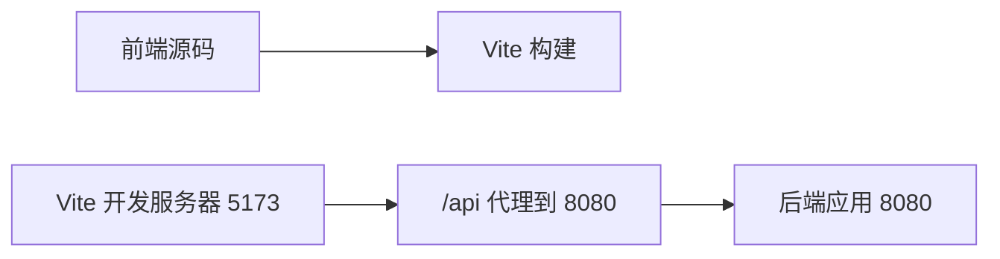
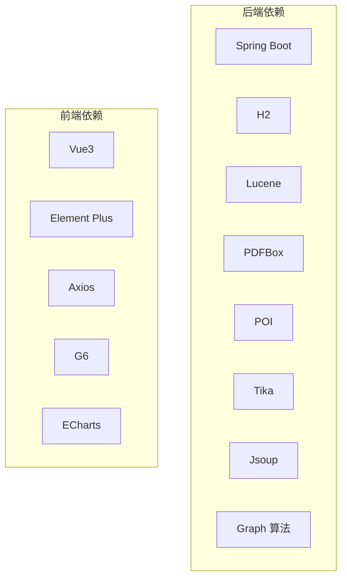

# 故障排除

<cite>
**本文引用的文件**
- [LlmWikiApplication.java](file://src/main/java/com/example/llmwiki/LlmWikiApplication.java)
- [application.yml](file://src/main/resources/application.yml)
- [pom.xml](file://pom.xml)
- [StorageProperties.java](file://src/main/java/com/example/llmwiki/config/StorageProperties.java)
- [LlmProperties.java](file://src/main/java/com/example/llmwiki/config/LlmProperties.java)
- [ParserProperties.java](file://src/main/java/com/example/llmwiki/config/ParserProperties.java)
- [IngestProperties.java](file://src/main/java/com/example/llmwiki/config/IngestProperties.java)
- [WebConfig.java](file://src/main/java/com/example/llmwiki/config/WebConfig.java)
- [ChatClient.java](file://src/main/java/com/example/llmwiki/llm/ChatClient.java)
- [LlmException.java](file://src/main/java/com/example/llmwiki/llm/LlmException.java)
- [ParserException.java](file://src/main/java/com/example/llmwiki/parser/ParserException.java)
- [IngestException.java](file://src/main/java/com/example/llmwiki/ingest/IngestException.java)
- [ParserRegistry.java](file://src/main/java/com/example/llmwiki/parser/ParserRegistry.java)
- [SourcesController.java](file://src/main/java/com/example/llmwiki/api/SourcesController.java)
- [SearchController.java](file://src/main/java/com/example/llmwiki/api/SearchController.java)
- [DashboardController.java](file://src/main/java/com/example/llmwiki/api/DashboardController.java)
- [package.json](file://web/package.json)
- [vite.config.ts](file://web/vite.config.ts)
</cite>

## 目录
1. [简介](#简介)
2. [项目结构](#项目结构)
3. [核心组件](#核心组件)
4. [架构总览](#架构总览)
5. [详细组件分析](#详细组件分析)
6. [依赖分析](#依赖分析)
7. [性能考虑](#性能考虑)
8. [故障排除指南](#故障排除指南)
9. [结论](#结论)
10. [附录](#附录)

## 简介
本指南面向 LLM Wiki 项目的运维与开发人员，聚焦于常见问题的定位与修复、调试技巧、性能诊断、错误代码参考、监控与告警、环境差异处理以及应急响应流程。内容基于仓库中的实际代码与配置进行梳理，帮助在启动失败、数据库连接、文件解析、LLM API 调用、前端构建等方面快速定位问题并给出可操作的建议。

## 项目结构
后端采用 Spring Boot，前端采用 Vue3 + Vite；配置集中在 application.yml 中，核心能力包括：文件/URL/远程源接入、多格式解析、向量检索、知识图谱、定时任务与评估报告等。

图表来源
- [vite.config.ts:1-23](file://web/vite.config.ts#L1-L23)
- [application.yml:1-84](file://src/main/resources/application.yml#L1-L84)
- [WebConfig.java:1-34](file://src/main/java/com/example/llmwiki/config/WebConfig.java#L1-L34)
- [SourcesController.java:1-101](file://src/main/java/com/example/llmwiki/api/SourcesController.java#L1-L101)
- [SearchController.java:1-32](file://src/main/java/com/example/llmwiki/api/SearchController.java#L1-L32)
- [DashboardController.java:1-48](file://src/main/java/com/example/llmwiki/api/DashboardController.java#L1-L48)
- [ChatClient.java:1-108](file://src/main/java/com/example/llmwiki/llm/ChatClient.java#L1-L108)
- [ParserRegistry.java:1-37](file://src/main/java/com/example/llmwiki/parser/ParserRegistry.java#L1-L37)

章节来源
- [LlmWikiApplication.java:1-29](file://src/main/java/com/example/llmwiki/LlmWikiApplication.java#L1-L29)
- [application.yml:1-84](file://src/main/resources/application.yml#L1-L84)
- [pom.xml:1-171](file://pom.xml#L1-L171)
- [vite.config.ts:1-23](file://web/vite.config.ts#L1-L23)

## 核心组件
- 配置层：存储目录、LLM 参数、解析器开关、调度与摄取参数、日志级别等，集中于 application.yml，并通过各属性类映射。
- 控制器层：对外提供 /api/* 接口，负责任务编排、搜索、仪表盘等。
- LLM 层：统一的 ChatClient 封装 OpenAI 兼容接口，异常统一为 LlmException。
- 解析层：ParserRegistry 按请求类型选择具体解析器，异常为 ParserException。
- 摄取层：IngestException 用于摄取阶段的异常表达。
- Web 层：CORS 放通与共享 RestClient，前端通过 /api 代理访问后端。

章节来源
- [StorageProperties.java:1-29](file://src/main/java/com/example/llmwiki/config/StorageProperties.java#L1-L29)
- [LlmProperties.java:1-63](file://src/main/java/com/example/llmwiki/config/LlmProperties.java#L1-L63)
- [ParserProperties.java:1-46](file://src/main/java/com/example/llmwiki/config/ParserProperties.java#L1-L46)
- [IngestProperties.java:1-33](file://src/main/java/com/example/llmwiki/config/IngestProperties.java#L1-L33)
- [WebConfig.java:1-34](file://src/main/java/com/example/llmwiki/config/WebConfig.java#L1-L34)
- [ChatClient.java:1-108](file://src/main/java/com/example/llmwiki/llm/ChatClient.java#L1-L108)
- [ParserRegistry.java:1-37](file://src/main/java/com/example/llmwiki/parser/ParserRegistry.java#L1-L37)
- [LlmException.java:1-19](file://src/main/java/com/example/llmwiki/llm/LlmException.java#L1-L19)
- [ParserException.java:1-19](file://src/main/java/com/example/llmwiki/parser/ParserException.java#L1-L19)
- [IngestException.java:1-18](file://src/main/java/com/example/llmwiki/ingest/IngestException.java#L1-L18)

## 架构总览
下图展示前后端交互与关键组件协作关系，便于定位“启动失败”“数据库连接”“前端构建错误”“LLM API 调用失败”等问题。

图表来源
- [vite.config.ts:13-21](file://web/vite.config.ts#L13-L21)
- [application.yml:11-29](file://src/main/resources/application.yml#L11-L29)
- [ChatClient.java:66-86](file://src/main/java/com/example/llmwiki/llm/ChatClient.java#L66-L86)

## 详细组件分析

### 组件一：启动与运行控制流
- 启动入口：Spring Boot 主类负责加载配置与开启异步/定时任务。
- 关键检查点：端口占用、JPA/H2 初始化、Quartz 线程池大小、日志级别。

图表来源
- [LlmWikiApplication.java:24-26](file://src/main/java/com/example/llmwiki/LlmWikiApplication.java#L24-L26)
- [application.yml:11-29](file://src/main/resources/application.yml#L11-L29)

章节来源
- [LlmWikiApplication.java:1-29](file://src/main/java/com/example/llmwiki/LlmWikiApplication.java#L1-L29)
- [application.yml:1-84](file://src/main/resources/application.yml#L1-L84)

### 组件二：LLM 客户端与调用链
- ChatClient 负责组装 OpenAI 兼容请求、鉴权头、超时与错误处理。
- 异常统一包装为 LlmException，便于上层捕获与提示。

图表来源
- [ChatClient.java:50-86](file://src/main/java/com/example/llmwiki/llm/ChatClient.java#L50-L86)
- [LlmException.java:9-19](file://src/main/java/com/example/llmwiki/llm/LlmException.java#L9-L19)

章节来源
- [ChatClient.java:1-108](file://src/main/java/com/example/llmwiki/llm/ChatClient.java#L1-L108)
- [LlmProperties.java:1-63](file://src/main/java/com/example/llmwiki/config/LlmProperties.java#L1-L63)

### 组件三：解析器注册与文件解析
- ParserRegistry 按请求类型遍历可用解析器，首个 supports 的实现即被选用。
- 未匹配时抛出 ParserException，便于前端/控制台提示“不支持的文件类型”。

图表来源
- [ParserRegistry.java:27-35](file://src/main/java/com/example/llmwiki/parser/ParserRegistry.java#L27-L35)
- [ParserException.java:9-19](file://src/main/java/com/example/llmwiki/parser/ParserException.java#L9-L19)

章节来源
- [ParserRegistry.java:1-37](file://src/main/java/com/example/llmwiki/parser/ParserRegistry.java#L1-L37)
- [ParserProperties.java:1-46](file://src/main/java/com/example/llmwiki/config/ParserProperties.java#L1-L46)

### 组件四：前端构建与代理
- Vite 默认开发端口 5173，通过代理将 /api 前缀转发至后端 8080。
- package.json 定义了依赖与脚本，构建产物由 Vite 生成。

图表来源
- [vite.config.ts:13-21](file://web/vite.config.ts#L13-L21)
- [package.json:1-31](file://web/package.json#L1-L31)

章节来源
- [vite.config.ts:1-23](file://web/vite.config.ts#L1-L23)
- [package.json:1-31](file://web/package.json#L1-L31)

## 依赖分析
- 后端依赖 Spring Boot Starter Web/JPA/Validation/Quartz，嵌入式数据库 H2，Lucene、Apache PDFBox/POI/Tika、Jsoup、Graph 算法库等。
- 前端依赖 Vue3、Element Plus、AntV G6、ECharts、Axios 等。

图表来源
- [pom.xml:36-159](file://pom.xml#L36-L159)
- [package.json:12-29](file://web/package.json#L12-L29)

章节来源
- [pom.xml:1-171](file://pom.xml#L1-L171)
- [package.json:1-31](file://web/package.json#L1-L31)

## 性能考虑
- 线程与队列：摄取工作线程数与最大重试次数可通过配置调整；Quartz 线程池较小，注意任务密集度。
- I/O 与磁盘：存储根目录与索引目录位于本地文件系统，需关注磁盘空间与 IO 抖动。
- LLM 调用：超时时间可配置，建议结合外部服务 SLA 设置合理阈值。
- 日志级别：默认 INFO，开发时可提升到 DEBUG 以便定位问题。

章节来源
- [application.yml:31-77](file://src/main/resources/application.yml#L31-L77)
- [IngestProperties.java:22-31](file://src/main/java/com/example/llmwiki/config/IngestProperties.java#L22-L31)
- [LlmProperties.java:31-61](file://src/main/java/com/example/llmwiki/config/LlmProperties.java#L31-L61)
- [application.yml:78-84](file://src/main/resources/application.yml#L78-L84)

## 故障排除指南

### 启动失败排查
- 端口冲突
  - 现象：启动时报端口占用或无法绑定。
  - 排查：确认 server.port 与已占用进程；修改 application.yml 或更换端口。
  - 参考
    - [application.yml:1-3](file://src/main/resources/application.yml#L1-L3)
- 数据库初始化失败
  - 现象：H2 初始化报错或无法访问。
  - 排查：确认 JDBC URL、驱动、用户名/密码；检查 data/db 目录权限；查看 H2 Console 地址。
  - 参考
    - [application.yml:11-19](file://src/main/resources/application.yml#L11-L19)
- Quartz 线程池过小
  - 现象：定时任务堆积或卡顿。
  - 排查：适当提高 org.quartz.threadPool.threadCount；评估任务复杂度。
  - 参考
    - [application.yml:26-29](file://src/main/resources/application.yml#L26-L29)
- 日志级别过高/过低
  - 现象：难以定位问题或日志过多影响性能。
  - 排查：调整 logging.level.root 与包级别。
  - 参考
    - [application.yml:78-84](file://src/main/resources/application.yml#L78-L84)

### 数据库连接问题
- 连接串与驱动
  - 确认 jdbc:h2:file:... 路径存在且可写；驱动类名正确。
  - 参考
    - [application.yml:11-15](file://src/main/resources/application.yml#L11-L15)
- H2 Console
  - 启用后可在浏览器访问 /h2-console 进行验证。
  - 参考
    - [application.yml:16-19](file://src/main/resources/application.yml#L16-L19)
- Hibernate DDL
  - ddl-auto: update 会自动建表，若出现异常需检查实体与方言。
  - 参考
    - [application.yml:20-25](file://src/main/resources/application.yml#L20-L25)

### 文件解析异常
- 不支持的文件类型
  - 现象：抛出 ParserException。
  - 排查：确认解析器是否启用（Feishu/DingTalk/OCR），或是否存在对应 SourceParser 实现。
  - 参考
    - [ParserRegistry.java:34](file://src/main/java/com/example/llmwiki/parser/ParserRegistry.java#L34)
    - [ParserProperties.java:18-44](file://src/main/java/com/example/llmwiki/config/ParserProperties.java#L18-L44)
- 第三方库依赖
  - PDF/Excel/Tika/Jsoup 等版本与系统环境有关，建议核对 pom 与运行环境。
  - 参考
    - [pom.xml:62-104](file://pom.xml#L62-L104)

### LLM API 调用失败
- 常见原因
  - API Key 未配置或无效；模型名不匹配；网络超时；远端服务不可用。
- 快速检查
  - Chat API Key 是否填写；baseUrl/model/temperature/timeout 是否合理。
  - 参考
    - [ChatClient.java:52-54](file://src/main/java/com/example/llmwiki/llm/ChatClient.java#L52-L54)
    - [LlmProperties.java:31-42](file://src/main/java/com/example/llmwiki/config/LlmProperties.java#L31-L42)
- 错误传播
  - ChatClient 捕获异常并抛出 LlmException，便于统一处理。
  - 参考
    - [ChatClient.java:80-85](file://src/main/java/com/example/llmwiki/llm/ChatClient.java#L80-L85)
    - [LlmException.java:9-19](file://src/main/java/com/example/llmwiki/llm/LlmException.java#L9-L19)

### 前端构建错误
- 端口冲突
  - 现象：vite dev 启动失败或端口被占用。
  - 排查：修改 vite.config.ts 中 server.port 或释放端口。
  - 参考
    - [vite.config.ts:13-14](file://web/vite.config.ts#L13-L14)
- 代理不通
  - 现象：/api 请求 502/504。
  - 排查：确认后端 8080 已启动；检查代理 target；浏览器 Network 面板。
  - 参考
    - [vite.config.ts:15-20](file://web/vite.config.ts#L15-L20)
- 依赖缺失
  - 现象：安装或构建时报错。
  - 排查：确保 Node.js 版本满足要求；执行 npm install；核对 package.json。
  - 参考
    - [package.json:12-29](file://web/package.json#L12-L29)

### 调试技巧
- 日志分析
  - 提升 com.example.llmwiki 包日志级别至 DEBUG，观察解析、摄取、检索、LLM 调用链路。
  - 参考
    - [application.yml:78-84](file://src/main/resources/application.yml#L78-L84)
- 断点调试
  - 在 ChatClient.complete、ParserRegistry.parse、SourcesController 上传/任务控制等关键入口设置断点。
  - 参考
    - [ChatClient.java:50-86](file://src/main/java/com/example/llmwiki/llm/ChatClient.java#L50-L86)
    - [ParserRegistry.java:27-35](file://src/main/java/com/example/llmwiki/parser/ParserRegistry.java#L27-L35)
    - [SourcesController.java:45-61](file://src/main/java/com/example/llmwiki/api/SourcesController.java#L45-L61)
- 性能分析与内存检测
  - 使用 JVM 分析工具（如 VisualVM/JProfiler/Async Profiler）采集 CPU/堆栈；关注解析与检索热点。
  - 参考
    - [application.yml:31-77](file://src/main/resources/application.yml#L31-L77)

### 性能问题诊断
- 慢查询识别
  - 观察数据库 DDL 自动更新后的 SQL；结合 H2 Console 或日志定位慢语句。
  - 参考
    - [application.yml:20-25](file://src/main/resources/application.yml#L20-L25)
- 内存使用分析
  - 检查摄取/解析过程中的大对象与临时文件；确认存储目录空间充足。
  - 参考
    - [StorageProperties.java:18-28](file://src/main/java/com/example/llmwiki/config/StorageProperties.java#L18-L28)
- 并发问题排查
  - 摄取线程数与任务重试策略；Quartz 线程池大小；避免阻塞 I/O。
  - 参考
    - [IngestProperties.java:22-31](file://src/main/java/com/example/llmwiki/config/IngestProperties.java#L22-L31)
    - [application.yml:26-29](file://src/main/resources/application.yml#L26-L29)
- 网络延迟分析
  - LLM 调用超时与重试；前端代理延迟；CDN/网络质量。
  - 参考
    - [LlmProperties.java:40-41](file://src/main/java/com/example/llmwiki/config/LlmProperties.java#L40-L41)
    - [vite.config.ts:15-20](file://web/vite.config.ts#L15-L20)

### 错误代码参考
- HTTP 状态码
  - 200：成功；400：请求参数错误；404：资源不存在；500：服务器内部错误。
- 业务异常分类
  - 解析异常：ParserException（如找不到匹配解析器）
  - LLM 异常：LlmException（如 API Key 未配置、调用失败）
  - 摄取异常：IngestException（摄取流程中发生的错误）
  - 参考
    - [ParserException.java:9-19](file://src/main/java/com/example/llmwiki/parser/ParserException.java#L9-L19)
    - [LlmException.java:9-19](file://src/main/java/com/example/llmwiki/llm/LlmException.java#L9-L19)
    - [IngestException.java:9-18](file://src/main/java/com/example/llmwiki/ingest/IngestException.java#L9-L18)
- 系统错误码对照
  - 本项目未定义专用系统错误码，统一使用 Java 异常与 HTTP 状态码表达。
- 日志级别说明
  - root/INFO；com.example.llmwiki/DEBUG；第三方包（如 PDFBox/POI）降噪至 WARN。
  - 参考
    - [application.yml:78-84](file://src/main/resources/application.yml#L78-L84)

### 监控与告警
- 关键指标
  - 启动耗时、数据库连接健康、LLM 调用成功率与 P95 延迟、解析任务队列长度、索引构建进度。
- 异常告警
  - 对 LlmException、ParserException、IngestException 的发生频率与堆栈进行告警。
- 性能阈值
  - LLM 调用超时阈值、解析单文件耗时阈值、检索 TopK 查询耗时阈值。
- 故障恢复策略
  - 限流与熔断；失败重试与退避；降级为纯文本检索；回滚到上一个稳定版本。

### 环境问题处理
- 开发环境差异
  - 端口、代理、日志级别、存储目录；确保 application.yml 与 .env 差异可控。
- 生产环境问题
  - 数据库持久化、磁盘配额、防火墙放通、LLM 服务可用性；使用独立日志收集。
- 依赖版本冲突
  - Maven 依赖范围与传递依赖；前端依赖锁定；CI 中固定 Node/包管理器版本。
- 配置错误修正
  - 通过 Settings 页面热更新 llm-wiki.llm.* 配置；重启 Quartz 任务以生效。

### 应急响应
- 紧急修复流程
  - 快速止损（降级/限流）、隔离问题模块、回滚最近变更。
- 回滚策略
  - 版本化发布；保留前一版本镜像；回滚数据库迁移。
- 数据恢复
  - H2 文件备份；索引与图谱目录备份；必要时重建索引。
- 服务降级
  - 关闭非关键解析器；禁用 Vision；降低检索 TopK；仅保留基础检索。

## 结论
本指南从启动、数据库、解析、LLM 调用、前端构建五个方面梳理了常见问题与排查路径，并提供了调试技巧、性能诊断、错误代码参考、监控告警与应急响应建议。建议在 CI/CD 中固化配置校验与健康检查，以降低生产风险。

## 附录
- 常用命令
  - 后端：mvn spring-boot:run；前端：npm run dev/build
- 常见端口
  - 后端：8080；H2 Console：/h2-console；前端：5173
- 常见目录
  - 存储根目录：llm-wiki.storage.root-dir；索引目录：llm-wiki.storage.index-dir