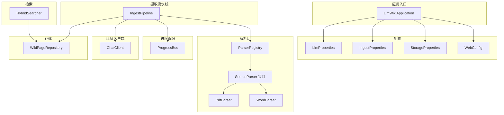
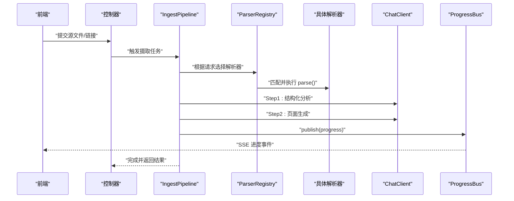
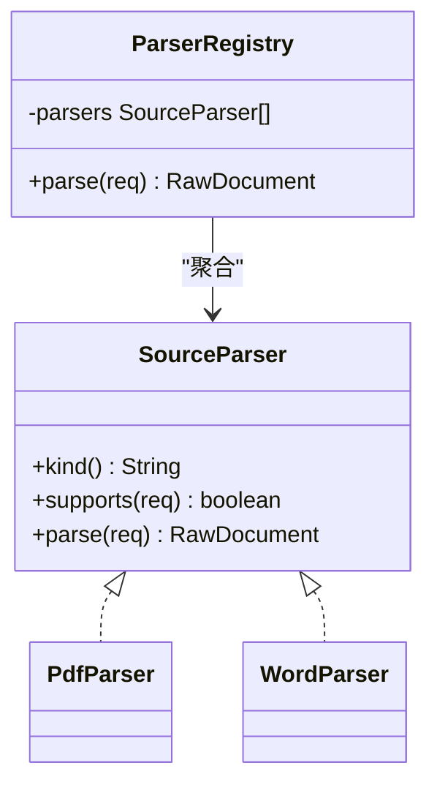
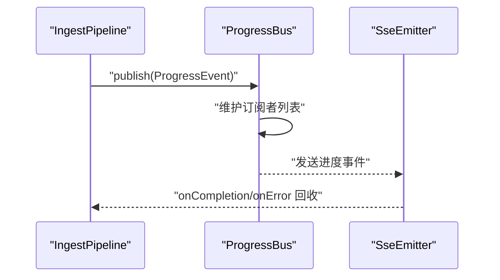
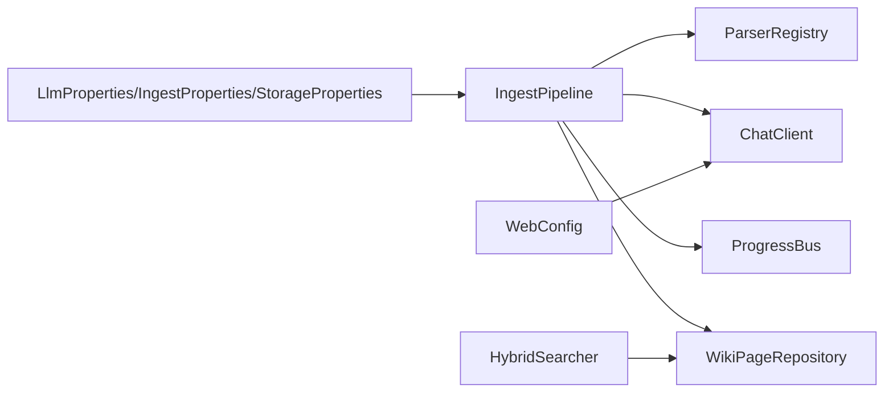
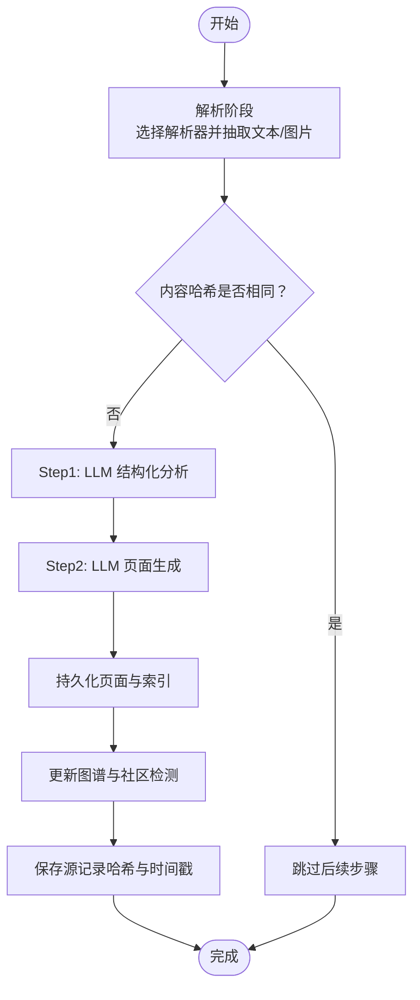

# 最佳实践

<cite>
**本文档引用的文件**
- [LlmWikiApplication.java](file://src/main/java/com/example/llmwiki/LlmWikiApplication.java)
- [ParserRegistry.java](file://src/main/java/com/example/llmwiki/parser/ParserRegistry.java)
- [SourceParser.java](file://src/main/java/com/example/llmwiki/parser/SourceParser.java)
- [PdfParser.java](file://src/main/java/com/example/llmwiki/parser/impl/PdfParser.java)
- [WordParser.java](file://src/main/java/com/example/llmwiki/parser/impl/WordParser.java)
- [IngestPipeline.java](file://src/main/java/com/example/llmwiki/ingest/IngestPipeline.java)
- [ProgressBus.java](file://src/main/java/com/example/llmwiki/progress/ProgressBus.java)
- [WebConfig.java](file://src/main/java/com/example/llmwiki/config/WebConfig.java)
- [LlmProperties.java](file://src/main/java/com/example/llmwiki/config/LlmProperties.java)
- [IngestProperties.java](file://src/main/java/com/example/llmwiki/config/IngestProperties.java)
- [StorageProperties.java](file://src/main/java/com/example/llmwiki/config/StorageProperties.java)
- [ChatClient.java](file://src/main/java/com/example/llmwiki/llm/ChatClient.java)
- [HybridSearcher.java](file://src/main/java/com/example/llmwiki/retrieval/HybridSearcher.java)
- [WikiPageRepository.java](file://src/main/java/com/example/llmwiki/repository/WikiPageRepository.java)
- [application.yml](file://src/main/resources/application.yml)
</cite>

## 目录
1. [简介](#简介)
2. [项目结构](#项目结构)
3. [核心组件](#核心组件)
4. [架构总览](#架构总览)
5. [详细组件分析](#详细组件分析)
6. [依赖分析](#依赖分析)
7. [性能考虑](#性能考虑)
8. [故障排查指南](#故障排查指南)
9. [结论](#结论)
10. [附录](#附录)

## 简介
本最佳实践指南面向 LLM Wiki 项目，系统阐述设计模式与工程实践，覆盖以下主题：
- 设计模式应用：工厂模式在解析器中的使用、策略模式在文档处理中的应用、观察者模式在进度跟踪中的实现、配置管理中的单例/配置对象模式。
- 性能优化：数据库查询优化、缓存策略设计、异步处理模式、内存使用优化。
- 安全编码实践：输入验证与清理、SQL 注入防护、XSS 防护、CSRF 防护、权限控制。
- 错误处理策略：异常分类管理、错误日志记录、降级策略设计、监控告警配置。
- 可扩展性设计：模块化架构、接口设计原则、依赖注入使用、配置驱动开发。
- 可维护性提升：代码重构技巧、技术债务管理、文档编写规范、测试覆盖率提升。

## 项目结构
后端采用 Spring Boot 结构，按功能域分层组织：
- config：配置类（属性绑定、Web 配置）
- domain：领域模型
- repository：数据访问层（JPA）
- ingest：摄取流水线（两步式 CoT）
- parser：多源解析器（接口 + 多实现）
- progress：进度事件总线（SSE 观察者）
- retrieval：混合检索（BM25 + 向量 + 图谱增强）
- llm：LLM 客户端封装（Chat/Embedding/Vision）
- scheduler：Quartz 调度
- api：控制器层
- util：工具类

图表来源
- [LlmWikiApplication.java:1-29](file://src/main/java/com/example/llmwiki/LlmWikiApplication.java#L1-L29)
- [ParserRegistry.java:1-37](file://src/main/java/com/example/llmwiki/parser/ParserRegistry.java#L1-L37)
- [SourceParser.java:1-22](file://src/main/java/com/example/llmwiki/parser/SourceParser.java#L1-L22)
- [PdfParser.java:1-113](file://src/main/java/com/example/llmwiki/parser/impl/PdfParser.java#L1-L113)
- [WordParser.java:1-67](file://src/main/java/com/example/llmwiki/parser/impl/WordParser.java#L1-L67)
- [IngestPipeline.java:1-251](file://src/main/java/com/example/llmwiki/ingest/IngestPipeline.java#L1-L251)
- [ProgressBus.java:1-61](file://src/main/java/com/example/llmwiki/progress/ProgressBus.java#L1-L61)
- [HybridSearcher.java:1-137](file://src/main/java/com/example/llmwiki/retrieval/HybridSearcher.java#L1-L137)
- [WikiPageRepository.java:1-19](file://src/main/java/com/example/llmwiki/repository/WikiPageRepository.java#L1-L19)
- [ChatClient.java:1-108](file://src/main/java/com/example/llmwiki/llm/ChatClient.java#L1-L108)
- [WebConfig.java:1-35](file://src/main/java/com/example/llmwiki/config/WebConfig.java#L1-L35)
- [LlmProperties.java:1-63](file://src/main/java/com/example/llmwiki/config/LlmProperties.java#L1-L63)
- [IngestProperties.java:1-33](file://src/main/java/com/example/llmwiki/config/IngestProperties.java#L1-L33)
- [StorageProperties.java:1-29](file://src/main/java/com/example/llmwiki/config/StorageProperties.java#L1-L29)

章节来源
- [LlmWikiApplication.java:1-29](file://src/main/java/com/example/llmwiki/LlmWikiApplication.java#L1-L29)
- [application.yml:1-84](file://src/main/resources/application.yml#L1-L84)

## 核心组件
- 解析器注册表与多实现：通过接口 + 列表注入 + 顺序匹配，实现“策略模式”式的动态选择。
- 摄取流水线：两步式链路（解析 → 分析 → 生成 → 索引/图谱），贯穿进度广播与增量缓存。
- 进度总线：观察者模式，维护 SSE 订阅者列表并广播事件。
- 混合检索：BM25 + 向量 KNN + 图谱邻接增强，使用 RRF 融合。
- LLM 客户端：OpenAI 兼容协议封装，统一消息格式与错误处理。
- 配置体系：属性绑定 + 共享客户端，支持运行时热更新。

章节来源
- [ParserRegistry.java:1-37](file://src/main/java/com/example/llmwiki/parser/ParserRegistry.java#L1-L37)
- [SourceParser.java:1-22](file://src/main/java/com/example/llmwiki/parser/SourceParser.java#L1-L22)
- [IngestPipeline.java:1-251](file://src/main/java/com/example/llmwiki/ingest/IngestPipeline.java#L1-L251)
- [ProgressBus.java:1-61](file://src/main/java/com/example/llmwiki/progress/ProgressBus.java#L1-L61)
- [HybridSearcher.java:1-137](file://src/main/java/com/example/llmwiki/retrieval/HybridSearcher.java#L1-L137)
- [ChatClient.java:1-108](file://src/main/java/com/example/llmwiki/llm/ChatClient.java#L1-L108)
- [LlmProperties.java:1-63](file://src/main/java/com/example/llmwiki/config/LlmProperties.java#L1-L63)
- [IngestProperties.java:1-33](file://src/main/java/com/example/llmwiki/config/IngestProperties.java#L1-L33)
- [StorageProperties.java:1-29](file://src/main/java/com/example/llmwiki/config/StorageProperties.java#L1-L29)

## 架构总览
系统以“配置驱动 + 依赖注入 + 观察者广播”的方式组织，前端通过 SSE 实时接收进度，后端通过流水线串联解析、LLM 分析与生成、索引与图谱更新。

图表来源
- [IngestPipeline.java:65-109](file://src/main/java/com/example/llmwiki/ingest/IngestPipeline.java#L65-L109)
- [ParserRegistry.java:27-35](file://src/main/java/com/example/llmwiki/parser/ParserRegistry.java#L27-L35)
- [ProgressBus.java:43-55](file://src/main/java/com/example/llmwiki/progress/ProgressBus.java#L43-L55)
- [ChatClient.java:50-86](file://src/main/java/com/example/llmwiki/llm/ChatClient.java#L50-L86)

## 详细组件分析

### 设计模式应用

#### 工厂模式在解析器中的使用
- 通过注册表聚合多个实现，并按顺序匹配 supports()，实现“工厂式选择”。
- 新增解析器只需实现接口并交由容器管理，无需修改调用方逻辑。

图表来源
- [SourceParser.java:11-21](file://src/main/java/com/example/llmwiki/parser/SourceParser.java#L11-L21)
- [ParserRegistry.java:19-35](file://src/main/java/com/example/llmwiki/parser/ParserRegistry.java#L19-L35)
- [PdfParser.java:38](file://src/main/java/com/example/llmwiki/parser/impl/PdfParser.java#L38)
- [WordParser.java:27](file://src/main/java/com/example/llmwiki/parser/impl/WordParser.java#L27)

章节来源
- [ParserRegistry.java:1-37](file://src/main/java/com/example/llmwiki/parser/ParserRegistry.java#L1-L37)
- [SourceParser.java:1-22](file://src/main/java/com/example/llmwiki/parser/SourceParser.java#L1-L22)
- [PdfParser.java:1-113](file://src/main/java/com/example/llmwiki/parser/impl/PdfParser.java#L1-L113)
- [WordParser.java:1-67](file://src/main/java/com/example/llmwiki/parser/impl/WordParser.java#L1-L67)

#### 策略模式在文档处理中的应用
- 解析阶段：根据请求类型与文件名后缀选择对应策略（PDF/Word 等）。
- 生成阶段：基于分析结果与模板生成页面草稿，体现“策略参数化”。

章节来源
- [PdfParser.java:48-54](file://src/main/java/com/example/llmwiki/parser/impl/PdfParser.java#L48-L54)
- [WordParser.java:35-41](file://src/main/java/com/example/llmwiki/parser/impl/WordParser.java#L35-L41)
- [IngestPipeline.java:111-177](file://src/main/java/com/example/llmwiki/ingest/IngestPipeline.java#L111-L177)

#### 观察者模式在进度跟踪中的实现
- ProgressBus 维护 SSE 订阅者列表，发布最近事件并回放历史上下文，实现“发布-订阅”解耦。

图表来源
- [IngestPipeline.java:245-249](file://src/main/java/com/example/llmwiki/ingest/IngestPipeline.java#L245-L249)
- [ProgressBus.java:26-55](file://src/main/java/com/example/llmwiki/progress/ProgressBus.java#L26-L55)

章节来源
- [ProgressBus.java:1-61](file://src/main/java/com/example/llmwiki/progress/ProgressBus.java#L1-L61)
- [IngestPipeline.java:1-251](file://src/main/java/com/example/llmwiki/ingest/IngestPipeline.java#L1-L251)

#### 单例模式在配置管理中的运用
- 使用 @ConfigurationProperties 将外部配置映射到单例对象，结合 @Bean 提供共享 RestClient，实现“配置即单例”。

章节来源
- [LlmProperties.java:1-63](file://src/main/java/com/example/llmwiki/config/LlmProperties.java#L1-L63)
- [IngestProperties.java:1-33](file://src/main/java/com/example/llmwiki/config/IngestProperties.java#L1-L33)
- [StorageProperties.java:1-29](file://src/main/java/com/example/llmwiki/config/StorageProperties.java#L1-L29)
- [WebConfig.java:30-33](file://src/main/java/com/example/llmwiki/config/WebConfig.java#L30-L33)

### 性能优化技巧

#### 数据库查询优化
- 使用 JPA Repository 提供按 slug/类型查询，避免 N+1 查询。
- 关闭 open-in-view，减少事务持有时间，降低连接占用。

章节来源
- [WikiPageRepository.java:13-18](file://src/main/java/com/example/llmwiki/repository/WikiPageRepository.java#L13-L18)
- [application.yml:23](file://src/main/resources/application.yml#L23)

#### 缓存策略设计
- 摄取阶段使用内容哈希进行增量缓存，避免重复处理。
- 进度总线保留最近 50 条事件，便于新订阅者快速获取上下文。

章节来源
- [IngestPipeline.java:77-80](file://src/main/java/com/example/llmwiki/ingest/IngestPipeline.java#L77-L80)
- [ProgressBus.java:23-59](file://src/main/java/com/example/llmwiki/progress/ProgressBus.java#L23-L59)

#### 异步处理模式
- 应用启用异步与调度注解，便于扩展后台任务与批处理。

章节来源
- [LlmWikiApplication.java:20-21](file://src/main/java/com/example/llmwiki/LlmWikiApplication.java#L20-L21)

#### 内存使用优化
- PDF 解析限制最大页数，避免大文件导致内存峰值过高。
- 文本截断与向量嵌入前的字符串拼接控制长度，降低内存压力。

章节来源
- [PdfParser.java:84-85](file://src/main/java/com/example/llmwiki/parser/impl/PdfParser.java#L84-L85)
- [IngestPipeline.java:50](file://src/main/java/com/example/llmwiki/ingest/IngestPipeline.java#L50)
- [IngestPipeline.java:196-205](file://src/main/java/com/example/llmwiki/ingest/IngestPipeline.java#L196-L205)

### 安全编码实践

#### 输入验证与清理
- 解析器对文件名后缀进行大小写不敏感判断，避免路径/类型绕过。
- 文本清洗与标准化，降低下游处理风险。

章节来源
- [PdfParser.java:52-53](file://src/main/java/com/example/llmwiki/parser/impl/PdfParser.java#L52-L53)
- [WordParser.java:39-40](file://src/main/java/com/example/llmwiki/parser/impl/WordParser.java#L39-L40)

#### SQL 注入防护
- 使用 JPA/Hibernate 参数化查询，避免拼接 SQL。
- 配置中使用受控的数据源与方言，避免不受信任的输入直接进入原生 SQL。

章节来源
- [WikiPageRepository.java:13-18](file://src/main/java/com/example/llmwiki/repository/WikiPageRepository.java#L13-L18)
- [application.yml:11-25](file://src/main/resources/application.yml#L11-L25)

#### XSS 防护
- 前端渲染时对用户输入进行转义与白名单过滤（建议在视图层补充）。
- 后端返回内容避免内联脚本，确保 Content-Security-Policy 设置合理。

[本节为通用指导，不直接分析特定文件]

#### CSRF 防护
- 启用跨域凭证与受控来源，结合后端路由校验与令牌机制（建议在控制器层补充）。

章节来源
- [WebConfig.java:19-25](file://src/main/java/com/example/llmwiki/config/WebConfig.java#L19-L25)

#### 权限控制
- 在控制器层增加鉴权与授权检查，限制敏感操作（如设置页、调度开关）。

[本节为通用指导，不直接分析特定文件]

### 错误处理策略

#### 异常分类管理
- LLM 客户端抛出专用异常，便于上层区分网络、认证、协议等问题。
- 摄取流水线对 JSON 解析失败与空结果进行显式异常抛出。

章节来源
- [ChatClient.java:80-85](file://src/main/java/com/example/llmwiki/llm/ChatClient.java#L80-L85)
- [IngestPipeline.java:136-138](file://src/main/java/com/example/llmwiki/ingest/IngestPipeline.java#L136-L138)
- [IngestPipeline.java:173-175](file://src/main/java/com/example/llmwiki/ingest/IngestPipeline.java#L173-L175)

#### 错误日志记录
- 统一使用 SLF4J 记录错误堆栈与上下文信息，便于定位问题。

章节来源
- [ChatClient.java:83](file://src/main/java/com/example/llmwiki/llm/ChatClient.java#L83)
- [PdfParser.java:107-109](file://src/main/java/com/example/llmwiki/parser/impl/PdfParser.java#L107-L109)

#### 降级策略设计
- 向量检索失败时降级为 BM25 单通，保证检索可用性。
- Embedding 失败时仅做 BM25 索引，不影响整体流程。

章节来源
- [HybridSearcher.java:82-86](file://src/main/java/com/example/llmwiki/retrieval/HybridSearcher.java#L82-L86)
- [IngestPipeline.java:201-204](file://src/main/java/com/example/llmwiki/ingest/IngestPipeline.java#L201-L204)

#### 监控告警配置
- 建议接入指标系统（如 Micrometer）与日志采集，对 LLM 调用延迟与错误率设置阈值告警。

[本节为通用指导，不直接分析特定文件]

### 可扩展性设计

#### 模块化架构
- 功能域清晰分离：解析、摄取、检索、LLM、进度、配置等，便于独立演进。

章节来源
- [ParserRegistry.java:1-37](file://src/main/java/com/example/llmwiki/parser/ParserRegistry.java#L1-L37)
- [IngestPipeline.java:1-251](file://src/main/java/com/example/llmwiki/ingest/IngestPipeline.java#L1-L251)
- [HybridSearcher.java:1-137](file://src/main/java/com/example/llmwiki/retrieval/HybridSearcher.java#L1-L137)

#### 接口设计原则
- 以 SourceParser 为核心接口，约束能力边界，新增实现无需改动调用方。

章节来源
- [SourceParser.java:11-21](file://src/main/java/com/example/llmwiki/parser/SourceParser.java#L11-L21)

#### 依赖注入使用
- 通过构造注入与 @Component/@Service 组织依赖，提升可测试性与可替换性。

章节来源
- [IngestPipeline.java:52-62](file://src/main/java/com/example/llmwiki/ingest/IngestPipeline.java#L52-L62)
- [ChatClient.java:30-32](file://src/main/java/com/example/llmwiki/llm/ChatClient.java#L30-L32)

#### 配置驱动开发
- 通过属性绑定与 YAML 配置集中管理行为（重试次数、工作线程、调度周期、存储路径、LLM 凭证等）。

章节来源
- [IngestProperties.java:18-31](file://src/main/java/com/example/llmwiki/config/IngestProperties.java#L18-L31)
- [LlmProperties.java:21-61](file://src/main/java/com/example/llmwiki/config/LlmProperties.java#L21-L61)
- [StorageProperties.java:18-28](file://src/main/java/com/example/llmwiki/config/StorageProperties.java#L18-L28)
- [application.yml:31-76](file://src/main/resources/application.yml#L31-L76)

### 可维护性提升

#### 代码重构技巧
- 将公共逻辑抽取为工具方法（如文本截断、哈希计算），减少重复。
- 对长函数拆分步骤，明确每一步职责（如解析、分析、生成、持久化）。

章节来源
- [IngestPipeline.java:111-177](file://src/main/java/com/example/llmwiki/ingest/IngestPipeline.java#L111-L177)
- [PdfParser.java:79-111](file://src/main/java/com/example/llmwiki/parser/impl/PdfParser.java#L79-L111)

#### 技术债务管理
- 为每个解析器实现添加单元测试与集成测试，覆盖异常分支与边界条件。
- 对第三方依赖（PDFBox、POI、Lucene）建立升级策略与兼容性检查。

[本节为通用指导，不直接分析特定文件]

#### 文档编写规范
- 为接口与复杂流程补充 Javadoc 与流程图，标注异常场景与前置条件。

章节来源
- [SourceParser.java:11-21](file://src/main/java/com/example/llmwiki/parser/SourceParser.java#L11-L21)
- [IngestPipeline.java:34-44](file://src/main/java/com/example/llmwiki/ingest/IngestPipeline.java#L34-L44)

#### 测试覆盖率提升
- 建议使用 JUnit + Mockito 覆盖解析器选择、LLM 客户端调用、进度广播、检索融合等关键路径。

[本节为通用指导，不直接分析特定文件]

## 依赖分析
- 组件内聚：解析器、流水线、检索器、进度总线各司其职，内聚度高。
- 组件耦合：通过接口与配置对象解耦，依赖方向清晰。
- 外部依赖：JPA/H2、Quartz、Apache PDFBox、Apache POI、Lucene、Spring WebClient。

图表来源
- [IngestPipeline.java:52-62](file://src/main/java/com/example/llmwiki/ingest/IngestPipeline.java#L52-L62)
- [ParserRegistry.java:22](file://src/main/java/com/example/llmwiki/parser/ParserRegistry.java#L22)
- [ChatClient.java:30-32](file://src/main/java/com/example/llmwiki/llm/ChatClient.java#L30-L32)
- [ProgressBus.java:19](file://src/main/java/com/example/llmwiki/progress/ProgressBus.java#L19)
- [WikiPageRepository.java:13-18](file://src/main/java/com/example/llmwiki/repository/WikiPageRepository.java#L13-L18)
- [HybridSearcher.java:38-40](file://src/main/java/com/example/llmwiki/retrieval/HybridSearcher.java#L38-L40)
- [LlmProperties.java:16-18](file://src/main/java/com/example/llmwiki/config/LlmProperties.java#L16-L18)
- [IngestProperties.java:14-15](file://src/main/java/com/example/llmwiki/config/IngestProperties.java#L14-L15)
- [StorageProperties.java:14-15](file://src/main/java/com/example/llmwiki/config/StorageProperties.java#L14-L15)
- [WebConfig.java:30-33](file://src/main/java/com/example/llmwiki/config/WebConfig.java#L30-L33)

章节来源
- [IngestPipeline.java:1-251](file://src/main/java/com/example/llmwiki/ingest/IngestPipeline.java#L1-L251)
- [HybridSearcher.java:1-137](file://src/main/java/com/example/llmwiki/retrieval/HybridSearcher.java#L1-L137)
- [application.yml:1-84](file://src/main/resources/application.yml#L1-L84)

## 性能考虑
- I/O 密集：解析器与 LLM 调用为主，建议使用连接池与超时控制。
- CPU 密集：向量嵌入与 PDF 图像处理，建议限制并发与页数上限。
- 存储热点：索引与图谱更新采用批量写入，避免频繁落盘。
- 网络抖动：LLM 客户端具备重试与降级策略，建议结合熔断器使用。

[本节提供通用指导，不直接分析特定文件]

## 故障排查指南
- LLM 未配置 API Key：检查配置项与设置页，确认凭据有效。
- 进度不更新：确认 SSE 连接状态与浏览器控制台错误，检查总线订阅与发布逻辑。
- 检索异常：查看 BM25/KNN 日志，确认向量维度与索引一致性。
- 数据库异常：检查 DDL 自动更新与方言配置，避免字段不匹配。

章节来源
- [ChatClient.java:52-54](file://src/main/java/com/example/llmwiki/llm/ChatClient.java#L52-L54)
- [ProgressBus.java:26-41](file://src/main/java/com/example/llmwiki/progress/ProgressBus.java#L26-L41)
- [HybridSearcher.java:63-86](file://src/main/java/com/example/llmwiki/retrieval/HybridSearcher.java#L63-L86)
- [application.yml:20-25](file://src/main/resources/application.yml#L20-L25)

## 结论
本项目通过清晰的模块划分与设计模式应用，实现了高内聚、低耦合的可扩展架构。建议在现有基础上进一步完善安全基线、可观测性与测试覆盖，持续提升系统的稳定性与可维护性。

[本节为总结性内容，不直接分析特定文件]

## 附录

### 关键流程图：摄取流水线

图表来源
- [IngestPipeline.java:65-109](file://src/main/java/com/example/llmwiki/ingest/IngestPipeline.java#L65-L109)