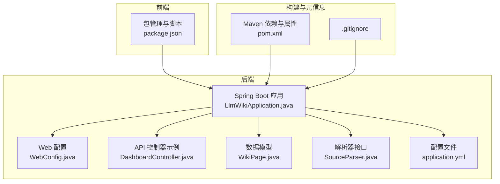
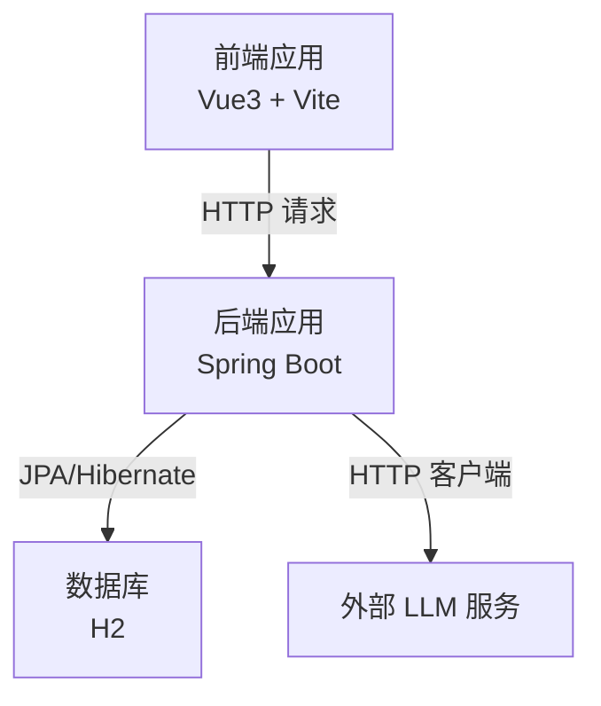
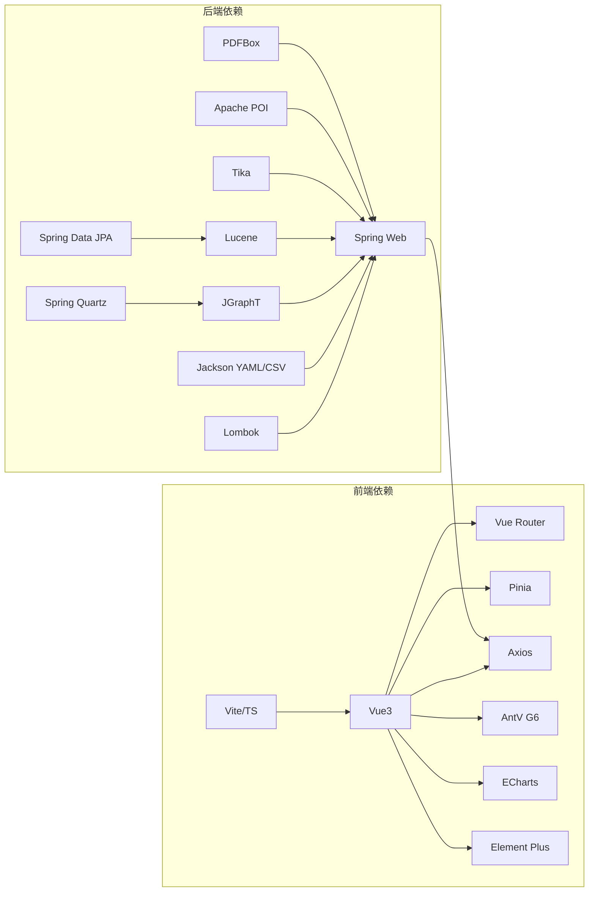

# 贡献指南

<cite>
**本文引用的文件**
- [pom.xml](file://pom.xml)
- [application.yml](file://src/main/resources/application.yml)
- [package.json](file://web/package.json)
- [.gitignore](file://.gitignore)
- [LlmWikiApplication.java](file://src/main/java/com/example/llmwiki/LlmWikiApplication.java)
- [WebConfig.java](file://src/main/java/com/example/llmwiki/config/WebConfig.java)
- [DashboardController.java](file://src/main/java/com/example/llmwiki/api/DashboardController.java)
- [WikiPage.java](file://src/main/java/com/example/llmwiki/domain/WikiPage.java)
- [SourceParser.java](file://src/main/java/com/example/llmwiki/parser/SourceParser.java)
</cite>

## 目录
1. 引言
2. 项目结构
3. 核心组件
4. 架构总览
5. 详细组件分析
6. 依赖分析
7. 性能考虑
8. 故障排查指南
9. 结论
10. 附录

## 引言
本贡献指南面向希望参与 LLM Wiki 项目的开发者与社区成员，提供从 Issue 提交、PR 流程、社区参与、贡献者协议、维护者职责到新手引导与激励机制的完整指引。LLM Wiki 是一个基于 Spring Boot 的个人知识库系统，支持多源文件解析、全文检索、知识图谱构建与自动化评估，前后端分离，前端采用 Vue3 + Vite 技术栈。

## 项目结构
- 后端（Spring Boot）
  - 应用入口与配置：应用启动类、Web 跨域与共享客户端配置、核心 API 控制器示例
  - 数据模型：知识页面实体等
  - 功能模块：解析器接口、任务调度、索引与检索、图谱分析、评估与进度通知等
- 前端（Vue3 + Vite）
  - 包管理与脚本：开发、构建、预览命令
  - 依赖生态：Vue3、路由、状态管理、图表、UI 组件库、HTTP 客户端等
- 配置与构建
  - Maven 依赖与插件、版本属性、许可证与开发者信息占位
  - 应用运行参数、数据库连接、日志级别、LLM 与解析器配置项
  - Git 忽略规则

**图示来源**
- [LlmWikiApplication.java:1-29](file://src/main/java/com/example/llmwiki/LlmWikiApplication.java#L1-L29)
- [WebConfig.java:1-35](file://src/main/java/com/example/llmwiki/config/WebConfig.java#L1-L35)
- [DashboardController.java:1-48](file://src/main/java/com/example/llmwiki/api/DashboardController.java#L1-L48)
- [WikiPage.java:1-72](file://src/main/java/com/example/llmwiki/domain/WikiPage.java#L1-L72)
- [SourceParser.java:1-22](file://src/main/java/com/example/llmwiki/parser/SourceParser.java#L1-L22)
- [application.yml:1-84](file://src/main/resources/application.yml#L1-L84)
- [package.json:1-31](file://web/package.json#L1-L31)
- [pom.xml:1-171](file://pom.xml#L1-L171)
- [.gitignore:1-34](file://.gitignore#L1-L34)

**章节来源**
- [pom.xml:1-171](file://pom.xml#L1-L171)
- [application.yml:1-84](file://src/main/resources/application.yml#L1-L84)
- [package.json:1-31](file://web/package.json#L1-L31)
- [.gitignore:1-34](file://.gitignore#L1-L34)

## 核心组件
- 应用入口与注解：启用异步与定时任务，负责应用启动与上下文初始化
- Web 配置：全局 CORS 放通、共享 RestClient Bean，便于 HTTP 请求复用
- API 控制器：以仪表盘聚合接口为例，展示如何在控制器中注入仓库与服务并返回聚合统计
- 数据模型：知识页面实体，包含唯一 slug、标题、类型、摘要、正文、来源与标签、外链、时间戳等字段
- 解析器接口：定义多源解析器的统一契约，包括类型标识、能力判定与解析执行

**章节来源**
- [LlmWikiApplication.java:1-29](file://src/main/java/com/example/llmwiki/LlmWikiApplication.java#L1-L29)
- [WebConfig.java:1-35](file://src/main/java/com/example/llmwiki/config/WebConfig.java#L1-L35)
- [DashboardController.java:1-48](file://src/main/java/com/example/llmwiki/api/DashboardController.java#L1-L48)
- [WikiPage.java:1-72](file://src/main/java/com/example/llmwiki/domain/WikiPage.java#L1-L72)
- [SourceParser.java:1-22](file://src/main/java/com/example/llmwiki/parser/SourceParser.java#L1-L22)

## 架构总览
后端通过 Spring MVC 暴露 REST 接口，前端通过 HTTP 客户端调用后端 API；应用使用 H2 内嵌数据库进行开发与演示，日志级别可按包名精细控制；解析器接口抽象了多源文件解析能力，便于扩展新的解析器实现。

**图示来源**
- [WebConfig.java:27-33](file://src/main/java/com/example/llmwiki/config/WebConfig.java#L27-L33)
- [application.yml:11-25](file://src/main/resources/application.yml#L11-L25)
- [DashboardController.java:33-46](file://src/main/java/com/example/llmwiki/api/DashboardController.java#L33-L46)

## 详细组件分析

### Issue 提交规范
- Bug 报告模板
  - 标题：简洁描述问题
  - 环境信息：操作系统、浏览器版本、后端 Java 版本、前端 Node 版本
  - 复现步骤：最小化可复现操作序列
  - 预期行为：期望结果
  - 实际行为：实际结果
  - 日志与截图：后端日志片段、错误截图、网络请求/响应信息
  - 附加信息：是否可稳定复现、相关配置片段
- 功能请求模板
  - 背景：当前痛点或需求来源
  - 目标：期望达成的功能目标
  - 方案建议：可选的技术方案与边界说明
  - 影响范围：对现有功能/配置的影响
- 问题分类标准
  - 类型：Bug、功能请求、性能、安全、文档、其他
  - 优先级：P0（阻塞性）、P1（高）、P2（中）、P3（低）
  - 组件：后端 API、前端界面、解析器、索引/检索、图谱、评估、配置
- 重现步骤要求
  - 明确前置条件（如已导入的源文件、已创建的页面）
  - 严格按顺序执行每一步
  - 提供最小化样例（数据、配置、请求体）

### Pull Request 流程
- PR 模板填写
  - 标题：简明扼要，体现变更类型（修复/特性/重构/文档）
  - 摘要：变更动机、解决的问题、影响范围
  - 测试：本地测试方法与结果、新增/修改的测试点
  - 变更类型：功能、修复、文档、样式、依赖、其他
  - 相关 Issue：关联的 Issue 编号
- 代码审查流程
  - 自查清单：编译通过、单元测试覆盖、无敏感信息泄露、遵循风格规范
  - 提交 CI 触发：构建、静态检查、测试
  - 审查要点：逻辑正确性、边界处理、异常分支、性能影响、可维护性
- 测试要求
  - 单元测试：核心业务逻辑、工具类、解析器接口实现
  - 集成测试：API 端到端、解析流程、索引/检索链路
  - 前端测试：组件渲染、路由跳转、用户交互
- 合并条件
  - 至少一名维护者批准
  - CI 通过且无失败检查
  - 无未处理评论或已按要求修改
  - 变更内容清晰、文档同步更新

### 社区参与
- 讨论参与方式
  - GitHub Discussions 或 Issue 讨论区：功能设计、问题排查、经验分享
  - 社区会议：定期线上会议，议题征集与回顾
- 技术交流渠道
  - 邮件列表/即时通讯群组：日常沟通与快速问答
  - 技术博客/文档：最佳实践与案例分享
- 文档贡献
  - 用户文档：安装、配置、使用手册
  - 开发文档：架构说明、模块设计、API 文档
  - 示例与教程：常见场景的完整示例
- 翻译贡献
  - 翻译文档与注释，确保术语一致
  - 提供双语文档对照，便于回溯与校对

### 贡献者协议
- 代码许可协议
  - 默认采用项目指定的开源许可证（若未在仓库中明确，请补充）
- 版权声明
  - 贡献者需保留原有版权信息，并在新增文件中添加年份与作者
- 贡献者签名
  - 提交 PR 时在描述中声明“Signed-off-by: 名字 邮箱”
- 知识产权声明
  - 贡献者保证拥有完整权利授权给项目，不侵犯第三方权益

### 维护者职责
- 代码审查责任
  - 关注 PR 质量与一致性，及时反馈与跟进
- 问题回答
  - 回复 Issue 与讨论，提供技术支持与方向指导
- 版本发布
  - 制定发布计划，协调版本号、变更日志与公告
- 社区管理
  - 维护讨论氛围，制定与执行行为准则

### 新手引导
- 开发环境搭建
  - 后端
    - JDK 17+、Maven、H2 数据库（默认内嵌）
    - 运行应用入口类启动后端服务
  - 前端
    - Node.js 16+、npm 或 pnpm
    - 安装依赖后运行开发服务器
- 第一个 PR
  - 选择合适的 Issue（建议标注 good first issue）
  - 在本地分支完成修改，提交并推送
  - 创建 PR，填写模板并等待审查
- 代码风格要求
  - Java：遵循 Spring Boot 通用风格，保持简洁与可读性
  - 前端：遵循 ESLint/Prettier 规则，组件与命名规范统一
- 测试编写
  - 补充单元测试与集成测试，覆盖关键路径与异常分支
  - 前端组件测试与路由测试同步完善

### 激励机制
- 贡献者认可
  - 贡献者名单与徽章展示
- 功能命名权
  - 新增功能的命名建议权（尊重社区共识）
- 社区地位
  - 积极贡献者可受邀参与决策与评审
- 未来参与机会
  - 优秀贡献者可参与路线规划与版本发布

## 依赖分析
- 后端依赖
  - Spring 生态：Web、JPA、Validation、Quartz
  - 文件解析：PDFBox、POI、Tika
  - 搜索：Lucene
  - 图算法：JGraphT
  - YAML/CSV：Jackson Dataformats
  - Lombok
- 前端依赖
  - Vue3、路由、状态管理、HTTP 客户端
  - 图表与可视化：AntV G6、ECharts
  - UI 组件库：Element Plus
  - 构建工具：Vite、TypeScript

**图示来源**
- [pom.xml:36-158](file://pom.xml#L36-L158)
- [package.json:12-29](file://web/package.json#L12-L29)

**章节来源**
- [pom.xml:29-158](file://pom.xml#L29-L158)
- [package.json:1-31](file://web/package.json#L1-L31)

## 性能考虑
- 后端
  - 合理设置线程池与任务并发度，避免资源争用
  - 使用懒加载与缓存策略减少重复计算
  - 对大文件解析与索引建立进行分片与限流
- 前端
  - 组件按需加载与虚拟滚动优化长列表
  - 图表与图谱渲染使用增量更新策略
  - 减少不必要的重渲染与状态提升

## 故障排查指南
- 启动失败
  - 检查 Java 版本与 Maven 配置
  - 确认数据库驱动与连接字符串
- 端口占用
  - 修改后端端口或释放占用进程
- 跨域问题
  - 确认 CORS 配置与前端代理设置
- 解析失败
  - 检查文件格式与解析器支持情况
  - 查看解析器异常堆栈与日志
- 图谱/索引异常
  - 清理旧索引与图谱缓存后重建
- 前端无法访问后端
  - 确认后端接口连通性与代理配置

**章节来源**
- [WebConfig.java:18-25](file://src/main/java/com/example/llmwiki/config/WebConfig.java#L18-L25)
- [application.yml:1-84](file://src/main/resources/application.yml#L1-L84)

## 结论
本贡献指南提供了从 Issue 到 PR 的全流程规范、社区参与方式、维护者职责与激励机制，帮助新老贡献者高效协作。请在提交前阅读并遵循上述规范，共同建设高质量的 LLM Wiki 项目。

## 附录
- 快速参考
  - 后端启动类：[LlmWikiApplication.java:24-26](file://src/main/java/com/example/llmwiki/LlmWikiApplication.java#L24-L26)
  - Web 配置与 CORS：[WebConfig.java:18-25](file://src/main/java/com/example/llmwiki/config/WebConfig.java#L18-L25)
  - 仪表盘接口示例：[DashboardController.java:33-46](file://src/main/java/com/example/llmwiki/api/DashboardController.java#L33-L46)
  - 知识页面模型：[WikiPage.java:23-71](file://src/main/java/com/example/llmwiki/domain/WikiPage.java#L23-L71)
  - 解析器接口：[SourceParser.java:11-21](file://src/main/java/com/example/llmwiki/parser/SourceParser.java#L11-L21)
  - 应用配置项：[application.yml:31-77](file://src/main/resources/application.yml#L31-L77)
  - 前端依赖与脚本：[package.json:7-29](file://web/package.json#L7-L29)
  - 构建与依赖：[pom.xml:29-158](file://pom.xml#L29-L158)
  - Git 忽略规则：[.gitignore:1-34](file://.gitignore#L1-L34)