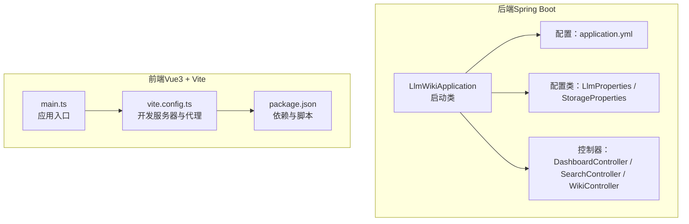
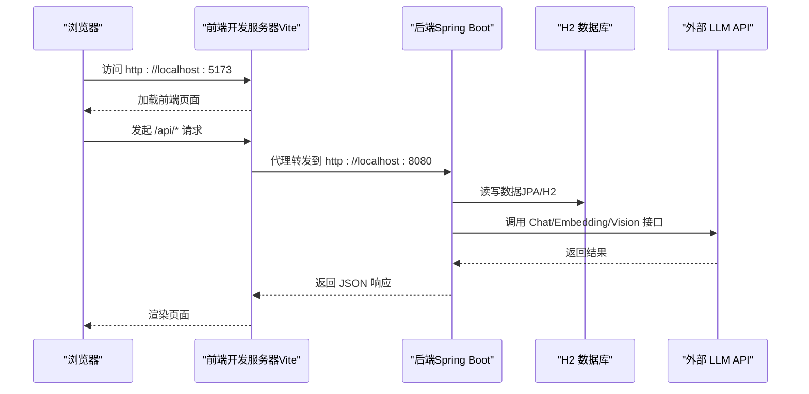
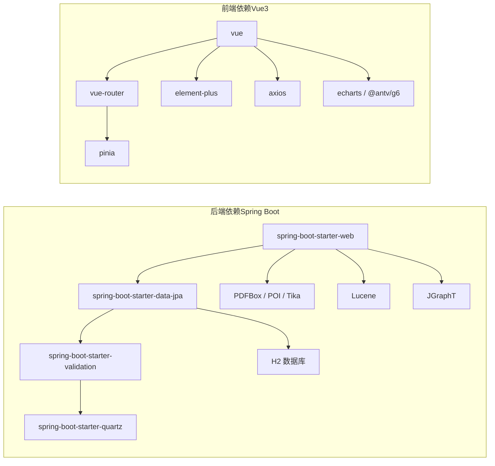

# 快速开始

<cite>
**本文引用的文件**
- [pom.xml](file://pom.xml)
- [application.yml](file://src/main/resources/application.yml)
- [LlmWikiApplication.java](file://src/main/java/com/example/llmwiki/LlmWikiApplication.java)
- [LlmProperties.java](file://src/main/java/com/example/llmwiki/config/LlmProperties.java)
- [StorageProperties.java](file://src/main/java/com/example/llmwiki/config/StorageProperties.java)
- [DashboardController.java](file://src/main/java/com/example/llmwiki/api/DashboardController.java)
- [SearchController.java](file://src/main/java/com/example/llmwiki/api/SearchController.java)
- [WikiController.java](file://src/main/java/com/example/llmwiki/api/WikiController.java)
- [package.json](file://web/package.json)
- [vite.config.ts](file://web/vite.config.ts)
- [main.ts](file://web/src/main.ts)
- [env.d.ts](file://web/src/env.d.ts)
- [.mvn\wrapper\maven-wrapper.properties](file://.mvn/wrapper/maven-wrapper.properties)
- [.gitignore](file://.gitignore)
</cite>

## 目录
1. [简介](#简介)
2. [项目结构](#项目结构)
3. [核心组件](#核心组件)
4. [架构总览](#架构总览)
5. [详细组件分析](#详细组件分析)
6. [依赖关系分析](#依赖关系分析)
7. [性能考虑](#性能考虑)
8. [故障排除指南](#故障排除指南)
9. [结论](#结论)
10. [附录](#附录)

## 简介
本指南面向初学者与开发者，帮助你在本地快速搭建并运行 LLM Wiki 项目。你将获得完整的环境要求、安装步骤、启动流程、基本使用示例以及常见问题排查建议。LLM Wiki 是一个基于 Spring Boot 的后端与 Vue3 前端组成的个人知识库系统，支持多格式文档解析、向量检索、知识图谱构建与评估报告生成。

## 项目结构
项目采用前后端分离架构：
- 后端：Spring Boot 应用，使用 Maven 构建，配置位于 application.yml，核心启动类为 LlmWikiApplication。
- 前端：Vue3 + Vite 工程，使用 Element Plus、AntV G6、ECharts 等生态，开发服务器默认端口 5173，并通过代理转发 /api 到后端 8080 端口。
- 配置：后端通过 application.yml 提供数据库、存储目录、LLM 接口、调度器等配置；前端通过 package.json 定义依赖与脚本。

图表来源
- [LlmWikiApplication.java:1-29](file://src/main/java/com/example/llmwiki/LlmWikiApplication.java#L1-L29)
- [application.yml:1-84](file://src/main/resources/application.yml#L1-L84)
- [LlmProperties.java:1-63](file://src/main/java/com/example/llmwiki/config/LlmProperties.java#L1-L63)
- [StorageProperties.java:1-29](file://src/main/java/com/example/llmwiki/config/StorageProperties.java#L1-L29)
- [DashboardController.java:1-48](file://src/main/java/com/example/llmwiki/api/DashboardController.java#L1-L48)
- [SearchController.java:1-32](file://src/main/java/com/example/llmwiki/api/SearchController.java#L1-L32)
- [WikiController.java:1-51](file://src/main/java/com/example/llmwiki/api/WikiController.java#L1-L51)
- [main.ts:1-14](file://web/src/main.ts#L1-L14)
- [vite.config.ts:1-23](file://web/vite.config.ts#L1-L23)
- [package.json:1-31](file://web/package.json#L1-L31)

章节来源
- [pom.xml:1-171](file://pom.xml#L1-L171)
- [application.yml:1-84](file://src/main/resources/application.yml#L1-L84)
- [LlmWikiApplication.java:1-29](file://src/main/java/com/example/llmwiki/LlmWikiApplication.java#L1-L29)
- [package.json:1-31](file://web/package.json#L1-L31)
- [vite.config.ts:1-23](file://web/vite.config.ts#L1-L23)

## 核心组件
- 后端核心启动类负责启用异步与定时任务，主方法启动 Spring Boot 应用。
- 配置类 LlmProperties 与 StorageProperties 分别绑定 llm-wiki.llm 与 llm-wiki.storage 前缀，提供 LLM 接口参数与数据存储目录。
- 控制器层提供仪表盘概览、全文检索与 Wiki 页面查询等接口，便于前端展示与交互。
- 前端通过 main.ts 注册路由、状态管理与 UI 组件库，开发服务器通过代理将 /api 请求转发至后端。

章节来源
- [LlmWikiApplication.java:1-29](file://src/main/java/com/example/llmwiki/LlmWikiApplication.java#L1-L29)
- [LlmProperties.java:1-63](file://src/main/java/com/example/llmwiki/config/LlmProperties.java#L1-L63)
- [StorageProperties.java:1-29](file://src/main/java/com/example/llmwiki/config/StorageProperties.java#L1-L29)
- [DashboardController.java:1-48](file://src/main/java/com/example/llmwiki/api/DashboardController.java#L1-L48)
- [SearchController.java:1-32](file://src/main/java/com/example/llmwiki/api/SearchController.java#L1-L32)
- [WikiController.java:1-51](file://src/main/java/com/example/llmwiki/api/WikiController.java#L1-L51)
- [main.ts:1-14](file://web/src/main.ts#L1-L14)

## 架构总览
下图展示了从浏览器到后端服务再到数据库与外部 LLM API 的整体调用链路，以及前端开发服务器的代理机制。

图表来源
- [vite.config.ts:13-21](file://web/vite.config.ts#L13-L21)
- [application.yml:1-84](file://src/main/resources/application.yml#L1-L84)
- [LlmProperties.java:30-61](file://src/main/java/com/example/llmwiki/config/LlmProperties.java#L30-L61)

## 详细组件分析

### 环境要求
- Java：17 或更高版本（项目属性中指定 java.version 为 17）。
- Maven：随仓库提供的 Maven Wrapper 可直接使用，无需手动安装。
- Node.js：用于前端开发与构建，版本由 package.json 中的 devDependencies 指定。
- Git：用于克隆仓库。

章节来源
- [pom.xml:29-35](file://pom.xml#L29-L35)
- [.mvn\wrapper\maven-wrapper.properties:1-4](file://.mvn/wrapper/maven-wrapper.properties#L1-L4)
- [package.json:22-29](file://web/package.json#L22-L29)

### 安装步骤
- 克隆仓库：使用 Git 将项目克隆到本地。
- 后端依赖安装：使用 Maven Wrapper 执行构建（会自动下载所需依赖）。
- 前端依赖安装：在 web 目录执行 npm/yarn/pnpm 安装命令（具体命令以你本地包管理器为准）。
- 数据库初始化：项目使用嵌入式 H2 数据库，首次启动会自动创建表结构。
- LLM API 密钥配置：在 application.yml 中填写 llm-wiki.llm.chat.api-key 与 llm-wiki.llm.embedding.api-key 字段。

章节来源
- [application.yml:31-57](file://src/main/resources/application.yml#L31-L57)
- [LlmProperties.java:16-62](file://src/main/java/com/example/llmwiki/config/LlmProperties.java#L16-L62)

### 项目启动指南
- 启动后端：在项目根目录执行 Maven Wrapper 构建并启动 Spring Boot 应用。
- 启动前端：进入 web 目录，执行前端开发脚本启动 Vite 开发服务器。
- 开发服务器配置：前端开发服务器默认监听 5173，通过代理将 /api 请求转发到后端 8080。

章节来源
- [LlmWikiApplication.java:24-26](file://src/main/java/com/example/llmwiki/LlmWikiApplication.java#L24-L26)
- [vite.config.ts:13-21](file://web/vite.config.ts#L13-L21)
- [package.json:7-11](file://web/package.json#L7-L11)

### 基本使用示例
- 上传文档：通过前端界面选择文件，后端将根据解析器处理并生成 Wiki 内容与索引。
- 进行搜索：调用检索接口，返回 BM25 与向量混合排序的结果。
- 查看知识图谱：访问图谱视图，系统会展示节点、边、社区等信息。
- 生成评估报告：触发评估流程，系统输出 CSV 报告并可在前端查看。

章节来源
- [DashboardController.java:33-46](file://src/main/java/com/example/llmwiki/api/DashboardController.java#L33-L46)
- [SearchController.java:25-30](file://src/main/java/com/example/llmwiki/api/SearchController.java#L25-L30)
- [WikiController.java:29-49](file://src/main/java/com/example/llmwiki/api/WikiController.java#L29-L49)

### 关键配置说明
- 数据库：H2 文件数据库，默认开启控制台，可通过 /h2-console 访问。
- 存储目录：llm-wiki.storage.root-dir、raw-dir、wiki-dir、index-dir、graph-dir。
- LLM 接口：chat/base-url/model/temperature/timeout，embedding/base-url/model/dimensions/timeout，vision/enabled/base-url/model/timeout。
- 调度器：scheduler.enabled 与 cron 表达式，控制定时任务频率。

章节来源
- [application.yml:11-77](file://src/main/resources/application.yml#L11-L77)
- [StorageProperties.java:16-28](file://src/main/java/com/example/llmwiki/config/StorageProperties.java#L16-L28)
- [LlmProperties.java:30-61](file://src/main/java/com/example/llmwiki/config/LlmProperties.java#L30-L61)

## 依赖关系分析
后端依赖以 Spring Boot Starter 为核心，集成 JPA/H2、Quartz、Lucene、Tika、Jsoup、JGraphT 等模块；前端依赖 Vue3、Element Plus、AntV G6、ECharts、Axios 等。

图表来源
- [pom.xml:36-159](file://pom.xml#L36-L159)
- [package.json:12-29](file://web/package.json#L12-L29)

章节来源
- [pom.xml:36-159](file://pom.xml#L36-L159)
- [package.json:12-29](file://web/package.json#L12-L29)

## 性能考虑
- 索引与检索：Lucene 索引与向量嵌入结合，合理设置 topK 与维度可平衡召回率与延迟。
- 并发与线程：Quartz 与异步任务线程池大小可根据资源情况调整。
- 存储与 IO：将存储目录指向高性能磁盘，避免频繁小文件 IO。
- 前端开发：开发服务器代理减少跨域与网络往返，生产构建建议开启压缩与缓存。

## 故障排除指南
- 启动后端报端口占用：检查 application.yml 中 server.port 是否被占用，或修改为其他端口。
- 前端无法访问后端接口：确认 vite.config.ts 中代理配置是否正确，目标地址是否为 http://localhost:8080。
- LLM 接口失败：检查 application.yml 中 llm-wiki.llm.chat.api-key 与 llm-wiki.llm.embedding.api-key 是否已填写，base-url 是否正确。
- 数据库连接异常：确认 H2 驱动与 JDBC URL 正确，首次启动会自动建表，若失败请清理旧数据目录。
- 前端依赖安装失败：确保 Node.js 版本满足 package.json 要求，使用与项目一致的包管理器。

章节来源
- [application.yml:1-84](file://src/main/resources/application.yml#L1-L84)
- [vite.config.ts:13-21](file://web/vite.config.ts#L13-L21)
- [LlmProperties.java:30-61](file://src/main/java/com/example/llmwiki/config/LlmProperties.java#L30-L61)
- [.gitignore:1-34](file://.gitignore#L1-L34)

## 结论
通过本指南，你可以完成 LLM Wiki 的环境准备、安装与启动，并掌握基本的使用流程。建议在正式环境中进一步完善 LLM 密钥管理、存储路径规划与监控告警策略，以保障系统稳定运行。

## 附录
- 后端启动类：[LlmWikiApplication.java:24-26](file://src/main/java/com/example/llmwiki/LlmWikiApplication.java#L24-L26)
- 前端入口：[main.ts:1-14](file://web/src/main.ts#L1-L14)
- 前端开发服务器配置：[vite.config.ts:13-21](file://web/vite.config.ts#L13-L21)
- 前端依赖定义：[package.json:12-29](file://web/package.json#L12-L29)
- 后端配置示例：[application.yml:31-77](file://src/main/resources/application.yml#L31-L77)
- LLM 配置类：[LlmProperties.java:16-62](file://src/main/java/com/example/llmwiki/config/LlmProperties.java#L16-L62)
- 存储配置类：[StorageProperties.java:16-28](file://src/main/java/com/example/llmwiki/config/StorageProperties.java#L16-L28)
- 仪表盘接口：[DashboardController.java:33-46](file://src/main/java/com/example/llmwiki/api/DashboardController.java#L33-L46)
- 搜索接口：[SearchController.java:25-30](file://src/main/java/com/example/llmwiki/api/SearchController.java#L25-L30)
- Wiki 接口：[WikiController.java:29-49](file://src/main/java/com/example/llmwiki/api/WikiController.java#L29-L49)