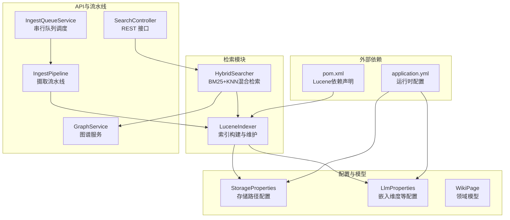
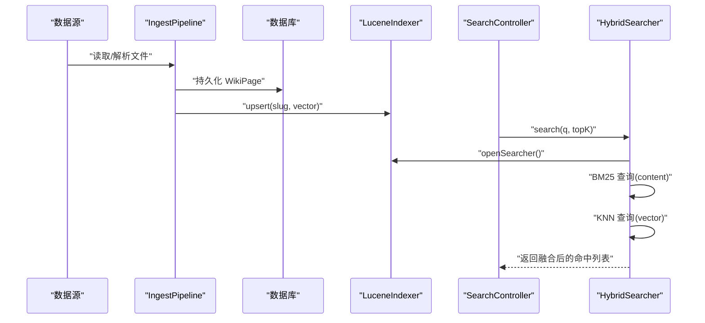
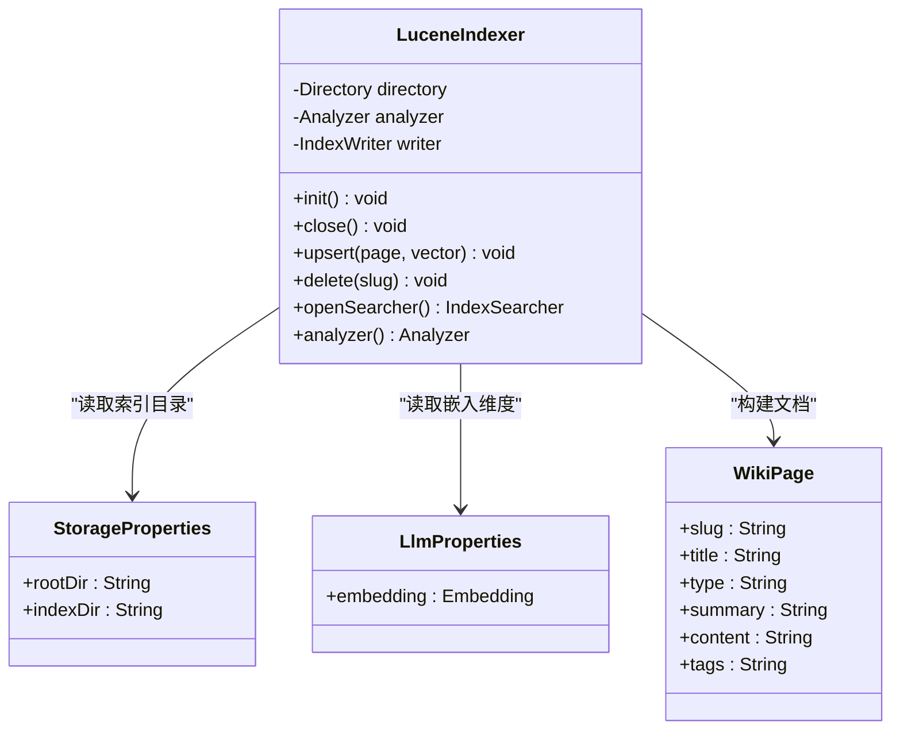
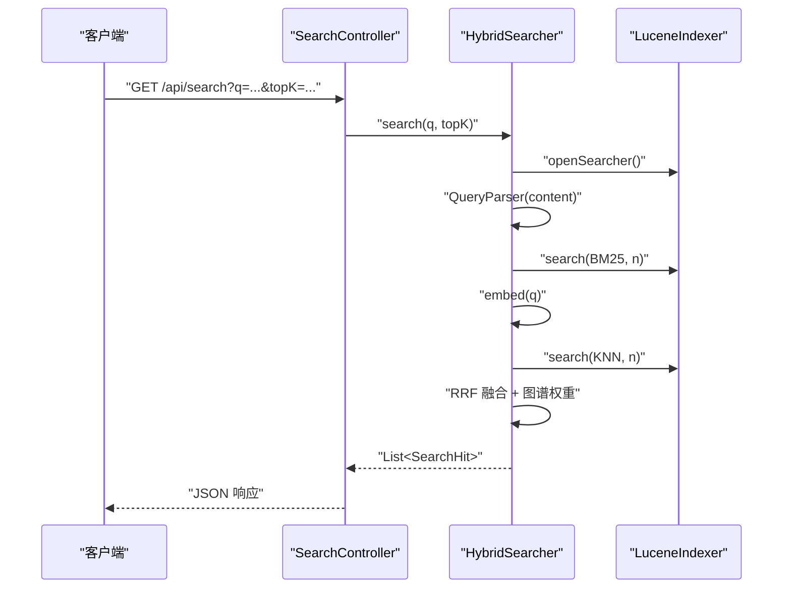
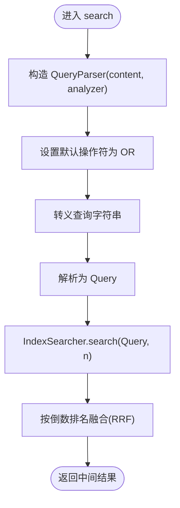
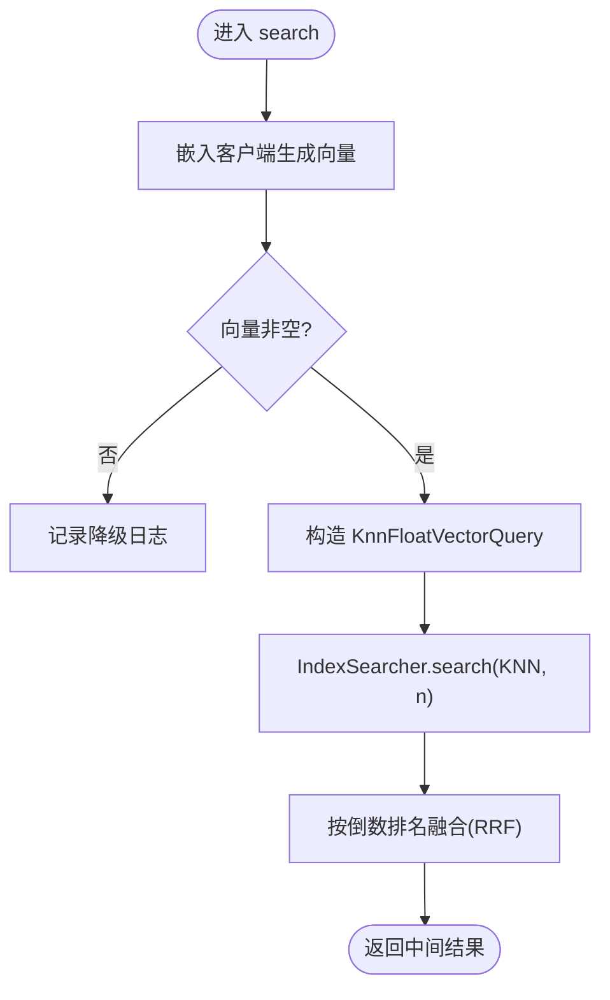
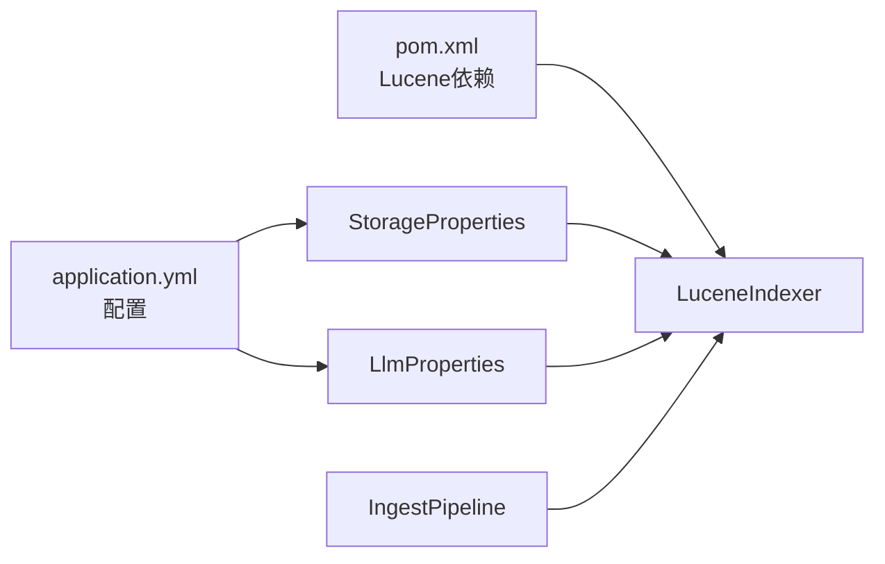

# Lucene索引器

<cite>
**本文引用的文件**
- [LuceneIndexer.java](file://src/main/java/com/example/llmwiki/retrieval/LuceneIndexer.java)
- [HybridSearcher.java](file://src/main/java/com/example/llmwiki/retrieval/HybridSearcher.java)
- [StorageProperties.java](file://src/main/java/com/example/llmwiki/config/StorageProperties.java)
- [LlmProperties.java](file://src/main/java/com/example/llmwiki/config/LlmProperties.java)
- [WikiPage.java](file://src/main/java/com/example/llmwiki/domain/WikiPage.java)
- [application.yml](file://src/main/resources/application.yml)
- [pom.xml](file://pom.xml)
- [SearchController.java](file://src/main/java/com/example/llmwiki/api/SearchController.java)
- [IngestPipeline.java](file://src/main/java/com/example/llmwiki/ingest/IngestPipeline.java)
- [IngestQueueService.java](file://src/main/java/com/example/llmwiki/queue/IngestQueueService.java)
- [GraphService.java](file://src/main/java/com/example/llmwiki/graph/GraphService.java)
- [EvalRunner.java](file://src/main/java/com/example/llmwiki/eval/EvalRunner.java)
</cite>

## 目录
1. [简介](#简介)
2. [项目结构](#项目结构)
3. [核心组件](#核心组件)
4. [架构总览](#架构总览)
5. [详细组件分析](#详细组件分析)
6. [依赖关系分析](#依赖关系分析)
7. [性能考虑](#性能考虑)
8. [故障排查指南](#故障排查指南)
9. [结论](#结论)
10. [附录](#附录)

## 简介
本文件针对 LLM Wiki 中的 Lucene 索引器进行系统性技术文档整理，覆盖以下主题：
- 全文搜索实现：索引构建策略、文档字段映射、分词器配置
- 索引优化技术：索引压缩、字段存储选项、分析器配置
- 查询优化技巧：布尔查询、模糊查询、短语查询的实现思路
- 索引维护操作：增量索引、批量更新、索引合并策略
- 性能调优指南：内存配置、并发写入、磁盘 I/O 优化
- 索引持久化：文件存储、备份恢复、版本管理
- 索引统计信息：文档数量、字段分布、索引大小分析
- 索引调试工具：索引检查器、查询解释器、性能分析器

## 项目结构
Lucene 索引器位于检索模块，与混合检索器、配置、领域模型、API 控制器、摄取流水线等共同构成知识库的检索与索引子系统。

**图表来源**
- [LuceneIndexer.java:39-117](file://src/main/java/com/example/llmwiki/retrieval/LuceneIndexer.java#L39-L117)
- [HybridSearcher.java:34-136](file://src/main/java/com/example/llmwiki/retrieval/HybridSearcher.java#L34-L136)
- [StorageProperties.java:16-28](file://src/main/java/com/example/llmwiki/config/StorageProperties.java#L16-L28)
- [LlmProperties.java:44-52](file://src/main/java/com/example/llmwiki/config/LlmProperties.java#L44-L52)
- [SearchController.java:21-31](file://src/main/java/com/example/llmwiki/api/SearchController.java#L21-L31)
- [IngestPipeline.java:66-93](file://src/main/java/com/example/llmwiki/ingest/IngestPipeline.java#L66-L93)
- [IngestQueueService.java:36-144](file://src/main/java/com/example/llmwiki/queue/IngestQueueService.java#L36-L144)
- [application.yml:31-57](file://src/main/resources/application.yml#L31-L57)
- [pom.xml:106-126](file://pom.xml#L106-L126)

**章节来源**
- [LuceneIndexer.java:39-117](file://src/main/java/com/example/llmwiki/retrieval/LuceneIndexer.java#L39-L117)
- [HybridSearcher.java:34-136](file://src/main/java/com/example/llmwiki/retrieval/HybridSearcher.java#L34-L136)
- [StorageProperties.java:16-28](file://src/main/java/com/example/llmwiki/config/StorageProperties.java#L16-L28)
- [LlmProperties.java:44-52](file://src/main/java/com/example/llmwiki/config/LlmProperties.java#L44-L52)
- [application.yml:31-57](file://src/main/resources/application.yml#L31-L57)
- [pom.xml:106-126](file://pom.xml#L106-L126)

## 核心组件
- 索引器（LuceneIndexer）
  - 初始化：基于存储配置创建索引目录，选择中文智能分词器，设置打开模式为“存在则追加”，并提交初始提交。
  - 文档字段映射：slug（主键）、type、title、summary、content、tags（文本字段，开启存储），向量字段 vector（KNN 浮点向量，余弦相似度）。
  - 维度校验与对齐：当传入向量维度与配置不一致时，按目标维度截断或填充。
  - 增量更新：以 slug 为 Term 执行 updateDocument，并在每次写入后 commit。
  - 删除：按 slug 删除文档并 commit。
  - 搜索器：对外暴露 openSearcher 与 analyzer，供上层检索器使用。
- 混合检索器（HybridSearcher）
  - BM25：使用 QueryParser 在 content 字段上执行 OR 默认的布尔查询，取前 N 结果参与融合。
  - KNN：调用嵌入客户端生成查询向量，执行 KnnFloatVectorQuery，同样取前 N 结果参与融合。
  - RRF 融合：对同一 slug 的不同来源结果进行倒数排名融合，随后结合图谱邻接权重做微调。
  - 结果封装：统一输出 SearchHit，包含 slug、title、type、summary、source（bm25/knn）与最终分数。
- 配置与模型
  - 存储路径：indexDir 指向 Lucene 索引目录。
  - 嵌入维度：embedding.dimensions 用于向量维度校验与对齐。
  - 领域模型：WikiPage 提供 slug、title、type、summary、content、tags 等字段，作为索引与检索的数据源。

**章节来源**
- [LuceneIndexer.java:48-117](file://src/main/java/com/example/llmwiki/retrieval/LuceneIndexer.java#L48-L117)
- [HybridSearcher.java:42-111](file://src/main/java/com/example/llmwiki/retrieval/HybridSearcher.java#L42-L111)
- [StorageProperties.java:24-25](file://src/main/java/com/example/llmwiki/config/StorageProperties.java#L24-L25)
- [LlmProperties.java:49-50](file://src/main/java/com/example/llmwiki/config/LlmProperties.java#L49-L50)
- [WikiPage.java:35-61](file://src/main/java/com/example/llmwiki/domain/WikiPage.java#L35-L61)

## 架构总览
下图展示从摄取到检索的关键流程：摄取流水线生成 WikiPage，写入数据库与 Markdown，同时调用索引器进行 upsert；前端通过 SearchController 触发 HybridSearcher，后者在索引上执行 BM25 与 KNN 查询并融合结果。

**图表来源**
- [IngestPipeline.java:88-93](file://src/main/java/com/example/llmwiki/ingest/IngestPipeline.java#L88-L93)
- [LuceneIndexer.java:78-98](file://src/main/java/com/example/llmwiki/retrieval/LuceneIndexer.java#L78-L98)
- [SearchController.java:25-30](file://src/main/java/com/example/llmwiki/api/SearchController.java#L25-L30)
- [HybridSearcher.java:42-111](file://src/main/java/com/example/llmwiki/retrieval/HybridSearcher.java#L42-L111)

## 详细组件分析

### 索引器类图

**图表来源**
- [LuceneIndexer.java:41-46](file://src/main/java/com/example/llmwiki/retrieval/LuceneIndexer.java#L41-L46)
- [StorageProperties.java:19-25](file://src/main/java/com/example/llmwiki/config/StorageProperties.java#L19-L25)
- [LlmProperties.java:44-50](file://src/main/java/com/example/llmwiki/config/LlmProperties.java#L44-L50)
- [WikiPage.java:35-61](file://src/main/java/com/example/llmwiki/domain/WikiPage.java#L35-L61)

**章节来源**
- [LuceneIndexer.java:39-117](file://src/main/java/com/example/llmwiki/retrieval/LuceneIndexer.java#L39-L117)

### 混合检索序列图

**图表来源**
- [SearchController.java:25-30](file://src/main/java/com/example/llmwiki/api/SearchController.java#L25-L30)
- [HybridSearcher.java:42-111](file://src/main/java/com/example/llmwiki/retrieval/HybridSearcher.java#L42-L111)
- [LuceneIndexer.java:106-108](file://src/main/java/com/example/llmwiki/retrieval/LuceneIndexer.java#L106-L108)

**章节来源**
- [HybridSearcher.java:42-111](file://src/main/java/com/example/llmwiki/retrieval/HybridSearcher.java#L42-L111)
- [SearchController.java:25-30](file://src/main/java/com/example/llmwiki/api/SearchController.java#L25-L30)

### 查询处理流程（BM25）

**图表来源**
- [HybridSearcher.java:50-65](file://src/main/java/com/example/llmwiki/retrieval/HybridSearcher.java#L50-L65)

**章节来源**
- [HybridSearcher.java:50-65](file://src/main/java/com/example/llmwiki/retrieval/HybridSearcher.java#L50-L65)

### 查询处理流程（KNN）

**图表来源**
- [HybridSearcher.java:67-86](file://src/main/java/com/example/llmwiki/retrieval/HybridSearcher.java#L67-L86)

**章节来源**
- [HybridSearcher.java:67-86](file://src/main/java/com/example/llmwiki/retrieval/HybridSearcher.java#L67-L86)

### 字段与向量映射
- 字段定义
  - slug：String 类型，作为主键字段，用于 update/delete。
  - type、title、summary、content、tags：TextField，开启存储，便于检索后直接读取。
  - vector：KnnFloatVectorField，使用余弦相似度，维度由 LlmProperties.embedding.dimensions 指定。
- 维度校验与对齐
  - 若传入向量长度与目标维度不一致，则按维度截断或填充，确保后续 KNN 查询稳定。

**章节来源**
- [LuceneIndexer.java:78-96](file://src/main/java/com/example/llmwiki/retrieval/LuceneIndexer.java#L78-L96)
- [LlmProperties.java:49-50](file://src/main/java/com/example/llmwiki/config/LlmProperties.java#L49-L50)

### 增量索引与删除
- 增量 upsert：以 slug 为 Term 更新文档，保证唯一性与幂等性。
- 删除：按 slug 删除文档。
- 提交：每次写入后立即 commit，确保数据可见性与一致性。

**章节来源**
- [LuceneIndexer.java:78-104](file://src/main/java/com/example/llmwiki/retrieval/LuceneIndexer.java#L78-L104)

### 分词器与分析器配置
- 使用 SmartChineseAnalyzer，适合中文分词场景。
- 混合检索中，BM25 查询使用该分析器对 content 字段进行解析。

**章节来源**
- [LuceneIndexer.java](file://src/main/java/com/example/llmwiki/retrieval/LuceneIndexer.java#L53)
- [HybridSearcher.java](file://src/main/java/com/example/llmwiki/retrieval/HybridSearcher.java#L51)

### 查询优化技巧
- 布尔查询：默认 OR 操作，提升召回率；可根据需要调整为 AND。
- 短语查询：可通过 QueryParser 的短语语法实现，适用于精确匹配场景。
- 模糊查询：可通过 QueryParser 的通配/模糊语法实现，注意性能影响。
- RRF 融合：对 BM25 与 KNN 的结果进行倒数排名融合，兼顾相关性与语义近似。
- 图谱权重：基于邻接关系对命中节点进行微调，增强上下文相关性。

**章节来源**
- [HybridSearcher.java:36-97](file://src/main/java/com/example/llmwiki/retrieval/HybridSearcher.java#L36-L97)

### 索引维护操作
- 增量索引：摄取流水线在持久化 WikiPage 后调用 upsert，实现按页增量更新。
- 批量更新：当前实现为逐页 upsert 并 commit；如需更高吞吐，可在业务侧聚合后再提交。
- 索引合并：Lucene 默认后台合并策略；如需控制，可在 IndexWriterConfig 中配置合并参数（当前未显式配置）。

**章节来源**
- [IngestPipeline.java:88-93](file://src/main/java/com/example/llmwiki/ingest/IngestPipeline.java#L88-L93)
- [LuceneIndexer.java:78-98](file://src/main/java/com/example/llmwiki/retrieval/LuceneIndexer.java#L78-L98)

### 性能调优指南
- 内存配置：合理设置 JVM 堆大小，避免频繁 GC；Lucene 内部会使用堆外内存进行索引缓冲。
- 并发写入：当前索引器方法为同步串行，避免并发写入导致的锁竞争；如需并发，建议引入写队列或分片。
- 磁盘 I/O：将 indexDir 放置于高性能磁盘；减少随机写，尽量顺序写入；定期监控磁盘空间与吞吐。
- 合并策略：根据写入频率与查询延迟权衡，适当调优合并参数（如合并因子、最大段大小）。
- 查询参数：合理设置 n（BM25/KNN 查询返回数量）与 topK，避免过度打分与排序。

**章节来源**
- [application.yml:31-57](file://src/main/resources/application.yml#L31-L57)
- [pom.xml](file://pom.xml#L31)

### 索引持久化
- 文件存储：索引目录由 StorageProperties.indexDir 指定，默认位于 data/index。
- 备份恢复：可直接复制 indexDir 目录进行备份；恢复时停止服务后替换目录。
- 版本管理：Lucene 自身具备版本兼容性；升级 Lucene 版本时需评估迁移成本。

**章节来源**
- [StorageProperties.java:24-25](file://src/main/java/com/example/llmwiki/config/StorageProperties.java#L24-L25)
- [application.yml](file://src/main/resources/application.yml#L37)

### 索引统计信息
- 文档数量：可通过 IndexReader.numDocs()/maxDoc() 获取。
- 字段分布：通过 stored fields 读取 title、summary、content、tags 等字段统计。
- 索引大小：通过 Directory 的文件大小汇总计算。

**章节来源**
- [HybridSearcher.java:58-59](file://src/main/java/com/example/llmwiki/retrieval/HybridSearcher.java#L58-L59)

### 索引调试工具
- 索引检查器：使用 IndexReader/DirectoryReader 遍历段与文档，验证字段与向量是否存在。
- 查询解释器：使用 QueryParser 解析查询并输出解释信息，定位布尔/短语/模糊查询问题。
- 性能分析器：结合系统监控（CPU、内存、磁盘 I/O）与日志采样，定位慢查询与写入瓶颈。

**章节来源**
- [HybridSearcher.java:51-53](file://src/main/java/com/example/llmwiki/retrieval/HybridSearcher.java#L51-L53)

## 依赖关系分析
- Lucene 依赖
  - lucene-core、lucene-queryparser、lucene-analysis-common、lucene-analysis-smartcn
- 运行时配置
  - indexDir、embedding.dimensions 等通过 application.yml 与配置类注入。
- 摄取与索引耦合
  - IngestPipeline 在完成持久化后调用索引器，形成“落库-索引”的串行链路。

**图表来源**
- [pom.xml:106-126](file://pom.xml#L106-L126)
- [application.yml:31-57](file://src/main/resources/application.yml#L31-L57)
- [StorageProperties.java:16-28](file://src/main/java/com/example/llmwiki/config/StorageProperties.java#L16-L28)
- [LlmProperties.java:18-51](file://src/main/java/com/example/llmwiki/config/LlmProperties.java#L18-L51)
- [IngestPipeline.java:88-93](file://src/main/java/com/example/llmwiki/ingest/IngestPipeline.java#L88-L93)

**章节来源**
- [pom.xml:106-126](file://pom.xml#L106-L126)
- [application.yml:31-57](file://src/main/resources/application.yml#L31-L57)

## 性能考虑
- 写入路径
  - 当前实现为逐页 upsert 并 commit，简单可靠但吞吐有限；可考虑批量化提交与异步写队列。
- 查询路径
  - BM25 与 KNN 各自取前 N，再进行 RRF 融合；建议根据业务调优 N 与 topK。
- 资源占用
  - 分词器与向量相似度计算均消耗 CPU；建议在高并发场景下限制并发查询或引入缓存。

[本节为通用指导，无需特定文件引用]

## 故障排查指南
- 索引无法启动
  - 检查 indexDir 是否可写；确认初始化逻辑已执行并 commit。
- 查询无结果
  - 确认 content 字段是否正确建立；检查 QueryParser 的默认操作符与转义。
- 向量维度不匹配
  - 核对 LlmProperties.embedding.dimensions 与实际嵌入维度；查看索引器的维度对齐逻辑。
- 摄取未生效
  - 检查 IngestPipeline 是否调用了索引器的 upsert；确认 slug 唯一且未被删除。

**章节来源**
- [LuceneIndexer.java:48-58](file://src/main/java/com/example/llmwiki/retrieval/LuceneIndexer.java#L48-L58)
- [HybridSearcher.java:51-65](file://src/main/java/com/example/llmwiki/retrieval/HybridSearcher.java#L51-L65)
- [IngestPipeline.java:88-93](file://src/main/java/com/example/llmwiki/ingest/IngestPipeline.java#L88-L93)

## 结论
本索引器以单一 Lucene 索引同时支撑 BM25 全文检索与 KNN 向量检索，配合 RRF 融合与图谱权重，形成高效稳定的混合检索方案。通过合理的字段设计、分词器配置与增量维护策略，能够在中小规模知识库场景下获得良好的性能与可维护性。对于更大规模与更高并发需求，建议引入批量写入、合并策略调优与查询缓存等优化手段。

[本节为总结性内容，无需特定文件引用]

## 附录
- 评测集成
  - EvalRunner 对 HybridSearcher 的调用包含延迟与命中率统计，可用于评估索引质量与检索效果。

**章节来源**
- [EvalRunner.java:76-104](file://src/main/java/com/example/llmwiki/eval/EvalRunner.java#L76-L104)