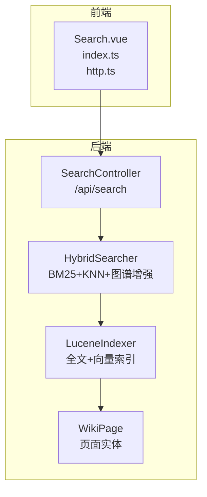
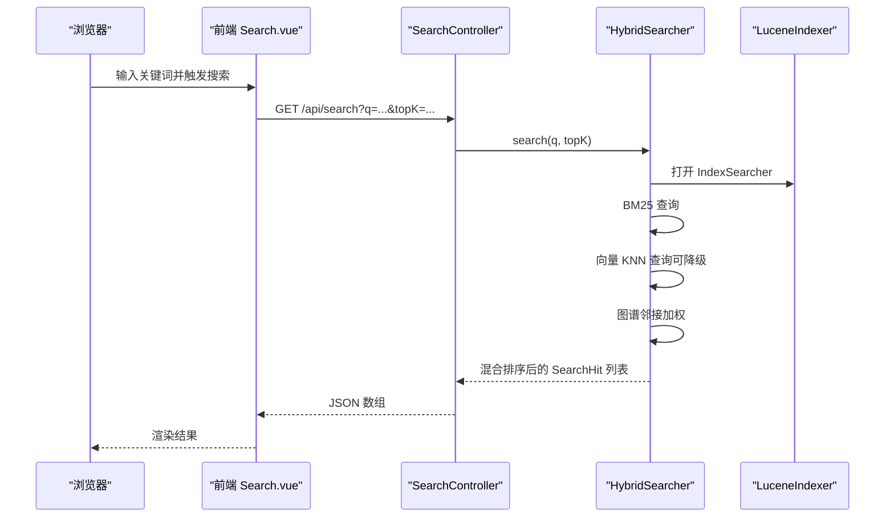
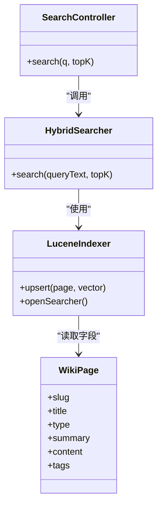

# 搜索API设计

<cite>
**本文引用的文件**
- [SearchController.java](file://src/main/java/com/example/llmwiki/api/SearchController.java)
- [HybridSearcher.java](file://src/main/java/com/example/llmwiki/retrieval/HybridSearcher.java)
- [LuceneIndexer.java](file://src/main/java/com/example/llmwiki/retrieval/LuceneIndexer.java)
- [WikiPage.java](file://src/main/java/com/example/llmwiki/domain/WikiPage.java)
- [WebConfig.java](file://src/main/java/com/example/llmwiki/config/WebConfig.java)
- [application.yml](file://src/main/resources/application.yml)
- [http.ts](file://web/src/api/http.ts)
- [index.ts](file://web/src/api/index.ts)
- [Search.vue](file://web/src/views/Search.vue)
- [StorageProperties.java](file://src/main/java/com/example/llmwiki/config/StorageProperties.java)
- [LlmProperties.java](file://src/main/java/com/example/llmwiki/config/LlmProperties.java)
</cite>

## 目录
1. [简介](#简介)
2. [项目结构](#项目结构)
3. [核心组件](#核心组件)
4. [架构总览](#架构总览)
5. [详细组件分析](#详细组件分析)
6. [依赖分析](#依赖分析)
7. [性能考虑](#性能考虑)
8. [故障排查指南](#故障排查指南)
9. [结论](#结论)
10. [附录](#附录)

## 简介
本文件为 LLM Wiki 的搜索 API 设计文档，聚焦 SearchController 接口规范与实现细节，覆盖以下主题：
- 接口规范：HTTP 方法、URL 模式、请求/响应格式
- 查询参数设计：关键词、结果数量
- 响应数据结构：字段定义、相关性评分
- 认证与授权：当前实现未内置鉴权，建议结合网关或中间件
- 错误处理：异常类型与日志行为
- 版本管理：当前版本与兼容性建议
- 性能优化：缓存、批量、压缩等策略
- 测试工具：前端调用方式与本地调试
- 监控与日志：请求追踪与性能指标

## 项目结构
搜索能力由三层组成：
- 控制层：REST 控制器负责接收请求并返回结果
- 检索层：混合检索器整合 BM25 与向量检索，并进行图谱增强
- 索引层：基于 Lucene 的全文与向量索引

**图表来源**
- [SearchController.java:18-31](file://src/main/java/com/example/llmwiki/api/SearchController.java#L18-L31)
- [HybridSearcher.java:31-111](file://src/main/java/com/example/llmwiki/retrieval/HybridSearcher.java#L31-L111)
- [LuceneIndexer.java:36-117](file://src/main/java/com/example/llmwiki/retrieval/LuceneIndexer.java#L36-L117)
- [WikiPage.java:23-71](file://src/main/java/com/example/llmwiki/domain/WikiPage.java#L23-L71)

**章节来源**
- [SearchController.java:18-31](file://src/main/java/com/example/llmwiki/api/SearchController.java#L18-L31)
- [HybridSearcher.java:31-111](file://src/main/java/com/example/llmwiki/retrieval/HybridSearcher.java#L31-L111)
- [LuceneIndexer.java:36-117](file://src/main/java/com/example/llmwiki/retrieval/LuceneIndexer.java#L36-L117)
- [WikiPage.java:23-71](file://src/main/java/com/example/llmwiki/domain/WikiPage.java#L23-L71)

## 核心组件
- SearchController：提供 GET /api/search，接收关键词与结果数量，返回混合检索结果
- HybridSearcher：实现 BM25 全文检索、向量 KNN 检索、图谱邻接加权融合
- LuceneIndexer：构建与维护 Lucene 索引，支持中文分词与向量字段
- WikiPage：页面实体，承载检索所需字段（slug、title、summary、content、tags、type）

**章节来源**
- [SearchController.java:25-30](file://src/main/java/com/example/llmwiki/api/SearchController.java#L25-L30)
- [HybridSearcher.java:42-111](file://src/main/java/com/example/llmwiki/retrieval/HybridSearcher.java#L42-L111)
- [LuceneIndexer.java:78-108](file://src/main/java/com/example/llmwiki/retrieval/LuceneIndexer.java#L78-L108)
- [WikiPage.java:35-66](file://src/main/java/com/example/llmwiki/domain/WikiPage.java#L35-L66)

## 架构总览
下图展示从浏览器到后端的完整调用链路。

**图表来源**
- [Search.vue:34-39](file://web/src/views/Search.vue#L34-L39)
- [index.ts:39-40](file://web/src/api/index.ts#L39-L40)
- [http.ts:3-6](file://web/src/api/http.ts#L3-L6)
- [SearchController.java:25-30](file://src/main/java/com/example/llmwiki/api/SearchController.java#L25-L30)
- [HybridSearcher.java:42-111](file://src/main/java/com/example/llmwiki/retrieval/HybridSearcher.java#L42-L111)
- [LuceneIndexer.java:106-108](file://src/main/java/com/example/llmwiki/retrieval/LuceneIndexer.java#L106-L108)

## 详细组件分析

### 接口规范
- HTTP 方法：GET
- URL 模式：/api/search
- 请求参数：
  - q：关键词（必填）
  - topK：返回条数，默认 10（可选）
- 响应格式：JSON 数组，元素为 SearchHit 对象

前端调用示例（路径与参数）：
- [index.ts:39-40](file://web/src/api/index.ts#L39-L40)
- [http.ts:3-6](file://web/src/api/http.ts#L3-L6)
- [Search.vue:34-39](file://web/src/views/Search.vue#L34-L39)

**章节来源**
- [SearchController.java:25-30](file://src/main/java/com/example/llmwiki/api/SearchController.java#L25-L30)
- [index.ts:39-40](file://web/src/api/index.ts#L39-L40)
- [http.ts:3-6](file://web/src/api/http.ts#L3-L6)
- [Search.vue:34-39](file://web/src/views/Search.vue#L34-L39)

### 查询参数设计
- q：全文检索关键词，支持多词 OR 条件
- topK：控制返回前 N 条，内部会扩展至至少 10 以提升召回

实现要点：
- BM25 查询使用 Lucene QueryParser，OR 默认操作符
- KNN 向量查询依赖 EmbeddingClient，若不可用则降级为仅 BM25
- 图谱邻接加权对命中节点的邻居进行微幅增益

**章节来源**
- [SearchController.java:26-29](file://src/main/java/com/example/llmwiki/api/SearchController.java#L26-L29)
- [HybridSearcher.java:49-86](file://src/main/java/com/example/llmwiki/retrieval/HybridSearcher.java#L49-L86)
- [LuceneIndexer.java:106-108](file://src/main/java/com/example/llmwiki/retrieval/LuceneIndexer.java#L106-L108)

### 响应数据结构
SearchHit 字段定义：
- slug：页面唯一标识
- title：页面标题
- type：页面类型
- summary：摘要
- source：来源（bm25 或 knn）
- score：最终得分（融合后的相关性分数）

前端渲染使用：
- [Search.vue:11-21](file://web/src/views/Search.vue#L11-L21)

**章节来源**
- [HybridSearcher.java:124-135](file://src/main/java/com/example/llmwiki/retrieval/HybridSearcher.java#L124-L135)
- [Search.vue:11-21](file://web/src/views/Search.vue#L11-L21)

### 认证与授权
- 当前实现未内置鉴权机制
- 建议在网关或过滤器中增加 API Key 校验与访问控制
- CORS 已全局开放，便于前端直连

**章节来源**
- [WebConfig.java:18-25](file://src/main/java/com/example/llmwiki/config/WebConfig.java#L18-L25)

### 错误处理机制
- 控制器抛出异常时由 Spring 默认异常处理流程接管
- 检索器内捕获异常并记录警告日志，不影响整体返回
- LLM 相关异常（如 Embedding 不可用）会触发降级

常见异常来源：
- LlmException：来自 LLM 客户端调用失败
- 其他异常：Lucene 查询或向量计算失败

**章节来源**
- [HybridSearcher.java:62-86](file://src/main/java/com/example/llmwiki/retrieval/HybridSearcher.java#L62-L86)
- [application.yml:78-84](file://src/main/resources/application.yml#L78-L84)

### API 版本管理
- 当前未实现显式版本号（如 /api/v1/search）
- 建议引入版本前缀与弃用策略，确保向后兼容
- 可参考 SettingsController 的热更新模式，避免破坏性变更

**章节来源**
- [SearchController.java:18-21](file://src/main/java/com/example/llmwiki/api/SearchController.java#L18-L21)
- [application.yml:31-77](file://src/main/resources/application.yml#L31-L77)

### 性能优化
- 缓存策略：可引入 Redis 缓存热门查询与结果
- 批量请求：前端合并短时间内的多次相同查询
- 响应压缩：启用 Gzip 压缩减少传输体积
- 索引优化：合理设置 topK 与 n，避免过度扫描
- 向量维度与相似度函数：与 LLM 配置保持一致

**章节来源**
- [LuceneIndexer.java:87-96](file://src/main/java/com/example/llmwiki/retrieval/LuceneIndexer.java#L87-L96)
- [LlmProperties.java:44-52](file://src/main/java/com/example/llmwiki/config/LlmProperties.java#L44-L52)

### API 测试工具
- Swagger：当前未集成 Swagger/OpenAPI
- Postman：可直接导入 /api/search 的 GET 请求
- 自动化测试：可在前端 index.ts 中直接调用 search(q, topK)，便于集成测试

**章节来源**
- [index.ts:39-40](file://web/src/api/index.ts#L39-L40)
- [http.ts:3-6](file://web/src/api/http.ts#L3-L6)

### 监控与日志
- 日志级别：root/INFO，llm-wiki/DEBUG，Lucene/警告级别
- 建议增加：
  - 请求追踪 ID（TraceId）
  - 检索耗时指标（p95/p99）
  - 错误率统计与告警

**章节来源**
- [application.yml:78-84](file://src/main/resources/application.yml#L78-L84)

## 依赖分析
- SearchController 依赖 HybridSearcher
- HybridSearcher 依赖 LuceneIndexer、EmbeddingClient、GraphService
- LuceneIndexer 依赖 StorageProperties、LlmProperties
- WikiPage 提供索引字段映射

**图表来源**
- [SearchController.java:23-30](file://src/main/java/com/example/llmwiki/api/SearchController.java#L23-L30)
- [HybridSearcher.java:38-40](file://src/main/java/com/example/llmwiki/retrieval/HybridSearcher.java#L38-L40)
- [LuceneIndexer.java:78-108](file://src/main/java/com/example/llmwiki/retrieval/LuceneIndexer.java#L78-L108)
- [WikiPage.java:35-66](file://src/main/java/com/example/llmwiki/domain/WikiPage.java#L35-L66)

**章节来源**
- [SearchController.java:23-30](file://src/main/java/com/example/llmwiki/api/SearchController.java#L23-L30)
- [HybridSearcher.java:38-40](file://src/main/java/com/example/llmwiki/retrieval/HybridSearcher.java#L38-L40)
- [LuceneIndexer.java:78-108](file://src/main/java/com/example/llmwiki/retrieval/LuceneIndexer.java#L78-L108)
- [WikiPage.java:35-66](file://src/main/java/com/example/llmwiki/domain/WikiPage.java#L35-L66)

## 性能考虑
- 检索路径：
  - BM25：全文匹配，适合关键词召回
  - KNN：向量相似度，适合语义匹配；失败时自动降级
  - 图谱增强：对命中节点的邻居进行微幅加权
- 建议：
  - 合理设置 topK，避免过大导致 IO 压力
  - 使用向量缓存与预热
  - 前端去抖与防抖，减少重复请求

**章节来源**
- [HybridSearcher.java:42-111](file://src/main/java/com/example/llmwiki/retrieval/HybridSearcher.java#L42-L111)

## 故障排查指南
- 无结果：
  - 检查索引是否已建立（首次启动会自动初始化）
  - 确认关键词是否过短或被分词过滤
- LLM 相关错误：
  - Embedding 不可用时会降级为 BM25
  - 检查 LLM 配置（baseUrl、apiKey、dimensions）
- 日志定位：
  - 查看 WARN/ERROR 级别日志，关注 BM25/KNN/图谱阶段的异常

**章节来源**
- [HybridSearcher.java:62-86](file://src/main/java/com/example/llmwiki/retrieval/HybridSearcher.java#L62-L86)
- [application.yml:78-84](file://src/main/resources/application.yml#L78-L84)
- [LlmProperties.java:44-52](file://src/main/java/com/example/llmwiki/config/LlmProperties.java#L44-L52)

## 结论
SearchController 提供简洁高效的搜索接口，HybridSearcher 将 BM25 与向量检索融合，并通过图谱增强提升相关性。当前实现未内置鉴权与版本管理，建议在网关层补充鉴权与版本控制，并完善监控与日志体系以支撑生产环境。

## 附录

### 接口定义速览
- 方法：GET
- 路径：/api/search
- 参数：
  - q：关键词（必填）
  - topK：返回条数（默认 10）
- 响应：SearchHit 数组

**章节来源**
- [SearchController.java:25-30](file://src/main/java/com/example/llmwiki/api/SearchController.java#L25-L30)
- [index.ts:39-40](file://web/src/api/index.ts#L39-L40)

### 响应字段说明
- slug：页面唯一标识
- title：标题
- type：类型
- summary：摘要
- source：来源（bm25/knn）
- score：相关性分数

**章节来源**
- [HybridSearcher.java:124-135](file://src/main/java/com/example/llmwiki/retrieval/HybridSearcher.java#L124-L135)

### 配置参考
- 存储路径：索引目录、数据根目录
- LLM 配置：Chat/Embedding/Vision 的 base-url、api-key、维度、超时

**章节来源**
- [StorageProperties.java:18-28](file://src/main/java/com/example/llmwiki/config/StorageProperties.java#L18-L28)
- [LlmProperties.java:31-61](file://src/main/java/com/example/llmwiki/config/LlmProperties.java#L31-L61)