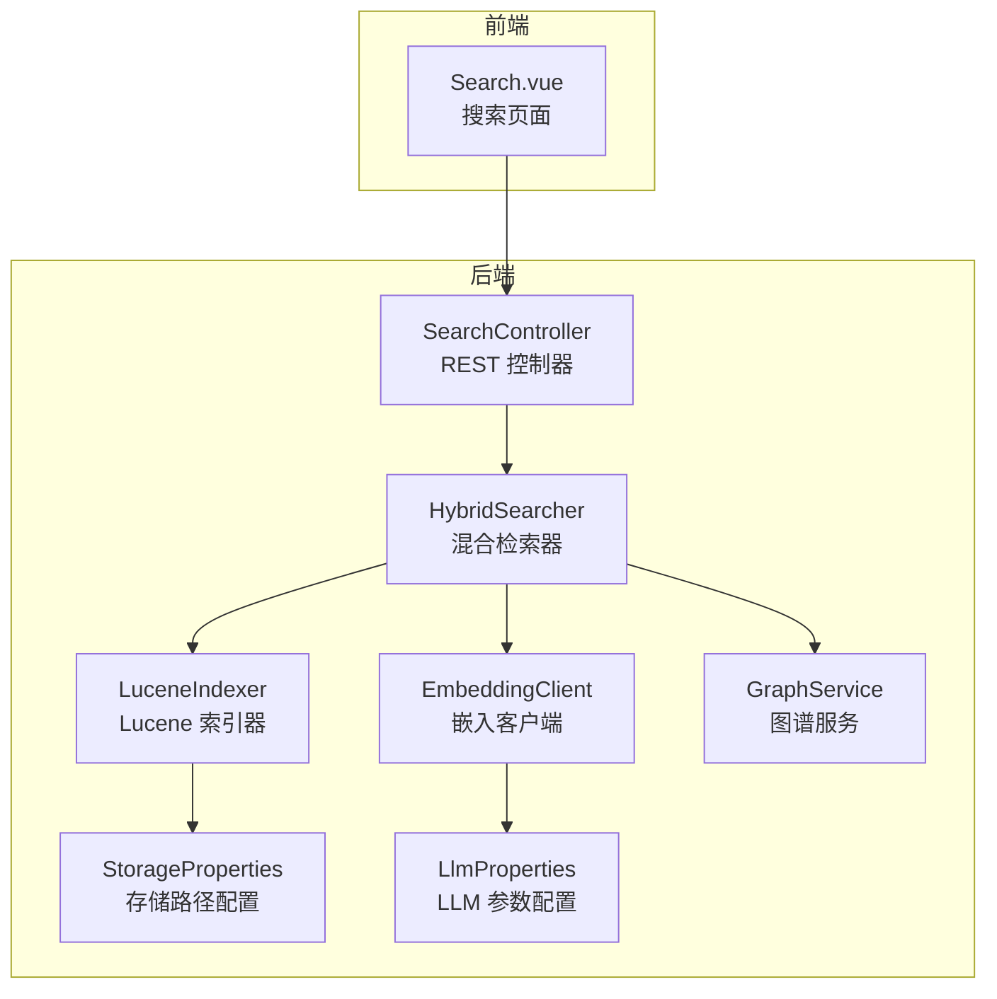
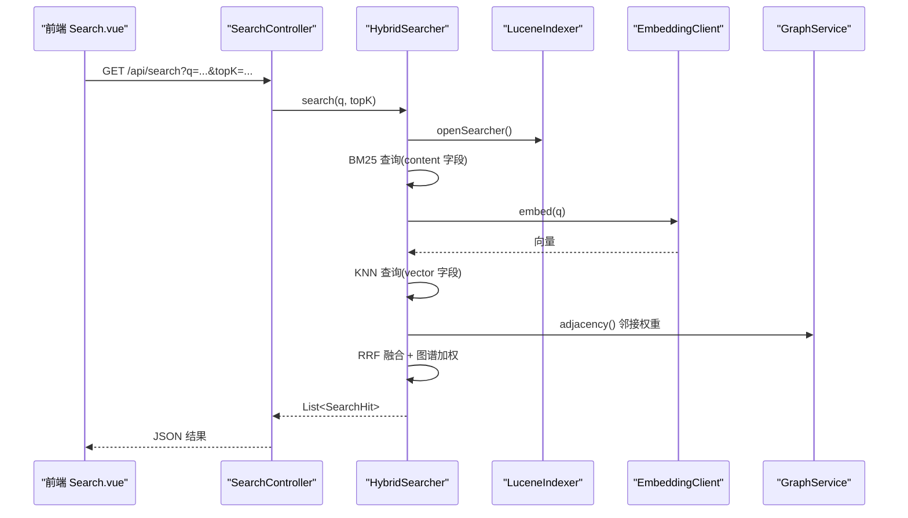
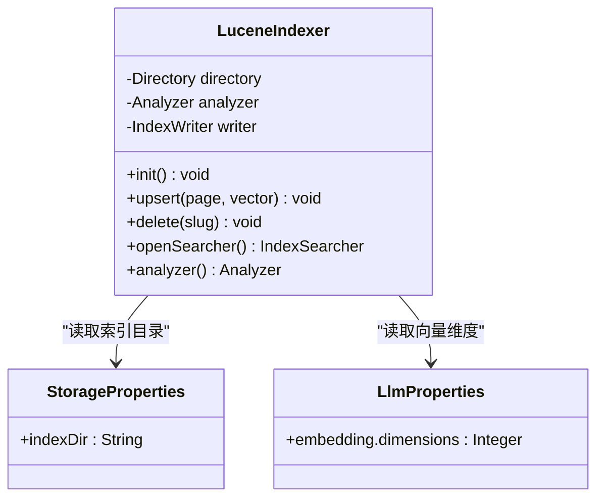
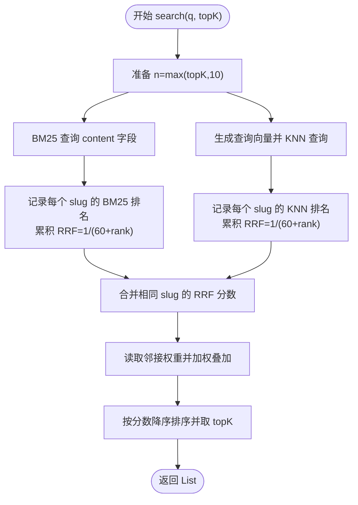
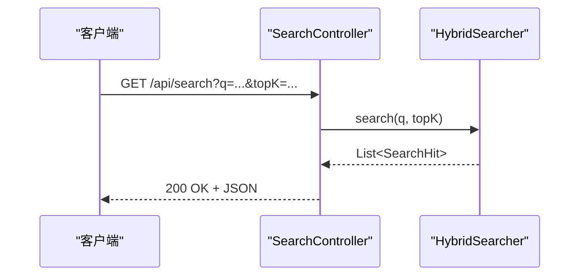
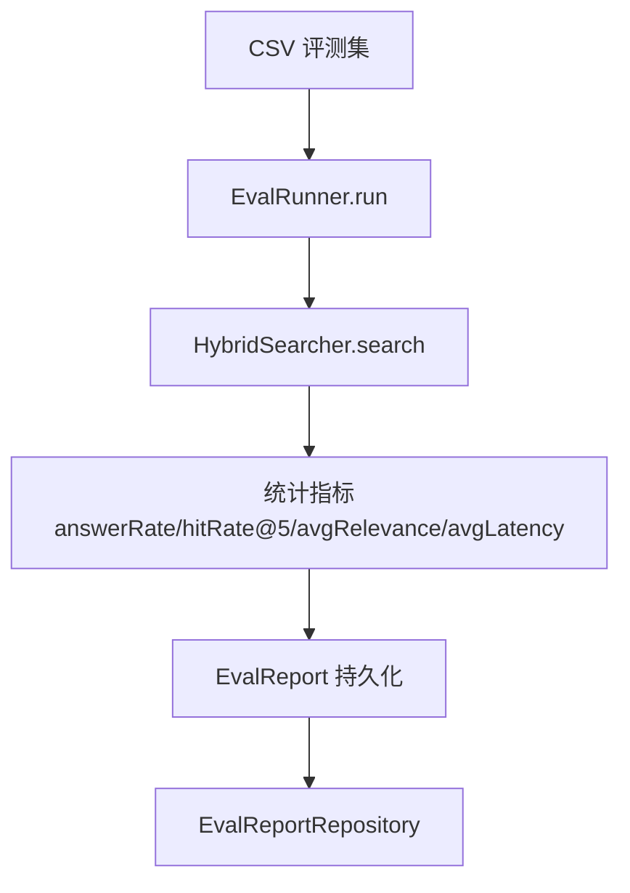
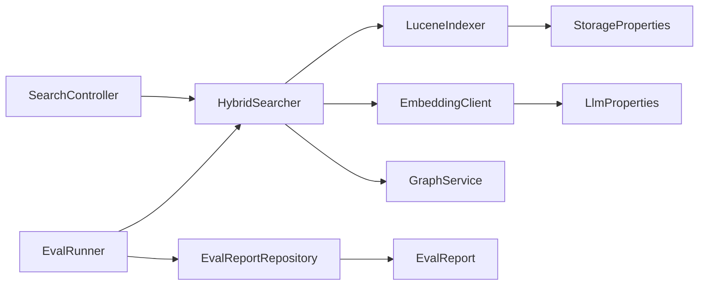

# 搜索检索系统

<cite>
**本文引用的文件**
- [LuceneIndexer.java](file://src/main/java/com/example/llmwiki/retrieval/LuceneIndexer.java)
- [HybridSearcher.java](file://src/main/java/com/example/llmwiki/retrieval/HybridSearcher.java)
- [SearchController.java](file://src/main/java/com/example/llmwiki/api/SearchController.java)
- [EmbeddingClient.java](file://src/main/java/com/example/llmwiki/llm/EmbeddingClient.java)
- [GraphService.java](file://src/main/java/com/example/llmwiki/graph/GraphService.java)
- [WikiPage.java](file://src/main/java/com/example/llmwiki/domain/WikiPage.java)
- [application.yml](file://src/main/resources/application.yml)
- [StorageProperties.java](file://src/main/java/com/example/llmwiki/config/StorageProperties.java)
- [LlmProperties.java](file://src/main/java/com/example/llmwiki/config/LlmProperties.java)
- [EvalRunner.java](file://src/main/java/com/example/llmwiki/eval/EvalRunner.java)
- [EvalReport.java](file://src/main/java/com/example/llmwiki/domain/EvalReport.java)
- [EvalReportRepository.java](file://src/main/java/com/example/llmwiki/repository/EvalReportRepository.java)
- [Search.vue](file://web/src/views/Search.vue)
</cite>

## 目录
1. [简介](#简介)
2. [项目结构](#项目结构)
3. [核心组件](#核心组件)
4. [架构总览](#架构总览)
5. [详细组件分析](#详细组件分析)
6. [依赖关系分析](#依赖关系分析)
7. [性能考虑](#性能考虑)
8. [故障排查指南](#故障排查指南)
9. [结论](#结论)
10. [附录](#附录)

## 简介
本文件面向“LLM Wiki 搜索检索系统”，围绕以下目标展开：LuceneIndexer 的索引构建策略与向量字段管理；HybridSearcher 的混合检索流程（BM25 + 向量 KNN + RRF 融合 + 图谱邻接加权）；SearchController 的 API 设计与参数规范；搜索增强与排序策略；性能优化手段（索引压缩、查询缓存、分页）；统计分析与评测体系；调试与验证工具。文档以循序渐进的方式呈现，既适合工程实践者，也便于非技术读者理解。

## 项目结构
后端采用 Spring Boot，检索子系统位于 retrieval 包，对外提供 REST 接口，前端 Vue 应用通过 HTTP 调用搜索接口。配置集中在 application.yml，索引与图谱数据落盘在 data 目录下。

图表来源
- [SearchController.java:18-31](file://src/main/java/com/example/llmwiki/api/SearchController.java#L18-L31)
- [HybridSearcher.java:31-40](file://src/main/java/com/example/llmwiki/retrieval/HybridSearcher.java#L31-L40)
- [LuceneIndexer.java:36-47](file://src/main/java/com/example/llmwiki/retrieval/LuceneIndexer.java#L36-L47)
- [EmbeddingClient.java:22-29](file://src/main/java/com/example/llmwiki/llm/EmbeddingClient.java#L22-L29)
- [GraphService.java:34-47](file://src/main/java/com/example/llmwiki/graph/GraphService.java#L34-L47)
- [StorageProperties.java:13-28](file://src/main/java/com/example/llmwiki/config/StorageProperties.java#L13-L28)
- [LlmProperties.java:16-28](file://src/main/java/com/example/llmwiki/config/LlmProperties.java#L16-L28)
- [Search.vue:26-40](file://web/src/views/Search.vue#L26-L40)

章节来源
- [application.yml:1-84](file://src/main/resources/application.yml#L1-L84)

## 核心组件
- LuceneIndexer：负责索引初始化、中文分词、文档 upsert/delete、向量字段写入（KNN）、索引读取器开放。
- HybridSearcher：组合 BM25 文本检索与向量 KNN 检索，使用 Reciprocal Rank Fusion(RRF) 融合，并引入图谱邻接权重进行二次加权。
- SearchController：提供 /api/search GET 接口，接收查询词与 topK 参数，返回 SearchHit 列表。
- EmbeddingClient：封装 OpenAI 兼容的嵌入接口，批量生成向量。
- GraphService：维护节点、邻接表与社区信息，提供邻接权重用于结果加权。
- 配置类：StorageProperties、LlmProperties 提供索引目录与嵌入维度等关键参数。
- 评测与报告：EvalRunner 读取 CSV 评测集，计算 answerRate、hitRate@5、avgRelevance、avgLatency 等指标并持久化到 EvalReport。

章节来源
- [LuceneIndexer.java:36-118](file://src/main/java/com/example/llmwiki/retrieval/LuceneIndexer.java#L36-L118)
- [HybridSearcher.java:31-136](file://src/main/java/com/example/llmwiki/retrieval/HybridSearcher.java#L31-L136)
- [SearchController.java:18-31](file://src/main/java/com/example/llmwiki/api/SearchController.java#L18-L31)
- [EmbeddingClient.java:22-90](file://src/main/java/com/example/llmwiki/llm/EmbeddingClient.java#L22-L90)
- [GraphService.java:34-197](file://src/main/java/com/example/llmwiki/graph/GraphService.java#L34-L197)
- [StorageProperties.java:13-28](file://src/main/java/com/example/llmwiki/config/StorageProperties.java#L13-L28)
- [LlmProperties.java:16-63](file://src/main/java/com/example/llmwiki/config/LlmProperties.java#L16-L63)
- [EvalRunner.java:43-135](file://src/main/java/com/example/llmwiki/eval/EvalRunner.java#L43-L135)
- [EvalReport.java:23-51](file://src/main/java/com/example/llmwiki/domain/EvalReport.java#L23-L51)
- [EvalReportRepository.java:10-11](file://src/main/java/com/example/llmwiki/repository/EvalReportRepository.java#L10-L11)

## 架构总览
系统采用“控制器-检索器-索引/嵌入/图谱”的分层设计。搜索请求从 REST 接口进入，HybridSearcher 并行执行 BM25 与 KNN 检索，融合后根据图谱邻接权重微调得分，最终返回统一的 SearchHit 结构。

图表来源
- [SearchController.java:25-30](file://src/main/java/com/example/llmwiki/api/SearchController.java#L25-L30)
- [HybridSearcher.java:42-111](file://src/main/java/com/example/llmwiki/retrieval/HybridSearcher.java#L42-L111)
- [LuceneIndexer.java:106-108](file://src/main/java/com/example/llmwiki/retrieval/LuceneIndexer.java#L106-L108)
- [EmbeddingClient.java:34-81](file://src/main/java/com/example/llmwiki/llm/EmbeddingClient.java#L34-L81)
- [GraphService.java:124-126](file://src/main/java/com/example/llmwiki/graph/GraphService.java#L124-L126)

## 详细组件分析

### LuceneIndexer：索引构建与向量字段
- 初始化与生命周期
  - 使用 FSDirectory 在配置的索引目录初始化索引；SmartChineseAnalyzer 支持中文分词；IndexWriterConfig 设置为 CREATE_OR_APPEND，启动时自动 commit。
  - @PreDestroy 确保资源释放。
- 文档字段与向量
  - 写入字段：slug（主键）、type、title、summary、content、tags；当存在向量时写入 KnnFloatVectorField(vector)，相似度函数为余弦。
  - upsert 会基于 slug 更新文档并 commit；delete 基于 slug 删除并 commit。
- 向量维度与兼容性
  - 写入前按 LlmProperties.embedding.dimensions 对齐或截断，确保与远端模型维度一致。

图表来源
- [LuceneIndexer.java:36-118](file://src/main/java/com/example/llmwiki/retrieval/LuceneIndexer.java#L36-L118)
- [StorageProperties.java:16-27](file://src/main/java/com/example/llmwiki/config/StorageProperties.java#L16-L27)
- [LlmProperties.java:44-51](file://src/main/java/com/example/llmwiki/config/LlmProperties.java#L44-L51)

章节来源
- [LuceneIndexer.java:48-118](file://src/main/java/com/example/llmwiki/retrieval/LuceneIndexer.java#L48-L118)
- [application.yml:31-51](file://src/main/resources/application.yml#L31-L51)

### HybridSearcher：混合检索与排序
- 检索策略
  - BM25：针对 content 字段使用 QueryParser（默认 OR），取 topN（max(topK, 10)）。
  - KNN：调用 EmbeddingClient 生成查询向量，构造 KnnFloatVectorQuery，同样取 topN。
  - RRF 融合：对同一 slug 的两条命中的排名分别计算 1/(K+rank)，K=60，累加作为最终分数。
- 图谱加权
  - 从 GraphService.adjacency() 获取与命中节点相邻的节点及其权重，按比例叠加到 RRF 分数上（权重系数 0.001）。
- 结果对象
  - SearchHit 包含 slug、title、type、summary、source（bm25/knn）、score（RRF 或融合后的分数）。

图表来源
- [HybridSearcher.java:42-111](file://src/main/java/com/example/llmwiki/retrieval/HybridSearcher.java#L42-L111)
- [GraphService.java:124-126](file://src/main/java/com/example/llmwiki/graph/GraphService.java#L124-L126)

章节来源
- [HybridSearcher.java:31-136](file://src/main/java/com/example/llmwiki/retrieval/HybridSearcher.java#L31-L136)
- [GraphService.java:34-197](file://src/main/java/com/example/llmwiki/graph/GraphService.java#L34-L197)

### SearchController：搜索 API 设计
- 路径与方法：GET /api/search
- 请求参数
  - q：查询词（必填）
  - topK：返回条数，默认 10
- 响应：List<SearchHit>，字段包括 slug、title、type、summary、source、score。

图表来源
- [SearchController.java:25-30](file://src/main/java/com/example/llmwiki/api/SearchController.java#L25-L30)

章节来源
- [SearchController.java:18-31](file://src/main/java/com/example/llmwiki/api/SearchController.java#L18-L31)
- [Search.vue:26-40](file://web/src/views/Search.vue#L26-L40)

### 搜索增强与排序
- 查询扩展与拼写纠正
  - 当前实现未内置查询扩展与拼写纠正模块；可通过在 HybridSearcher.search 前增加查询预处理（如同义词映射、拼写校正）来增强召回。
- 同义词处理
  - 可在 LuceneIndexer.analyzer() 使用自定义同义词词典或在 QueryParser 层面引入 SynonymQuery。
- 相关性权重与排序
  - BM25 分数来自 Lucene 默认实现；KNN 分数为余弦相似度；最终采用 RRF 融合，并叠加图谱邻接权重，形成统一的综合分数。

章节来源
- [HybridSearcher.java:49-97](file://src/main/java/com/example/llmwiki/retrieval/HybridSearcher.java#L49-L97)

### 搜索统计分析与评测
- 评测流程
  - EvalRunner.run 读取 CSV（question, expected_slugs），对每条问题执行 HybridSearcher.search，统计 answerRate、hitRate@5、avgRelevance、avgLatency。
  - 可选调用 LLM 对最佳命中进行 0-5 评分。
- 报告落库
  - EvalReportRepository 保存评测结果，包含 name、total、answered、answerRate、hitRateAt5、avgRelevance、avgLatencyMs、details（JSON）等。

图表来源
- [EvalRunner.java:63-135](file://src/main/java/com/example/llmwiki/eval/EvalRunner.java#L63-L135)
- [EvalReport.java:23-51](file://src/main/java/com/example/llmwiki/domain/EvalReport.java#L23-L51)
- [EvalReportRepository.java:10-11](file://src/main/java/com/example/llmwiki/repository/EvalReportRepository.java#L10-L11)

章节来源
- [EvalRunner.java:28-135](file://src/main/java/com/example/llmwiki/eval/EvalRunner.java#L28-L135)
- [EvalReport.java:23-51](file://src/main/java/com/example/llmwiki/domain/EvalReport.java#L23-L51)
- [EvalReportRepository.java:10-11](file://src/main/java/com/example/llmwiki/repository/EvalReportRepository.java#L10-L11)

## 依赖关系分析
- 组件耦合
  - HybridSearcher 依赖 LuceneIndexer（索引读取）、EmbeddingClient（向量生成）、GraphService（邻接权重）。
  - LuceneIndexer 依赖 StorageProperties（索引目录）、LlmProperties（向量维度）。
  - SearchController 仅依赖 HybridSearcher，职责清晰。
- 外部依赖
  - Lucene：全文检索与向量检索。
  - OpenAI 兼容嵌入服务：EmbeddingClient。
  - H2 数据库：持久化评测报告。

图表来源
- [SearchController.java:21-23](file://src/main/java/com/example/llmwiki/api/SearchController.java#L21-L23)
- [HybridSearcher.java:38-40](file://src/main/java/com/example/llmwiki/retrieval/HybridSearcher.java#L38-L40)
- [LuceneIndexer.java:41-42](file://src/main/java/com/example/llmwiki/retrieval/LuceneIndexer.java#L41-L42)
- [EmbeddingClient.java:27-28](file://src/main/java/com/example/llmwiki/llm/EmbeddingClient.java#L27-L28)
- [GraphService.java:39-40](file://src/main/java/com/example/llmwiki/graph/GraphService.java#L39-L40)
- [EvalRunner.java:51-54](file://src/main/java/com/example/llmwiki/eval/EvalRunner.java#L51-L54)
- [EvalReportRepository.java:10-11](file://src/main/java/com/example/llmwiki/repository/EvalReportRepository.java#L10-L11)
- [EvalReport.java:23-51](file://src/main/java/com/example/llmwiki/domain/EvalReport.java#L23-L51)

章节来源
- [application.yml:11-25](file://src/main/resources/application.yml#L11-L25)

## 性能考虑
- 索引构建与压缩
  - 使用 CREATE_OR_APPEND 模式，避免重复重建；合理设置 IndexWriterConfig 的刷新与合并策略（可在生产环境进一步细化）。
  - 向量维度与相似度函数固定，减少运行期开销。
- 查询优化
  - BM25 查询对 content 字段，使用 OR 默认操作符提升召回；KNN 查询同样取 topN，避免过度扫描。
  - RRF 融合常数 K=60，兼顾 BM25 与 KNN 的相对贡献。
- 缓存与降级
  - 当前未实现查询缓存；可在 HybridSearcher.search 前增加基于 q 的缓存（注意向量变化导致的失效）。
  - EmbeddingClient 在 API Key 未配置时抛出异常，属于显式降级；可增加本地兜底或静态向量。
- 分页策略
  - 接口支持 topK；前端 Search.vue 默认取 10；可扩展 offset/size 或游标分页。
- I/O 与并发
  - 索引写入与删除均同步 commit，保证一致性但影响吞吐；可考虑批量写入与异步 commit（需评估一致性需求）。

章节来源
- [LuceneIndexer.java:54-58](file://src/main/java/com/example/llmwiki/retrieval/LuceneIndexer.java#L54-L58)
- [HybridSearcher.java:42-46](file://src/main/java/com/example/llmwiki/retrieval/HybridSearcher.java#L42-L46)
- [EmbeddingClient.java:44-46](file://src/main/java/com/example/llmwiki/llm/EmbeddingClient.java#L44-L46)
- [Search.vue:34-39](file://web/src/views/Search.vue#L34-L39)

## 故障排查指南
- 索引无法打开/写入
  - 检查 llm-wiki.storage.index-dir 是否存在且可写；确认应用进程对目录有权限。
- 向量维度不匹配
  - 确认 llm-wiki.llm.embedding.dimensions 与远端模型一致；LuceneIndexer 会在 upsert 时对齐或截断。
- 嵌入服务不可用
  - EmbeddingClient 在未配置 API Key 时抛错；检查 llm-wiki.llm.embedding.api-key；查看日志错误堆栈。
- 搜索结果为空
  - 确认 WikiPage 已写入索引（upsert 成功并 commit）；检查 content 字段是否为空；确认图谱邻接权重不会导致全部被加权为 0。
- 评测异常
  - 查看 EvalRunner 日志中的 error 字段；确认 CSV 格式正确（UTF-8、首行 header、expected_slugs 用分号或逗号分隔）。

章节来源
- [application.yml:31-51](file://src/main/resources/application.yml#L31-L51)
- [LuceneIndexer.java:87-95](file://src/main/java/com/example/llmwiki/retrieval/LuceneIndexer.java#L87-L95)
- [EmbeddingClient.java:44-80](file://src/main/java/com/example/llmwiki/llm/EmbeddingClient.java#L44-L80)
- [EvalRunner.java:105-108](file://src/main/java/com/example/llmwiki/eval/EvalRunner.java#L105-L108)

## 结论
该系统以 Lucene 为核心，结合 BM25 与向量 KNN 的混合检索，并通过 RRF 融合与图谱邻接权重实现更精准的结果排序。API 设计简洁，前端交互直观。当前版本在查询增强、缓存与分页方面具备扩展空间；评测与报告机制为持续优化提供了量化依据。建议后续引入查询扩展、同义词、查询缓存与批量写入等能力，以进一步提升召回质量与吞吐表现。

## 附录
- 数据模型（WikiPage）
  - 字段：id、slug（唯一）、title、type、summary、content、sources、tags、outLinks、createdAt、updatedAt。
  - 作用：作为索引文档的来源，同时用于图谱邻接关系构建。

章节来源
- [WikiPage.java:23-72](file://src/main/java/com/example/llmwiki/domain/WikiPage.java#L23-L72)