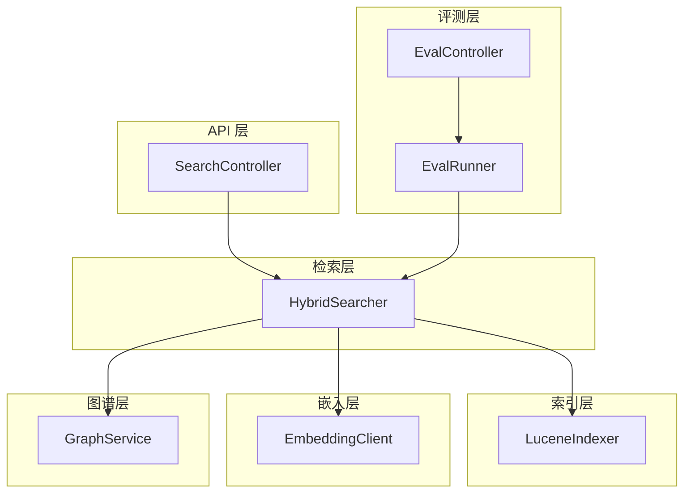
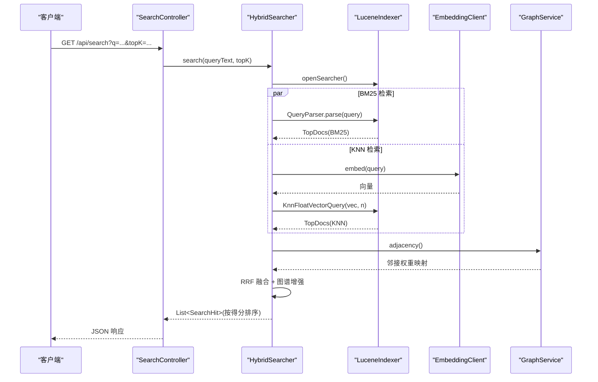
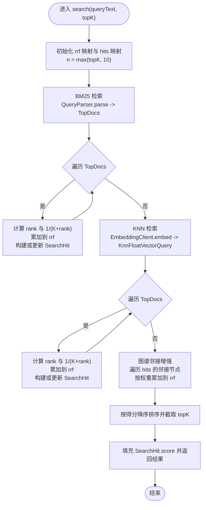
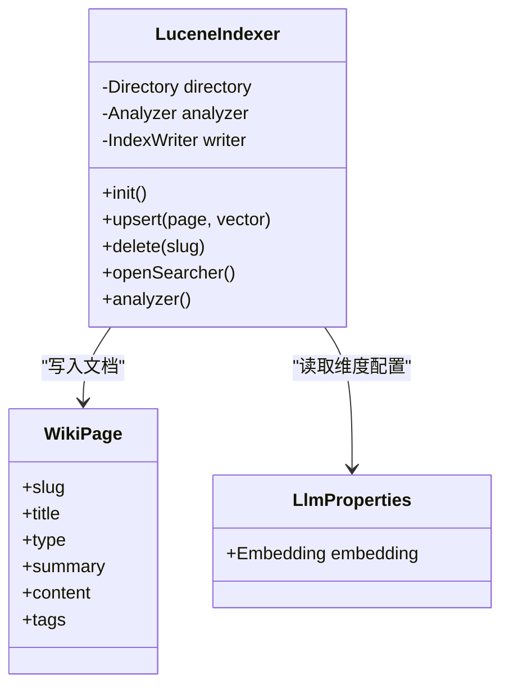
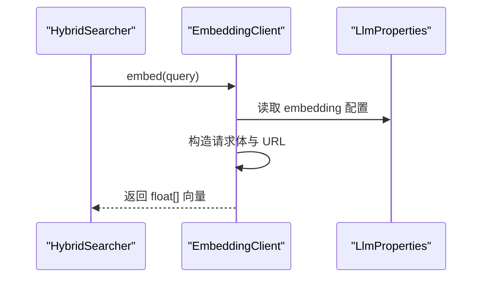
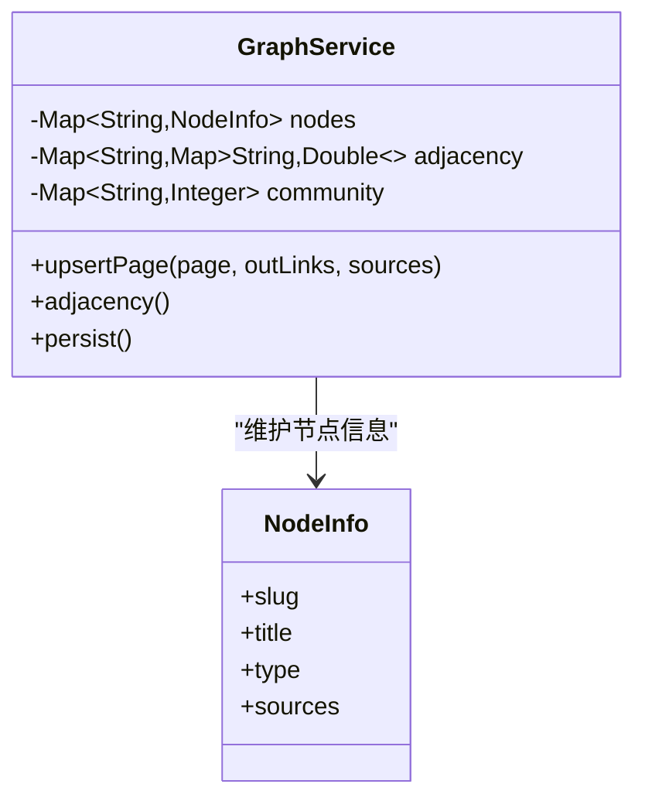
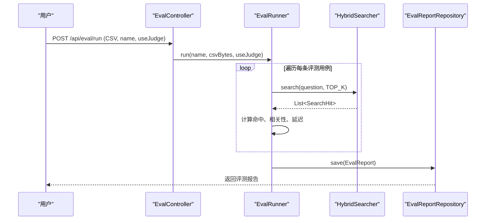
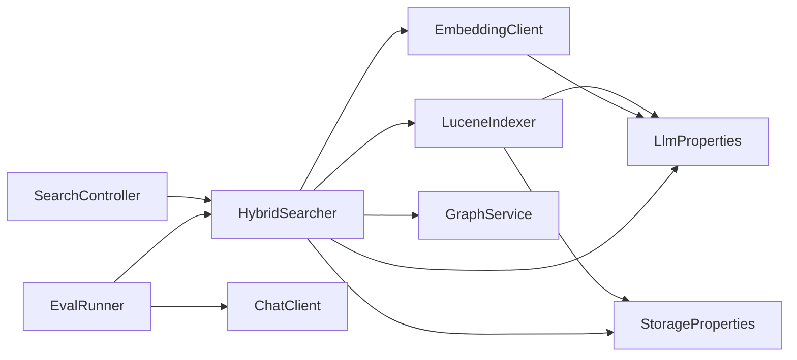

# 混合检索系统

<cite>
**本文引用的文件列表**
- [HybridSearcher.java](file://src/main/java/com/example/llmwiki/retrieval/HybridSearcher.java)
- [LuceneIndexer.java](file://src/main/java/com/example/llmwiki/retrieval/LuceneIndexer.java)
- [SearchController.java](file://src/main/java/com/example/llmwiki/api/SearchController.java)
- [EmbeddingClient.java](file://src/main/java/com/example/llmwiki/llm/EmbeddingClient.java)
- [application.yml](file://src/main/resources/application.yml)
- [LlmProperties.java](file://src/main/java/com/example/llmwiki/config/LlmProperties.java)
- [StorageProperties.java](file://src/main/java/com/example/llmwiki/config/StorageProperties.java)
- [GraphService.java](file://src/main/java/com/example/llmwiki/graph/GraphService.java)
- [IngestPipeline.java](file://src/main/java/com/example/llmwiki/ingest/IngestPipeline.java)
- [EvalRunner.java](file://src/main/java/com/example/llmwiki/eval/EvalRunner.java)
- [EvalController.java](file://src/main/java/com/example/llmwiki/api/EvalController.java)
- [EvalReport.java](file://src/main/java/com/example/llmwiki/domain/EvalReport.java)
- [WikiPage.java](file://src/main/java/com/example/llmwiki/domain/WikiPage.java)
- [TextUtils.java](file://src/main/java/com/example/llmwiki/util/TextUtils.java)
</cite>

## 目录
1. [简介](#简介)
2. [项目结构](#项目结构)
3. [核心组件](#核心组件)
4. [架构总览](#架构总览)
5. [详细组件分析](#详细组件分析)
6. [依赖关系分析](#依赖关系分析)
7. [性能考量](#性能考量)
8. [故障排查指南](#故障排查指南)
9. [结论](#结论)
10. [附录](#附录)

## 简介
本技术文档围绕 LLM Wiki 的混合检索系统展开，重点阐述 HybridSearcher 的架构设计与实现细节，包括：
- 结合 BM25 文本检索与向量 KNN 检索的混合策略
- BM25 的查询解析与评分机制
- 向量相似度计算与嵌入生成流程
- 检索结果融合（RRF）与图谱增强
- 查询预处理与文本规范化
- 性能优化（并行、缓存、延迟加载）
- 检索质量评估（评测指标与评测接口）
- 混合检索的配置项与调试工具

## 项目结构
后端采用 Spring Boot 架构，检索相关代码集中在 retrieval、api、llm、graph、eval 等包中；前端位于 web 目录。检索系统的关键路径如下：
- API 层：对外提供搜索接口
- 检索层：HybridSearcher 负责混合检索与融合
- 索引层：LuceneIndexer 提供全文与向量索引能力
- 嵌入层：EmbeddingClient 调用外部 Embedding 服务
- 图谱层：GraphService 维护节点与邻接关系，用于结果增强
- 评测层：EvalRunner 与 EvalController 提供检索质量评估能力

图表来源
- [SearchController.java:18-31](file://src/main/java/com/example/llmwiki/api/SearchController.java#L18-L31)
- [HybridSearcher.java:34-111](file://src/main/java/com/example/llmwiki/retrieval/HybridSearcher.java#L34-L111)
- [LuceneIndexer.java:39-108](file://src/main/java/com/example/llmwiki/retrieval/LuceneIndexer.java#L39-L108)
- [EmbeddingClient.java:25-81](file://src/main/java/com/example/llmwiki/llm/EmbeddingClient.java#L25-L81)
- [GraphService.java:37-126](file://src/main/java/com/example/llmwiki/graph/GraphService.java#L37-L126)
- [EvalRunner.java:46-135](file://src/main/java/com/example/llmwiki/eval/EvalRunner.java#L46-L135)
- [EvalController.java:27-52](file://src/main/java/com/example/llmwiki/api/EvalController.java#L27-L52)

章节来源
- [SearchController.java:18-31](file://src/main/java/com/example/llmwiki/api/SearchController.java#L18-L31)
- [HybridSearcher.java:34-111](file://src/main/java/com/example/llmwiki/retrieval/HybridSearcher.java#L34-L111)
- [LuceneIndexer.java:39-108](file://src/main/java/com/example/llmwiki/retrieval/LuceneIndexer.java#L39-L108)
- [EmbeddingClient.java:25-81](file://src/main/java/com/example/llmwiki/llm/EmbeddingClient.java#L25-L81)
- [GraphService.java:37-126](file://src/main/java/com/example/llmwiki/graph/GraphService.java#L37-L126)
- [EvalRunner.java:46-135](file://src/main/java/com/example/llmwiki/eval/EvalRunner.java#L46-L135)
- [EvalController.java:27-52](file://src/main/java/com/example/llmwiki/api/EvalController.java#L27-L52)

## 核心组件
- HybridSearcher：混合检索器，负责 BM25 与 KNN 并行检索，使用 RRF 融合，并引入图谱邻接关系进行结果增强。
- LuceneIndexer：基于 Lucene 的索引管理器，支持中文分词、文本字段、向量字段与 KNN 查询。
- EmbeddingClient：封装外部 Embedding 服务调用，支持批量嵌入与错误处理。
- GraphService：维护节点、邻接表与社区结构，提供邻接权重用于结果增强。
- SearchController：对外提供 /api/search 接口，接收查询与 topK 参数。
- EvalRunner/EvalController：提供检索评测能力，计算命中率、平均相关性、平均延迟等指标。

章节来源
- [HybridSearcher.java:34-137](file://src/main/java/com/example/llmwiki/retrieval/HybridSearcher.java#L34-L137)
- [LuceneIndexer.java:39-118](file://src/main/java/com/example/llmwiki/retrieval/LuceneIndexer.java#L39-L118)
- [EmbeddingClient.java:25-90](file://src/main/java/com/example/llmwiki/llm/EmbeddingClient.java#L25-L90)
- [GraphService.java:37-197](file://src/main/java/com/example/llmwiki/graph/GraphService.java#L37-L197)
- [SearchController.java:18-31](file://src/main/java/com/example/llmwiki/api/SearchController.java#L18-L31)
- [EvalRunner.java:46-135](file://src/main/java/com/example/llmwiki/eval/EvalRunner.java#L46-L135)
- [EvalController.java:27-52](file://src/main/java/com/example/llmwiki/api/EvalController.java#L27-L52)

## 架构总览
混合检索系统以 SearchController 为入口，HybridSearcher 为核心协调者，LuceneIndexer 提供底层索引与查询能力，EmbeddingClient 负责向量生成，GraphService 提供图谱增强。评测模块 EvalRunner 与 EvalController 用于离线评估检索质量。

图表来源
- [SearchController.java:25-30](file://src/main/java/com/example/llmwiki/api/SearchController.java#L25-L30)
- [HybridSearcher.java:42-111](file://src/main/java/com/example/llmwiki/retrieval/HybridSearcher.java#L42-L111)
- [LuceneIndexer.java:106-108](file://src/main/java/com/example/llmwiki/retrieval/LuceneIndexer.java#L106-L108)
- [EmbeddingClient.java:34-80](file://src/main/java/com/example/llmwiki/llm/EmbeddingClient.java#L34-L80)
- [GraphService.java:124-126](file://src/main/java/com/example/llmwiki/graph/GraphService.java#L124-L126)

## 详细组件分析

### HybridSearcher：混合检索器
- 检索策略
  - BM25：使用 QueryParser 对查询进行解析，Lucene 默认 OR 连接符，TopDocs 返回按 BM25 分数排序的结果。
  - KNN：调用 EmbeddingClient 生成查询向量，使用 KnnFloatVectorQuery 在向量字段上检索 TopN。
  - 融合：采用 Reciprocal Rank Fusion（RRF），K 常量默认 60，对每个命中文档的排名取倒数累加，再与图谱邻接权重相加。
  - 图谱增强：遍历命中文档的邻接节点，按邻接权重对目标节点进行微小加分，提升与命中节点关联度高的结果的相对得分。
- 错误处理
  - BM25 异常记录日志，不影响 KNN 检索。
  - EmbeddingClient 抛出 LlmException 时记录降级提示，继续使用 BM25 单通。
  - KNN 异常记录日志，不影响 BM25 检索。
- 结果对象
  - SearchHit 包含 slug、title、type、summary、source（bm25/knn）、score 字段，便于前端展示与后续处理。

图表来源
- [HybridSearcher.java:42-111](file://src/main/java/com/example/llmwiki/retrieval/HybridSearcher.java#L42-L111)

章节来源
- [HybridSearcher.java:34-137](file://src/main/java/com/example/llmwiki/retrieval/HybridSearcher.java#L34-L137)

### LuceneIndexer：索引与向量检索
- 初始化
  - 使用 FSDirectory 与 SmartChineseAnalyzer 创建 IndexWriter，支持 CREATE_OR_APPEND 模式。
- upsert
  - 将 WikiPage 写入文档，包含 slug、type、title、summary、content、tags 等字段。
  - 当向量非空且长度有效时，写入 KnnFloatVectorField，相似度函数为 COSINE。
  - 自动进行维度对齐（不足则补零，超出则截断），确保与配置的 embedding 维度一致。
- 删除与查询
  - 支持按 slug 删除文档。
  - 提供 openSearcher 与 analyzer 访问器，供检索器使用。
- 配置依赖
  - 读取 LlmProperties 中的 embedding 维度，StorageProperties 中的索引目录。

图表来源
- [LuceneIndexer.java:39-118](file://src/main/java/com/example/llmwiki/retrieval/LuceneIndexer.java#L39-L118)
- [WikiPage.java:29-71](file://src/main/java/com/example/llmwiki/domain/WikiPage.java#L29-L71)
- [LlmProperties.java:44-52](file://src/main/java/com/example/llmwiki/config/LlmProperties.java#L44-L52)

章节来源
- [LuceneIndexer.java:39-118](file://src/main/java/com/example/llmwiki/retrieval/LuceneIndexer.java#L39-L118)
- [WikiPage.java:29-71](file://src/main/java/com/example/llmwiki/domain/WikiPage.java#L29-L71)
- [LlmProperties.java:44-52](file://src/main/java/com/example/llmwiki/config/LlmProperties.java#L44-L52)

### EmbeddingClient：嵌入生成
- 功能
  - 支持单条与批量嵌入，构造 OpenAI 兼容的 /embeddings 请求。
  - 从响应中提取 embedding 数组，转换为 float[]。
- 错误处理
  - API Key 缺失直接抛出 LlmException。
  - 调用失败记录错误日志并抛出 LlmException。
- 配置依赖
  - 读取 LlmProperties 中的 embedding baseUrl、apiKey、model、dimensions、timeoutSeconds。

图表来源
- [EmbeddingClient.java:34-80](file://src/main/java/com/example/llmwiki/llm/EmbeddingClient.java#L34-L80)
- [LlmProperties.java:44-52](file://src/main/java/com/example/llmwiki/config/LlmProperties.java#L44-L52)

章节来源
- [EmbeddingClient.java:25-90](file://src/main/java/com/example/llmwiki/llm/EmbeddingClient.java#L25-L90)
- [LlmProperties.java:44-52](file://src/main/java/com/example/llmwiki/config/LlmProperties.java#L44-L52)

### GraphService：图谱增强
- 功能
  - 维护节点信息、邻接表与社区映射，提供邻接权重用于结果增强。
  - upsertPage 根据页面的 outLinks 与 sources 构建邻接权重，direct link 权重为 3.0，source overlap 权重为 4.0*重叠数。
  - adjacency() 返回邻接表映射，供 HybridSearcher 使用。
- 性能
  - 使用并发 Map 保证线程安全，邻接权重在内存中计算，避免额外 IO。

图表来源
- [GraphService.java:37-197](file://src/main/java/com/example/llmwiki/graph/GraphService.java#L37-L197)

章节来源
- [GraphService.java:37-197](file://src/main/java/com/example/llmwiki/graph/GraphService.java#L37-L197)

### 搜索接口：SearchController
- 提供 GET /api/search?q=...&topK=... 接口，调用 HybridSearcher 执行混合检索并返回结果。

章节来源
- [SearchController.java:18-31](file://src/main/java/com/example/llmwiki/api/SearchController.java#L18-L31)

### 评测系统：EvalRunner 与 EvalController
- EvalRunner
  - 读取 CSV（UTF-8，首行 header），逐条执行检索，计算命中率（@5）、平均相关性、平均延迟等指标。
  - 可选调用 LLM 对候选结果进行 0-5 相关性打分。
  - 将评测结果持久化为 EvalReport。
- EvalController
  - 提供 /api/eval/run 上传 CSV 启动评测、列出报告、查看报告详情。

图表来源
- [EvalController.java:35-52](file://src/main/java/com/example/llmwiki/api/EvalController.java#L35-L52)
- [EvalRunner.java:63-135](file://src/main/java/com/example/llmwiki/eval/EvalRunner.java#L63-L135)
- [HybridSearcher.java:42-111](file://src/main/java/com/example/llmwiki/retrieval/HybridSearcher.java#L42-L111)
- [EvalReport.java:29-50](file://src/main/java/com/example/llmwiki/domain/EvalReport.java#L29-L50)

章节来源
- [EvalRunner.java:46-135](file://src/main/java/com/example/llmwiki/eval/EvalRunner.java#L46-L135)
- [EvalController.java:27-52](file://src/main/java/com/example/llmwiki/api/EvalController.java#L27-L52)
- [EvalReport.java:29-50](file://src/main/java/com/example/llmwiki/domain/EvalReport.java#L29-L50)

## 依赖关系分析
- 组件耦合
  - HybridSearcher 依赖 LuceneIndexer、EmbeddingClient、GraphService，三者职责清晰，耦合度低。
  - SearchController 仅作为门面，依赖 HybridSearcher。
  - EvalRunner 依赖 HybridSearcher 与 ChatClient（用于相关性打分），并持久化评测结果。
- 外部依赖
  - LlmProperties 与 StorageProperties 提供配置注入。
  - 应用配置 application.yml 定义存储路径、LLM 基础地址、超时等。

图表来源
- [SearchController.java:23-30](file://src/main/java/com/example/llmwiki/api/SearchController.java#L23-L30)
- [HybridSearcher.java:38-40](file://src/main/java/com/example/llmwiki/retrieval/HybridSearcher.java#L38-L40)
- [LuceneIndexer.java:41-42](file://src/main/java/com/example/llmwiki/retrieval/LuceneIndexer.java#L41-L42)
- [EmbeddingClient.java:27-28](file://src/main/java/com/example/llmwiki/llm/EmbeddingClient.java#L27-L28)
- [LlmProperties.java:18-19](file://src/main/java/com/example/llmwiki/config/LlmProperties.java#L18-L19)
- [StorageProperties.java:15-16](file://src/main/java/com/example/llmwiki/config/StorageProperties.java#L15-L16)

章节来源
- [application.yml:31-84](file://src/main/resources/application.yml#L31-L84)
- [LlmProperties.java:18-62](file://src/main/java/com/example/llmwiki/config/LlmProperties.java#L18-L62)
- [StorageProperties.java:15-28](file://src/main/java/com/example/llmwiki/config/StorageProperties.java#L15-L28)

## 性能考量
- 并行处理
  - BM25 与 KNN 检索分别在独立 try-catch 块中执行，互不影响，具备天然并行特性。
- 缓存策略
  - LuceneIndexer 使用 FSDirectory，索引持久化于磁盘；BM25 与 KNN 结果未显式缓存，可通过业务侧在应用层增加缓存。
- 延迟加载
  - openSearcher 在每次检索时创建临时 IndexSearcher，避免长生命周期持有资源；若频繁检索可考虑复用 Searcher 或使用缓存。
- 向量维度与相似度
  - 向量维度与 EmbeddingClient 配置保持一致，相似度函数为 COSINE，有利于语义近似。
- 查询预处理
  - Lucene 使用 SmartChineseAnalyzer 进行中文分词，有助于 BM25 的词项匹配；可结合 TextUtils 的 slugify、normalizeWhitespace 等工具进行文本规范化。

章节来源
- [HybridSearcher.java:42-86](file://src/main/java/com/example/llmwiki/retrieval/HybridSearcher.java#L42-L86)
- [LuceneIndexer.java:50-58](file://src/main/java/com/example/llmwiki/retrieval/LuceneIndexer.java#L50-L58)
- [TextUtils.java:15-79](file://src/main/java/com/example/llmwiki/util/TextUtils.java#L15-L79)

## 故障排查指南
- BM25 检索失败
  - 现象：日志出现 BM25 检索失败警告。
  - 排查：确认 QueryParser 输入是否为空或特殊字符过多；检查索引是否已建立。
- KNN 检索失败
  - 现象：日志出现 KNN 检索失败警告。
  - 排查：确认 EmbeddingClient 配置正确、网络可达；检查向量维度与配置是否一致。
- Embedding 不可用降级
  - 现象：日志出现 Embedding 不可用，降级为 BM25 单通。
  - 排查：检查 API Key、模型名称与维度配置；确认外部服务可用。
- 图谱增强无效
  - 现象：命中结果未见明显增强。
  - 排查：确认 GraphService 已加载邻接表；检查邻接权重是否合理。
- 评测异常
  - 现象：评测 CSV 解析失败或相关性打分异常。
  - 排查：确认 CSV 编码为 UTF-8、首行为 header；检查 useJudge 开关与 ChatClient 配置。

章节来源
- [HybridSearcher.java:63-86](file://src/main/java/com/example/llmwiki/retrieval/HybridSearcher.java#L63-L86)
- [EmbeddingClient.java:44-80](file://src/main/java/com/example/llmwiki/llm/EmbeddingClient.java#L44-L80)
- [GraphService.java:49-69](file://src/main/java/com/example/llmwiki/graph/GraphService.java#L49-L69)
- [EvalRunner.java:137-163](file://src/main/java/com/example/llmwiki/eval/EvalRunner.java#L137-L163)

## 结论
本混合检索系统以 Lucene 为基础，结合 BM25 与向量 KNN 的互补优势，采用 RRF 融合与图谱邻接增强，形成兼顾语义与相关性的检索方案。通过 EmbeddingClient 与 GraphService 的解耦设计，系统具备良好的可扩展性与可维护性。评测模块为持续优化提供了量化依据。

## 附录

### 查询预处理与文本规范化
- 文本规范化
  - 使用 TextUtils.normalizeWhitespace 规范空白字符，减少噪声。
  - 使用 TextUtils.slugify 生成稳定 slug，避免非法字符。
- 文本截断
  - 使用 TextUtils.truncate 控制输入长度，避免过长文本影响性能。
- 摄入阶段的文本处理
  - IngestPipeline 在生成页面前对内容进行截断与拼接，确保嵌入输入可控。

章节来源
- [TextUtils.java:15-79](file://src/main/java/com/example/llmwiki/util/TextUtils.java#L15-L79)
- [IngestPipeline.java:111-118](file://src/main/java/com/example/llmwiki/ingest/IngestPipeline.java#L111-L118)
- [IngestPipeline.java:195-205](file://src/main/java/com/example/llmwiki/ingest/IngestPipeline.java#L195-L205)

### 检索质量评估指标
- 指标定义
  - 回答率（answerRate）：成功回答的条目占比。
  - 命中率（hitRate@5）：Top5 中至少命中一个期望答案的比例。
  - 平均相关性（avgRelevance）：对命中条目进行相关性打分后的平均值。
  - 平均延迟（avgLatencyMs）：检索耗时的平均值。
- 评测 CSV 格式
  - UTF-8 编码，首行为 header，包含 question 与 expected_slugs 两列；expected_slugs 以分号分隔多个候选。

章节来源
- [EvalRunner.java:48-50](file://src/main/java/com/example/llmwiki/eval/EvalRunner.java#L48-L50)
- [EvalRunner.java:114-117](file://src/main/java/com/example/llmwiki/eval/EvalRunner.java#L114-L117)
- [EvalRunner.java:169-201](file://src/main/java/com/example/llmwiki/eval/EvalRunner.java#L169-L201)

### 混合检索配置选项
- LLM 配置（application.yml）
  - llm-wiki.llm.embedding.base-url、api-key、model、dimensions、timeout-seconds
- 存储配置（application.yml）
  - llm-wiki.storage.index-dir、graph-dir 等
- 检索参数
  - RRF 常量 K（硬编码为 60）
  - topK（SearchController 默认 10）

章节来源
- [application.yml:31-84](file://src/main/resources/application.yml#L31-L84)
- [LlmProperties.java:44-52](file://src/main/java/com/example/llmwiki/config/LlmProperties.java#L44-L52)
- [HybridSearcher.java:36](file://src/main/java/com/example/llmwiki/retrieval/HybridSearcher.java#L36)
- [SearchController.java:27](file://src/main/java/com/example/llmwiki/api/SearchController.java#L27)

### 调试工具与建议
- 查询分析器
  - 在 HybridSearcher 中可扩展打印 BM25 与 KNN 的 TopDocs 排名与得分，辅助定位问题。
- 结果验证器
  - 使用 EvalRunner 的 CaseResult 结构记录 hits、answered、hit、relevance、latencyMs，便于回放与对比。
- 性能监控器
  - 在 SearchController 与 EvalRunner 中埋点计时，统计平均延迟与吞吐；结合日志级别控制输出。

章节来源
- [HybridSearcher.java:42-111](file://src/main/java/com/example/llmwiki/retrieval/HybridSearcher.java#L42-L111)
- [EvalRunner.java:77-111](file://src/main/java/com/example/llmwiki/eval/EvalRunner.java#L77-L111)
- [EvalRunner.java:232-241](file://src/main/java/com/example/llmwiki/eval/EvalRunner.java#L232-L241)