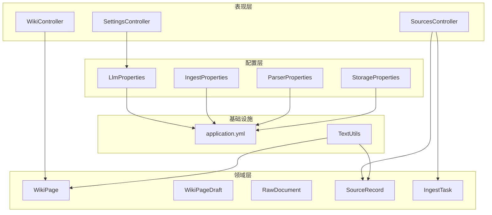
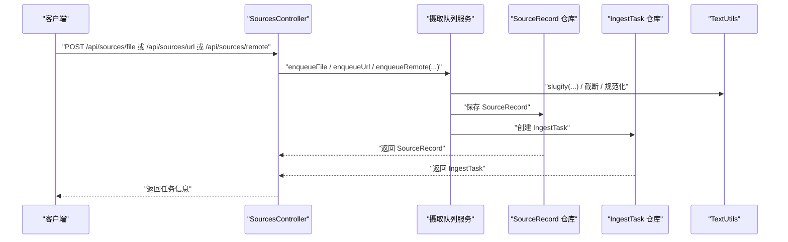
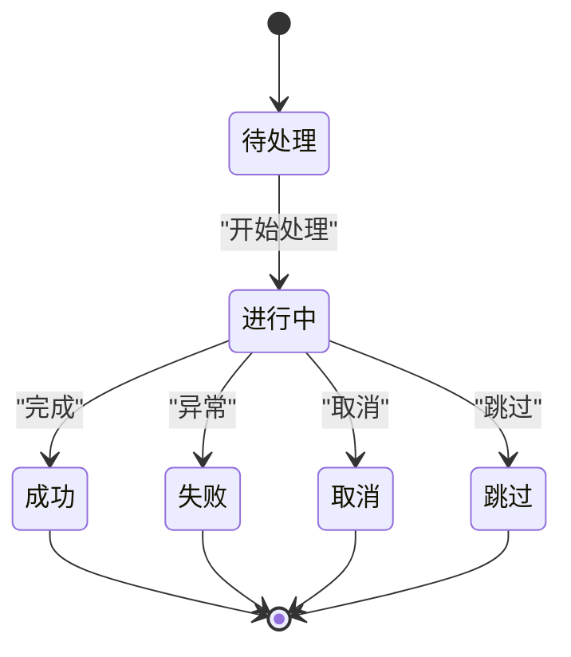
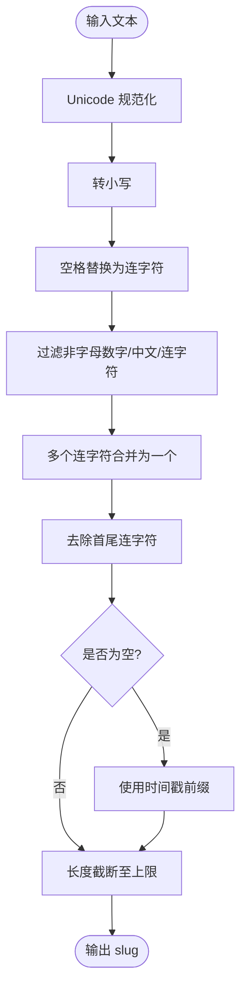
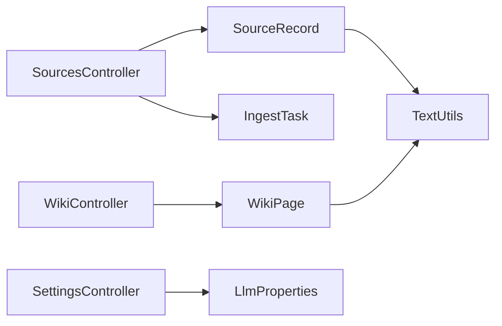

# 数据完整性与验证

<cite>
**本文引用的文件**
- [WikiPage.java](file://src/main/java/com/example/llmwiki/domain/WikiPage.java)
- [WikiPageDraft.java](file://src/main/java/com/example/llmwiki/domain/WikiPageDraft.java)
- [RawDocument.java](file://src/main/java/com/example/llmwiki/domain/RawDocument.java)
- [SourceRecord.java](file://src/main/java/com/example/llmwiki/domain/SourceRecord.java)
- [IngestTask.java](file://src/main/java/com/example/llmwiki/domain/IngestTask.java)
- [SourcesController.java](file://src/main/java/com/example/llmwiki/api/SourcesController.java)
- [WikiController.java](file://src/main/java/com/example/llmwiki/api/WikiController.java)
- [SettingsController.java](file://src/main/java/com/example/llmwiki/api/SettingsController.java)
- [TextUtils.java](file://src/main/java/com/example/llmwiki/util/TextUtils.java)
- [application.yml](file://src/main/resources/application.yml)
- [IngestProperties.java](file://src/main/java/com/example/llmwiki/config/IngestProperties.java)
- [LlmProperties.java](file://src/main/java/com/example/llmwiki/config/LlmProperties.java)
- [ParserProperties.java](file://src/main/java/com/example/llmwiki/config/ParserProperties.java)
- [StorageProperties.java](file://src/main/java/com/example/llmwiki/config/StorageProperties.java)
</cite>

## 目录
1. [简介](#简介)
2. [项目结构](#项目结构)
3. [核心组件](#核心组件)
4. [架构总览](#架构总览)
5. [详细组件分析](#详细组件分析)
6. [依赖分析](#依赖分析)
7. [性能考虑](#性能考虑)
8. [故障排查指南](#故障排查指南)
9. [结论](#结论)
10. [附录](#附录)

## 简介
本文件聚焦于 LLM Wiki 在“数据完整性与验证”方面的设计与实现，涵盖以下方面：
- 数据验证规则：字段长度限制、必填字段验证、唯一性约束、格式验证（邮箱、URL、日期等）
- 业务规则约束：实体间业务逻辑验证、状态转换验证、数据一致性检查
- JPA 验证注解使用：@NotNull、@NotBlank、@Size、@Pattern、@Email 等注解的应用场景与配置
- 数据清理策略：空值处理、特殊字符过滤、HTML 标签清理、内容截断规则
- 数据安全措施：SQL 注入防护、XSS 攻击防范、敏感数据脱敏、访问权限控制
- 数据备份与恢复：定期备份策略、增量备份方案、灾难恢复计划、数据迁移工具
- 数据审计功能：操作日志记录、变更追踪、合规性检查、数据血缘追踪

## 项目结构
本项目采用分层架构，后端以 Spring Boot 为基础，主要模块包括：
- domain：领域模型（数据库实体与 DTO）
- api：REST 控制器
- config：外部配置类
- util：工具类（文本处理、哈希等）
- repository：JPA 仓库接口
- 其他子系统：解析、检索、图谱、调度等

图表来源
- [SettingsController.java:1-71](file://src/main/java/com/example/llmwiki/api/SettingsController.java#L1-L71)
- [WikiController.java:1-51](file://src/main/java/com/example/llmwiki/api/WikiController.java#L1-L51)
- [SourcesController.java:1-102](file://src/main/java/com/example/llmwiki/api/SourcesController.java#L1-L102)
- [LlmProperties.java:1-63](file://src/main/java/com/example/llmwiki/config/LlmProperties.java#L1-L63)
- [IngestProperties.java:1-33](file://src/main/java/com/example/llmwiki/config/IngestProperties.java#L1-L33)
- [ParserProperties.java:1-46](file://src/main/java/com/example/llmwiki/config/ParserProperties.java#L1-L46)
- [StorageProperties.java:1-29](file://src/main/java/com/example/llmwiki/config/StorageProperties.java#L1-L29)
- [WikiPage.java:1-72](file://src/main/java/com/example/llmwiki/domain/WikiPage.java#L1-L72)
- [WikiPageDraft.java:1-50](file://src/main/java/com/example/llmwiki/domain/WikiPageDraft.java#L1-L50)
- [RawDocument.java:1-52](file://src/main/java/com/example/llmwiki/domain/RawDocument.java#L1-L52)
- [SourceRecord.java:1-64](file://src/main/java/com/example/llmwiki/domain/SourceRecord.java#L1-L64)
- [IngestTask.java:1-62](file://src/main/java/com/example/llmwiki/domain/IngestTask.java#L1-L62)
- [application.yml:1-84](file://src/main/resources/application.yml#L1-L84)
- [TextUtils.java:1-80](file://src/main/java/com/example/llmwiki/util/TextUtils.java#L1-L80)

章节来源
- [application.yml:1-84](file://src/main/resources/application.yml#L1-L84)

## 核心组件
- 实体与 DTO
  - WikiPage：页面实体，包含 slug（唯一）、title、type、summary、content、sources、tags、outLinks 等字段，并定义了长度与唯一性约束
  - SourceRecord：数据源记录，包含 kind、ref、displayName、contentHash、watchEnabled、note 等字段
  - IngestTask：摄入任务，包含状态、阶段、进度、重试次数、错误信息等
  - RawDocument：标准化的原始文档 DTO，统一解析器输出结构
  - WikiPageDraft：草稿 DTO，包含类型、标题、slug、摘要、正文、链接、标签、来源等
- 控制器
  - SourcesController：提供文件上传、URL 提交、远程来源提交、任务管理等接口
  - WikiController：提供页面列表、详情查询、统计接口
  - SettingsController：提供 LLM 配置读取、更新与健康探测
- 工具类
  - TextUtils：提供 SHA256、slug 生成、空白规范化、内容截断等能力
- 配置类
  - LlmProperties、IngestProperties、ParserProperties、StorageProperties：集中管理各类配置

章节来源
- [WikiPage.java:1-72](file://src/main/java/com/example/llmwiki/domain/WikiPage.java#L1-L72)
- [SourceRecord.java:1-64](file://src/main/java/com/example/llmwiki/domain/SourceRecord.java#L1-L64)
- [IngestTask.java:1-62](file://src/main/java/com/example/llmwiki/domain/IngestTask.java#L1-L62)
- [RawDocument.java:1-52](file://src/main/java/com/example/llmwiki/domain/RawDocument.java#L1-L52)
- [WikiPageDraft.java:1-50](file://src/main/java/com/example/llmwiki/domain/WikiPageDraft.java#L1-L50)
- [SourcesController.java:1-102](file://src/main/java/com/example/llmwiki/api/SourcesController.java#L1-L102)
- [WikiController.java:1-51](file://src/main/java/com/example/llmwiki/api/WikiController.java#L1-L51)
- [SettingsController.java:1-71](file://src/main/java/com/example/llmwiki/api/SettingsController.java#L1-L71)
- [TextUtils.java:1-80](file://src/main/java/com/example/llmwiki/util/TextUtils.java#L1-L80)
- [LlmProperties.java:1-63](file://src/main/java/com/example/llmwiki/config/LlmProperties.java#L1-L63)
- [IngestProperties.java:1-33](file://src/main/java/com/example/llmwiki/config/IngestProperties.java#L1-L33)
- [ParserProperties.java:1-46](file://src/main/java/com/example/llmwiki/config/ParserProperties.java#L1-L46)
- [StorageProperties.java:1-29](file://src/main/java/com/example/llmwiki/config/StorageProperties.java#L1-L29)

## 架构总览
下图展示了数据从“来源提交”到“页面入库”的关键流程，以及与配置、工具类的交互。

图表来源
- [SourcesController.java:45-61](file://src/main/java/com/example/llmwiki/api/SourcesController.java#L45-L61)
- [TextUtils.java:46-64](file://src/main/java/com/example/llmwiki/util/TextUtils.java#L46-L64)
- [SourceRecord.java:28-63](file://src/main/java/com/example/llmwiki/domain/SourceRecord.java#L28-L63)
- [IngestTask.java:28-61](file://src/main/java/com/example/llmwiki/domain/IngestTask.java#L28-L61)

## 详细组件分析

### 数据验证规则设计
- 字段长度限制
  - WikiPage：slug（256）、title（512）、type（32）、summary（2048）、tags（1024）、outLinks（LOB）
  - SourceRecord：kind（32）、ref（1024）、displayName（512）、contentHash（128）、note（LOB）
  - IngestTask：status（16）、stage（32）、errorMessage（LOB）
  - RawDocument：metadata、imageCaptions、language 等集合字段未在实体上强制长度，但可通过业务层限制
- 必填字段验证
  - WikiPage：slug、title、type、createdAt、updatedAt
  - SourceRecord：kind、ref、createdAt
  - IngestTask：status、createdAt
  - 控制器层对请求参数进行非空校验（例如 URL 提交、远程来源提交）
- 唯一性约束
  - WikiPage.slug 唯一
- 格式验证
  - URL：SourcesController 中对 URL 的合法性由调用方与下游解析器保障；建议在输入层增加 URL 正则校验
  - 邮箱/日期：当前未见显式注解或正则校验，可在 DTO 或控制器层补充
- JPA 注解使用建议
  - @NotNull：用于非空字段（如实体层的非空字段）
  - @NotBlank：用于字符串非空白（如标题、类型）
  - @Size：用于长度限制（如 slug、title、type）
  - @Pattern：用于复杂格式（如 URL、邮箱、日期）
  - @Email：用于邮箱格式
  - 注意：当前实体层主要通过 JPA Column 的 length 和 nullable 控制，注解较少。建议在实体或 DTO 层补充相应注解以提升验证一致性与可读性

章节来源
- [WikiPage.java:35-71](file://src/main/java/com/example/llmwiki/domain/WikiPage.java#L35-L71)
- [SourceRecord.java:35-63](file://src/main/java/com/example/llmwiki/domain/SourceRecord.java#L35-L63)
- [IngestTask.java:38-61](file://src/main/java/com/example/llmwiki/domain/IngestTask.java#L38-L61)
- [SourcesController.java:50-61](file://src/main/java/com/example/llmwiki/api/SourcesController.java#L50-L61)

### 业务规则约束
- 实体间业务逻辑验证
  - IngestTask.sourceId 应关联到有效的 SourceRecord.id
  - WikiPage.slug 唯一，避免重复生成
- 状态转换验证
  - IngestTask.status：PENDING → RUNNING → SUCCESS/FAILED/CANCELLED/SKIPPED
  - 控制器层未直接暴露状态修改接口，建议在服务层实现受控的状态机
- 数据一致性检查
  - contentHash 用于增量判断，避免重复摄入
  - RawDocument.contentHash 作为指纹，用于去重与缓存

图表来源
- [IngestTask.java:38-40](file://src/main/java/com/example/llmwiki/domain/IngestTask.java#L38-L40)

章节来源
- [IngestTask.java:38-40](file://src/main/java/com/example/llmwiki/domain/IngestTask.java#L38-L40)
- [RawDocument.java:34-35](file://src/main/java/com/example/llmwiki/domain/RawDocument.java#L34-L35)

### JPA 验证注解的使用
- 推荐在实体或 DTO 层添加注解以统一验证
  - @NotNull：确保非空
  - @NotBlank：确保非空白
  - @Size(min/max)：限制长度
  - @Pattern(regexp)：限制格式
  - @Email：邮箱格式
- 与现有 JPA 定义的关系
  - 当前实体通过 Column.length 与 nullable 实现长度与非空约束
  - 建议补充 Bean Validation 注解以增强可读性与跨层一致性

章节来源
- [WikiPage.java:35-41](file://src/main/java/com/example/llmwiki/domain/WikiPage.java#L35-L41)
- [SourceRecord.java:35-41](file://src/main/java/com/example/llmwiki/domain/SourceRecord.java#L35-L41)
- [IngestTask.java:38-40](file://src/main/java/com/example/llmwiki/domain/IngestTask.java#L38-L40)

### 数据清理策略
- 空值处理
  - TextUtils.truncate 对 null 返回空字符串，避免空指针
- 特殊字符过滤
  - TextUtils.slugify 使用正则移除非字母数字与中文、连字符的字符，保留中英文、数字、连字符
- HTML 标签清理
  - 当前未见专门的 HTML 清理工具，建议引入白名单过滤库（如 OWASP Java HTML Sanitizer）并在入库前执行
- 内容截断规则
  - TextUtils.truncate 将超长内容截断至最大长度
  - WikiPage.title/slug/tags/outLinks 等字段已设置长度上限，配合截断策略保证入库安全

图表来源
- [TextUtils.java:46-64](file://src/main/java/com/example/llmwiki/util/TextUtils.java#L46-L64)

章节来源
- [TextUtils.java:26-78](file://src/main/java/com/example/llmwiki/util/TextUtils.java#L26-L78)
- [WikiPage.java:35-66](file://src/main/java/com/example/llmwiki/domain/WikiPage.java#L35-L66)

### 数据安全措施
- SQL 注入防护
  - 使用 JPA/Hibernate，避免原生 SQL 拼接；必要时使用命名参数
- XSS 攻击防范
  - 建议在入库前对富文本进行白名单清理（如 HTML 标签过滤）
- 敏感数据脱敏
  - 配置中的 API Key 等敏感信息应通过环境变量或密钥管理服务加载
- 访问权限控制
  - 当前未见鉴权与授权逻辑，建议引入 Spring Security 并结合角色/权限模型

章节来源
- [application.yml:11-15](file://src/main/resources/application.yml#L11-L15)
- [LlmProperties.java:34-35](file://src/main/java/com/example/llmwiki/config/LlmProperties.java#L34-L35)

### 数据备份与恢复
- 定期备份策略
  - 建议对 H2 数据库文件与存储目录（raw、wiki、index、graph）进行周期性归档
- 增量备份方案
  - 基于 contentHash 与时间戳的增量摄入，减少重复处理
- 灾难恢复计划
  - 明确备份介质、恢复步骤、RTO/RPO 指标
- 数据迁移工具
  - 建议提供导出/导入脚本或工具，支持不同版本的数据迁移

章节来源
- [application.yml:11-15](file://src/main/resources/application.yml#L11-L15)
- [StorageProperties.java:18-27](file://src/main/java/com/example/llmwiki/config/StorageProperties.java#L18-L27)
- [RawDocument.java:34-35](file://src/main/java/com/example/llmwiki/domain/RawDocument.java#L34-L35)

### 数据审计功能
- 操作日志记录
  - 建议在关键控制器方法（如提交、删除、重试）记录操作日志
- 变更追踪
  - 对 WikiPage、SourceRecord、IngestTask 的变更建立审计表或变更记录
- 合规性检查
  - 对敏感字段（如 API Key）进行合规性扫描与访问控制
- 数据血缘追踪
  - 通过 SourceRecord.contentHash 与 RawDocument 关联，追踪数据来源与处理链路

章节来源
- [SourcesController.java:45-84](file://src/main/java/com/example/llmwiki/api/SourcesController.java#L45-L84)
- [WikiController.java:29-49](file://src/main/java/com/example/llmwiki/api/WikiController.java#L29-L49)
- [RawDocument.java:34-35](file://src/main/java/com/example/llmwiki/domain/RawDocument.java#L34-L35)

## 依赖分析
- 控制器依赖配置类与仓库接口，体现清晰的分层
- 实体与 DTO 之间存在映射关系，建议在服务层统一转换
- 工具类 TextUtils 被控制器与实体层间接使用，承担数据清理职责

图表来源
- [SourcesController.java:36-38](file://src/main/java/com/example/llmwiki/api/SourcesController.java#L36-L38)
- [WikiController.java:27-28](file://src/main/java/com/example/llmwiki/api/WikiController.java#L27-L28)
- [SettingsController.java:30-32](file://src/main/java/com/example/llmwiki/api/SettingsController.java#L30-L32)
- [SourceRecord.java:28-63](file://src/main/java/com/example/llmwiki/domain/SourceRecord.java#L28-L63)
- [IngestTask.java:28-61](file://src/main/java/com/example/llmwiki/domain/IngestTask.java#L28-L61)
- [WikiPage.java:28-71](file://src/main/java/com/example/llmwiki/domain/WikiPage.java#L28-L71)
- [TextUtils.java:15-80](file://src/main/java/com/example/llmwiki/util/TextUtils.java#L15-L80)

章节来源
- [SourcesController.java:36-38](file://src/main/java/com/example/llmwiki/api/SourcesController.java#L36-L38)
- [WikiController.java:27-28](file://src/main/java/com/example/llmwiki/api/WikiController.java#L27-L28)
- [SettingsController.java:30-32](file://src/main/java/com/example/llmwiki/api/SettingsController.java#L30-L32)

## 性能考虑
- 字段长度与索引
  - 对高频查询字段（如 slug、type）建立索引，提升查询性能
- 批处理与并发
  - 摄入任务并发度与重试策略需平衡吞吐与稳定性
- 缓存与指纹
  - 利用 contentHash 实现增量处理，减少重复计算

## 故障排查指南
- 常见问题
  - 字段超长导致入库失败：检查实体长度定义与业务层截断策略
  - slug 冲突：确认唯一性约束与 slug 生成逻辑
  - URL 解析失败：检查 URL 合法性与网络可达性
- 日志与监控
  - 开启 DEBUG 级别日志，定位异常堆栈
  - 对 LLM 客户端健康探测接口进行监控

章节来源
- [application.yml:78-84](file://src/main/resources/application.yml#L78-L84)
- [SettingsController.java:53-69](file://src/main/java/com/example/llmwiki/api/SettingsController.java#L53-L69)

## 结论
本项目在实体层面提供了基础的长度与唯一性约束，在控制器与工具类层面实现了数据清理与规范化。为进一步提升数据完整性与安全性，建议：
- 在实体与 DTO 层补充 Bean Validation 注解
- 引入 HTML 清理与 XSS 防护
- 建立完善的审计与权限控制体系
- 制定并执行备份与灾难恢复计划

## 附录
- 关键配置项
  - 数据库连接与 H2 控制台
  - 存储目录与 LLM/解析器/调度配置
- 建议扩展点
  - 增加 @Email、@Pattern 等注解
  - 引入 Spring Security 实现鉴权
  - 增加审计表与变更追踪

章节来源
- [application.yml:11-77](file://src/main/resources/application.yml#L11-L77)
- [StorageProperties.java:18-27](file://src/main/java/com/example/llmwiki/config/StorageProperties.java#L18-L27)
- [LlmProperties.java:32-41](file://src/main/java/com/example/llmwiki/config/LlmProperties.java#L32-L41)
- [ParserProperties.java:23-27](file://src/main/java/com/example/llmwiki/config/ParserProperties.java#L23-L27)
- [IngestProperties.java:23-25](file://src/main/java/com/example/llmwiki/config/IngestProperties.java#L23-L25)