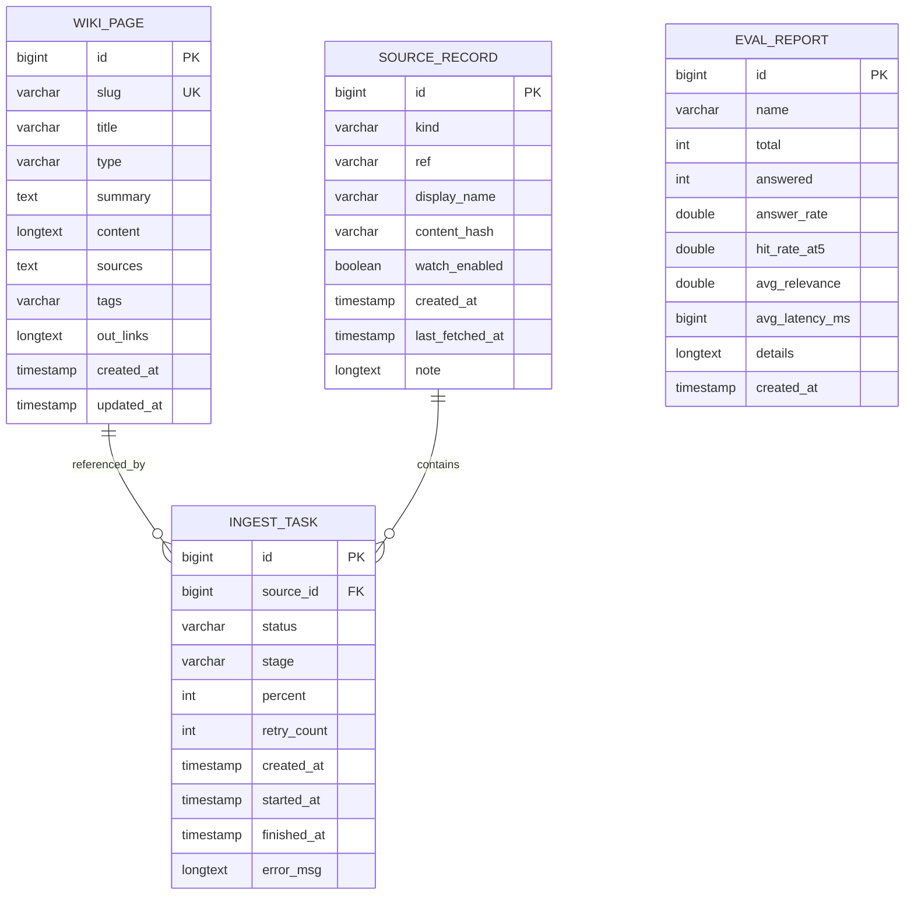
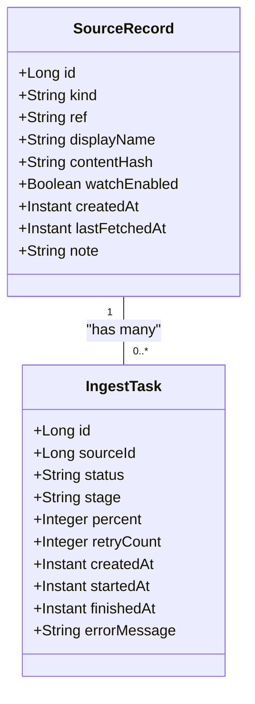
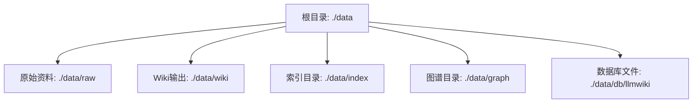

# 数据库表结构设计

<cite>
**本文档引用的文件**
- [WikiPage.java](file://src/main/java/com/example/llmwiki/domain/WikiPage.java)
- [WikiPageRepository.java](file://src/main/java/com/example/llmwiki/repository/WikiPageRepository.java)
- [application.yml](file://src/main/resources/application.yml)
- [SourceRecord.java](file://src/main/java/com/example/llmwiki/domain/SourceRecord.java)
- [EvalReport.java](file://src/main/java/com/example/llmwiki/domain/EvalReport.java)
- [IngestTask.java](file://src/main/java/com/example/llmwiki/domain/IngestTask.java)
- [SourceRecordRepository.java](file://src/main/java/com/example/llmwiki/repository/SourceRecordRepository.java)
- [StorageProperties.java](file://src/main/java/com/example/llmwiki/config/StorageProperties.java)
- [pom.xml](file://pom.xml)
</cite>

## 目录
1. [项目概述](#项目概述)
2. [数据库架构总览](#数据库架构总览)
3. [核心表结构设计](#核心表结构设计)
4. [字段设计原则](#字段设计原则)
5. [索引策略](#索引策略)
6. [外键约束设计](#外键约束设计)
7. [数据库配置详解](#数据库配置详解)
8. [性能优化建议](#性能优化建议)
9. [故障排除指南](#故障排除指南)
10. [总结](#总结)

## 项目概述

LLM Wiki是一个基于Spring Boot的智能知识库系统，采用H2嵌入式数据库进行数据存储。该系统通过AI技术对各种格式的文档进行解析、分析和生成，最终形成结构化的维基页面内容。数据库设计遵循现代化的ORM设计理念，使用JPA/Hibernate框架实现对象关系映射。

## 数据库架构总览

系统采用单数据库架构，主要包含以下核心表：



**图表来源**
- [WikiPage.java:28-71](file://src/main/java/com/example/llmwiki/domain/WikiPage.java#L28-L71)
- [SourceRecord.java:28-63](file://src/main/java/com/example/llmwiki/domain/SourceRecord.java#L28-L63)
- [IngestTask.java:28-61](file://src/main/java/com/example/llmwiki/domain/IngestTask.java#L28-L61)
- [EvalReport.java:28-50](file://src/main/java/com/example/llmwiki/domain/EvalReport.java#L28-L50)

## 核心表结构设计

### wiki_page 表设计

wiki_page表是系统的核心数据表，用于存储生成的维基页面内容。该表采用自增主键设计，确保每条记录的唯一性。

#### 主键设计
- **字段**: `id` (bigint)
- **类型**: 自增主键 (GenerationType.IDENTITY)
- **约束**: NOT NULL, PRIMARY KEY
- **用途**: 唯一标识每条维基页面记录

#### 唯一约束设计
- **字段**: `slug` (varchar)
- **长度**: 256字符
- **约束**: NOT NULL, UNIQUE
- **用途**: 作为wikilink的目标，确保页面URL的唯一性
- **设计考虑**: 支持中文、英文及特殊字符，长度适中避免索引过大

#### 标题字段设计
- **字段**: `title` (varchar)
- **长度**: 512字符
- **约束**: NOT NULL
- **用途**: 存储页面显示标题
- **设计考虑**: 充分支持长标题需求，如技术文档标题

#### 类型字段设计
- **字段**: `type` (varchar)
- **长度**: 32字符
- **约束**: NOT NULL
- **取值范围**: entity, concept, source, overview, index, log, purpose
- **用途**: 区分页面内容类型，便于分类检索

#### 摘要字段设计
- **字段**: `summary` (text)
- **长度**: 2048字符
- **约束**: 可为空
- **用途**: 存储页面摘要信息，支持全文检索优化

#### 正文内容设计
- **字段**: `content` (longtext)
- **类型**: LOB (Large Object)
- **约束**: 可为空
- **用途**: 存储Markdown格式的完整页面内容
- **设计考虑**: 使用LOB类型支持大文本内容存储

#### 来源字段设计
- **字段**: `sources` (text)
- **长度**: 2048字符
- **约束**: 可为空
- **用途**: 存储关联的参考资料标识符，使用逗号分隔

#### 标签字段设计
- **字段**: `tags` (varchar)
- **长度**: 1024字符
- **约束**: 可为空
- **用途**: 存储页面标签，使用逗号分隔多个标签

#### 外链接字段设计
- **字段**: `out_links` (longtext)
- **别名**: `out_links`
- **类型**: LOB
- **约束**: 可为空
- **用途**: 存储页面向外链接的slug列表，用于图谱构建
- **设计考虑**: 支持大量链接关系的数据存储

#### 时间戳字段设计
- **字段**: `createdAt` (timestamp)
- **字段**: `updatedAt` (timestamp)
- **用途**: 记录数据创建和更新时间
- **设计考虑**: 支持审计和数据版本管理

**章节来源**
- [WikiPage.java:31-71](file://src/main/java/com/example/llmwiki/domain/WikiPage.java#L31-L71)
- [WikiPageRepository.java:13-18](file://src/main/java/com/example/llmwiki/repository/WikiPageRepository.java#L13-L18)

## 字段设计原则

### 字段类型选择原则

1. **整数类型选择**
   - 使用 `bigint` 存储主键和外键，支持大数据量场景
   - 使用 `int` 存储状态码和百分比等小范围数值

2. **字符串类型选择**
   - 短文本使用 `varchar`，支持可变长度
   - 长文本使用 `text` 或 `longtext`，支持大文本内容
   - LOB类型用于超大文本内容存储

3. **时间类型选择**
   - 使用 `timestamp` 存储时间戳，支持时区转换
   - 使用 `Instant` Java类型映射到数据库时间戳

### 长度限制设计

1. **slug字段**: 256字符限制
   - 支持国际化URL友好格式
   - 平衡索引性能和功能需求

2. **title字段**: 512字符限制
   - 充分支持技术文档标题长度
   - 便于前端显示和SEO优化

3. **type字段**: 32字符限制
   - 确保枚举值的简洁性
   - 便于数据库索引优化

4. **其他字段**: 根据实际业务需求设置合理长度

### 默认值设置

- **nullable属性**: 根据业务逻辑设置，非空字段明确标注NOT NULL
- **默认值**: 未设置显式默认值，采用数据库默认行为
- **时间戳**: 使用Java时间类型，由应用层处理默认值

### 字符集和排序规则

- **字符集**: UTF-8支持所有语言字符
- **排序规则**: 二进制排序，区分大小写
- **设计考虑**: 支持多语言环境，确保数据一致性

**章节来源**
- [WikiPage.java:35-66](file://src/main/java/com/example/llmwiki/domain/WikiPage.java#L35-L66)

## 索引策略

### 主键索引
- **位置**: `id` 字段自动创建主键索引
- **类型**: 唯一索引
- **作用**: 确保主键唯一性和快速查找

### 唯一索引
- **位置**: `slug` 字段
- **类型**: 唯一索引
- **作用**: 确保页面URL的唯一性，支持快速按slug查询
- **查询优化**: Repository中提供的findBySlug方法

### 普通索引策略

#### 类型字段索引
- **字段**: `type`
- **用途**: 支持按页面类型分类查询
- **查询优化**: Repository中提供的findByType方法

#### 外键索引
- **字段**: `sourceId` (在IngestTask表中)
- **用途**: 支持任务与数据源的关联查询
- **性能**: 建议在生产环境中为外键字段建立索引

### 复合索引设计

#### 建议的复合索引
1. **slug + type组合索引**
   - 用途: 同时按slug和类型过滤
   - 性能: 减少全表扫描

2. **status + stage组合索引**
   - 用途: 支持任务状态和阶段的联合查询
   - 性能: 提高任务调度效率

3. **watchEnabled + lastFetchedAt组合索引**
   - 用途: 支持定时刷新任务的高效筛选
   - 性能: 优化数据源监控查询

**章节来源**
- [WikiPageRepository.java:15-17](file://src/main/java/com/example/llmwiki/repository/WikiPageRepository.java#L15-L17)
- [SourceRecordRepository.java:15-19](file://src/main/java/com/example/llmwiki/repository/SourceRecordRepository.java#L15-L19)

## 外键约束设计

### 实体关系分析

系统中的外键关系主要体现在数据摄取流程中：



**图表来源**
- [SourceRecord.java:32-33](file://src/main/java/com/example/llmwiki/domain/SourceRecord.java#L32-L33)
- [IngestTask.java:36](file://src/main/java/com/example/llmwiki/domain/IngestTask.java#L36)

### 外键约束配置

#### 现有约束
- **IngestTask.sourceId**: 引用SourceRecord.id
- **约束类型**: 外键约束
- **级联操作**: 未配置显式级联
- **参照完整性**: 由应用层保证

#### 建议的外键约束
1. **强制参照完整性**
   ```sql
   ALTER TABLE ingest_task 
   ADD CONSTRAINT fk_ingest_task_source_id 
   FOREIGN KEY (source_id) REFERENCES source_record(id)
   ```

2. **级联删除配置**
   - **CASCADE DELETE**: 当数据源被删除时，相关任务也应删除
   - **SET NULL**: 保持任务记录但清除无效引用

### 外键设计考虑因素

1. **数据一致性**
   - 确保任务与数据源的对应关系
   - 防止悬挂引用数据

2. **性能影响**
   - 外键检查增加插入/更新开销
   - 需要在一致性和性能间平衡

3. **维护复杂性**
   - 外键约束增加数据库管理复杂度
   - 删除操作需要考虑约束关系

**章节来源**
- [IngestTask.java:36](file://src/main/java/com/example/llmwiki/domain/IngestTask.java#L36)
- [SourceRecord.java:32-33](file://src/main/java/com/example/llmwiki/domain/SourceRecord.java#L32-L33)

## 数据库配置详解

### H2数据库嵌入式配置

系统采用H2嵌入式数据库，配置位于application.yml文件中：

#### 数据源配置
- **URL**: `jdbc:h2:file:./data/db/llmwiki`
- **驱动**: `org.h2.Driver`
- **用户名**: `sa`
- **密码**: 空字符串

#### H2控制台配置
- **启用**: true
- **路径**: `/h2-console`
- **用途**: 开发调试和数据库管理

#### JPA/Hibernate配置
- **DDL自动模式**: `update` (自动更新表结构)
- **方言**: `org.hibernate.dialect.H2Dialect`
- **Open in View**: false (关闭持久化上下文)

### 连接池设置

系统使用Spring Boot默认的HikariCP连接池：
- **最大连接数**: 默认20
- **最小空闲连接**: 默认10
- **连接超时**: 默认30秒
- **空闲超时**: 默认600秒

### 事务隔离级别

- **默认隔离级别**: READ_COMMITTED
- **事务传播**: REQUIRED
- **只读事务**: 对查询操作自动标记

### 存储路径配置

系统使用统一的存储配置，所有数据文件存储在指定目录下：



**图表来源**
- [StorageProperties.java:18-27](file://src/main/java/com/example/llmwiki/config/StorageProperties.java#L18-L27)

**章节来源**
- [application.yml:11-25](file://src/main/resources/application.yml#L11-L25)
- [StorageProperties.java:15-28](file://src/main/java/com/example/llmwiki/config/StorageProperties.java#L15-L28)

## 性能优化建议

### 表分区策略

#### 建议的分区方案
1. **按时间分区**
   - 按月或季度分区存储历史数据
   - 便于清理过期数据和提高查询性能

2. **按类型分区**
   - 将不同类型的页面按类型分区存储
   - 优化特定类型页面的查询性能

3. **按大小分区**
   - 将大文本内容与元数据分离存储
   - 减少主表的I/O压力

### 存储引擎选择

#### H2数据库特性
- **内存模式**: 内存中完全运行，速度最快
- **嵌入式模式**: 文件存储，支持持久化
- **服务器模式**: 网络访问，支持多客户端

#### 性能优化建议
1. **使用嵌入式模式**
   - 适合开发和测试环境
   - 降低部署复杂度

2. **配置合适的缓存**
   - 增加页缓存大小
   - 优化查询缓存策略

### 缓冲池配置

#### 建议的缓冲池设置
- **页缓存**: 16MB - 32MB
- **查询缓存**: 8MB - 16MB
- **结果集缓存**: 4MB - 8MB

### 慢查询优化

#### 查询优化策略
1. **索引优化**
   - 为常用查询条件建立索引
   - 避免SELECT *查询
   - 使用EXPLAIN分析查询计划

2. **批量操作**
   - 批量插入和更新减少网络往返
   - 使用JDBC批处理优化

3. **连接优化**
   - 复用数据库连接
   - 合理设置连接池参数

### 数据库维护

#### 建议的维护任务
1. **定期统计更新**
   - 更新表统计信息
   - 优化查询计划

2. **索引重建**
   - 定期重建碎片化的索引
   - 优化索引性能

3. **空间回收**
   - 清理历史数据
   - 优化存储空间使用

## 故障排除指南

### 常见问题诊断

#### 连接问题
1. **数据库无法启动**
   - 检查数据库文件权限
   - 确认磁盘空间充足
   - 验证H2版本兼容性

2. **连接超时**
   - 增加连接池大小
   - 优化查询执行时间
   - 检查网络延迟

#### 数据完整性问题
1. **唯一约束冲突**
   - 检查slug生成逻辑
   - 验证数据导入流程
   - 处理重复数据

2. **外键约束错误**
   - 确认数据引用关系
   - 检查删除顺序
   - 验证数据一致性

### 性能问题排查

#### 查询性能问题
1. **慢查询识别**
   - 使用H2控制台分析查询计划
   - 监控慢查询日志
   - 分析索引使用情况

2. **内存使用问题**
   - 监控JVM内存使用
   - 调整缓冲池大小
   - 优化大对象处理

#### 存储问题
1. **磁盘空间不足**
   - 检查数据库文件大小
   - 清理历史数据
   - 优化存储策略

2. **文件锁定问题**
   - 确认数据库未被其他进程占用
   - 检查文件权限
   - 重启应用服务

### 调试工具使用

#### H2控制台功能
- **SQL执行**: 直接执行SQL语句
- **表结构查看**: 查看表定义和索引
- **查询分析**: 分析查询执行计划
- **数据导出**: 导出表数据进行备份

#### 日志配置
- **数据库日志**: 启用详细SQL日志
- **性能监控**: 监控查询执行时间
- **错误追踪**: 记录数据库异常

**章节来源**
- [application.yml:16-19](file://src/main/resources/application.yml#L16-L19)

## 总结

LLM Wiki系统的数据库设计体现了现代Web应用的最佳实践：

### 设计优势

1. **清晰的实体模型**: 基于JPA的实体设计，类型安全且易于维护
2. **合理的字段设计**: 充分考虑业务需求和性能要求
3. **灵活的查询接口**: Spring Data JPA提供简洁的查询方法
4. **嵌入式数据库**: H2数据库简化部署和运维

### 技术特点

1. **类型安全**: 编译时检查实体关系和字段类型
2. **自动迁移**: DDL自动更新机制简化数据库演进
3. **多语言支持**: UTF-8字符集支持国际化应用
4. **性能优化**: 合理的索引策略和查询优化

### 发展建议

1. **生产环境优化**: 考虑使用MySQL或PostgreSQL替代H2
2. **监控完善**: 添加数据库性能监控和告警机制
3. **备份策略**: 建立定期备份和恢复流程
4. **容量规划**: 制定数据库容量增长计划

该数据库设计方案为LLM Wiki系统提供了坚实的数据基础，支持从文档解析到知识生成的完整业务流程。