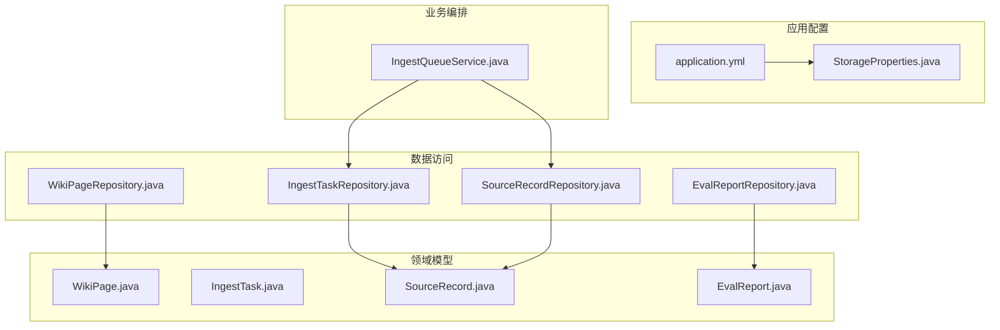
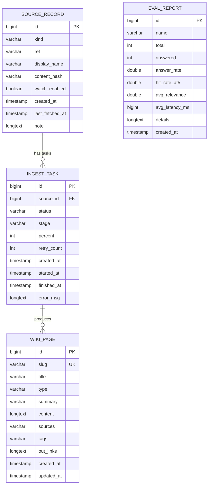
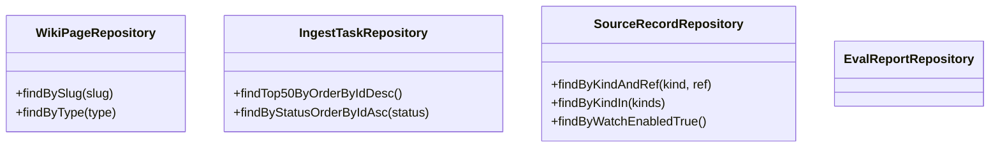
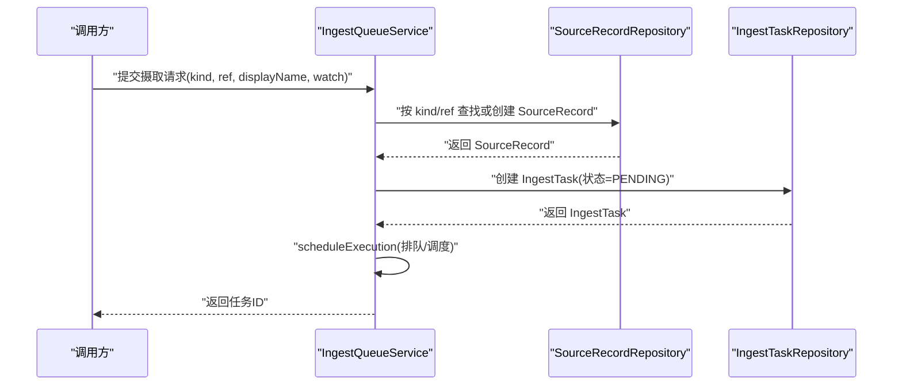
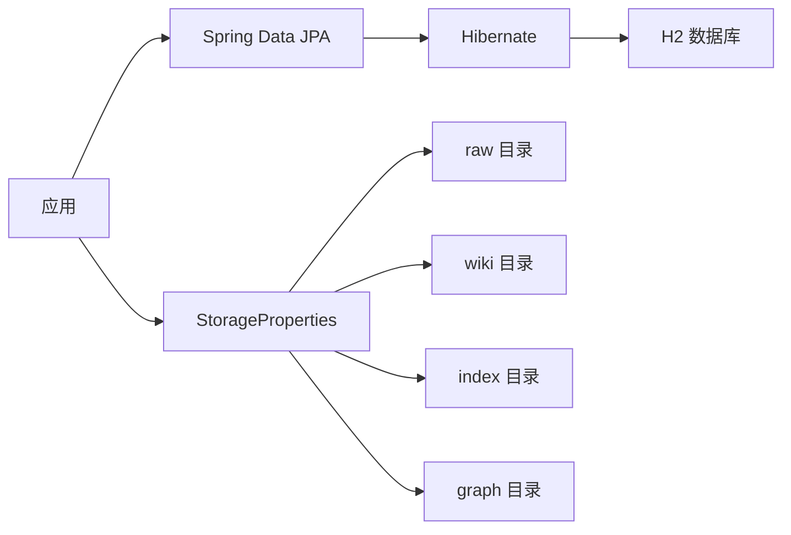

# 数据库设计

<cite>
**本文引用的文件**
- [WikiPage.java](file://src/main/java/com/example/llmwiki/domain/WikiPage.java)
- [IngestTask.java](file://src/main/java/com/example/llmwiki/domain/IngestTask.java)
- [SourceRecord.java](file://src/main/java/com/example/llmwiki/domain/SourceRecord.java)
- [EvalReport.java](file://src/main/java/com/example/llmwiki/domain/EvalReport.java)
- [WikiPageRepository.java](file://src/main/java/com/example/llmwiki/repository/WikiPageRepository.java)
- [IngestTaskRepository.java](file://src/main/java/com/example/llmwiki/repository/IngestTaskRepository.java)
- [SourceRecordRepository.java](file://src/main/java/com/example/llmwiki/repository/SourceRecordRepository.java)
- [EvalReportRepository.java](file://src/main/java/com/example/llmwiki/repository/EvalReportRepository.java)
- [application.yml](file://src/main/resources/application.yml)
- [IngestQueueService.java](file://src/main/java/com/example/llmwiki/queue/IngestQueueService.java)
- [StorageProperties.java](file://src/main/java/com/example/llmwiki/config/StorageProperties.java)
- [pom.xml](file://pom.xml)
</cite>

## 目录
1. [简介](#简介)
2. [项目结构](#项目结构)
3. [核心组件](#核心组件)
4. [架构总览](#架构总览)
5. [详细组件分析](#详细组件分析)
6. [依赖分析](#依赖分析)
7. [性能考虑](#性能考虑)
8. [故障排查指南](#故障排查指南)
9. [结论](#结论)
10. [附录](#附录)

## 简介
本文件面向 LLM Wiki 数据库设计，聚焦于实体关系建模、JPA 映射与表结构、数据访问层（Repository）、查询与事务、数据模型规范、数据库优化、数据安全、迁移与备份恢复、以及数据生命周期管理。当前系统采用嵌入式 H2 数据库，通过 Spring Data JPA 实现 ORM 映射，并结合 Quartz 定时调度与自研摄取队列保障数据摄入流程。

## 项目结构
- 数据模型位于 domain 包，采用 JPA 注解进行实体映射。
- 数据访问层位于 repository 包，基于 Spring Data JPA 接口扩展查询能力。
- 应用配置位于 resources/application.yml，包含数据源、JPA/Hibernate、Quartz 等配置。
- 摄取流程由 IngestQueueService 统一编排，协调 SourceRecord 与 IngestTask 的状态流转。
- 存储路径通过 StorageProperties 从配置读取，分别用于原始资料、Wiki Markdown、索引与图谱持久化。

图表来源
- [application.yml:1-84](file://src/main/resources/application.yml#L1-L84)
- [StorageProperties.java:1-28](file://src/main/java/com/example/llmwiki/config/StorageProperties.java#L1-L28)
- [WikiPage.java:1-72](file://src/main/java/com/example/llmwiki/domain/WikiPage.java#L1-L72)
- [IngestTask.java:1-62](file://src/main/java/com/example/llmwiki/domain/IngestTask.java#L1-L62)
- [SourceRecord.java:1-64](file://src/main/java/com/example/llmwiki/domain/SourceRecord.java#L1-L64)
- [EvalReport.java:1-51](file://src/main/java/com/example/llmwiki/domain/EvalReport.java#L1-L51)
- [WikiPageRepository.java:1-19](file://src/main/java/com/example/llmwiki/repository/WikiPageRepository.java#L1-L19)
- [IngestTaskRepository.java:1-18](file://src/main/java/com/example/llmwiki/repository/IngestTaskRepository.java#L1-L18)
- [SourceRecordRepository.java:1-21](file://src/main/java/com/example/llmwiki/repository/SourceRecordRepository.java#L1-L21)
- [EvalReportRepository.java:1-12](file://src/main/java/com/example/llmwiki/repository/EvalReportRepository.java#L1-L12)
- [IngestQueueService.java:1-144](file://src/main/java/com/example/llmwiki/queue/IngestQueueService.java#L1-L144)

章节来源
- [application.yml:1-84](file://src/main/resources/application.yml#L1-L84)
- [pom.xml:36-60](file://pom.xml#L36-L60)

## 核心组件
- WikiPage：知识页面实体，包含 slug（唯一）、title、type、summary、content（Markdown）、sources、tags、outLinks、创建与更新时间。
- IngestTask：摄取任务实体，包含 sourceId 外键、状态、阶段、进度、重试次数、开始/结束时间、错误信息。
- SourceRecord：数据源记录实体，包含 kind、ref、displayName、contentHash、watchEnabled、创建与最近抓取时间、备注。
- EvalReport：评测报告实体，包含名称、总数、已回答数、回答率、命中率、平均相关性、平均延迟、详情（JSON）与创建时间。

章节来源
- [WikiPage.java:17-71](file://src/main/java/com/example/llmwiki/domain/WikiPage.java#L17-L71)
- [IngestTask.java:17-61](file://src/main/java/com/example/llmwiki/domain/IngestTask.java#L17-L61)
- [SourceRecord.java:17-63](file://src/main/java/com/example/llmwiki/domain/SourceRecord.java#L17-L63)
- [EvalReport.java:17-50](file://src/main/java/com/example/llmwiki/domain/EvalReport.java#L17-L50)

## 架构总览
下图展示了实体间的关系映射与典型交互流程：SourceRecord 作为上游数据源，IngestTask 记录摄取过程与状态；成功后生成 WikiPage；EvalReport 用于评估指标记录。

图表来源
- [SourceRecord.java:28-63](file://src/main/java/com/example/llmwiki/domain/SourceRecord.java#L28-L63)
- [IngestTask.java:28-61](file://src/main/java/com/example/llmwiki/domain/IngestTask.java#L28-L61)
- [WikiPage.java:28-71](file://src/main/java/com/example/llmwiki/domain/WikiPage.java#L28-L71)
- [EvalReport.java:28-50](file://src/main/java/com/example/llmwiki/domain/EvalReport.java#L28-L50)

## 详细组件分析

### 实体关系与字段定义
- 主键设计
  - 所有实体均使用自增主键（IDENTITY），确保分布式无冲突的唯一标识。
- 外键约束
  - IngestTask.sourceId 指向 SourceRecord.id，形成摄取任务与数据源的关联。
  - WikiPage 未声明显式外键，但通过业务逻辑保证与 SourceRecord 的引用一致性。
- 约束与索引
  - slug 字段在 WikiPage 上声明唯一（UK），建议数据库层面建立唯一索引以保证一致性。
  - SourceRecord.kind/ref 组合用于去重与幂等，建议建立复合唯一索引。
  - EvalReport.name 用于报告标识，可考虑建立索引以便检索。
- 字段类型与长度
  - 使用 @Lob 处理大文本（content、outLinks、details、note），避免过长字符串限制。
  - 时间戳字段使用 Instant，便于跨时区处理与排序。

章节来源
- [WikiPage.java:31-71](file://src/main/java/com/example/llmwiki/domain/WikiPage.java#L31-L71)
- [IngestTask.java:31-61](file://src/main/java/com/example/llmwiki/domain/IngestTask.java#L31-L61)
- [SourceRecord.java:31-63](file://src/main/java/com/example/llmwiki/domain/SourceRecord.java#L31-L63)
- [EvalReport.java:31-50](file://src/main/java/com/example/llmwiki/domain/EvalReport.java#L31-L50)

### JPA 配置与实体注解
- 实体注解
  - @Entity、@Table(name = "...") 明确表映射。
  - @Id、@GeneratedValue(strategy = GenerationType.IDENTITY) 指定主键策略。
  - @Column(length = N, nullable = false, unique = true) 控制列属性与约束。
  - @Lob 处理大字段。
- 关系映射
  - 未使用 @ManyToOne/@OneToMany 等 JPA 关系注解，默认通过外键字段与业务代码维护关系。
- 级联与更新
  - 未配置级联操作，遵循“显式保存”原则，避免隐式级联带来的副作用。

章节来源
- [WikiPage.java:23-28](file://src/main/java/com/example/llmwiki/domain/WikiPage.java#L23-L28)
- [IngestTask.java:23-28](file://src/main/java/com/example/llmwiki/domain/IngestTask.java#L23-L28)
- [SourceRecord.java:23-28](file://src/main/java/com/example/llmwiki/domain/SourceRecord.java#L23-L28)
- [EvalReport.java:23-28](file://src/main/java/com/example/llmwiki/domain/EvalReport.java#L23-L28)

### 数据访问层设计
- WikiPageRepository
  - 提供按 slug 查询与按 type 过滤的能力，满足页面检索与分类展示。
- IngestTaskRepository
  - 提供最近任务列表与按状态排序的任务列表，支撑队列监控与调度。
- SourceRecordRepository
  - 提供按 kind/ref 去重查询、批量 kind 过滤与定时监控开关过滤。
- EvalReportRepository
  - 基础 CRUD 接口，支持评测结果的持久化与查询。

图表来源
- [WikiPageRepository.java:13-18](file://src/main/java/com/example/llmwiki/repository/WikiPageRepository.java#L13-L18)
- [IngestTaskRepository.java:12-17](file://src/main/java/com/example/llmwiki/repository/IngestTaskRepository.java#L12-L17)
- [SourceRecordRepository.java:13-20](file://src/main/java/com/example/llmwiki/repository/SourceRecordRepository.java#L13-L20)
- [EvalReportRepository.java:10-11](file://src/main/java/com/example/llmwiki/repository/EvalReportRepository.java#L10-L11)

章节来源
- [WikiPageRepository.java:13-18](file://src/main/java/com/example/llmwiki/repository/WikiPageRepository.java#L13-L18)
- [IngestTaskRepository.java:12-17](file://src/main/java/com/example/llmwiki/repository/IngestTaskRepository.java#L12-L17)
- [SourceRecordRepository.java:13-20](file://src/main/java/com/example/llmwiki/repository/SourceRecordRepository.java#L13-L20)
- [EvalReportRepository.java:10-11](file://src/main/java/com/example/llmwiki/repository/EvalReportRepository.java#L10-L11)

### 摄取流程与事务管理
- 流程概述
  - 通过 IngestQueueService 将 SourceRecord 与 IngestTask 关联，创建任务并调度执行。
  - 支持取消（仅对待执行任务生效）、重试（清空错误与重试计数并重新入队）。
- 事务特性
  - 未显式声明 @Transactional，采用 Spring Data 默认行为；建议在关键写入点（如任务状态变更、页面落库）添加本地事务以保证一致性。

图表来源
- [IngestQueueService.java:96-113](file://src/main/java/com/example/llmwiki/queue/IngestQueueService.java#L96-L113)
- [SourceRecordRepository.java:15](file://src/main/java/com/example/llmwiki/repository/SourceRecordRepository.java#L15)
- [IngestTaskRepository.java:14-16](file://src/main/java/com/example/llmwiki/repository/IngestTaskRepository.java#L14-L16)

章节来源
- [IngestQueueService.java:96-144](file://src/main/java/com/example/llmwiki/queue/IngestQueueService.java#L96-L144)

### 数据模型规范
- 命名约定
  - 表名与字段采用全小写加下划线风格（如 wiki_page、ingest_task、source_record、eval_report、out_links）。
- 数据验证规则
  - slug 唯一且非空；kind/ref 组合用于幂等；status/阶段枚举值受控；重试次数与进度范围合理。
- 业务规则约束
  - 待执行任务才允许取消；重试需清空错误并重置状态；页面内容与链接以逗号分隔存储，便于后续解析与图谱构建。

章节来源
- [WikiPage.java:35-45](file://src/main/java/com/example/llmwiki/domain/WikiPage.java#L35-L45)
- [IngestTask.java:38-44](file://src/main/java/com/example/llmwiki/domain/IngestTask.java#L38-L44)
- [SourceRecord.java:35-41](file://src/main/java/com/example/llmwiki/domain/SourceRecord.java#L35-L41)
- [IngestQueueService.java:115-134](file://src/main/java/com/example/llmwiki/queue/IngestQueueService.java#L115-L134)

## 依赖分析
- 数据库与驱动
  - 使用 H2 嵌入式数据库，开发环境自动建表（ddl-auto: update）。
- 解析与存储
  - 通过 StorageProperties 读取存储根目录与子目录，分别用于原始资料、Wiki Markdown、索引与图谱持久化。
- 外部依赖
  - PDF/Excel/Tika/JSoup/Readability4j 等解析库用于多格式内容抽取。

图表来源
- [application.yml:11-25](file://src/main/resources/application.yml#L11-L25)
- [StorageProperties.java:18-27](file://src/main/java/com/example/llmwiki/config/StorageProperties.java#L18-L27)
- [pom.xml:55-104](file://pom.xml#L55-L104)

章节来源
- [application.yml:11-25](file://src/main/resources/application.yml#L11-L25)
- [StorageProperties.java:18-27](file://src/main/java/com/example/llmwiki/config/StorageProperties.java#L18-L27)
- [pom.xml:55-104](file://pom.xml#L55-L104)

## 性能考虑
- 查询优化
  - 为 slug、kind/ref、status 等高频过滤字段建立索引，减少全表扫描。
  - 对 createdAt/startedAt/finishedAt 等时间字段建立索引，提升排序与范围查询效率。
- 索引策略
  - 唯一索引：slug（WikiPage）、kind/ref（SourceRecord）。
  - 复合索引：status+id（IngestTask）以支持队列调度。
- 连接池配置
  - 当前未显式配置连接池参数，建议在生产环境增加连接池大小、超时与空闲回收策略，避免高并发下的连接瓶颈。
- 分页与批量
  - 使用分页查询替代一次性加载大量记录，降低内存压力。

## 故障排查指南
- 任务状态异常
  - 检查 IngestTask.status 与重试次数，确认是否需要重试或取消。
- 数据重复
  - 检查 SourceRecord.kind/ref 去重逻辑与唯一索引是否生效。
- 大字段读写
  - 确认 @Lob 字段在数据库中的类型映射，避免超长文本截断。
- 配置问题
  - 核对 application.yml 中的数据源与 JPA 配置，确保 DDL 自动更新策略符合预期。

章节来源
- [IngestTaskRepository.java:14-16](file://src/main/java/com/example/llmwiki/repository/IngestTaskRepository.java#L14-L16)
- [SourceRecordRepository.java:15](file://src/main/java/com/example/llmwiki/repository/SourceRecordRepository.java#L15)
- [application.yml:20-25](file://src/main/resources/application.yml#L20-L25)

## 结论
本设计以轻量级嵌入式数据库为基础，通过清晰的实体边界与 Repository 查询能力，支撑了从数据源到知识页面再到评测报告的完整数据流。建议在生产环境中补充索引、连接池与事务管理，完善数据安全与审计能力，并制定数据库版本管理与迁移策略，以保障系统的稳定性与可维护性。

## 附录

### 数据库表结构与约束（概要）
- wiki_page
  - 主键：id（bigint, 自增）
  - 唯一：slug（varchar, 256）
  - 非空：title（varchar, 512）、type（varchar, 32）
  - 大字段：content、out_links（longtext）
  - 时间：created_at、updated_at（timestamp）
- ingest_task
  - 主键：id（bigint, 自增）
  - 外键：source_id → source_record.id
  - 非空：status（varchar, 16）
  - 枚举：status ∈ {PENDING, RUNNING, SUCCESS, FAILED, CANCELLED, SKIPPED}
  - 枚举：stage ∈ {PARSE, ANALYZE, GENERATE, INDEX, GRAPH}
  - 时间：created_at、started_at、finished_at（timestamp）
  - 大字段：error_msg（longtext）
- source_record
  - 主键：id（bigint, 自增）
  - 非空：kind（varchar, 32）、ref（varchar, 1024）
  - 枚举：kind ∈ {FILE, URL, FEISHU, DINGTALK}
  - 可选：displayName（varchar, 512）、contentHash（varchar, 128）、watchEnabled（boolean）
  - 时间：created_at、last_fetched_at（timestamp）
  - 大字段：note（longtext）
- eval_report
  - 主键：id（bigint, 自增）
  - 可选：name（varchar, 256）
  - 数值：total、answered（int）、answerRate、hitRateAt5、avgRelevance（double）、avgLatencyMs（bigint）
  - 大字段：details（longtext）
  - 时间：createdAt（timestamp）

章节来源
- [WikiPage.java:31-71](file://src/main/java/com/example/llmwiki/domain/WikiPage.java#L31-L71)
- [IngestTask.java:31-61](file://src/main/java/com/example/llmwiki/domain/IngestTask.java#L31-L61)
- [SourceRecord.java:31-63](file://src/main/java/com/example/llmwiki/domain/SourceRecord.java#L31-L63)
- [EvalReport.java:31-50](file://src/main/java/com/example/llmwiki/domain/EvalReport.java#L31-L50)

### 数据安全
- 访问控制
  - 建议在应用层引入鉴权与授权，限制对敏感数据的访问。
- 数据加密
  - 对敏感字段（如 note、details）在入库前进行加密存储，出库时解密。
- 审计日志
  - 记录关键数据变更（创建/更新/删除）与管理员操作，便于追踪与合规。

### 数据迁移与备份恢复
- 版本管理
  - 使用 Flyway 或 Liquibase 管理数据库版本，确保迁移脚本可追溯。
- 迁移脚本
  - 在新增索引、修改字段或调整约束时，编写增量迁移脚本并纳入 CI/CD。
- 备份恢复
  - 定期导出 H2 数据库文件（.mv.db/.trace.db），并验证恢复流程。

### 数据生命周期
- 保留策略
  - 为不同实体设置保留期限（如 ingest_task、eval_report 可按月清理）。
- 归档规则
  - 将历史数据归档至独立表或对象存储，降低在线库压力。
- 清理机制
  - 通过定时任务定期清理过期数据，释放存储空间并保持查询性能。