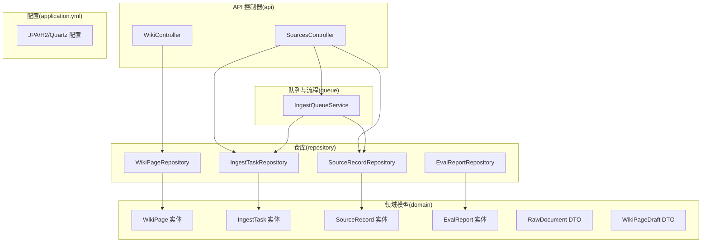
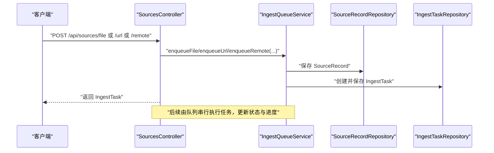
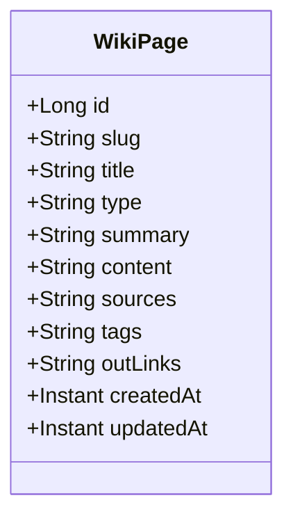
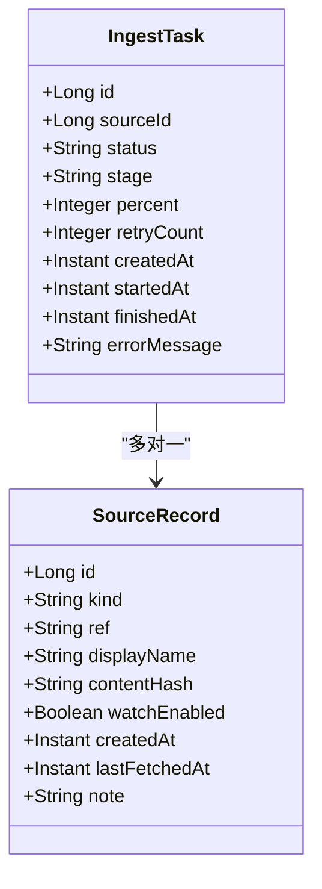
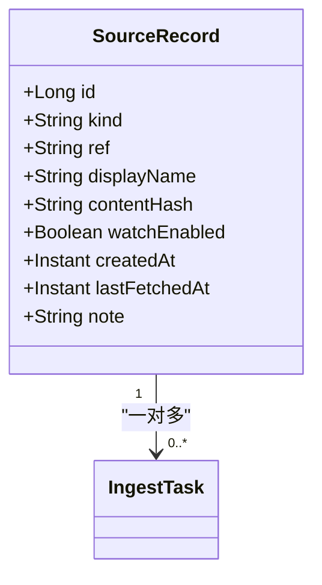
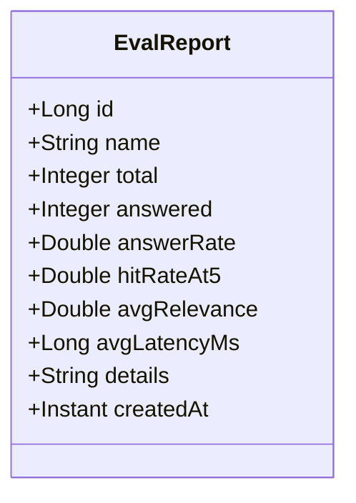
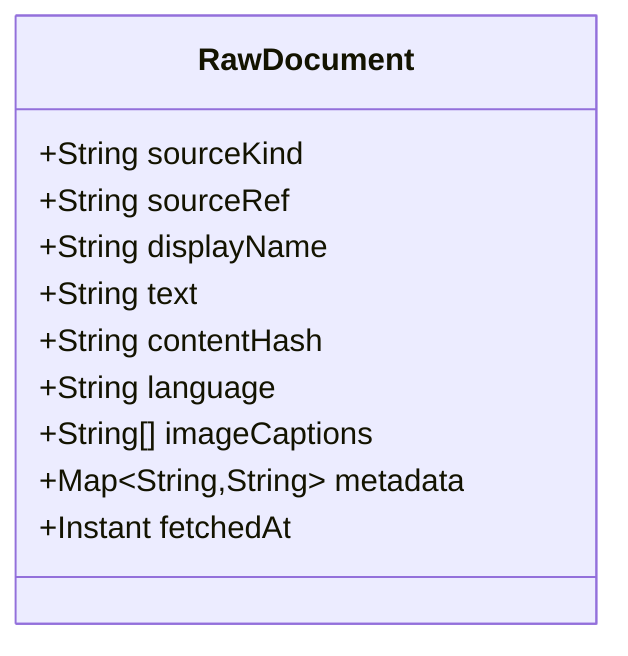
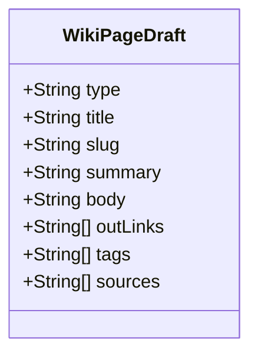
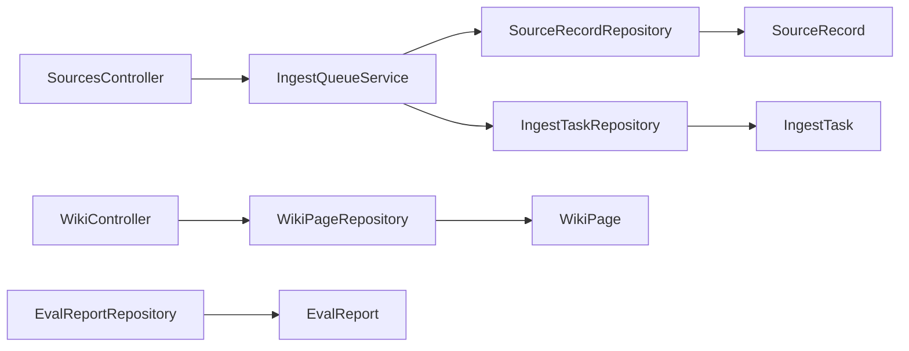

# 数据模型设计

<cite>
**本文引用的文件**
- [WikiPage.java](file://src/main/java/com/example/llmwiki/domain/WikiPage.java)
- [IngestTask.java](file://src/main/java/com/example/llmwiki/domain/IngestTask.java)
- [SourceRecord.java](file://src/main/java/com/example/llmwiki/domain/SourceRecord.java)
- [EvalReport.java](file://src/main/java/com/example/llmwiki/domain/EvalReport.java)
- [RawDocument.java](file://src/main/java/com/example/llmwiki/domain/RawDocument.java)
- [WikiPageDraft.java](file://src/main/java/com/example/llmwiki/domain/WikiPageDraft.java)
- [WikiPageRepository.java](file://src/main/java/com/example/llmwiki/repository/WikiPageRepository.java)
- [IngestTaskRepository.java](file://src/main/java/com/example/llmwiki/repository/IngestTaskRepository.java)
- [SourceRecordRepository.java](file://src/main/java/com/example/llmwiki/repository/SourceRecordRepository.java)
- [EvalReportRepository.java](file://src/main/java/com/example/llmwiki/repository/EvalReportRepository.java)
- [SourcesController.java](file://src/main/java/com/example/llmwiki/api/SourcesController.java)
- [WikiController.java](file://src/main/java/com/example/llmwiki/api/WikiController.java)
- [application.yml](file://src/main/resources/application.yml)
- [IngestQueueService.java](file://src/main/java/com/example/llmwiki/queue/IngestQueueService.java)
</cite>

## 目录
1. [简介](#简介)
2. [项目结构](#项目结构)
3. [核心组件](#核心组件)
4. [架构总览](#架构总览)
5. [详细组件分析](#详细组件分析)
6. [依赖分析](#依赖分析)
7. [性能考虑](#性能考虑)
8. [故障排查指南](#故障排查指南)
9. [结论](#结论)
10. [附录](#附录)

## 简介
本文件面向 LLM Wiki 的数据模型设计，系统性梳理并解释以下实体类的业务含义、字段定义、约束条件与注解用法，并阐明实体间的关系映射（一对多、多对多等）。同时给出实体设计最佳实践，包括命名约定、字段设计原则与性能优化建议。

## 项目结构
数据模型位于 domain 包中，采用 JPA 实体映射数据库表；对应的仓库接口位于 repository 包中，通过 Spring Data JPA 提供查询能力；API 控制器在 api 包中调用仓库与服务层完成业务操作；应用配置在 application.yml 中定义数据源与 JPA 行为。

图表来源
- [SourcesController.java:30-102](file://src/main/java/com/example/llmwiki/api/SourcesController.java#L30-L102)
- [WikiController.java:22-51](file://src/main/java/com/example/llmwiki/api/WikiController.java#L22-L51)
- [application.yml:1-84](file://src/main/resources/application.yml#L1-L84)
- [IngestQueueService.java:33-181](file://src/main/java/com/example/llmwiki/queue/IngestQueueService.java#L33-L181)

章节来源
- [application.yml:1-84](file://src/main/resources/application.yml#L1-L84)

## 核心组件
本节概述各实体的职责与典型用途：
- WikiPage：存储最终生成的 Wiki 页面，包含 slug、标题、类型、摘要、正文（Markdown）、来源引用、标签、外链等字段，支持按 slug 查询与按类型筛选。
- IngestTask：记录一次“摄入任务”的生命周期与状态，包括来源 ID、状态、阶段、进度、重试次数、错误信息及时间戳。
- SourceRecord：记录数据源的元信息，如来源类型（文件/URL/飞书/钉钉）、引用标识、显示名、内容指纹、定时刷新开关、时间戳等。
- EvalReport：评测报告聚合指标与明细 JSON，用于评估问答/检索质量。
- RawDocument：标准化的“原始文档”传输对象，由解析器统一产出，便于摄入流水线消费。
- WikiPageDraft：Step2 LLM 生成的页面草稿，包含类型、标题、slug、摘要、正文、外链、标签、来源等字段。

章节来源
- [WikiPage.java:17-72](file://src/main/java/com/example/llmwiki/domain/WikiPage.java#L17-L72)
- [IngestTask.java:17-62](file://src/main/java/com/example/llmwiki/domain/IngestTask.java#L17-L62)
- [SourceRecord.java:17-64](file://src/main/java/com/example/llmwiki/domain/SourceRecord.java#L17-L64)
- [EvalReport.java:17-51](file://src/main/java/com/example/llmwiki/domain/EvalReport.java#L17-L51)
- [RawDocument.java:12-52](file://src/main/java/com/example/llmwiki/domain/RawDocument.java#L12-L52)
- [WikiPageDraft.java:11-50](file://src/main/java/com/example/llmwiki/domain/WikiPageDraft.java#L11-L50)

## 架构总览
下图展示实体与仓库、控制器、队列服务之间的交互关系，体现“数据源 → 摄入任务 → Wiki 页面”的主流程。

图表来源
- [SourcesController.java:45-61](file://src/main/java/com/example/llmwiki/api/SourcesController.java#L45-L61)
- [IngestQueueService.java:73-113](file://src/main/java/com/example/llmwiki/queue/IngestQueueService.java#L73-L113)
- [SourceRecordRepository.java:13-21](file://src/main/java/com/example/llmwiki/repository/SourceRecordRepository.java#L13-L21)
- [IngestTaskRepository.java:12-18](file://src/main/java/com/example/llmwiki/repository/IngestTaskRepository.java#L12-L18)

## 详细组件分析

### WikiPage 实体
- 业务含义：最终生成的 Wiki 页面，包含标题、类型、摘要、正文（Markdown）、来源引用、标签、外链等，slug 唯一且作为内部链接目标。
- 字段与约束
  - id：主键，自增
  - slug：字符串，最大长度 256，非空，唯一
  - title：字符串，最大长度 512，非空
  - type：字符串，最大长度 32，非空；枚举值包括 entity / concept / source / overview / index / log / purpose
  - summary：字符串，最大长度 2048
  - content：长文本（@Lob），Markdown 正文
  - sources：字符串，最大长度 2048，逗号分隔的来源引用
  - tags：字符串，最大长度 1024，逗号分隔的标签
  - outLinks：长文本（@Lob），逗号分隔的外链 slug
  - createdAt/updatedAt：时间戳
- 注解说明
  - @Entity/@Table：声明实体与表映射
  - @Id/@GeneratedValue：主键与自增策略
  - @Column：字段长度、是否非空、列名（如 error_msg）
  - @Lob：大字段（content、outLinks、errorMessage、note 等）
- 关系映射
  - 与 SourceRecord：WikiPage 不直接持有 SourceRecord 引用；但 sources/outLinks 以字符串形式维护关联线索，属于弱耦合的“逻辑外键”
  - 与 IngestTask：WikiPage 并不直接关联 IngestTask；二者通过摄入流程间接相关
- 最佳实践
  - slug 唯一性约束需配合数据库唯一索引；查询时优先使用 slug
  - content/outLinks 使用 @Lob，注意数据库方言与驱动对大字段的处理差异
  - tags/sources/outLinks 采用逗号分隔便于简单查询，但复杂分析建议拆表或引入 JSON 字段

图表来源
- [WikiPage.java:23-72](file://src/main/java/com/example/llmwiki/domain/WikiPage.java#L23-L72)

章节来源
- [WikiPage.java:17-72](file://src/main/java/com/example/llmwiki/domain/WikiPage.java#L17-L72)
- [WikiPageRepository.java:13-19](file://src/main/java/com/example/llmwiki/repository/WikiPageRepository.java#L13-L19)
- [WikiController.java:29-49](file://src/main/java/com/example/llmwiki/api/WikiController.java#L29-L49)

### IngestTask 实体
- 业务含义：记录一次摄入任务的生命周期，包括来源 ID、状态、阶段、进度、重试次数、错误信息与时间戳。
- 字段与约束
  - id：主键，自增
  - sourceId：外键关联 SourceRecord.id
  - status：字符串，最大长度 16，非空；取值：PENDING / RUNNING / SUCCESS / FAILED / CANCELLED / SKIPPED
  - stage：字符串，最大长度 32；取值：PARSE / ANALYZE / GENERATE / INDEX / GRAPH
  - percent：整数，0-100
  - retryCount：整数
  - createdAt/startedAt/finishedAt：时间戳
  - errorMessage：长文本（@Lob），错误消息
- 注解说明
  - @Entity/@Table/@Id/@GeneratedValue：同上
  - @Column：长度与非空约束
  - @Lob：错误消息
- 关系映射
  - 与 SourceRecord：多条 IngestTask 对应一条 SourceRecord（一对多）
- 最佳实践
  - 队列服务在启动时会将 RUNNING 状态的任务恢复为 PENDING 并重新入队，确保幂等性
  - 使用 status + stage 组合进行任务调度与可视化展示

图表来源
- [IngestTask.java:23-62](file://src/main/java/com/example/llmwiki/domain/IngestTask.java#L23-L62)
- [SourceRecord.java:23-64](file://src/main/java/com/example/llmwiki/domain/SourceRecord.java#L23-L64)

章节来源
- [IngestTask.java:17-62](file://src/main/java/com/example/llmwiki/domain/IngestTask.java#L17-L62)
- [IngestTaskRepository.java:12-18](file://src/main/java/com/example/llmwiki/repository/IngestTaskRepository.java#L12-L18)
- [IngestQueueService.java:53-63](file://src/main/java/com/example/llmwiki/queue/IngestQueueService.java#L53-L63)

### SourceRecord 实体
- 业务含义：记录每次摄入的原始来源，包括来源类型、引用标识、显示名、内容指纹、定时刷新开关与备注等。
- 字段与约束
  - id：主键，自增
  - kind：字符串，最大长度 32，非空；取值：FILE / URL / FEISHU / DINGTALK
  - ref：字符串，最大长度 1024，非空；对应文件名/URL/文档 token
  - displayName：字符串，最大长度 512
  - contentHash：字符串，最大长度 128；用于内容指纹/去重
  - watchEnabled：布尔值；是否启用定时刷新
  - createdAt/lastFetchedAt：时间戳
  - note：长文本（@Lob）
- 注解说明
  - @Entity/@Table/@Id/@GeneratedValue/@Column/@Lob：同上
- 关系映射
  - 与 IngestTask：一对多（一条 SourceRecord 可触发多条 IngestTask）
- 最佳实践
  - contentHash 用于判断内容是否变化，避免重复摄入
  - watchEnabled 与定时任务结合，实现增量刷新

图表来源
- [SourceRecord.java:23-64](file://src/main/java/com/example/llmwiki/domain/SourceRecord.java#L23-L64)
- [IngestTask.java:23-62](file://src/main/java/com/example/llmwiki/domain/IngestTask.java#L23-L62)

章节来源
- [SourceRecord.java:17-64](file://src/main/java/com/example/llmwiki/domain/SourceRecord.java#L17-L64)
- [SourceRecordRepository.java:13-21](file://src/main/java/com/example/llmwiki/repository/SourceRecordRepository.java#L13-L21)
- [SourcesController.java:40-84](file://src/main/java/com/example/llmwiki/api/SourcesController.java#L40-L84)

### EvalReport 实体
- 业务含义：评测报告的聚合指标与明细 JSON，用于评估问答/检索质量。
- 字段与约束
  - id：主键，自增
  - name：字符串，最大长度 256
  - total/answered：整数
  - answerRate/hitRateAt5/avgRelevance：浮点数
  - avgLatencyMs：长整型
  - details：长文本（@Lob），JSON 明细
  - createdAt：时间戳
- 注解说明
  - @Entity/@Table/@Id/@GeneratedValue/@Column/@Lob：同上
- 关系映射
  - EvalReport 与其它实体无直接外键关联，独立存储
- 最佳实践
  - details 使用 JSON 存储明细，便于前端渲染与二次分析
  - 指标字段命名清晰，便于报表与可视化

图表来源
- [EvalReport.java:23-51](file://src/main/java/com/example/llmwiki/domain/EvalReport.java#L23-L51)

章节来源
- [EvalReport.java:17-51](file://src/main/java/com/example/llmwiki/domain/EvalReport.java#L17-L51)
- [EvalReportRepository.java:10-12](file://src/main/java/com/example/llmwiki/repository/EvalReportRepository.java#L10-L12)

### RawDocument DTO
- 业务含义：标准化的“原始文档”传输对象，所有解析器统一输出此结构供摄入流水线消费。
- 字段与约束
  - sourceKind：来源类型（FILE / URL / FEISHU / DINGTALK）
  - sourceRef：来源标识（文件名/URL/文档 token）
  - displayName：显示名
  - text：文本正文
  - contentHash：内容指纹（SHA256）
  - language：语言（zh / en / auto）
  - imageCaptions：图像描述列表（默认空列表）
  - metadata：元信息 Map（默认空 Map）
  - fetchedAt：抓取时间（默认当前时间）
- 设计要点
  - 作为 DTO，不参与数据库持久化，仅用于跨模块传递
  - 字段默认值通过 @Builder.Default 提供，简化调用端构造

图表来源
- [RawDocument.java:18-52](file://src/main/java/com/example/llmwiki/domain/RawDocument.java#L18-L52)

章节来源
- [RawDocument.java:12-52](file://src/main/java/com/example/llmwiki/domain/RawDocument.java#L12-L52)

### WikiPageDraft DTO
- 业务含义：Step2 LLM 生成的页面草稿，包含类型、标题、slug、摘要、正文、外链、标签、来源等字段。
- 字段与约束
  - type：类型（entity / concept / source / ...）
  - title：标题
  - slug：文件名
  - summary：摘要
  - body：Markdown 正文（不含 frontmatter）
  - outLinks/tags/sources：默认空列表
- 设计要点
  - 作为 DTO，便于在 LLM 生成与入库之间传递中间结果
  - 默认集合通过 @Builder.Default 初始化，避免空指针

图表来源
- [WikiPageDraft.java:17-50](file://src/main/java/com/example/llmwiki/domain/WikiPageDraft.java#L17-L50)

章节来源
- [WikiPageDraft.java:11-50](file://src/main/java/com/example/llmwiki/domain/WikiPageDraft.java#L11-L50)

## 依赖分析
- 实体与仓库
  - WikiPage ↔ WikiPageRepository：提供按 slug 与类型查询
  - IngestTask ↔ IngestTaskRepository：提供按状态排序与分页查询
  - SourceRecord ↔ SourceRecordRepository：提供按 kind/ref 唯一定位与 watchEnabled 查询
  - EvalReport ↔ EvalReportRepository：基础 CRUD
- 控制器与服务
  - SourcesController：对接 IngestQueueService，提交文件/URL/远程来源，查询任务列表，取消/重试任务
  - WikiController：列出页面、按 slug 查询详情、统计总数与按类型分布
- 队列服务
  - IngestQueueService：负责任务创建、恢复、串行执行、取消与重试，维护 cancelled 集合与单线程工作线程

图表来源
- [SourcesController.java:30-102](file://src/main/java/com/example/llmwiki/api/SourcesController.java#L30-L102)
- [WikiController.java:22-51](file://src/main/java/com/example/llmwiki/api/WikiController.java#L22-L51)
- [IngestQueueService.java:33-181](file://src/main/java/com/example/llmwiki/queue/IngestQueueService.java#L33-L181)
- [WikiPageRepository.java:13-19](file://src/main/java/com/example/llmwiki/repository/WikiPageRepository.java#L13-L19)
- [IngestTaskRepository.java:12-18](file://src/main/java/com/example/llmwiki/repository/IngestTaskRepository.java#L12-L18)
- [SourceRecordRepository.java:13-21](file://src/main/java/com/example/llmwiki/repository/SourceRecordRepository.java#L13-L21)
- [EvalReportRepository.java:10-12](file://src/main/java/com/example/llmwiki/repository/EvalReportRepository.java#L10-L12)

章节来源
- [SourcesController.java:30-102](file://src/main/java/com/example/llmwiki/api/SourcesController.java#L30-L102)
- [WikiController.java:22-51](file://src/main/java/com/example/llmwiki/api/WikiController.java#L22-L51)
- [IngestQueueService.java:33-181](file://src/main/java/com/example/llmwiki/queue/IngestQueueService.java#L33-L181)

## 性能考虑
- 字段长度与索引
  - slug 设置唯一索引，查询效率高；title/type/slug 等常用过滤字段建议建立索引
  - content/outLinks/notes/error_msg 等大字段使用 @Lob，注意数据库方言差异与网络传输开销
- 查询模式
  - WikiPageRepository 提供按 slug 与 type 查询，适合高频读取
  - IngestTaskRepository 按状态排序与分页查询，适合任务面板展示
- 存储与 IO
  - application.yml 使用 H2 文件数据库，DDL 自动更新；生产环境建议切换为 MySQL/PG 并开启连接池
  - 队列服务单线程串行执行，避免并发写冲突；可通过配置调整 worker 线程数
- 缓存与指纹
  - SourceRecord.contentHash 用于内容指纹，减少重复摄入
  - WikiPage.sources/tags/outLinks 采用逗号分隔，适合简单查询；复杂分析建议拆表或引入 JSON 字段

[本节为通用性能建议，无需特定文件引用]

## 故障排查指南
- 任务状态异常
  - 启动恢复：将 RUNNING 状态的任务标记为 PENDING 并重新入队，避免悬挂任务
  - 取消/重试：取消时若任务仍为 PENDING 则直接标记为 CANCELLED；重试时清空错误信息并重新入队
- 数据一致性
  - 若 SourceRecord 丢失，IngestTask 执行时会标记为 FAILED 并记录错误消息
  - 建议定期巡检 FAILED 任务并清理或重试
- 查询性能
  - 对 slug/title/type 等字段建立索引可显著提升查询性能
  - 大字段（content/outLinks）查询时尽量延迟加载或分页

章节来源
- [IngestQueueService.java:53-63](file://src/main/java/com/example/llmwiki/queue/IngestQueueService.java#L53-L63)
- [IngestQueueService.java:115-134](file://src/main/java/com/example/llmwiki/queue/IngestQueueService.java#L115-L134)
- [IngestTask.java:58-61](file://src/main/java/com/example/llmwiki/domain/IngestTask.java#L58-L61)

## 结论
本数据模型围绕“数据源 → 摄入任务 → Wiki 页面”的主流程设计，采用轻量级注解与标准 JPA 接口，兼顾易用性与扩展性。实体间通过字符串字段维护弱耦合关联，满足当前业务需求；未来可按需引入 JSON 字段或拆表以支持更复杂的查询与分析。

[本节为总结性内容，无需特定文件引用]

## 附录

### 实体注解使用说明
- @Entity：声明 JPA 实体
- @Table：指定表名
- @Id：主键
- @GeneratedValue：主键生成策略（IDENTITY）
- @Column：字段映射，支持 length、nullable、unique、name 等属性
- @Lob：大字段（CLOB/BLOB）

章节来源
- [WikiPage.java:23-72](file://src/main/java/com/example/llmwiki/domain/WikiPage.java#L23-L72)
- [IngestTask.java:23-62](file://src/main/java/com/example/llmwiki/domain/IngestTask.java#L23-L62)
- [SourceRecord.java:23-64](file://src/main/java/com/example/llmwiki/domain/SourceRecord.java#L23-L64)
- [EvalReport.java:23-51](file://src/main/java/com/example/llmwiki/domain/EvalReport.java#L23-L51)

### 实体关系与映射
- WikiPage 与 SourceRecord：WikiPage 不直接持有外键，通过 sources/outLinks 维护逻辑关联
- IngestTask 与 SourceRecord：多对一（一条 SourceRecord 触发多条 IngestTask）
- EvalReport：独立实体，无外键关联

章节来源
- [WikiPage.java:35-66](file://src/main/java/com/example/llmwiki/domain/WikiPage.java#L35-L66)
- [IngestTask.java:35-40](file://src/main/java/com/example/llmwiki/domain/IngestTask.java#L35-L40)
- [SourceRecord.java:35-41](file://src/main/java/com/example/llmwiki/domain/SourceRecord.java#L35-L41)

### 最佳实践清单
- 命名约定
  - 实体类名使用单数，表名使用复数；字段名采用小驼峰
  - 唯一约束字段（如 slug）需配合数据库唯一索引
- 字段设计
  - 非空字段明确标注 nullable=false
  - 大文本字段使用 @Lob，并关注数据库方言与驱动限制
  - 枚举字段（status/stage/kind/type）建议在代码层限定取值范围
- 性能优化
  - 为高频查询字段建立索引
  - 对大字段采用延迟加载或分页策略
  - 使用 contentHash 等指纹字段减少重复处理

[本节为通用最佳实践，无需特定文件引用]