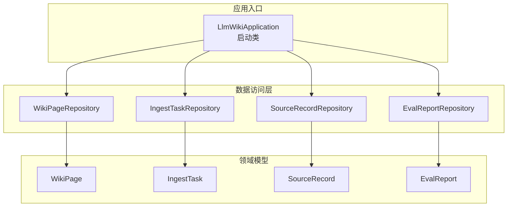
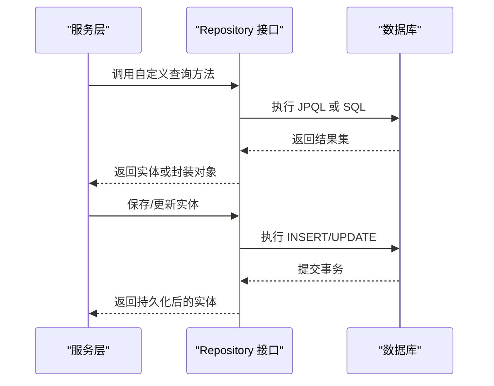
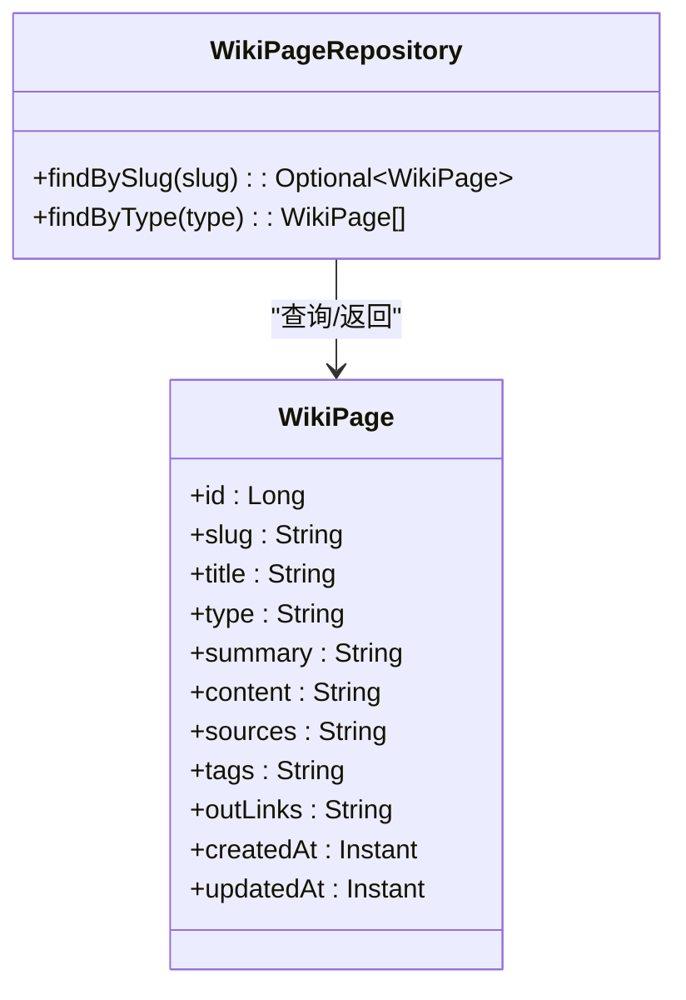
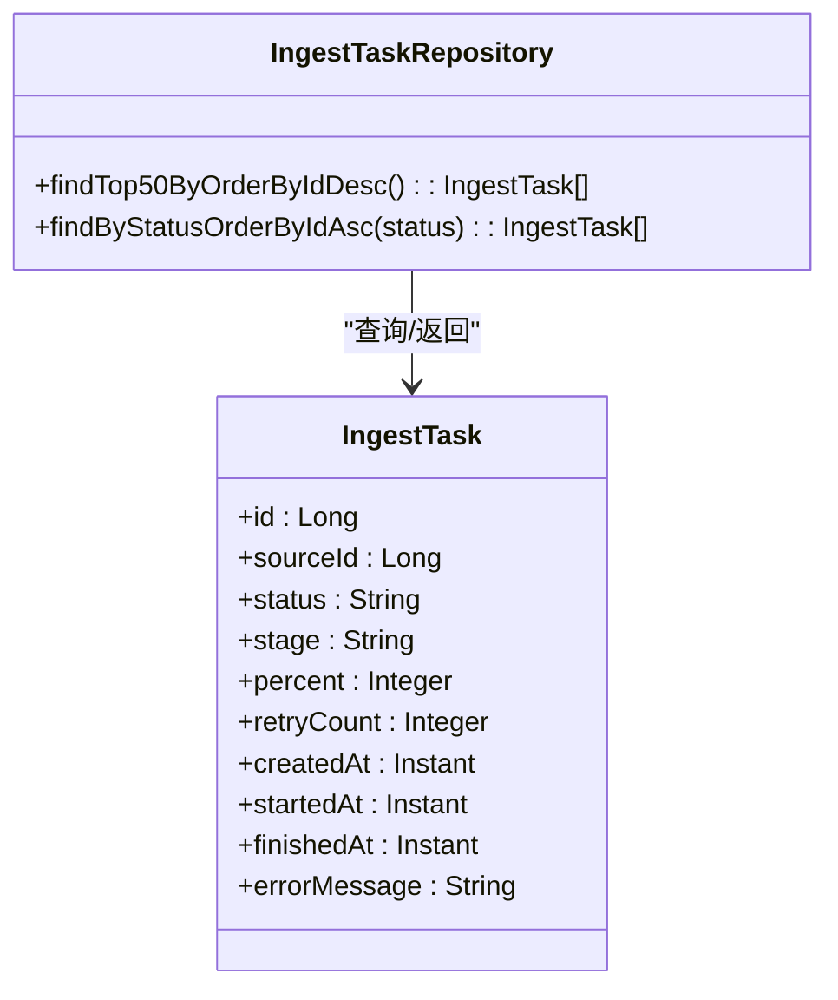
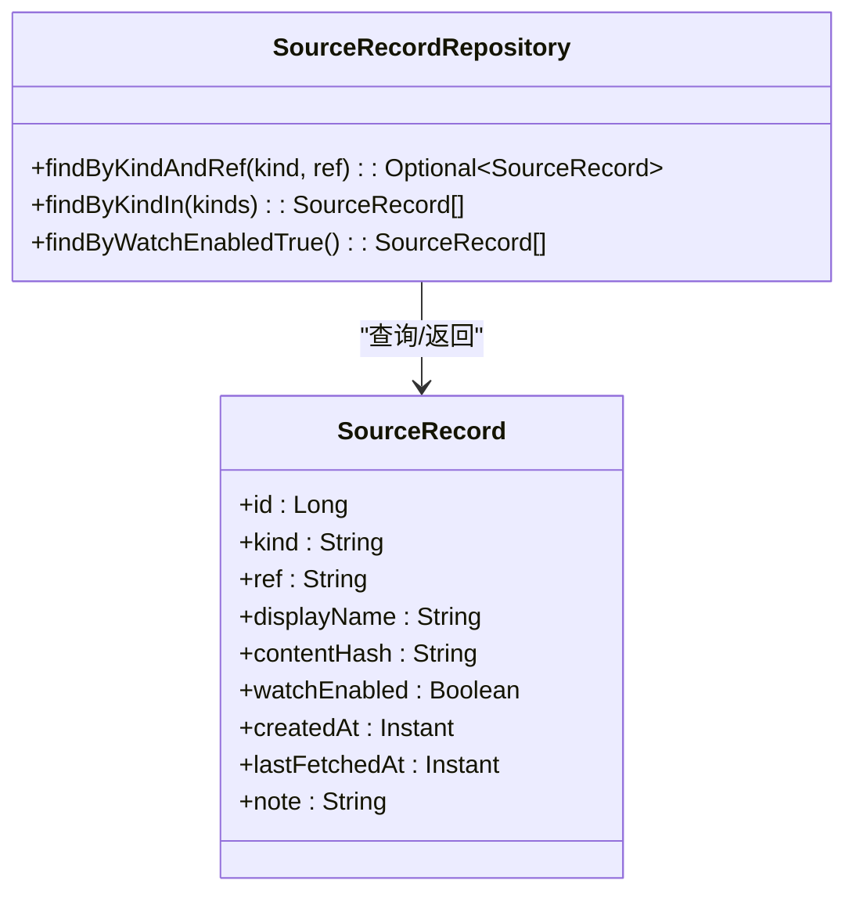
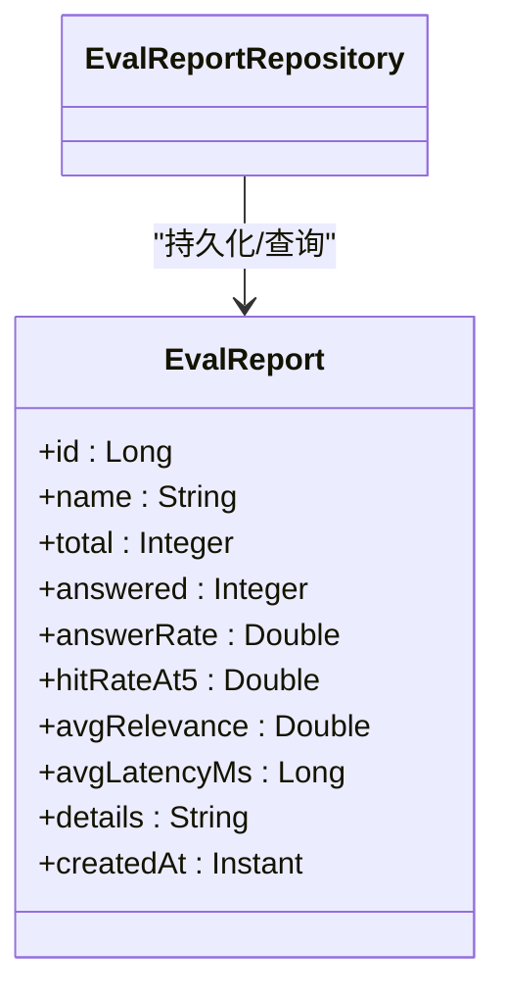
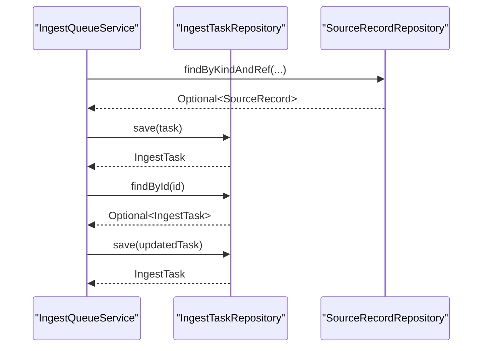
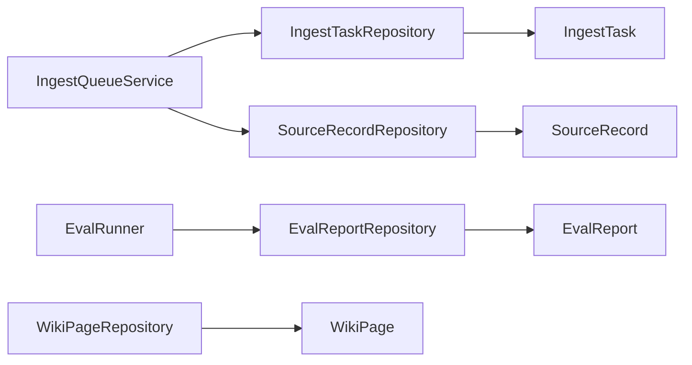

# 数据访问层设计

<cite>
**本文引用的文件**
- [WikiPageRepository.java](file://src/main/java/com/example/llmwiki/repository/WikiPageRepository.java)
- [IngestTaskRepository.java](file://src/main/java/com/example/llmwiki/repository/IngestTaskRepository.java)
- [SourceRecordRepository.java](file://src/main/java/com/example/llmwiki/repository/SourceRecordRepository.java)
- [EvalReportRepository.java](file://src/main/java/com/example/llmwiki/repository/EvalReportRepository.java)
- [WikiPage.java](file://src/main/java/com/example/llmwiki/domain/WikiPage.java)
- [IngestTask.java](file://src/main/java/com/example/llmwiki/domain/IngestTask.java)
- [SourceRecord.java](file://src/main/java/com/example/llmwiki/domain/SourceRecord.java)
- [EvalReport.java](file://src/main/java/com/example/llmwiki/domain/EvalReport.java)
- [IngestQueueService.java](file://src/main/java/com/example/llmwiki/queue/IngestQueueService.java)
- [EvalRunner.java](file://src/main/java/com/example/llmwiki/eval/EvalRunner.java)
- [LlmWikiApplication.java](file://src/main/java/com/example/llmwiki/LlmWikiApplication.java)
</cite>

## 目录
1. [简介](#简介)
2. [项目结构](#项目结构)
3. [核心组件](#核心组件)
4. [架构总览](#架构总览)
5. [详细组件分析](#详细组件分析)
6. [依赖分析](#依赖分析)
7. [性能考虑](#性能考虑)
8. [故障排查指南](#故障排查指南)
9. [结论](#结论)
10. [附录](#附录)

## 简介
本文件系统性阐述 LLM Wiki 项目的“数据访问层”设计，重点围绕 Spring Data JPA 的 Repository 接口设计与使用，包括：
- 继承 JpaRepository 的标准 CRUD 语义与扩展方法
- 自定义查询方法的命名规范与实现原理
- JPQL 与原生 SQL 的使用场景与注意事项
- 动态查询的构建思路与替代方案
- 事务管理策略与异常处理
- 查询优化技巧与最佳实践

## 项目结构
数据访问层位于 repository 包，每个领域实体对应一个 Repository 接口，统一继承 JpaRepository，以获得标准 CRUD 能力，并在需要时扩展自定义查询方法。

图表来源
- [LlmWikiApplication.java:19-28](file://src/main/java/com/example/llmwiki/LlmWikiApplication.java#L19-L28)
- [WikiPageRepository.java:13](file://src/main/java/com/example/llmwiki/repository/WikiPageRepository.java#L13)
- [IngestTaskRepository.java:12](file://src/main/java/com/example/llmwiki/repository/IngestTaskRepository.java#L12)
- [SourceRecordRepository.java:13](file://src/main/java/com/example/llmwiki/repository/SourceRecordRepository.java#L13)
- [EvalReportRepository.java:10](file://src/main/java/com/example/llmwiki/repository/EvalReportRepository.java#L10)

章节来源
- [LlmWikiApplication.java:19-28](file://src/main/java/com/example/llmwiki/LlmWikiApplication.java#L19-L28)
- [WikiPageRepository.java:13](file://src/main/java/com/example/llmwiki/repository/WikiPageRepository.java#L13)
- [IngestTaskRepository.java:12](file://src/main/java/com/example/llmwiki/repository/IngestTaskRepository.java#L12)
- [SourceRecordRepository.java:13](file://src/main/java/com/example/llmwiki/repository/SourceRecordRepository.java#L13)
- [EvalReportRepository.java:10](file://src/main/java/com/example/llmwiki/repository/EvalReportRepository.java#L10)

## 核心组件
- 统一基类：所有 Repository 接口均继承 JpaRepository，获得标准 CRUD、分页排序、存在性检查等能力。
- 自定义查询方法：通过方法命名约定实现条件查询，如按字段相等、范围、集合、布尔值等。
- 实体映射：每个 Repository 对应一个实体类，字段与数据库表列一一映射。

章节来源
- [WikiPageRepository.java:13-18](file://src/main/java/com/example/llmwiki/repository/WikiPageRepository.java#L13-L18)
- [IngestTaskRepository.java:12-17](file://src/main/java/com/example/llmwiki/repository/IngestTaskRepository.java#L12-L17)
- [SourceRecordRepository.java:13-20](file://src/main/java/com/example/llmwiki/repository/SourceRecordRepository.java#L13-L20)
- [EvalReportRepository.java:10](file://src/main/java/com/example/llmwiki/repository/EvalReportRepository.java#L10)

## 架构总览
下图展示 Repository 与服务层的交互关系，以及典型查询流程。

图表来源
- [IngestQueueService.java:56-62](file://src/main/java/com/example/llmwiki/queue/IngestQueueService.java#L56-L62)
- [IngestQueueService.java:159-212](file://src/main/java/com/example/llmwiki/queue/IngestQueueService.java#L159-L212)
- [EvalRunner.java:129-134](file://src/main/java/com/example/llmwiki/eval/EvalRunner.java#L129-L134)

## 详细组件分析

### WikiPageRepository 设计
- 继承关系：继承 JpaRepository<WikiPage, Long>，具备标准 CRUD 能力。
- 自定义查询：
  - 按 slug 查询唯一页面：返回 Optional，避免空指针。
  - 按 type 查询页面列表：返回 List，便于前端筛选。
- 使用场景：页面检索、类型聚合、slug 唯一性校验。

图表来源
- [WikiPageRepository.java:13-18](file://src/main/java/com/example/llmwiki/repository/WikiPageRepository.java#L13-L18)
- [WikiPage.java:29-71](file://src/main/java/com/example/llmwiki/domain/WikiPage.java#L29-L71)

章节来源
- [WikiPageRepository.java:13-18](file://src/main/java/com/example/llmwiki/repository/WikiPageRepository.java#L13-L18)
- [WikiPage.java:29-71](file://src/main/java/com/example/llmwiki/domain/WikiPage.java#L29-L71)

### IngestTaskRepository 设计
- 继承关系：继承 JpaRepository<IngestTask, Long>。
- 自定义查询：
  - 限制数量的降序查询：获取最新任务列表。
  - 条件排序查询：按状态过滤并按主键升序排列，保证执行顺序稳定。
- 使用场景：队列恢复、任务调度、状态监控。

图表来源
- [IngestTaskRepository.java:12-17](file://src/main/java/com/example/llmwiki/repository/IngestTaskRepository.java#L12-L17)
- [IngestTask.java:29-61](file://src/main/java/com/example/llmwiki/domain/IngestTask.java#L29-L61)

章节来源
- [IngestTaskRepository.java:12-17](file://src/main/java/com/example/llmwiki/repository/IngestTaskRepository.java#L12-L17)
- [IngestTask.java:29-61](file://src/main/java/com/example/llmwiki/domain/IngestTask.java#L29-L61)

### SourceRecordRepository 设计
- 继承关系：继承 JpaRepository<SourceRecord, Long>。
- 自定义查询：
  - 复合条件查询：按 kind 与 ref 精确匹配。
  - 集合查询：按 kind 列表进行 IN 查询。
  - 布尔查询：查询 watchEnabled 为真。
- 使用场景：去重入库、定时刷新控制、来源统计。

图表来源
- [SourceRecordRepository.java:13-20](file://src/main/java/com/example/llmwiki/repository/SourceRecordRepository.java#L13-L20)
- [SourceRecord.java:29-63](file://src/main/java/com/example/llmwiki/domain/SourceRecord.java#L29-L63)

章节来源
- [SourceRecordRepository.java:13-20](file://src/main/java/com/example/llmwiki/repository/SourceRecordRepository.java#L13-L20)
- [SourceRecord.java:29-63](file://src/main/java/com/example/llmwiki/domain/SourceRecord.java#L29-L63)

### EvalReportRepository 设计
- 继承关系：继承 JpaRepository<EvalReport, Long>。
- 自定义查询：当前未定义额外方法，直接复用标准 CRUD。
- 使用场景：评测结果持久化与查询。

图表来源
- [EvalReportRepository.java:10](file://src/main/java/com/example/llmwiki/repository/EvalReportRepository.java#L10)
- [EvalReport.java:29-49](file://src/main/java/com/example/llmwiki/domain/EvalReport.java#L29-L49)

章节来源
- [EvalReportRepository.java:10](file://src/main/java/com/example/llmwiki/repository/EvalReportRepository.java#L10)
- [EvalReport.java:29-49](file://src/main/java/com/example/llmwiki/domain/EvalReport.java#L29-L49)

### 查询方法命名规范与实现
- findByXxx：按属性相等查询，返回 Optional 或 List。
- findTopNByOrderByIdDesc：限制数量并按主键倒序。
- findByStatusOrderByIdAsc：按状态过滤并按主键正序。
- findByKindAndRef：复合条件查询。
- findByKindIn：IN 条件查询。
- findByWatchEnabledTrue：布尔条件查询。
- 实现原理：Spring Data JPA 基于方法名解析生成 JPQL 或 SQL，无需手写实现。

章节来源
- [WikiPageRepository.java:15-17](file://src/main/java/com/example/llmwiki/repository/WikiPageRepository.java#L15-L17)
- [IngestTaskRepository.java:14-16](file://src/main/java/com/example/llmwiki/repository/IngestTaskRepository.java#L14-L16)
- [SourceRecordRepository.java:15-19](file://src/main/java/com/example/llmwiki/repository/SourceRecordRepository.java#L15-L19)

### 自定义查询实现方式
- JPQL 查询：适用于复杂关联、投影、聚合等场景。可通过 @Query 定义 JPQL 字符串，结合命名参数或位置参数。
- 原生 SQL 查询：适用于数据库特定功能或复杂索引场景。通过 @Query(value=..., nativeQuery=true) 启用。
- 动态查询：通过 Criteria API 或 QueryDSL 构建，适合运行期拼接条件的场景；也可在 Repository 中组合多个 @Query 方法实现“伪动态”。

注意：当前仓库中的 Repository 未使用 @Query 注解，全部基于方法命名约定实现查询。

章节来源
- [WikiPageRepository.java:13-18](file://src/main/java/com/example/llmwiki/repository/WikiPageRepository.java#L13-L18)
- [IngestTaskRepository.java:12-17](file://src/main/java/com/example/llmwiki/repository/IngestTaskRepository.java#L12-L17)
- [SourceRecordRepository.java:13-20](file://src/main/java/com/example/llmwiki/repository/SourceRecordRepository.java#L13-L20)

### 事务管理策略
- 事务注解：在服务层使用 @Transactional 管理业务事务边界，确保数据一致性。
- 传播行为：默认 REQUIRED，若嵌套调用会复用外层事务；必要时可调整为 REQUIRES_NEW 独立事务。
- 异常处理：捕获运行时异常触发回滚；受检异常需显式声明抛出或转换为运行时异常。
- 在队列服务中，对任务状态更新与持久化采用单线程串行执行，减少并发冲突。

图表来源
- [IngestQueueService.java:74-91](file://src/main/java/com/example/llmwiki/queue/IngestQueueService.java#L74-L91)
- [IngestQueueService.java:136-149](file://src/main/java/com/example/llmwiki/queue/IngestQueueService.java#L136-L149)
- [IngestQueueService.java:159-212](file://src/main/java/com/example/llmwiki/queue/IngestQueueService.java#L159-L212)

章节来源
- [IngestQueueService.java:56-62](file://src/main/java/com/example/llmwiki/queue/IngestQueueService.java#L56-L62)
- [IngestQueueService.java:159-212](file://src/main/java/com/example/llmwiki/queue/IngestQueueService.java#L159-L212)

### 查询优化技巧
- 懒加载与急加载：实体关系默认懒加载，避免不必要的关联查询；对必须一次性加载的场景使用 JOIN FETCH。
- N+1 问题：优先使用 JOIN FETCH 或 @NamedEntityGraph；批量查询时避免在循环中逐条查询。
- 批量操作：使用批量插入/更新，减少往返次数；合理设置 JDBC 批处理参数。
- 分页与排序：对大表查询使用分页与稳定排序键，避免全表扫描。
- 索引策略：为高频查询字段建立索引，如 slug、kind/ref、status 等。

章节来源
- [WikiPageRepository.java:15-17](file://src/main/java/com/example/llmwiki/repository/WikiPageRepository.java#L15-L17)
- [SourceRecordRepository.java:15-19](file://src/main/java/com/example/llmwiki/repository/SourceRecordRepository.java#L15-L19)
- [IngestTaskRepository.java:14-16](file://src/main/java/com/example/llmwiki/repository/IngestTaskRepository.java#L14-L16)

### 数据访问最佳实践
- Repository 职责分离：仅负责数据访问，不包含业务逻辑；业务逻辑放在 Service 层。
- 查询方法命名：保持语义清晰，避免过长链式条件；必要时拆分为多个方法。
- 性能优化：优先使用索引与分页；避免 SELECT *，明确投影字段。
- 缓存策略：对只读热点数据使用二级缓存（如 Hibernate 二级缓存）；对强一致要求的数据禁用缓存。
- 错误处理：在 Service 层统一捕获数据访问异常，转换为领域异常并记录日志。

章节来源
- [EvalRunner.java:129-134](file://src/main/java/com/example/llmwiki/eval/EvalRunner.java#L129-L134)
- [IngestQueueService.java:159-212](file://src/main/java/com/example/llmwiki/queue/IngestQueueService.java#L159-L212)

## 依赖分析
- Repository 与实体：一对一映射，字段与表列一一对应。
- 服务层依赖：IngestQueueService 依赖两个 Repository；EvalRunner 依赖 EvalReportRepository。
- 启动配置：应用启用异步与定时任务，为数据访问层提供运行环境。

图表来源
- [IngestQueueService.java:38-43](file://src/main/java/com/example/llmwiki/queue/IngestQueueService.java#L38-L43)
- [EvalRunner.java:53](file://src/main/java/com/example/llmwiki/eval/EvalRunner.java#L53)
- [WikiPageRepository.java:13](file://src/main/java/com/example/llmwiki/repository/WikiPageRepository.java#L13)
- [IngestTaskRepository.java:12](file://src/main/java/com/example/llmwiki/repository/IngestTaskRepository.java#L12)
- [SourceRecordRepository.java:13](file://src/main/java/com/example/llmwiki/repository/SourceRecordRepository.java#L13)
- [EvalReportRepository.java:10](file://src/main/java/com/example/llmwiki/repository/EvalReportRepository.java#L10)

章节来源
- [IngestQueueService.java:38-43](file://src/main/java/com/example/llmwiki/queue/IngestQueueService.java#L38-L43)
- [EvalRunner.java:53](file://src/main/java/com/example/llmwiki/eval/EvalRunner.java#L53)

## 性能考虑
- 查询路径优化：优先使用精确条件与索引字段；避免在 WHERE 子句中对列进行函数运算。
- 写入路径优化：批量提交、减少事务粒度；对大字段（如内容）按需更新。
- 缓存与一致性：对只读数据启用缓存；对强一致需求的数据禁用缓存。
- 监控与告警：对慢查询与高延迟查询建立监控与告警机制。

## 故障排查指南
- 常见问题
  - 查询结果为空：确认字段值大小写、空值与特殊字符；检查索引是否生效。
  - 事务未生效：确认方法可见性与调用上下文；确保异常类型触发回滚。
  - 性能瓶颈：分析执行计划，添加必要索引；拆分复杂查询为多步查询。
- 排查步骤
  - 打印 SQL 与参数，定位慢查询。
  - 检查实体关系映射与懒加载配置。
  - 核对事务边界与异常处理逻辑。

章节来源
- [IngestQueueService.java:159-212](file://src/main/java/com/example/llmwiki/queue/IngestQueueService.java#L159-L212)
- [EvalRunner.java:129-134](file://src/main/java/com/example/llmwiki/eval/EvalRunner.java#L129-L134)

## 结论
本项目的数据访问层以 Spring Data JPA 为基础，通过统一的 Repository 接口与方法命名约定实现了简洁高效的查询能力。配合服务层的事务管理与异常处理，满足了摄取、检索与评测等核心业务场景。建议后续在复杂查询与性能敏感场景引入 @Query 与缓存策略，持续优化查询路径与写入吞吐。

## 附录
- 启动类配置：启用异步与定时任务，为数据访问层提供运行环境。
- 实体字段映射：参考各实体类的字段定义与注解，确保 Repository 查询与数据库结构一致。

章节来源
- [LlmWikiApplication.java:19-28](file://src/main/java/com/example/llmwiki/LlmWikiApplication.java#L19-L28)
- [WikiPage.java:29-71](file://src/main/java/com/example/llmwiki/domain/WikiPage.java#L29-L71)
- [IngestTask.java:29-61](file://src/main/java/com/example/llmwiki/domain/IngestTask.java#L29-L61)
- [SourceRecord.java:29-63](file://src/main/java/com/example/llmwiki/domain/SourceRecord.java#L29-L63)
- [EvalReport.java:29-49](file://src/main/java/com/example/llmwiki/domain/EvalReport.java#L29-L49)