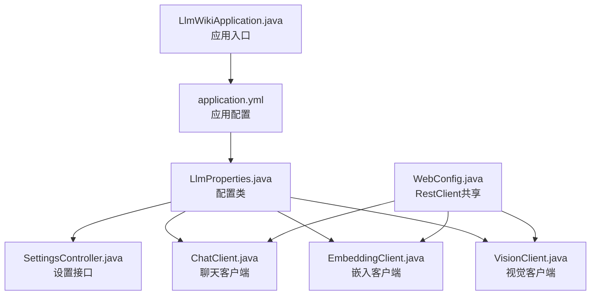
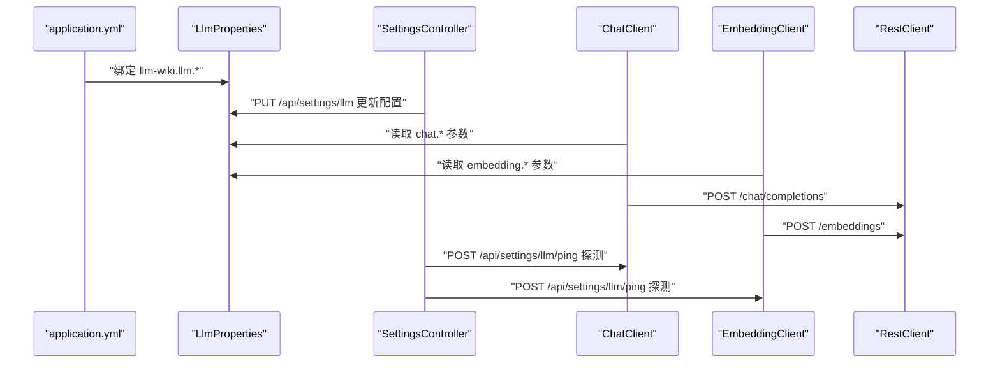
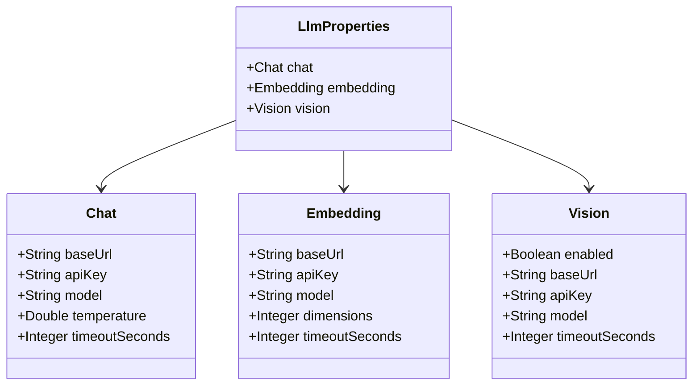
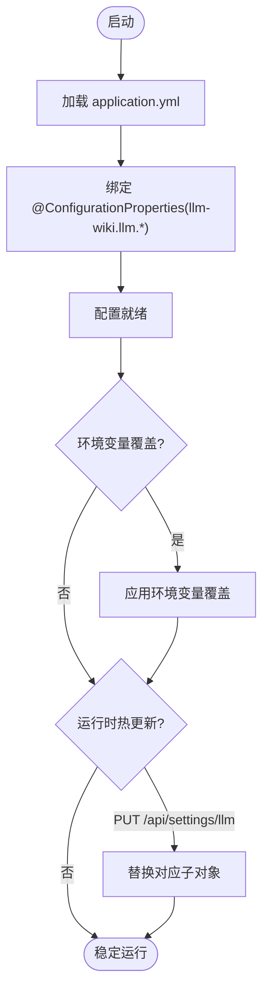
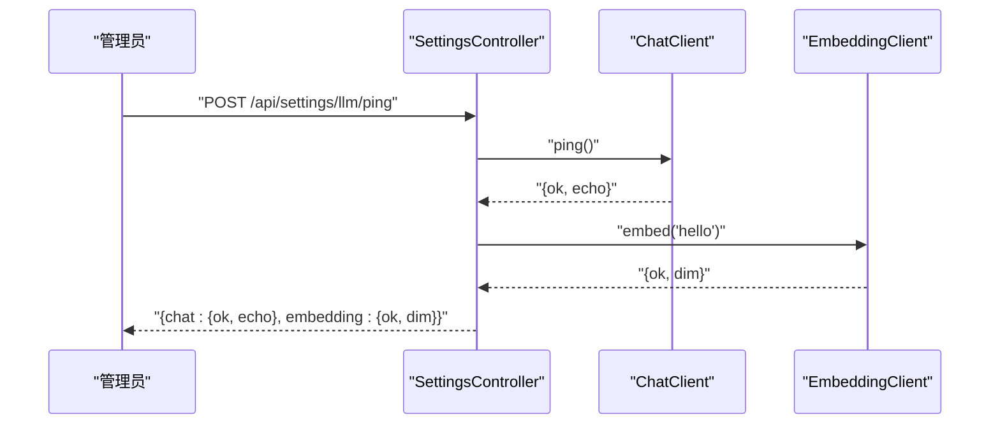
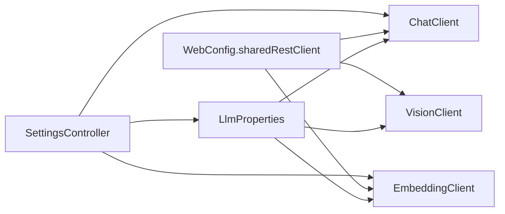

# LLM配置管理

<cite>
**本文引用的文件**
- [LlmProperties.java](file://src/main/java/com/example/llmwiki/config/LlmProperties.java)
- [application.yml](file://src/main/resources/application.yml)
- [SettingsController.java](file://src/main/java/com/example/llmwiki/api/SettingsController.java)
- [ChatClient.java](file://src/main/java/com/example/llmwiki/llm/ChatClient.java)
- [EmbeddingClient.java](file://src/main/java/com/example/llmwiki/llm/EmbeddingClient.java)
- [VisionClient.java](file://src/main/java/com/example/llmwiki/llm/VisionClient.java)
- [LlmException.java](file://src/main/java/com/example/llmwiki/llm/LlmException.java)
- [WebConfig.java](file://src/main/java/com/example/llmwiki/config/WebConfig.java)
- [LlmWikiApplication.java](file://src/main/java/com/example/llmwiki/LlmWikiApplication.java)
</cite>

## 目录
1. [简介](#简介)
2. [项目结构](#项目结构)
3. [核心组件](#核心组件)
4. [架构总览](#架构总览)
5. [详细组件分析](#详细组件分析)
6. [依赖分析](#依赖分析)
7. [性能考虑](#性能考虑)
8. [故障排查指南](#故障排查指南)
9. [结论](#结论)
10. [附录](#附录)

## 简介
本文件面向“LLM Wiki LLM配置管理”的技术文档，围绕 LlmProperties 配置类展开，系统说明其设计与实现：配置类结构、嵌套配置项、默认值设置；chat/embedding/vision 三类配置的含义与参数；配置加载机制（application.yml 解析、环境变量覆盖、运行时热更新）；配置验证策略（必填校验、格式校验、连通性测试）；以及最佳实践与迁移指南。文档同时给出与之配套的客户端实现与健康探测接口，帮助读者从“配置—调用—验证”全链路理解系统。

## 项目结构
本项目采用 Spring Boot 标准分层组织，配置管理位于 config 包，LLM 客户端位于 llm 包，设置接口位于 api 包，资源文件位于 resources 目录。下图展示与配置管理直接相关的模块与文件：

**图表来源**
- [application.yml:31-57](file://src/main/resources/application.yml#L31-L57)
- [LlmProperties.java:16-61](file://src/main/java/com/example/llmwiki/config/LlmProperties.java#L16-L61)
- [SettingsController.java:24-70](file://src/main/java/com/example/llmwiki/api/SettingsController.java#L24-L70)
- [ChatClient.java:25-107](file://src/main/java/com/example/llmwiki/llm/ChatClient.java#L25-L107)
- [EmbeddingClient.java:22-89](file://src/main/java/com/example/llmwiki/llm/EmbeddingClient.java#L22-L89)
- [VisionClient.java:22-94](file://src/main/java/com/example/llmwiki/llm/VisionClient.java#L22-L94)
- [WebConfig.java:15-34](file://src/main/java/com/example/llmwiki/config/WebConfig.java#L15-L34)
- [LlmWikiApplication.java:19-28](file://src/main/java/com/example/llmwiki/LlmWikiApplication.java#L19-L28)

**章节来源**
- [application.yml:1-84](file://src/main/resources/application.yml#L1-L84)
- [LlmProperties.java:1-63](file://src/main/java/com/example/llmwiki/config/LlmProperties.java#L1-L63)
- [WebConfig.java:1-35](file://src/main/java/com/example/llmwiki/config/WebConfig.java#L1-L35)

## 核心组件
- LlmProperties：集中定义 llm-wiki.llm 前缀下的配置，包含 chat、embedding、vision 三组子配置，并提供默认值。
- SettingsController：提供 /api/settings/llm 的 GET/PUT/PING 接口，支持读取、更新与健康探测。
- ChatClient/EmbeddingClient/VisionClient：基于 LlmProperties 进行实际调用，内置基础校验与错误包装。
- WebConfig：提供共享 RestClient，供各客户端复用。
- LlmException：统一的 LLM 调用异常类型。

**章节来源**
- [LlmProperties.java:16-61](file://src/main/java/com/example/llmwiki/config/LlmProperties.java#L16-L61)
- [SettingsController.java:24-70](file://src/main/java/com/example/llmwiki/api/SettingsController.java#L24-L70)
- [ChatClient.java:25-107](file://src/main/java/com/example/llmwiki/llm/ChatClient.java#L25-L107)
- [EmbeddingClient.java:22-89](file://src/main/java/com/example/llmwiki/llm/EmbeddingClient.java#L22-L89)
- [VisionClient.java:22-94](file://src/main/java/com/example/llmwiki/llm/VisionClient.java#L22-L94)
- [WebConfig.java:15-34](file://src/main/java/com/example/llmwiki/config/WebConfig.java#L15-L34)
- [LlmException.java:1-19](file://src/main/java/com/example/llmwiki/llm/LlmException.java#L1-L19)

## 架构总览
下图展示配置在系统中的流转：application.yml 提供初始配置，LlmProperties 通过 @ConfigurationProperties 绑定；运行时 SettingsController 可热更新；客户端通过共享 RestClient 与 LlmProperties 发起请求；健康探测接口对 chat 与 embedding 进行连通性测试。

**图表来源**
- [application.yml:31-57](file://src/main/resources/application.yml#L31-L57)
- [LlmProperties.java:16-61](file://src/main/java/com/example/llmwiki/config/LlmProperties.java#L16-L61)
- [SettingsController.java:34-69](file://src/main/java/com/example/llmwiki/api/SettingsController.java#L34-L69)
- [ChatClient.java:37-86](file://src/main/java/com/example/llmwiki/llm/ChatClient.java#L37-L86)
- [EmbeddingClient.java:34-81](file://src/main/java/com/example/llmwiki/llm/EmbeddingClient.java#L34-L81)
- [WebConfig.java:30-33](file://src/main/java/com/example/llmwiki/config/WebConfig.java#L30-L33)

## 详细组件分析

### LlmProperties 设计与配置项
- 结构与前缀
  - 使用 @ConfigurationProperties(prefix = "llm-wiki.llm") 将配置绑定到 llm-wiki.llm.* 命名空间。
  - 支持运行时通过 SettingsController 热更新，属性具备 setter 以便替换。
- 嵌套配置
  - chat：聊天模型配置，含 baseUrl、apiKey、model、temperature、timeoutSeconds。
  - embedding：嵌入模型配置，含 baseUrl、apiKey、model、dimensions、timeoutSeconds。
  - vision：视觉模型配置（可选），含 enabled、baseUrl、apiKey、model、timeoutSeconds。
- 默认值
  - chat：baseUrl 默认 OpenAI 兼容地址，model 默认 gpt-4o-mini，temperature 默认 0.2，timeoutSeconds 默认 120。
  - embedding：baseUrl 默认 OpenAI 兼容地址，model 默认 text-embedding-3-small，dimensions 默认 1536，timeoutSeconds 默认 60。
  - vision：enabled 默认关闭，其余与 chat 类似。

**图表来源**
- [LlmProperties.java:16-61](file://src/main/java/com/example/llmwiki/config/LlmProperties.java#L16-L61)

**章节来源**
- [LlmProperties.java:16-61](file://src/main/java/com/example/llmwiki/config/LlmProperties.java#L16-L61)
- [application.yml:39-57](file://src/main/resources/application.yml#L39-L57)

### 配置加载机制
- application.yml 解析
  - 在 resources/application.yml 中以 llm-wiki.llm.* 的键树形式提供初始配置，包括 chat、embedding、vision 的各项参数。
- 环境变量覆盖
  - Spring Boot 支持通过环境变量或命令行参数覆盖 application.yml 中的值，例如通过 llm-wiki.llm.chat.base-url 等键进行覆盖。
- 运行时配置更新
  - SettingsController 提供 PUT /api/settings/llm 接口，接收 LlmProperties 的部分字段，逐个替换对应子对象，实现热更新。

**图表来源**
- [application.yml:31-57](file://src/main/resources/application.yml#L31-L57)
- [LlmProperties.java:16-61](file://src/main/java/com/example/llmwiki/config/LlmProperties.java#L16-L61)
- [SettingsController.java:39-51](file://src/main/java/com/example/llmwiki/api/SettingsController.java#L39-L51)

**章节来源**
- [application.yml:31-57](file://src/main/resources/application.yml#L31-L57)
- [SettingsController.java:34-51](file://src/main/java/com/example/llmwiki/api/SettingsController.java#L34-L51)

### 配置验证与健康探测
- 必填字段检查
  - ChatClient/EmbeddingClient 在发起请求前会检查 apiKey 是否为空，若为空则抛出 LlmException。
  - VisionClient 仅在 vision.enabled 且 apiKey 非空时启用。
- 格式验证
  - 配置文件中对字段类型（字符串、整数、浮点）进行约束；客户端在构造请求体时严格按 OpenAI 兼容协议格式发送。
- 连通性测试
  - SettingsController 提供 POST /api/settings/llm/ping，内部分别调用 ChatClient.ping 与 EmbeddingClient.embed，返回 chat/embedding 的可用性与维度信息。

**图表来源**
- [SettingsController.java:53-69](file://src/main/java/com/example/llmwiki/api/SettingsController.java#L53-L69)
- [ChatClient.java:91-93](file://src/main/java/com/example/llmwiki/llm/ChatClient.java#L91-L93)
- [EmbeddingClient.java:34-37](file://src/main/java/com/example/llmwiki/llm/EmbeddingClient.java#L34-L37)

**章节来源**
- [ChatClient.java:52-54](file://src/main/java/com/example/llmwiki/llm/ChatClient.java#L52-L54)
- [EmbeddingClient.java:44-46](file://src/main/java/com/example/llmwiki/llm/EmbeddingClient.java#L44-L46)
- [VisionClient.java:34-38](file://src/main/java/com/example/llmwiki/llm/VisionClient.java#L34-L38)
- [SettingsController.java:53-69](file://src/main/java/com/example/llmwiki/api/SettingsController.java#L53-L69)
- [LlmException.java:1-19](file://src/main/java/com/example/llmwiki/llm/LlmException.java#L1-L19)

### 配置最佳实践
- 安全存储
  - API Key 不应在代码仓库中明文存放，优先通过环境变量或外部机密管理服务注入。
- 环境隔离
  - 不同环境（开发/测试/生产）使用不同的 llm-wiki.llm.* 配置，避免相互污染。
- 版本管理
  - 对 application.yml 做版本控制，新增字段建议保留默认值，确保向后兼容。
- 性能与稳定性
  - 合理设置 timeoutSeconds，避免长连接阻塞；根据供应商能力调整 temperature 与 dimensions。
- 可观测性
  - 通过 /api/settings/llm/ping 定期健康探测，结合日志级别定位问题。

[本节为通用指导，无需特定文件引用]

### 配置示例与模板
- OpenAI 兼容模板（基于默认值）
  - chat：baseUrl 指向 OpenAI 兼容网关，model 使用 gpt-4o-mini，temperature 0.2，timeoutSeconds 120。
  - embedding：baseUrl 指向 OpenAI 兼容网关，model 使用 text-embedding-3-small，dimensions 1536，timeoutSeconds 60。
  - vision：enabled 关闭，开启后与 chat 类似。
- 其他供应商适配
  - 将 baseUrl 指向供应商网关（如 DeepSeek/Kimi/通义/智谱/Ollama/vLLM 等），model 与 dimensions 需与供应商文档一致。
- 性能调优参数
  - temperature：0.2 适合确定性任务；0.7 适合创意任务。
  - dimensions：与所选 embedding 模型一致（如 1536）。
  - timeoutSeconds：网络波动大时适当增大。
- 故障排查配置
  - 通过 /api/settings/llm/ping 查看 chat 与 embedding 的可用性；若失败，检查 apiKey、baseUrl 与网络连通性。

[本节为概念性示例，不直接分析具体文件]

### 配置迁移指南
- 版本升级
  - 新增字段时保留默认值，避免破坏旧配置；删除字段前提供迁移脚本或兼容层。
- 配置变更
  - 若供应商切换，同步修改 baseUrl 与 model/dimensions；必要时调整 temperature。
- 兼容性处理
  - 保持 llm-wiki.llm.* 前缀不变；若需拆分命名空间，提供映射与迁移工具。
- 热更新注意事项
  - 更新后立即执行 /api/settings/llm/ping 验证；若失败回滚至上一个稳定配置。

[本节为通用指导，无需特定文件引用]

## 依赖分析
- 组件耦合
  - LlmProperties 为纯数据载体，被 ChatClient/EmbeddingClient/VisionClient 读取，彼此低耦合。
  - SettingsController 仅负责配置读写与健康探测，不参与业务逻辑。
- 外部依赖
  - RestClient 由 WebConfig 提供，所有客户端共享，减少连接开销。
- 错误传播
  - 客户端在异常时抛出 LlmException，由 SettingsController 捕获并返回结构化错误信息。

**图表来源**
- [LlmProperties.java:16-61](file://src/main/java/com/example/llmwiki/config/LlmProperties.java#L16-L61)
- [ChatClient.java:25-32](file://src/main/java/com/example/llmwiki/llm/ChatClient.java#L25-L32)
- [EmbeddingClient.java:22-29](file://src/main/java/com/example/llmwiki/llm/EmbeddingClient.java#L22-L29)
- [VisionClient.java:22-29](file://src/main/java/com/example/llmwiki/llm/VisionClient.java#L22-L29)
- [WebConfig.java:30-33](file://src/main/java/com/example/llmwiki/config/WebConfig.java#L30-L33)
- [SettingsController.java:24-32](file://src/main/java/com/example/llmwiki/api/SettingsController.java#L24-L32)

**章节来源**
- [WebConfig.java:30-33](file://src/main/java/com/example/llmwiki/config/WebConfig.java#L30-L33)
- [LlmException.java:1-19](file://src/main/java/com/example/llmwiki/llm/LlmException.java#L1-L19)

## 性能考虑
- 连接复用
  - 通过共享 RestClient 减少 TCP/TLS 握手与连接池开销。
- 超时与重试
  - 为不同供应商设定合理 timeoutSeconds；对外部依赖增加指数退避重试策略（建议在上层封装）。
- 批量与并发
  - embedding 支持批量输入，建议合并请求以提升吞吐；注意供应商限流与 QPS。
- 日志与监控
  - 为关键路径添加埋点与指标采集，结合健康探测接口进行自动化巡检。

[本节为通用指导，无需特定文件引用]

## 故障排查指南
- 常见问题
  - API Key 未配置：ChatClient/EmbeddingClient 会在调用前校验，抛出 LlmException。
  - vision 未启用：当 vision.enabled 为 false 或 apiKey 为空时，VisionClient 直接返回空串。
  - 健康探测失败：通过 /api/settings/llm/ping 查看 chat 与 embedding 的 ok/error 字段。
- 排查步骤
  - 确认 application.yml 与环境变量覆盖是否生效。
  - 使用 /api/settings/llm 获取当前配置，核对 baseUrl/model/dimensions/timeoutSeconds。
  - 检查网络连通性与供应商侧配额/限流。
  - 查看日志级别与异常堆栈，定位具体调用失败点。

**章节来源**
- [ChatClient.java:52-54](file://src/main/java/com/example/llmwiki/llm/ChatClient.java#L52-L54)
- [EmbeddingClient.java:44-46](file://src/main/java/com/example/llmwiki/llm/EmbeddingClient.java#L44-L46)
- [VisionClient.java:48-50](file://src/main/java/com/example/llmwiki/llm/VisionClient.java#L48-L50)
- [SettingsController.java:53-69](file://src/main/java/com/example/llmwiki/api/SettingsController.java#L53-L69)

## 结论
LlmProperties 以清晰的三层嵌套结构承载了 chat、embedding、vision 的核心配置，并通过 @ConfigurationProperties 与运行时热更新实现了灵活的配置管理。配合 SettingsController 的健康探测与客户端的必填校验，系统在易用性与可靠性之间取得平衡。建议在生产环境中结合环境变量与外部机密管理、严格的版本与迁移策略，确保配置的安全与稳定演进。

[本节为总结性内容，无需特定文件引用]

## 附录
- 关键配置键参考（基于 application.yml）
  - llm-wiki.llm.chat.base-url、llm-wiki.llm.chat.api-key、llm-wiki.llm.chat.model、llm-wiki.llm.chat.temperature、llm-wiki.llm.chat.timeout-seconds
  - llm-wiki.llm.embedding.base-url、llm-wiki.llm.embedding.api-key、llm-wiki.llm.embedding.model、llm-wiki.llm.embedding.dimensions、llm-wiki.llm.embedding.timeout-seconds
  - llm-wiki.llm.vision.enabled、llm-wiki.llm.vision.base-url、llm-wiki.llm.vision.api-key、llm-wiki.llm.vision.model、llm-wiki.llm.vision.timeout-seconds

**章节来源**
- [application.yml:39-57](file://src/main/resources/application.yml#L39-L57)