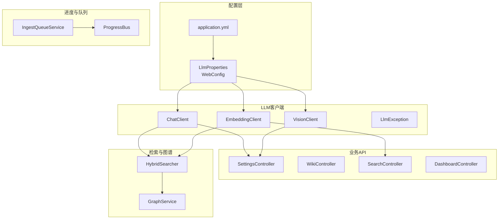
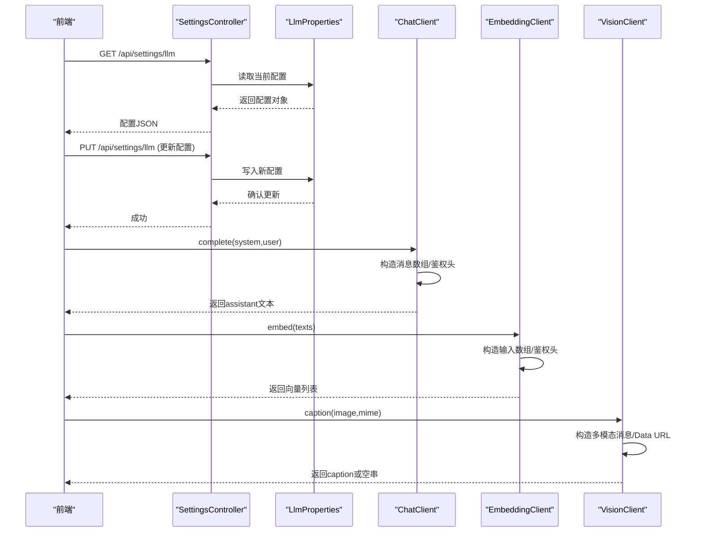
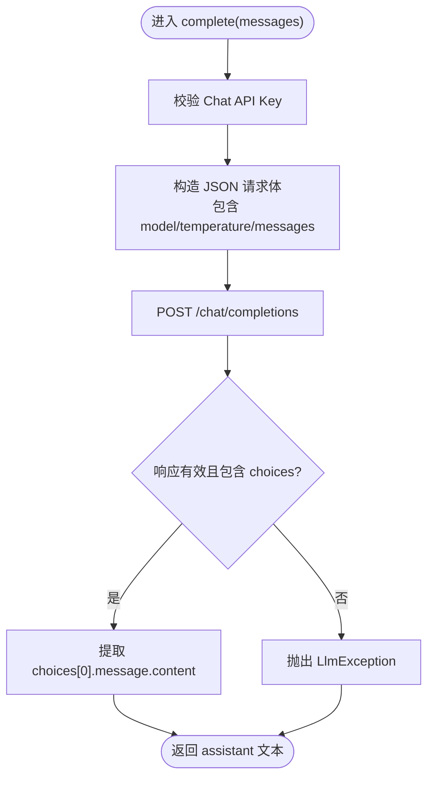
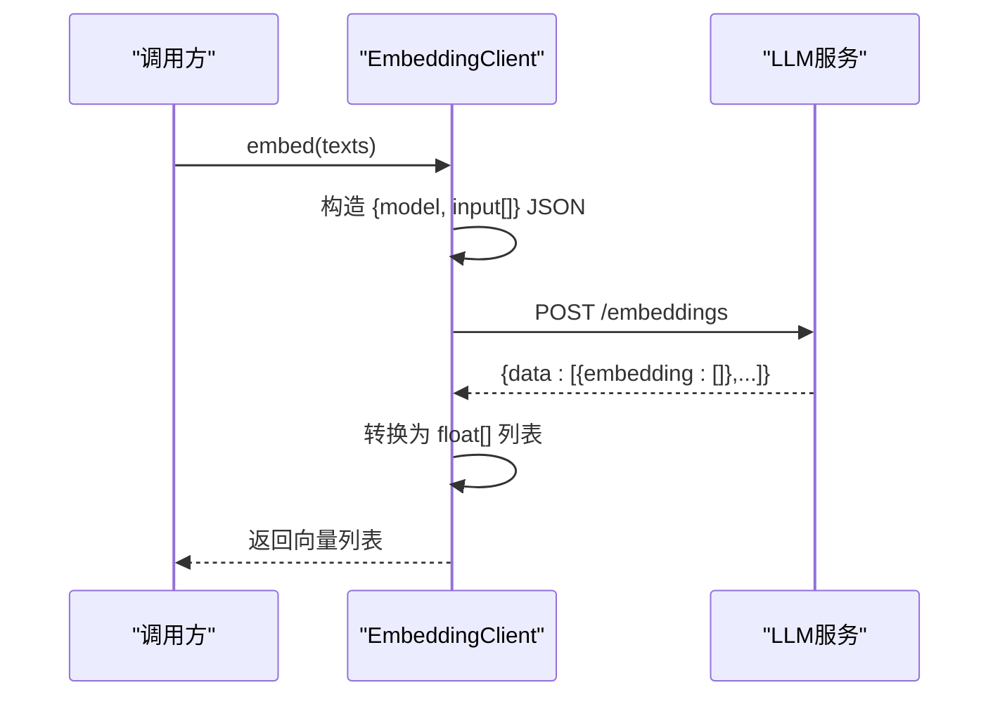
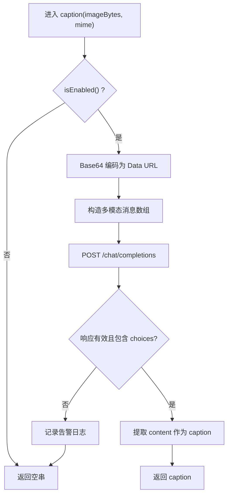
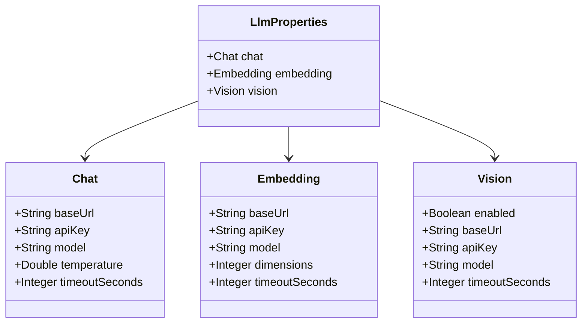
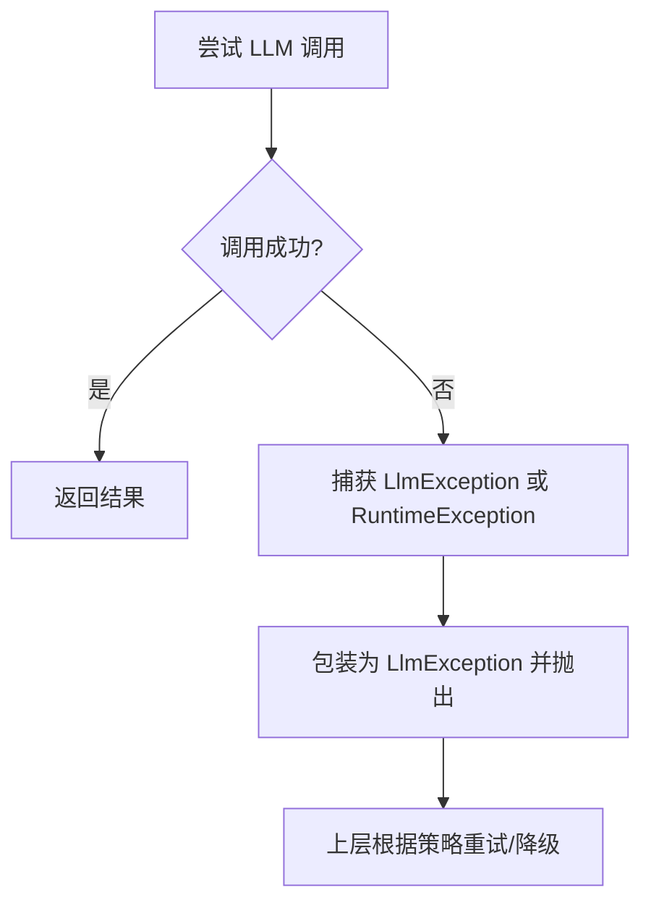
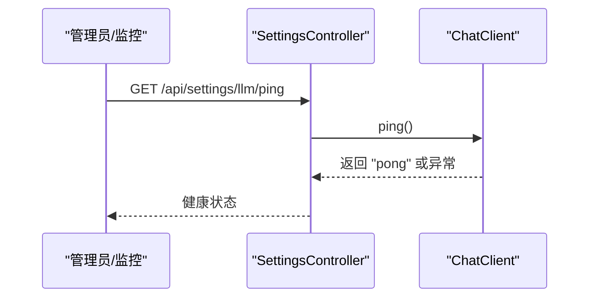
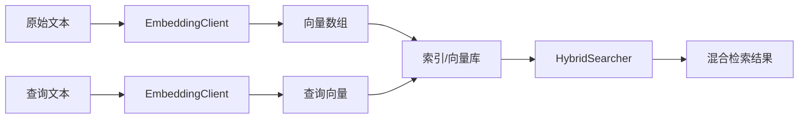
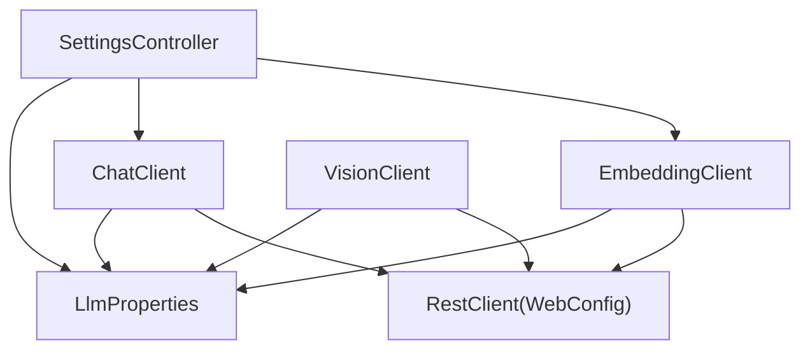

# LLM集成系统

<cite>
**本文引用的文件**
- [ChatClient.java](file://src/main/java/com/example/llmwiki/llm/ChatClient.java)
- [EmbeddingClient.java](file://src/main/java/com/example/llmwiki/llm/EmbeddingClient.java)
- [VisionClient.java](file://src/main/java/com/example/llmwiki/llm/VisionClient.java)
- [LlmException.java](file://src/main/java/com/example/llmwiki/llm/LlmException.java)
- [LlmProperties.java](file://src/main/java/com/example/llmwiki/config/LlmProperties.java)
- [WebConfig.java](file://src/main/java/com/example/llmwiki/config/WebConfig.java)
- [application.yml](file://src/main/resources/application.yml)
- [SettingsController.java](file://src/main/java/com/example/llmwiki/api/SettingsController.java)
- [SearchController.java](file://src/main/java/com/example/llmwiki/api/SearchController.java)
- [WikiController.java](file://src/main/java/com/example/llmwiki/api/WikiController.java)
- [DashboardController.java](file://src/main/java/com/example/llmwiki/api/DashboardController.java)
- [GapAnalyzer.java](file://src/main/java/com/example/llmwiki/insight/GapAnalyzer.java)
- [IngestQueueService.java](file://src/main/java/com/example/llmwiki/queue/IngestQueueService.java)
- [ProgressBus.java](file://src/main/java/com/example/llmwiki/progress/ProgressBus.java)
- [GraphService.java](file://src/main/java/com/example/llmwiki/graph/GraphService.java)
</cite>

## 目录
1. [简介](#简介)
2. [项目结构](#项目结构)
3. [核心组件](#核心组件)
4. [架构总览](#架构总览)
5. [详细组件分析](#详细组件分析)
6. [依赖分析](#依赖分析)
7. [性能考虑](#性能考虑)
8. [故障排查指南](#故障排查指南)
9. [结论](#结论)
10. [附录](#附录)

## 简介
本文件面向“LLM Wiki LLM集成系统”，聚焦以下目标：
- 深入解释ChatClient的实现：多轮对话管理、上下文保持、消息历史处理、API调用封装
- 详细描述EmbeddingClient的功能：文本向量化、嵌入向量生成、向量存储、相似度计算
- 阐述VisionClient的特性：图片内容理解、视觉问答、图像描述生成
- 解释LLM配置管理：LlmProperties的参数设置、API密钥管理、模型选择
- 包含异常处理机制：LlmException的分类处理、重试策略、降级方案
- 提供性能优化策略：批量处理、缓存机制、并发控制
- 解释健康检查：LLM服务可用性检测、超时处理、故障转移
- 包含安全考虑：API密钥保护、请求限制、数据隐私

## 项目结构
后端采用Spring Boot工程，核心模块围绕LLM客户端、配置、API控制器、检索与图谱等展开。前端位于web目录，通过HTTP接口与后端交互。

**图表来源**
- [LlmProperties.java:16-62](file://src/main/java/com/example/llmwiki/config/LlmProperties.java#L16-L62)
- [WebConfig.java:15-34](file://src/main/java/com/example/llmwiki/config/WebConfig.java#L15-L34)
- [ChatClient.java:25-107](file://src/main/java/com/example/llmwiki/llm/ChatClient.java#L25-L107)
- [EmbeddingClient.java:25-89](file://src/main/java/com/example/llmwiki/llm/EmbeddingClient.java#L25-L89)
- [VisionClient.java:25-94](file://src/main/java/com/example/llmwiki/llm/VisionClient.java#L25-L94)
- [SettingsController.java:24-43](file://src/main/java/com/example/llmwiki/api/SettingsController.java#L24-L43)
- [SearchController.java:18-31](file://src/main/java/com/example/llmwiki/api/SearchController.java#L18-L31)
- [WikiController.java:22-50](file://src/main/java/com/example/llmwiki/api/WikiController.java#L22-L50)
- [DashboardController.java:22-47](file://src/main/java/com/example/llmwiki/api/DashboardController.java#L22-L47)
- [GraphService.java:42-75](file://src/main/java/com/example/llmwiki/graph/GraphService.java#L42-L75)
- [ProgressBus.java:17-59](file://src/main/java/com/example/llmwiki/progress/ProgressBus.java#L17-L59)
- [IngestQueueService.java:34-181](file://src/main/java/com/example/llmwiki/queue/IngestQueueService.java#L34-L181)

**章节来源**
- [application.yml:1-84](file://src/main/resources/application.yml#L1-L84)
- [WebConfig.java:15-34](file://src/main/java/com/example/llmwiki/config/WebConfig.java#L15-L34)

## 核心组件
- ChatClient：封装OpenAI兼容的聊天补全接口，支持单轮与多轮对话，负责消息序列构造、认证头注入、响应解析与错误包装。
- EmbeddingClient：封装OpenAI兼容的嵌入接口，支持单条与批量文本向量化，负责输入序列构造、响应解析与向量数组转换。
- VisionClient：封装多模态视觉理解接口，支持图片字节转Data URL、消息内容构造、caption生成，并具备启用开关与降级返回空串的能力。
- LlmProperties：集中管理Chat/Embedding/Vision三类配置，包括baseUrl、apiKey、model、temperature、dimensions、timeoutSeconds等，支持热更新。
- WebConfig：提供共享RestClient与跨域配置，供LLM客户端与网页解析器复用。
- SettingsController：提供读取与更新LLM配置的REST接口，支持健康检查探测。

**章节来源**
- [ChatClient.java:25-107](file://src/main/java/com/example/llmwiki/llm/ChatClient.java#L25-L107)
- [EmbeddingClient.java:25-89](file://src/main/java/com/example/llmwiki/llm/EmbeddingClient.java#L25-L89)
- [VisionClient.java:25-94](file://src/main/java/com/example/llmwiki/llm/VisionClient.java#L25-L94)
- [LlmProperties.java:16-62](file://src/main/java/com/example/llmwiki/config/LlmProperties.java#L16-L62)
- [WebConfig.java:15-34](file://src/main/java/com/example/llmwiki/config/WebConfig.java#L15-L34)
- [SettingsController.java:24-43](file://src/main/java/com/example/llmwiki/api/SettingsController.java#L24-L43)

## 架构总览
系统以配置驱动的LLM客户端为核心，通过API控制器对外提供能力；检索与图谱模块基于嵌入向量与文本索引协同工作；队列与进度总线保障后台任务的可靠执行与实时反馈。

**图表来源**
- [SettingsController.java:34-43](file://src/main/java/com/example/llmwiki/api/SettingsController.java#L34-L43)
- [LlmProperties.java:16-62](file://src/main/java/com/example/llmwiki/config/LlmProperties.java#L16-L62)
- [ChatClient.java:34-86](file://src/main/java/com/example/llmwiki/llm/ChatClient.java#L34-L86)
- [EmbeddingClient.java:34-81](file://src/main/java/com/example/llmwiki/llm/EmbeddingClient.java#L34-L81)
- [VisionClient.java:40-86](file://src/main/java/com/example/llmwiki/llm/VisionClient.java#L40-L86)

## 详细组件分析

### ChatClient：多轮对话与上下文管理
- 多轮对话管理
  - 支持传入消息序列，每条消息包含role与content，最终拼装为OpenAI兼容的messages数组。
  - 通过统一的complete方法实现单轮与多轮调用，内部自动拼接"/chat/completions"路径并注入Authorization头。
- 上下文保持
  - 调用方负责组织消息历史，ChatClient不保存任何会话状态，确保无状态设计。
- 消息历史处理
  - 通过Message记录类承载单条消息，便于在上层逻辑中构建与维护历史。
- API调用封装
  - 使用共享RestClient发起POST请求，解析JSON响应中的choices[0].message.content作为输出。
  - 对空响应进行显式校验与异常抛出，保证调用链健壮性。
- 健康检查
  - 提供ping方法，使用极短提示词进行连通性探测。

**图表来源**
- [ChatClient.java:34-86](file://src/main/java/com/example/llmwiki/llm/ChatClient.java#L34-L86)

**章节来源**
- [ChatClient.java:25-107](file://src/main/java/com/example/llmwiki/llm/ChatClient.java#L25-L107)

### EmbeddingClient：文本向量化与批量处理
- 功能概述
  - 支持单条与批量文本向量化，返回float[]或List<float[]>。
  - 自动构造OpenAI兼容的/embeddings请求体，包含model与input数组。
- 数据流
  - 输入文本列表被映射为JSON数组，发送至LLM服务，解析"data"数组中的"embedding"字段为float[]。
- 错误处理
  - 对空响应与异常进行捕获与包装，避免上层崩溃。

**图表来源**
- [EmbeddingClient.java:34-81](file://src/main/java/com/example/llmwiki/llm/EmbeddingClient.java#L34-L81)

**章节来源**
- [EmbeddingClient.java:25-89](file://src/main/java/com/example/llmwiki/llm/EmbeddingClient.java#L25-L89)

### VisionClient：图片理解与降级策略
- 特性
  - 通过isEnabled判断是否启用；启用条件包括：配置开启且apiKey非空。
  - 将图片字节编码为Data URL，构造多模态消息（text与image_url），调用/chat/completions生成caption。
- 降级策略
  - 调用失败时记录告警日志并返回空串，避免影响主流程。

**图表来源**
- [VisionClient.java:31-86](file://src/main/java/com/example/llmwiki/llm/VisionClient.java#L31-L86)

**章节来源**
- [VisionClient.java:25-94](file://src/main/java/com/example/llmwiki/llm/VisionClient.java#L25-L94)

### LlmProperties：配置管理与热更新
- 结构
  - Chat/Embedding/Vision三段配置，均包含baseUrl、apiKey、model、timeoutSeconds等字段。
  - Embedding额外包含dimensions字段，用于与远端模型维度保持一致。
- 热更新
  - SettingsController提供PUT /api/settings/llm接口，允许运行时更新配置并立即生效。

**图表来源**
- [LlmProperties.java:16-62](file://src/main/java/com/example/llmwiki/config/LlmProperties.java#L16-L62)

**章节来源**
- [LlmProperties.java:16-62](file://src/main/java/com/example/llmwiki/config/LlmProperties.java#L16-L62)
- [SettingsController.java:34-43](file://src/main/java/com/example/llmwiki/api/SettingsController.java#L34-L43)
- [application.yml:31-57](file://src/main/resources/application.yml#L31-L57)

### 异常处理机制：LlmException与重试策略
- LlmException
  - 统一的运行时异常基类，ChatClient与EmbeddingClient在调用失败时抛出，便于上层捕获与处理。
- 重试策略
  - 当前LLM客户端未内置重试逻辑；可在上层业务处结合任务队列与幂等设计实现重试。
- 降级方案
  - VisionClient在调用失败时返回空串，避免阻断主流程；可结合业务策略进行二次兜底。

**图表来源**
- [ChatClient.java:76-85](file://src/main/java/com/example/llmwiki/llm/ChatClient.java#L76-L85)
- [EmbeddingClient.java:63-80](file://src/main/java/com/example/llmwiki/llm/EmbeddingClient.java#L63-L80)
- [LlmException.java:9-18](file://src/main/java/com/example/llmwiki/llm/LlmException.java#L9-L18)

**章节来源**
- [LlmException.java:9-18](file://src/main/java/com/example/llmwiki/llm/LlmException.java#L9-L18)
- [ChatClient.java:76-85](file://src/main/java/com/example/llmwiki/llm/ChatClient.java#L76-L85)
- [EmbeddingClient.java:63-80](file://src/main/java/com/example/llmwiki/llm/EmbeddingClient.java#L63-L80)
- [VisionClient.java:82-85](file://src/main/java/com/example/llmwiki/llm/VisionClient.java#L82-L85)

### 健康检查：可用性检测与超时处理
- 健康检查
  - ChatClient提供ping方法，使用极短提示词进行连通性探测，适合在SettingsController中暴露为健康端点。
- 超时处理
  - LlmProperties为各模块提供timeoutSeconds配置项；当前RestClient未显式设置超时，可在WebConfig中扩展全局超时配置。
- 故障转移
  - 当前未实现多供应商自动切换；可通过在上层封装多客户端与熔断策略实现。

**图表来源**
- [ChatClient.java:88-93](file://src/main/java/com/example/llmwiki/llm/ChatClient.java#L88-L93)
- [SettingsController.java:34-43](file://src/main/java/com/example/llmwiki/api/SettingsController.java#L34-L43)

**章节来源**
- [ChatClient.java:88-93](file://src/main/java/com/example/llmwiki/llm/ChatClient.java#L88-L93)
- [LlmProperties.java:30-61](file://src/main/java/com/example/llmwiki/config/LlmProperties.java#L30-L61)
- [SettingsController.java:34-43](file://src/main/java/com/example/llmwiki/api/SettingsController.java#L34-L43)

### 检索与相似度计算：向量存储与混合搜索
- 向量存储
  - EmbeddingClient生成的float[]向量通常与索引系统（如Lucene）配合使用；系统中存在HybridSearcher与LuceneIndexer，用于BM25与向量的混合检索。
- 相似度计算
  - 向量相似度通常由外部索引库提供（例如基于余弦相似度的向量检索），系统通过HybridSearcher整合文本与向量检索结果。

**图表来源**
- [EmbeddingClient.java:34-81](file://src/main/java/com/example/llmwiki/llm/EmbeddingClient.java#L34-L81)
- [SearchController.java:18-31](file://src/main/java/com/example/llmwiki/api/SearchController.java#L18-L31)
- [GraphService.java:42-75](file://src/main/java/com/example/llmwiki/graph/GraphService.java#L42-L75)

**章节来源**
- [EmbeddingClient.java:25-89](file://src/main/java/com/example/llmwiki/llm/EmbeddingClient.java#L25-L89)
- [SearchController.java:18-31](file://src/main/java/com/example/llmwiki/api/SearchController.java#L18-L31)
- [GraphService.java:42-75](file://src/main/java/com/example/llmwiki/graph/GraphService.java#L42-L75)

### 安全考虑：API密钥保护、请求限制与数据隐私
- API密钥保护
  - LlmProperties与application.yml中存储apiKey；建议在生产环境通过环境变量或密钥管理服务注入，避免硬编码。
- 请求限制
  - 可在Web层增加限流策略（如基于IP或用户维度），防止滥用。
- 数据隐私
  - 对上传的图片与文本应遵循最小化原则，必要时进行脱敏处理；日志中避免打印敏感信息。

[本节为通用指导，无需特定文件来源]

## 依赖分析
- 组件耦合
  - ChatClient/EmbeddingClient/VisionClient均依赖LlmProperties与共享RestClient，保持低耦合与高内聚。
- 外部依赖
  - 通过OpenAI兼容接口对接多家LLM供应商；WebConfig提供RestClient与跨域支持。
- 潜在循环依赖
  - 当前未发现循环依赖；各客户端独立，API控制器仅作为配置入口。

**图表来源**
- [ChatClient.java:25-32](file://src/main/java/com/example/llmwiki/llm/ChatClient.java#L25-L32)
- [EmbeddingClient.java:25-29](file://src/main/java/com/example/llmwiki/llm/EmbeddingClient.java#L25-L29)
- [VisionClient.java:25-29](file://src/main/java/com/example/llmwiki/llm/VisionClient.java#L25-L29)
- [LlmProperties.java:16-62](file://src/main/java/com/example/llmwiki/config/LlmProperties.java#L16-L62)
- [WebConfig.java:27-33](file://src/main/java/com/example/llmwiki/config/WebConfig.java#L27-L33)
- [SettingsController.java:24-43](file://src/main/java/com/example/llmwiki/api/SettingsController.java#L24-L43)

**章节来源**
- [WebConfig.java:15-34](file://src/main/java/com/example/llmwiki/config/WebConfig.java#L15-L34)
- [LlmProperties.java:16-62](file://src/main/java/com/example/llmwiki/config/LlmProperties.java#L16-L62)

## 性能考虑
- 批量处理
  - EmbeddingClient支持批量输入，减少网络往返次数；建议在上层聚合文本批次提交。
- 缓存机制
  - 可在应用层缓存热点向量或图片caption，降低重复调用成本；注意缓存失效策略与一致性。
- 并发控制
  - WebConfig提供共享RestClient；建议在上层引入连接池与并发上限控制，避免对LLM服务造成压力。
- 超时与重试
  - 在WebConfig中为RestClient配置合理超时；在上层业务中实现指数退避重试与熔断策略。

[本节为通用指导，无需特定文件来源]

## 故障排查指南
- ChatClient常见问题
  - API Key未配置：触发LlmException；检查Settings页面与application.yml。
  - 响应为空：确认模型与baseUrl正确，查看日志定位网络或服务端异常。
- EmbeddingClient常见问题
  - 返回异常：检查输入格式与模型维度匹配；确认服务端返回结构。
- VisionClient常见问题
  - 启用失败：确认enabled=true且apiKey非空；调用失败返回空串属预期降级行为。
- 健康检查
  - ping失败：优先检查网络连通性与代理设置；核对baseUrl与apiKey。

**章节来源**
- [ChatClient.java:50-85](file://src/main/java/com/example/llmwiki/llm/ChatClient.java#L50-L85)
- [EmbeddingClient.java:42-80](file://src/main/java/com/example/llmwiki/llm/EmbeddingClient.java#L42-L80)
- [VisionClient.java:31-85](file://src/main/java/com/example/llmwiki/llm/VisionClient.java#L31-L85)
- [SettingsController.java:34-43](file://src/main/java/com/example/llmwiki/api/SettingsController.java#L34-L43)

## 结论
本系统以OpenAI兼容接口为核心，通过配置驱动与客户端封装实现了Chat、Embedding与Vision三大能力的统一接入。结合检索与图谱模块，形成从数据摄取到知识可视化的完整链路。建议在生产环境中强化密钥管理、限流与缓存策略，并在上层实现重试与熔断以提升稳定性。

[本节为总结性内容，无需特定文件来源]

## 附录
- API概览
  - 获取/更新LLM配置：GET/PUT /api/settings/llm
  - 搜索：GET /api/search?q=&topK=
  - Wiki页面：GET /api/wiki/pages、/api/wiki/pages/{slug}、/api/wiki/stats
  - 仪表盘：GET /api/dashboard
- 关键实现参考
  - 配置与热更新：[LlmProperties.java:16-62](file://src/main/java/com/example/llmwiki/config/LlmProperties.java#L16-L62)、[SettingsController.java:34-43](file://src/main/java/com/example/llmwiki/api/SettingsController.java#L34-L43)
  - 检索与图谱：[SearchController.java:18-31](file://src/main/java/com/example/llmwiki/api/SearchController.java#L18-L31)、[GraphService.java:42-75](file://src/main/java/com/example/llmwiki/graph/GraphService.java#L42-L75)
  - 队列与进度：[IngestQueueService.java:34-181](file://src/main/java/com/example/llmwiki/queue/IngestQueueService.java#L34-L181)、[ProgressBus.java:17-59](file://src/main/java/com/example/llmwiki/progress/ProgressBus.java#L17-L59)
  - 知识空白分析：[GapAnalyzer.java:106-135](file://src/main/java/com/example/llmwiki/insight/GapAnalyzer.java#L106-L135)

**章节来源**
- [SettingsController.java:34-43](file://src/main/java/com/example/llmwiki/api/SettingsController.java#L34-L43)
- [SearchController.java:18-31](file://src/main/java/com/example/llmwiki/api/SearchController.java#L18-L31)
- [WikiController.java:22-50](file://src/main/java/com/example/llmwiki/api/WikiController.java#L22-L50)
- [DashboardController.java:22-47](file://src/main/java/com/example/llmwiki/api/DashboardController.java#L22-L47)
- [GraphService.java:42-75](file://src/main/java/com/example/llmwiki/graph/GraphService.java#L42-L75)
- [IngestQueueService.java:34-181](file://src/main/java/com/example/llmwiki/queue/IngestQueueService.java#L34-L181)
- [ProgressBus.java:17-59](file://src/main/java/com/example/llmwiki/progress/ProgressBus.java#L17-L59)
- [GapAnalyzer.java:106-135](file://src/main/java/com/example/llmwiki/insight/GapAnalyzer.java#L106-L135)