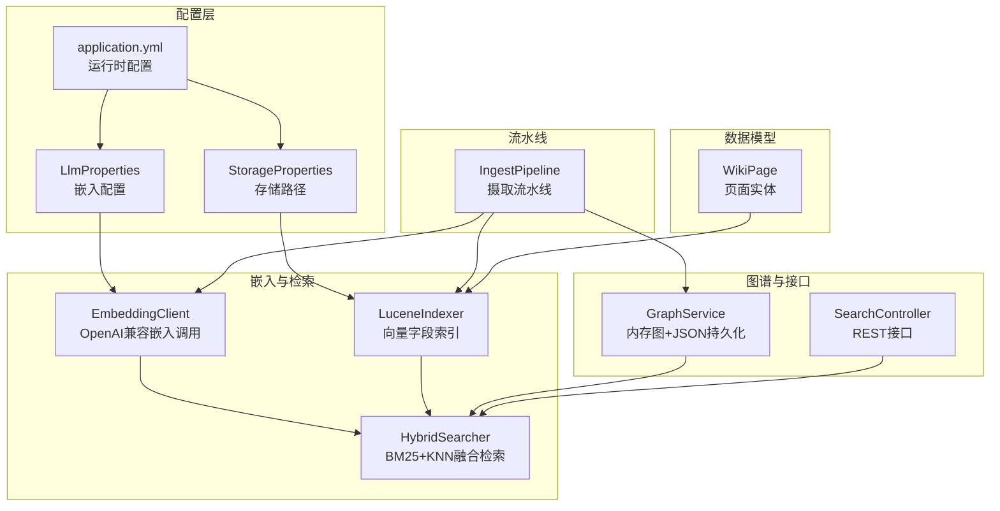
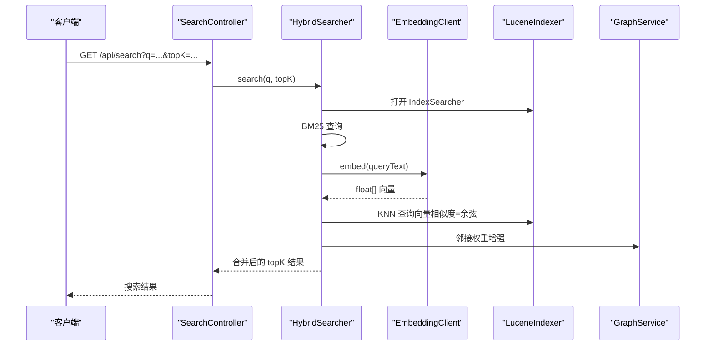
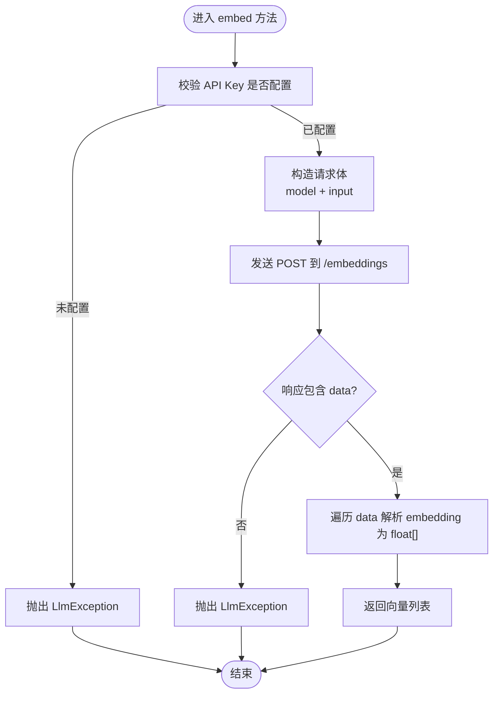
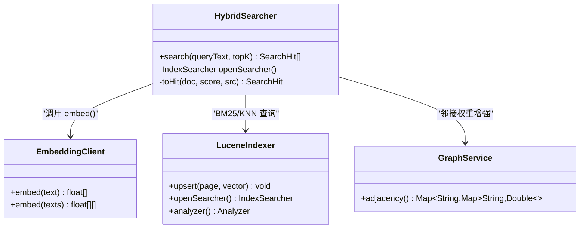
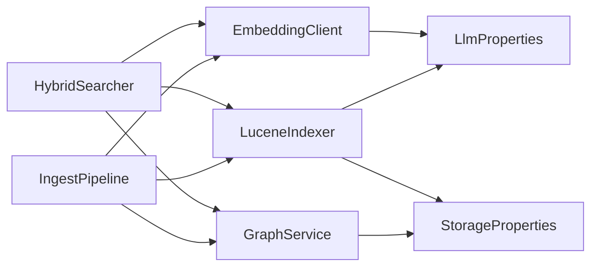

# 嵌入客户端

<cite>
**本文引用的文件列表**
- [EmbeddingClient.java](file://src/main/java/com/example/llmwiki/llm/EmbeddingClient.java)
- [LlmProperties.java](file://src/main/java/com/example/llmwiki/config/LlmProperties.java)
- [application.yml](file://src/main/resources/application.yml)
- [HybridSearcher.java](file://src/main/java/com/example/llmwiki/retrieval/HybridSearcher.java)
- [LuceneIndexer.java](file://src/main/java/com/example/llmwiki/retrieval/LuceneIndexer.java)
- [StorageProperties.java](file://src/main/java/com/example/llmwiki/config/StorageProperties.java)
- [LlmException.java](file://src/main/java/com/example/llmwiki/llm/LlmException.java)
- [WikiPage.java](file://src/main/java/com/example/llmwiki/domain/WikiPage.java)
- [SearchController.java](file://src/main/java/com/example/llmwiki/api/SearchController.java)
- [GraphService.java](file://src/main/java/com/example/llmwiki/graph/GraphService.java)
- [IngestPipeline.java](file://src/main/java/com/example/llmwiki/ingest/IngestPipeline.java)
</cite>

## 目录
1. [简介](#简介)
2. [项目结构](#项目结构)
3. [核心组件](#核心组件)
4. [架构总览](#架构总览)
5. [详细组件分析](#详细组件分析)
6. [依赖关系分析](#依赖关系分析)
7. [性能考量](#性能考量)
8. [故障排查指南](#故障排查指南)
9. [结论](#结论)
10. [附录](#附录)

## 简介
本文件面向“LLM Wiki”项目的嵌入客户端（EmbeddingClient），系统性阐述其在知识库中的作用：文本向量化、嵌入向量生成、向量存储管理，并结合检索与图谱服务说明向量在文档检索、语义匹配、聚类分析与推荐系统中的应用。文档还覆盖配置管理（LlmProperties 中的 embedding 配置）、性能优化策略（批量向量生成、降级策略）以及错误处理与向量存储方案（内存缓存、数据库存储、文件持久化）。

## 项目结构
围绕嵌入客户端的关键模块与文件如下：
- 配置层：LlmProperties、StorageProperties、application.yml
- 业务层：EmbeddingClient、HybridSearcher、LuceneIndexer、GraphService
- 接口层：SearchController
- 数据模型：WikiPage
- 流水线：IngestPipeline（包含向量生成与索引）

图表来源
- [EmbeddingClient.java:25-89](file://src/main/java/com/example/llmwiki/llm/EmbeddingClient.java#L25-L89)
- [LlmProperties.java:44-52](file://src/main/java/com/example/llmwiki/config/LlmProperties.java#L44-L52)
- [application.yml:31-57](file://src/main/resources/application.yml#L31-L57)
- [HybridSearcher.java:34-111](file://src/main/java/com/example/llmwiki/retrieval/HybridSearcher.java#L34-L111)
- [LuceneIndexer.java:39-108](file://src/main/java/com/example/llmwiki/retrieval/LuceneIndexer.java#L39-L108)
- [GraphService.java:37-118](file://src/main/java/com/example/llmwiki/graph/GraphService.java#L37-L118)
- [SearchController.java:18-31](file://src/main/java/com/example/llmwiki/api/SearchController.java#L18-L31)
- [IngestPipeline.java:48-93](file://src/main/java/com/example/llmwiki/ingest/IngestPipeline.java#L48-L93)
- [WikiPage.java:23-71](file://src/main/java/com/example/llmwiki/domain/WikiPage.java#L23-L71)

章节来源
- [application.yml:31-57](file://src/main/resources/application.yml#L31-L57)
- [LlmProperties.java:16-62](file://src/main/java/com/example/llmwiki/config/LlmProperties.java#L16-L62)

## 核心组件
- 嵌入客户端（EmbeddingClient）
  - 功能：单条与批量文本向量化，返回 float[] 向量列表；基于 OpenAI 兼容接口调用；内置空 API Key 校验与异常包装。
  - 关键点：请求体构造、Authorization 头、响应解析、异常处理。
- 配置（LlmProperties）
  - 功能：集中管理 Chat/Embedding/Vision 的基础地址、API Key、模型名、向量维度、超时等。
- 检索器（HybridSearcher）
  - 功能：BM25 全文检索与 KNN 向量检索融合（RRF），并结合图谱邻接权重进行增强。
- 索引器（LuceneIndexer）
  - 功能：构建包含向量字段的 Lucene 文档，支持向量维度校验与对齐，使用余弦相似度。
- 图谱服务（GraphService）
  - 功能：内存图结构与 JSON 持久化，提供邻接权重、社区划分、桥节点识别等能力。
- 接口控制器（SearchController）
  - 功能：对外提供 /api/search 查询接口，封装 HybridSearcher 的结果。

章节来源
- [EmbeddingClient.java:34-81](file://src/main/java/com/example/llmwiki/llm/EmbeddingClient.java#L34-L81)
- [LlmProperties.java:44-52](file://src/main/java/com/example/llmwiki/config/LlmProperties.java#L44-L52)
- [HybridSearcher.java:42-111](file://src/main/java/com/example/llmwiki/retrieval/HybridSearcher.java#L42-L111)
- [LuceneIndexer.java:78-99](file://src/main/java/com/example/llmwiki/retrieval/LuceneIndexer.java#L78-L99)
- [GraphService.java:37-118](file://src/main/java/com/example/llmwiki/graph/GraphService.java#L37-L118)
- [SearchController.java:23-30](file://src/main/java/com/example/llmwiki/api/SearchController.java#L23-L30)

## 架构总览
嵌入客户端贯穿“摄取—索引—检索—图谱”的主链路，负责将文本转换为向量并写入索引，供检索器融合使用。

图表来源
- [SearchController.java:23-30](file://src/main/java/com/example/llmwiki/api/SearchController.java#L23-L30)
- [HybridSearcher.java:42-111](file://src/main/java/com/example/llmwiki/retrieval/HybridSearcher.java#L42-L111)
- [EmbeddingClient.java:34-81](file://src/main/java/com/example/llmwiki/llm/EmbeddingClient.java#L34-L81)
- [LuceneIndexer.java:106-108](file://src/main/java/com/example/llmwiki/retrieval/LuceneIndexer.java#L106-L108)
- [GraphService.java:124-126](file://src/main/java/com/example/llmwiki/graph/GraphService.java#L124-L126)

## 详细组件分析

### 嵌入客户端（EmbeddingClient）
- 文本向量化流程
  - 单条与批量接口：统一走批量实现，单条调用直接从列表取首个结果。
  - 配置读取：从 LlmProperties 读取 embedding 的 base-url、model、api-key、timeout。
  - 请求构造：构建 JSON 请求体，包含 model 与 input 数组。
  - 调用与响应：通过共享 RestClient 发送 POST 请求，解析响应 data 中的 embedding 字段为 float[]。
  - 异常处理：显式校验 API Key，捕获通用异常并包装为 LlmException。
- 向量标准化与维度处理
  - 返回的向量数组为 float[]，维度由 LlmProperties.embedding.dimensions 指定。
  - 在索引侧会进行长度校验与对齐，确保与配置维度一致。
- 应用场景
  - 文档检索：查询向量参与 KNN 检索，提升语义相关性。
  - 语义匹配：用于相似内容发现与去重。
  - 聚类分析：结合图谱服务进行社区划分与节点聚类。
  - 推荐系统：基于向量相似度与图谱邻接权重进行召回与打分。

图表来源
- [EmbeddingClient.java:42-81](file://src/main/java/com/example/llmwiki/llm/EmbeddingClient.java#L42-L81)

章节来源
- [EmbeddingClient.java:34-81](file://src/main/java/com/example/llmwiki/llm/EmbeddingClient.java#L34-L81)
- [LlmProperties.java:44-52](file://src/main/java/com/example/llmwiki/config/LlmProperties.java#L44-L52)

### 配置管理（LlmProperties 与 application.yml）
- LlmProperties
  - 嵌入配置项：baseUrl、apiKey、model、dimensions、timeoutSeconds。
  - 默认值与约束：提供合理默认，确保与远端模型维度一致。
- application.yml
  - llm-wiki.llm.embedding：定义 base-url、api-key、model、dimensions、timeout-seconds。
  - llm-wiki.storage：索引目录等存储路径，供 LuceneIndexer 使用。
- 配置生效
  - Spring Boot 自动绑定，运行时可通过 SettingsController 热更新（注释说明）。

章节来源
- [LlmProperties.java:44-52](file://src/main/java/com/example/llmwiki/config/LlmProperties.java#L44-L52)
- [application.yml:31-57](file://src/main/resources/application.yml#L31-L57)
- [StorageProperties.java:16-27](file://src/main/java/com/example/llmwiki/config/StorageProperties.java#L16-L27)

### 向量相似度与检索融合
- 相似度实现
  - LuceneIndexer 使用 VectorSimilarityFunction.COSINE，即余弦相似度。
  - HybridSearcher 将 BM25 与 KNN 结果通过 Reciprocal Rank Fusion（RRF）融合。
- 阈值设定
  - 代码中未显式设置阈值，检索结果按分数排序并限制 topK。
- 降级策略
  - 当 Embedding 调用失败时，HybridSearcher 记录告警并回退为仅 BM25 检索。

图表来源
- [HybridSearcher.java:34-111](file://src/main/java/com/example/llmwiki/retrieval/HybridSearcher.java#L34-L111)
- [LuceneIndexer.java:39-108](file://src/main/java/com/example/llmwiki/retrieval/LuceneIndexer.java#L39-L108)
- [EmbeddingClient.java:25-89](file://src/main/java/com/example/llmwiki/llm/EmbeddingClient.java#L25-L89)
- [GraphService.java:124-126](file://src/main/java/com/example/llmwiki/graph/GraphService.java#L124-L126)

章节来源
- [HybridSearcher.java:42-111](file://src/main/java/com/example/llmwiki/retrieval/HybridSearcher.java#L42-L111)
- [LuceneIndexer.java:86-96](file://src/main/java/com/example/llmwiki/retrieval/LuceneIndexer.java#L86-L96)

### 向量存储与持久化
- 内存缓存
  - GraphService 使用内存 Map 维护节点与邻接表，提供快速访问与临时状态。
- 数据库存储
  - WikiPage 实体持久化至 H2 数据库，配合 IngestPipeline 完成落库与文件输出。
- 文件持久化
  - GraphService 将图谱快照序列化为 JSON 文件，位于 storage.graph-dir 下。
  - LuceneIndexer 将索引写入 storage.index-dir，包含向量字段与文本字段。
- 维度一致性
  - 索引时对向量长度进行校验与对齐，确保与 LlmProperties.embedding.dimensions 一致。

章节来源
- [GraphService.java:106-118](file://src/main/java/com/example/llmwiki/graph/GraphService.java#L106-L118)
- [LuceneIndexer.java:78-99](file://src/main/java/com/example/llmwiki/retrieval/LuceneIndexer.java#L78-L99)
- [StorageProperties.java:16-27](file://src/main/java/com/example/llmwiki/config/StorageProperties.java#L16-L27)
- [WikiPage.java:23-71](file://src/main/java/com/example/llmwiki/domain/WikiPage.java#L23-L71)

### 摄取流水线中的嵌入应用
- IngestPipeline 在“INDEX/GRAPH”阶段调用 EmbeddingClient 生成页面向量，随后通过 LuceneIndexer 写入索引，并更新 GraphService。
- 该流程体现了嵌入向量在知识入库与检索准备中的关键作用。

章节来源
- [IngestPipeline.java:65-93](file://src/main/java/com/example/llmwiki/ingest/IngestPipeline.java#L65-L93)
- [EmbeddingClient.java:34-81](file://src/main/java/com/example/llmwiki/llm/EmbeddingClient.java#L34-L81)
- [LuceneIndexer.java:78-99](file://src/main/java/com/example/llmwiki/retrieval/LuceneIndexer.java#L78-L99)
- [GraphService.java:71-104](file://src/main/java/com/example/llmwiki/graph/GraphService.java#L71-L104)

## 依赖关系分析
- 组件耦合
  - EmbeddingClient 依赖 LlmProperties 与 RestClient，职责单一且内聚。
  - HybridSearcher 依赖 EmbeddingClient、LuceneIndexer、GraphService，承担检索融合逻辑。
  - LuceneIndexer 依赖 StorageProperties 与 LlmProperties，负责向量字段索引。
  - GraphService 依赖 StorageProperties 与 ObjectMapper，负责图谱内存与持久化。
- 外部依赖
  - OpenAI 兼容接口（/embeddings）。
  - Apache Lucene（KNN 向量查询、索引写入）。
  - H2 数据库（WikiPage 持久化）。
  - Jackson（JSON 解析与序列化）。

图表来源
- [EmbeddingClient.java:25-29](file://src/main/java/com/example/llmwiki/llm/EmbeddingClient.java#L25-L29)
- [HybridSearcher.java:38-40](file://src/main/java/com/example/llmwiki/retrieval/HybridSearcher.java#L38-L40)
- [LuceneIndexer.java:41-42](file://src/main/java/com/example/llmwiki/retrieval/LuceneIndexer.java#L41-L42)
- [GraphService.java:39-40](file://src/main/java/com/example/llmwiki/graph/GraphService.java#L39-L40)
- [IngestPipeline.java:54-61](file://src/main/java/com/example/llmwiki/ingest/IngestPipeline.java#L54-L61)

## 性能考量
- 批量向量生成
  - EmbeddingClient 支持批量输入，减少网络往返与服务端开销。
- 并发处理
  - 检索侧未见显式并发实现；建议在上层接口或任务调度中引入限流与并发控制。
- 缓存机制
  - 未见专用向量缓存；可在业务层增加本地缓存（如 Guava/Caffeine）以降低重复查询成本。
- 维度与相似度
  - 统一维度与余弦相似度有助于减少无效比较与索引膨胀。
- I/O 优化
  - Lucene 索引采用文件系统存储，建议在高吞吐场景下评估 SSD 与合适的合并策略。

[本节为通用性能建议，不直接分析具体文件]

## 故障排查指南
- 向量生成失败
  - 症状：Embedding 调用异常或响应格式异常。
  - 处理：检查 LlmProperties.embedding.api-key 与 base-url；查看日志中的错误堆栈；确认远端模型与维度配置一致。
- 空向量检测
  - 症状：返回空数组或长度为 0。
  - 处理：在调用方进行判空处理；必要时触发重试或降级为 BM25。
- 降级策略
  - 症状：Embedding 不可用。
  - 处理：HybridSearcher 已记录告警并回退为 BM25 单通；可考虑增加指数退避与熔断。
- 维度不一致
  - 症状：索引写入失败或查询异常。
  - 处理：确保 LlmProperties.embedding.dimensions 与远端模型一致；索引侧已做长度对齐，仍建议严格校验。

章节来源
- [EmbeddingClient.java:44-80](file://src/main/java/com/example/llmwiki/llm/EmbeddingClient.java#L44-L80)
- [HybridSearcher.java:82-86](file://src/main/java/com/example/llmwiki/retrieval/HybridSearcher.java#L82-L86)
- [LuceneIndexer.java:86-96](file://src/main/java/com/example/llmwiki/retrieval/LuceneIndexer.java#L86-L96)
- [LlmException.java:9-18](file://src/main/java/com/example/llmwiki/llm/LlmException.java#L9-L18)

## 结论
EmbeddingClient 作为 LLM Wiki 的向量生成核心，通过 OpenAI 兼容接口完成文本到向量的映射，并与 Lucene 索引、HybridSearcher、GraphService 协同，支撑起文档检索、语义匹配、聚类分析与推荐系统等应用场景。通过合理的配置管理、维度一致性与降级策略，系统在稳定性与性能之间取得平衡。建议在生产环境中进一步完善缓存与并发控制，并持续监控向量质量与检索效果。

[本节为总结性内容，不直接分析具体文件]

## 附录
- 关键配置项
  - llm-wiki.llm.embedding.base-url、api-key、model、dimensions、timeout-seconds
  - llm-wiki.storage.index-dir、graph-dir、wiki-dir、raw-dir
- 接口示例
  - GET /api/search?q=...&topK=...

章节来源
- [application.yml:31-57](file://src/main/resources/application.yml#L31-L57)
- [SearchController.java:25-30](file://src/main/java/com/example/llmwiki/api/SearchController.java#L25-L30)