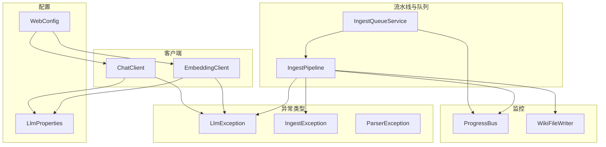
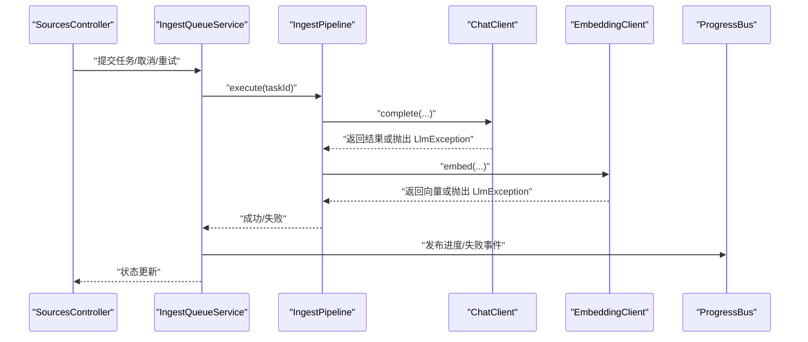
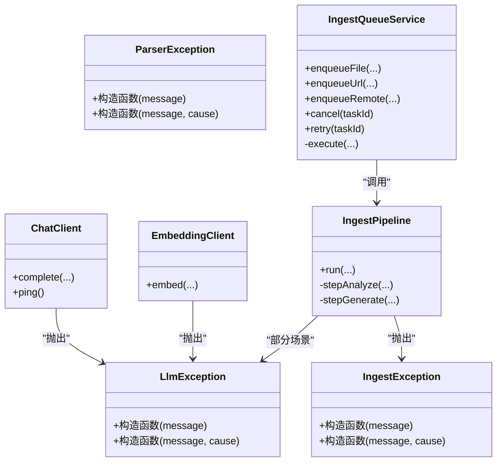
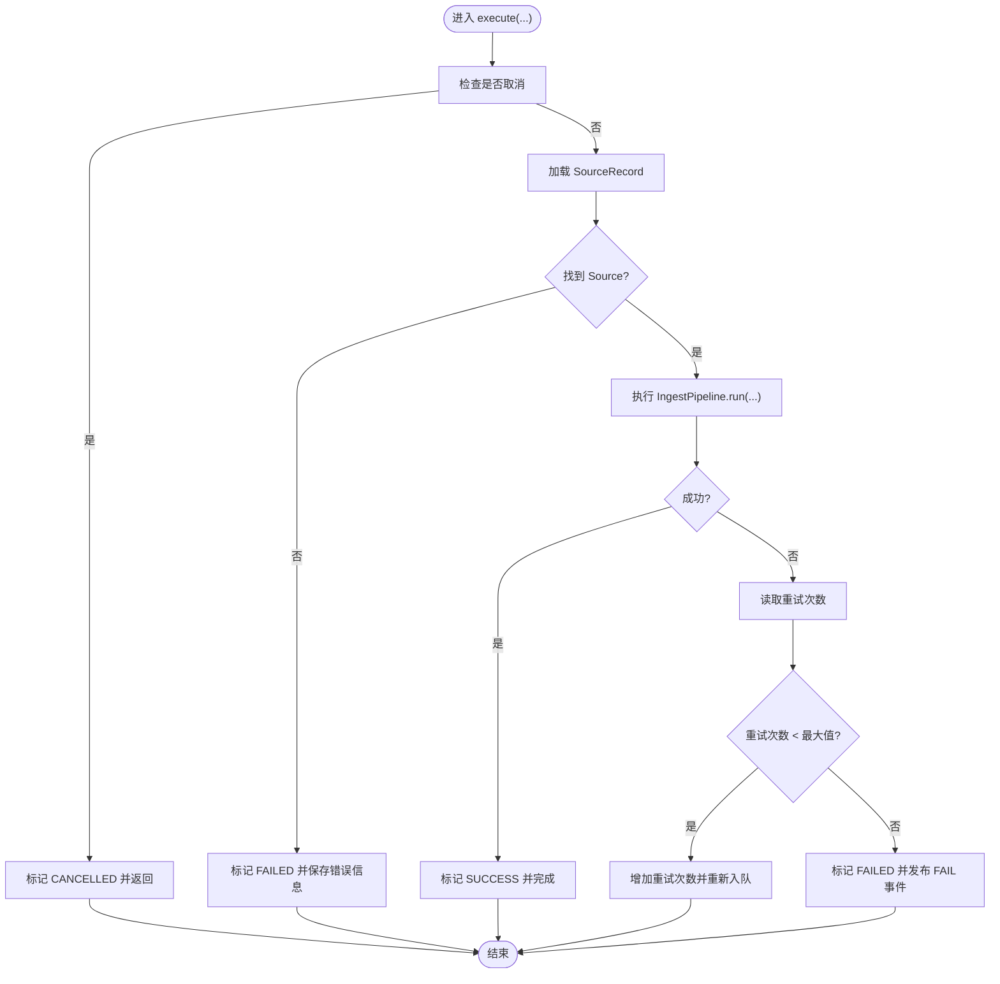
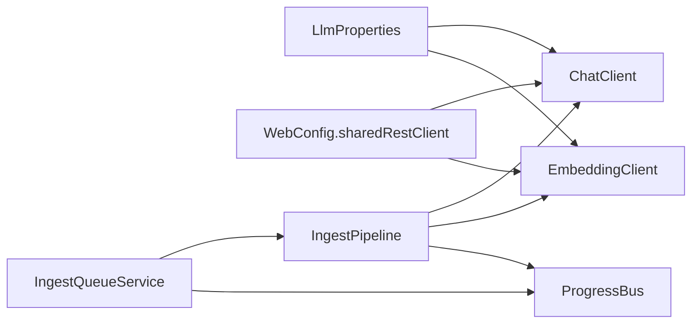

# 异常处理机制

<cite>
**本文引用的文件**
- [LlmException.java](file://src/main/java/com/example/llmwiki/llm/LlmException.java)
- [IngestException.java](file://src/main/java/com/example/llmwiki/ingest/IngestException.java)
- [ParserException.java](file://src/main/java/com/example/llmwiki/parser/ParserException.java)
- [ChatClient.java](file://src/main/java/com/example/llmwiki/llm/ChatClient.java)
- [EmbeddingClient.java](file://src/main/java/com/example/llmwiki/llm/EmbeddingClient.java)
- [LlmProperties.java](file://src/main/java/com/example/llmwiki/config/LlmProperties.java)
- [WebConfig.java](file://src/main/java/com/example/llmwiki/config/WebConfig.java)
- [IngestPipeline.java](file://src/main/java/com/example/llmwiki/ingest/IngestPipeline.java)
- [IngestQueueService.java](file://src/main/java/com/example/llmwiki/queue/IngestQueueService.java)
- [application.yml](file://src/main/resources/application.yml)
- [ProgressBus.java](file://src/main/java/com/example/llmwiki/progress/ProgressBus.java)
- [WikiFileWriter.java](file://src/main/java/com/example/llmwiki/ingest/WikiFileWriter.java)
- [SourcesController.java](file://src/main/java/com/example/llmwiki/api/SourcesController.java)
</cite>

## 目录
1. [简介](#简介)
2. [项目结构](#项目结构)
3. [核心组件](#核心组件)
4. [架构总览](#架构总览)
5. [详细组件分析](#详细组件分析)
6. [依赖分析](#依赖分析)
7. [性能考量](#性能考量)
8. [故障排查指南](#故障排查指南)
9. [结论](#结论)
10. [附录](#附录)

## 简介
本文件聚焦于 LLM Wiki 的异常处理机制，围绕 LlmException 的设计与使用，系统梳理异常分类、错误码、错误信息格式化方式，并结合实际代码路径说明异常在 LLM 客户端、解析器、摄取流水线与队列中的传播与处理策略。同时覆盖重试、降级、熔断与超时控制等工程化手段，以及错误恢复、监控与告警、调试与安全注意事项，帮助开发者与运维人员建立完善的异常治理能力。

## 项目结构
与异常处理直接相关的关键模块与文件如下：
- LLM 客户端层：ChatClient、EmbeddingClient
- 异常类型：LlmException、IngestException、ParserException
- 配置层：LlmProperties（含超时配置）
- 流水线与队列：IngestPipeline、IngestQueueService
- 监控与进度：ProgressBus、WikiFileWriter
- 控制器：SourcesController（任务取消/重试入口）

图表来源
- [ChatClient.java:1-108](file://src/main/java/com/example/llmwiki/llm/ChatClient.java#L1-L108)
- [EmbeddingClient.java:1-90](file://src/main/java/com/example/llmwiki/llm/EmbeddingClient.java#L1-L90)
- [LlmException.java:1-19](file://src/main/java/com/example/llmwiki/llm/LlmException.java#L1-L19)
- [IngestException.java:1-18](file://src/main/java/com/example/llmwiki/ingest/IngestException.java#L1-L18)
- [ParserException.java:1-19](file://src/main/java/com/example/llmwiki/parser/ParserException.java#L1-L19)
- [LlmProperties.java:1-63](file://src/main/java/com/example/llmwiki/config/LlmProperties.java#L1-L63)
- [WebConfig.java:1-35](file://src/main/java/com/example/llmwiki/config/WebConfig.java#L1-L35)
- [IngestPipeline.java:1-251](file://src/main/java/com/example/llmwiki/ingest/IngestPipeline.java#L1-L251)
- [IngestQueueService.java:1-214](file://src/main/java/com/example/llmwiki/queue/IngestQueueService.java#L1-L214)
- [ProgressBus.java:1-60](file://src/main/java/com/example/llmwiki/progress/ProgressBus.java#L1-L60)
- [WikiFileWriter.java:1-75](file://src/main/java/com/example/llmwiki/ingest/WikiFileWriter.java#L1-L75)

章节来源
- [ChatClient.java:1-108](file://src/main/java/com/example/llmwiki/llm/ChatClient.java#L1-L108)
- [EmbeddingClient.java:1-90](file://src/main/java/com/example/llmwiki/llm/EmbeddingClient.java#L1-L90)
- [LlmException.java:1-19](file://src/main/java/com/example/llmwiki/llm/LlmException.java#L1-L19)
- [IngestException.java:1-18](file://src/main/java/com/example/llmwiki/ingest/IngestException.java#L1-L18)
- [ParserException.java:1-19](file://src/main/java/com/example/llmwiki/parser/ParserException.java#L1-L19)
- [LlmProperties.java:1-63](file://src/main/java/com/example/llmwiki/config/LlmProperties.java#L1-L63)
- [WebConfig.java:1-35](file://src/main/java/com/example/llmwiki/config/WebConfig.java#L1-L35)
- [IngestPipeline.java:1-251](file://src/main/java/com/example/llmwiki/ingest/IngestPipeline.java#L1-L251)
- [IngestQueueService.java:1-214](file://src/main/java/com/example/llmwiki/queue/IngestQueueService.java#L1-L214)
- [ProgressBus.java:1-60](file://src/main/java/com/example/llmwiki/progress/ProgressBus.java#L1-L60)
- [WikiFileWriter.java:1-75](file://src/main/java/com/example/llmwiki/ingest/WikiFileWriter.java#L1-L75)

## 核心组件
- LlmException：LLM 调用层统一异常基类，承载错误信息与原因传递。
- IngestException：摄取阶段结构化异常，用于解析与生成阶段的 JSON 解析失败等场景。
- ParserException：解析器异常，用于解析阶段的输入/格式/外部依赖问题。
- ChatClient/EmbeddingClient：LLM 客户端封装 OpenAI 兼容接口，负责参数校验、请求发送、响应解析与异常抛出。
- LlmProperties：集中管理 Chat/Embedding/Vision 的基础地址、API Key、模型名与超时时间。
- IngestPipeline：两步式 CoT（解析 → 分析 → 生成 → 索引/图谱）的编排与异常捕获。
- IngestQueueService：单线程串行执行、任务取消、失败重试与状态持久化。
- ProgressBus：进度事件广播，用于异常状态的前端展示与可观测性。
- WikiFileWriter：写入日志文件，记录摄取过程中的关键事件与失败信息。

章节来源
- [LlmException.java:1-19](file://src/main/java/com/example/llmwiki/llm/LlmException.java#L1-L19)
- [IngestException.java:1-18](file://src/main/java/com/example/llmwiki/ingest/IngestException.java#L1-L18)
- [ParserException.java:1-19](file://src/main/java/com/example/llmwiki/parser/ParserException.java#L1-L19)
- [ChatClient.java:1-108](file://src/main/java/com/example/llmwiki/llm/ChatClient.java#L1-L108)
- [EmbeddingClient.java:1-90](file://src/main/java/com/example/llmwiki/llm/EmbeddingClient.java#L1-L90)
- [LlmProperties.java:1-63](file://src/main/java/com/example/llmwiki/config/LlmProperties.java#L1-L63)
- [IngestPipeline.java:1-251](file://src/main/java/com/example/llmwiki/ingest/IngestPipeline.java#L1-L251)
- [IngestQueueService.java:1-214](file://src/main/java/com/example/llmwiki/queue/IngestQueueService.java#L1-L214)
- [ProgressBus.java:1-60](file://src/main/java/com/example/llmwiki/progress/ProgressBus.java#L1-L60)
- [WikiFileWriter.java:1-75](file://src/main/java/com/example/llmwiki/ingest/WikiFileWriter.java#L1-L75)

## 架构总览
下图展示了异常从 LLM 客户端到摄取流水线与队列的整体传播路径，以及异常状态如何通过 ProgressBus 通知前端。

图表来源
- [SourcesController.java:34-101](file://src/main/java/com/example/llmwiki/api/SourcesController.java#L34-L101)
- [IngestQueueService.java:159-212](file://src/main/java/com/example/llmwiki/queue/IngestQueueService.java#L159-L212)
- [IngestPipeline.java:65-109](file://src/main/java/com/example/llmwiki/ingest/IngestPipeline.java#L65-L109)
- [ChatClient.java:50-86](file://src/main/java/com/example/llmwiki/llm/ChatClient.java#L50-L86)
- [EmbeddingClient.java:42-81](file://src/main/java/com/example/llmwiki/llm/EmbeddingClient.java#L42-L81)
- [ProgressBus.java:43-55](file://src/main/java/com/example/llmwiki/progress/ProgressBus.java#L43-L55)

## 详细组件分析

### LlmException 设计与使用
- 设计目标：作为 LLM 调用层的统一异常类型，向上游清晰传递错误信息与根因。
- 错误信息格式：客户端在捕获底层异常后，会将原始异常消息拼接到统一前缀中，形成“用户可读 + 技术细节”的复合信息。
- 使用场景：
  - ChatClient：当 API Key 未配置、返回空或非预期结构、网络异常时抛出。
  - EmbeddingClient：当 API Key 未配置、返回异常或解析失败时抛出。
  - IngestPipeline：在 JSON 解析失败时转换为 IngestException，避免污染 LLM 层异常语义。

图表来源
- [LlmException.java:1-19](file://src/main/java/com/example/llmwiki/llm/LlmException.java#L1-L19)
- [IngestException.java:1-18](file://src/main/java/com/example/llmwiki/ingest/IngestException.java#L1-L18)
- [ParserException.java:1-19](file://src/main/java/com/example/llmwiki/parser/ParserException.java#L1-L19)
- [ChatClient.java:1-108](file://src/main/java/com/example/llmwiki/llm/ChatClient.java#L1-L108)
- [EmbeddingClient.java:1-90](file://src/main/java/com/example/llmwiki/llm/EmbeddingClient.java#L1-L90)
- [IngestPipeline.java:1-251](file://src/main/java/com/example/llmwiki/ingest/IngestPipeline.java#L1-L251)
- [IngestQueueService.java:1-214](file://src/main/java/com/example/llmwiki/queue/IngestQueueService.java#L1-L214)

章节来源
- [LlmException.java:1-19](file://src/main/java/com/example/llmwiki/llm/LlmException.java#L1-L19)
- [ChatClient.java:50-86](file://src/main/java/com/example/llmwiki/llm/ChatClient.java#L50-L86)
- [EmbeddingClient.java:42-81](file://src/main/java/com/example/llmwiki/llm/EmbeddingClient.java#L42-L81)
- [IngestPipeline.java:111-139](file://src/main/java/com/example/llmwiki/ingest/IngestPipeline.java#L111-L139)

### 异常类型与分类
- 配置异常
  - ChatClient 在缺少 API Key 或模型配置不完整时抛出 LlmException。
  - EmbeddingClient 在缺少 API Key 时抛出 LlmException。
- 网络异常
  - RestClient 发起请求时可能抛出底层异常，ChatClient/EmbeddingClient 捕获并包装为 LlmException。
- API 调用异常
  - 当 LLM 返回空、无 choices 字段、或返回结构不符合预期时，抛出 LlmException。
- 数据解析异常
  - IngestPipeline 在解析 LLM 输出的 JSON 时失败，抛出 IngestException，避免污染 LLM 层异常语义。

章节来源
- [ChatClient.java:50-86](file://src/main/java/com/example/llmwiki/llm/ChatClient.java#L50-L86)
- [EmbeddingClient.java:42-81](file://src/main/java/com/example/llmwiki/llm/EmbeddingClient.java#L42-L81)
- [IngestPipeline.java:111-139](file://src/main/java/com/example/llmwiki/ingest/IngestPipeline.java#L111-L139)

### 异常处理策略
- 重试机制
  - IngestQueueService 对失败任务进行有限次数重试（由配置项决定），并在达到最大重试次数后标记为 FAILED。
- 降级方案
  - IngestPipeline 在 Embedding 失败时记录警告并降级为仅 BM25 索引，保证主流程可用。
- 熔断处理
  - 代码中未实现显式的熔断器（如 Hystrix）。可通过引入熔断器组件在客户端层实现，但当前实现以日志告警与降级为主。
- 超时控制
  - LlmProperties 提供 timeoutSeconds 配置，用于控制 Chat/Embedding/Vision 的超时时间；WebConfig 中共享 RestClient，建议在更高层统一设置连接/读取超时策略。

图表来源
- [IngestQueueService.java:159-212](file://src/main/java/com/example/llmwiki/queue/IngestQueueService.java#L159-L212)

章节来源
- [IngestQueueService.java:159-212](file://src/main/java/com/example/llmwiki/queue/IngestQueueService.java#L159-L212)
- [IngestPipeline.java:194-209](file://src/main/java/com/example/llmwiki/ingest/IngestPipeline.java#L194-L209)
- [LlmProperties.java:40-61](file://src/main/java/com/example/llmwiki/config/LlmProperties.java#L40-L61)
- [WebConfig.java:30-33](file://src/main/java/com/example/llmwiki/config/WebConfig.java#L30-L33)

### 错误恢复
- 自动重试：基于 IngestQueueService 的重试逻辑，按配置的最大重试次数进行自动恢复。
- 手动干预：SourcesController 提供取消与重试接口，便于人工介入。
- 回滚机制：当前未实现显式回滚；失败后通过降级与日志保留现场，后续可扩展为幂等写入与增量回退。
- 补偿措施：WikiFileWriter 将摄取事件写入日志文件，便于事后审计与补救。

章节来源
- [SourcesController.java:67-78](file://src/main/java/com/example/llmwiki/api/SourcesController.java#L67-L78)
- [IngestQueueService.java:115-134](file://src/main/java/com/example/llmwiki/queue/IngestQueueService.java#L115-L134)
- [WikiFileWriter.java:48-59](file://src/main/java/com/example/llmwiki/ingest/WikiFileWriter.java#L48-L59)

### 异常监控
- 错误日志记录：各客户端与服务在异常发生时记录错误日志，包含 URL、模型名、异常摘要等。
- 性能指标：未见专门的指标埋点；可在客户端层增加计数器与耗时直方图，结合 Spring Boot Actuator 实现。
- 告警机制：未见专用告警通道；建议通过 ProgressBus 的 FAIL 事件与外部监控系统集成，或在队列失败处触发告警。

章节来源
- [ChatClient.java:83-84](file://src/main/java/com/example/llmwiki/llm/ChatClient.java#L83-L84)
- [EmbeddingClient.java:77-80](file://src/main/java/com/example/llmwiki/llm/EmbeddingClient.java#L77-L80)
- [IngestQueueService.java:194-211](file://src/main/java/com/example/llmwiki/queue/IngestQueueService.java#L194-L211)
- [ProgressBus.java:43-55](file://src/main/java/com/example/llmwiki/progress/ProgressBus.java#L43-L55)

### 调试指南
- 错误诊断
  - 检查 LLM 配置：确认 API Key、Base URL、模型名与超时设置。
  - 查看日志：关注 Chat/Embedding 客户端的日志输出，定位网络与返回结构问题。
  - 核对 JSON：IngestPipeline 的 JSON 解析失败通常源于 LLM 输出格式不稳定，需调整提示词或启用 JSON 模式。
- 日志分析
  - 使用 ProgressBus 的最近事件列表快速定位失败阶段。
  - 通过 WikiFileWriter 的日志文件查看摄取链路的关键节点。
- 问题定位
  - 通过 SourcesController 的取消/重试接口验证任务状态变化。
  - 结合 IngestQueueService 的重试计数判断是否达到最大重试阈值。
- 解决方案
  - 修正配置、增强提示词稳定性、启用更严格的 JSON 模式。
  - 在 Embedding 失败时采用降级策略，确保主流程可用。

章节来源
- [LlmProperties.java:40-61](file://src/main/java/com/example/llmwiki/config/LlmProperties.java#L40-L61)
- [ChatClient.java:50-86](file://src/main/java/com/example/llmwiki/llm/ChatClient.java#L50-L86)
- [EmbeddingClient.java:42-81](file://src/main/java/com/example/llmwiki/llm/EmbeddingClient.java#L42-L81)
- [IngestPipeline.java:111-139](file://src/main/java/com/example/llmwiki/ingest/IngestPipeline.java#L111-L139)
- [ProgressBus.java:57-60](file://src/main/java/com/example/llmwiki/progress/ProgressBus.java#L57-L60)
- [WikiFileWriter.java:48-59](file://src/main/java/com/example/llmwiki/ingest/WikiFileWriter.java#L48-L59)
- [SourcesController.java:67-78](file://src/main/java/com/example/llmwiki/api/SourcesController.java#L67-L78)

### 安全考虑
- 敏感信息过滤：避免在日志中打印 API Key、密钥等敏感字段；当前客户端已通过 Authorization 头传输密钥，日志中未直接打印密钥。
- 错误信息脱敏：统一使用 LlmException/IngestException 包装异常，避免将底层敏感错误直接暴露给前端。
- 攻击防护：通过 CORS 配置允许必要的来源与方法；建议在生产环境限制 allowedOriginPatterns 并开启 HTTPS。

章节来源
- [ChatClient.java:66-72](file://src/main/java/com/example/llmwiki/llm/ChatClient.java#L66-L72)
- [WebConfig.java:18-25](file://src/main/java/com/example/llmwiki/config/WebConfig.java#L18-L25)

### 最佳实践
- 异常处理模式
  - 明确分层：LLM 层用 LlmException，业务层用 IngestException/ParserException，避免异常语义混淆。
  - 统一包装：对外部调用异常进行统一包装，保留根因（cause）以便追踪。
- 错误传播
  - 在流水线中尽早捕获并转换异常，避免异常越界影响其他阶段。
  - 对可恢复的网络异常采用重试，对不可恢复的配置异常直接失败并告警。
- 用户体验
  - 通过 ProgressBus 实时反馈任务状态，失败时提供明确的阶段与错误摘要。
- 系统稳定性
  - 限制重试次数与间隔，防止雪崩效应。
  - 在 Embedding 失败时降级为纯 BM25 索引，保证检索可用性。

## 依赖分析
- 组件耦合
  - ChatClient/EmbeddingClient 依赖 LlmProperties 与共享 RestClient。
  - IngestPipeline 依赖多个子系统（解析器、聊天、嵌入、索引、图谱），并通过异常隔离不同阶段。
  - IngestQueueService 作为单线程执行器，负责任务调度与重试，向上游提供取消/重试接口。
- 外部依赖
  - Spring WebClient RestClient（共享 Bean）。
  - Quartz（定时任务，与异常处理无直接耦合）。
- 潜在循环依赖
  - 未发现循环依赖；各组件职责清晰，通过接口与配置进行解耦。

图表来源
- [LlmProperties.java:1-63](file://src/main/java/com/example/llmwiki/config/LlmProperties.java#L1-L63)
- [WebConfig.java:30-33](file://src/main/java/com/example/llmwiki/config/WebConfig.java#L30-L33)
- [ChatClient.java:30-32](file://src/main/java/com/example/llmwiki/llm/ChatClient.java#L30-L32)
- [EmbeddingClient.java:27-29](file://src/main/java/com/example/llmwiki/llm/EmbeddingClient.java#L27-L29)
- [IngestPipeline.java:52-62](file://src/main/java/com/example/llmwiki/ingest/IngestPipeline.java#L52-L62)
- [IngestQueueService.java:38-43](file://src/main/java/com/example/llmwiki/queue/IngestQueueService.java#L38-L43)
- [ProgressBus.java:19-21](file://src/main/java/com/example/llmwiki/progress/ProgressBus.java#L19-L21)

章节来源
- [LlmProperties.java:1-63](file://src/main/java/com/example/llmwiki/config/LlmProperties.java#L1-L63)
- [WebConfig.java:1-35](file://src/main/java/com/example/llmwiki/config/WebConfig.java#L1-L35)
- [ChatClient.java:1-108](file://src/main/java/com/example/llmwiki/llm/ChatClient.java#L1-L108)
- [EmbeddingClient.java:1-90](file://src/main/java/com/example/llmwiki/llm/EmbeddingClient.java#L1-L90)
- [IngestPipeline.java:1-251](file://src/main/java/com/example/llmwiki/ingest/IngestPipeline.java#L1-L251)
- [IngestQueueService.java:1-214](file://src/main/java/com/example/llmwiki/queue/IngestQueueService.java#L1-L214)
- [ProgressBus.java:1-60](file://src/main/java/com/example/llmwiki/progress/ProgressBus.java#L1-L60)

## 性能考量
- 超时与并发
  - LlmProperties 提供超时配置，建议在更高层统一设置连接/读取超时，避免阻塞线程池。
  - IngestQueueService 使用单线程执行器，适合串行化处理；若吞吐需求提升，可评估线程池大小与队列长度。
- 降级与容错
  - Embedding 失败时的降级策略可显著降低端到端延迟，提高系统整体可用性。
- 观测性
  - 建议补充指标采集（成功率、延迟、重试次数、失败原因分布），结合日志与告警实现闭环监控。

## 故障排查指南
- 常见问题
  - API Key 未配置：Chat/Embedding 客户端会直接抛出 LlmException。
  - LLM 返回空或结构异常：检查提示词与模型兼容性，必要时启用 JSON 模式。
  - 重试耗尽仍失败：查看 IngestQueueService 的重试计数与最终失败原因。
- 解决步骤
  - 修正配置项（API Key、Base URL、模型、超时）。
  - 调整提示词模板，确保 LLM 输出稳定且符合 JSON 格式。
  - 在 Embedding 失败时启用降级策略，观察检索可用性。
- 预防措施
  - 在生产环境限制 CORS 源，启用 HTTPS。
  - 设置合理的最大重试次数与间隔，避免级联失败。
- 应急响应
  - 通过 SourcesController 的取消/重试接口快速干预。
  - 记录并上报异常事件，结合 ProgressBus 的 FAIL 事件进行告警联动。

章节来源
- [ChatClient.java:50-86](file://src/main/java/com/example/llmwiki/llm/ChatClient.java#L50-L86)
- [EmbeddingClient.java:42-81](file://src/main/java/com/example/llmwiki/llm/EmbeddingClient.java#L42-L81)
- [IngestQueueService.java:194-211](file://src/main/java/com/example/llmwiki/queue/IngestQueueService.java#L194-L211)
- [SourcesController.java:67-78](file://src/main/java/com/example/llmwiki/api/SourcesController.java#L67-L78)

## 结论
本项目在 LLM 异常处理上实现了清晰的分层与统一包装，结合队列的重试与降级策略，能够在多数异常场景下保障系统的稳定性与可观测性。建议在现有基础上进一步完善指标采集、告警联动与熔断器等工程化能力，以应对更复杂的线上环境。

## 附录
- 关键配置参考
  - LLM 超时：application.yml 中 llm-wiki.llm.chat.timeout-seconds、llm-wiki.llm.embedding.timeout-seconds、llm-wiki.llm.vision.timeout-seconds。
  - 摄取重试：application.yml 中 llm-wiki.ingest.max-retry。
  - CORS：WebConfig 中允许的来源与方法。

章节来源
- [application.yml:40-77](file://src/main/resources/application.yml#L40-L77)
- [WebConfig.java:18-25](file://src/main/java/com/example/llmwiki/config/WebConfig.java#L18-L25)