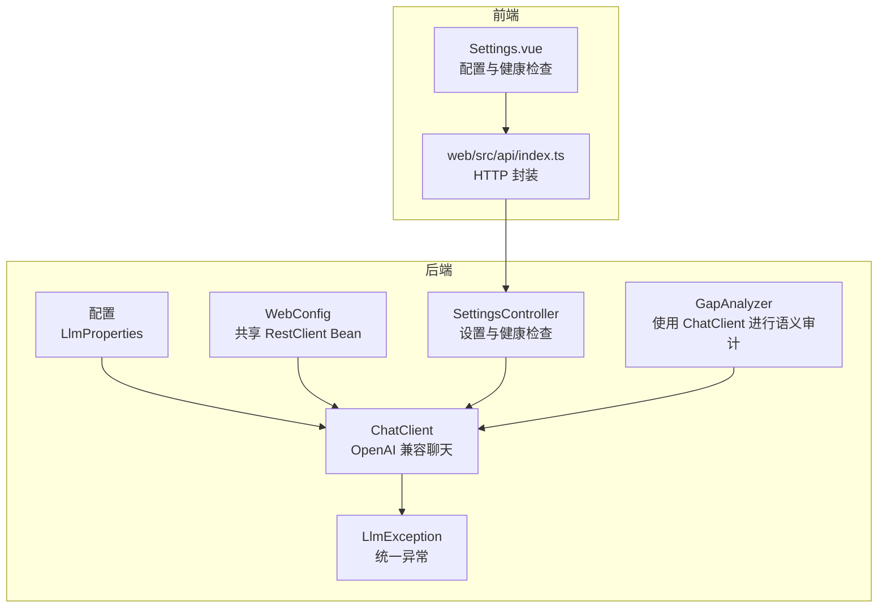
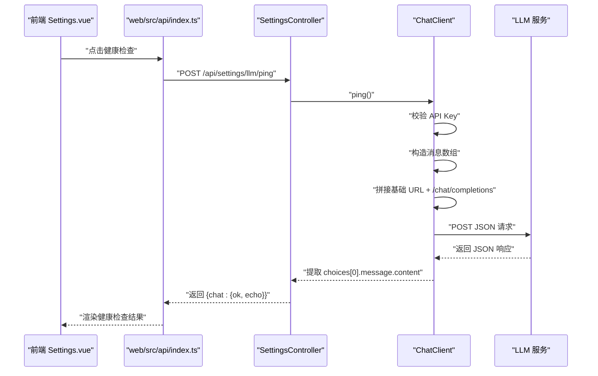
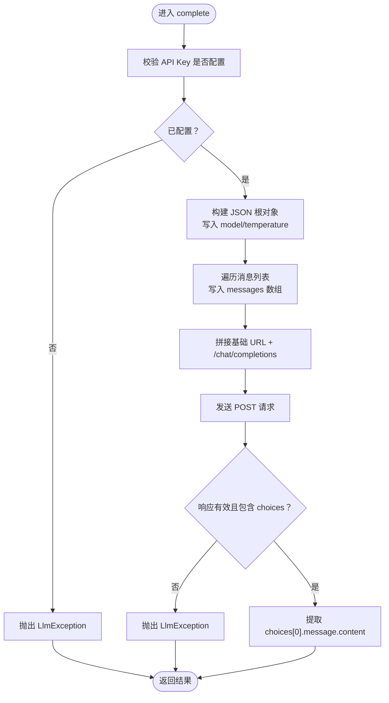
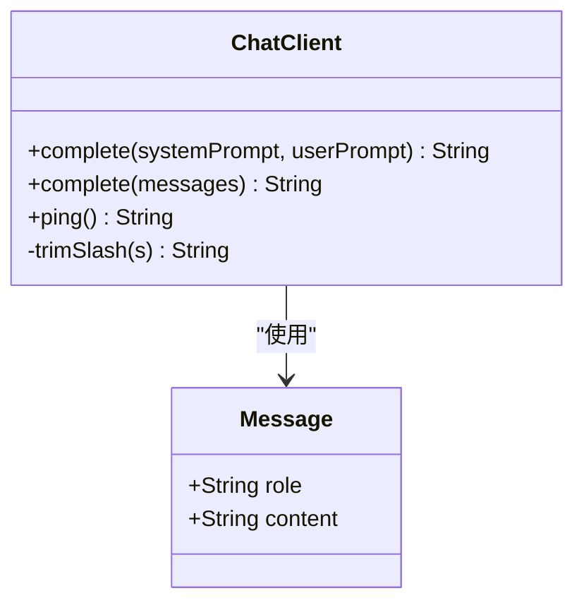
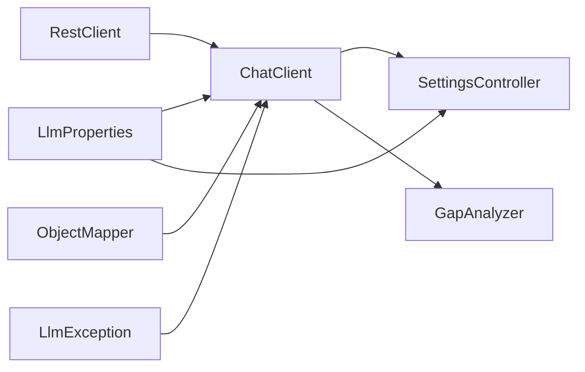

# 聊天客户端

<cite>
**本文引用的文件**
- [ChatClient.java](file://src/main/java/com/example/llmwiki/llm/ChatClient.java)
- [LlmException.java](file://src/main/java/com/example/llmwiki/llm/LlmException.java)
- [LlmProperties.java](file://src/main/java/com/example/llmwiki/config/LlmProperties.java)
- [WebConfig.java](file://src/main/java/com/example/llmwiki/config/WebConfig.java)
- [application.yml](file://src/main/resources/application.yml)
- [SettingsController.java](file://src/main/java/com/example/llmwiki/api/SettingsController.java)
- [GapAnalyzer.java](file://src/main/java/com/example/llmwiki/insight/GapAnalyzer.java)
- [index.ts](file://web/src/api/index.ts)
- [Settings.vue](file://web/src/views/Settings.vue)
</cite>

## 目录
1. [简介](#简介)
2. [项目结构](#项目结构)
3. [核心组件](#核心组件)
4. [架构总览](#架构总览)
5. [详细组件分析](#详细组件分析)
6. [依赖分析](#依赖分析)
7. [性能考虑](#性能考虑)
8. [故障排查指南](#故障排查指南)
9. [结论](#结论)
10. [附录](#附录)

## 简介
本文件面向“LLM Wiki 聊天客户端”的技术文档，聚焦 ChatClient 的实现与使用，包括：
- 基于 OpenAI 兼容协议的消息处理与调用封装
- 单轮与多轮对话的差异、消息数组构建与上下文保持
- Message 记录类的角色定义与序列化
- 配置管理（LlmProperties 中的 chat 配置项、API 密钥校验、基础 URL 处理）
- 错误处理机制（LlmException 抛出时机、异常信息格式化、日志策略）
- 健康检查（ping 方法、连通性检测、最小化请求设计）
- 性能优化（RestClient 共享实例、JSON 序列化优化、连接池配置）

## 项目结构
聊天客户端位于后端模块中，采用 Spring Boot + WebClient(RestClient) 的轻量 HTTP 客户端方案，配合 Jackson 进行 JSON 序列化与反序列化。前端通过 Settings 页面进行配置与健康检查。

图表来源
- [ChatClient.java:28-107](file://src/main/java/com/example/llmwiki/llm/ChatClient.java#L28-L107)
- [LlmProperties.java:19-42](file://src/main/java/com/example/llmwiki/config/LlmProperties.java#L19-L42)
- [WebConfig.java:30-33](file://src/main/java/com/example/llmwiki/config/WebConfig.java#L30-L33)
- [SettingsController.java:34-69](file://src/main/java/com/example/llmwiki/api/SettingsController.java#L34-L69)
- [GapAnalyzer.java:40-107](file://src/main/java/com/example/llmwiki/insight/GapAnalyzer.java#L40-L107)
- [index.ts:6-9](file://web/src/api/index.ts#L6-L9)
- [Settings.vue:46-61](file://web/src/views/Settings.vue#L46-L61)

章节来源
- [ChatClient.java:16-28](file://src/main/java/com/example/llmwiki/llm/ChatClient.java#L16-L28)
- [WebConfig.java:15-34](file://src/main/java/com/example/llmwiki/config/WebConfig.java#L15-L34)
- [application.yml:31-57](file://src/main/resources/application.yml#L31-L57)

## 核心组件
- ChatClient：负责 OpenAI 兼容协议的聊天补全调用，支持单轮与多轮对话，内置健康检查与错误处理。
- LlmProperties：集中管理 chat/embedding/vision 的配置，支持运行时热更新。
- LlmException：统一的 LLM 调用异常类型。
- WebConfig：提供共享的 RestClient Bean，避免重复创建连接池。
- SettingsController：提供设置读取/更新与健康检查接口。
- GapAnalyzer：在知识空白分析中使用 ChatClient 进行语义审计。

章节来源
- [ChatClient.java:28-107](file://src/main/java/com/example/llmwiki/llm/ChatClient.java#L28-L107)
- [LlmProperties.java:19-62](file://src/main/java/com/example/llmwiki/config/LlmProperties.java#L19-L62)
- [LlmException.java:9-18](file://src/main/java/com/example/llmwiki/llm/LlmException.java#L9-L18)
- [WebConfig.java:30-33](file://src/main/java/com/example/llmwiki/config/WebConfig.java#L30-L33)
- [SettingsController.java:34-69](file://src/main/java/com/example/llmwiki/api/SettingsController.java#L34-L69)
- [GapAnalyzer.java:40-107](file://src/main/java/com/example/llmwiki/insight/GapAnalyzer.java#L40-L107)

## 架构总览
下图展示从前端到后端的完整链路：前端 Settings.vue 通过 web/src/api/index.ts 发起请求，后端 SettingsController 提供设置与健康检查接口，ChatClient 使用共享 RestClient 调用 LLM 并返回结果。

图表来源
- [Settings.vue:46-61](file://web/src/views/Settings.vue#L46-L61)
- [index.ts:6-9](file://web/src/api/index.ts#L6-L9)
- [SettingsController.java:53-69](file://src/main/java/com/example/llmwiki/api/SettingsController.java#L53-L69)
- [ChatClient.java:91-93](file://src/main/java/com/example/llmwiki/llm/ChatClient.java#L91-L93)
- [ChatClient.java:50-86](file://src/main/java/com/example/llmwiki/llm/ChatClient.java#L50-L86)

## 详细组件分析

### ChatClient 实现原理
- OpenAI 兼容协议：通过 POST /chat/completions 发送 JSON，字段包含 model、temperature、messages 数组。
- 单轮与多轮对话：
  - 单轮：提供 system + user 的便捷方法，内部转换为消息数组。
  - 多轮：直接接收消息列表，保留历史上下文，由 LLM 自身决定上下文长度与策略。
- 消息数组构建：遍历消息列表，逐条写入 role 与 content。
- API 调用封装：使用共享 RestClient，设置 Authorization、Content-Type，序列化请求体，获取响应并解析 choices[0].message.content。
- 错误处理：对空响应或无 choices 的情况抛出 LlmException；捕获其他异常时记录日志并包装为 LlmException。
- 健康检查：ping 方法使用极短提示词触发一次最小化请求，便于快速判断连通性。

图表来源
- [ChatClient.java:50-86](file://src/main/java/com/example/llmwiki/llm/ChatClient.java#L50-L86)

章节来源
- [ChatClient.java:37-86](file://src/main/java/com/example/llmwiki/llm/ChatClient.java#L37-L86)

### Message 记录类设计
- 角色定义：支持 system、user、assistant 等角色字符串，具体由调用方传入。
- 内容封装：content 字段承载文本内容。
- 序列化处理：通过 Jackson 的 ObjectNode/ArrayNode 在 complete 中构建 JSON，无需额外注解或自定义序列化器。

图表来源
- [ChatClient.java:105-106](file://src/main/java/com/example/llmwiki/llm/ChatClient.java#L105-L106)
- [ChatClient.java:50-86](file://src/main/java/com/example/llmwiki/llm/ChatClient.java#L50-L86)

章节来源
- [ChatClient.java:105-106](file://src/main/java/com/example/llmwiki/llm/ChatClient.java#L105-L106)

### complete 方法的实现细节
- 单轮：将 system 与 user 组合成消息列表，委托多轮 complete。
- 多轮：校验 API Key；构建 JSON 根对象；写入 model 与 temperature；遍历消息写入 messages；拼接 URL；发送请求；解析响应；返回 assistant 内容。
- 上下文保持：messages 列表即为上下文载体，由调用方维护历史消息顺序。
- 异常处理：显式捕获 LlmException 并透传；捕获其他异常时记录日志并包装为 LlmException。

章节来源
- [ChatClient.java:37-86](file://src/main/java/com/example/llmwiki/llm/ChatClient.java#L37-L86)

### 配置管理
- LlmProperties.Chat 字段：
  - baseUrl：OpenAI 兼容的基础 URL，默认值来自 application.yml。
  - apiKey：API 密钥，运行时可通过 SettingsController 热更新。
  - model：模型名称，默认 gpt-4o-mini。
  - temperature：采样温度，默认 0.2。
  - timeoutSeconds：超时时间（秒）。
- application.yml：集中存放 llm-wiki.llm.* 前缀的配置项，便于部署与运维。
- SettingsController：提供 GET / PUT /api/settings/llm 获取与更新配置；POST /api/settings/llm/ping 健康检查。

章节来源
- [LlmProperties.java:30-42](file://src/main/java/com/example/llmwiki/config/LlmProperties.java#L30-L42)
- [application.yml:39-45](file://src/main/resources/application.yml#L39-L45)
- [SettingsController.java:34-69](file://src/main/java/com/example/llmwiki/api/SettingsController.java#L34-L69)

### 错误处理机制
- LlmException：统一异常类型，构造函数支持 message 与 cause。
- 抛出时机：
  - API Key 未配置：在 complete 开始阶段立即抛出。
  - 响应为空或无 choices：解析阶段抛出。
  - 其他异常：捕获后记录日志并包装为 LlmException。
- 日志记录：在 catch (Exception) 分支记录 URL 与 model，便于定位问题。

章节来源
- [LlmException.java:9-18](file://src/main/java/com/example/llmwiki/llm/LlmException.java#L9-L18)
- [ChatClient.java:52-85](file://src/main/java/com/example/llmwiki/llm/ChatClient.java#L52-L85)

### 健康检查功能
- ping 方法：使用极短提示词触发一次最小化请求，返回 echo 或错误信息。
- SettingsController.ping：组合 ChatClient.ping 与 EmbeddingClient.embed 的结果，返回结构化的健康检查报告。
- 前端集成：Settings.vue 提供“健康检查”按钮，调用 web/src/api/index.ts 的 pingLlm，渲染结果。

章节来源
- [ChatClient.java:91-93](file://src/main/java/com/example/llmwiki/llm/ChatClient.java#L91-L93)
- [SettingsController.java:53-69](file://src/main/java/com/example/llmwiki/api/SettingsController.java#L53-L69)
- [index.ts](file://web/src/api/index.ts#L9)
- [Settings.vue:35-42](file://web/src/views/Settings.vue#L35-L42)

### 性能优化
- RestClient 共享实例：WebConfig 中通过 @Bean 提供共享 RestClient，避免重复创建连接池与线程资源。
- JSON 序列化优化：使用 Jackson 的 ObjectNode/ArrayNode 动态构建请求体，减少不必要的中间对象与反射开销。
- 连接池配置：默认 RestClient.builder().build() 使用 Spring Boot 的默认 HttpClient 连接池参数，适合中小规模并发场景；如需更高吞吐，可在 WebConfig 中进一步定制。

章节来源
- [WebConfig.java:30-33](file://src/main/java/com/example/llmwiki/config/WebConfig.java#L30-L33)
- [ChatClient.java](file://src/main/java/com/example/llmwiki/llm/ChatClient.java#L32)

## 依赖分析
- ChatClient 依赖：
  - LlmProperties：读取 chat 配置（baseUrl、apiKey、model、temperature）。
  - RestClient：共享 HTTP 客户端，避免重复初始化。
  - ObjectMapper：JSON 序列化与反序列化。
  - LlmException：统一异常类型。
- SettingsController 依赖：
  - ChatClient：执行健康检查。
  - LlmProperties：热更新配置。
- GapAnalyzer 依赖：
  - ChatClient：进行语义审计。

图表来源
- [ChatClient.java:30-32](file://src/main/java/com/example/llmwiki/llm/ChatClient.java#L30-L32)
- [SettingsController.java:30-32](file://src/main/java/com/example/llmwiki/api/SettingsController.java#L30-L32)
- [GapAnalyzer.java:40-44](file://src/main/java/com/example/llmwiki/insight/GapAnalyzer.java#L40-L44)

章节来源
- [ChatClient.java:30-32](file://src/main/java/com/example/llmwiki/llm/ChatClient.java#L30-L32)
- [SettingsController.java:30-32](file://src/main/java/com/example/llmwiki/api/SettingsController.java#L30-L32)
- [GapAnalyzer.java:40-44](file://src/main/java/com/example/llmwiki/insight/GapAnalyzer.java#L40-L44)

## 性能考虑
- 连接复用：共享 RestClient 避免频繁创建连接，降低 TCP/TLS 握手成本。
- 请求体构建：Jackson 动态构建 JSON，避免复杂对象映射带来的额外开销。
- 超时控制：LlmProperties.Chat.timeoutSeconds 可根据网络环境与模型响应时间进行调优。
- 建议：在高并发场景下，可考虑在 WebConfig 中自定义 RestClient.Builder，设置连接池大小、空闲超时等参数；同时对消息数组进行合理裁剪，避免超出模型上下文限制。

## 故障排查指南
- API Key 未配置：在 complete 开始阶段会抛出 LlmException，提示前往设置页面填写。
- 响应为空或无 choices：常见于上游服务异常或返回格式不匹配，检查 LLM 服务状态与网络连通性。
- 其他异常：捕获后会记录日志，包含 URL 与 model 信息，便于定位问题。
- 健康检查失败：通过 SettingsController.ping 返回的错误信息查看具体原因；若 API Key 缺失，先在前端 Settings 页面填写并保存。

章节来源
- [ChatClient.java:52-85](file://src/main/java/com/example/llmwiki/llm/ChatClient.java#L52-L85)
- [SettingsController.java:55-61](file://src/main/java/com/example/llmwiki/api/SettingsController.java#L55-L61)

## 结论
ChatClient 以简洁的 API 设计实现了 OpenAI 兼容协议的聊天补全能力，具备良好的扩展性与可维护性。通过共享 RestClient、严格的配置校验与统一异常处理，确保了在多轮对话与健康检查场景下的稳定性与可观测性。建议在生产环境中结合实际网络与模型特性，对超时与连接池参数进行针对性优化，并在前端提供更丰富的健康检查可视化反馈。

## 附录
- 前端健康检查流程：Settings.vue -> web/src/api/index.ts -> SettingsController.ping -> ChatClient.ping
- 知识空白分析使用 ChatClient：GapAnalyzer.analyze -> chatClient.complete(systemPrompt, userPrompt)

章节来源
- [Settings.vue:46-61](file://web/src/views/Settings.vue#L46-L61)
- [index.ts:6-9](file://web/src/api/index.ts#L6-L9)
- [SettingsController.java:53-69](file://src/main/java/com/example/llmwiki/api/SettingsController.java#L53-L69)
- [GapAnalyzer.java:100-107](file://src/main/java/com/example/llmwiki/insight/GapAnalyzer.java#L100-L107)