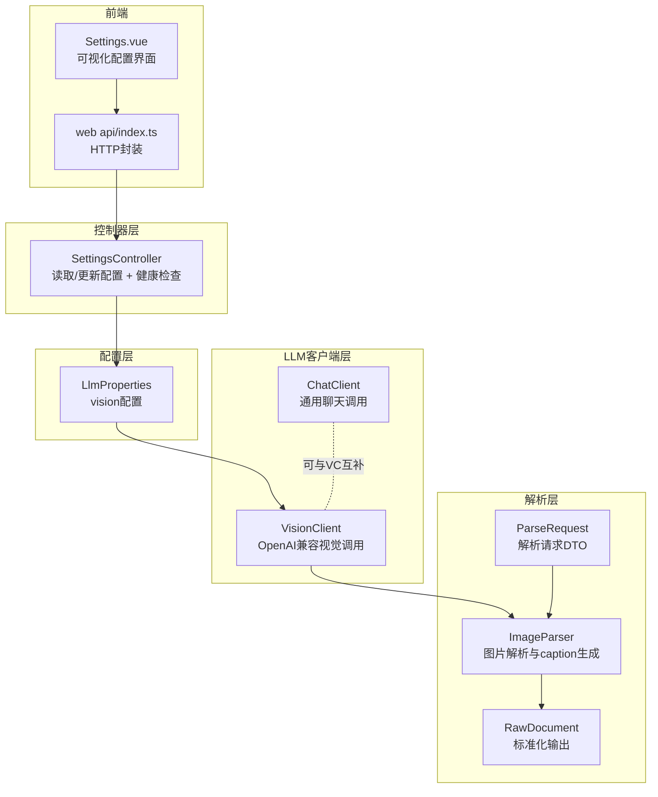
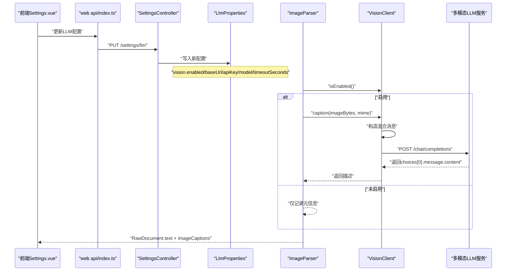
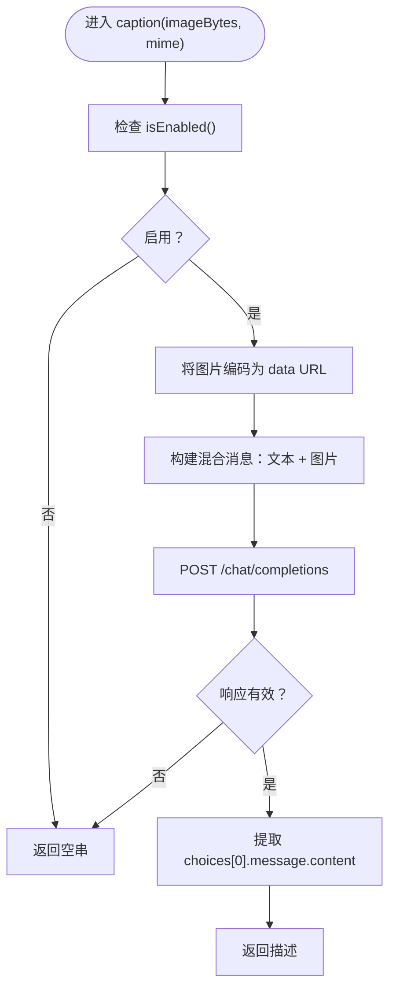
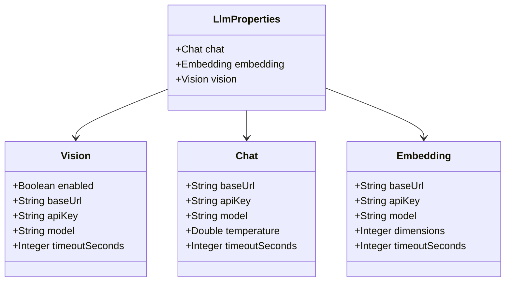
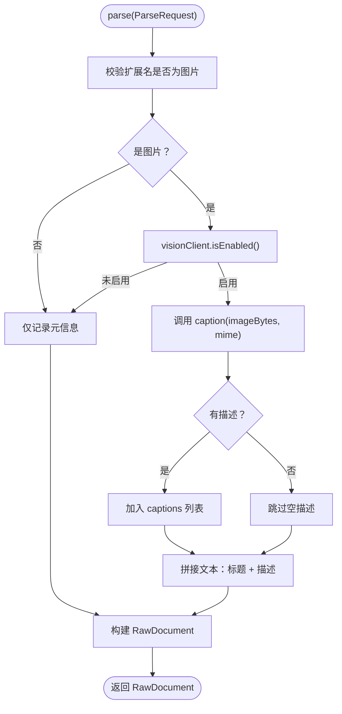
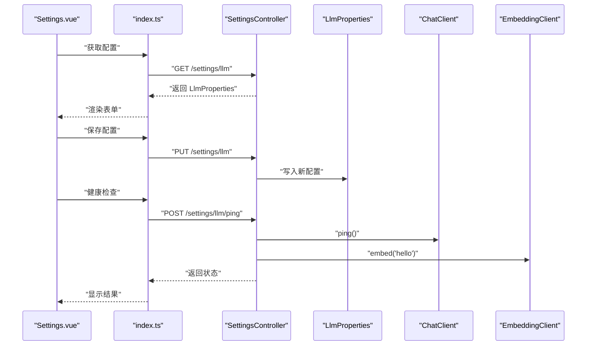
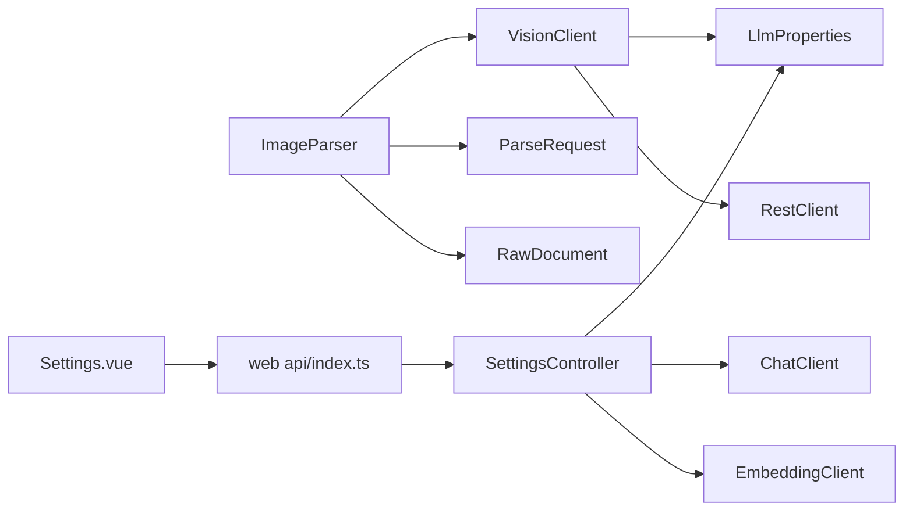

# 视觉客户端

<cite>
**本文引用的文件列表**
- [VisionClient.java](file://src/main/java/com/example/llmwiki/llm/VisionClient.java)
- [LlmProperties.java](file://src/main/java/com/example/llmwiki/config/LlmProperties.java)
- [ImageParser.java](file://src/main/java/com/example/llmwiki/parser/impl/ImageParser.java)
- [ParseRequest.java](file://src/main/java/com/example/llmwiki/parser/ParseRequest.java)
- [RawDocument.java](file://src/main/java/com/example/llmwiki/domain/RawDocument.java)
- [application.yml](file://src/main/resources/application.yml)
- [SettingsController.java](file://src/main/java/com/example/llmwiki/api/SettingsController.java)
- [Settings.vue](file://web/src/views/Settings.vue)
- [index.ts](file://web/src/api/index.ts)
- [ChatClient.java](file://src/main/java/com/example/llmwiki/llm/ChatClient.java)
</cite>

## 目录
1. [简介](#简介)
2. [项目结构](#项目结构)
3. [核心组件](#核心组件)
4. [架构总览](#架构总览)
5. [详细组件分析](#详细组件分析)
6. [依赖关系分析](#依赖关系分析)
7. [性能考量](#性能考量)
8. [故障排查指南](#故障排查指南)
9. [结论](#结论)
10. [附录](#附录)

## 简介
本文件面向LLM Wiki视觉客户端，系统性阐述VisionClient的实现原理与集成方式，覆盖以下主题：
- 图片内容理解、视觉问答、图像描述生成的实现思路与数据流
- 多模态输入处理：图片编码、文本提示、混合消息构建
- 视觉问答功能：图像分析、问题理解、答案生成、推理过程
- 图像描述生成：场景识别、对象检测、属性提取、自然语言描述
- 配置管理：LlmProperties中的vision配置、模型参数、图片格式支持
- 性能优化策略：图片压缩、批量处理、缓存机制
- 错误处理：图片解析失败、模型调用异常、格式不支持处理
- 安全考虑：图片内容过滤、访问控制、隐私保护
- 使用示例：常见视觉任务的调用方式、参数配置、结果处理

## 项目结构
本项目采用分层与按职责划分的组织方式：
- 配置层：LlmProperties集中管理LLM相关配置（Chat/Embedding/Vision）
- LLM客户端层：VisionClient负责OpenAI兼容的视觉能力调用
- 解析层：ImageParser对接VisionClient，将图片转换为可检索的文本
- 控制器层：SettingsController提供配置读取/更新与健康检查
- 前端设置界面：Settings.vue与web端API交互，动态配置Vision参数

**图表来源**
- [VisionClient.java:25-94](file://src/main/java/com/example/llmwiki/llm/VisionClient.java#L25-L94)
- [LlmProperties.java:19-62](file://src/main/java/com/example/llmwiki/config/LlmProperties.java#L19-L62)
- [ImageParser.java:27-70](file://src/main/java/com/example/llmwiki/parser/impl/ImageParser.java#L27-L70)
- [ParseRequest.java:18-34](file://src/main/java/com/example/llmwiki/parser/ParseRequest.java#L18-L34)
- [RawDocument.java:20-51](file://src/main/java/com/example/llmwiki/domain/RawDocument.java#L20-L51)
- [SettingsController.java:28-70](file://src/main/java/com/example/llmwiki/api/SettingsController.java#L28-L70)
- [Settings.vue:24-31](file://web/src/views/Settings.vue#L24-L31)
- [index.ts:6-9](file://web/src/api/index.ts#L6-L9)

**章节来源**
- [VisionClient.java:16-94](file://src/main/java/com/example/llmwiki/llm/VisionClient.java#L16-L94)
- [LlmProperties.java:7-62](file://src/main/java/com/example/llmwiki/config/LlmProperties.java#L7-L62)
- [ImageParser.java:17-70](file://src/main/java/com/example/llmwiki/parser/impl/ImageParser.java#L17-L70)
- [SettingsController.java:18-70](file://src/main/java/com/example/llmwiki/api/SettingsController.java#L18-L70)
- [application.yml:31-57](file://src/main/resources/application.yml#L31-L57)

## 核心组件
- VisionClient：基于OpenAI兼容协议的视觉客户端，负责将图片与文本提示组合为多模态消息，并调用模型生成事实性描述。
- LlmProperties：集中式配置类，包含vision子配置（enabled/baseUrl/apiKey/model/timeoutSeconds）。
- ImageParser：图片解析器，根据扩展名判断是否为图片，若启用Vision则调用VisionClient生成caption，否则仅记录元信息。
- SettingsController：提供读取/更新LLM配置的能力，并进行健康检查。
- 前端Settings.vue与web api：提供可视化配置入口，支持热更新vision配置。

**章节来源**
- [VisionClient.java:25-94](file://src/main/java/com/example/llmwiki/llm/VisionClient.java#L25-L94)
- [LlmProperties.java:54-61](file://src/main/java/com/example/llmwiki/config/LlmProperties.java#L54-L61)
- [ImageParser.java:27-70](file://src/main/java/com/example/llmwiki/parser/impl/ImageParser.java#L27-L70)
- [SettingsController.java:34-69](file://src/main/java/com/example/llmwiki/api/SettingsController.java#L34-L69)
- [Settings.vue:24-31](file://web/src/views/Settings.vue#L24-L31)
- [index.ts:6-9](file://web/src/api/index.ts#L6-L9)

## 架构总览
VisionClient在启用状态下，接收图片字节与MIME类型，将其编码为data URL，构造包含文本与图片的混合消息，调用OpenAI兼容的/chat/completions接口，解析响应并返回事实性描述。ImageParser在解析流程中根据配置决定是否调用VisionClient，最终产出标准化的RawDocument。

**图表来源**
- [Settings.vue:56-58](file://web/src/views/Settings.vue#L56-L58)
- [index.ts:7-9](file://web/src/api/index.ts#L7-L9)
- [SettingsController.java:39-51](file://src/main/java/com/example/llmwiki/api/SettingsController.java#L39-L51)
- [LlmProperties.java:54-61](file://src/main/java/com/example/llmwiki/config/LlmProperties.java#L54-L61)
- [ImageParser.java:51-60](file://src/main/java/com/example/llmwiki/parser/impl/ImageParser.java#L51-L60)
- [VisionClient.java:47-86](file://src/main/java/com/example/llmwiki/llm/VisionClient.java#L47-L86)

## 详细组件分析

### VisionClient：视觉理解与描述生成
- 功能定位：对单张图片调用多模态LLM生成事实性描述，遵循OpenAI兼容协议。
- 启用条件：需要vision.enabled为true且apiKey非空。
- 输入处理：接收图片字节与MIME类型，若MIME为空则默认使用PNG类型；将图片编码为data URL。
- 消息构建：构造包含纯文本提示与image_url两部分的混合消息数组，确保模型理解“仅事实性描述”的约束。
- 请求发送：向配置的baseUrl拼接/chat/completions，携带Authorization头与JSON体，超时由配置控制。
- 响应解析：从choices[0].message.content提取文本；若响应为空或无choices则返回空串。
- 错误处理：捕获异常并记录告警日志，返回空串以保证流程稳定。

**图表来源**
- [VisionClient.java:34-86](file://src/main/java/com/example/llmwiki/llm/VisionClient.java#L34-L86)

**章节来源**
- [VisionClient.java:31-86](file://src/main/java/com/example/llmwiki/llm/VisionClient.java#L31-L86)

### LlmProperties：视觉配置与模型参数
- 结构组成：包含Chat/Embedding/Vision三组配置，均支持baseUrl、apiKey、model、timeoutSeconds等字段。
- Vision配置：enabled/baseUrl/apiKey/model/timeoutSeconds，用于控制是否启用视觉能力及调用参数。
- 运行时热更新：SettingsController支持PUT /settings/llm动态更新配置，前端Settings.vue提供可视化界面。

**图表来源**
- [LlmProperties.java:19-61](file://src/main/java/com/example/llmwiki/config/LlmProperties.java#L19-L61)

**章节来源**
- [LlmProperties.java:54-61](file://src/main/java/com/example/llmwiki/config/LlmProperties.java#L54-L61)
- [application.yml:52-57](file://src/main/resources/application.yml#L52-L57)
- [SettingsController.java:39-51](file://src/main/java/com/example/llmwiki/api/SettingsController.java#L39-L51)
- [Settings.vue:24-31](file://web/src/views/Settings.vue#L24-L31)

### ImageParser：图片解析与caption生成
- 支持格式：限定为.png/.jpg/.jpeg/.webp/.bmp/.gif等常见图片扩展名。
- 解析逻辑：若vision启用，则调用VisionClient.caption生成描述；否则仅记录元信息。
- 输出结构：生成RawDocument，包含sourceKind/sourceRef/displayName/text/contentHash/imageCaptions等字段。

**图表来源**
- [ImageParser.java:39-69](file://src/main/java/com/example/llmwiki/parser/impl/ImageParser.java#L39-L69)
- [ParseRequest.java:18-34](file://src/main/java/com/example/llmwiki/parser/ParseRequest.java#L18-L34)
- [RawDocument.java:20-51](file://src/main/java/com/example/llmwiki/domain/RawDocument.java#L20-L51)

**章节来源**
- [ImageParser.java:27-70](file://src/main/java/com/example/llmwiki/parser/impl/ImageParser.java#L27-L70)
- [ParseRequest.java:18-34](file://src/main/java/com/example/llmwiki/parser/ParseRequest.java#L18-L34)
- [RawDocument.java:20-51](file://src/main/java/com/example/llmwiki/domain/RawDocument.java#L20-L51)

### SettingsController与前端：配置管理与健康检查
- 配置读取：GET /settings/llm返回当前LlmProperties配置。
- 配置更新：PUT /settings/llm接收新配置并写入，支持热更新。
- 健康检查：POST /settings/llm/ping分别对Chat与Embedding进行连通性测试。
- 前端界面：Settings.vue提供Chat/Embedding/Vision三个标签页，支持开关、输入框与“健康检查”按钮；index.ts封装HTTP请求。

**图表来源**
- [Settings.vue:56-58](file://web/src/views/Settings.vue#L56-L58)
- [index.ts:6-9](file://web/src/api/index.ts#L6-L9)
- [SettingsController.java:34-69](file://src/main/java/com/example/llmwiki/api/SettingsController.java#L34-L69)
- [ChatClient.java:91-93](file://src/main/java/com/example/llmwiki/llm/ChatClient.java#L91-L93)

**章节来源**
- [SettingsController.java:34-69](file://src/main/java/com/example/llmwiki/api/SettingsController.java#L34-L69)
- [Settings.vue:24-31](file://web/src/views/Settings.vue#L24-L31)
- [index.ts:6-9](file://web/src/api/index.ts#L6-L9)

## 依赖关系分析
- VisionClient依赖LlmProperties获取vision配置，依赖RestClient发起HTTP请求。
- ImageParser依赖VisionClient进行图片描述生成，依赖ParseRequest与RawDocument。
- SettingsController依赖LlmProperties进行配置读取/更新，依赖ChatClient/EmbeddingClient进行健康检查。
- 前端Settings.vue依赖web api/index.ts进行HTTP交互。

**图表来源**
- [VisionClient.java:27-29](file://src/main/java/com/example/llmwiki/llm/VisionClient.java#L27-L29)
- [LlmProperties.java:19-61](file://src/main/java/com/example/llmwiki/config/LlmProperties.java#L19-L61)
- [ImageParser.java:31-31](file://src/main/java/com/example/llmwiki/parser/impl/ImageParser.java#L31-L31)
- [ParseRequest.java:18-34](file://src/main/java/com/example/llmwiki/parser/ParseRequest.java#L18-L34)
- [RawDocument.java:20-51](file://src/main/java/com/example/llmwiki/domain/RawDocument.java#L20-L51)
- [SettingsController.java:30-33](file://src/main/java/com/example/llmwiki/api/SettingsController.java#L30-L33)
- [Settings.vue:49-49](file://web/src/views/Settings.vue#L49-L49)
- [index.ts:6-9](file://web/src/api/index.ts#L6-L9)

**章节来源**
- [VisionClient.java:27-29](file://src/main/java/com/example/llmwiki/llm/VisionClient.java#L27-L29)
- [ImageParser.java:31-31](file://src/main/java/com/example/llmwiki/parser/impl/ImageParser.java#L31-L31)
- [SettingsController.java:30-33](file://src/main/java/com/example/llmwiki/api/SettingsController.java#L30-L33)

## 性能考量
- 图片压缩：在调用前对大图进行压缩，降低带宽与延迟；建议在上游解析阶段或ImageParser中增加尺寸阈值与质量参数。
- 批量处理：当前实现逐张图片调用；可在上游聚合多个图片请求，减少网络往返次数。
- 缓存机制：利用RawDocument.contentHash作为内容指纹，避免重复生成描述；结合应用级缓存（如内存/Redis）存储caption结果。
- 超时与并发：合理设置vision.timeoutSeconds；在高并发场景下限制并发数，避免触发下游限流。
- 响应解析优化：仅提取必要字段，避免对空响应做额外处理；对choices为空的情况快速返回。

[本节为通用性能建议，无需特定文件引用]

## 故障排查指南
- 图片解析失败：检查文件扩展名是否在支持列表内；确认ParseRequest.mime是否正确传入。
- 模型调用异常：查看VisionClient日志中的异常信息；确认LlmProperties.vision.baseUrl与apiKey配置正确。
- 格式不支持：当前支持.png/.jpg/.jpeg/.webp/.bmp/.gif；若出现未知格式，需在ImageParser扩展支持列表或在上游转换。
- 健康检查：通过SettingsController的ping接口验证Chat/Embedding连通性；若失败，检查对应baseUrl与apiKey。
- 前端配置：在Settings.vue中确认vision.enabled、baseUrl、apiKey、model填写正确，并执行“健康检查”。

**章节来源**
- [ImageParser.java:29-45](file://src/main/java/com/example/llmwiki/parser/impl/ImageParser.java#L29-L45)
- [VisionClient.java:82-85](file://src/main/java/com/example/llmwiki/llm/VisionClient.java#L82-L85)
- [SettingsController.java:53-69](file://src/main/java/com/example/llmwiki/api/SettingsController.java#L53-L69)
- [Settings.vue:56-58](file://web/src/views/Settings.vue#L56-L58)

## 结论
VisionClient提供了简洁可靠的OpenAI兼容视觉能力接入点，结合ImageParser与配置体系，实现了从图片到可检索文本的完整链路。通过合理的配置管理、错误处理与性能优化策略，可在保证稳定性的同时提升用户体验。建议在生产环境中配合缓存、限流与监控，持续优化视觉任务的吞吐与延迟表现。

[本节为总结性内容，无需特定文件引用]

## 附录

### 使用示例：常见视觉任务
- 启用Vision：在Settings.vue中开启“启用”，填写baseUrl/apiKey/model，点击“健康检查”验证连通性。
- 配置持久化：保存配置后，SettingsController会写入LlmProperties；后续解析流程自动生效。
- 图片解析：上传图片文件，ImageParser根据扩展名识别并调用VisionClient生成caption；最终输出RawDocument。
- 结果处理：前端可读取RawDocument.text与imageCaptions进行展示或进一步处理。

**章节来源**
- [Settings.vue:56-58](file://web/src/views/Settings.vue#L56-L58)
- [index.ts:7-9](file://web/src/api/index.ts#L7-L9)
- [SettingsController.java:39-51](file://src/main/java/com/example/llmwiki/api/SettingsController.java#L39-L51)
- [ImageParser.java:51-60](file://src/main/java/com/example/llmwiki/parser/impl/ImageParser.java#L51-L60)
- [RawDocument.java:31-42](file://src/main/java/com/example/llmwiki/domain/RawDocument.java#L31-L42)