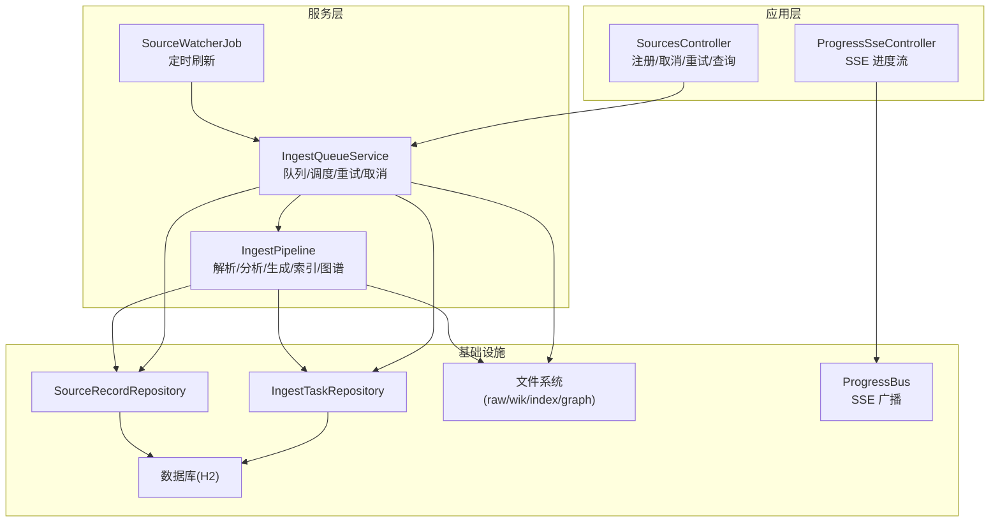
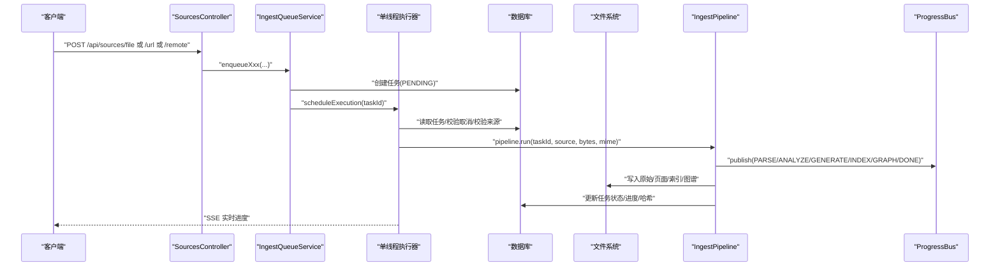
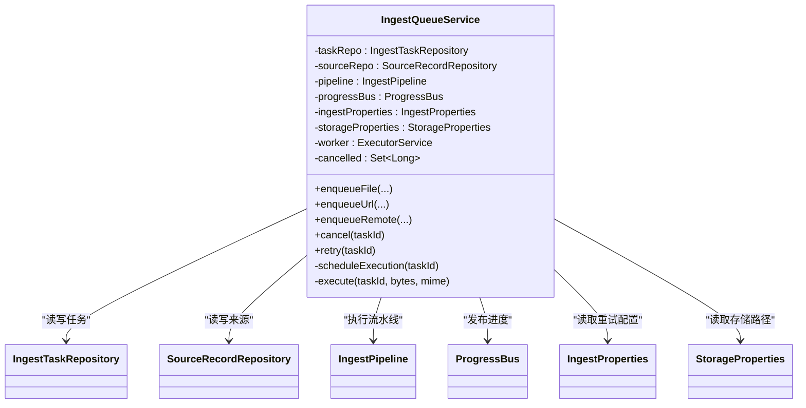
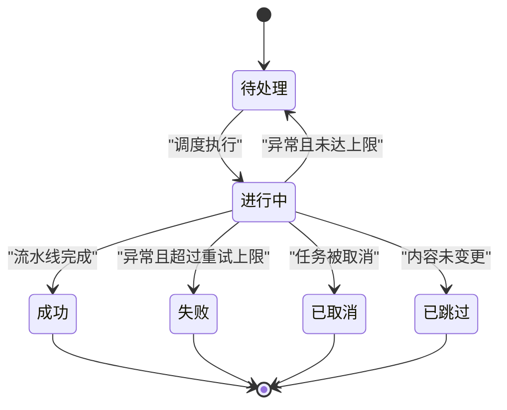
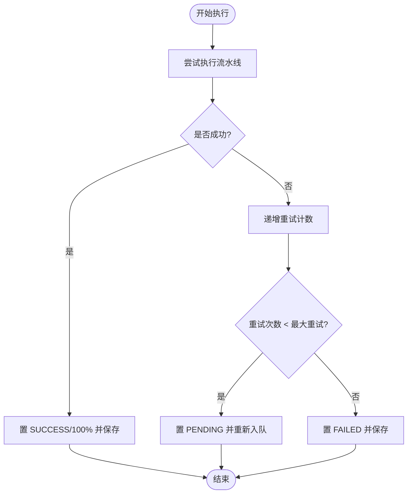
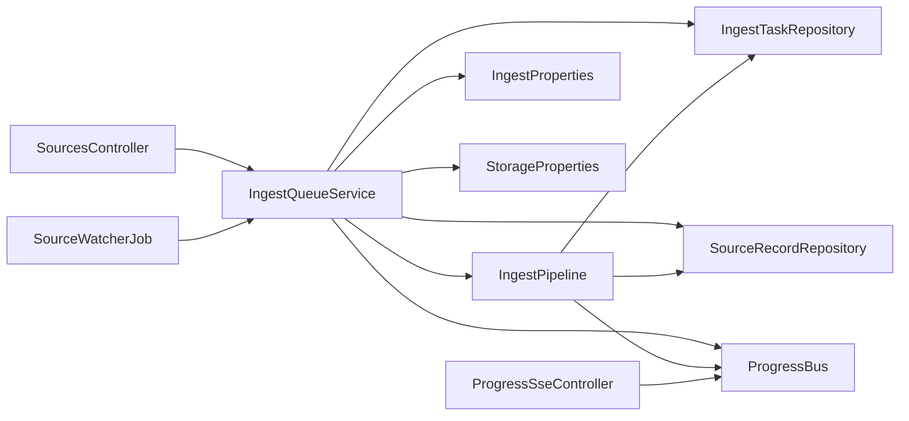

# 任务队列管理

<cite>
**本文引用的文件**
- [IngestQueueService.java](file://src/main/java/com/example/llmwiki/queue/IngestQueueService.java)
- [IngestTask.java](file://src/main/java/com/example/llmwiki/domain/IngestTask.java)
- [IngestTaskRepository.java](file://src/main/java/com/example/llmwiki/repository/IngestTaskRepository.java)
- [IngestProperties.java](file://src/main/java/com/example/llmwiki/config/IngestProperties.java)
- [IngestPipeline.java](file://src/main/java/com/example/llmwiki/ingest/IngestPipeline.java)
- [ProgressBus.java](file://src/main/java/com/example/llmwiki/progress/ProgressBus.java)
- [ProgressEvent.java](file://src/main/java/com/example/llmwiki/progress/ProgressEvent.java)
- [ProgressSseController.java](file://src/main/java/com/example/llmwiki/api/ProgressSseController.java)
- [SourcesController.java](file://src/main/java/com/example/llmwiki/api/SourcesController.java)
- [StorageProperties.java](file://src/main/java/com/example/llmwiki/config/StorageProperties.java)
- [application.yml](file://src/main/resources/application.yml)
- [QuartzConfig.java](file://src/main/java/com/example/llmwiki/scheduler/QuartzConfig.java)
- [SourceWatcherJob.java](file://src/main/java/com/example/llmwiki/scheduler/SourceWatcherJob.java)
- [SourceRecord.java](file://src/main/java/com/example/llmwiki/domain/SourceRecord.java)
</cite>

## 目录
1. [简介](#简介)
2. [项目结构](#项目结构)
3. [核心组件](#核心组件)
4. [架构总览](#架构总览)
5. [详细组件分析](#详细组件分析)
6. [依赖分析](#依赖分析)
7. [性能考虑](#性能考虑)
8. [故障排查指南](#故障排查指南)
9. [结论](#结论)
10. [附录](#附录)

## 简介
本技术文档围绕 LLM Wiki 任务队列管理系统中的 IngestQueueService 设计与实现展开，系统采用 Spring 技术栈，结合数据库持久化、单线程串行执行、取消标志与失败重试机制，构建了稳定可恢复的任务队列。本文从架构设计、任务调度策略、并发控制、任务优先级管理、状态流转、重试机制、性能监控、任务持久化与扩展性等方面进行全面阐述，并辅以可视化图示帮助读者快速理解。

## 项目结构
系统采用分层与功能域划分相结合的组织方式：
- 队列与调度：queue、scheduler
- 数据模型：domain
- 业务流水线：ingest
- 进度事件总线：progress
- API 控制器：api
- 配置：config
- 资源与持久化：repository
- 应用配置：resources/application.yml

图表来源
- [SourcesController.java:1-102](file://src/main/java/com/example/llmwiki/api/SourcesController.java#L1-L102)
- [ProgressSseController.java:1-37](file://src/main/java/com/example/llmwiki/api/ProgressSseController.java#L1-L37)
- [IngestQueueService.java:1-214](file://src/main/java/com/example/llmwiki/queue/IngestQueueService.java#L1-L214)
- [IngestPipeline.java:1-251](file://src/main/java/com/example/llmwiki/ingest/IngestPipeline.java#L1-L251)
- [SourceWatcherJob.java:1-68](file://src/main/java/com/example/llmwiki/scheduler/SourceWatcherJob.java#L1-L68)
- [IngestTaskRepository.java:1-18](file://src/main/java/com/example/llmwiki/repository/IngestTaskRepository.java#L1-L18)
- [StorageProperties.java:1-29](file://src/main/java/com/example/llmwiki/config/StorageProperties.java#L1-L29)
- [ProgressBus.java:1-61](file://src/main/java/com/example/llmwiki/progress/ProgressBus.java#L1-L61)

章节来源
- [application.yml:1-84](file://src/main/resources/application.yml#L1-L84)

## 核心组件
- IngestQueueService：负责任务入队、调度、执行、取消、重试与系统恢复；使用单线程串行执行器保障顺序一致性。
- IngestPipeline：两阶段链式处理（解析→分析→生成→索引/图谱），并发布阶段进度事件。
- ProgressBus/ProgressEvent：任务级进度事件总线，支持 SSE 推送与最近事件回放。
- IngestTask/SourceRecord：任务与来源的数据模型，持久化于数据库。
- IngestTaskRepository：任务查询与排序接口。
- StorageProperties：存储路径配置（raw、wiki、index、graph）。
- Quartz 定时任务：SourceWatcherJob 周期扫描 watchEnabled 的来源并重新入队。

章节来源
- [IngestQueueService.java:1-214](file://src/main/java/com/example/llmwiki/queue/IngestQueueService.java#L1-L214)
- [IngestPipeline.java:1-251](file://src/main/java/com/example/llmwiki/ingest/IngestPipeline.java#L1-L251)
- [ProgressBus.java:1-61](file://src/main/java/com/example/llmwiki/progress/ProgressBus.java#L1-L61)
- [ProgressEvent.java:1-43](file://src/main/java/com/example/llmwiki/progress/ProgressEvent.java#L1-L43)
- [IngestTask.java:1-62](file://src/main/java/com/example/llmwiki/domain/IngestTask.java#L1-L62)
- [SourceRecord.java:1-64](file://src/main/java/com/example/llmwiki/domain/SourceRecord.java#L1-L64)
- [IngestTaskRepository.java:1-18](file://src/main/java/com/example/llmwiki/repository/IngestTaskRepository.java#L1-L18)
- [StorageProperties.java:1-29](file://src/main/java/com/example/llmwiki/config/StorageProperties.java#L1-L29)
- [QuartzConfig.java:1-90](file://src/main/java/com/example/llmwiki/scheduler/QuartzConfig.java#L1-L90)
- [SourceWatcherJob.java:1-68](file://src/main/java/com/example/llmwiki/scheduler/SourceWatcherJob.java#L1-L68)

## 架构总览
系统采用“数据库持久化 + 单线程串行 worker”的队列模型，确保任务状态一致与幂等处理。任务生命周期由数据库状态驱动，执行过程通过进度事件总线实时反馈。定时任务负责周期性刷新外部来源，保持知识库新鲜度。

图表来源
- [SourcesController.java:45-61](file://src/main/java/com/example/llmwiki/api/SourcesController.java#L45-L61)
- [IngestQueueService.java:73-113](file://src/main/java/com/example/llmwiki/queue/IngestQueueService.java#L73-L113)
- [IngestQueueService.java:159-212](file://src/main/java/com/example/llmwiki/queue/IngestQueueService.java#L159-L212)
- [IngestPipeline.java:65-109](file://src/main/java/com/example/llmwiki/ingest/IngestPipeline.java#L65-L109)
- [ProgressBus.java:43-55](file://src/main/java/com/example/llmwiki/progress/ProgressBus.java#L43-L55)

## 详细组件分析

### IngestQueueService：队列管理与执行
- 设计要点
  - 基于数据库的任务表驱动状态机，确保系统重启后可恢复。
  - 单线程串行执行器，避免并发冲突，简化锁与事务复杂度。
  - 取消标志集，支持在队列中取消 PENDING 任务。
  - 失败重试：根据配置的最大重试次数，自动将任务转回 PENDING 并延迟重试。
- 关键流程
  - 入队：创建任务并持久化，发布“已入队”事件。
  - 调度：提交到单线程执行器，按 ID 升序顺序执行。
  - 执行：设置 RUNNING/STARTED，调用流水线，成功则置 SUCCESS/100%，失败则递增重试计数并退回 PENDING。
  - 恢复：启动时将 RUNNING 任务标记为 PENDING 并重新入队。
  - 取消：加入取消集合并将 PENDING 任务置 CANCELLED。
  - 重试：清零重试计数并重新入队。
- 并发与线程安全
  - 单线程执行器保证串行执行。
  - 取消标志使用并发集合，避免竞争条件。
  - 任务与来源读写均通过 JPA 仓库访问，由 Spring 管理事务边界。

图表来源
- [IngestQueueService.java:38-49](file://src/main/java/com/example/llmwiki/queue/IngestQueueService.java#L38-L49)
- [IngestTaskRepository.java:12-17](file://src/main/java/com/example/llmwiki/repository/IngestTaskRepository.java#L12-L17)
- [IngestPipeline.java:48-63](file://src/main/java/com/example/llmwiki/ingest/IngestPipeline.java#L48-L63)
- [ProgressBus.java:19-21](file://src/main/java/com/example/llmwiki/progress/ProgressBus.java#L19-L21)
- [IngestProperties.java:22-25](file://src/main/java/com/example/llmwiki/config/IngestProperties.java#L22-L25)
- [StorageProperties.java:15-28](file://src/main/java/com/example/llmwiki/config/StorageProperties.java#L15-L28)

章节来源
- [IngestQueueService.java:53-68](file://src/main/java/com/example/llmwiki/queue/IngestQueueService.java#L53-L68)
- [IngestQueueService.java:73-113](file://src/main/java/com/example/llmwiki/queue/IngestQueueService.java#L73-L113)
- [IngestQueueService.java:115-134](file://src/main/java/com/example/llmwiki/queue/IngestQueueService.java#L115-L134)
- [IngestQueueService.java:136-149](file://src/main/java/com/example/llmwiki/queue/IngestQueueService.java#L136-L149)
- [IngestQueueService.java:151-157](file://src/main/java/com/example/llmwiki/queue/IngestQueueService.java#L151-L157)
- [IngestQueueService.java:159-212](file://src/main/java/com/example/llmwiki/queue/IngestQueueService.java#L159-L212)

### 任务优先级管理
- 当前实现
  - 无显式优先级字段或队列排序策略，所有任务按 ID 升序串行执行。
  - 通过“取消标志集”支持即时取消 PENDING 任务，但不改变执行顺序。
- 建议扩展
  - 引入优先级字段与队列排序策略（如按优先级+创建时间）。
  - 对高频来源或关键任务可提升优先级权重。
  - 结合线程池扩展（见“扩展性设计”）实现多通道并行。

章节来源
- [IngestTask.java:38-40](file://src/main/java/com/example/llmwiki/domain/IngestTask.java#L38-L40)
- [IngestTaskRepository.java:16](file://src/main/java/com/example/llmwiki/repository/IngestTaskRepository.java#L16)
- [IngestQueueService.java:51](file://src/main/java/com/example/llmwiki/queue/IngestQueueService.java#L51)

### 并发处理策略
- 线程池配置
  - 使用单线程执行器，守护线程，名称为“ingest-worker”。
  - workerThreads 配置项存在但当前未生效（仍为单线程）。
- 任务执行监控
  - 通过 ProgressBus 发布阶段事件，前端通过 SSE 实时接收。
  - 任务状态与进度持久化至数据库，支持断点续跑。
- 死锁预防
  - 单线程串行避免锁竞争与死锁风险。
  - 任务执行期间不持有长事务，尽量缩短事务范围。

章节来源
- [IngestQueueService.java:45-49](file://src/main/java/com/example/llmwiki/queue/IngestQueueService.java#L45-L49)
- [IngestProperties.java:24](file://src/main/java/com/example/llmwiki/config/IngestProperties.java#L24)
- [ProgressBus.java:43-55](file://src/main/java/com/example/llmwiki/progress/ProgressBus.java#L43-L55)

### 任务状态管理
- 状态定义
  - PENDING/RUNNING/SUCCESS/FAILED/CANCELLED/SKIPPED。
- 状态转换
  - 入队：QUEUED→PENDING。
  - 执行：PENDING→RUNNING；成功→SUCCESS；失败→FAILED；取消→CANCELLED；内容未变更→SKIPPED。
- 数据一致性
  - 任务状态与进度写回数据库，保证重启后可恢复。
  - 流水线阶段通过 publish 方法持续上报进度。

图表来源
- [IngestTask.java:38-40](file://src/main/java/com/example/llmwiki/domain/IngestTask.java#L38-L40)
- [IngestPipeline.java:77-80](file://src/main/java/com/example/llmwiki/ingest/IngestPipeline.java#L77-L80)
- [IngestQueueService.java:164-168](file://src/main/java/com/example/llmwiki/queue/IngestQueueService.java#L164-L168)
- [IngestQueueService.java:194-211](file://src/main/java/com/example/llmwiki/queue/IngestQueueService.java#L194-L211)

### 任务重试机制
- 失败检测
  - 捕获异常并记录错误信息。
- 自动重试
  - 重试计数加一，若小于最大重试次数则退回 PENDING 并重新入队。
- 最大重试次数
  - 默认值来自配置项 ingest.max-retry。
- 退避策略
  - 当前未实现指数退避；建议引入退避策略以降低抖动。

图表来源
- [IngestQueueService.java:194-211](file://src/main/java/com/example/llmwiki/queue/IngestQueueService.java#L194-L211)
- [IngestProperties.java:23](file://src/main/java/com/example/llmwiki/config/IngestProperties.java#L23)

章节来源
- [IngestQueueService.java:194-211](file://src/main/java/com/example/llmwiki/queue/IngestQueueService.java#L194-L211)
- [IngestProperties.java:23](file://src/main/java/com/example/llmwiki/config/IngestProperties.java#L23)

### 性能监控
- 队列长度
  - 通过任务表查询最近若干任务，结合前端展示。
- 处理速度
  - 基于任务 STARTED/FINISHED 时间差计算平均耗时。
- 资源使用率
  - 通过系统指标采集（JVM/数据库/文件系统）评估吞吐与瓶颈。
- 进度可观测性
  - SSE 实时推送阶段进度，前端可绘制趋势图。

章节来源
- [IngestTaskRepository.java:14](file://src/main/java/com/example/llmwiki/repository/IngestTaskRepository.java#L14)
- [ProgressSseController.java:27-35](file://src/main/java/com/example/llmwiki/api/ProgressSseController.java#L27-L35)
- [ProgressBus.java:23-24](file://src/main/java/com/example/llmwiki/progress/ProgressBus.java#L23-L24)

### 任务持久化
- 任务状态保存
  - 任务状态、阶段、进度、错误信息、时间戳均持久化。
- 系统重启恢复
  - 启动时将 RUNNING 任务标记为 PENDING 并重新入队，确保不丢失。
- 数据一致性
  - 任务与来源实体映射到数据库表，使用 JPA 管理事务。

章节来源
- [IngestTask.java:35-60](file://src/main/java/com/example/llmwiki/domain/IngestTask.java#L35-L60)
- [SourceRecord.java:35-62](file://src/main/java/com/example/llmwiki/domain/SourceRecord.java#L35-L62)
- [IngestTaskRepository.java:16](file://src/main/java/com/example/llmwiki/repository/IngestTaskRepository.java#L16)
- [IngestQueueService.java:54-62](file://src/main/java/com/example/llmwiki/queue/IngestQueueService.java#L54-L62)

### 扩展性设计
- 动态调整队列大小
  - 当前为单线程，建议引入可配置的线程池大小与队列容量。
- 负载均衡
  - 多实例部署时，可通过数据库状态协调避免重复执行。
- 分布式处理
  - 引入消息中间件（如 Kafka/RabbitMQ）解耦队列与执行器，实现水平扩展。
- 定时刷新
  - Quartz 定时任务按 cron 周期扫描 watchEnabled 来源，自动重新入队。

章节来源
- [IngestProperties.java:24](file://src/main/java/com/example/llmwiki/config/IngestProperties.java#L24)
- [QuartzConfig.java:74-79](file://src/main/java/com/example/llmwiki/scheduler/QuartzConfig.java#L74-L79)
- [SourceWatcherJob.java:38-66](file://src/main/java/com/example/llmwiki/scheduler/SourceWatcherJob.java#L38-L66)

## 依赖分析
- 组件耦合
  - IngestQueueService 依赖仓库、流水线、进度总线与配置。
  - IngestPipeline 依赖解析器、LLM 客户端、索引与图谱服务。
  - ProgressBus 作为事件广播中心，被 API 控制器与流水线共享。
- 外部依赖
  - Spring Data JPA/H2 用于数据持久化。
  - Quartz 用于定时任务。
  - SSE 用于前端进度推送。

图表来源
- [IngestQueueService.java:38-43](file://src/main/java/com/example/llmwiki/queue/IngestQueueService.java#L38-L43)
- [IngestPipeline.java:52-62](file://src/main/java/com/example/llmwiki/ingest/IngestPipeline.java#L52-L62)
- [ProgressBus.java:19-21](file://src/main/java/com/example/llmwiki/progress/ProgressBus.java#L19-L21)
- [SourcesController.java:36-38](file://src/main/java/com/example/llmwiki/api/SourcesController.java#L36-L38)
- [SourceWatcherJob.java:33-35](file://src/main/java/com/example/llmwiki/scheduler/SourceWatcherJob.java#L33-L35)

## 性能考虑
- 单线程串行执行简化了并发控制，但吞吐受限。
- 建议
  - 引入线程池与优先级队列，按来源类型/重要性分流。
  - 将 I/O 密集步骤（下载/解析/嵌入）异步化，减少阻塞。
  - 对高频来源采用缓存与增量更新，避免重复处理。
  - 监控数据库连接池与磁盘 IO，防止成为瓶颈。

## 故障排查指南
- 任务卡在 RUNNING
  - 检查是否存在长时间运行的流水线步骤；查看数据库 FINISHED 字段是否更新。
- 任务频繁重试
  - 查看错误信息与重试计数，确认是否为瞬时异常；必要时增加最大重试或引入退避。
- 取消无效
  - 确认任务状态仍为 PENDING；取消标志集是否正确加入。
- 进度不更新
  - 检查 SSE 连接与 ProgressBus 订阅者列表；确认最近事件队列是否正常。

章节来源
- [IngestQueueService.java:115-124](file://src/main/java/com/example/llmwiki/queue/IngestQueueService.java#L115-L124)
- [IngestQueueService.java:194-211](file://src/main/java/com/example/llmwiki/queue/IngestQueueService.java#L194-L211)
- [ProgressBus.java:26-41](file://src/main/java/com/example/llmwiki/progress/ProgressBus.java#L26-L41)

## 结论
IngestQueueService 通过“数据库驱动 + 单线程串行执行 + 进度事件总线”的组合，实现了稳定、可恢复的任务队列。当前设计在一致性与易维护性上具备优势，但在吞吐与扩展性方面仍有改进空间。建议引入线程池与优先级队列、退避策略与分布式消息中间件，以满足更高负载场景下的需求。

## 附录
- 配置项摘要
  - llm-wiki.ingest.max-retry：最大重试次数
  - llm-wiki.ingest.worker-threads：工作线程数（当前未生效）
  - llm-wiki.scheduler.enabled/cron：定时刷新开关与周期
  - llm-wiki.storage.*：存储根目录与子目录

章节来源
- [application.yml:71-77](file://src/main/resources/application.yml#L71-L77)
- [IngestProperties.java:22-31](file://src/main/java/com/example/llmwiki/config/IngestProperties.java#L22-L31)
- [StorageProperties.java:18-27](file://src/main/java/com/example/llmwiki/config/StorageProperties.java#L18-L27)