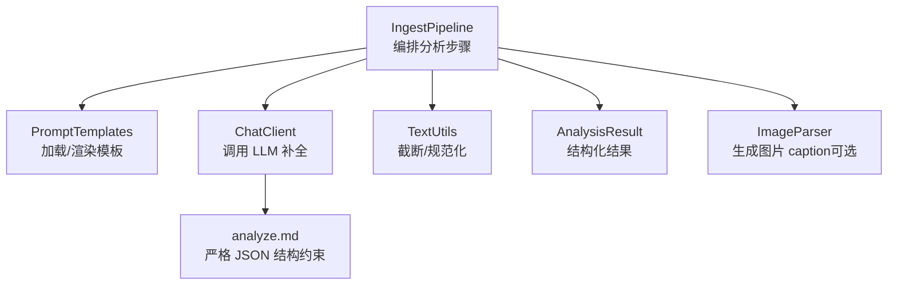
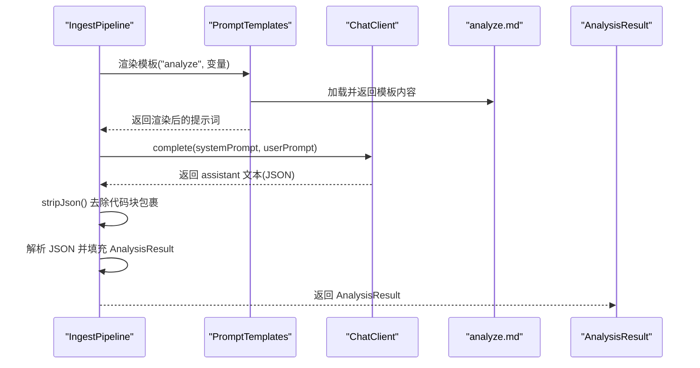
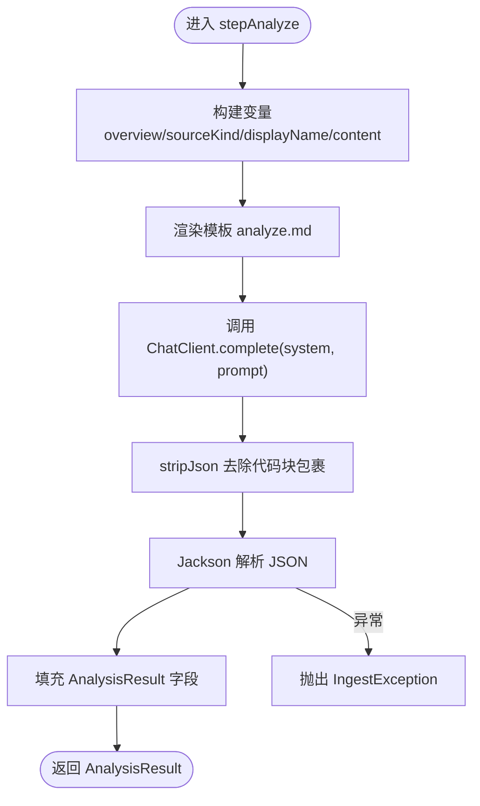
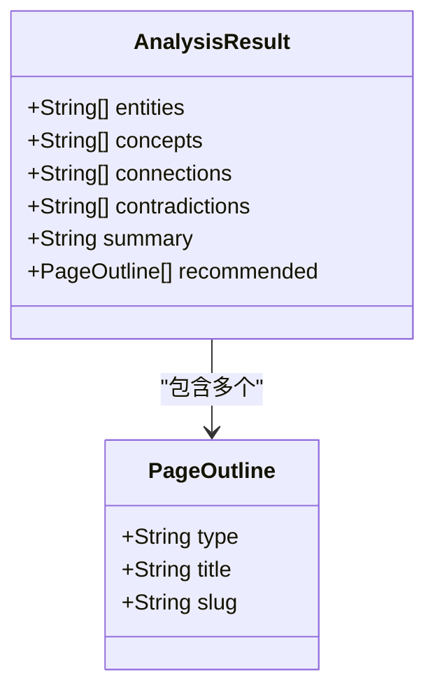
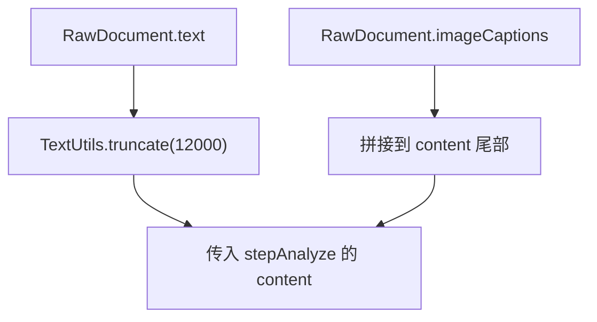
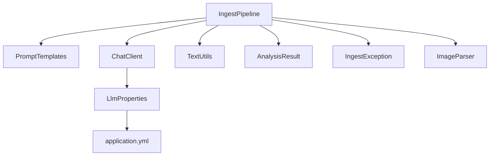

# 分析阶段

<cite>
**本文引用的文件**
- [IngestPipeline.java](file://src/main/java/com/example/llmwiki/ingest/IngestPipeline.java)
- [AnalysisResult.java](file://src/main/java/com/example/llmwiki/domain/AnalysisResult.java)
- [PromptTemplates.java](file://src/main/java/com/example/llmwiki/ingest/PromptTemplates.java)
- [analyze.md](file://src/main/resources/prompts/analyze.md)
- [ChatClient.java](file://src/main/java/com/example/llmwiki/llm/ChatClient.java)
- [TextUtils.java](file://src/main/java/com/example/llmwiki/util/TextUtils.java)
- [ImageParser.java](file://src/main/java/com/example/llmwiki/parser/impl/ImageParser.java)
- [IngestException.java](file://src/main/java/com/example/llmwiki/ingest/IngestException.java)
- [application.yml](file://src/main/resources/application.yml)
- [LlmProperties.java](file://src/main/java/com/example/llmwiki/config/LlmProperties.java)
- [RawDocument.java](file://src/main/java/com/example/llmwiki/domain/RawDocument.java)
</cite>

## 目录
1. [简介](#简介)
2. [项目结构](#项目结构)
3. [核心组件](#核心组件)
4. [架构总览](#架构总览)
5. [详细组件分析](#详细组件分析)
6. [依赖关系分析](#依赖关系分析)
7. [性能考量](#性能考量)
8. [故障排查指南](#故障排查指南)
9. [结论](#结论)
10. [附录](#附录)

## 简介
本章节聚焦摄取流水线的 ANALYZE 阶段，系统性阐述如何利用大语言模型（LLM）对解析后的原始内容进行结构化分析，并产出 AnalysisResult 数据。重点包括：
- 如何构建分析提示词模板（Prompt）
- 如何调用 ChatClient.complete() 获取 JSON 响应
- 如何解析与校验 LLM 输出
- AnalysisResult 的数据结构与字段语义
- 内容截断机制（CONTENT_LIMIT=12000 字符）与图像描述处理
- JSON 解析异常处理与数据验证策略
- 提示词优化技巧与 LLM 输出质量控制方法

## 项目结构
分析阶段位于摄取流水线的第二步，紧随 PARSE 阶段之后。其关键参与者如下：
- IngestPipeline：负责编排 ANALYZE 步骤，调用 LLM 并解析结果
- PromptTemplates：加载并渲染 Markdown 模板，支持占位符替换
- analyze.md：严格的 JSON 结构约束与示例，定义分析输出格式
- ChatClient：封装 OpenAI 兼容的聊天补全接口，返回纯文本内容
- TextUtils：提供截断、规范化等文本处理能力
- ImageParser：在启用视觉能力时，为图片生成 caption，作为分析输入的一部分
- AnalysisResult：承载分析阶段的结构化输出
- IngestException：统一的摄取异常类型，便于上层捕获与处理



图表来源
- [IngestPipeline.java:111-139](file://src/main/java/com/example/llmwiki/ingest/IngestPipeline.java#L111-L139)
- [PromptTemplates.java:24-30](file://src/main/java/com/example/llmwiki/ingest/PromptTemplates.java#L24-L30)
- [ChatClient.java:37-86](file://src/main/java/com/example/llmwiki/llm/ChatClient.java#L37-L86)
- [TextUtils.java:73-78](file://src/main/java/com/example/llmwiki/util/TextUtils.java#L73-L78)
- [ImageParser.java:48-69](file://src/main/java/com/example/llmwiki/parser/impl/ImageParser.java#L48-L69)
- [analyze.md:1-27](file://src/main/resources/prompts/analyze.md#L1-L27)

章节来源
- [IngestPipeline.java:111-139](file://src/main/java/com/example/llmwiki/ingest/IngestPipeline.java#L111-L139)
- [PromptTemplates.java:24-30](file://src/main/java/com/example/llmwiki/ingest/PromptTemplates.java#L24-L30)
- [ChatClient.java:37-86](file://src/main/java/com/example/llmwiki/llm/ChatClient.java#L37-L86)
- [TextUtils.java:73-78](file://src/main/java/com/example/llmwiki/util/TextUtils.java#L73-L78)
- [ImageParser.java:48-69](file://src/main/java/com/example/llmwiki/parser/impl/ImageParser.java#L48-L69)
- [analyze.md:1-27](file://src/main/resources/prompts/analyze.md#L1-L27)

## 核心组件
- IngestPipeline.stepAnalyze：执行 ANALYZE 步骤，构建变量、渲染模板、调用 LLM、解析 JSON、构造 AnalysisResult
- PromptTemplates.render：从类路径资源加载 Markdown 模板，替换占位符
- analyze.md：定义严格 JSON 结构、字段约束与示例
- ChatClient.complete：发送 system + user 消息，返回 assistant 文本
- TextUtils.truncate：按字符上限截断文本，避免上下文超限
- ImageParser：在启用视觉能力时，为图片生成 caption 并加入分析输入
- AnalysisResult：承载 entities、concepts、connections、contradictions、summary、recommended 等字段

章节来源
- [IngestPipeline.java:111-139](file://src/main/java/com/example/llmwiki/ingest/IngestPipeline.java#L111-L139)
- [PromptTemplates.java:24-30](file://src/main/java/com/example/llmwiki/ingest/PromptTemplates.java#L24-L30)
- [analyze.md:1-27](file://src/main/resources/prompts/analyze.md#L1-L27)
- [ChatClient.java:37-86](file://src/main/java/com/example/llmwiki/llm/ChatClient.java#L37-L86)
- [TextUtils.java:73-78](file://src/main/java/com/example/llmwiki/util/TextUtils.java#L73-L78)
- [ImageParser.java:48-69](file://src/main/java/com/example/llmwiki/parser/impl/ImageParser.java#L48-L69)
- [AnalysisResult.java:21-54](file://src/main/java/com/example/llmwiki/domain/AnalysisResult.java#L21-L54)

## 架构总览
下图展示了 ANALYZE 阶段的端到端流程：从解析后的 RawDocument 出发，构建分析提示词，调用 LLM，解析 JSON，最终得到 AnalysisResult。



图表来源
- [IngestPipeline.java:111-139](file://src/main/java/com/example/llmwiki/ingest/IngestPipeline.java#L111-L139)
- [PromptTemplates.java:24-30](file://src/main/java/com/example/llmwiki/ingest/PromptTemplates.java#L24-L30)
- [ChatClient.java:37-86](file://src/main/java/com/example/llmwiki/llm/ChatClient.java#L37-L86)
- [analyze.md:1-27](file://src/main/resources/prompts/analyze.md#L1-L27)

## 详细组件分析

### stepAnalyze 方法实现
- 变量构建
  - overview：基于现有 wiki 统计信息（页数、节点数、边数）动态注入
  - sourceKind/displayName：来源类型与显示名
  - content：将正文截断至 CONTENT_LIMIT，并拼接所有图片 caption
- 模板渲染
  - 使用 PromptTemplates.render("analyze", vars) 将变量注入 analyze.md
- LLM 调用
  - ChatClient.complete(systemPrompt, prompt) 发送 system + user 消息
  - systemPrompt 强制要求“严格输出 JSON”，减少非结构化输出
- JSON 解析与校验
  - stripJson 去除可能的 ```json ... ``` 包裹
  - 使用 Jackson 解析 JSON，逐字段读取并填充 AnalysisResult
  - 对 recommended 字段使用嵌套对象解析，构建 PageOutline 列表
- 错误处理
  - 解析失败抛出 IngestException，便于上层统一处理



图表来源
- [IngestPipeline.java:111-139](file://src/main/java/com/example/llmwiki/ingest/IngestPipeline.java#L111-L139)
- [ChatClient.java:37-86](file://src/main/java/com/example/llmwiki/llm/ChatClient.java#L37-L86)
- [TextUtils.java:73-78](file://src/main/java/com/example/llmwiki/util/TextUtils.java#L73-L78)
- [IngestException.java:9-17](file://src/main/java/com/example/llmwiki/ingest/IngestException.java#L9-L17)

章节来源
- [IngestPipeline.java:111-139](file://src/main/java/com/example/llmwiki/ingest/IngestPipeline.java#L111-L139)
- [ChatClient.java:37-86](file://src/main/java/com/example/llmwiki/llm/ChatClient.java#L37-L86)
- [TextUtils.java:73-78](file://src/main/java/com/example/llmwiki/util/TextUtils.java#L73-L78)
- [IngestException.java:9-17](file://src/main/java/com/example/llmwiki/ingest/IngestException.java#L9-L17)

### 提示词模板与结构约束
- analyze.md 明确要求输出严格 JSON，包含以下字段：
  - summary：中文摘要，字数受控
  - entities：关键实体列表
  - concepts：关键概念列表
  - connections：与已有 wiki 页面 slug 的可能关联
  - contradictions：与已有知识库可能矛盾的点
  - recommended：推荐页面结构（type/title/slug）
- 字段约束与示例：
  - type 限定取值集合
  - slug 规范化为短横线分隔的小写串
  - 控制 entities + concepts + recommended 总数上限
  - summary 控制在 200 字以内
- 动态注入：
  - {{overview}}：现有 wiki 概览统计
  - {{sourceKind}}/{{displayName}}：来源信息
  - {{content}}：正文 + 图片 caption

章节来源
- [analyze.md:1-27](file://src/main/resources/prompts/analyze.md#L1-L27)
- [PromptTemplates.java:24-30](file://src/main/java/com/example/llmwiki/ingest/PromptTemplates.java#L24-L30)

### AnalysisResult 数据结构
AnalysisResult 是 ANALYZE 阶段的结构化输出载体，字段语义如下：
- entities：关键实体列表（人物/组织/产品/事件等专有名词）
- concepts：抽象概念/方法/术语列表
- connections：与已有 wiki 页面 slug 的可能关联
- contradictions：与已有知识库可能矛盾的点
- summary：中文摘要
- recommended：推荐页面结构列表，每项包含 type/title/slug

此外，内部类 PageOutline 用于承载 recommended 中的单个条目。



图表来源
- [AnalysisResult.java:21-54](file://src/main/java/com/example/llmwiki/domain/AnalysisResult.java#L21-L54)

章节来源
- [AnalysisResult.java:21-54](file://src/main/java/com/example/llmwiki/domain/AnalysisResult.java#L21-L54)

### 内容截断机制与图像描述处理
- 截断机制
  - CONTENT_LIMIT=12000 字符，超过部分被截断
  - 通过 TextUtils.truncate 实现，确保 LLM 上下文长度可控
- 图像描述处理
  - 若启用 Vision，则 ImageParser 会调用 VisionClient 生成 caption，并将 caption 列表附加到 content
  - 若未启用 Vision，则仅记录元信息，不生成 caption
  - 所有 caption 会被拼接到 content 尾部，供 LLM 分析



图表来源
- [IngestPipeline.java:116-117](file://src/main/java/com/example/llmwiki/ingest/IngestPipeline.java#L116-L117)
- [TextUtils.java:73-78](file://src/main/java/com/example/llmwiki/util/TextUtils.java#L73-L78)
- [ImageParser.java:48-69](file://src/main/java/com/example/llmwiki/parser/impl/ImageParser.java#L48-L69)

章节来源
- [IngestPipeline.java:116-117](file://src/main/java/com/example/llmwiki/ingest/IngestPipeline.java#L116-L117)
- [TextUtils.java:73-78](file://src/main/java/com/example/llmwiki/util/TextUtils.java#L73-L78)
- [ImageParser.java:48-69](file://src/main/java/com/example/llmwiki/parser/impl/ImageParser.java#L48-L69)

### JSON 解析异常处理与数据验证策略
- stripJson 兼容性处理
  - 自动去除可能存在的 ```json ... ``` 包裹，提升鲁棒性
- 解析与回退
  - 使用 Jackson 解析 JSON，逐字段读取
  - 对 recommended 的嵌套对象进行安全解析，避免空字段导致异常
- 异常传播
  - 解析失败或 LLM 返回为空时，抛出 IngestException，便于上层统一处理
- 数据验证
  - analyze.md 中对字段数量、长度、取值范围进行了约束，有助于减少无效输出

章节来源
- [IngestPipeline.java:111-139](file://src/main/java/com/example/llmwiki/ingest/IngestPipeline.java#L111-L139)
- [IngestPipeline.java:227-243](file://src/main/java/com/example/llmwiki/ingest/IngestPipeline.java#L227-L243)
- [IngestException.java:9-17](file://src/main/java/com/example/llmwiki/ingest/IngestException.java#L9-L17)
- [analyze.md:14-18](file://src/main/resources/prompts/analyze.md#L14-L18)

### 提示词优化技巧与 LLM 输出质量控制
- 明确约束
  - 在 analyze.md 中明确要求“严格 JSON”、“控制总数上限”、“限制摘要长度”等，降低歧义
- 动态注入上下文
  - 注入 overview 与来源信息，帮助 LLM 更准确地识别实体与概念
- 固定 system prompt
  - 在调用 ChatClient.complete 时，使用固定 system prompt 强制 JSON 输出
- 截断与拼接
  - 对长文本进行截断，并拼接图片 caption，平衡信息密度与上下文长度
- 兼容性处理
  - stripJson 去除代码块包裹，提升解析成功率

章节来源
- [analyze.md:1-27](file://src/main/resources/prompts/analyze.md#L1-L27)
- [IngestPipeline.java:111-139](file://src/main/java/com/example/llmwiki/ingest/IngestPipeline.java#L111-L139)
- [ChatClient.java:37-42](file://src/main/java/com/example/llmwiki/llm/ChatClient.java#L37-L42)
- [TextUtils.java:73-78](file://src/main/java/com/example/llmwiki/util/TextUtils.java#L73-L78)
- [ImageParser.java:48-69](file://src/main/java/com/example/llmwiki/parser/impl/ImageParser.java#L48-L69)

## 依赖关系分析
- IngestPipeline 依赖
  - PromptTemplates：模板加载与渲染
  - ChatClient：LLM 调用
  - TextUtils：文本截断
  - ImageParser：图片 caption 生成（可选）
  - AnalysisResult：结果建模
  - IngestException：异常传播
- ChatClient 依赖
  - LlmProperties：模型配置（baseUrl/model/temperature/apiKey）
  - Rest 客户端：HTTP 请求
- 配置
  - application.yml：llm-wiki.llm.chat.* 与 llm-wiki.storage.* 配置



图表来源
- [IngestPipeline.java:52-63](file://src/main/java/com/example/llmwiki/ingest/IngestPipeline.java#L52-L63)
- [ChatClient.java:30-32](file://src/main/java/com/example/llmwiki/llm/ChatClient.java#L30-L32)
- [LlmProperties.java:19-61](file://src/main/java/com/example/llmwiki/config/LlmProperties.java#L19-L61)
- [application.yml:39-57](file://src/main/resources/application.yml#L39-L57)

章节来源
- [IngestPipeline.java:52-63](file://src/main/java/com/example/llmwiki/ingest/IngestPipeline.java#L52-L63)
- [ChatClient.java:30-32](file://src/main/java/com/example/llmwiki/llm/ChatClient.java#L30-L32)
- [LlmProperties.java:19-61](file://src/main/java/com/example/llmwiki/config/LlmProperties.java#L19-L61)
- [application.yml:39-57](file://src/main/resources/application.yml#L39-L57)

## 性能考量
- 上下文长度控制
  - CONTENT_LIMIT=12000 字符，避免超出模型上下文窗口
  - 对长文本进行截断，同时保留图片 caption 以增强理解
- 模型参数
  - temperature=0.2，降低随机性，提高输出稳定性
  - 模型选择 gpt-4o-mini，兼顾成本与性能
- I/O 与并发
  - worker-threads=1，避免高并发下的资源争用
  - 建议在生产环境根据吞吐需求调整线程数与重试次数

章节来源
- [IngestPipeline.java:50](file://src/main/java/com/example/llmwiki/ingest/IngestPipeline.java#L50)
- [application.yml:43](file://src/main/resources/application.yml#L43)
- [application.yml:76](file://src/main/resources/application.yml#L76)

## 故障排查指南
- LLM 返回为空或非 JSON
  - 检查 system prompt 是否正确强制 JSON 输出
  - 使用 stripJson 去除代码块包裹后再次解析
- JSON 解析失败
  - 确认 analyze.md 的结构约束是否满足
  - 检查 recommended 字段的嵌套对象是否完整
- API Key 未配置
  - ChatClient 会在未配置时抛出异常，检查 llm-wiki.llm.chat.api-key
- 图片未生成 caption
  - 确认 llm-wiki.llm.vision.enabled=true 且已配置 API Key
- 内容未变化导致跳过
  - 检查 contentHash 是否正确计算与更新

章节来源
- [IngestPipeline.java:119](file://src/main/java/com/example/llmwiki/ingest/IngestPipeline.java#L119)
- [IngestPipeline.java:227-243](file://src/main/java/com/example/llmwiki/ingest/IngestPipeline.java#L227-L243)
- [ChatClient.java:52-54](file://src/main/java/com/example/llmwiki/llm/ChatClient.java#L52-L54)
- [application.yml:52-57](file://src/main/resources/application.yml#L52-L57)
- [IngestPipeline.java:77-80](file://src/main/java/com/example/llmwiki/ingest/IngestPipeline.java#L77-L80)

## 结论
ANALYZE 阶段通过严格的提示词模板、可控的上下文长度与稳健的 JSON 解析策略，实现了对原始内容的结构化分析。结合图片 caption 的增强输入与 system prompt 的强约束，显著提升了输出质量与一致性。建议在生产环境中持续监控 LLM 返回稳定性，并根据业务反馈迭代提示词与约束条件。

## 附录
- 关键配置项
  - llm-wiki.llm.chat.base-url/model/api-key/temperature
  - llm-wiki.storage.root-dir/wiki-dir/index-dir/graph-dir
  - llm-wiki.ingest.max-retry/worker-threads
- 关键常量
  - CONTENT_LIMIT=12000
  - temperature=0.2

章节来源
- [application.yml:39-77](file://src/main/resources/application.yml#L39-L77)
- [IngestPipeline.java:50](file://src/main/java/com/example/llmwiki/ingest/IngestPipeline.java#L50)
- [ChatClient.java:58](file://src/main/java/com/example/llmwiki/llm/ChatClient.java#L58)