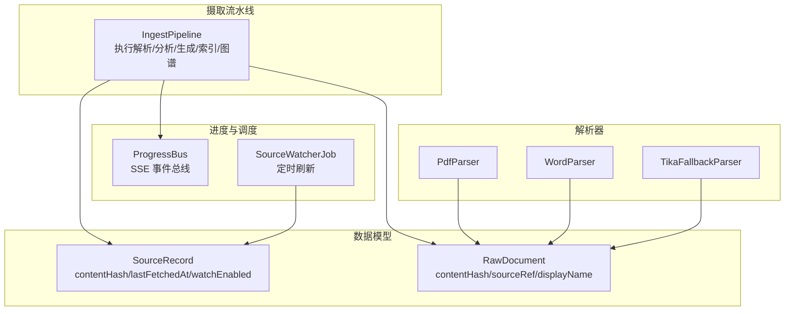
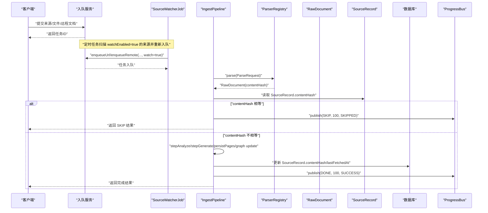
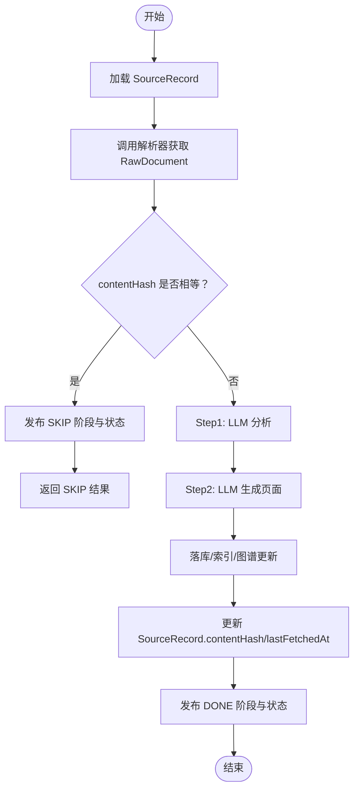
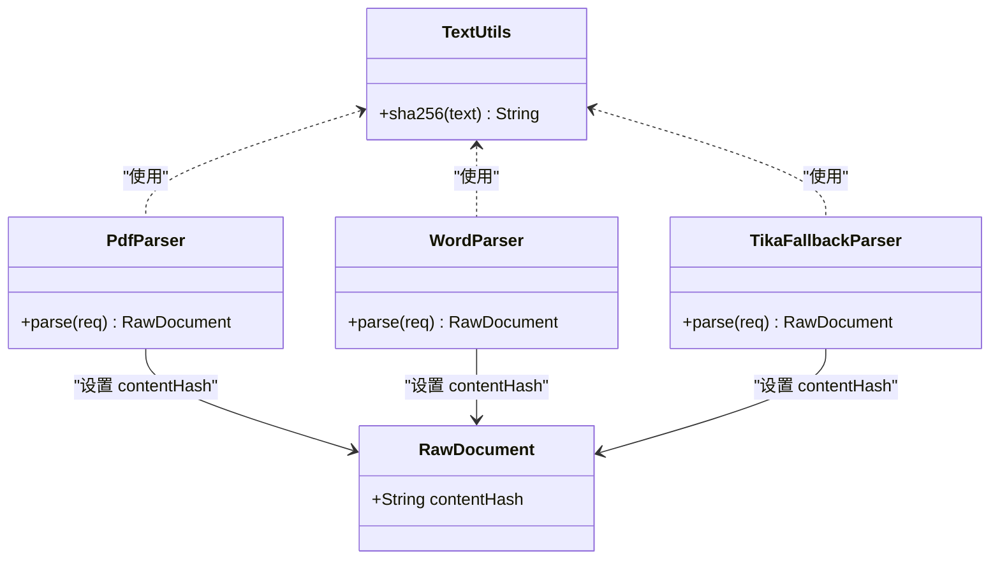
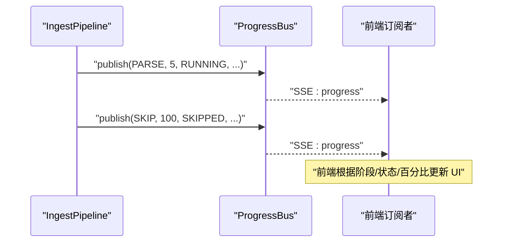
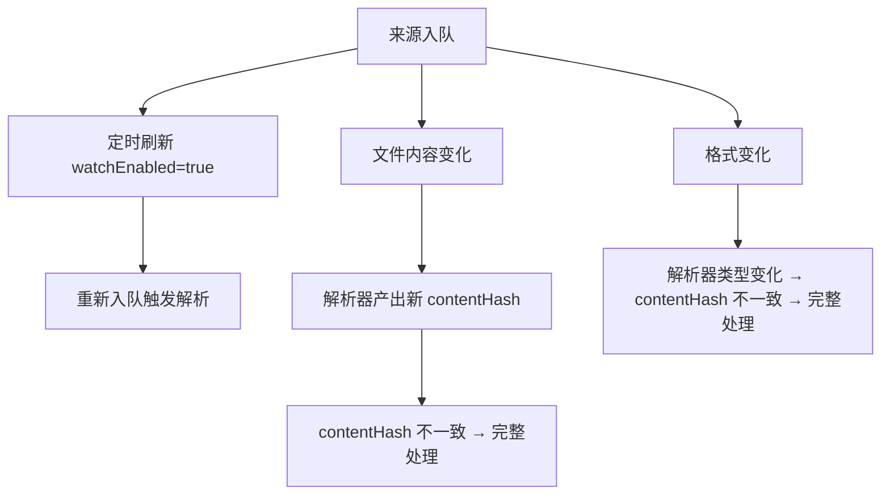
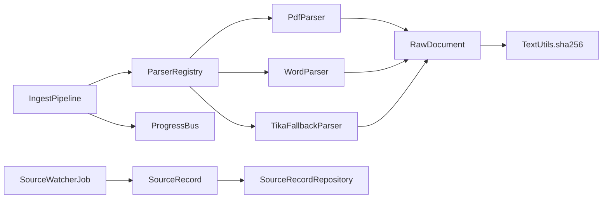

# 增量缓存机制

<cite>
**本文引用的文件**
- [IngestPipeline.java](file://src/main/java/com/example/llmwiki/ingest/IngestPipeline.java)
- [SourceRecord.java](file://src/main/java/com/example/llmwiki/domain/SourceRecord.java)
- [RawDocument.java](file://src/main/java/com/example/llmwiki/domain/RawDocument.java)
- [PdfParser.java](file://src/main/java/com/example/llmwiki/parser/impl/PdfParser.java)
- [WordParser.java](file://src/main/java/com/example/llmwiki/parser/impl/WordParser.java)
- [TikaFallbackParser.java](file://src/main/java/com/example/llmwiki/parser/impl/TikaFallbackParser.java)
- [TextUtils.java](file://src/main/java/com/example/llmwiki/util/TextUtils.java)
- [ProgressBus.java](file://src/main/java/com/example/llmwiki/progress/ProgressBus.java)
- [ProgressEvent.java](file://src/main/java/com/example/llmwiki/progress/ProgressEvent.java)
- [SourceWatcherJob.java](file://src/main/java/com/example/llmwiki/scheduler/SourceWatcherJob.java)
- [SourceRecordRepository.java](file://src/main/java/com/example/llmwiki/repository/SourceRecordRepository.java)
- [SourcesController.java](file://src/main/java/com/example/llmwiki/api/SourcesController.java)
</cite>

## 目录
1. [简介](#简介)
2. [项目结构](#项目结构)
3. [核心组件](#核心组件)
4. [架构总览](#架构总览)
5. [详细组件分析](#详细组件分析)
6. [依赖分析](#依赖分析)
7. [性能考虑](#性能考虑)
8. [故障排查指南](#故障排查指南)
9. [结论](#结论)
10. [附录](#附录)

## 简介
本文围绕摄取流水线的“增量缓存”机制展开，系统性说明基于 contentHash 的内容变更检测原理与实现，覆盖以下主题：
- 在解析前如何检查 SourceRecord 的 contentHash，以及如何比较新解析的 RawDocument.contentHash
- 如何据此决定是否跳过整个处理流程
- contentHash 的计算方法与更新策略
- SKIP 状态的处理与进度通知机制
- 缓存失效场景（文件修改、格式变化、内容更新等）
- 性能优化建议与存储空间管理策略

## 项目结构
与增量缓存直接相关的核心模块包括：
- 摄取流水线：负责执行解析、分析、生成、索引与图谱更新，并进行缓存判定与更新
- 数据模型：SourceRecord 与 RawDocument 均包含 contentHash 字段
- 解析器：不同格式的解析器在产出 RawDocument 时计算 contentHash
- 进度总线：发布阶段、百分比、状态与消息，支持 SSE 推送
- 定时刷新：对启用 watch 的来源进行周期性再入队，触发缓存失效与重新计算

**图表来源**
- [IngestPipeline.java:65-109](file://src/main/java/com/example/llmwiki/ingest/IngestPipeline.java#L65-L109)
- [SourceRecord.java:47-58](file://src/main/java/com/example/llmwiki/domain/SourceRecord.java#L47-L58)
- [RawDocument.java:34-35](file://src/main/java/com/example/llmwiki/domain/RawDocument.java#L34-L35)
- [PdfParser.java:68-75](file://src/main/java/com/example/llmwiki/parser/impl/PdfParser.java#L68-L75)
- [WordParser.java:58-64](file://src/main/java/com/example/llmwiki/parser/impl/WordParser.java#L58-L64)
- [TikaFallbackParser.java:39-46](file://src/main/java/com/example/llmwiki/parser/impl/TikaFallbackParser.java#L39-L46)
- [ProgressBus.java:43-55](file://src/main/java/com/example/llmwiki/progress/ProgressBus.java#L43-L55)
- [SourceWatcherJob.java:44-61](file://src/main/java/com/example/llmwiki/scheduler/SourceWatcherJob.java#L44-L61)

**章节来源**
- [IngestPipeline.java:65-109](file://src/main/java/com/example/llmwiki/ingest/IngestPipeline.java#L65-L109)
- [SourceRecord.java:47-58](file://src/main/java/com/example/llmwiki/domain/SourceRecord.java#L47-L58)
- [RawDocument.java:34-35](file://src/main/java/com/example/llmwiki/domain/RawDocument.java#L34-L35)
- [ProgressBus.java:43-55](file://src/main/java/com/example/llmwiki/progress/ProgressBus.java#L43-L55)
- [SourceWatcherJob.java:44-61](file://src/main/java/com/example/llmwiki/scheduler/SourceWatcherJob.java#L44-L61)

## 核心组件
- 摄取流水线（IngestPipeline）
  - 在解析后读取 SourceRecord.contentHash 与 RawDocument.contentHash
  - 若一致则发布 SKIP 状态并返回，否则继续执行分析、生成、索引与图谱更新
  - 将新的 contentHash 与时间戳写回 SourceRecord 并持久化
- 数据模型（SourceRecord、RawDocument）
  - 两者均包含 contentHash 字段，作为内容指纹
  - SourceRecord 还包含 lastFetchedAt 与 watchEnabled，用于调度与失效控制
- 解析器（PdfParser、WordParser、TikaFallbackParser）
  - 在产出 RawDocument 时计算 contentHash
  - 不同解析器对“内容”的定义略有差异（如 PDF 可包含 OCR 图像描述）
- 进度总线（ProgressBus、ProgressEvent）
  - 发布阶段、百分比、状态与消息，支持 SSE 推送
  - 提供最近 50 条事件的回放能力
- 定时刷新（SourceWatcherJob）
  - 扫描 watchEnabled=true 的来源，按类型重新入队，强制触发缓存失效与重新解析

**章节来源**
- [IngestPipeline.java:76-103](file://src/main/java/com/example/llmwiki/ingest/IngestPipeline.java#L76-L103)
- [SourceRecord.java:47-58](file://src/main/java/com/example/llmwiki/domain/SourceRecord.java#L47-L58)
- [RawDocument.java:34-35](file://src/main/java/com/example/llmwiki/domain/RawDocument.java#L34-L35)
- [PdfParser.java:68-75](file://src/main/java/com/example/llmwiki/parser/impl/PdfParser.java#L68-L75)
- [WordParser.java:58-64](file://src/main/java/com/example/llmwiki/parser/impl/WordParser.java#L58-L64)
- [TikaFallbackParser.java:39-46](file://src/main/java/com/example/llmwiki/parser/impl/TikaFallbackParser.java#L39-L46)
- [ProgressBus.java:43-55](file://src/main/java/com/example/llmwiki/progress/ProgressBus.java#L43-L55)
- [SourceWatcherJob.java:44-61](file://src/main/java/com/example/llmwiki/scheduler/SourceWatcherJob.java#L44-L61)

## 架构总览
下图展示了从“来源入队”到“增量缓存判定与处理”的完整流程。

**图表来源**
- [IngestPipeline.java:65-109](file://src/main/java/com/example/llmwiki/ingest/IngestPipeline.java#L65-L109)
- [SourceWatcherJob.java:44-61](file://src/main/java/com/example/llmwiki/scheduler/SourceWatcherJob.java#L44-L61)
- [ProgressBus.java:43-55](file://src/main/java/com/example/llmwiki/progress/ProgressBus.java#L43-L55)
- [SourceRecordRepository.java](file://src/main/java/com/example/llmwiki/repository/SourceRecordRepository.java#L19)

## 详细组件分析

### 增量缓存判定与处理流程
- 解析前：从数据库加载 SourceRecord，读取其 contentHash
- 解析后：解析器产出 RawDocument，其中包含 contentHash
- 比较逻辑：若 SourceRecord.contentHash 与 RawDocument.contentHash 相等，则判定内容未变
- 跳过处理：发布 SKIP 阶段与状态，不执行后续分析、生成、索引与图谱更新
- 更新策略：若内容发生变化，将新的 contentHash 与当前时间写回 SourceRecord 并持久化

**图表来源**
- [IngestPipeline.java:65-109](file://src/main/java/com/example/llmwiki/ingest/IngestPipeline.java#L65-L109)

**章节来源**
- [IngestPipeline.java:76-103](file://src/main/java/com/example/llmwiki/ingest/IngestPipeline.java#L76-L103)

### contentHash 的计算方法与更新策略
- 计算方法
  - 使用 SHA-256 对“内容字符串”进行摘要，返回十六进制小写字符串
  - 不同解析器对“内容字符串”的定义不同：
    - PDF：文本正文 + 图像描述（以分隔符拼接）
    - Word：纯文本
    - Tika 兜底：解析后的纯文本
- 更新策略
  - 成功完成处理后，将 RawDocument.contentHash 写回到 SourceRecord.contentHash
  - 同时更新 lastFetchedAt 为当前时间
  - 保存到数据库

**图表来源**
- [TextUtils.java:26-41](file://src/main/java/com/example/llmwiki/util/TextUtils.java#L26-L41)
- [PdfParser.java:68-75](file://src/main/java/com/example/llmwiki/parser/impl/PdfParser.java#L68-L75)
- [WordParser.java:58-64](file://src/main/java/com/example/llmwiki/parser/impl/WordParser.java#L58-L64)
- [TikaFallbackParser.java:39-46](file://src/main/java/com/example/llmwiki/parser/impl/TikaFallbackParser.java#L39-L46)

**章节来源**
- [TextUtils.java:26-41](file://src/main/java/com/example/llmwiki/util/TextUtils.java#L26-L41)
- [PdfParser.java:68-75](file://src/main/java/com/example/llmwiki/parser/impl/PdfParser.java#L68-L75)
- [WordParser.java:58-64](file://src/main/java/com/example/llmwiki/parser/impl/WordParser.java#L58-L64)
- [TikaFallbackParser.java:39-46](file://src/main/java/com/example/llmwiki/parser/impl/TikaFallbackParser.java#L39-L46)

### SKIP 状态的处理与进度通知机制
- 进度事件字段
  - 阶段：PARSE、ANALYZE、GENERATE、INDEX、GRAPH、DONE、SKIP
  - 百分比：SKIP 通常为 100
  - 状态：SKIPPED
- SSE 推送
  - ProgressBus 维护 SSE 订阅者列表，发布事件并回放最近 50 条
  - 新订阅者可收到历史上下文，确保前端状态一致

**图表来源**
- [IngestPipeline.java:245-249](file://src/main/java/com/example/llmwiki/ingest/IngestPipeline.java#L245-L249)
- [ProgressBus.java:43-55](file://src/main/java/com/example/llmwiki/progress/ProgressBus.java#L43-L55)
- [ProgressEvent.java:28-38](file://src/main/java/com/example/llmwiki/progress/ProgressEvent.java#L28-L38)

**章节来源**
- [IngestPipeline.java:245-249](file://src/main/java/com/example/llmwiki/ingest/IngestPipeline.java#L245-L249)
- [ProgressBus.java:43-55](file://src/main/java/com/example/llmwiki/progress/ProgressBus.java#L43-L55)
- [ProgressEvent.java:28-38](file://src/main/java/com/example/llmwiki/progress/ProgressEvent.java#L28-L38)

### 缓存失效场景与处理
- 文件修改
  - 文件内容变化 → 解析器产出的新 contentHash 与旧值不同 → 触发完整处理流程
- 格式变化
  - 同一来源切换为不同解析器（例如从 Word 切换到 PDF）→ 解析器产出不同的 contentHash → 触发完整处理流程
- 内容更新
  - 文本或图像描述变化 → contentHash 变化 → 触发完整处理流程
- 定时刷新
  - 对启用 watch 的来源，定时任务会重新入队，强制触发缓存失效与重新解析
  - 更新 lastFetchedAt，便于追踪刷新时间

**图表来源**
- [SourceWatcherJob.java:44-61](file://src/main/java/com/example/llmwiki/scheduler/SourceWatcherJob.java#L44-L61)
- [IngestPipeline.java:76-80](file://src/main/java/com/example/llmwiki/ingest/IngestPipeline.java#L76-L80)

**章节来源**
- [SourceWatcherJob.java:44-61](file://src/main/java/com/example/llmwiki/scheduler/SourceWatcherJob.java#L44-L61)
- [IngestPipeline.java:76-80](file://src/main/java/com/example/llmwiki/ingest/IngestPipeline.java#L76-L80)

## 依赖分析
- 组件耦合
  - IngestPipeline 依赖解析器注册表、LLM 客户端、嵌入客户端、仓库与进度总线
  - 解析器依赖 TextUtils 进行哈希计算
  - 定时任务依赖 SourceRecordRepository 与入队服务
- 关键依赖链
  - 解析器 → RawDocument.contentHash
  - IngestPipeline → 比较 contentHash → 决策是否跳过
  - 定时任务 → SourceRecord.watchEnabled → 强制刷新

**图表来源**
- [IngestPipeline.java:52-63](file://src/main/java/com/example/llmwiki/ingest/IngestPipeline.java#L52-L63)
- [PdfParser.java:68-75](file://src/main/java/com/example/llmwiki/parser/impl/PdfParser.java#L68-L75)
- [WordParser.java:58-64](file://src/main/java/com/example/llmwiki/parser/impl/WordParser.java#L58-L64)
- [TikaFallbackParser.java:39-46](file://src/main/java/com/example/llmwiki/parser/impl/TikaFallbackParser.java#L39-L46)
- [TextUtils.java:26-41](file://src/main/java/com/example/llmwiki/util/TextUtils.java#L26-L41)
- [SourceWatcherJob.java:33-35](file://src/main/java/com/example/llmwiki/scheduler/SourceWatcherJob.java#L33-L35)
- [SourceRecordRepository.java:13-20](file://src/main/java/com/example/llmwiki/repository/SourceRecordRepository.java#L13-L20)

**章节来源**
- [IngestPipeline.java:52-63](file://src/main/java/com/example/llmwiki/ingest/IngestPipeline.java#L52-L63)
- [SourceRecordRepository.java:13-20](file://src/main/java/com/example/llmwiki/repository/SourceRecordRepository.java#L13-L20)

## 性能考虑
- 哈希计算成本
  - 对大文档进行 SHA-256 计算属于 CPU 密集型操作，建议：
    - 仅在必要时计算（即解析器内部）
    - 对 PDF 中的图像进行采样（如限制页数）以降低 OCR 成本
- I/O 与网络
  - 远程来源（URL/飞书/钉钉）的抓取与解析可能成为瓶颈，建议：
    - 合理设置并发与超时
    - 对重复来源进行去重与短路判断
- 数据库写入
  - 仅在内容变化时更新 SourceRecord，避免不必要的写放大
- 前端体验
  - 通过 ProgressBus 的 SSE 推送及时反馈进度，减少用户等待
- 存储空间管理
  - 建议：
    - 定期清理历史任务日志与临时文件
    - 对大体积文档采用流式处理与分块索引
    - 限制单个文档大小与图像数量，防止内存与磁盘压力过大

## 故障排查指南
- 常见问题
  - contentHash 一直不变化
    - 检查解析器是否正确拼接“内容字符串”
    - 确认 TextUtils.sha256 的输入是否包含所有影响内容的字段
  - 跳过逻辑未生效
    - 确认 SourceRecord.contentHash 是否为空（首次解析）
    - 检查数据库是否成功保存新的 contentHash
  - 进度未更新
    - 检查 ProgressBus 是否正常发布事件
    - 确认前端订阅是否建立且未断开
  - 定时刷新无效
    - 检查 IngestProperties.scheduler.enabled 与 watchEnabled 设置
    - 确认 Quartz 任务是否正常执行
- 排查步骤
  - 查看 IngestPipeline 的日志与异常堆栈
  - 核对 SourceRecord.lastFetchedAt 是否更新
  - 验证解析器 parse 方法是否返回正确的 contentHash

**章节来源**
- [IngestPipeline.java:100-103](file://src/main/java/com/example/llmwiki/ingest/IngestPipeline.java#L100-L103)
- [ProgressBus.java:43-55](file://src/main/java/com/example/llmwiki/progress/ProgressBus.java#L43-L55)
- [SourceWatcherJob.java:39-42](file://src/main/java/com/example/llmwiki/scheduler/SourceWatcherJob.java#L39-L42)

## 结论
本增量缓存机制通过 contentHash 实现“内容未变则跳过”的高效策略，结合定时刷新与进度通知，既保证了处理的准确性，又显著降低了重复工作量。实践中需关注解析器对“内容”的定义一致性、哈希计算的成本控制与数据库写入的最小化，以获得最佳性能与用户体验。

## 附录
- 相关接口与配置
  - SourcesController 提供来源注册与任务管理接口，支持 watch 参数开启定时刷新
  - SourceRecordRepository 提供按 watchEnabled 查询的能力，支撑定时刷新任务

**章节来源**
- [SourcesController.java:50-61](file://src/main/java/com/example/llmwiki/api/SourcesController.java#L50-L61)
- [SourceRecordRepository.java](file://src/main/java/com/example/llmwiki/repository/SourceRecordRepository.java#L19)