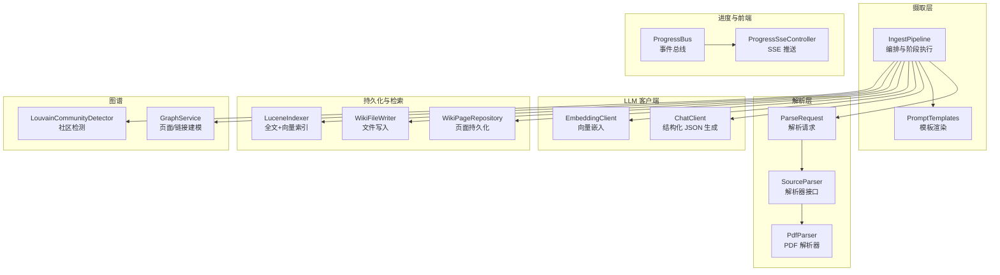
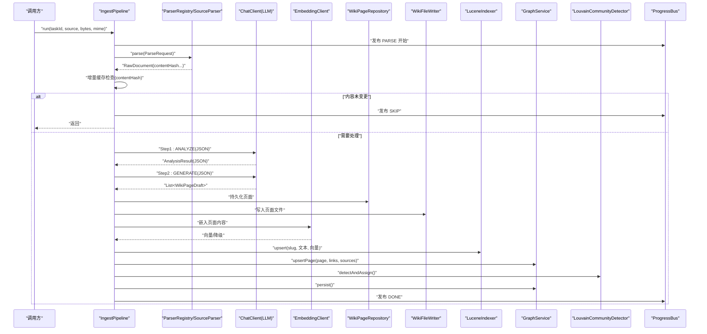
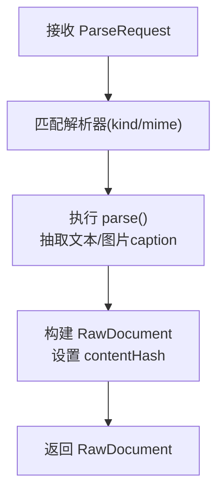
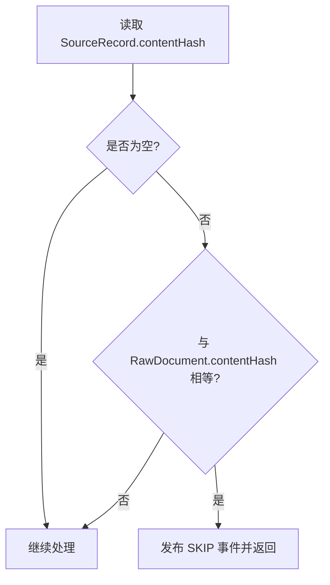
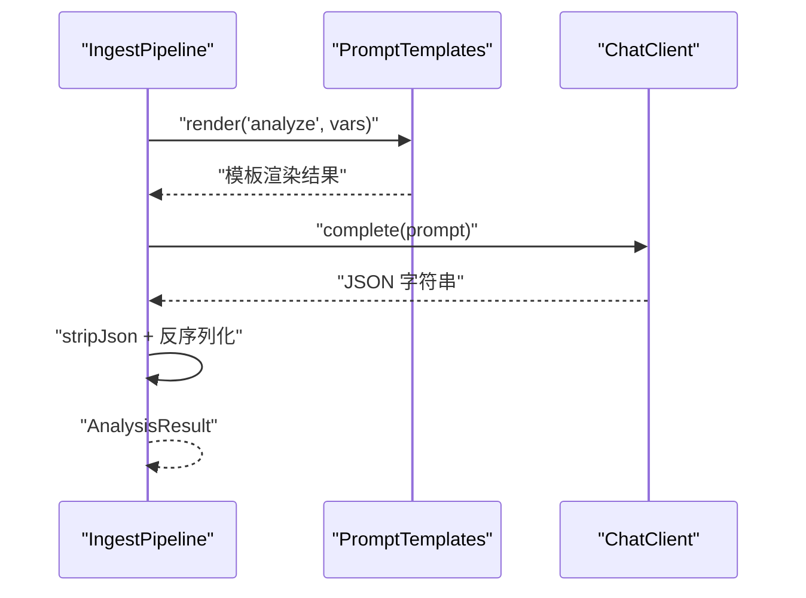
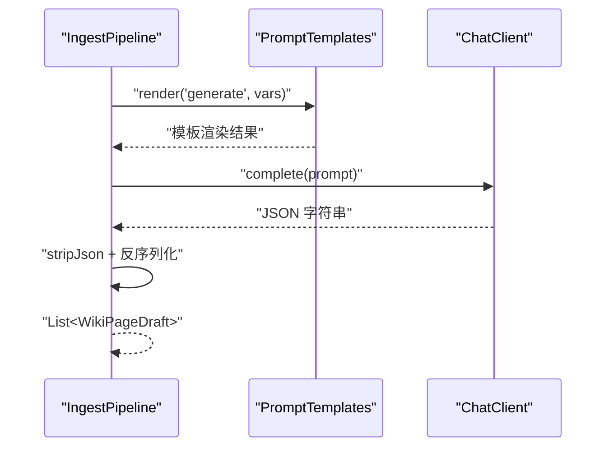
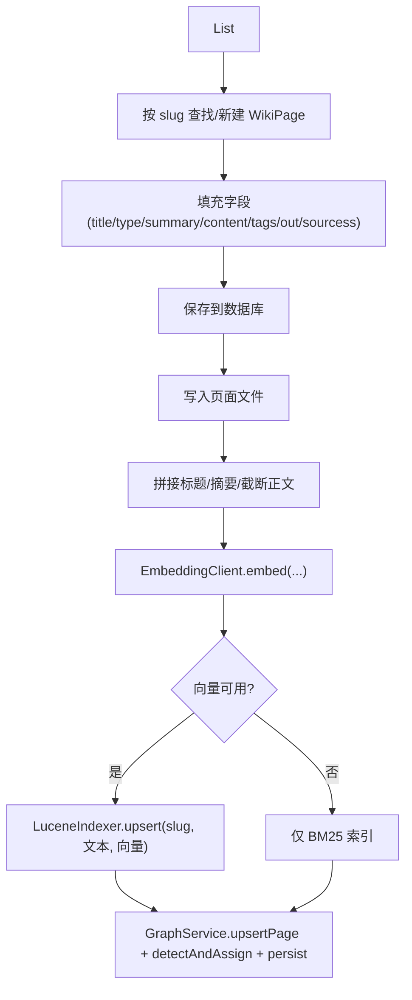
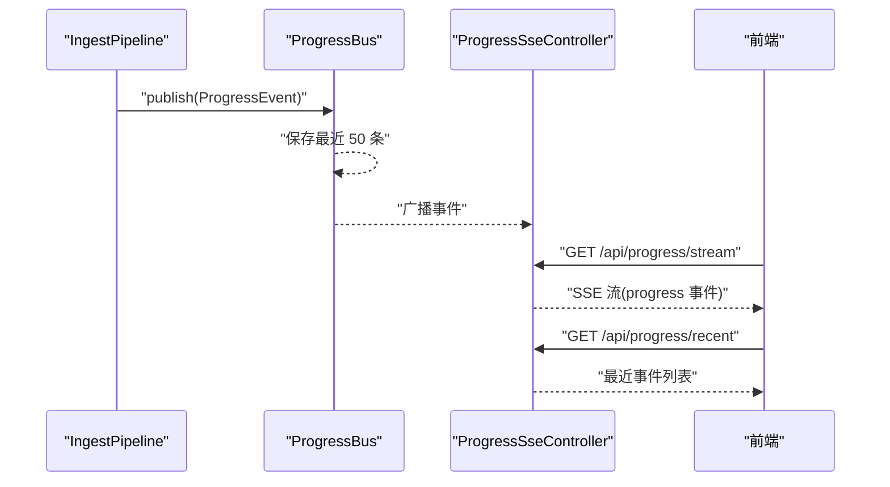
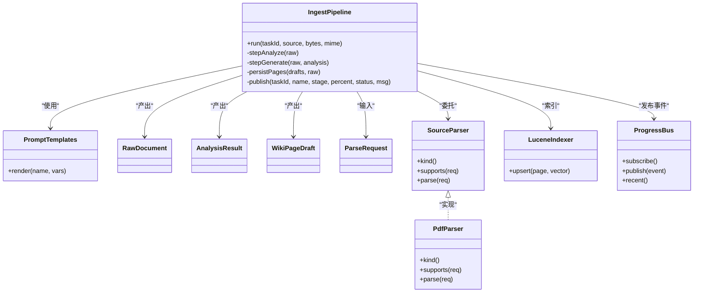

# 摄取流水线

<cite>
**本文引用的文件**
- [IngestPipeline.java](file://src/main/java/com/example/llmwiki/ingest/IngestPipeline.java)
- [IngestException.java](file://src/main/java/com/example/llmwiki/ingest/IngestException.java)
- [PromptTemplates.java](file://src/main/java/com/example/llmwiki/ingest/PromptTemplates.java)
- [RawDocument.java](file://src/main/java/com/example/llmwiki/domain/RawDocument.java)
- [AnalysisResult.java](file://src/main/java/com/example/llmwiki/domain/AnalysisResult.java)
- [WikiPageDraft.java](file://src/main/java/com/example/llmwiki/domain/WikiPageDraft.java)
- [ProgressBus.java](file://src/main/java/com/example/llmwiki/progress/ProgressBus.java)
- [ProgressEvent.java](file://src/main/java/com/example/llmwiki/progress/ProgressEvent.java)
- [ProgressSseController.java](file://src/main/java/com/example/llmwiki/api/ProgressSseController.java)
- [ParseRequest.java](file://src/main/java/com/example/llmwiki/parser/ParseRequest.java)
- [SourceParser.java](file://src/main/java/com/example/llmwiki/parser/SourceParser.java)
- [PdfParser.java](file://src/main/java/com/example/llmwiki/parser/impl/PdfParser.java)
- [LuceneIndexer.java](file://src/main/java/com/example/llmwiki/retrieval/LuceneIndexer.java)
- [analyze.md](file://src/main/resources/prompts/analyze.md)
- [generate.md](file://src/main/resources/prompts/generate.md)
</cite>

## 目录
1. [简介](#简介)
2. [项目结构](#项目结构)
3. [核心组件](#核心组件)
4. [架构总览](#架构总览)
5. [详细组件分析](#详细组件分析)
6. [依赖关系分析](#依赖关系分析)
7. [性能考量](#性能考量)
8. [故障排查指南](#故障排查指南)
9. [结论](#结论)
10. [附录](#附录)

## 简介
本文件面向“LLM Wiki 摄取流水线”的技术文档，系统性阐述两步式链式处理架构：PARSE（解析）→ ANALYZE（分析）→ GENERATE（生成）→ INDEX/GRAPH（索引/图谱）。文档覆盖以下要点：
- 流水线阶段职责与数据流
- 增量缓存机制（基于 contentHash）
- 进度跟踪系统（ProgressBus + SSE）
- 错误处理策略（IngestException、降级与恢复）
- 性能优化技巧（内容截断、批量处理、资源管理）

## 项目结构
围绕“摄取流水线”，后端主要模块如下：
- ingest：流水线编排与阶段实现
- domain：领域模型（RawDocument、AnalysisResult、WikiPageDraft 等）
- parser：多源解析器注册与实现
- progress：进度事件总线与 SSE 推送
- retrieval：Lucene 索引与向量检索
- api：前端交互接口（如进度流）
- resources/prompts：提示词模板

图表来源
- [IngestPipeline.java:65-109](file://src/main/java/com/example/llmwiki/ingest/IngestPipeline.java#L65-L109)
- [PromptTemplates.java:24-30](file://src/main/java/com/example/llmwiki/ingest/PromptTemplates.java#L24-L30)
- [ParseRequest.java:18-34](file://src/main/java/com/example/llmwiki/parser/ParseRequest.java#L18-L34)
- [SourceParser.java:11-21](file://src/main/java/com/example/llmwiki/parser/SourceParser.java#L11-L21)
- [PdfParser.java:38-77](file://src/main/java/com/example/llmwiki/parser/impl/PdfParser.java#L38-L77)
- [LuceneIndexer.java:78-99](file://src/main/java/com/example/llmwiki/retrieval/LuceneIndexer.java#L78-L99)
- [ProgressBus.java:43-55](file://src/main/java/com/example/llmwiki/progress/ProgressBus.java#L43-L55)
- [ProgressSseController.java:27-35](file://src/main/java/com/example/llmwiki/api/ProgressSseController.java#L27-L35)

章节来源
- [IngestPipeline.java:33-44](file://src/main/java/com/example/llmwiki/ingest/IngestPipeline.java#L33-L44)
- [ProgressBus.java:11-16](file://src/main/java/com/example/llmwiki/progress/ProgressBus.java#L11-L16)

## 核心组件
- IngestPipeline：两步式链式处理的编排器，负责阶段调度、增量缓存、进度发布、持久化与索引。
- PromptTemplates：提示词模板加载与变量渲染。
- RawDocument：标准化的原始文档载体，含 contentHash 用于增量缓存。
- AnalysisResult：Step1 结构化分析结果。
- WikiPageDraft：Step2 生成的页面草稿。
- ProgressBus/ProgressEvent：进度事件总线与事件模型，配合 SSE 实时推送。
- ParserRegistry/SourceParser/PdfParser：解析器注册与具体实现（以 PDF 为例）。
- LuceneIndexer：全文检索与向量检索一体化索引。
- GraphService/LouvainCommunityDetector：页面图谱建模与社区检测。

章节来源
- [IngestPipeline.java:48-63](file://src/main/java/com/example/llmwiki/ingest/IngestPipeline.java#L48-L63)
- [PromptTemplates.java:20-42](file://src/main/java/com/example/llmwiki/ingest/PromptTemplates.java#L20-L42)
- [RawDocument.java:18-51](file://src/main/java/com/example/llmwiki/domain/RawDocument.java#L18-L51)
- [AnalysisResult.java:17-55](file://src/main/java/com/example/llmwiki/domain/AnalysisResult.java#L17-L55)
- [WikiPageDraft.java:17-49](file://src/main/java/com/example/llmwiki/domain/WikiPageDraft.java#L17-L49)
- [ProgressBus.java:17-60](file://src/main/java/com/example/llmwiki/progress/ProgressBus.java#L17-L60)
- [ProgressEvent.java:16-42](file://src/main/java/com/example/llmwiki/progress/ProgressEvent.java#L16-L42)
- [SourceParser.java:11-21](file://src/main/java/com/example/llmwiki/parser/SourceParser.java#L11-L21)
- [PdfParser.java:34-112](file://src/main/java/com/example/llmwiki/parser/impl/PdfParser.java#L34-L112)
- [LuceneIndexer.java:36-117](file://src/main/java/com/example/llmwiki/retrieval/LuceneIndexer.java#L36-L117)

## 架构总览
两步式链式处理的完整流程如下：

图表来源
- [IngestPipeline.java:65-109](file://src/main/java/com/example/llmwiki/ingest/IngestPipeline.java#L65-L109)
- [PdfParser.java:56-77](file://src/main/java/com/example/llmwiki/parser/impl/PdfParser.java#L56-L77)
- [LuceneIndexer.java:78-99](file://src/main/java/com/example/llmwiki/retrieval/LuceneIndexer.java#L78-L99)
- [ProgressBus.java:43-55](file://src/main/java/com/example/llmwiki/progress/ProgressBus.java#L43-L55)

## 详细组件分析

### 解析阶段（PARSE）
- 输入：ParseRequest（来源类型、引用、展示名、文件字节、MIME）
- 调用解析器（如 PdfParser）抽取文本与图片 caption，并计算 contentHash
- 输出：RawDocument（包含 contentHash、文本、图片描述、元信息等）

图表来源
- [ParseRequest.java:18-34](file://src/main/java/com/example/llmwiki/parser/ParseRequest.java#L18-L34)
- [SourceParser.java:11-21](file://src/main/java/com/example/llmwiki/parser/SourceParser.java#L11-L21)
- [PdfParser.java:42-77](file://src/main/java/com/example/llmwiki/parser/impl/PdfParser.java#L42-L77)
- [RawDocument.java:18-51](file://src/main/java/com/example/llmwiki/domain/RawDocument.java#L18-L51)

章节来源
- [ParseRequest.java:18-34](file://src/main/java/com/example/llmwiki/parser/ParseRequest.java#L18-L34)
- [SourceParser.java:11-21](file://src/main/java/com/example/llmwiki/parser/SourceParser.java#L11-L21)
- [PdfParser.java:38-77](file://src/main/java/com/example/llmwiki/parser/impl/PdfParser.java#L38-L77)
- [RawDocument.java:18-51](file://src/main/java/com/example/llmwiki/domain/RawDocument.java#L18-L51)

### 增量缓存机制
- 比较 SourceRecord 的 contentHash 与 RawDocument 的 contentHash
- 若一致，则直接发布 SKIP 事件并返回，避免重复处理

图表来源
- [IngestPipeline.java:76-80](file://src/main/java/com/example/llmwiki/ingest/IngestPipeline.java#L76-L80)
- [RawDocument.java:34-35](file://src/main/java/com/example/llmwiki/domain/RawDocument.java#L34-L35)

章节来源
- [IngestPipeline.java:76-80](file://src/main/java/com/example/llmwiki/ingest/IngestPipeline.java#L76-L80)
- [RawDocument.java:34-35](file://src/main/java/com/example/llmwiki/domain/RawDocument.java#L34-L35)

### 分析阶段（ANALYZE）
- 渲染 analyze 模板，传入 overview、来源信息、截断后的正文与图片 caption
- 调用 ChatClient 获取结构化 JSON，解析为 AnalysisResult

图表来源
- [IngestPipeline.java:111-139](file://src/main/java/com/example/llmwiki/ingest/IngestPipeline.java#L111-L139)
- [PromptTemplates.java:24-30](file://src/main/java/com/example/llmwiki/ingest/PromptTemplates.java#L24-L30)
- [analyze.md:1-27](file://src/main/resources/prompts/analyze.md#L1-L27)

章节来源
- [IngestPipeline.java:111-139](file://src/main/java/com/example/llmwiki/ingest/IngestPipeline.java#L111-L139)
- [PromptTemplates.java:20-42](file://src/main/java/com/example/llmwiki/ingest/PromptTemplates.java#L20-L42)
- [analyze.md:1-27](file://src/main/resources/prompts/analyze.md#L1-L27)

### 生成阶段（GENERATE）
- 渲染 generate 模板，传入 AnalysisResult、截断后的正文、来源信息
- 调用 ChatClient 生成多页 WikiPageDraft 列表，校验非空

图表来源
- [IngestPipeline.java:141-177](file://src/main/java/com/example/llmwiki/ingest/IngestPipeline.java#L141-L177)
- [PromptTemplates.java:24-30](file://src/main/java/com/example/llmwiki/ingest/PromptTemplates.java#L24-L30)
- [generate.md:1-34](file://src/main/resources/prompts/generate.md#L1-L34)

章节来源
- [IngestPipeline.java:141-177](file://src/main/java/com/example/llmwiki/ingest/IngestPipeline.java#L141-L177)
- [PromptTemplates.java:20-42](file://src/main/java/com/example/llmwiki/ingest/PromptTemplates.java#L20-L42)
- [generate.md:1-34](file://src/main/resources/prompts/generate.md#L1-L34)

### 索引与图谱阶段（INDEX/GRAPH）
- 持久化页面：按 slug 查找或新建，写入字段并保存
- 文件写入：将页面写入文件系统
- 向量化与索引：截断正文，调用 EmbeddingClient 获取向量，upsert 到 Lucene
- 图谱更新：upsertPage，执行社区检测，持久化

图表来源
- [IngestPipeline.java:179-209](file://src/main/java/com/example/llmwiki/ingest/IngestPipeline.java#L179-L209)
- [LuceneIndexer.java:78-99](file://src/main/java/com/example/llmwiki/retrieval/LuceneIndexer.java#L78-L99)

章节来源
- [IngestPipeline.java:179-209](file://src/main/java/com/example/llmwiki/ingest/IngestPipeline.java#L179-L209)
- [LuceneIndexer.java:36-117](file://src/main/java/com/example/llmwiki/retrieval/LuceneIndexer.java#L36-L117)

### 进度跟踪系统（ProgressBus + SSE）
- ProgressEvent：包含任务 ID、来源展示名、阶段、百分比、状态、消息、时间戳
- ProgressBus：维护 SSE 订阅者列表，广播事件，保留最近 50 条事件
- ProgressSseController：提供 /api/progress/stream 与 /api/progress/recent

图表来源
- [ProgressEvent.java:16-42](file://src/main/java/com/example/llmwiki/progress/ProgressEvent.java#L16-L42)
- [ProgressBus.java:43-55](file://src/main/java/com/example/llmwiki/progress/ProgressBus.java#L43-L55)
- [ProgressSseController.java:27-35](file://src/main/java/com/example/llmwiki/api/ProgressSseController.java#L27-L35)

章节来源
- [ProgressEvent.java:16-42](file://src/main/java/com/example/llmwiki/progress/ProgressEvent.java#L16-L42)
- [ProgressBus.java:17-60](file://src/main/java/com/example/llmwiki/progress/ProgressBus.java#L17-L60)
- [ProgressSseController.java:20-36](file://src/main/java/com/example/llmwiki/api/ProgressSseController.java#L20-L36)

## 依赖关系分析
- IngestPipeline 依赖：
  - ParserRegistry/SourceParser：解析器选择与执行
  - PromptTemplates：模板渲染
  - ChatClient/EmbeddingClient：结构化 JSON 生成与向量嵌入
  - WikiPageRepository/WikiFileWriter：页面持久化与文件写入
  - LuceneIndexer：全文与向量索引
  - GraphService/LouvainCommunityDetector：图谱建模与社区检测
  - ProgressBus：进度事件发布
- 解析器实现（以 PdfParser 为例）依赖：
  - VisionClient（可选）：图片 caption
  - TextUtils：规范化与哈希

图表来源
- [IngestPipeline.java:48-63](file://src/main/java/com/example/llmwiki/ingest/IngestPipeline.java#L48-L63)
- [PromptTemplates.java:20-42](file://src/main/java/com/example/llmwiki/ingest/PromptTemplates.java#L20-L42)
- [RawDocument.java:18-51](file://src/main/java/com/example/llmwiki/domain/RawDocument.java#L18-L51)
- [AnalysisResult.java:17-55](file://src/main/java/com/example/llmwiki/domain/AnalysisResult.java#L17-L55)
- [WikiPageDraft.java:17-49](file://src/main/java/com/example/llmwiki/domain/WikiPageDraft.java#L17-L49)
- [ParseRequest.java:18-34](file://src/main/java/com/example/llmwiki/parser/ParseRequest.java#L18-L34)
- [SourceParser.java:11-21](file://src/main/java/com/example/llmwiki/parser/SourceParser.java#L11-L21)
- [PdfParser.java:34-112](file://src/main/java/com/example/llmwiki/parser/impl/PdfParser.java#L34-L112)
- [LuceneIndexer.java:36-117](file://src/main/java/com/example/llmwiki/retrieval/LuceneIndexer.java#L36-L117)
- [ProgressBus.java:17-60](file://src/main/java/com/example/llmwiki/progress/ProgressBus.java#L17-L60)

章节来源
- [IngestPipeline.java:48-63](file://src/main/java/com/example/llmwiki/ingest/IngestPipeline.java#L48-L63)
- [SourceParser.java:11-21](file://src/main/java/com/example/llmwiki/parser/SourceParser.java#L11-L21)
- [PdfParser.java:34-112](file://src/main/java/com/example/llmwiki/parser/impl/PdfParser.java#L34-L112)
- [LuceneIndexer.java:36-117](file://src/main/java/com/example/llmwiki/retrieval/LuceneIndexer.java#L36-L117)
- [ProgressBus.java:17-60](file://src/main/java/com/example/llmwiki/progress/ProgressBus.java#L17-L60)

## 性能考量
- 内容截断
  - 分析阶段对正文与 caption 合并后进行截断，降低 LLM 上下文长度
  - 生成阶段对正文进行截断，减少 Token 使用
- 向量维度对齐
  - LuceneIndexer 在 upsert 时对向量长度进行对齐，避免维度不匹配
- 成本控制
  - PDF 解析限制最多抽取前 20 页图片进行 caption，控制 Vision LLM 调用成本
- 资源管理
  - LuceneIndexer 初始化与销毁时正确打开/关闭 IndexWriter 与 Directory
- 批量处理
  - 当前流水线逐页处理；如需提升吞吐，可在持久化与索引环节采用批量提交策略（建议在保证一致性前提下评估）

章节来源
- [IngestPipeline.java:50-50](file://src/main/java/com/example/llmwiki/ingest/IngestPipeline.java#L50-L50)
- [IngestPipeline.java:116-117](file://src/main/java/com/example/llmwiki/ingest/IngestPipeline.java#L116-L117)
- [IngestPipeline.java:148-148](file://src/main/java/com/example/llmwiki/ingest/IngestPipeline.java#L148-L148)
- [PdfParser.java:84-84](file://src/main/java/com/example/llmwiki/parser/impl/PdfParser.java#L84-L84)
- [LuceneIndexer.java:87-95](file://src/main/java/com/example/llmwiki/retrieval/LuceneIndexer.java#L87-L95)
- [LuceneIndexer.java:48-73](file://src/main/java/com/example/llmwiki/retrieval/LuceneIndexer.java#L48-L73)

## 故障排查指南
- 异常类型
  - IngestException：Step1/Step2 JSON 解析失败、未生成页面等场景抛出
- 错误处理策略
  - Step1 JSON 解析失败：捕获异常并包装为 IngestException
  - Step2 未生成页面：显式抛出 IngestException
  - 向量嵌入失败：记录告警并降级为仅 BM25 索引
- 重试与降级
  - 建议在调用方或队列层引入幂等与重试策略（例如基于 taskId 与 contentHash 的去重）
  - 当 EmbeddingClient 失败时，LuceneIndexer 仍可 upsert 文本字段，确保基本检索能力
- 进度可观测性
  - 通过 /api/progress/stream 实时查看阶段与百分比
  - 通过 /api/progress/recent 获取最近事件上下文

章节来源
- [IngestException.java:9-17](file://src/main/java/com/example/llmwiki/ingest/IngestException.java#L9-L17)
- [IngestPipeline.java:136-138](file://src/main/java/com/example/llmwiki/ingest/IngestPipeline.java#L136-L138)
- [IngestPipeline.java:173-175](file://src/main/java/com/example/llmwiki/ingest/IngestPipeline.java#L173-L175)
- [IngestPipeline.java:201-204](file://src/main/java/com/example/llmwiki/ingest/IngestPipeline.java#L201-L204)
- [ProgressSseController.java:27-35](file://src/main/java/com/example/llmwiki/api/ProgressSseController.java#L27-L35)

## 结论
本摄取流水线以两步式链式处理为核心，结合增量缓存、结构化 JSON 生成、向量与全文混合检索、以及图谱建模，实现了从多源内容到多页 Wiki 的自动化生产。通过 ProgressBus + SSE 提供实时可观测性，借助 PromptTemplates 与解析器扩展实现高可维护性。在性能方面，通过内容截断、成本控制与资源管理保障了稳定性与效率。

## 附录
- 提示词模板
  - analyze.md：定义 Step1 的 JSON 结构与约束
  - generate.md：定义 Step2 的多页 JSON 结构与约束
- 关键数据模型
  - RawDocument：标准化输入载体
  - AnalysisResult：Step1 结果
  - WikiPageDraft：Step2 产物草稿

章节来源
- [analyze.md:1-27](file://src/main/resources/prompts/analyze.md#L1-L27)
- [generate.md:1-34](file://src/main/resources/prompts/generate.md#L1-L34)
- [RawDocument.java:18-51](file://src/main/java/com/example/llmwiki/domain/RawDocument.java#L18-L51)
- [AnalysisResult.java:17-55](file://src/main/java/com/example/llmwiki/domain/AnalysisResult.java#L17-L55)
- [WikiPageDraft.java:17-49](file://src/main/java/com/example/llmwiki/domain/WikiPageDraft.java#L17-L49)