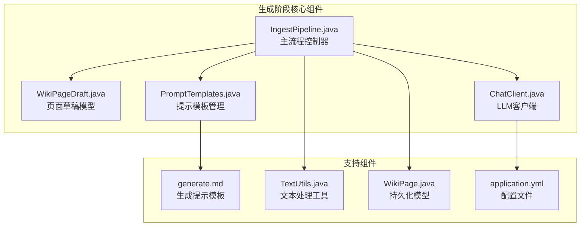
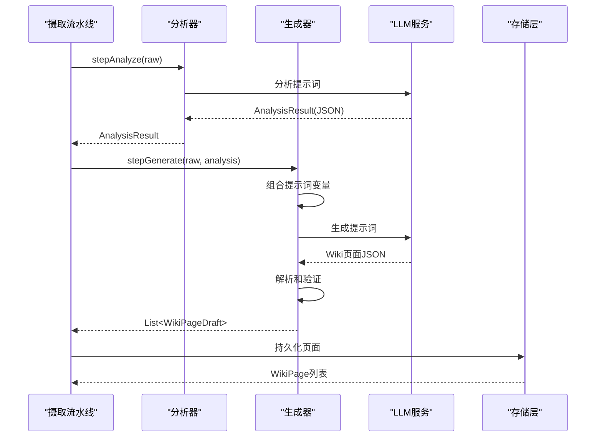
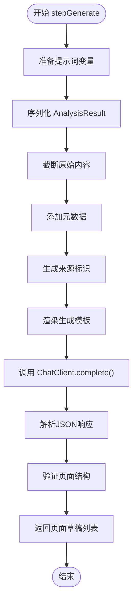
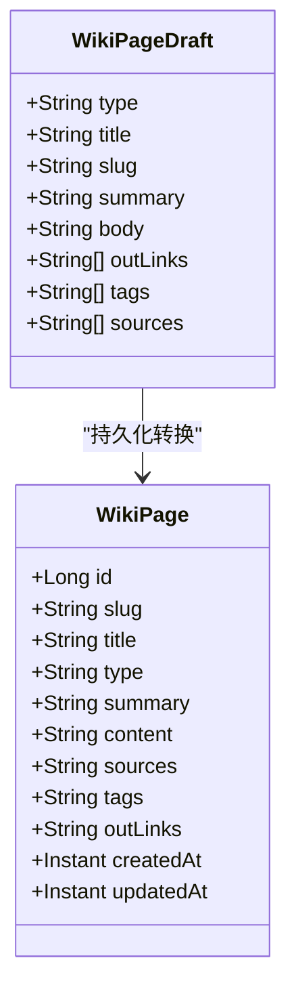
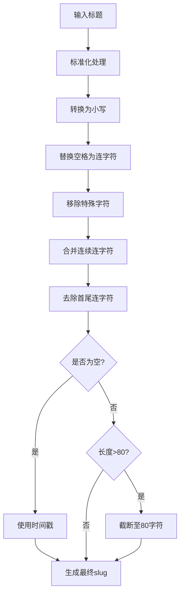
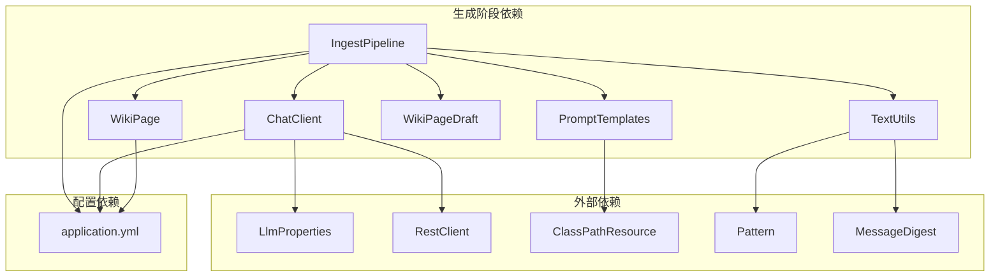

# 生成阶段

<cite>
**本文档引用的文件**
- [IngestPipeline.java](file://src/main/java/com/example/llmwiki/ingest/IngestPipeline.java)
- [WikiPageDraft.java](file://src/main/java/com/example/llmwiki/domain/WikiPageDraft.java)
- [ChatClient.java](file://src/main/java/com/example/llmwiki/llm/ChatClient.java)
- [generate.md](file://src/main/resources/prompts/generate.md)
- [PromptTemplates.java](file://src/main/java/com/example/llmwiki/ingest/PromptTemplates.java)
- [TextUtils.java](file://src/main/java/com/example/llmwiki/util/TextUtils.java)
- [WikiPage.java](file://src/main/java/com/example/llmwiki/domain/WikiPage.java)
- [application.yml](file://src/main/resources/application.yml)
</cite>

## 目录
1. [简介](#简介)
2. [项目结构](#项目结构)
3. [核心组件](#核心组件)
4. [架构概览](#架构概览)
5. [详细组件分析](#详细组件分析)
6. [依赖关系分析](#依赖关系分析)
7. [性能考虑](#性能考虑)
8. [故障排除指南](#故障排除指南)
9. [结论](#结论)

## 简介

生成阶段是摄取流水线的第二阶段，负责使用大型语言模型（LLM）将分析阶段产生的结构化结果转换为多页Wiki页面。该阶段的核心目标是将AnalysisResult和原始内容组合成精心设计的提示词，通过ChatClient.complete()调用获取页面JSON，然后解析和验证页面结构，最终生成高质量的Wiki页面草稿。

生成阶段采用两步式思维链（Chain-of-Thought）架构，与解析阶段和分析阶段形成完整的知识处理流水线。该阶段严格遵循预定义的JSON结构规范，确保生成的页面具有统一的格式和质量标准。

## 项目结构

生成阶段涉及的核心文件组织如下：

**图表来源**
- [IngestPipeline.java:1-251](file://src/main/java/com/example/llmwiki/ingest/IngestPipeline.java#L1-L251)
- [WikiPageDraft.java:1-50](file://src/main/java/com/example/llmwiki/domain/WikiPageDraft.java#L1-L50)
- [ChatClient.java:1-108](file://src/main/java/com/example/llmwiki/llm/ChatClient.java#L1-L108)

**章节来源**
- [IngestPipeline.java:1-251](file://src/main/java/com/example/llmwiki/ingest/IngestPipeline.java#L1-L251)
- [application.yml:1-84](file://src/main/resources/application.yml#L1-L84)

## 核心组件

生成阶段的核心组件包括：

### 1. IngestPipeline.stepGenerate方法
这是生成阶段的主要执行入口，负责：
- 组合AnalysisResult和原始内容为生成提示词
- 调用LLM生成页面JSON
- 解析和验证页面结构
- 创建WikiPageDraft对象列表

### 2. WikiPageDraft数据模型
定义了页面草稿的标准结构，包含：
- type：页面类型（entity/concept/source等）
- title：页面标题
- slug：URL友好的标识符
- summary：页面摘要
- body：Markdown正文内容
- tags：标签列表
- outLinks：外部链接列表
- sources：来源引用列表

### 3. ChatClient.complete()方法
封装了与LLM服务的交互，支持：
- 单轮对话模式
- 多轮对话模式
- 错误处理和重试机制
- OpenAI兼容的API协议

**章节来源**
- [IngestPipeline.java:141-177](file://src/main/java/com/example/llmwiki/ingest/IngestPipeline.java#L141-L177)
- [WikiPageDraft.java:21-49](file://src/main/java/com/example/llmwiki/domain/WikiPageDraft.java#L21-L49)
- [ChatClient.java:37-86](file://src/main/java/com/example/llmwiki/llm/ChatClient.java#L37-L86)

## 架构概览

生成阶段在整个摄取流水线中的位置和作用：

**图表来源**
- [IngestPipeline.java:82-89](file://src/main/java/com/example/llmwiki/ingest/IngestPipeline.java#L82-L89)
- [IngestPipeline.java:141-177](file://src/main/java/com/example/llmwiki/ingest/IngestPipeline.java#L141-L177)

## 详细组件分析

### stepGenerate方法实现详解

#### 提示词构建过程

生成阶段的提示词构建是一个关键的设计环节，涉及以下步骤：

1. **变量准备**：将AnalysisResult序列化为JSON字符串
2. **内容截断**：对原始文本进行长度限制（默认12,000字符）
3. **元数据注入**：添加源类型、显示名称等上下文信息
4. **来源标识**：生成sourceSlug用于标记来源页面

**图表来源**
- [IngestPipeline.java:141-177](file://src/main/java/com/example/llmwiki/ingest/IngestPipeline.java#L141-L177)

#### 页面JSON解析和验证

解析过程严格遵循预定义的JSON结构：

1. **根节点检查**：验证存在"pages"数组
2. **页面遍历**：逐个处理每个页面对象
3. **字段提取**：提取type、title、slug、summary、body等字段
4. **集合处理**：解析tags和out_links数组
5. **来源注入**：添加原始文档的来源引用
6. **完整性验证**：确保至少生成一个页面

#### 错误处理机制

生成阶段实现了多层次的错误处理：

- **JSON解析异常**：捕获并抛出IngestException
- **空页面检测**：确保生成至少一个页面
- **LLM响应验证**：检查JSON结构的有效性
- **系统提示词**：强制LLM输出JSON格式

**章节来源**
- [IngestPipeline.java:141-177](file://src/main/java/com/example/llmwiki/ingest/IngestPipeline.java#L141-L177)
- [IngestPipeline.java:224-243](file://src/main/java/com/example/llmwiki/ingest/IngestPipeline.java#L224-L243)

### WikiPageDraft数据模型详解

WikiPageDraft是生成阶段的核心数据结构，定义了页面的标准属性：

**图表来源**
- [WikiPageDraft.java:21-49](file://src/main/java/com/example/llmwiki/domain/WikiPageDraft.java#L21-L49)
- [WikiPage.java:29-71](file://src/main/java/com/example/llmwiki/domain/WikiPage.java#L29-L71)

#### 字段生成规则

每个字段都有明确的生成规则：

1. **type字段**：从LLM响应中直接获取，默认值为"entity"
2. **title字段**：从LLM响应中获取，用于生成slug和页面标题
3. **slug字段**：通过TextUtils.slugify()处理，确保URL友好性
4. **summary字段**：简短的页面摘要
5. **body字段**：完整的Markdown内容
6. **outLinks字段**：页面间的交叉引用链接
7. **tags字段**：分类标签
8. **sources字段**：原始文档引用

**章节来源**
- [WikiPageDraft.java:21-49](file://src/main/java/com/example/llmwiki/domain/WikiPageDraft.java#L21-L49)

### 页面slug生成算法

slug生成是生成阶段的关键技术之一，确保页面URL的唯一性和可读性：

#### 算法流程

**图表来源**
- [TextUtils.java:46-64](file://src/main/java/com/example/llmwiki/util/TextUtils.java#L46-L64)

#### 唯一性保证机制

虽然生成阶段不直接保证slug的全局唯一性，但通过以下机制确保一致性：

1. **数据库约束**：WikiPage实体定义了slug的唯一性约束
2. **冲突处理**：在持久化阶段自动处理重复slug
3. **回退策略**：空标题时使用时间戳确保唯一性
4. **长度限制**：限制slug最大长度避免过长标识符

**章节来源**
- [TextUtils.java:46-64](file://src/main/java/com/example/llmwiki/util/TextUtils.java#L46-L64)
- [WikiPage.java:35-37](file://src/main/java/com/example/llmwiki/domain/WikiPage.java#L35-L37)

### 提示词设计最佳实践

生成阶段的提示词设计直接影响页面质量，以下是最佳实践：

#### 结构化提示词设计

1. **明确的JSON结构要求**：强制LLM输出JSON格式
2. **严格的字段定义**：明确定义每个字段的用途和格式
3. **约束条件说明**：如页面数量限制、引用规则等
4. **示例和边界情况**：提供具体的使用示例

#### 内容质量控制

1. **来源页面强制生成**：确保每个来源都有对应的摘要页
2. **引用一致性**：slug必须在本次生成的页面或分析阶段的连接中存在
3. **事实准确性**：不杜撰未在原文中出现的事实
4. **结构化写作**：使用中文、简洁、有结构的内容格式

**章节来源**
- [generate.md:1-34](file://src/main/resources/prompts/generate.md#L1-L34)

## 依赖关系分析

生成阶段的组件依赖关系：

**图表来源**
- [IngestPipeline.java:52-63](file://src/main/java/com/example/llmwiki/ingest/IngestPipeline.java#L52-L63)
- [ChatClient.java:30-32](file://src/main/java/com/example/llmwiki/llm/ChatClient.java#L30-L32)

### 组件耦合度分析

生成阶段的组件设计体现了良好的关注点分离：

- **高内聚**：stepGenerate方法专注于生成逻辑
- **低耦合**：通过接口和抽象减少组件间依赖
- **可测试性**：清晰的方法边界便于单元测试
- **可扩展性**：支持不同的LLM提供商和存储后端

**章节来源**
- [IngestPipeline.java:141-177](file://src/main/java/com/example/llmwiki/ingest/IngestPipeline.java#L141-L177)

## 性能考虑

生成阶段的性能优化策略：

### 1. 内容截断优化
- 默认截断长度：12,000字符
- 动态调整：根据LLM能力调整截断长度
- 上下文保留：优先保留重要信息

### 2. 缓存机制
- 模板缓存：PromptTemplates缓存已加载的模板
- 增量处理：跳过未变更的内容

### 3. 并发控制
- 单线程执行：避免LLM资源竞争
- 重试机制：配置最大重试次数

**章节来源**
- [IngestPipeline.java:50](file://src/main/java/com/example/llmwiki/ingest/IngestPipeline.java#L50)
- [application.yml:75-76](file://src/main/resources/application.yml#L75-L76)

## 故障排除指南

### 常见问题及解决方案

#### 1. LLM响应格式问题
**症状**：解析JSON失败
**原因**：LLM输出包含Markdown代码块包装
**解决**：使用stripJson方法移除外层包装

#### 2. 页面生成失败
**症状**：未生成任何页面
**原因**：LLM拒绝生成或响应为空
**解决**：检查提示词设计和LLM配置

#### 3. slug冲突
**症状**：数据库唯一性约束失败
**原因**：重复的slug标识符
**解决**：检查slug生成算法和去重逻辑

#### 4. API密钥配置错误
**症状**：ChatClient抛出配置异常
**原因**：未正确设置API密钥
**解决**：检查application.yml配置

**章节来源**
- [IngestPipeline.java:224-243](file://src/main/java/com/example/llmwiki/ingest/IngestPipeline.java#L224-L243)
- [ChatClient.java:52-54](file://src/main/java/com/example/llmwiki/llm/ChatClient.java#L52-L54)

### 错误恢复机制

生成阶段实现了多层次的错误恢复：

1. **异常传播**：所有错误都转换为IngestException
2. **状态报告**：通过ProgressEvent报告错误状态
3. **配置检查**：运行时验证关键配置参数
4. **降级处理**：在部分功能失效时提供基本功能

**章节来源**
- [IngestPipeline.java:170-175](file://src/main/java/com/example/llmwiki/ingest/IngestPipeline.java#L170-L175)

## 结论

生成阶段通过精心设计的提示词工程和严格的JSON解析机制，成功地将分析阶段的结构化结果转换为高质量的多页Wiki页面。该阶段的关键优势包括：

1. **结构化输出**：通过强制JSON格式确保输出一致性
2. **质量控制**：严格的字段验证和约束检查
3. **错误处理**：完善的异常处理和恢复机制
4. **可扩展性**：模块化的组件设计支持未来扩展

通过持续优化提示词设计和增强错误处理机制，生成阶段能够稳定地产出符合预期的Wiki页面，为后续的索引和图谱构建奠定坚实基础。